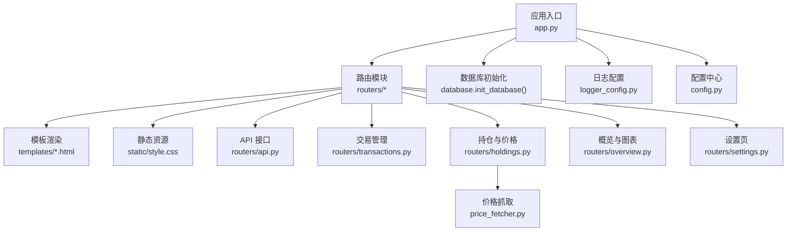
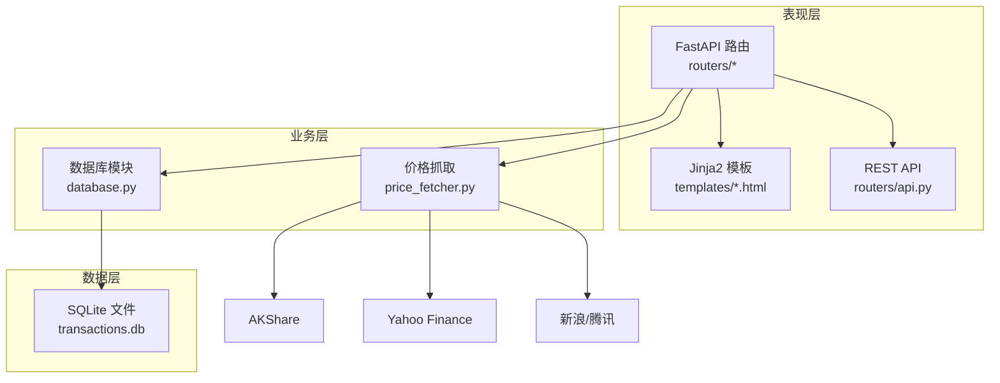
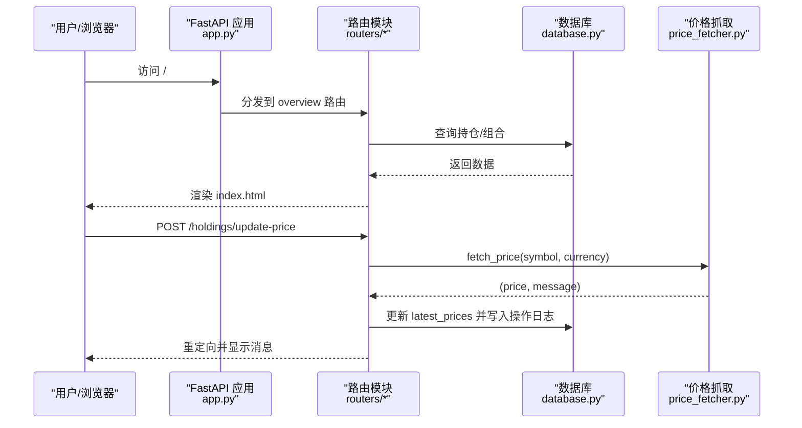
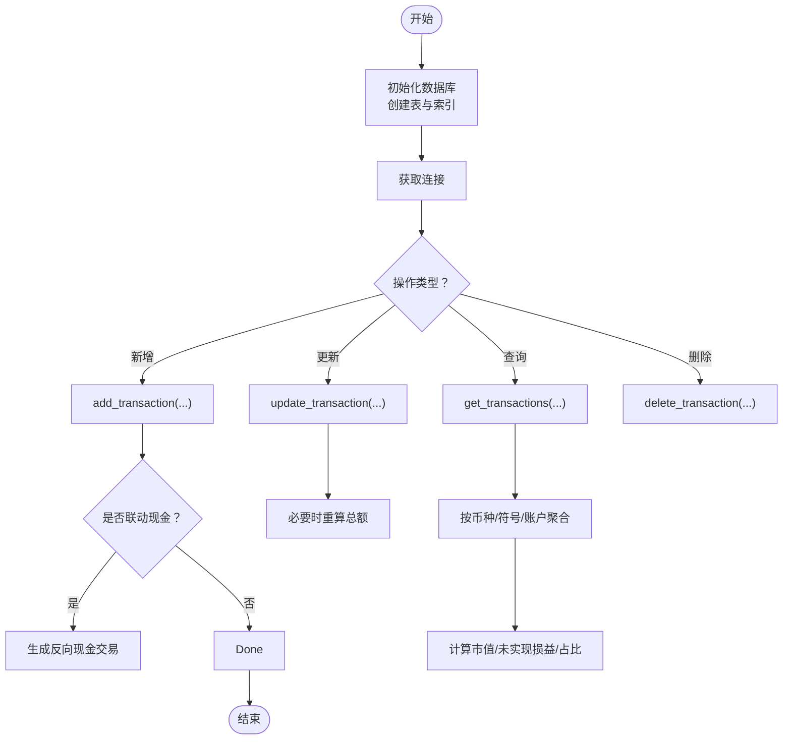
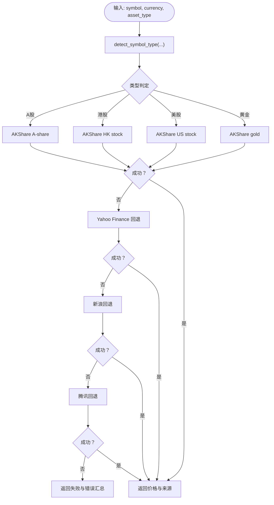
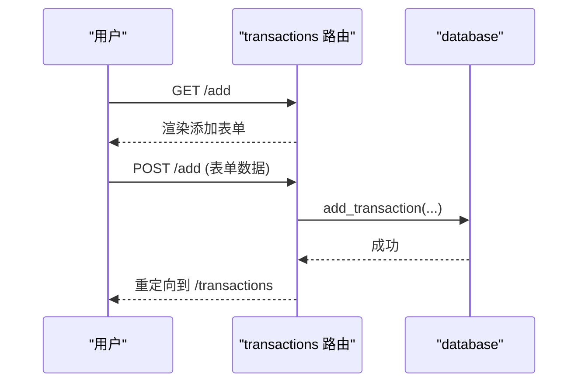
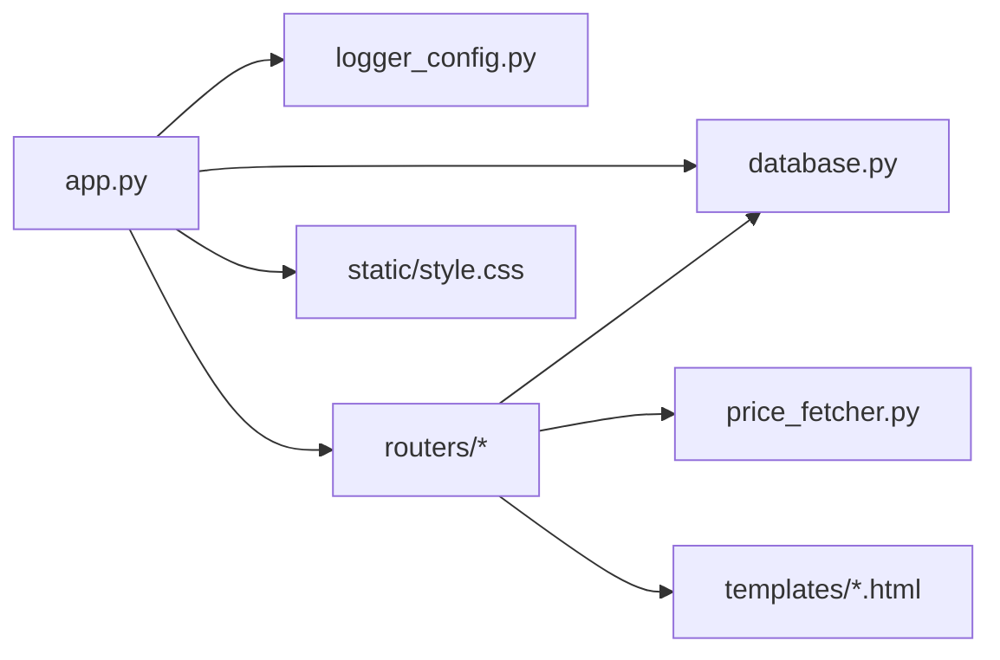

# 开发者指南

<cite>
**本文引用的文件**
- [app.py](file://app.py)
- [config.py](file://config.py)
- [database.py](file://database.py)
- [logger_config.py](file://logger_config.py)
- [price_fetcher.py](file://price_fetcher.py)
- [requirements.txt](file://requirements.txt)
- [.gitignore](file://.gitignore)
- [routers/api.py](file://routers/api.py)
- [routers/holdings.py](file://routers/holdings.py)
- [routers/transactions.py](file://routers/transactions.py)
- [routers/overview.py](file://routers/overview.py)
- [routers/settings.py](file://routers/settings.py)
- [routers/utils.py](file://routers/utils.py)
- [templates/base.html](file://templates/base.html)
- [templates/index.html](file://templates/index.html)
- [static/style.css](file://static/style.css)
</cite>

## 目录
1. [简介](#简介)
2. [项目结构](#项目结构)
3. [核心组件](#核心组件)
4. [架构总览](#架构总览)
5. [详细组件分析](#详细组件分析)
6. [依赖关系分析](#依赖关系分析)
7. [性能考虑](#性能考虑)
8. [故障排查指南](#故障排查指南)
9. [结论](#结论)
10. [附录](#附录)

## 简介
本指南面向希望参与投资日志管理系统开发的工程师，覆盖从开发环境搭建、代码贡献规范、命名与注释标准、测试策略、扩展开发、代码审查清单、性能优化与安全实践，到常用开发工具与IDE配置、调试环境搭建以及常见问题解决方案。系统采用 FastAPI + SQLite + Jinja2 模板，提供交易记录、持仓计算、价格抓取与图表展示等能力。

## 项目结构
- 应用入口与路由组织
  - 应用入口：app.py 负责初始化 FastAPI、挂载静态资源、启动数据库初始化、注册各路由模块。
  - 路由模块：routers 下按功能拆分，如 overview、transactions、holdings、settings、api 等。
  - 模板与样式：templates 提供页面模板，static 提供样式文件。
- 数据层
  - config.py 定义数据库路径（默认 iCloud 同步目录），支持通过环境变量覆盖。
  - database.py 提供 SQLite 初始化、事务 CRUD、查询、账户与资产类别管理、组合配置、操作日志与最新价格表等。
- 外部服务
  - price_fetcher.py 提供多数据源价格抓取（AKShare、Yahoo Finance、新浪、腾讯）与回退机制。
- 日志
  - logger_config.py 配置每日轮转的日志文件与控制台输出。

**图示来源**
- [app.py](file://app.py#L13-L29)
- [routers/api.py](file://routers/api.py#L6-L67)
- [routers/transactions.py](file://routers/transactions.py#L8-L75)
- [routers/holdings.py](file://routers/holdings.py#L11-L207)
- [routers/overview.py](file://routers/overview.py#L6-L28)
- [routers/settings.py](file://routers/settings.py#L9-L148)
- [price_fetcher.py](file://price_fetcher.py#L1-L405)
- [logger_config.py](file://logger_config.py#L14-L53)
- [config.py](file://config.py#L10-L24)

**章节来源**
- [app.py](file://app.py#L13-L29)
- [routers/utils.py](file://routers/utils.py#L1-L4)
- [templates/base.html](file://templates/base.html#L1-L27)
- [static/style.css](file://static/style.css)

## 核心组件
- 应用入口与生命周期
  - 初始化 FastAPI 实例，挂载静态资源，启动时调用数据库初始化，注册各路由。
- 配置中心
  - 默认数据库路径位于 iCloud 投资日志目录，可通过环境变量覆盖，确保本地开发可灵活切换。
- 数据库层
  - 表结构：transactions、accounts、symbols、allocation_settings、asset_types、operation_logs、latest_prices。
  - 功能：事务增删改查、按条件查询、持仓汇总、按币种/资产类别分组、组合配置、操作日志、最新价格维护。
- 价格抓取
  - 自动识别标的类型（A股、港股、美股、黄金、债券、现金），按优先级尝试多个数据源，失败回退。
- 日志
  - 每日轮转保留7天日志，同时输出到控制台，便于开发与运维定位问题。

**章节来源**
- [app.py](file://app.py#L13-L29)
- [config.py](file://config.py#L10-L24)
- [database.py](file://database.py#L22-L151)
- [price_fetcher.py](file://price_fetcher.py#L36-L67)
- [logger_config.py](file://logger_config.py#L14-L53)

## 架构总览
系统采用分层架构：
- 表现层：FastAPI 路由 + Jinja2 模板渲染，提供 HTML 页面与 REST API。
- 业务层：路由处理请求参数、调用数据库模块执行业务逻辑。
- 数据访问层：SQLite 持久化，提供连接、建表、索引、CRUD 与聚合查询。
- 外部集成：价格抓取模块对接多数据源，具备失败回退与日志记录。

**图示来源**
- [routers/holdings.py](file://routers/holdings.py#L102-L148)
- [routers/transactions.py](file://routers/transactions.py#L45-L75)
- [database.py](file://database.py#L15-L151)
- [price_fetcher.py](file://price_fetcher.py#L325-L402)

## 详细组件分析

### 应用入口与生命周期
- 初始化 FastAPI、挂载静态资源、启动数据库初始化、注册路由。
- 支持直接运行作为本地开发服务器。

**图示来源**
- [app.py](file://app.py#L13-L29)
- [routers/overview.py](file://routers/overview.py#L8-L17)
- [routers/holdings.py](file://routers/holdings.py#L102-L148)
- [database.py](file://database.py#L15-L151)
- [price_fetcher.py](file://price_fetcher.py#L325-L402)

**章节来源**
- [app.py](file://app.py#L13-L34)

### 数据库模块（database.py）
- 连接与初始化
  - 获取连接并启用 Row 工厂；初始化表与索引；迁移兼容字段。
- 事务管理
  - 新增、查询、更新（含动态字段与金额重算）、删除。
- 持仓与收益
  - 按账户/币种/资产类别汇总；按币种/符号分组计算市值、未实现损益与占比。
- 账户与资产类别
  - 账户增删查；资产类别增删查；删除前检查是否被使用。
- 组合配置
  - 币种+资产类别的最小/最大比例配置，用于告警提示。
- 操作日志与最新价格
  - 记录价格更新、手动更新、失败等操作；维护 latest_prices 表。

**图示来源**
- [database.py](file://database.py#L22-L151)
- [database.py](file://database.py#L158-L225)
- [database.py](file://database.py#L294-L341)
- [database.py](file://database.py#L344-L463)

**章节来源**
- [database.py](file://database.py#L15-L151)
- [database.py](file://database.py#L158-L225)
- [database.py](file://database.py#L294-L463)

### 价格抓取模块（price_fetcher.py）
- 符号类型识别：根据币种与格式判断 A 股、港股、美股、黄金、债券、现金。
- 多源回退：优先 AKShare，其次 Yahoo Finance，再尝试新浪/腾讯。
- 错误处理：捕获异常并记录日志，返回统一错误信息。

**图示来源**
- [price_fetcher.py](file://price_fetcher.py#L36-L67)
- [price_fetcher.py](file://price_fetcher.py#L325-L402)

**章节来源**
- [price_fetcher.py](file://price_fetcher.py#L36-L67)
- [price_fetcher.py](file://price_fetcher.py#L325-L402)

### 路由与页面交互
- 概览与图表：首页展示按币种分组的资产配置与图表，图表页按币种/符号展示详情。
- 交易管理：列表分页、添加交易表单提交、联动现金交易。
- 持仓与价格：按符号查看交易明细、批量更新价格、手动更新价格、快捷交易。
- 设置：配置组合范围、资产类别与账户管理。

**图示来源**
- [routers/transactions.py](file://routers/transactions.py#L30-L75)
- [database.py](file://database.py#L158-L225)

**章节来源**
- [routers/overview.py](file://routers/overview.py#L8-L28)
- [routers/transactions.py](file://routers/transactions.py#L10-L75)
- [routers/holdings.py](file://routers/holdings.py#L13-L207)
- [routers/settings.py](file://routers/settings.py#L11-L148)

## 依赖关系分析
- 运行时依赖
  - FastAPI、Uvicorn、Jinja2、python-multipart、AkShare。
- 内部模块耦合
  - app.py 依赖 database、logger_config、routers/*。
  - 各路由依赖 database 与 price_fetcher。
  - 模板依赖静态资源与路由提供的上下文数据。

**图示来源**
- [app.py](file://app.py#L7-L11)
- [routers/holdings.py](file://routers/holdings.py#L1-L10)
- [requirements.txt](file://requirements.txt#L1-L6)

**章节来源**
- [requirements.txt](file://requirements.txt#L1-L6)
- [app.py](file://app.py#L7-L11)

## 性能考虑
- 数据库
  - 为 symbol、date、account、type、currency、asset_type 建立索引，提升查询效率。
  - 使用 Row 工厂简化结果访问；避免一次性加载过多数据，结合分页与 limit。
- 价格抓取
  - 优先使用本地可用的数据源；对失败进行回退；限制超时时间，避免阻塞。
- 模板渲染
  - 控制单页数据量，避免在模板中做复杂计算；将聚合逻辑前置到后端。

[本节为通用指导，无需列出具体文件来源]

## 故障排查指南
- 日志定位
  - 查看 logs/app.log（每日轮转），关注 INFO/ERROR 级别日志，定位价格抓取失败、交易增删改异常等。
- 数据库问题
  - 确认数据库路径与权限；检查 transactions.db 是否存在；必要时删除或迁移。
- 价格抓取失败
  - 检查网络连通性与数据源可用性；确认符号格式与币种匹配；查看回退链路是否生效。
- 路由与模板
  - 确认路由注册顺序与 URL 路径；检查模板上下文变量是否正确传入。

**章节来源**
- [logger_config.py](file://logger_config.py#L14-L53)
- [.gitignore](file://.gitignore#L1-L2)
- [config.py](file://config.py#L10-L24)

## 结论
本项目以清晰的分层设计与模块化路由实现了交易与持仓管理的核心能力，配合 SQLite 的轻量存储与多数据源价格抓取，满足个人投资记录与可视化分析需求。建议在后续迭代中完善测试体系、增强错误恢复与监控告警，并持续优化查询与渲染性能。

[本节为总结性内容，无需列出具体文件来源]

## 附录

### A. 开发环境设置与调试
- 安装依赖
  - 使用 pip 安装 requirements.txt 中声明的包。
- 运行方式
  - 直接运行 app.py 启动本地开发服务器；或使用 uvicorn 指定主机与端口。
- 数据库路径
  - 默认位于 iCloud 投资日志目录；可通过环境变量覆盖以便本地开发。
- 日志
  - 启动后会在 logs 目录生成按日轮转的日志文件。

**章节来源**
- [requirements.txt](file://requirements.txt#L1-L6)
- [app.py](file://app.py#L31-L34)
- [config.py](file://config.py#L21-L24)
- [logger_config.py](file://logger_config.py#L14-L53)

### B. 代码贡献规范
- 命名约定
  - 模块与函数：小写下划线命名；常量使用全大写。
  - 类型注解：为函数参数与返回值提供明确类型注解。
- 注释标准
  - 模块顶部提供简要描述；复杂函数提供行为说明与返回值含义。
  - 对外接口（API）需标注请求参数、响应结构与错误码。
- 提交规范
  - 提交信息清晰描述变更目的与影响范围；涉及数据库结构变更需附迁移说明。

[本节为通用规范，无需列出具体文件来源]

### C. 测试策略
- 单元测试
  - 针对 database 的 CRUD 与聚合函数编写测试，覆盖边界条件与异常路径。
  - 针对 price_fetcher 的符号识别与回退逻辑编写测试，模拟不同网络与数据源状态。
- 集成测试
  - 路由层与数据库层联调，验证交易添加、持仓计算、价格更新流程。
- 端到端测试
  - 使用自动化测试框架（如 pytest + httpx）模拟浏览器行为，覆盖关键页面与交互流程。

[本节为通用指导，无需列出具体文件来源]

### D. 扩展开发指南
- 新增功能模块
  - 在 routers 下新增模块并注册到 app.py；在 templates 下新增模板并在路由中渲染。
  - 在 database.py 中补充必要的表与查询函数，并添加索引。
- 修改现有功能
  - 保持对外接口稳定；对新增字段进行兼容处理（如历史表结构迁移）。
- 第三方集成
  - 将外部服务封装为独立模块（如新的价格源），遵循现有回退与日志规范。

[本节为通用指导，无需列出具体文件来源]

### E. 代码审查清单
- 正确性
  - 参数校验与边界处理；事务一致性与幂等性。
- 可维护性
  - 函数职责单一；错误处理与日志完整；类型注解齐全。
- 性能
  - 查询语句带索引；避免 N+1 查询；合理分页与缓存。
- 安全
  - 输入过滤与转义；避免 SQL 注入；敏感信息不泄露。

[本节为通用清单，无需列出具体文件来源]

### F. 性能优化建议
- 数据库
  - 为高频查询列建立索引；减少 SELECT *，按需查询列。
- 价格抓取
  - 缓存最近获取的价格；批量更新时去重与限流。
- 前端
  - 图表按需渲染；模板中避免重复计算。

[本节为通用指导，无需列出具体文件来源]

### G. 安全编码实践
- 输入校验
  - 对用户输入进行白名单校验与长度限制。
- 错误处理
  - 不向客户端暴露内部错误细节；统一错误响应格式。
- 日志
  - 避免记录敏感信息；控制日志级别与保留周期。

[本节为通用指导，无需列出具体文件来源]

### H. 开发工具与 IDE 配置
- Python 版本与虚拟环境
  - 使用 Python 3.10+，建议使用 venv 或 conda 创建隔离环境。
- IDE 推荐
  - VS Code（Python 扩展、Pylance、Black、Flake8 插件）。
- 调试
  - 使用断点调试 FastAPI 路由；结合日志定位问题。
- 格式化与检查
  - 使用 Black 统一格式；使用 Flake8/Pyflakes 检查语法与风格。

[本节为通用指导，无需列出具体文件来源]

### I. 快速上手指南
- 克隆仓库并安装依赖
- 设置数据库路径（可选）
- 启动应用并访问 http://127.0.0.1:8000
- 通过 /add 添加第一条交易，随后在 /holdings 查看持仓与价格更新

**章节来源**
- [requirements.txt](file://requirements.txt#L1-L6)
- [app.py](file://app.py#L31-L34)
- [routers/transactions.py](file://routers/transactions.py#L30-L43)
- [routers/holdings.py](file://routers/holdings.py#L102-L148)

### J. 常见问题与解决方案
- 无法连接数据库
  - 检查 DB_PATH 权限与路径；确认 iCloud 同步状态。
- 价格抓取失败
  - 检查网络与数据源可用性；确认符号格式；查看日志中的回退链路。
- 页面空白或模板报错
  - 检查模板变量是否传入；确认静态资源路径与样式文件存在。

**章节来源**
- [config.py](file://config.py#L10-L24)
- [price_fetcher.py](file://price_fetcher.py#L325-L402)
- [templates/base.html](file://templates/base.html#L1-L27)
- [static/style.css](file://static/style.css)