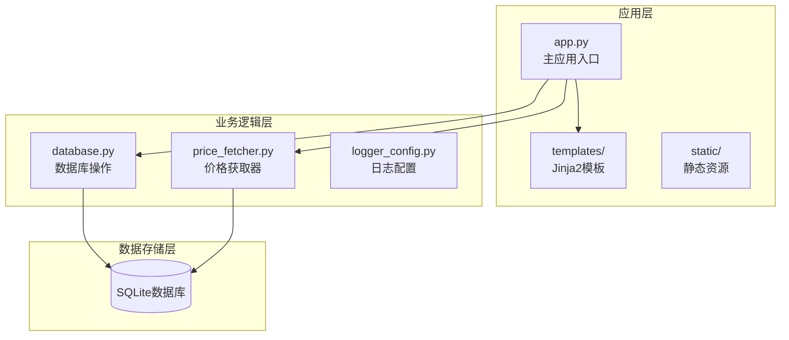
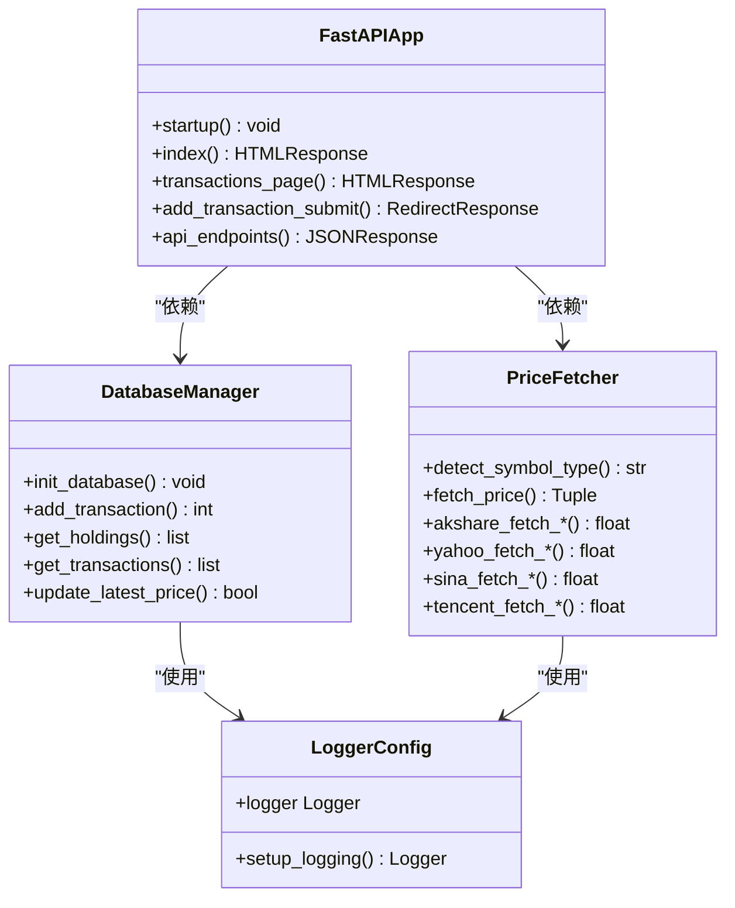
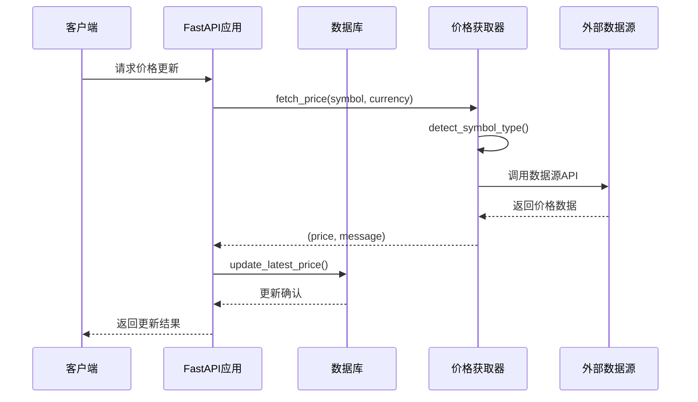
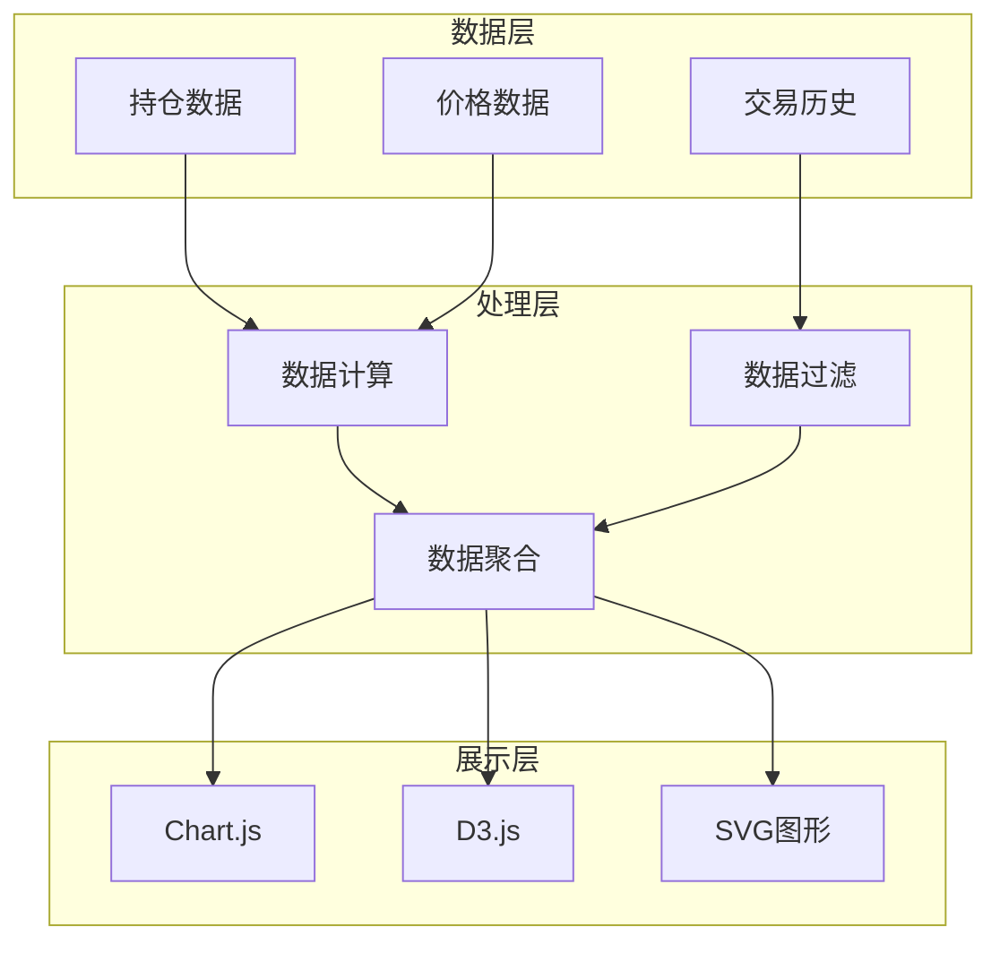
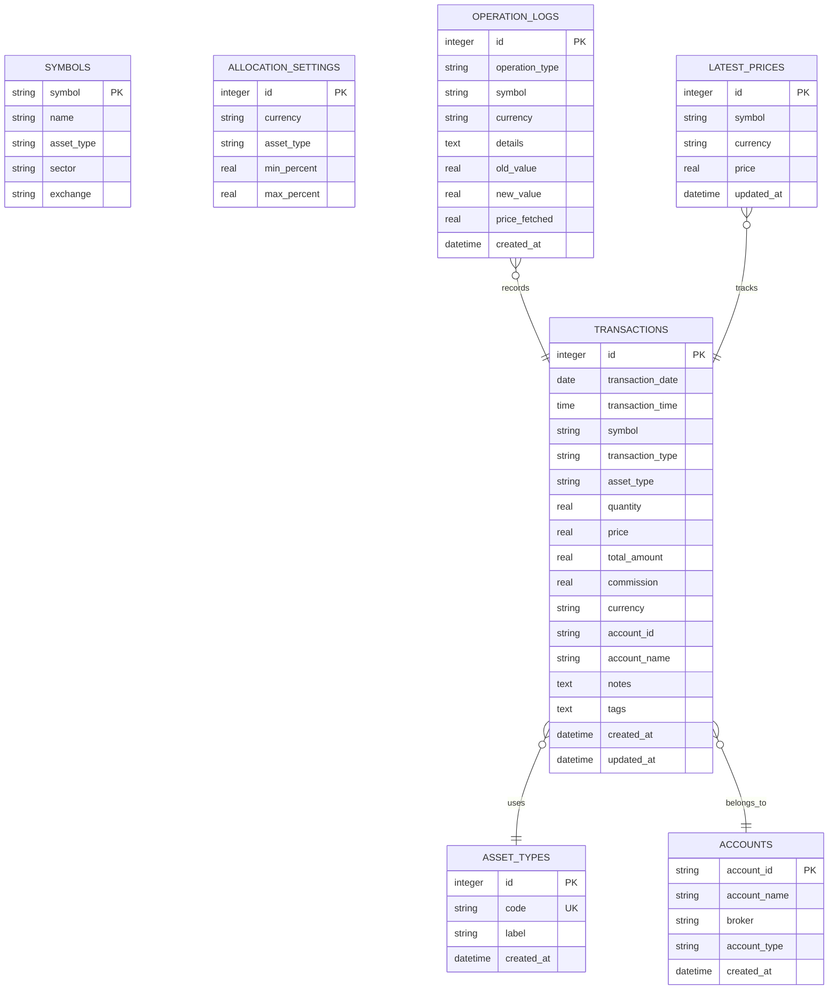
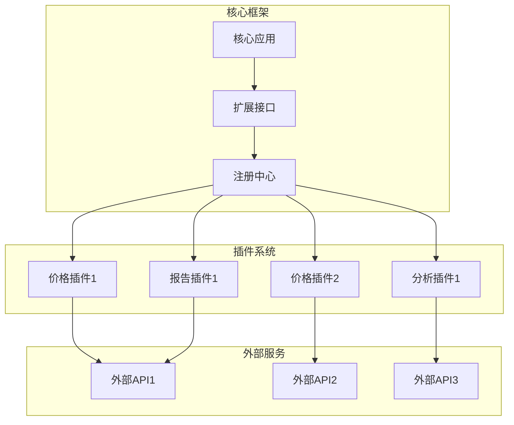
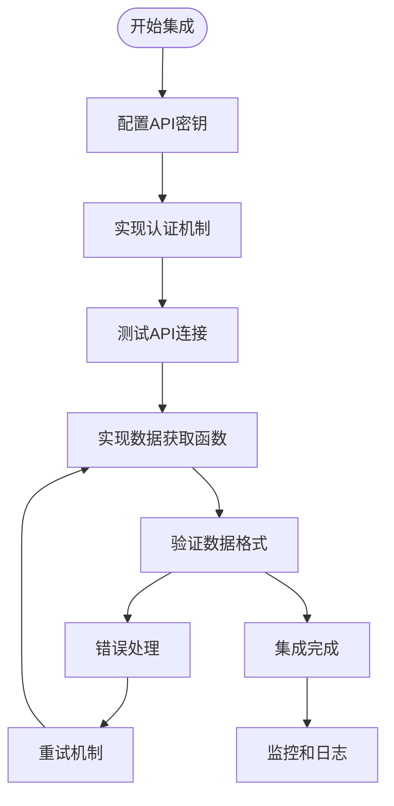
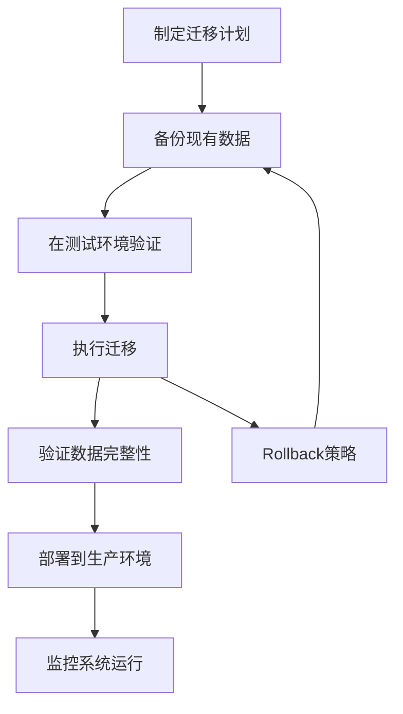

# 扩展开发指南

<cite>
**本文档引用的文件**
- [app.py](file://app.py)
- [price_fetcher.py](file://price_fetcher.py)
- [database.py](file://database.py)
- [requirements.txt](file://requirements.txt)
- [logger_config.py](file://logger_config.py)
- [templates/base.html](file://templates/base.html)
- [templates/index.html](file://templates/index.html)
- [templates/settings.html](file://templates/settings.html)
- [templates/charts.html](file://templates/charts.html)
- [templates/holdings.html](file://templates/holdings.html)
</cite>

## 目录
1. [简介](#简介)
2. [项目结构概览](#项目结构概览)
3. [核心组件架构](#核心组件架构)
4. [价格数据源扩展](#价格数据源扩展)
5. [交易类型扩展](#交易类型扩展)
6. [资产类型扩展](#资产类型扩展)
7. [自定义报表和图表开发](#自定义报表和图表开发)
8. [API接口扩展](#api接口扩展)
9. [数据库Schema扩展](#数据库schema扩展)
10. [插件开发模式](#插件开发模式)
11. [第三方集成方法](#第三方集成方法)
12. [迁移策略](#迁移策略)
13. [故障排除指南](#故障排除指南)
14. [总结](#总结)

## 简介

Invest Log 是一个基于 Python 的投资组合管理 Web 应用程序，使用 FastAPI 框架构建。该应用程序提供了完整的投资交易记录、实时价格获取、投资组合分析和可视化功能。本文档旨在为开发者提供详细的扩展开发指南，涵盖从基础功能扩展到高级定制化的完整开发流程。

## 项目结构概览

项目采用模块化设计，主要由以下核心组件构成：



**图表来源**
- [app.py](file://app.py#L1-L50)
- [database.py](file://database.py#L1-L50)
- [price_fetcher.py](file://price_fetcher.py#L1-L30)

**章节来源**
- [app.py](file://app.py#L1-L50)
- [database.py](file://database.py#L1-L50)
- [price_fetcher.py](file://price_fetcher.py#L1-L30)

## 核心组件架构

### 应用架构图



**图表来源**
- [app.py](file://app.py#L19-L30)
- [database.py](file://database.py#L20-L50)
- [price_fetcher.py](file://price_fetcher.py#L36-L63)
- [logger_config.py](file://logger_config.py#L14-L54)

### 数据流架构



**图表来源**
- [app.py](file://app.py#L216-L262)
- [price_fetcher.py](file://price_fetcher.py#L321-L394)
- [database.py](file://database.py#L779-L800)

## 价格数据源扩展

### 当前支持的数据源

系统当前支持四种价格数据源，按优先级顺序排列：

1. **AKShare** - 主要数据源，支持 A 股、港股、美股和黄金
2. **Yahoo Finance** - 备用数据源，主要用于美股和黄金
3. **Sina Finance API** - 备用数据源，支持 A 股和港股
4. **Tencent Finance API** - 备用数据源，支持 A 股、港股和美股

### 扩展新数据源的步骤

#### 步骤 1：添加数据源检测逻辑

在 `price_fetcher.py` 中的 `detect_symbol_type` 函数中添加新的符号类型识别规则：

```python
# 在 detect_symbol_type 函数中添加新的识别规则
elif currency == 'XXX' and re.match(r'^YOUR_PATTERN$', symbol):
    return 'your_new_type'
```

#### 步骤 2：实现数据源访问函数

在相应区域添加新的数据源访问函数：

```python
def your_source_fetch_function(symbol: str) -> Optional[float]:
    """从新数据源获取价格"""
    try:
        # 实现数据获取逻辑
        return price
    except Exception as e:
        logger.debug(f"数据源错误: {e}")
    return None
```

#### 步骤 3：更新主获取函数

修改 `fetch_price` 函数中的 `fetch_attempts` 列表，添加新的数据源：

```python
elif symbol_type == 'your_new_type':
    fetch_attempts = [
        ("AKShare", lambda: akshare_fetch_your_type(symbol)),
        ("Yahoo Finance", lambda: yahoo_fetch_your_type(symbol)),
        ("Sina Finance", lambda: sina_fetch_your_type(symbol)),
        ("Tencent Finance", lambda: tencent_fetch_your_type(symbol)),
        ("Your Source", lambda: your_source_fetch_function(symbol)),  # 新增
    ]
```

#### 步骤 4：处理货币转换

如果需要货币转换，在数据获取后添加转换逻辑：

```python
# 示例：从美元转换为人民币
if currency == 'CNY' and source_currency == 'USD':
    price = price * exchange_rate
```

**章节来源**
- [price_fetcher.py](file://price_fetcher.py#L36-L63)
- [price_fetcher.py](file://price_fetcher.py#L321-L394)

## 交易类型扩展

### 支持的交易类型

系统当前支持以下交易类型：

- `BUY` - 买入
- `SELL` - 卖出  
- `DIVIDEND` - 分红
- `SPLIT` - 拆股
- `TRANSFER_IN` - 转入
- `TRANSFER_OUT` - 转出
- `ADJUST` - 价值调整

### 扩展新交易类型的步骤

#### 步骤 1：更新数据库约束

在 `database.py` 中更新交易表的检查约束：

```python
# 在 transactions 表定义中添加新的交易类型
cursor.execute("""
    CREATE TABLE IF NOT EXISTS transactions (
        id INTEGER PRIMARY KEY AUTOINCREMENT,
        transaction_date DATE NOT NULL,
        transaction_time TIME,
        symbol TEXT NOT NULL,
        transaction_type TEXT NOT NULL CHECK(transaction_type IN ('BUY', 'SELL', 'DIVIDEND', 'SPLIT', 'TRANSFER_IN', 'TRANSFER_OUT', 'ADJUST', 'NEW_TYPE')),
        asset_type TEXT DEFAULT 'stock' CHECK(asset_type IN ('stock', 'bond', 'metal', 'cash')),
        quantity REAL NOT NULL,
        price REAL NOT NULL,
        total_amount REAL NOT NULL,
        commission REAL DEFAULT 0,
        currency TEXT DEFAULT 'CNY' CHECK(currency IN ('CNY', 'USD', 'HKD')),
        account_id TEXT NOT NULL,
        account_name TEXT,
        notes TEXT,
        tags TEXT,
        created_at DATETIME DEFAULT CURRENT_TIMESTAMP,
        updated_at DATETIME
    )
""")
```

#### 步骤 2：更新前端表单

在相关模板文件中添加新的交易类型选项：

```html
<!-- 在 holdings.html 中的交易类型选择框 -->
<option value="NEW_TYPE">新类型</option>
```

#### 步骤 3：更新计算逻辑

根据新交易类型的需求，更新相关的计算逻辑（如收益计算、成本核算等）。

**章节来源**
- [database.py](file://database.py#L26-L46)
- [templates/holdings.html](file://templates/holdings.html#L109-L110)

## 资产类型扩展

### 当前支持的资产类型

系统默认支持以下资产类型：

- `stock` - 股票
- `bond` - 债券  
- `metal` - 贵金属
- `cash` - 现金

### 扩展新资产类型的步骤

#### 步骤 1：更新数据库约束

在 `database.py` 中更新资产类型检查约束：

```python
# 在 transactions 表定义中添加新的资产类型
asset_type TEXT DEFAULT 'stock' CHECK(asset_type IN ('stock', 'bond', 'metal', 'cash', 'NEW_TYPE'))
```

#### 步骤 2：添加资产类型管理功能

通过设置页面动态管理资产类型。用户可以通过 `/settings` 页面添加或删除资产类型。

#### 步骤 3：更新标签映射

在 `database.py` 中更新资产类型标签映射：

```python
ASSET_TYPE_LABELS = {
    'stock': '股票',
    'bond': '债券',
    'metal': '贵金属',
    'cash': '现金',
    'new_type': '新类型'  # 新增
}
```

#### 步骤 4：更新前端显示

在相关模板中添加新的资产类型显示逻辑：

```html
<!-- 在模板中使用资产类型标签 -->
<span class="badge badge-asset-{{ asset_type }}">{{ asset_type_labels[asset_type] }}</span>
```

**章节来源**
- [database.py](file://database.py#L33-L33)
- [database.py](file://database.py#L607-L612)
- [templates/settings.html](file://templates/settings.html#L23-L36)

## 自定义报表和图表开发

### 图表架构

系统使用 Chart.js 进行数据可视化，支持多种图表类型：



**图表来源**
- [templates/index.html](file://templates/index.html#L48-L82)
- [templates/charts.html](file://templates/charts.html#L56-L97)

### 开发自定义图表的步骤

#### 步骤 1：创建新的 API 端点

在 `app.py` 中添加新的数据获取 API：

```python
@app.get("/api/custom-report")
async def custom_report(
    symbol: Optional[str] = None,
    period: str = "monthly"
):
    """获取自定义报表数据"""
    # 实现数据处理逻辑
    return processed_data
```

#### 步骤 2：实现数据处理逻辑

在 `database.py` 中添加相应的查询函数：

```python
def get_custom_report_data(
    symbol: Optional[str] = None,
    period: str = "monthly",
    db_path: str = "transactions.db"
) -> list[dict]:
    """获取自定义报表所需的数据"""
    # 实现复杂的数据查询和处理
    return report_data
```

#### 步骤 3：创建新的模板

创建新的 HTML 模板文件：

```html
<!-- templates/custom_report.html -->



<h1>自定义报表</h1>
<div class="chart-container">
    <canvas id="custom-chart"></canvas>
</div>
<script>
// 实现图表渲染逻辑
</script>

```

#### 步骤 4：集成到导航菜单

在 `templates/base.html` 中添加新的导航链接：

```html
<a href="/custom-report" class="active">Custom Report</a>
```

**章节来源**
- [app.py](file://app.py#L406-L430)
- [database.py](file://database.py#L361-L431)
- [templates/base.html](file://templates/base.html#L13-L19)

## API接口扩展

### 现有 API 接口

系统提供以下主要 API 接口：

| 接口路径 | 方法 | 功能描述 |
|---------|------|----------|
| `/api/holdings` | GET | 获取当前持仓 |
| `/api/holdings-by-currency` | GET | 按货币分组的持仓 |
| `/api/transactions` | GET | 获取交易记录 |
| `/api/portfolio-history` | GET | 投资组合历史数据 |
| `/api/transactions/{id}` | DELETE | 删除交易记录 |

### 扩展新 API 接口的步骤

#### 步骤 1：定义新的路由

在 `app.py` 中添加新的路由定义：

```python
@app.get("/api/new-endpoint")
async def new_api_endpoint(
    param1: str,
    param2: Optional[int] = None
):
    """新 API 端点描述"""
    # 实现业务逻辑
    return result
```

#### 步骤 2：实现业务逻辑

在 `database.py` 中添加相应的数据访问函数：

```python
def get_new_data(
    param1: str,
    param2: Optional[int] = None,
    db_path: str = "transactions.db"
) -> list[dict]:
    """获取新数据的函数"""
    # 实现复杂查询逻辑
    return data
```

#### 步骤 3：添加错误处理

确保 API 具备适当的错误处理机制：

```python
@app.get("/api/new-endpoint")
async def new_api_endpoint(param1: str):
    try:
        data = get_new_data(param1)
        return data
    except Exception as e:
        raise HTTPException(status_code=400, detail=str(e))
```

#### 步骤 4：添加文档注释

为新 API 添加清晰的文档说明：

```python
@app.get("/api/new-endpoint")
async def new_api_endpoint(
    param1: str = Query(..., description="参数1的描述"),
    param2: Optional[int] = Query(None, description="参数2的描述")
):
    """
    新 API 端点
    
    **请求参数:**
    - **param1** - 必填参数，字符串类型
    - **param2** - 可选参数，整数类型
    
    **响应:**
    - 返回处理后的数据对象
    """
    # 实现逻辑
```

**章节来源**
- [app.py](file://app.py#L378-L441)
- [database.py](file://database.py#L262-L310)

## 数据库Schema扩展

### 当前数据库结构



**图表来源**
- [database.py](file://database.py#L26-L147)

### 扩展数据库Schema的步骤

#### 步骤 1：添加新表

在 `init_database()` 函数中添加新表定义：

```python
def init_database(db_path: str = "transactions.db") -> None:
    """初始化数据库结构"""
    conn = get_connection(db_path)
    cursor = conn.cursor()
    
    # 添加新表
    cursor.execute("""
        CREATE TABLE IF NOT EXISTS new_table (
            id INTEGER PRIMARY KEY AUTOINCREMENT,
            name TEXT NOT NULL,
            description TEXT,
            created_at DATETIME DEFAULT CURRENT_TIMESTAMP
        )
    """)
    
    # 创建索引
    cursor.execute("CREATE INDEX IF NOT EXISTS idx_new_table_name ON new_table(name)")
    
    conn.commit()
    conn.close()
```

#### 步骤 2：添加数据访问函数

为新表添加相应的数据访问函数：

```python
def add_new_record(
    name: str,
    description: Optional[str] = None,
    db_path: str = "transactions.db"
) -> int:
    """添加新记录"""
    conn = get_connection(db_path)
    cursor = conn.cursor()
    cursor.execute(
        "INSERT INTO new_table (name, description) VALUES (?, ?)",
        (name, description)
    )
    record_id = cursor.lastrowid
    conn.commit()
    conn.close()
    return record_id
```

#### 步骤 3：更新约束和验证

如果需要，更新相关的约束和验证逻辑：

```python
# 在现有表中添加新列
cursor.execute("ALTER TABLE existing_table ADD COLUMN new_column TEXT")
```

**章节来源**
- [database.py](file://database.py#L20-L149)
- [database.py](file://database.py#L831-L838)

## 插件开发模式

### 插件架构设计



### 插件开发步骤

#### 步骤 1：定义插件接口

创建插件基类和接口定义：

```python
from abc import ABC, abstractmethod
from typing import Dict, Any

class BasePlugin(ABC):
    """插件基类"""
    
    @abstractmethod
    def get_name(self) -> str:
        """返回插件名称"""
        pass
    
    @abstractmethod
    def get_version(self) -> str:
        """返回插件版本"""
        pass
    
    @abstractmethod
    def initialize(self, config: Dict[str, Any]) -> bool:
        """初始化插件"""
        pass
    
    @abstractmethod
    def cleanup(self) -> None:
        """清理插件资源"""
        pass

class PriceSourcePlugin(BasePlugin):
    """价格数据源插件接口"""
    
    @abstractmethod
    def fetch_price(self, symbol: str, currency: str) -> Dict[str, Any]:
        """获取价格数据"""
        pass
    
    @abstractmethod
    def get_supported_symbols(self) -> list[str]:
        """获取支持的符号列表"""
        pass
```

#### 步骤 2：实现具体插件

创建具体的插件实现：

```python
class CustomPriceSource(PriceSourcePlugin):
    """自定义价格数据源插件"""
    
    def __init__(self):
        self.name = "CustomPriceSource"
        self.version = "1.0.0"
        self.config = {}
        self.session = None
    
    def get_name(self) -> str:
        return self.name
    
    def get_version(self) -> str:
        return self.version
    
    def initialize(self, config: Dict[str, Any]) -> bool:
        """初始化插件配置和连接"""
        self.config = config
        try:
            # 建立外部服务连接
            self.session = requests.Session()
            self.session.headers.update(config.get('headers', {}))
            return True
        except Exception as e:
            logger.error(f"插件初始化失败: {e}")
            return False
    
    def cleanup(self) -> None:
        """清理插件资源"""
        if self.session:
            self.session.close()
    
    def fetch_price(self, symbol: str, currency: str) -> Dict[str, Any]:
        """从自定义数据源获取价格"""
        try:
            response = self.session.get(
                f"{self.config['base_url']}/prices/{symbol}",
                params={'currency': currency},
                timeout=self.config.get('timeout', 30)
            )
            response.raise_for_status()
            
            data = response.json()
            return {
                'price': data['price'],
                'timestamp': datetime.now().isoformat(),
                'source': self.name,
                'metadata': data.get('metadata', {})
            }
        except Exception as e:
            logger.error(f"获取价格失败: {e}")
            return {
                'price': None,
                'error': str(e),
                'source': self.name
            }
    
    def get_supported_symbols(self) -> list[str]:
        """获取支持的符号列表"""
        try:
            response = self.session.get(
                f"{self.config['base_url']}/symbols",
                timeout=self.config.get('timeout', 30)
            )
            response.raise_for_status()
            return response.json().get('symbols', [])
        except Exception as e:
            logger.error(f"获取符号列表失败: {e}")
            return []
```

#### 步骤 3：插件注册和管理

实现插件注册和管理功能：

```python
class PluginManager:
    """插件管理器"""
    
    def __init__(self):
        self.plugins = {}
        self.plugin_registry = {}
    
    def register_plugin(self, plugin: BasePlugin) -> bool:
        """注册插件"""
        plugin_name = plugin.get_name()
        if plugin_name in self.plugins:
            logger.warning(f"插件已存在: {plugin_name}")
            return False
        
        if plugin.initialize(self._load_plugin_config(plugin_name)):
            self.plugins[plugin_name] = plugin
            logger.info(f"插件注册成功: {plugin_name}")
            return True
        return False
    
    def unregister_plugin(self, plugin_name: str) -> bool:
        """注销插件"""
        if plugin_name in self.plugins:
            plugin = self.plugins[plugin_name]
            plugin.cleanup()
            del self.plugins[plugin_name]
            logger.info(f"插件注销成功: {plugin_name}")
            return True
        return False
    
    def get_plugin(self, plugin_name: str) -> Optional[BasePlugin]:
        """获取插件实例"""
        return self.plugins.get(plugin_name)
    
    def list_plugins(self) -> list[str]:
        """列出所有已注册插件"""
        return list(self.plugins.keys())
    
    def _load_plugin_config(self, plugin_name: str) -> Dict[str, Any]:
        """加载插件配置"""
        # 从配置文件或环境变量加载插件配置
        return {}
```

#### 步骤 4：集成到主应用

将插件系统集成到主应用中：

```python
# 在 app.py 中添加插件管理
plugin_manager = PluginManager()

@app.on_event("startup")
async def startup_event():
    """应用启动时初始化插件"""
    # 加载配置文件
    with open("plugins.json", "r") as f:
        plugin_configs = json.load(f)
    
    # 注册所有插件
    for plugin_config in plugin_configs:
        plugin_class = globals()[plugin_config['class']]
        plugin_instance = plugin_class()
        plugin_manager.register_plugin(plugin_instance)

@app.get("/api/plugins")
async def list_plugins():
    """获取已注册插件列表"""
    return plugin_manager.list_plugins()

@app.get("/api/plugins/{plugin_name}/price")
async def get_plugin_price(
    plugin_name: str,
    symbol: str,
    currency: str = "CNY"
):
    """从指定插件获取价格"""
    plugin = plugin_manager.get_plugin(plugin_name)
    if not plugin:
        raise HTTPException(status_code=404, detail="插件不存在")
    
    return plugin.fetch_price(symbol, currency)
```

**章节来源**
- [app.py](file://app.py#L25-L30)

## 第三方集成方法

### 集成外部金融服务

#### 集成步骤



#### 实现示例

```python
# 添加新的第三方集成
class ThirdPartyIntegration:
    """第三方金融服务集成"""
    
    def __init__(self, api_key: str, base_url: str):
        self.api_key = api_key
        self.base_url = base_url
        self.session = requests.Session()
        self._setup_session()
    
    def _setup_session(self):
        """配置HTTP会话"""
        self.session.headers.update({
            'Authorization': f'Bearer {self.api_key}',
            'Content-Type': 'application/json',
            'User-Agent': 'InvestLog/1.0'
        })
    
    def fetch_portfolio_data(self, account_id: str) -> Dict[str, Any]:
        """获取投资组合数据"""
        try:
            response = self.session.get(
                f"{self.base_url}/portfolio/{account_id}",
                timeout=30
            )
            response.raise_for_status()
            return response.json()
        except requests.exceptions.RequestException as e:
            logger.error(f"获取投资组合数据失败: {e}")
            raise
    
    def sync_transactions(self, transactions: List[Dict]) -> bool:
        """同步交易记录"""
        try:
            response = self.session.post(
                f"{self.base_url}/transactions/batch",
                json={'transactions': transactions},
                timeout=30
            )
            response.raise_for_status()
            return True
        except requests.exceptions.RequestException as e:
            logger.error(f"同步交易记录失败: {e}")
            return False
    
    def get_supported_markets(self) -> List[str]:
        """获取支持的市场列表"""
        try:
            response = self.session.get(
                f"{self.base_url}/markets",
                timeout=30
            )
            response.raise_for_status()
            return response.json().get('markets', [])
        except requests.exceptions.RequestException as e:
            logger.error(f"获取市场列表失败: {e}")
            return []
```

#### 配置管理

```python
# 配置文件示例 (config.json)
{
    "third_party": {
        "enabled": true,
        "api_key": "YOUR_API_KEY",
        "base_url": "https://api.example.com/v1",
        "timeout": 30,
        "retry_attempts": 3,
        "retry_delay": 5
    }
}

# 在应用中加载配置
def load_third_party_config() -> Dict[str, Any]:
    """加载第三方集成配置"""
    try:
        with open("config.json", "r") as f:
            config = json.load(f)
            return config.get("third_party", {})
    except FileNotFoundError:
        return {"enabled": false}
    except json.JSONDecodeError:
        logger.error("配置文件格式错误")
        return {"enabled": false}
```

**章节来源**
- [price_fetcher.py](file://price_fetcher.py#L23-L34)
- [logger_config.py](file://logger_config.py#L14-L54)

## 迁移策略

### 数据库迁移



### 迁移实现步骤

#### 步骤 1：版本控制

```python
# 在 database.py 中添加版本管理
CURRENT_SCHEMA_VERSION = 1

def migrate_database(db_path: str = "transactions.db") -> bool:
    """执行数据库迁移"""
    conn = get_connection(db_path)
    cursor = conn.cursor()
    
    # 获取当前版本
    try:
        cursor.execute("PRAGMA table_info(schema_versions)")
        current_version = get_schema_version()
    except sqlite3.OperationalError:
        # 初始化版本表
        init_schema_version_table()
        current_version = 0
    
    # 执行迁移
    for version in range(current_version + 1, CURRENT_SCHEMA_VERSION + 1):
        if version in MIGRATION_FUNCTIONS:
            try:
                MIGRATION_FUNCTIONS[version](cursor)
                update_schema_version(version)
                logger.info(f"迁移至版本 {version} 成功")
            except Exception as e:
                logger.error(f"迁移至版本 {version} 失败: {e}")
                conn.rollback()
                return False
    
    conn.commit()
    conn.close()
    return True
```

#### 步骤 2：定义迁移函数

```python
# 定义迁移函数映射
MIGRATION_FUNCTIONS = {
    1: lambda cursor: migrate_to_v1(cursor),
    2: lambda cursor: migrate_to_v2(cursor),
    # ... 更多版本
}

def migrate_to_v1(cursor):
    """迁移至版本1"""
    # 添加新表或字段
    cursor.execute("""
        CREATE TABLE IF NOT EXISTS new_table (
            id INTEGER PRIMARY KEY AUTOINCREMENT,
            name TEXT NOT NULL
        )
    """)

def migrate_to_v2(cursor):
    """迁移至版本2"""
    # 修改现有表结构
    cursor.execute("ALTER TABLE existing_table ADD COLUMN new_column TEXT")
```

#### 步骤 3：向后兼容性

```python
def get_connection_with_migration(db_path: str = "transactions.db"):
    """获取连接并执行必要的迁移"""
    conn = get_connection(db_path)
    cursor = conn.cursor()
    
    # 检查并执行迁移
    if migrate_database(db_path):
        logger.info("数据库迁移完成")
    else:
        logger.error("数据库迁移失败")
        raise Exception("数据库迁移失败")
    
    return conn
```

### 配置迁移

```python
# 配置文件迁移示例
def migrate_config(old_config: Dict) -> Dict:
    """迁移旧配置到新格式"""
    new_config = {
        'database': {
            'path': old_config.get('db_path', 'transactions.db'),
            'backup_enabled': old_config.get('backup', True)
        },
        'logging': {
            'level': old_config.get('log_level', 'INFO'),
            'file': old_config.get('log_file', 'app.log')
        },
        'third_party': {
            'enabled': old_config.get('enable_third_party', False),
            'integrations': []
        }
    }
    
    # 迁移第三方集成配置
    if 'third_party_services' in old_config:
        for service in old_config['third_party_services']:
            new_config['third_party']['integrations'].append({
                'name': service['name'],
                'enabled': service.get('enabled', False),
                'api_key': service.get('api_key', ''),
                'base_url': service.get('base_url', '')
            })
    
    return new_config
```

**章节来源**
- [database.py](file://database.py#L20-L149)
- [database.py](file://database.py#L903-L937)

## 故障排除指南

### 常见问题诊断

#### 问题 1：价格获取失败

**症状**: 价格更新按钮点击后无响应或显示错误

**诊断步骤**:
1. 检查网络连接状态
2. 查看日志文件中的错误信息
3. 验证数据源 API 是否可用

**解决方案**:
```python
# 在 price_fetcher.py 中添加更详细的错误处理
def fetch_price_with_retry(symbol: str, currency: str, max_retries: int = 3) -> Tuple[Optional[float], str]:
    """带重试的价格获取函数"""
    for attempt in range(max_retries):
        try:
            price, message = fetch_price(symbol, currency)
            if price is not None:
                return price, message
            logger.warning(f"第 {attempt + 1} 次尝试失败: {message}")
        except Exception as e:
            logger.error(f"第 {attempt + 1} 次尝试异常: {e}")
        
        if attempt < max_retries - 1:
            time.sleep(2 ** attempt)  # 指数退避
    
    return None, f"所有重试都失败了: 最终错误: {message}"
```

#### 问题 2：数据库连接问题

**症状**: 应用启动时报数据库错误

**诊断步骤**:
1. 检查数据库文件是否存在
2. 验证文件权限
3. 查看磁盘空间

**解决方案**:
```python
def safe_init_database(db_path: str = "transactions.db") -> bool:
    """安全的数据库初始化函数"""
    try:
        # 检查数据库文件权限
        if os.path.exists(db_path):
            if not os.access(db_path, os.R_OK | os.W_OK):
                logger.error(f"数据库文件权限不足: {db_path}")
                return False
        
        # 检查磁盘空间
        statvfs = os.statvfs(os.path.dirname(os.path.abspath(db_path)) or '.')
        free_space = statvfs.f_frsize * statvfs.f_bavail
        if free_space < 1024 * 1024:  # 少于1MB
            logger.error("磁盘空间不足")
            return False
        
        init_database(db_path)
        return True
    except Exception as e:
        logger.error(f"数据库初始化失败: {e}")
        return False
```

#### 问题 3：内存泄漏问题

**症状**: 应用运行时间越长内存占用越大

**诊断步骤**:
1. 使用内存分析工具检查内存使用情况
2. 检查是否有未关闭的数据库连接
3. 验证 HTTP 会话是否正确释放

**解决方案**:
```python
# 确保资源正确释放
class ResourceManager:
    """资源管理器"""
    
    def __init__(self):
        self.resources = []
    
    def add_resource(self, resource):
        """添加资源到管理器"""
        self.resources.append(resource)
    
    def cleanup(self):
        """清理所有资源"""
        for resource in self.resources:
            if hasattr(resource, 'close'):
                try:
                    resource.close()
                except Exception as e:
                    logger.warning(f"资源清理失败: {e}")
            elif hasattr(resource, '__exit__'):
                try:
                    resource.__exit__()
                except Exception as e:
                    logger.warning(f"资源清理失败: {e}")
        self.resources.clear()
```

### 性能优化建议

#### 数据库性能优化

```python
# 添加复合索引以提高查询性能
def optimize_database_performance():
    """优化数据库性能"""
    conn = get_connection()
    cursor = conn.cursor()
    
    # 添加复合索引
    indexes = [
        "CREATE INDEX IF NOT EXISTS idx_transactions_composite ON transactions(symbol, transaction_date, transaction_type)",
        "CREATE INDEX IF NOT EXISTS idx_holdings_composite ON transactions(account_id, currency, asset_type)",
        "CREATE INDEX IF NOT EXISTS idx_latest_prices_composite ON latest_prices(symbol, currency)"
    ]
    
    for index_sql in indexes:
        cursor.execute(index_sql)
    
    conn.commit()
    conn.close()
```

#### 缓存策略

```python
# 实现智能缓存机制
class DataCache:
    """数据缓存管理器"""
    
    def __init__(self, ttl: int = 300):  # 默认5分钟
        self.cache = {}
        self.ttl = ttl
        self.access_times = {}
    
    def get(self, key: str):
        """获取缓存数据"""
        if key in self.cache:
            if time.time() - self.access_times[key] < self.ttl:
                return self.cache[key]
            else:
                # 缓存过期，删除条目
                del self.cache[key]
                del self.access_times[key]
        return None
    
    def set(self, key: str, value):
        """设置缓存数据"""
        self.cache[key] = value
        self.access_times[key] = time.time()
    
    def cleanup_expired(self):
        """清理过期缓存"""
        current_time = time.time()
        expired_keys = [
            key for key, access_time in self.access_times.items()
            if current_time - access_time >= self.ttl
        ]
        
        for key in expired_keys:
            del self.cache[key]
            del self.access_times[key]
```

**章节来源**
- [price_fetcher.py](file://price_fetcher.py#L376-L394)
- [database.py](file://database.py#L140-L147)
- [logger_config.py](file://logger_config.py#L14-L54)

## 总结

Invest Log 提供了一个完整且可扩展的投资组合管理平台。通过本文档的指导，开发者可以：

1. **扩展价格数据源** - 添加新的金融数据提供商
2. **扩展交易类型** - 支持更多复杂的金融产品
3. **扩展资产类型** - 支持新兴投资类别
4. **开发自定义报表** - 创建专业的财务分析工具
5. **扩展现有API** - 构建完整的金融数据生态系统
6. **设计插件架构** - 实现模块化的功能扩展
7. **集成第三方服务** - 连接外部金融数据源
8. **实施迁移策略** - 确保系统的平滑升级

该系统的设计充分考虑了可扩展性和维护性，为未来的功能扩展和技术演进奠定了坚实的基础。通过遵循本文档提供的最佳实践和开发指南，开发者可以快速有效地扩展 Invest Log 的功能，满足各种复杂的投资管理需求。