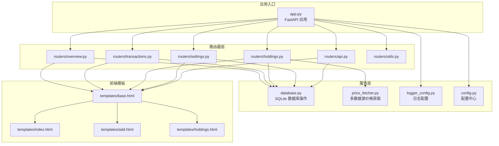
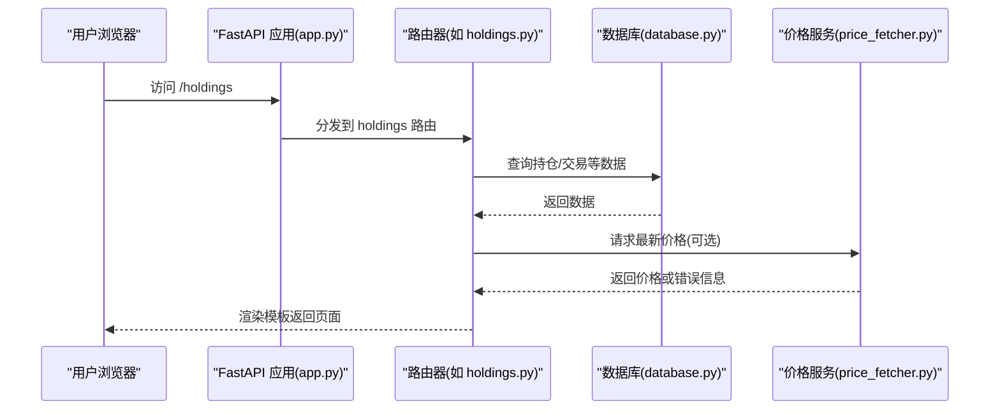
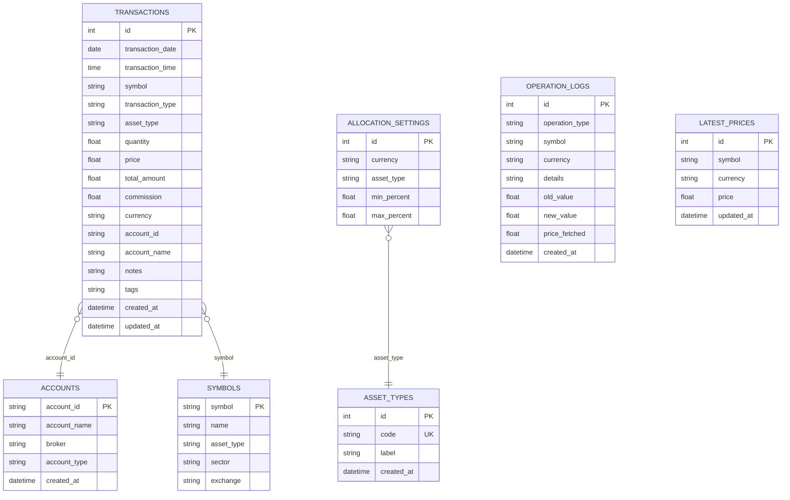
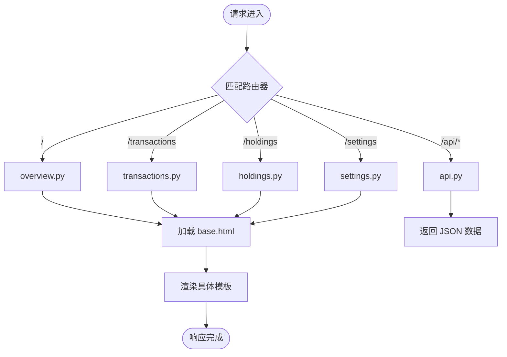
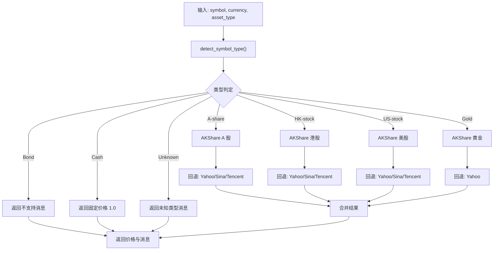
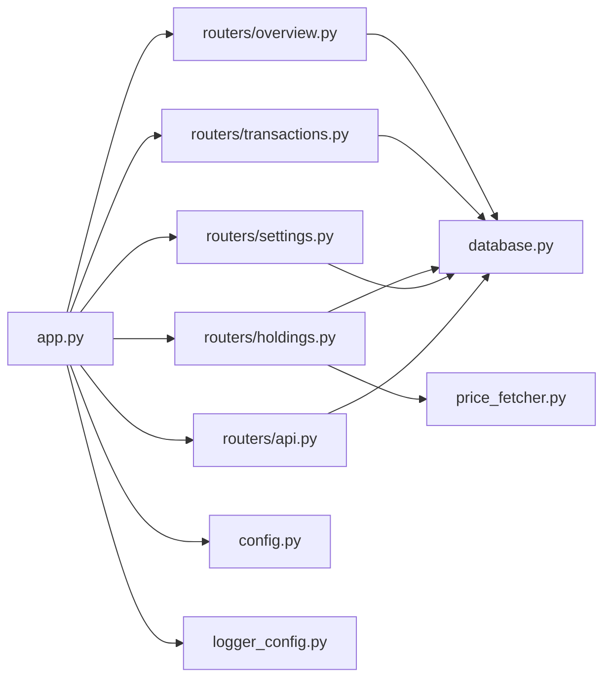

# 扩展开发指南

<cite>
**本文档引用的文件**
- [app.py](file://app.py)
- [config.py](file://config.py)
- [database.py](file://database.py)
- [logger_config.py](file://logger_config.py)
- [price_fetcher.py](file://price_fetcher.py)
- [requirements.txt](file://requirements.txt)
- [routers/api.py](file://routers/api.py)
- [routers/overview.py](file://routers/overview.py)
- [routers/transactions.py](file://routers/transactions.py)
- [routers/holdings.py](file://routers/holdings.py)
- [routers/settings.py](file://routers/settings.py)
- [routers/utils.py](file://routers/utils.py)
- [templates/base.html](file://templates/base.html)
- [templates/index.html](file://templates/index.html)
- [templates/add.html](file://templates/add.html)
- [templates/holdings.html](file://templates/holdings.html)
</cite>

## 目录
1. [简介](#简介)
2. [项目结构](#项目结构)
3. [核心组件](#核心组件)
4. [架构总览](#架构总览)
5. [详细组件分析](#详细组件分析)
6. [依赖关系分析](#依赖关系分析)
7. [性能考虑](#性能考虑)
8. [故障排除指南](#故障排除指南)
9. [结论](#结论)
10. [附录：扩展示例](#附录扩展示例)

## 简介
本指南面向希望在“投资日志管理系统”上进行扩展开发的工程师，目标是帮助你：
- 新增功能模块：包括新路由、数据库表扩展与前端模板添加
- 修改现有功能：数据库迁移、API 接口扩展与业务逻辑调整
- 集成第三方能力：新数据源接入、外部 API 调用与插件化扩展
- 识别扩展点：配置扩展、钩子与事件机制
- 保持向后兼容：版本管理、API 演进与数据迁移策略
- 提供从简单到复杂的扩展示例，快速掌握核心技能

## 项目结构
系统采用 FastAPI + Jinja2 的轻量级 Web 架构，按功能模块拆分路由器，数据持久化基于 SQLite，通过独立的数据库模块统一管理。

**图表来源**
- [app.py](file://app.py#L1-L34)
- [routers/overview.py](file://routers/overview.py#L1-L28)
- [routers/transactions.py](file://routers/transactions.py#L1-L75)
- [routers/holdings.py](file://routers/holdings.py#L1-L207)
- [routers/settings.py](file://routers/settings.py#L1-L148)
- [routers/api.py](file://routers/api.py#L1-L67)
- [routers/utils.py](file://routers/utils.py#L1-L4)
- [database.py](file://database.py#L1-L1047)
- [price_fetcher.py](file://price_fetcher.py#L1-L405)
- [logger_config.py](file://logger_config.py#L1-L54)
- [config.py](file://config.py#L1-L24)
- [templates/base.html](file://templates/base.html#L1-L27)
- [templates/index.html](file://templates/index.html#L1-L90)
- [templates/add.html](file://templates/add.html#L1-L259)
- [templates/holdings.html](file://templates/holdings.html#L1-L274)

**章节来源**
- [app.py](file://app.py#L1-L34)
- [config.py](file://config.py#L1-L24)

## 核心组件
- 应用入口与静态资源挂载：在应用启动时初始化数据库，并挂载静态资源目录
- 路由器模块：按功能划分，分别处理概览、交易、持仓、设置与 API
- 数据库模块：集中定义表结构、索引、迁移逻辑与 CRUD 查询
- 价格获取器：多数据源回退的价格抓取服务
- 日志配置：带时间轮转的日志输出
- 前端模板：Jinja2 模板与基础布局

**章节来源**
- [app.py](file://app.py#L1-L34)
- [database.py](file://database.py#L1-L1047)
- [price_fetcher.py](file://price_fetcher.py#L1-L405)
- [logger_config.py](file://logger_config.py#L1-L54)
- [routers/utils.py](file://routers/utils.py#L1-L4)

## 架构总览
系统采用“路由器 → 数据库/服务 → 模板”的分层设计，API 路由器与页面路由器共享数据库与价格服务；前端通过 Jinja2 渲染模板，静态资源由 FastAPI 提供。

**图表来源**
- [app.py](file://app.py#L1-L34)
- [routers/holdings.py](file://routers/holdings.py#L1-L207)
- [database.py](file://database.py#L1-L1047)
- [price_fetcher.py](file://price_fetcher.py#L1-L405)

## 详细组件分析

### 数据库模块（database.py）
- 表结构与索引：交易、账户、符号、资产类别、分配设置、操作日志、最新价格等
- 迁移策略：通过检查约束与表重命名实现字段扩展与约束升级
- 事务与查询：提供增删改查、分页、聚合计算、按币种/资产类型分组等
- 业务辅助：现金额度联动、价值调整、已实现损益、股息统计等

**图表来源**
- [database.py](file://database.py#L22-L188)

**章节来源**
- [database.py](file://database.py#L1-L1047)

### 路由器与页面渲染
- 概览页：首页与图表页，展示按币种分组的资产分布
- 交易页：分页列表、新增交易表单提交
- 持仓页：明细、按符号详情、价格更新、快捷交易、手动更新价格
- 设置页：资产类别与账户管理、分配比例设置
- API 页：对外暴露的只读接口

**图表来源**
- [routers/overview.py](file://routers/overview.py#L1-L28)
- [routers/transactions.py](file://routers/transactions.py#L1-L75)
- [routers/holdings.py](file://routers/holdings.py#L1-L207)
- [routers/settings.py](file://routers/settings.py#L1-L148)
- [routers/api.py](file://routers/api.py#L1-L67)
- [routers/utils.py](file://routers/utils.py#L1-L4)
- [templates/base.html](file://templates/base.html#L1-L27)

**章节来源**
- [routers/overview.py](file://routers/overview.py#L1-L28)
- [routers/transactions.py](file://routers/transactions.py#L1-L75)
- [routers/holdings.py](file://routers/holdings.py#L1-L207)
- [routers/settings.py](file://routers/settings.py#L1-L148)
- [routers/api.py](file://routers/api.py#L1-L67)
- [routers/utils.py](file://routers/utils.py#L1-L4)
- [templates/base.html](file://templates/base.html#L1-L27)

### 价格获取器（price_fetcher.py）
- 多数据源回退：优先 AKShare，其次 Yahoo Finance，再 Sina/Tencent
- 类型识别：根据符号与币种判断 A 股、港股、美股、黄金、债券、现金等
- 错误处理：记录详细日志，汇总失败原因

**图表来源**
- [price_fetcher.py](file://price_fetcher.py#L36-L405)

**章节来源**
- [price_fetcher.py](file://price_fetcher.py#L1-L405)

## 依赖关系分析
- 应用入口依赖各路由器与数据库模块
- 路由器依赖数据库模块与模板引擎
- 持仓相关功能依赖价格获取器
- 日志与配置贯穿全链路

**图表来源**
- [app.py](file://app.py#L1-L34)
- [routers/overview.py](file://routers/overview.py#L1-L28)
- [routers/transactions.py](file://routers/transactions.py#L1-L75)
- [routers/holdings.py](file://routers/holdings.py#L1-L207)
- [routers/settings.py](file://routers/settings.py#L1-L148)
- [routers/api.py](file://routers/api.py#L1-L67)
- [database.py](file://database.py#L1-L1047)
- [price_fetcher.py](file://price_fetcher.py#L1-L405)
- [config.py](file://config.py#L1-L24)
- [logger_config.py](file://logger_config.py#L1-L54)

**章节来源**
- [app.py](file://app.py#L1-L34)
- [requirements.txt](file://requirements.txt#L1-L6)

## 性能考虑
- 数据库索引：对常用过滤字段建立索引，减少查询成本
- 分页与限制：列表默认限制数量，避免一次性加载过多数据
- 价格缓存：最新价格表用于缓存，减少重复抓取
- 日志轮转：避免日志文件过大影响 IO

[本节为通用指导，无需特定文件来源]

## 故障排除指南
- 价格获取失败：检查网络与第三方库可用性，查看日志中的错误汇总
- 交易新增异常：确认必填字段、币种与资产类型枚举值
- 删除失败：账户/资产类别被引用时会拒绝删除，先清理关联数据
- 日志无输出：确认日志目录可写与日志级别配置

**章节来源**
- [price_fetcher.py](file://price_fetcher.py#L382-L405)
- [database.py](file://database.py#L680-L695)
- [logger_config.py](file://logger_config.py#L1-L54)

## 结论
本系统以清晰的模块边界与简洁的数据模型实现了投资交易与持仓管理的核心能力。通过本文档提供的扩展路径与示例，你可以安全地新增功能、修改现有逻辑并集成第三方能力，同时保持良好的向后兼容性与可维护性。

[本节为总结，无需特定文件来源]

## 附录：扩展示例

### 示例一：新增“分红再投资”交易类型
- 目标：在交易类型中新增“再投资”，自动将分红转换为买入份额
- 步骤
  1) 数据库迁移：在交易类型检查约束中加入新类型
     - 参考路径：[database.py](file://database.py#L56-L92)
  2) 路由器扩展：在交易新增表单中增加选项，并在提交处理中识别新类型
     - 参考路径：[routers/transactions.py](file://routers/transactions.py#L45-L75)
     - 参考路径：[templates/add.html](file://templates/add.html#L16-L25)
  3) 业务逻辑：在新增交易时检测类型，若为再投资则按当前价格自动计算购买份额并创建买入交易
     - 参考路径：[database.py](file://database.py#L214-L262)
  4) 前端模板：在交易列表与详情页显示该类型
     - 参考路径：[templates/index.html](file://templates/index.html#L1-L90)
     - 参考路径：[templates/holdings.html](file://templates/holdings.html#L1-L274)

**章节来源**
- [database.py](file://database.py#L56-L92)
- [routers/transactions.py](file://routers/transactions.py#L45-L75)
- [templates/add.html](file://templates/add.html#L16-L25)
- [templates/index.html](file://templates/index.html#L1-L90)
- [templates/holdings.html](file://templates/holdings.html#L1-L274)

### 示例二：新增“资产类别标签”功能
- 目标：为资产类别增加标签字段，便于分类筛选
- 步骤
  1) 数据库扩展：为资产类型表增加标签列
     - 参考路径：[database.py](file://database.py#L127-L151)
  2) 设置页扩展：在设置页中新增标签编辑项
     - 参考路径：[routers/settings.py](file://routers/settings.py#L88-L116)
     - 参考路径：[templates/base.html](file://templates/base.html#L1-L27)
  3) 查询与展示：在持仓与概览页使用标签进行分组与高亮
     - 参考路径：[routers/holdings.py](file://routers/holdings.py#L13-L31)
     - 参考路径：[routers/overview.py](file://routers/overview.py#L8-L17)

**章节来源**
- [database.py](file://database.py#L127-L151)
- [routers/settings.py](file://routers/settings.py#L88-L116)
- [templates/base.html](file://templates/base.html#L1-L27)
- [routers/holdings.py](file://routers/holdings.py#L13-L31)
- [routers/overview.py](file://routers/overview.py#L8-L17)

### 示例三：集成外部财务报表 API
- 目标：对接第三方财务数据接口，补充公司基本面信息
- 步骤
  1) 新建模块：新建 routers/financials.py 并注册路由
     - 参考路径：[routers/api.py](file://routers/api.py#L1-L67)
  2) 服务封装：在 database.py 中新增查询函数，或新增 service 模块
     - 参考路径：[database.py](file://database.py#L1-L1047)
  3) 第三方调用：在 price_fetcher.py 或新建模块中实现 HTTP 客户端与错误处理
     - 参考路径：[price_fetcher.py](file://price_fetcher.py#L1-L405)
  4) 前端展示：在 symbol 详情页增加“财务数据”区块
     - 参考路径：[templates/holdings.html](file://templates/holdings.html#L1-L274)

**章节来源**
- [routers/api.py](file://routers/api.py#L1-L67)
- [database.py](file://database.py#L1-L1047)
- [price_fetcher.py](file://price_fetcher.py#L1-L405)
- [templates/holdings.html](file://templates/holdings.html#L1-L274)

### 示例四：新增“导入交易”批量处理
- 目标：支持从 CSV/Excel 导入交易记录
- 步骤
  1) 路由器：新增上传与解析接口
     - 参考路径：[routers/transactions.py](file://routers/transactions.py#L1-L75)
  2) 服务：解析文件并批量调用新增交易接口
     - 参考路径：[database.py](file://database.py#L195-L262)
  3) 前端：新增上传表单与进度反馈
     - 参考路径：[templates/add.html](file://templates/add.html#L1-L259)

**章节来源**
- [routers/transactions.py](file://routers/transactions.py#L1-L75)
- [database.py](file://database.py#L195-L262)
- [templates/add.html](file://templates/add.html#L1-L259)

### 示例五：向后兼容与版本演进
- 目标：在不中断服务的情况下引入新字段与约束
- 步骤
  1) 迁移策略：使用临时表重命名与数据迁移，确保旧数据保留
     - 参考路径：[database.py](file://database.py#L56-L92)
  2) API 版本：在 URL 前缀中引入版本号，如 /api/v1
     - 参考路径：[routers/api.py](file://routers/api.py#L6)
  3) 字段兼容：新增字段默认值与非空约束，保证历史数据可用
     - 参考路径：[database.py](file://database.py#L22-L188)

**章节来源**
- [database.py](file://database.py#L56-L92)
- [routers/api.py](file://routers/api.py#L6)
- [database.py](file://database.py#L22-L188)