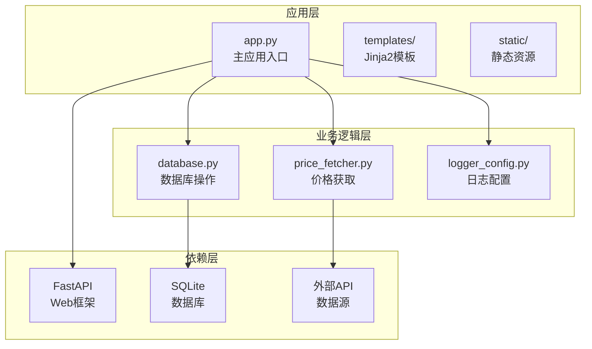
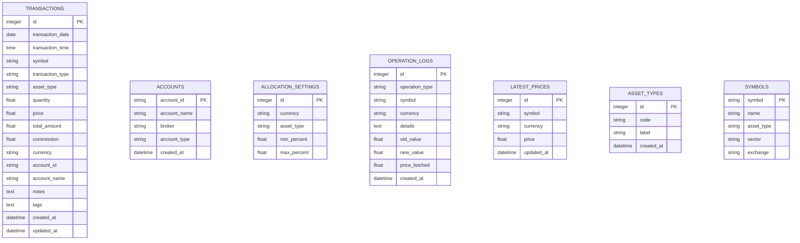
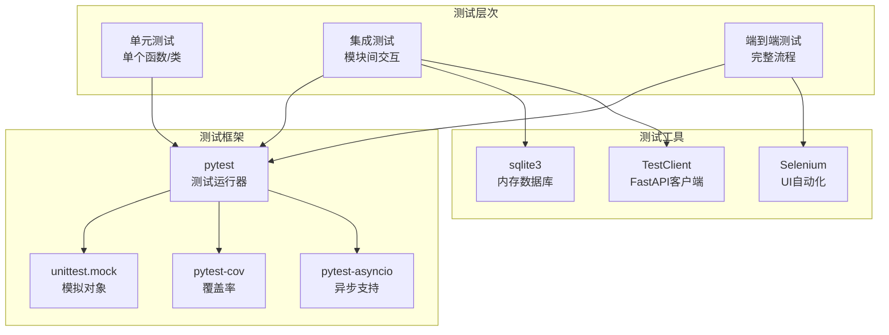
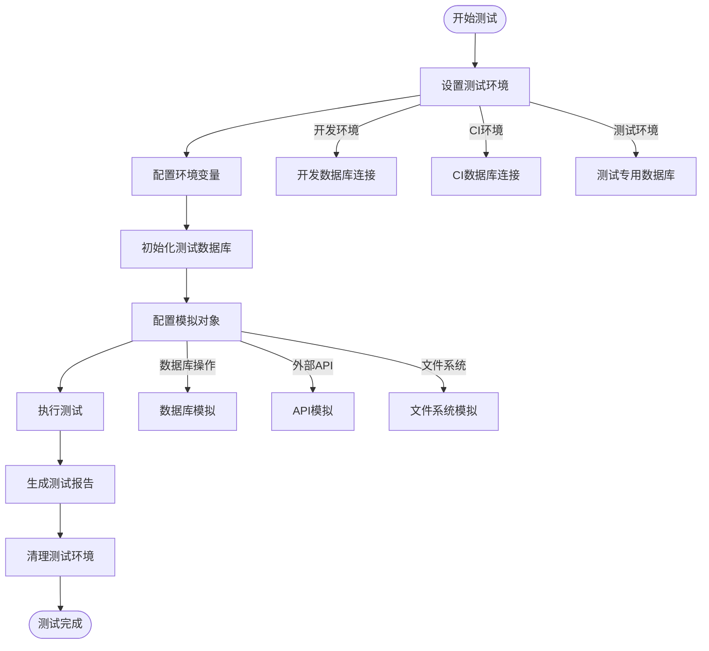
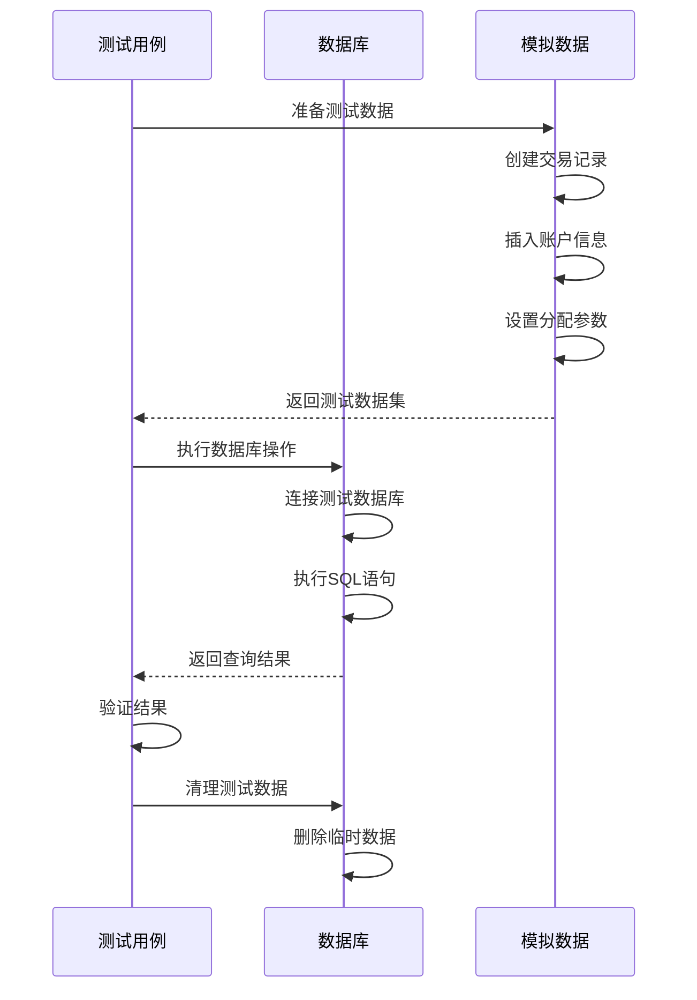
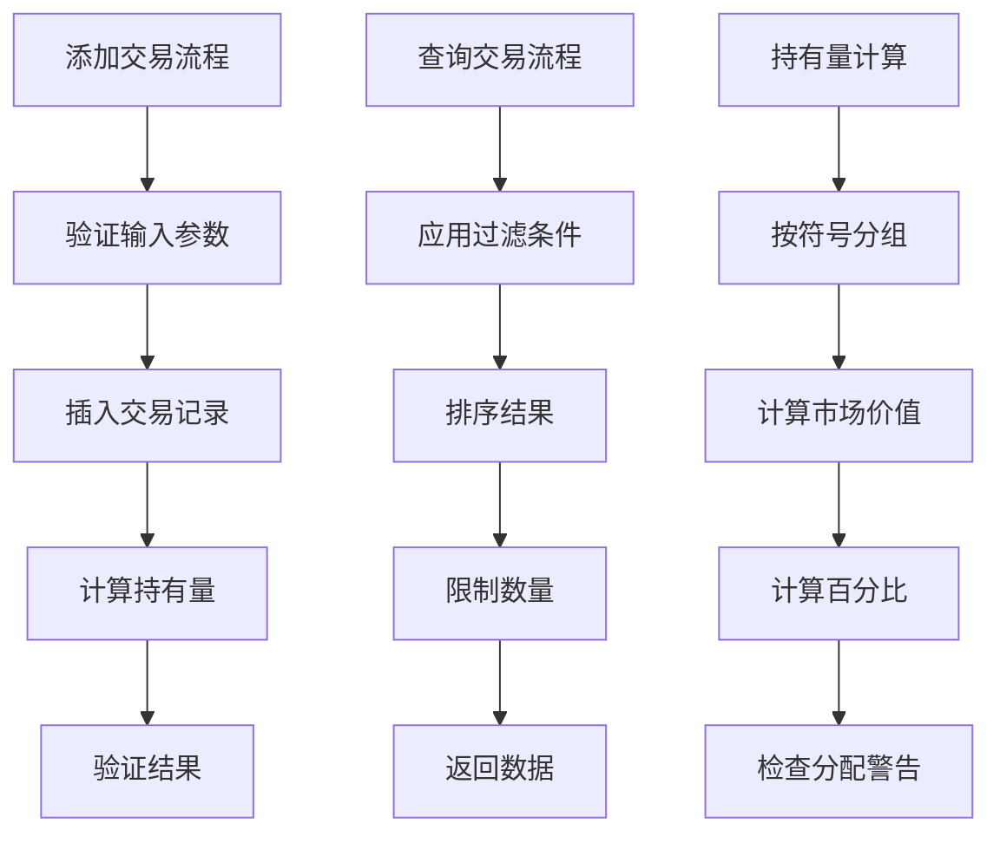
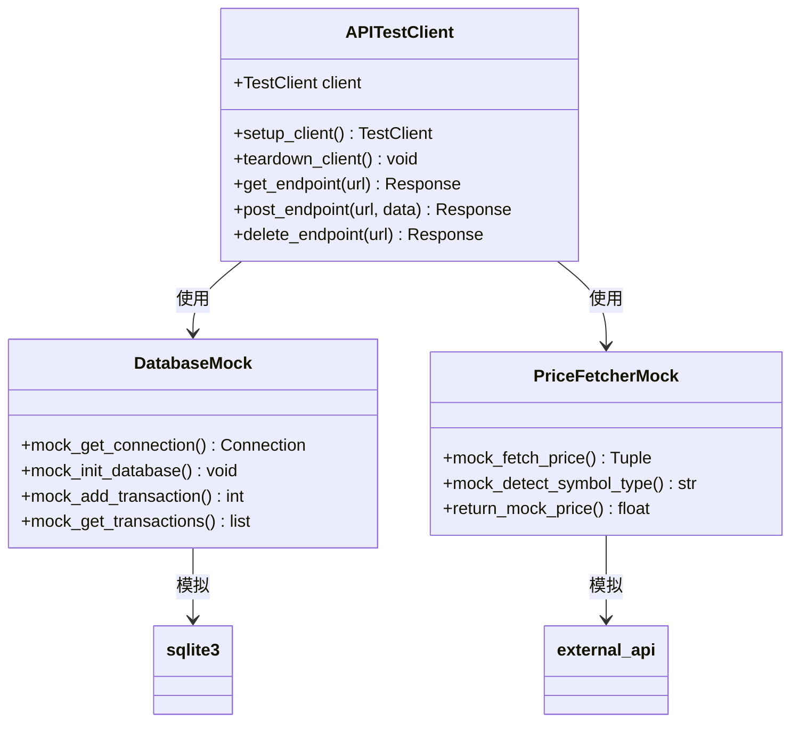
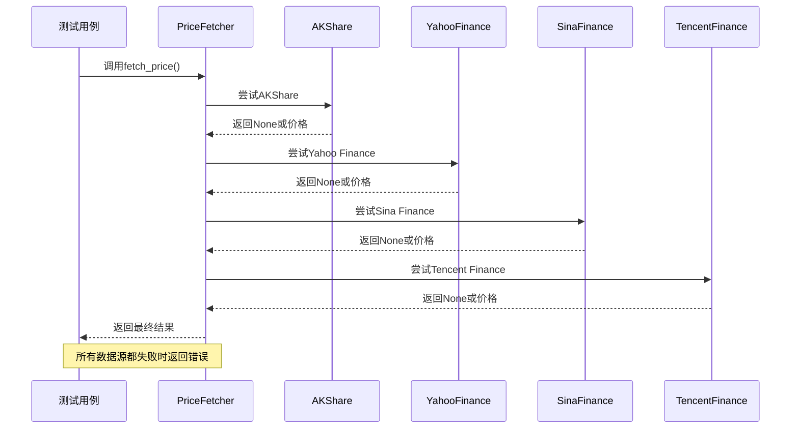
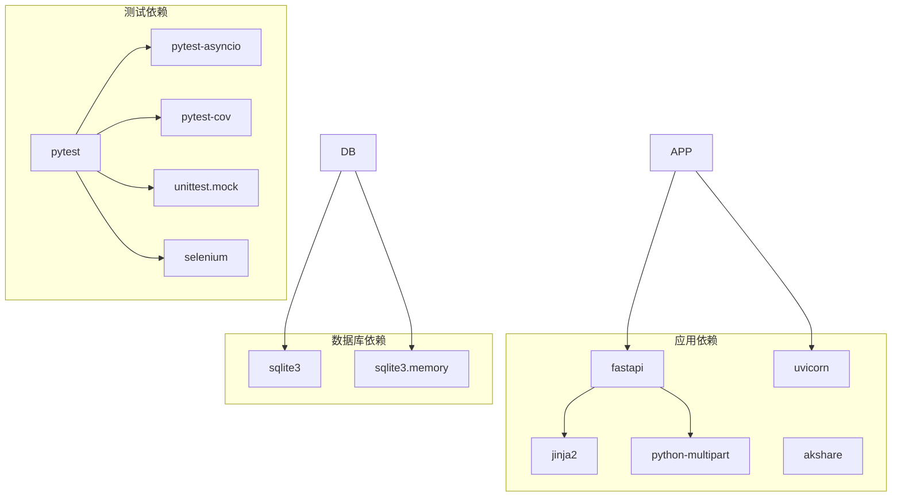

# 测试策略

<cite>
**本文档引用的文件**
- [app.py](file://app.py)
- [database.py](file://database.py)
- [price_fetcher.py](file://price_fetcher.py)
- [logger_config.py](file://logger_config.py)
- [requirements.txt](file://requirements.txt)
</cite>

## 目录
1. [引言](#引言)
2. [项目结构](#项目结构)
3. [核心组件](#核心组件)
4. [架构概览](#架构概览)
5. [详细组件分析](#详细组件分析)
6. [依赖关系分析](#依赖关系分析)
7. [性能考虑](#性能考虑)
8. [故障排除指南](#故障排除指南)
9. [结论](#结论)
10. [附录](#附录)

## 引言

本测试策略文档为投资日志（Invest Log）Web应用程序制定全面的测试实施计划。该应用基于FastAPI构建，提供股票/ETF交易记录管理功能，包含Web界面和REST API接口。本文档涵盖单元测试、集成测试和端到端测试的完整实施方案，包括测试框架选择、数据库测试、API测试、UI测试的具体方法，以及测试数据准备、模拟对象使用和测试环境配置。

## 项目结构

投资日志项目采用模块化设计，主要包含以下核心文件：



**图表来源**
- [app.py](file://app.py#L1-L446)
- [database.py](file://database.py#L1-L944)
- [price_fetcher.py](file://price_fetcher.py#L1-L398)

**章节来源**
- [app.py](file://app.py#L1-L446)
- [database.py](file://database.py#L1-L944)
- [price_fetcher.py](file://price_fetcher.py#L1-L398)

## 核心组件

### 应用程序组件

投资日志应用包含以下核心组件：

1. **Web界面组件**：基于Jinja2模板的HTML页面渲染
2. **API接口组件**：RESTful API端点提供数据访问
3. **数据库组件**：SQLite数据库操作封装
4. **价格获取组件**：多数据源价格获取服务
5. **日志组件**：结构化日志记录系统

### 数据模型

应用程序使用SQLite数据库存储以下主要实体：



**图表来源**
- [database.py](file://database.py#L25-L138)

**章节来源**
- [database.py](file://database.py#L1-L944)

## 架构概览

### 测试架构设计



### 测试环境配置



**图表来源**
- [app.py](file://app.py#L25-L29)
- [database.py](file://database.py#L20-L149)

**章节来源**
- [app.py](file://app.py#L25-L29)
- [database.py](file://database.py#L20-L149)

## 详细组件分析

### 数据库测试策略

#### 单元测试设计

数据库模块包含丰富的CRUD操作和查询功能，需要针对以下方面进行测试：

1. **事务操作测试**
   - 添加交易记录
   - 更新交易记录
   - 删除交易记录
   - 查询交易记录

2. **持有量计算测试**
   - 按符号分组的持有量
   - 按货币分组的持有量
   - 按资产类型分组的持有量

3. **分配设置测试**
   - 设置分配范围
   - 获取分配设置
   - 验证分配范围有效性

#### 测试数据准备



**图表来源**
- [database.py](file://database.py#L156-L193)
- [database.py](file://database.py#L312-L358)

#### 集成测试场景



**图表来源**
- [database.py](file://database.py#L262-L309)
- [database.py](file://database.py#L361-L431)

**章节来源**
- [database.py](file://database.py#L156-L480)

### API测试策略

#### FastAPI应用测试

应用包含多个HTTP端点，需要分别进行测试：

1. **HTML页面端点**
   - 首页仪表板
   - 交易列表页面
   - 添加交易页面
   - 图表页面
   - 持有量详情页面
   - 股票详情页面
   - 设置页面

2. **REST API端点**
   - 获取持有量
   - 获取交易记录
   - 获取投资组合历史
   - 删除交易记录

#### 测试客户端配置



**图表来源**
- [app.py](file://app.py#L36-L446)
- [app.py](file://app.py#L378-L441)

#### API测试用例设计

| 端点 | 方法 | 测试重点 | 预期结果 |
|------|------|----------|----------|
| `/` | GET | 页面渲染、数据加载 | 200 OK, HTML内容 |
| `/api/holdings` | GET | 持有量查询 | 200 OK, JSON数据 |
| `/api/transactions` | GET | 交易记录查询 | 200 OK, 分页数据 |
| `/api/transactions/{id}` | DELETE | 删除交易 | 200 OK 或 404 |
| `/add` | POST | 添加交易 | 303 重定向 |

**章节来源**
- [app.py](file://app.py#L36-L441)

### 价格获取测试策略

#### 多数据源测试

价格获取模块支持多种数据源，需要测试以下场景：

1. **数据源检测**
   - A股代码识别
   - 港股代码识别
   - 美股代码识别
   - 黄金价格识别

2. **数据源回退机制**
   - 主要数据源失败时的回退
   - 不同数据源的成功率测试
   - 错误处理和日志记录

#### 测试模拟策略



**图表来源**
- [price_fetcher.py](file://price_fetcher.py#L321-L394)

**章节来源**
- [price_fetcher.py](file://price_fetcher.py#L36-L398)

### 日志测试策略

#### 日志记录测试

日志模块提供结构化的日志记录功能，需要测试：

1. **日志级别测试**
   - INFO级别日志
   - WARNING级别日志
   - 错误处理日志

2. **日志格式测试**
   - 时间戳格式
   - 消息格式
   - 文件轮转功能

**章节来源**
- [logger_config.py](file://logger_config.py#L14-L53)

## 依赖关系分析

### 测试依赖图



**图表来源**
- [requirements.txt](file://requirements.txt#L1-L6)

### 测试耦合度分析

测试组件之间的耦合关系相对简单，主要体现在：

1. **数据库测试**：与应用逻辑紧密耦合
2. **API测试**：与FastAPI应用紧密耦合  
3. **价格测试**：与外部数据源模拟耦合
4. **UI测试**：与模板渲染和静态资源耦合

**章节来源**
- [requirements.txt](file://requirements.txt#L1-L6)

## 性能考虑

### 测试性能优化

1. **数据库性能测试**
   - 大数据量查询性能
   - 索引使用效果
   - 查询优化测试

2. **并发测试**
   - 多用户同时访问
   - 数据库连接池测试
   - API限流测试

3. **内存使用测试**
   - 大型查询结果处理
   - 内存泄漏检测
   - 缓存策略测试

## 故障排除指南

### 常见测试问题

1. **数据库连接问题**
   - 检查测试数据库路径
   - 验证数据库权限
   - 确认表结构完整性

2. **外部API调用问题**
   - 配置网络代理
   - 设置超时时间
   - 实现重试机制

3. **异步测试问题**
   - 正确配置pytest-asyncio
   - 使用适当的事件循环
   - 处理协程生命周期

**章节来源**
- [app.py](file://app.py#L25-L29)
- [database.py](file://database.py#L13-L17)

## 结论

本测试策略文档为投资日志应用提供了全面的测试实施指导。通过分层测试方法（单元测试、集成测试、端到端测试），结合pytest框架和模拟对象技术，可以确保应用的质量和稳定性。

关键测试要点包括：
- 数据库操作的完整覆盖
- API接口的正确性验证
- 外部数据源的可靠性测试
- 用户界面的功能验证
- 性能和并发能力测试

建议在实际实施中根据项目进展和需求变化，持续完善和调整测试策略。

## 附录

### 测试配置示例

#### pytest配置文件

```ini
[tool:pytest]
testpaths = tests
python_files = test_*.py
python_classes = Test*
python_functions = test_*
addopts = 
    --verbose
    --tb=short
    --cov=app.py
    --cov=database.py
    --cov=price_fetcher.py
    --cov-report=html
    --cov-report=term-missing
markers =
    unit: 单元测试
    integration: 集成测试
    e2e: 端到端测试
    slow: 慢速测试
```

#### 测试环境变量

| 变量名 | 默认值 | 用途 |
|--------|--------|------|
| TEST_DATABASE_PATH | `test_transactions.db` | 测试数据库路径 |
| TEST_API_BASE_URL | `http://localhost:8000` | API基础URL |
| TEST_TIMEOUT | `30` | 请求超时时间（秒） |
| TEST_LOG_LEVEL | `DEBUG` | 测试日志级别 |

### 测试覆盖率要求

- **总体覆盖率**：≥ 80%
- **关键函数覆盖率**：≥ 90%
- **分支覆盖率**：≥ 75%
- **数据库操作覆盖率**：≥ 95%

### 持续集成配置

建议在CI/CD管道中包含以下步骤：

1. **代码检查**：语法检查、静态分析
2. **单元测试**：快速执行所有单元测试
3. **集成测试**：数据库和API集成测试
4. **端到端测试**：UI自动化测试
5. **代码覆盖率**：生成覆盖率报告
6. **安全扫描**：依赖项安全检查