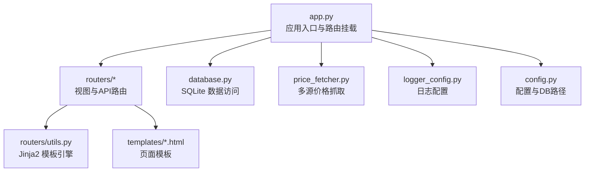
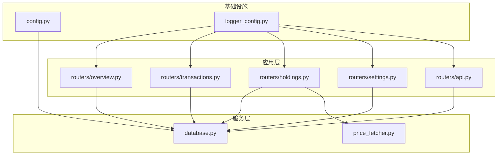
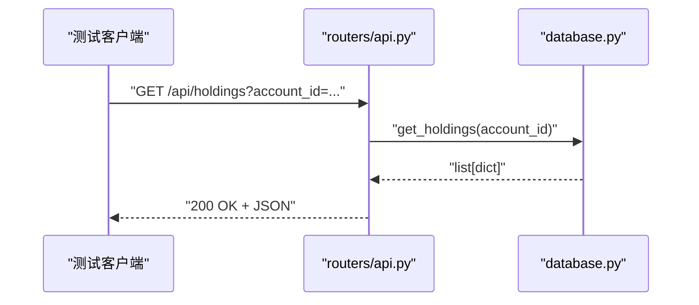
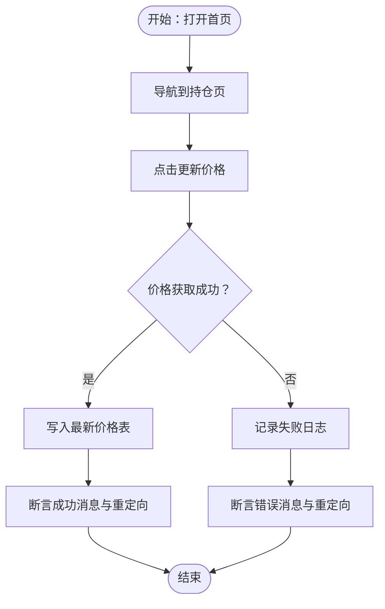
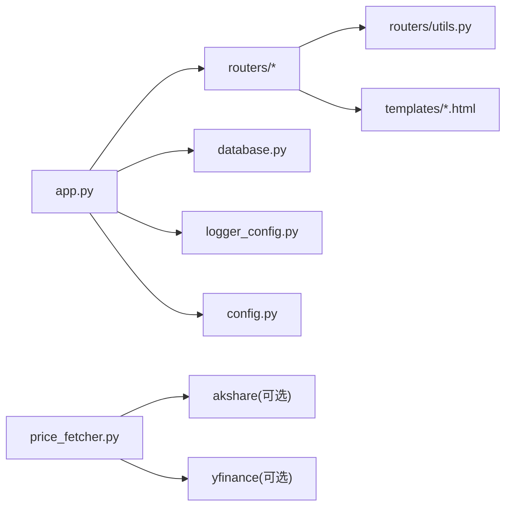

# 测试策略与实施

<cite>
**本文引用的文件**
- [app.py](file://app.py)
- [config.py](file://config.py)
- [database.py](file://database.py)
- [price_fetcher.py](file://price_fetcher.py)
- [logger_config.py](file://logger_config.py)
- [routers/api.py](file://routers/api.py)
- [routers/transactions.py](file://routers/transactions.py)
- [routers/holdings.py](file://routers/holdings.py)
- [routers/overview.py](file://routers/overview.py)
- [routers/settings.py](file://routers/settings.py)
- [routers/utils.py](file://routers/utils.py)
- [requirements.txt](file://requirements.txt)
- [templates/index.html](file://templates/index.html)
- [templates/base.html](file://templates/base.html)
</cite>

## 目录
1. [引言](#引言)
2. [项目结构](#项目结构)
3. [核心组件](#核心组件)
4. [架构总览](#架构总览)
5. [详细组件分析](#详细组件分析)
6. [依赖分析](#依赖分析)
7. [性能考虑](#性能考虑)
8. [故障排查指南](#故障排查指南)
9. [结论](#结论)
10. [附录](#附录)

## 引言
本指南面向投资日志管理系统，提供从单元测试、集成测试到端到端测试的完整测试策略与实施建议。内容覆盖测试设计原则、Mock对象使用、断言策略、数据库与外部服务测试、浏览器自动化与数据完整性验证、测试覆盖率与质量标准、测试环境搭建与持续集成设置，并给出可直接参考的测试代码路径与工具推荐。

## 项目结构
系统采用 FastAPI + Jinja2 的后端+模板渲染模式，核心模块包括应用入口、配置、数据库层、价格抓取器、日志配置以及各路由模块。前端模板通过 Jinja2 渲染，静态资源由 FastAPI 提供。

图表来源
- [app.py](file://app.py#L1-L34)
- [routers/api.py](file://routers/api.py#L1-L67)
- [routers/transactions.py](file://routers/transactions.py#L1-L75)
- [routers/holdings.py](file://routers/holdings.py#L1-L207)
- [routers/overview.py](file://routers/overview.py#L1-L28)
- [routers/settings.py](file://routers/settings.py#L1-L148)
- [routers/utils.py](file://routers/utils.py#L1-L4)
- [database.py](file://database.py#L1-L1010)
- [price_fetcher.py](file://price_fetcher.py#L1-L405)
- [logger_config.py](file://logger_config.py#L1-L54)
- [config.py](file://config.py#L1-L24)

章节来源
- [app.py](file://app.py#L1-L34)
- [config.py](file://config.py#L1-L24)

## 核心组件
- 应用入口与生命周期：应用启动时初始化数据库，挂载静态资源与路由。
- 路由层：提供首页仪表盘、交易列表、持仓详情、设置页、API 接口等。
- 数据访问层：封装 SQLite 表结构、事务 CRUD、查询聚合、账户与资产类型管理、最新价格与操作日志。
- 价格抓取器：多源价格获取与回退策略，支持 A 股、港股、美股、黄金等。
- 日志配置：本地日志轮转与控制台输出。
- 配置中心：数据库路径与 iCloud 同步路径。

章节来源
- [app.py](file://app.py#L13-L29)
- [database.py](file://database.py#L22-L151)
- [price_fetcher.py](file://price_fetcher.py#L325-L402)
- [logger_config.py](file://logger_config.py#L14-L54)
- [config.py](file://config.py#L17-L24)

## 架构总览
系统采用分层架构：路由层负责请求处理与模板渲染；服务层由数据库模块承担数据持久化与计算；价格抓取器作为外部服务适配层；日志模块贯穿全链路。

图表来源
- [routers/overview.py](file://routers/overview.py#L1-L28)
- [routers/transactions.py](file://routers/transactions.py#L1-L75)
- [routers/holdings.py](file://routers/holdings.py#L1-L207)
- [routers/settings.py](file://routers/settings.py#L1-L148)
- [routers/api.py](file://routers/api.py#L1-L67)
- [database.py](file://database.py#L1-L1010)
- [price_fetcher.py](file://price_fetcher.py#L1-L405)
- [config.py](file://config.py#L1-L24)
- [logger_config.py](file://logger_config.py#L1-L54)

## 详细组件分析

### 单元测试设计原则与实践
- 测试用例编写
  - 覆盖关键业务逻辑：交易增删改查、持仓计算、资产价值调整、账户与资产类型管理、价格抓取与回退。
  - 边界与异常：空输入、非法类型、超范围百分比、重复键、唯一约束冲突。
  - 纯函数与无状态逻辑优先：对 price_fetcher 的符号类型检测、价格抓取回退序列进行独立测试。
- Mock 对象使用
  - 使用第三方库对网络请求与外部依赖进行隔离，如对 AKShare、Yahoo Finance、Sina/Tencent API 进行 Mock。
  - 对数据库连接与事务进行 Mock 或使用内存 SQLite，避免真实磁盘 IO。
- 断言策略
  - 结果断言：返回值、影响行数、错误码。
  - 状态断言：数据库最终状态、日志条目、缓存或最新价格表。
  - 行为断言：调用次数、参数匹配、异常抛出。

章节来源
- [price_fetcher.py](file://price_fetcher.py#L36-L67)
- [price_fetcher.py](file://price_fetcher.py#L325-L402)
- [database.py](file://database.py#L158-L226)
- [database.py](file://database.py#L238-L287)
- [database.py](file://database.py#L344-L391)
- [database.py](file://database.py#L466-L513)

### 集成测试实施方案
- 数据库测试
  - 初始化测试数据库（内存或临时文件），执行建表与索引创建流程，验证约束与默认值。
  - 事务 CRUD 测试：新增、更新（含字段白名单与金额重算）、删除、批量查询与分页。
  - 聚合与报表：持仓汇总、按货币与资产类型分组、未实现损益与占比计算。
  - 设置与校验：资产配置区间设置、账户与资产类型管理、删除前检查。
- API 端点测试
  - 使用 TestClient 访问 /api 下的端点：/api/holdings、/api/holdings-by-currency、/api/transactions、/api/portfolio-history、/api/transactions/{id} 删除。
  - 断言响应格式、状态码、字段存在性与数值范围。
- 外部服务模拟
  - Mock 多源价格抓取函数，验证回退顺序与错误聚合消息。
  - 模拟网络异常与解析失败，确保返回稳定的消息与日志。

图表来源
- [routers/api.py](file://routers/api.py#L8-L16)
- [database.py](file://database.py#L344-L391)

章节来源
- [routers/api.py](file://routers/api.py#L1-L67)
- [database.py](file://database.py#L22-L151)
- [database.py](file://database.py#L294-L342)
- [database.py](file://database.py#L344-L391)
- [database.py](file://database.py#L466-L513)
- [price_fetcher.py](file://price_fetcher.py#L325-L402)

### 端到端测试构建方法
- 用户场景测试
  - 新增交易并跳转到交易列表，验证分页与排序。
  - 持仓页面刷新价格并记录操作日志，验证消息与重定向。
  - 快速交易与资产价值调整，验证现金流联动与历史记录。
  - 设置页保存资产配置区间，验证警告提示。
- 浏览器自动化
  - 使用 Playwright/Selenium 打开首页、导航至各页面、填写表单、点击按钮、断言 DOM 与 URL 变化。
  - 针对 Chart.js 渲染结果进行截图对比或 DOM 属性断言。
- 数据完整性验证
  - 基于数据库快照与 SQL 查询断言，确保交易、持仓、价格、日志一致。

图表来源
- [routers/holdings.py](file://routers/holdings.py#L102-L148)
- [database.py](file://database.py#L130-L140)
- [database.py](file://database.py#L792-L800)

章节来源
- [routers/holdings.py](file://routers/holdings.py#L13-L76)
- [routers/holdings.py](file://routers/holdings.py#L102-L177)
- [templates/index.html](file://templates/index.html#L1-L90)
- [templates/base.html](file://templates/base.html#L1-L27)

### 关键业务逻辑测试重点
- 交易金额与费用：买入/卖出/分红/拆分/转账/调整/收入等类型，金额重算与 commission 影响。
- 现金联动：link_cash 开关下的双向现金流记录。
- 持仓计算：按 symbol/account/currency/asset_type 分组，正负量抵消与成本均价。
- 价值调整：ADJUST 类型交易对成本与市值的影响。
- 价格抓取：符号类型识别、多源回退、错误聚合与日志记录。
- 设置校验：资产配置区间合法性与唯一性约束。

章节来源
- [database.py](file://database.py#L158-L226)
- [database.py](file://database.py#L344-L391)
- [database.py](file://database.py#L466-L513)
- [price_fetcher.py](file://price_fetcher.py#L36-L67)
- [price_fetcher.py](file://price_fetcher.py#L325-L402)

### 测试覆盖率与质量标准
- 覆盖率目标
  - 关键业务函数：≥80% 行覆盖率、≥70% 分支覆盖率。
  - 数据访问层：≥75% 行覆盖率，尤其是聚合与校验逻辑。
  - 外部服务：≥60% 行覆盖率，重点在回退分支与异常处理。
- 质量标准
  - 单测：快速、可重复、无副作用；禁用真实网络与数据库。
  - 集成测：最小化外部依赖；使用内存数据库或临时文件。
  - E2E：稳定、可维护；减少对动态内容的脆弱断言，优先断言结构与行为。

## 依赖分析
- 应用依赖
  - FastAPI、Uvicorn、Jinja2、python-multipart。
  - 可选依赖：akshare、yfinance（用于价格抓取）。
- 内部依赖
  - app.py 依赖 database、logger_config、routers。
  - 路由模块依赖 database 与模板引擎。
  - price_fetcher 依赖可选库以启用不同数据源。

图表来源
- [app.py](file://app.py#L7-L11)
- [requirements.txt](file://requirements.txt#L1-L6)
- [price_fetcher.py](file://price_fetcher.py#L22-L34)

章节来源
- [requirements.txt](file://requirements.txt#L1-L6)
- [price_fetcher.py](file://price_fetcher.py#L22-L34)

## 性能考虑
- 单元测试：使用内存数据库或临时文件，避免磁盘 IO；对网络请求进行 Mock。
- 集成测试：批量插入与查询时注意索引与 LIMIT/OFFSET；避免大事务。
- E2E：并发控制、页面等待策略、截图对比阈值。

## 故障排查指南
- 日志定位
  - 使用 logger_config 中的日志器，关注 INFO/WARNING/ERROR 级别消息。
  - 在路由层与数据库层的关键节点记录操作日志与错误信息。
- 常见问题
  - 价格抓取失败：检查外部库是否安装、网络连通性、回退链路是否可用。
  - 数据库约束冲突：唯一键冲突、外键引用、类型校验失败。
  - 模板渲染异常：变量缺失、过滤器报错、Chart.js 渲染失败。

章节来源
- [logger_config.py](file://logger_config.py#L14-L54)
- [routers/holdings.py](file://routers/holdings.py#L102-L148)
- [database.py](file://database.py#L610-L620)

## 结论
通过分层测试策略与工具组合，可在保证质量的同时提升开发效率。建议优先完善数据库与价格抓取的单元测试，再扩展到 API 与端到端测试，逐步提升覆盖率与稳定性。

## 附录

### 测试环境搭建
- 测试数据库
  - 使用内存 SQLite 或临时文件，避免污染生产数据。
  - 在测试前初始化表结构与索引，测试后清理。
- 测试数据准备
  - 构造典型交易样本（买入/卖出/分红/调整/收入），覆盖不同货币与资产类型。
  - 准备账户与资产类型基础数据，满足设置页与报表需求。
- 持续集成
  - CI 中安装可选依赖（如 akshare/yfinance），运行单元与集成测试。
  - E2E 在容器化环境中执行（如 Playwright Docker 镜像）。

### 测试工具推荐
- 单元测试：pytest + pytest-mock（Mock 外部依赖）
- 集成测试：pytest + TestClient（FastAPI）
- 端到端测试：Playwright（或 Selenium）+ pytest
- 覆盖率：pytest-cov
- 数据库：sqlite3（内存/临时文件）

### 具体测试代码示例（路径）
- 单元测试：交易新增与金额重算
  - [database.py](file://database.py#L158-L226)
- 单元测试：持仓汇总与均价计算
  - [database.py](file://database.py#L344-L391)
- 单元测试：资产价值调整
  - [database.py](file://database.py#L466-L513)
- 单元测试：价格抓取与回退
  - [price_fetcher.py](file://price_fetcher.py#L325-L402)
- 集成测试：API 端点
  - [routers/api.py](file://routers/api.py#L8-L67)
- 端到端测试：页面交互
  - [routers/holdings.py](file://routers/holdings.py#L102-L177)
  - [templates/index.html](file://templates/index.html#L48-L82)