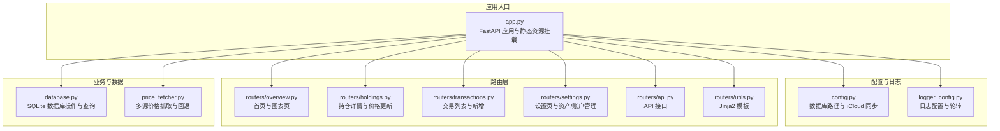
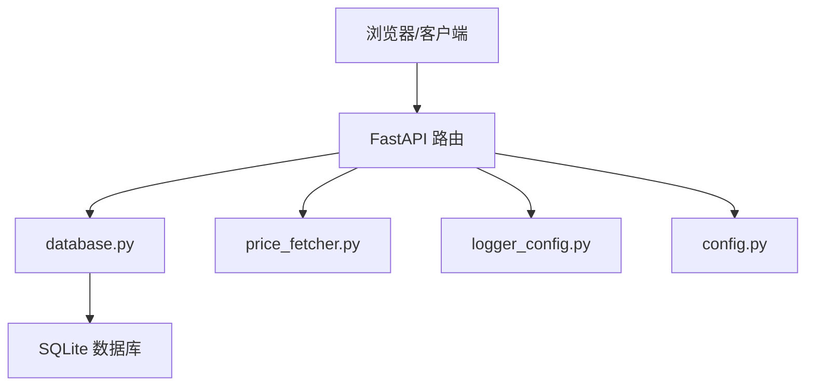
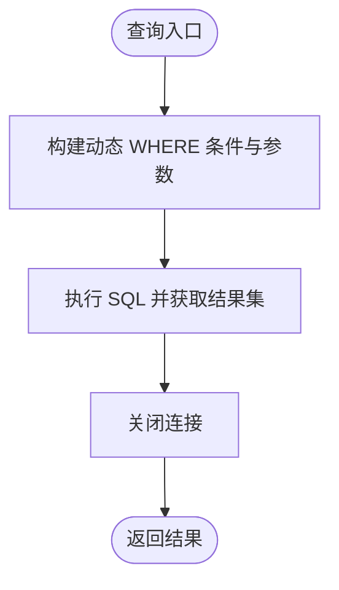
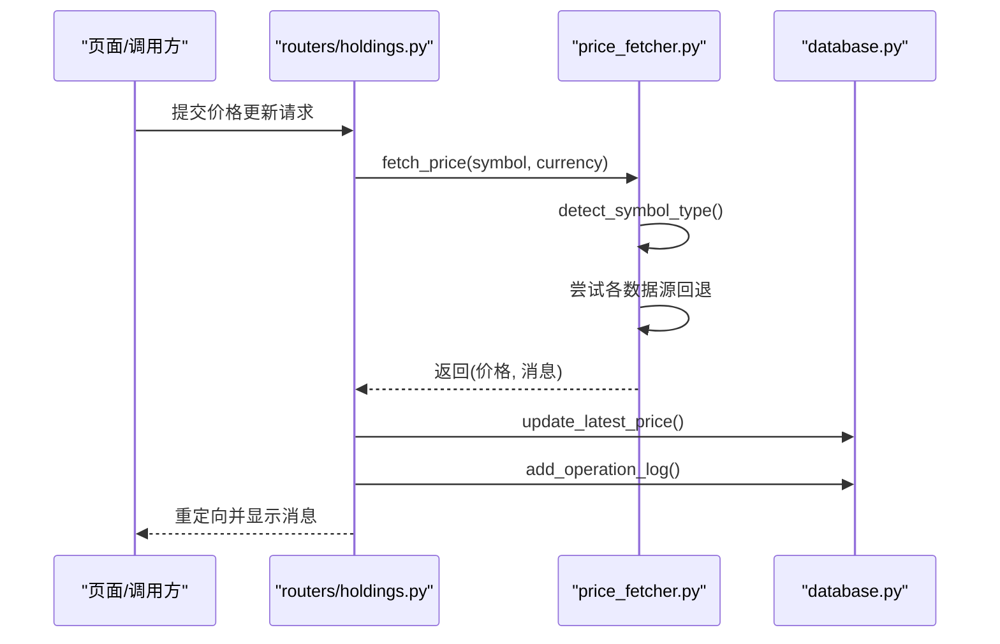
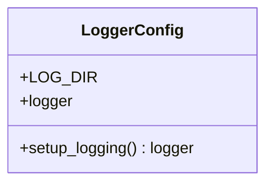
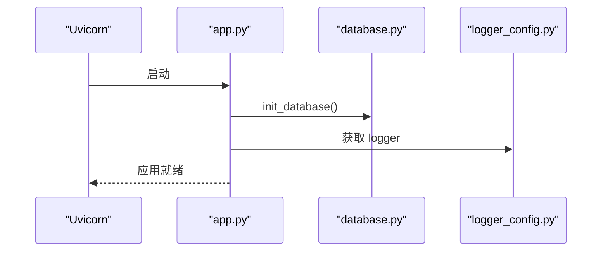
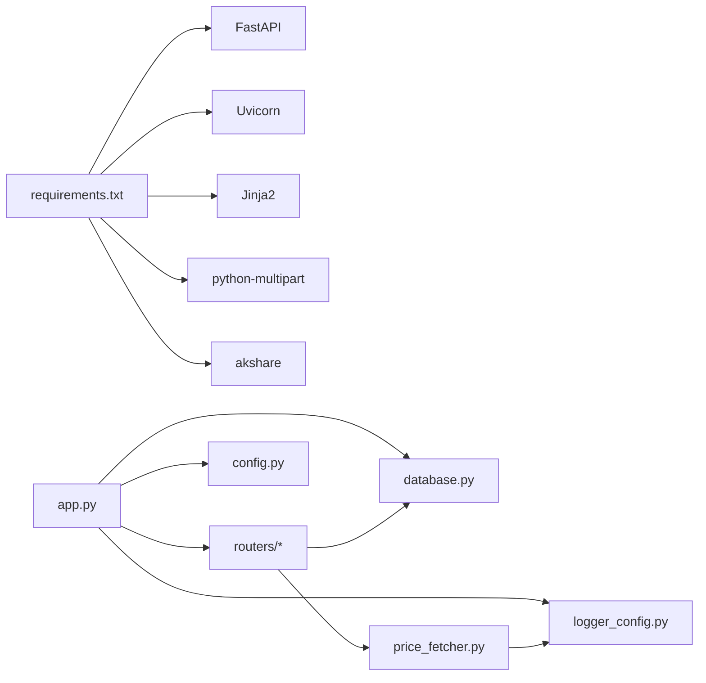

# 调试工具与技巧

<cite>
**本文引用的文件**
- [app.py](file://app.py)
- [config.py](file://config.py)
- [database.py](file://database.py)
- [logger_config.py](file://logger_config.py)
- [price_fetcher.py](file://price_fetcher.py)
- [requirements.txt](file://requirements.txt)
- [routers/api.py](file://routers/api.py)
- [routers/holdings.py](file://routers/holdings.py)
- [routers/transactions.py](file://routers/transactions.py)
- [routers/overview.py](file://routers/overview.py)
- [routers/settings.py](file://routers/settings.py)
- [routers/utils.py](file://routers/utils.py)
</cite>

## 目录
1. [简介](#简介)
2. [项目结构](#项目结构)
3. [核心组件](#核心组件)
4. [架构总览](#架构总览)
5. [详细组件分析](#详细组件分析)
6. [依赖关系分析](#依赖关系分析)
7. [性能考量](#性能考量)
8. [故障排查指南](#故障排查指南)
9. [结论](#结论)
10. [附录](#附录)

## 简介
本指南面向投资日志管理系统的开发者，聚焦于开发环境搭建、数据库调试、API调试、日志系统使用以及常见问题诊断。内容涵盖 IDE 配置建议、Python 虚拟环境与调试器使用、SQLite 查询优化与慢查询分析、价格获取失败与数据一致性检查、请求响应追踪与性能监控，以及具体调试场景与解决方案，帮助快速定位并解决开发过程中的各类问题。

## 项目结构
系统采用 FastAPI + SQLite 的轻量级架构，前端模板通过 Jinja2 渲染，核心业务逻辑集中在数据库模块与价格抓取模块，路由层负责页面与 API 的组织。

图表来源
- [app.py](file://app.py#L1-L34)
- [config.py](file://config.py#L1-L24)
- [logger_config.py](file://logger_config.py#L1-L54)
- [routers/overview.py](file://routers/overview.py#L1-L28)
- [routers/holdings.py](file://routers/holdings.py#L1-L207)
- [routers/transactions.py](file://routers/transactions.py#L1-L75)
- [routers/settings.py](file://routers/settings.py#L1-L148)
- [routers/api.py](file://routers/api.py#L1-L67)
- [routers/utils.py](file://routers/utils.py#L1-L4)
- [database.py](file://database.py#L1-L1047)
- [price_fetcher.py](file://price_fetcher.py#L1-L405)

章节来源
- [app.py](file://app.py#L1-L34)
- [config.py](file://config.py#L1-L24)
- [logger_config.py](file://logger_config.py#L1-L54)
- [routers/overview.py](file://routers/overview.py#L1-L28)
- [routers/holdings.py](file://routers/holdings.py#L1-L207)
- [routers/transactions.py](file://routers/transactions.py#L1-L75)
- [routers/settings.py](file://routers/settings.py#L1-L148)
- [routers/api.py](file://routers/api.py#L1-L67)
- [routers/utils.py](file://routers/utils.py#L1-L4)
- [database.py](file://database.py#L1-L1047)
- [price_fetcher.py](file://price_fetcher.py#L1-L405)

## 核心组件
- 应用入口与启动：FastAPI 应用初始化、静态资源挂载、启动事件中初始化数据库与日志。
- 配置中心：数据库路径统一管理，支持本地覆盖；默认存储在 iCloud，便于跨设备同步。
- 日志系统：基于 Python logging，TimedRotatingFileHandler 实现按日轮转，保留 7 天日志，同时输出到控制台。
- 数据库模块：提供交易、账户、符号、分配设置、最新价格、操作日志等表的建表、索引、CRUD 与聚合查询。
- 价格抓取模块：多源回退策略（AKShare、Yahoo Finance、新浪、腾讯），支持 A/HK/US 股票与黄金，返回价格与消息。
- 路由层：页面路由（Jinja2）与 API 路由（JSON），统一调用数据库与价格抓取模块。

章节来源
- [app.py](file://app.py#L1-L34)
- [config.py](file://config.py#L1-L24)
- [logger_config.py](file://logger_config.py#L1-L54)
- [database.py](file://database.py#L1-L1047)
- [price_fetcher.py](file://price_fetcher.py#L1-L405)
- [routers/api.py](file://routers/api.py#L1-L67)
- [routers/holdings.py](file://routers/holdings.py#L1-L207)
- [routers/transactions.py](file://routers/transactions.py#L1-L75)
- [routers/overview.py](file://routers/overview.py#L1-L28)
- [routers/settings.py](file://routers/settings.py#L1-L148)

## 架构总览
系统采用分层架构：
- 表现层：FastAPI 路由 + Jinja2 模板渲染页面，API 路由返回 JSON。
- 业务层：路由层调用数据库模块与价格抓取模块。
- 数据访问层：SQLite 数据库，提供连接、事务、索引与查询。
- 配置与日志：集中配置数据库路径，统一日志输出与轮转。

图表来源
- [app.py](file://app.py#L1-L34)
- [database.py](file://database.py#L1-L1047)
- [price_fetcher.py](file://price_fetcher.py#L1-L405)
- [logger_config.py](file://logger_config.py#L1-L54)
- [config.py](file://config.py#L1-L24)

## 详细组件分析

### 数据库模块（database.py）
- 连接与工厂：启用 row_factory，便于字典式访问。
- 初始化：建表、索引、迁移（含约束变更）、默认资产类型初始化。
- 交易 CRUD：新增、查询、更新（含字段白名单与金额重算）、删除。
- 聚合查询：按账户/货币/资产类型计算持有情况、按货币分组与百分比、实现已实现收益与股息查询。
- 价格与日志：维护 latest_prices 表与 operation_logs 表，支持批量更新与日志记录。
- 账户与分配设置：账户增删查、分配区间设置与校验、资产类型增删与使用检查。

图表来源
- [database.py](file://database.py#L331-L378)

章节来源
- [database.py](file://database.py#L1-L1047)

### 价格抓取模块（price_fetcher.py）
- 符号类型检测：根据格式与币种判断 A/HK/US 股票、黄金、债券、现金等。
- 多源回退：优先 AKShare，其次 Yahoo Finance，再尝试新浪与腾讯，最终汇总错误信息。
- 统一接口：返回价格与消息，便于上层记录日志与操作日志。

图表来源
- [routers/holdings.py](file://routers/holdings.py#L102-L148)
- [price_fetcher.py](file://price_fetcher.py#L325-L402)
- [database.py](file://database.py#L1-L1047)

章节来源
- [price_fetcher.py](file://price_fetcher.py#L1-L405)
- [routers/holdings.py](file://routers/holdings.py#L1-L207)

### 日志系统（logger_config.py）
- 日志目录：自动创建 logs 目录，避免重复添加处理器。
- 输出目标：文件（按日轮转，保留 7 天）+ 控制台。
- 格式化：时间戳、名称、级别、消息，便于快速定位。

图表来源
- [logger_config.py](file://logger_config.py#L1-L54)

章节来源
- [logger_config.py](file://logger_config.py#L1-L54)

### 应用入口与配置（app.py, config.py）
- 启动事件：应用启动时初始化数据库与日志。
- 静态资源：挂载静态文件目录。
- 配置：数据库路径默认位于 iCloud 下 InvestLog 文件夹，可通过环境变量覆盖。

图表来源
- [app.py](file://app.py#L18-L22)
- [database.py](file://database.py#L22-L188)
- [logger_config.py](file://logger_config.py#L1-L54)

章节来源
- [app.py](file://app.py#L1-L34)
- [config.py](file://config.py#L1-L24)

## 依赖关系分析
- 外部依赖：FastAPI、Uvicorn、Jinja2、python-multipart、akshare。
- 内部依赖：app.py 引入数据库、日志、路由；路由层依赖数据库与价格抓取；价格抓取依赖日志；配置集中于 config.py。

图表来源
- [requirements.txt](file://requirements.txt#L1-L6)
- [app.py](file://app.py#L1-L34)
- [config.py](file://config.py#L1-L24)
- [logger_config.py](file://logger_config.py#L1-L54)
- [database.py](file://database.py#L1-L1047)
- [price_fetcher.py](file://price_fetcher.py#L1-L405)
- [routers/api.py](file://routers/api.py#L1-L67)
- [routers/holdings.py](file://routers/holdings.py#L1-L207)
- [routers/transactions.py](file://routers/transactions.py#L1-L75)
- [routers/overview.py](file://routers/overview.py#L1-L28)
- [routers/settings.py](file://routers/settings.py#L1-L148)

章节来源
- [requirements.txt](file://requirements.txt#L1-L6)
- [app.py](file://app.py#L1-L34)

## 性能考量
- SQLite 查询优化
  - 已建立常用过滤列索引：symbol、transaction_date、account_id、transaction_type、currency、asset_type，有助于交易查询与统计。
  - 建议：对高频查询（如按年份、货币、账户组合）可考虑复合索引或物化视图（视 SQLite 版本与功能而定）。
- 慢查询分析
  - 使用 EXPLAIN QUERY PLAN 分析复杂查询的执行计划，定位缺失索引或不必要的全表扫描。
  - 对大结果集分页（当前路由层已使用 limit/offset），避免一次性加载过多数据。
- 价格抓取性能
  - 多源回退会增加网络请求次数，建议批量触发或缓存近期价格，减少重复抓取。
  - 对同一符号在短时间内多次请求，可引入内存缓存或数据库缓存以降低外部依赖压力。
- 日志性能
  - 日志按天轮转，避免单文件过大；生产环境建议仅保留必要级别，减少 IO 压力。

[本节为通用性能建议，不直接分析具体文件]

## 故障排查指南

### 开发环境搭建与调试器使用
- Python 虚拟环境
  - 建议使用 venv 或 conda 创建隔离环境，安装依赖后运行。
  - 参考依赖清单：FastAPI、Uvicorn、Jinja2、python-multipart、akshare。
- IDE 配置
  - VS Code：推荐启用 Python 扩展、Pylance、Flake8/Black 等，设置断点与调试配置。
  - PyCharm：使用内置调试器，设置断点于关键函数入口（如数据库写入、价格抓取）。
- 调试器使用
  - 在 app.py 的启动事件处设置断点，验证数据库初始化是否成功。
  - 在 price_fetcher.py 的 fetch_price 入口设置断点，观察符号类型与回退链路。
  - 在数据库模块的关键写入函数（如 add_transaction、update_latest_price）设置断点，验证数据一致性。

章节来源
- [requirements.txt](file://requirements.txt#L1-L6)
- [app.py](file://app.py#L18-L22)
- [price_fetcher.py](file://price_fetcher.py#L325-L402)
- [database.py](file://database.py#L195-L262)

### 数据库调试方法
- SQLite 查询优化
  - 使用 EXPLAIN QUERY PLAN 分析 get_transactions 等复杂查询，确认索引使用情况。
  - 对频繁的日期范围查询，确保 transaction_date 上有索引（已存在）。
- 慢查询分析
  - 对 get_holdings_by_currency 等聚合查询，关注 GROUP BY 与子查询的性能，必要时拆分查询或引入中间表。
- 数据一致性检查
  - 交易金额一致性：更新 quantity 或 price 时会重算 total_amount，检查更新前后值是否一致。
  - 现金联动：买入/卖出时自动生成 CASH 交易，核对 link_cash 参数与生成的交易方向与数量。
  - 资产类型与货币约束：新增/更新时检查约束是否生效，避免非法值导致插入失败。
  - 账户与资产类型删除保护：删除前检查是否被使用，防止破坏历史数据。

章节来源
- [database.py](file://database.py#L275-L313)
- [database.py](file://database.py#L195-L262)
- [database.py](file://database.py#L637-L695)
- [database.py](file://database.py#L700-L767)

### API 调试技巧
- 请求响应追踪
  - 使用 curl 或 Postman 访问 /api/transactions、/api/holdings 等端点，观察返回结构与状态码。
  - 在 routers/api.py 中设置断点，验证参数解析与数据库查询结果。
- 错误日志分析
  - 关注 logger_config.py 的 INFO/WARNING/ERROR 级别输出，结合日志文件定位问题。
  - 在 price_fetcher.py 的回退链路中，查看每一步的错误消息汇总。
- 性能监控
  - 对 /api/portfolio-history 等聚合端点，注意 limit 与排序开销，必要时限制查询范围或缓存结果。

章节来源
- [routers/api.py](file://routers/api.py#L1-L67)
- [logger_config.py](file://logger_config.py#L1-L54)
- [price_fetcher.py](file://price_fetcher.py#L325-L402)

### 常见问题诊断
- 交易记录异常
  - 症状：交易金额与数量不一致、现金联动方向错误。
  - 排查：检查 add_transaction 的 link_cash 逻辑与 total_amount 重算逻辑。
- 价格获取失败
  - 症状：价格更新失败，操作日志记录失败原因。
  - 排查：确认网络可用性、各数据源库是否安装、符号类型识别是否正确。
- 数据同步问题
  - 症状：iCloud 同步导致数据库路径变化或文件权限问题。
  - 排查：检查 config.py 的 DB_PATH 与环境变量覆盖，确认文件存在且可读写。

章节来源
- [database.py](file://database.py#L195-L262)
- [routers/holdings.py](file://routers/holdings.py#L102-L148)
- [config.py](file://config.py#L17-L24)

### 日志系统使用
- 日志级别设置
  - 默认 INFO 级别，可在 logger_config.py 中调整全局级别与处理器级别。
- 关键信息追踪
  - 在关键流程（如交易新增、价格更新、API 删除）记录详细上下文，便于回溯。
- 错误定位技术
  - 结合日志文件名（按日期轮转）与时间戳，快速定位问题发生时刻的调用链。

章节来源
- [logger_config.py](file://logger_config.py#L1-L54)
- [routers/holdings.py](file://routers/holdings.py#L78-L100)
- [routers/holdings.py](file://routers/holdings.py#L149-L177)
- [routers/transactions.py](file://routers/transactions.py#L45-L75)
- [routers/api.py](file://routers/api.py#L59-L67)

### 具体调试场景与解决方案
- 场景 1：新增交易后金额不正确
  - 步骤：在 add_transaction 入口设置断点，检查传入 quantity/price 与计算后的 total_amount。
  - 解决：若更新字段包含 quantity 或 price，确认 update_transaction 的重算逻辑已执行。
- 场景 2：价格更新失败
  - 步骤：在 fetch_price 设置断点，观察符号类型与回退链路；检查各数据源库导入状态。
  - 解决：确保所需库已安装；若网络受限，使用手动更新接口写入价格。
- 场景 3：删除交易时报 404
  - 步骤：在 api_delete_transaction 设置断点，确认 transaction_id 是否存在。
  - 解决：先查询是否存在该记录，再执行删除；必要时在前端提示用户确认。

章节来源
- [database.py](file://database.py#L195-L262)
- [database.py](file://database.py#L275-L313)
- [price_fetcher.py](file://price_fetcher.py#L325-L402)
- [routers/api.py](file://routers/api.py#L59-L67)

## 结论
通过统一的日志系统、清晰的路由与数据库抽象、以及多源价格抓取回退机制，系统具备良好的可观测性与可维护性。建议在开发过程中充分利用断点调试、日志分析与 SQLite EXPLAIN QUERY PLAN，结合本指南提供的场景化排错方法，快速定位并解决问题。

[本节为总结性内容，不直接分析具体文件]

## 附录
- 快速命令参考
  - 安装依赖：pip install -r requirements.txt
  - 启动服务：uvicorn app:app --host 127.0.0.1 --port 8000
  - 访问页面：http://127.0.0.1:8000
  - 访问 API：http://127.0.0.1:8000/api/transactions

[本节为通用附录，不直接分析具体文件]