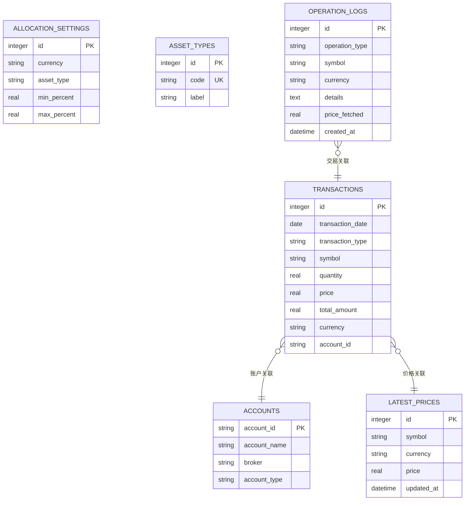

# 调试工具与技巧

<cite>
**本文档引用的文件**
- [app.py](file://app.py)
- [database.py](file://database.py)
- [logger_config.py](file://logger_config.py)
- [price_fetcher.py](file://price_fetcher.py)
- [requirements.txt](file://requirements.txt)
- [templates/base.html](file://templates/base.html)
- [templates/index.html](file://templates/index.html)
- [templates/holdings.html](file://templates/holdings.html)
- [templates/transactions.html](file://templates/transactions.html)
- [templates/settings.html](file://templates/settings.html)
- [templates/symbol.html](file://templates/symbol.html)
- [templates/charts.html](file://templates/charts.html)
- [templates/add.html](file://templates/add.html)
- [static/style.css](file://static/style.css)
</cite>

## 目录
1. [简介](#简介)
2. [项目结构](#项目结构)
3. [核心组件](#核心组件)
4. [架构概览](#架构概览)
5. [详细组件分析](#详细组件分析)
6. [依赖关系分析](#依赖关系分析)
7. [性能考虑](#性能考虑)
8. [故障排除指南](#故障排除指南)
9. [结论](#结论)

## 简介

本项目是一个基于FastAPI的投资交易日志管理系统，提供了完整的Web界面用于记录和管理股票、债券、贵金属等各类金融产品的交易活动。本文档专注于开发环境中的调试工具与技巧，涵盖IDE配置、断点调试、日志系统使用、数据库查询调试、性能分析、FastAPI应用调试、网络请求调试以及生产环境监控等方面。

## 项目结构

该项目采用模块化设计，主要包含以下核心组件：


**图表来源**
- [app.py](file://app.py#L1-L50)
- [database.py](file://database.py#L1-L50)
- [price_fetcher.py](file://price_fetcher.py#L1-L30)
- [logger_config.py](file://logger_config.py#L1-L20)

**章节来源**
- [app.py](file://app.py#L1-L50)
- [database.py](file://database.py#L1-L50)
- [price_fetcher.py](file://price_fetcher.py#L1-L30)
- [logger_config.py](file://logger_config.py#L1-L20)

## 核心组件

### 应用入口与路由管理

主应用文件定义了完整的Web应用结构，包含HTML页面路由和REST API端点：

- **HTML页面路由**：仪表板、交易列表、添加交易、图表展示、持仓详情、设置页面等
- **API端点**：持仓查询、交易历史、投资组合历史、交易删除等
- **启动事件**：应用启动时初始化数据库

### 数据库操作模块

提供完整的SQLite数据库操作功能：

- **事务管理**：增删改查操作，支持多种交易类型（买入、卖出、分红、拆分等）
- **持仓计算**：实时计算持有量、成本均价、市场价值和盈亏情况
- **价格管理**：维护最新价格表，支持多货币标的价格获取
- **配置管理**：资产配置范围设置、资产类型管理

### 价格获取模块

集成多个数据源进行价格获取：

- **多数据源支持**：AKShare、Yahoo Finance、新浪、腾讯等
- **智能回退机制**：当主要数据源不可用时自动切换到备用源
- **符号类型检测**：自动识别A股、港股、美股、黄金等不同类型的标的

### 日志系统

统一的日志配置和管理：

- **文件轮转**：按天轮转，保留7天日志
- **控制台输出**：同时输出到控制台便于开发调试
- **格式化输出**：包含时间戳、模块名、级别和消息

**章节来源**
- [app.py](file://app.py#L19-L30)
- [database.py](file://database.py#L20-L150)
- [price_fetcher.py](file://price_fetcher.py#L321-L395)
- [logger_config.py](file://logger_config.py#L14-L54)

## 架构概览


**图表来源**
- [app.py](file://app.py#L36-L188)
- [database.py](file://database.py#L262-L310)
- [price_fetcher.py](file://price_fetcher.py#L321-L395)

## 详细组件分析

### FastAPI应用调试

#### 启动和生命周期调试

应用在启动时会执行数据库初始化，这是调试的重点环节：


**图表来源**
- [app.py](file://app.py#L25-L30)
- [database.py](file://database.py#L20-L150)

#### 路由调试技巧

对于不同的路由类型，可以采用相应的调试策略：

1. **HTML页面路由**：通过浏览器开发者工具检查网络请求和响应
2. **API端点**：使用curl或Postman进行直接测试
3. **表单提交**：检查表单验证和数据转换

**章节来源**
- [app.py](file://app.py#L36-L188)

### 数据库查询调试

#### SQL查询优化

数据库模块提供了丰富的查询功能，以下是关键的调试要点：



**图表来源**
- [database.py](file://database.py#L25-L147)

#### 查询性能分析

针对高频查询的优化建议：

1. **索引使用**：确保常用查询字段都有适当索引
2. **参数绑定**：使用参数化查询防止SQL注入
3. **批量操作**：对于大量数据操作使用事务包装

**章节来源**
- [database.py](file://database.py#L140-L147)
- [database.py](file://database.py#L262-L310)

### 日志系统调试

#### 日志级别配置

日志系统采用INFO级别作为默认级别，适合开发和生产环境：


**图表来源**
- [logger_config.py](file://logger_config.py#L22-L38)

#### 日志文件管理

日志文件按天轮转，保留最近7天的文件：

- **文件命名**：app.log.YYYY-MM-DD
- **编码格式**：UTF-8
- **输出位置**：当前工作目录下的logs文件夹

**章节来源**
- [logger_config.py](file://logger_config.py#L14-L54)

### 价格获取服务调试

#### 多数据源回退机制

价格获取模块实现了智能的数据源选择和回退：


**图表来源**
- [price_fetcher.py](file://price_fetcher.py#L321-L395)

**章节来源**
- [price_fetcher.py](file://price_fetcher.py#L321-L395)

## 依赖关系分析

```mermaid
graph TB
subgraph "运行时依赖"
FASTAPI[fastapi>=0.100.0]
UVICORN[uvicorn[standard]>=0.23.0]
JINJA2[jinja2>=3.1.0]
MULTIPART[python-multipart>=0.0.6]
end
subgraph "数据获取依赖"
AKSHARE[akshare>=1.10.0]
YFINANCE[yfinance]
end
subgraph "应用模块"
APP[app.py]
DATABASE[database.py]
LOGGER[logger_config.py]
PRICEFETCHER[price_fetcher.py]
end
APP --> FASTAPI
APP --> JINJA2
APP --> MULTIPART
APP --> DATABASE
APP --> LOGGER
APP --> PRICEFETCHER
DATABASE --> SQLITE[SQLite内置]
PRICEFETCHER --> AKSHARE
PRICEFETCHER --> YFINANCE
LOGGER --> PYTHON[Python logging模块]
```

**图表来源**
- [requirements.txt](file://requirements.txt#L1-L6)
- [app.py](file://app.py#L7-L17)

**章节来源**
- [requirements.txt](file://requirements.txt#L1-L6)

## 性能考虑

### 数据库性能优化

1. **索引策略**：为常用查询字段建立索引
2. **查询优化**：使用LIMIT和OFFSET进行分页
3. **连接池**：合理管理数据库连接

### 应用性能监控

1. **响应时间**：监控各路由的响应时间
2. **内存使用**：关注长时间运行时的内存泄漏
3. **并发处理**：评估高并发场景下的表现

## 故障排除指南

### 常见问题诊断

#### 应用启动问题

**症状**：应用启动失败或数据库初始化异常

**诊断步骤**：
1. 检查数据库文件权限
2. 验证SQLite安装完整性
3. 查看日志文件中的错误信息

**解决方案**：
- 确保有足够的文件系统权限
- 检查磁盘空间充足性
- 验证Python版本兼容性

#### 数据库查询问题

**症状**：查询结果为空或性能异常

**诊断步骤**：
1. 使用SQLite命令行工具直接查询
2. 检查表结构和索引状态
3. 分析查询执行计划

**解决方案**：
- 添加缺失的索引
- 优化WHERE条件
- 调整LIMIT和OFFSET参数

#### 价格获取失败

**症状**：无法获取市场价格数据

**诊断步骤**：
1. 检查网络连接状态
2. 验证数据源可用性
3. 查看详细的错误日志

**解决方案**：
- 检查防火墙设置
- 验证API密钥配置
- 实现适当的重试机制

### 调试工具推荐

#### 开发环境配置

1. **IDE设置**：
   - Python解释器指向正确的虚拟环境
   - 启用Python调试器
   - 配置断点位置

2. **环境变量**：
   ```bash
   export PYTHONPATH="${PYTHONPATH}:."
   export LOG_LEVEL="DEBUG"
   ```

#### 断点调试技巧

1. **FastAPI路由调试**：
   - 在路由函数入口设置断点
   - 检查请求参数解析
   - 验证响应生成过程

2. **数据库操作调试**：
   - 在SQL执行前后设置断点
   - 检查参数绑定正确性
   - 验证事务提交状态

3. **价格获取调试**：
   - 在数据源切换处设置断点
   - 检查异常处理流程
   - 验证返回值格式

#### 网络请求调试

1. **API测试工具**：
   - Postman：测试REST API端点
   - curl：命令行测试
   - Insomnia：高级API测试

2. **浏览器开发者工具**：
   - Network面板监控请求
   - Console面板查看JavaScript错误
   - Elements面板检查DOM结构

#### 日志分析技巧

1. **日志级别选择**：
   - 开发阶段使用DEBUG级别
   - 生产环境使用INFO级别
   - 关键路径使用ERROR级别

2. **日志格式分析**：
   - 时间戳用于排序分析
   - 模块名用于定位问题
   - 请求ID用于关联分析

**章节来源**
- [app.py](file://app.py#L25-L30)
- [database.py](file://database.py#L20-L150)
- [price_fetcher.py](file://price_fetcher.py#L321-L395)
- [logger_config.py](file://logger_config.py#L14-L54)

## 结论

本项目提供了完整的调试工具和技巧集合，涵盖了从基础的IDE配置到复杂的性能分析。通过合理利用日志系统、断点调试、网络请求测试和数据库查询优化，开发者可以有效地诊断和解决各种问题。

关键要点总结：
- 建立完善的日志体系，区分不同级别的信息
- 利用多数据源回退机制提高系统可靠性
- 实施合理的数据库索引策略提升查询性能
- 使用专业的调试工具和方法论
- 建立持续的性能监控和问题预警机制

这些实践不仅适用于当前项目，也可以推广到其他FastAPI应用的开发和维护中。