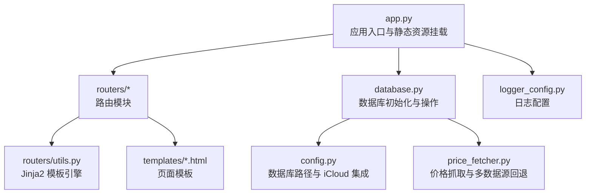
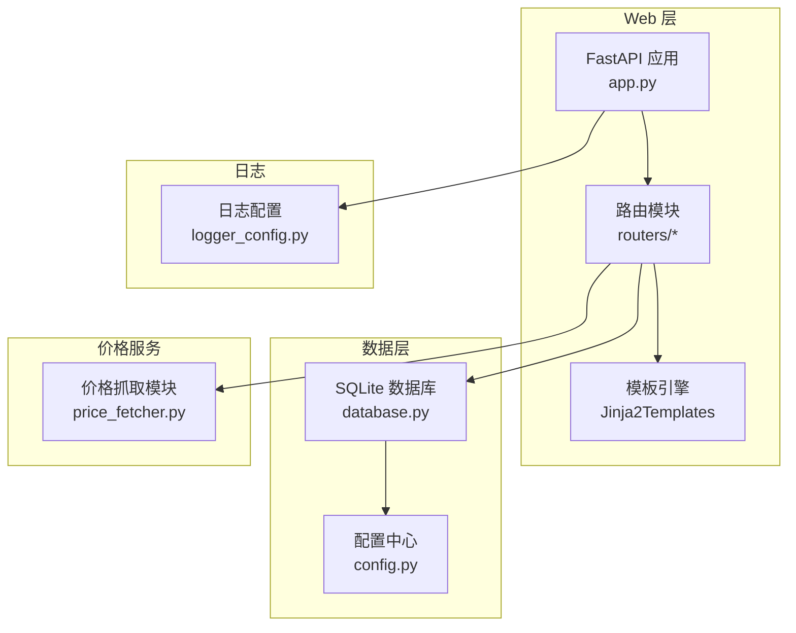
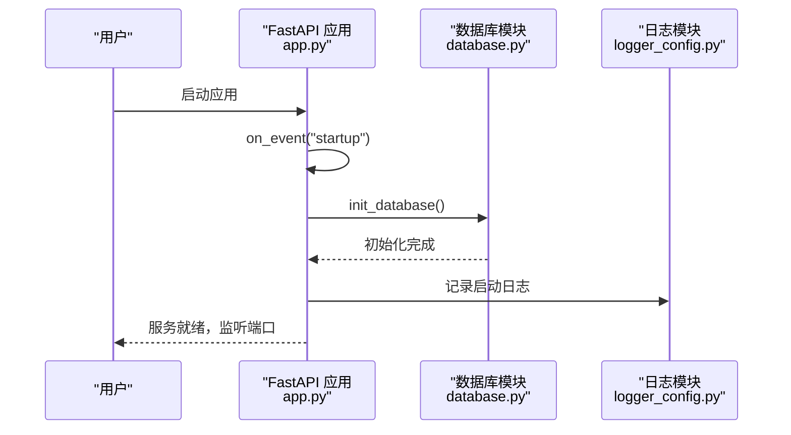
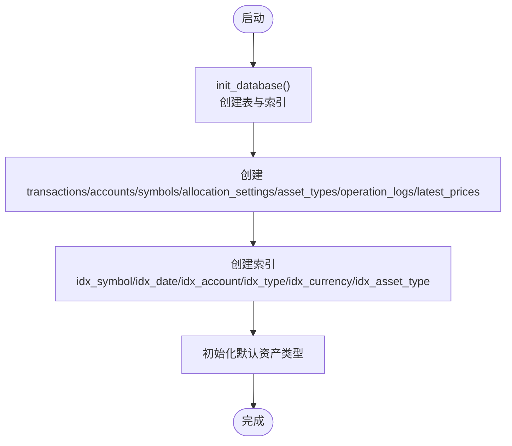
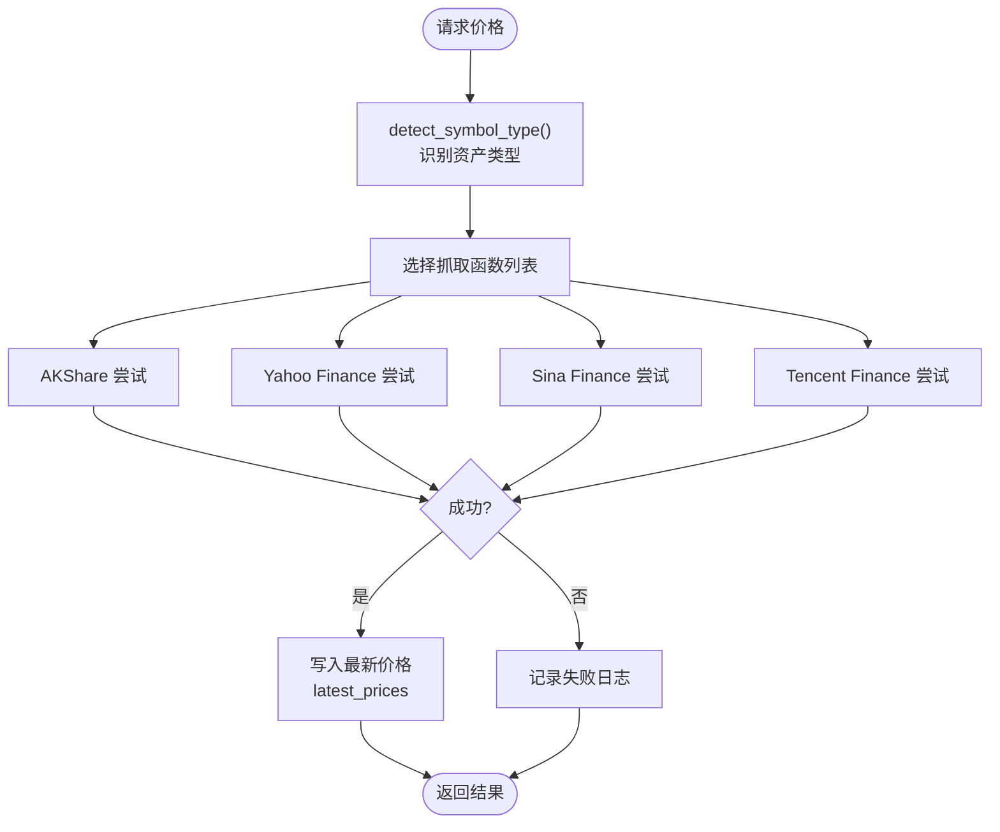
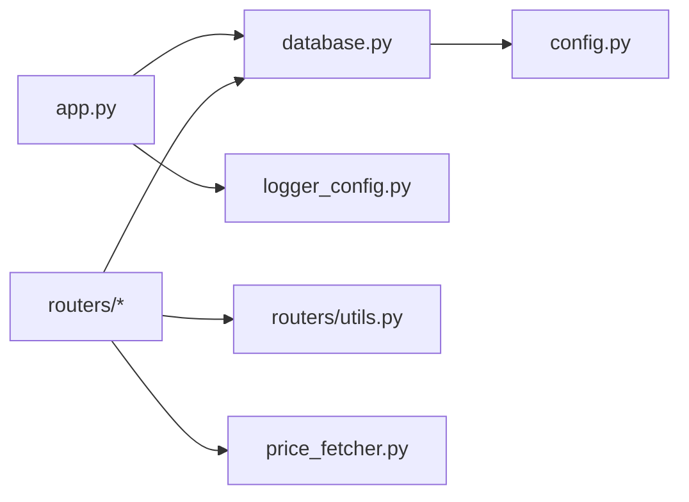

# 快速开始

<cite>
**本文引用的文件**
- [app.py](file://app.py)
- [config.py](file://config.py)
- [database.py](file://database.py)
- [requirements.txt](file://requirements.txt)
- [price_fetcher.py](file://price_fetcher.py)
- [logger_config.py](file://logger_config.py)
- [routers/api.py](file://routers/api.py)
- [routers/holdings.py](file://routers/holdings.py)
- [routers/utils.py](file://routers/utils.py)
- [templates/index.html](file://templates/index.html)
</cite>

## 目录
1. [简介](#简介)
2. [项目结构](#项目结构)
3. [核心组件](#核心组件)
4. [架构总览](#架构总览)
5. [详细组件分析](#详细组件分析)
6. [依赖关系分析](#依赖关系分析)
7. [性能与可用性建议](#性能与可用性建议)
8. [故障排除指南](#故障排除指南)
9. [结论](#结论)
10. [附录：安装与运行步骤](#附录安装与运行步骤)

## 简介
本指南面向新手开发者，帮助你在约30分钟内完成投资日志管理系统的环境准备、依赖安装、数据库初始化、应用启动与界面访问。系统基于 FastAPI 提供 Web 接口与模板渲染，使用 SQLite 存储交易与持仓数据，并通过多数据源价格抓取模块实现资产实时价格更新。

## 项目结构
项目采用“应用入口 + 配置 + 数据库 + 路由 + 模板 + 日志”的分层组织方式：
- 应用入口与静态资源挂载：app.py
- 配置中心：config.py（含 iCloud 默认数据库路径）
- 数据库初始化与事务/账户/分配设置等操作：database.py
- 价格抓取与多数据源回退：price_fetcher.py
- 日志配置：logger_config.py
- 路由模块：routers/ 下的各子路由（如 holdings、api 等）
- 模板与样式：templates/ 与 static/style.css
- 依赖声明：requirements.txt

图表来源
- [app.py](file://app.py#L1-L34)
- [database.py](file://database.py#L1-L151)
- [config.py](file://config.py#L1-L24)
- [price_fetcher.py](file://price_fetcher.py#L1-L405)
- [logger_config.py](file://logger_config.py#L1-L54)
- [routers/utils.py](file://routers/utils.py#L1-L4)

章节来源
- [app.py](file://app.py#L1-L34)
- [config.py](file://config.py#L1-L24)

## 核心组件
- 应用入口与生命周期
  - 启动时自动初始化数据库；挂载静态资源目录；注册各路由模块。
- 配置中心
  - 默认数据库路径位于 iCloud 投资日志文件夹；可通过环境变量覆盖。
- 数据库模块
  - 初始化表结构与索引；提供交易、账户、符号、分配设置、资产类型、操作日志、最新价格等 CRUD 与查询接口。
- 价格抓取模块
  - 支持 A 股、港股、美股、黄金等多类资产，优先使用 AKShare，其次 Yahoo Finance，再回退 Sina/Tencent。
- 日志模块
  - 控制台与按日滚动的日志文件输出，保留最近 7 天日志。

章节来源
- [app.py](file://app.py#L13-L29)
- [config.py](file://config.py#L10-L24)
- [database.py](file://database.py#L22-L151)
- [price_fetcher.py](file://price_fetcher.py#L1-L405)
- [logger_config.py](file://logger_config.py#L14-L54)

## 架构总览
系统采用“Web 层（FastAPI）+ 模板层（Jinja2）+ 数据层（SQLite）+ 价格服务（多数据源）”的分层架构。应用启动时执行数据库初始化，随后对外提供 HTML 页面与 REST API。

图表来源
- [app.py](file://app.py#L13-L29)
- [routers/holdings.py](file://routers/holdings.py#L1-L207)
- [routers/api.py](file://routers/api.py#L1-L67)
- [database.py](file://database.py#L22-L151)
- [config.py](file://config.py#L10-L24)
- [price_fetcher.py](file://price_fetcher.py#L1-L405)
- [logger_config.py](file://logger_config.py#L14-L54)

## 详细组件分析

### 应用入口与启动流程
- 应用在启动事件中调用数据库初始化函数，确保表结构与索引存在。
- 挂载静态资源目录，便于前端样式与脚本加载。
- 注册多个路由模块，分别处理概览、交易、持仓、设置与 API。

图表来源
- [app.py](file://app.py#L18-L22)
- [database.py](file://database.py#L22-L151)
- [logger_config.py](file://logger_config.py#L52-L54)

章节来源
- [app.py](file://app.py#L18-L29)

### 数据库初始化与表结构
- 初始化事务、账户、符号、分配设置、资产类型、操作日志、最新价格等表。
- 创建常用字段索引，提升查询性能。
- 支持资产类型动态扩展与默认初始化。

图表来源
- [database.py](file://database.py#L22-L151)

章节来源
- [database.py](file://database.py#L22-L151)

### 价格抓取与多数据源回退
- 自动识别 A 股、港股、美股、黄金、债券、现金等资产类型。
- 优先使用 AKShare，其次 Yahoo Finance，再回退 Sina/Tencent。
- 成功或失败都会记录操作日志，便于追踪。

图表来源
- [price_fetcher.py](file://price_fetcher.py#L325-L401)
- [database.py](file://database.py#L838-L883)

章节来源
- [price_fetcher.py](file://price_fetcher.py#L36-L66)
- [price_fetcher.py](file://price_fetcher.py#L325-L401)
- [database.py](file://database.py#L838-L883)

### 日志与错误处理
- 日志按天滚动，保留 7 天；同时输出到控制台。
- 路由层对删除交易等操作进行日志记录与异常处理。

章节来源
- [logger_config.py](file://logger_config.py#L14-L54)
- [routers/api.py](file://routers/api.py#L59-L67)

## 依赖关系分析
- 应用入口依赖数据库模块与日志模块；路由模块依赖数据库与模板引擎；价格抓取模块依赖外部库（可选）。
- 配置模块集中管理数据库路径，支持通过环境变量覆盖。

图表来源
- [app.py](file://app.py#L7-L11)
- [routers/utils.py](file://routers/utils.py#L1-L4)
- [config.py](file://config.py#L10-L24)

章节来源
- [app.py](file://app.py#L7-L11)
- [routers/utils.py](file://routers/utils.py#L1-L4)
- [config.py](file://config.py#L10-L24)

## 性能与可用性建议
- 数据库索引已内置，建议定期备份数据库文件。
- 价格抓取模块会尝试多个数据源，网络不稳定时可考虑手动更新价格。
- 日志文件按天滚动，建议定期清理旧日志以节省磁盘空间。

[本节为通用建议，无需特定文件引用]

## 故障排除指南
- 数据库文件权限问题
  - 症状：应用启动时报错或无法写入。
  - 处理：确认数据库路径可写；若使用 iCloud，请确保应用有访问权限。
- 价格抓取失败
  - 症状：页面提示价格获取失败。
  - 处理：检查网络连通性；尝试手动更新价格；确认目标资产类型是否受支持。
- 依赖缺失
  - 症状：导入模块报错。
  - 处理：使用 requirements.txt 安装依赖；确保 Python 版本满足要求。
- 端口占用
  - 症状：启动时报端口被占用。
  - 处理：修改 app.py 中的端口或释放占用端口。

章节来源
- [config.py](file://config.py#L10-L24)
- [price_fetcher.py](file://price_fetcher.py#L325-L401)
- [requirements.txt](file://requirements.txt#L1-L6)
- [app.py](file://app.py#L31-L33)

## 结论
通过本指南，你可以在半小时内完成环境准备、依赖安装、数据库初始化与应用启动，并成功访问 Web 界面。系统提供了完善的数据库初始化、多数据源价格抓取与日志记录能力，适合个人投资记录与分析使用。

[本节为总结，无需特定文件引用]

## 附录：安装与运行步骤

### 1. 环境准备
- Python 版本要求
  - 建议使用 Python 3.8 及以上版本。
- 克隆项目
  - 使用 Git 克隆仓库到本地目录。
- 安装依赖
  - 在项目根目录执行安装命令，安装 requirements.txt 中声明的依赖。

章节来源
- [requirements.txt](file://requirements.txt#L1-L6)

### 2. 配置文件设置
- 数据库路径
  - 默认数据库路径位于 iCloud 投资日志文件夹；可在 macOS 上通过“系统偏好设置 > Apple ID > iCloud”启用“文稿与备忘录”以确保路径存在。
  - 如需自定义路径，可通过环境变量覆盖数据库路径。
- iClou d集成
  - 若使用 iCloud，默认路径会自动创建；如需本地开发，可设置环境变量指向本地路径。

章节来源
- [config.py](file://config.py#L10-L24)

### 3. 数据库初始化
- 应用启动时会自动执行数据库初始化，创建所需表与索引。
- 也可直接运行数据库模块的初始化函数进行测试。

章节来源
- [app.py](file://app.py#L18-L22)
- [database.py](file://database.py#L22-L151)

### 4. 启动应用
- 运行方式
  - 在项目根目录执行应用入口文件，使用 uvicorn 启动服务，默认监听 127.0.0.1:8000。
- 访问界面
  - 打开浏览器访问 http://127.0.0.1:8000 查看首页与各功能页面。

章节来源
- [app.py](file://app.py#L31-L33)

### 5. 常见初始配置选项
- 数据库路径
  - 通过环境变量覆盖默认 iCloud 路径，适用于本地开发或自定义存储位置。
- 价格抓取
  - 系统会自动尝试多种数据源；若网络受限，可使用手动更新价格功能。
- 日志
  - 日志文件保存在 logs 目录，按天滚动，保留 7 天。

章节来源
- [config.py](file://config.py#L21-L24)
- [logger_config.py](file://logger_config.py#L11-L31)

### 6. 验证安装成功
- 页面访问
  - 成功启动后，访问首页应显示投资组合概览与资产分布图表。
- 数据库验证
  - 首次访问会触发数据库初始化；可在日志中看到初始化信息。
- 价格更新
  - 在持仓页面尝试更新某只资产的价格，成功后应显示更新成功的提示。

章节来源
- [templates/index.html](file://templates/index.html#L1-L90)
- [logger_config.py](file://logger_config.py#L52-L54)
- [routers/holdings.py](file://routers/holdings.py#L102-L148)