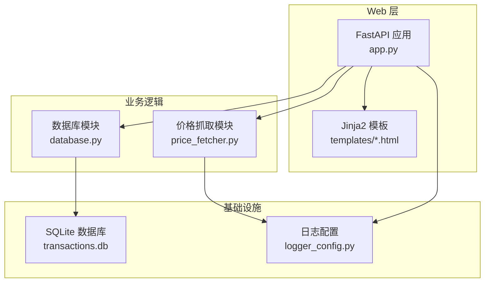
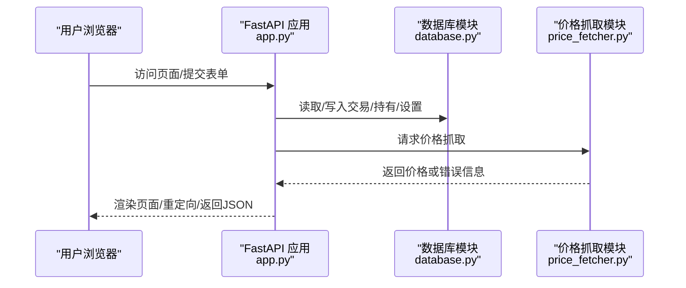
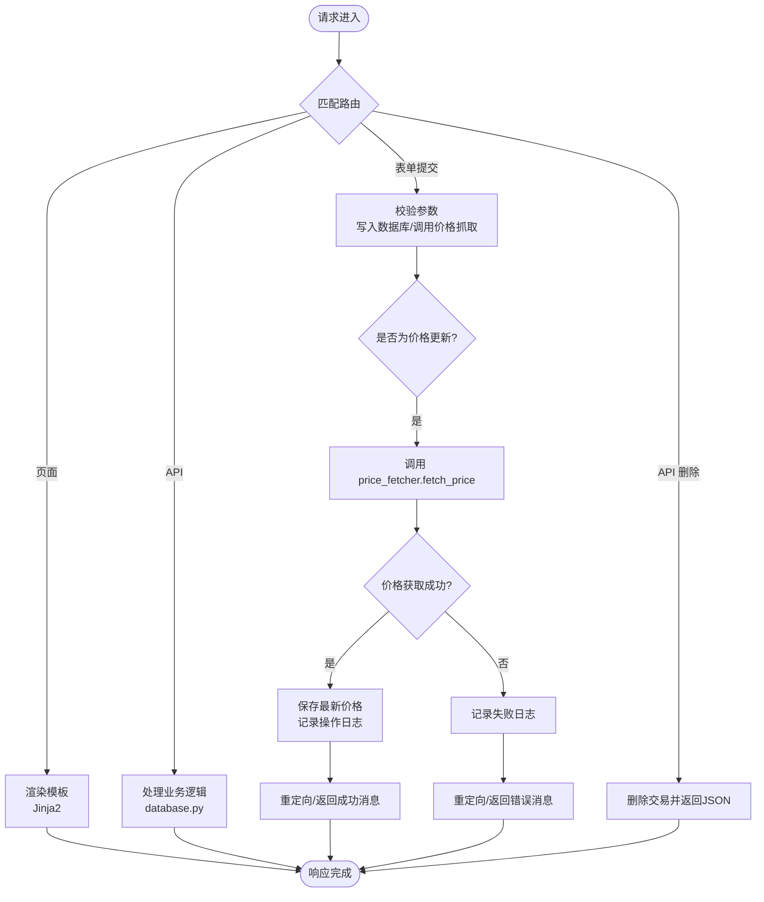
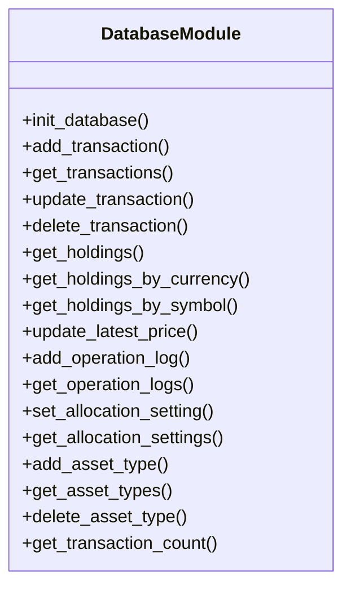
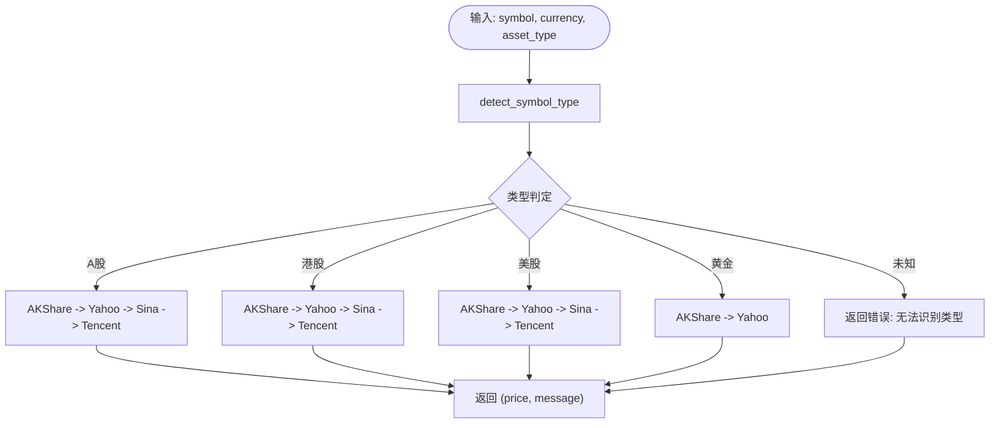
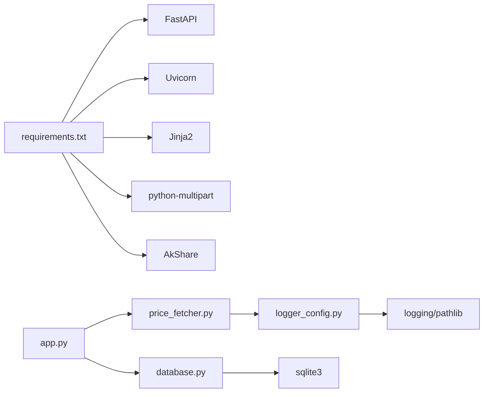

# 故障排除与FAQ

<cite>
**本文引用的文件**
- [app.py](file://app.py)
- [database.py](file://database.py)
- [price_fetcher.py](file://price_fetcher.py)
- [logger_config.py](file://logger_config.py)
- [requirements.txt](file://requirements.txt)
</cite>

## 目录
1. [简介](#简介)
2. [项目结构](#项目结构)
3. [核心组件](#核心组件)
4. [架构总览](#架构总览)
5. [详细组件分析](#详细组件分析)
6. [依赖关系分析](#依赖关系分析)
7. [性能考虑](#性能考虑)
8. [故障排除指南](#故障排除指南)
9. [结论](#结论)
10. [附录](#附录)

## 简介
本指南面向“投资日志”系统的使用者与维护者，提供系统性的故障排除与常见问题解答。内容覆盖数据库连接问题、API 调用失败、价格获取异常、性能问题识别与优化、日志分析与错误定位策略、用户常见问题解答、系统监控指标与预警机制、紧急情况处理流程与恢复策略，以及社区支持与问题反馈渠道。

## 项目结构
该系统采用轻量级 Web 应用架构：
- Web 层：FastAPI 提供路由与页面渲染（Jinja2 模板）
- 数据层：SQLite 数据库，封装在独立模块中
- 价格服务：多数据源价格抓取模块，支持回退策略
- 日志：统一的日志配置，按天轮转并保留 7 天

图表来源
- [app.py](file://app.py#L1-L444)
- [database.py](file://database.py#L1-L944)
- [price_fetcher.py](file://price_fetcher.py#L1-L398)
- [logger_config.py](file://logger_config.py#L1-L54)

章节来源
- [app.py](file://app.py#L1-L444)
- [database.py](file://database.py#L1-L944)
- [price_fetcher.py](file://price_fetcher.py#L1-L398)
- [logger_config.py](file://logger_config.py#L1-L54)

## 核心组件
- Web 应用与路由：负责页面渲染、表单提交、API 接口与重定向
- 数据库模块：负责初始化表结构、事务 CRUD、持有头寸计算、价格与操作日志管理
- 价格抓取模块：根据标的类型与货币选择数据源，执行多级回退
- 日志模块：统一输出 INFO/WARNING/ERROR 级别日志，支持控制台与文件输出

章节来源
- [app.py](file://app.py#L1-L444)
- [database.py](file://database.py#L1-L944)
- [price_fetcher.py](file://price_fetcher.py#L1-L398)
- [logger_config.py](file://logger_config.py#L1-L54)

## 架构总览
系统启动时进行数据库初始化，随后通过 FastAPI 提供页面与 API。页面交互通过表单提交触发数据库写入或价格抓取；API 接口返回 JSON 数据用于前端图表与列表展示。

图表来源
- [app.py](file://app.py#L1-L444)
- [database.py](file://database.py#L1-L944)
- [price_fetcher.py](file://price_fetcher.py#L1-L398)

## 详细组件分析

### Web 应用与路由（app.py）
- 启动事件：应用启动时初始化数据库并记录日志
- 页面路由：首页、交易列表、添加交易、图表、持有详情、符号详情、设置页
- 表单处理：添加交易、快速交易、资产价值调整、批量更新价格
- API 接口：持有、按币种分组、交易查询、组合历史、删除交易
- 错误处理：对不存在的交易删除返回 404；价格更新失败记录日志并重定向带错误消息

图表来源
- [app.py](file://app.py#L1-L444)
- [database.py](file://database.py#L1-L944)
- [price_fetcher.py](file://price_fetcher.py#L1-L398)

章节来源
- [app.py](file://app.py#L25-L30)
- [app.py](file://app.py#L36-L188)
- [app.py](file://app.py#L191-L291)
- [app.py](file://app.py#L216-L261)
- [app.py](file://app.py#L376-L438)

### 数据库模块（database.py）
- 初始化：创建交易、账户、符号、分配设置、资产类型、操作日志、最新价格等表，并建立索引
- 事务 CRUD：新增、查询、更新、删除交易；自动计算总金额与更新时间
- 持有计算：按符号、账户、币种、资产类型汇总份额与成本，支持未实现损益计算
- 价格与日志：保存最新价格、记录操作日志（含价格抓取结果）
- 配置管理：分配区间设置、资产类型增删查改
- 辅助查询：交易计数、分页查询、红利与已实现收益查询

图表来源
- [database.py](file://database.py#L20-L149)
- [database.py](file://database.py#L156-L255)
- [database.py](file://database.py#L312-L431)
- [database.py](file://database.py#L779-L799)
- [database.py](file://database.py#L733-L772)
- [database.py](file://database.py#L615-L670)
- [database.py](file://database.py#L847-L900)
- [database.py](file://database.py#L903-L937)

章节来源
- [database.py](file://database.py#L20-L149)
- [database.py](file://database.py#L156-L255)
- [database.py](file://database.py#L312-L431)
- [database.py](file://database.py#L733-L799)
- [database.py](file://database.py#L615-L670)
- [database.py](file://database.py#L847-L900)
- [database.py](file://database.py#L903-L937)

### 价格抓取模块（price_fetcher.py）
- 符号类型检测：根据币种与格式判断 A 股、港股、美股、黄金等
- 多数据源回退：优先 AKShare，其次 Yahoo Finance，再 Sina/Tencent API
- 统一返回：(价格, 消息)，失败时返回错误汇总
- 异常处理：各数据源捕获异常并记录调试日志，不影响整体流程

图表来源
- [price_fetcher.py](file://price_fetcher.py#L36-L62)
- [price_fetcher.py](file://price_fetcher.py#L321-L394)

章节来源
- [price_fetcher.py](file://price_fetcher.py#L36-L62)
- [price_fetcher.py](file://price_fetcher.py#L321-L394)

### 日志模块（logger_config.py）
- 输出：同时输出到控制台与按天轮转的文件（保留 7 天）
- 格式：包含时间、名称、级别与消息
- 使用：应用与价格抓取模块均通过 logger 输出日志

章节来源
- [logger_config.py](file://logger_config.py#L14-L53)
- [app.py](file://app.py#L109-L110)
- [app.py](file://app.py#L244-L245)
- [app.py](file://app.py#L257-L258)
- [price_fetcher.py](file://price_fetcher.py#L82-L83)

## 依赖关系分析
- 运行时依赖：FastAPI、Uvicorn、Jinja2、python-multipart、AkShare
- 模块耦合：app.py 依赖 database.py 与 price_fetcher.py；price_fetcher.py 依赖 logger_config.py；database.py 依赖 sqlite3；logger_config.py 依赖 logging 与 pathlib

图表来源
- [requirements.txt](file://requirements.txt#L1-L6)
- [app.py](file://app.py#L15-L17)
- [price_fetcher.py](file://price_fetcher.py#L20-L33)
- [database.py](file://database.py#L7-L10)
- [logger_config.py](file://logger_config.py#L7-L9)

章节来源
- [requirements.txt](file://requirements.txt#L1-L6)
- [app.py](file://app.py#L15-L17)
- [price_fetcher.py](file://price_fetcher.py#L20-L33)
- [database.py](file://database.py#L7-L10)
- [logger_config.py](file://logger_config.py#L7-L9)

## 性能考虑
- 数据库查询与索引：已为 symbol/date/account/type/currency/asset_type 建立索引，有助于交易查询与分页
- 分页策略：交易列表默认每页 100 条，避免一次性加载过多数据
- 价格缓存：最新价格存储于 latest_prices 表，减少重复抓取
- 日志级别：INFO/WARNING/ERROR，避免过量日志影响性能
- 建议优化：
  - 对高频查询增加复合索引（如 symbol+date）
  - 限制前端图表数据点数量
  - 在高并发场景下考虑连接池与异步化

章节来源
- [database.py](file://database.py#L140-L146)
- [app.py](file://app.py#L49-L66)
- [database.py](file://database.py#L779-L799)

## 故障排除指南

### 通用诊断流程
1. 确认服务状态
   - 检查应用进程是否运行（Uvicorn）
   - 查看日志目录是否存在且可写
2. 检查数据库
   - 确认数据库文件存在且可访问
   - 执行初始化是否成功
3. 验证网络与依赖
   - 确认所需 Python 包已安装
   - 检查网络连通性（价格抓取需要外网访问）
4. 复现问题并查看日志
   - 观察控制台与日志文件中的错误信息
   - 关注 WARNING/ERROR 级别日志

章节来源
- [logger_config.py](file://logger_config.py#L11-L12)
- [app.py](file://app.py#L25-L29)
- [requirements.txt](file://requirements.txt#L1-L6)

### 数据库连接问题
- 症状
  - 页面加载缓慢或报错
  - API 返回异常或无数据
- 可能原因
  - 数据库文件被占用或权限不足
  - 表结构缺失或损坏
  - 连接超时或并发冲突
- 解决步骤
  - 确认数据库路径与权限
  - 重新初始化数据库（首次运行会自动创建表）
  - 检查是否存在多个进程同时访问数据库
  - 查看日志中是否有数据库相关错误
- 相关实现参考
  - 数据库初始化与表创建
  - 连接工厂与索引建立
  - 事务 CRUD 与查询函数

章节来源
- [database.py](file://database.py#L20-L149)
- [database.py](file://database.py#L13-L17)
- [database.py](file://database.py#L262-L309)

### API 调用失败
- 症状
  - 前端图表或列表空白
  - 控制台出现 404 或其他错误
- 可能原因
  - 路由参数不正确
  - 数据库查询条件导致无结果
  - 删除接口找不到目标记录
- 解决步骤
  - 校验 URL 参数与过滤条件
  - 在数据库中验证是否存在匹配记录
  - 对删除接口检查记录 ID 是否存在
- 相关实现参考
  - API 路由定义与参数解析
  - 查询与分页逻辑
  - 删除接口返回值与异常处理

章节来源
- [app.py](file://app.py#L376-L438)
- [database.py](file://database.py#L262-L309)
- [database.py](file://database.py#L247-L255)

### 价格获取异常
- 症状
  - “价格已更新”后仍显示旧值
  - 更新失败并提示错误
- 可能原因
  - 符号类型识别失败
  - 所有数据源均不可用或返回空值
  - 网络超时或第三方接口限流
- 解决步骤
  - 确认符号格式与币种匹配（A 股、港股、美股、黄金）
  - 检查依赖库是否安装（AkShare/yfinance）
  - 查看日志中服务尝试顺序与错误摘要
  - 尝试手动刷新或稍后再试
- 相关实现参考
  - 符号类型检测
  - 多数据源回退策略
  - 成功/失败日志记录

章节来源
- [price_fetcher.py](file://price_fetcher.py#L36-L62)
- [price_fetcher.py](file://price_fetcher.py#L321-L394)
- [app.py](file://app.py#L216-L261)

### 用户常见使用问题
- 如何添加交易？
  - 访问添加页面，填写日期、符号、类型、数量、价格、账户等字段，提交后跳转到交易列表
- 如何查看某只股票的历史？
  - 在持有详情页选择年份，或直接访问符号详情页
- 如何调整资产价值？
  - 在持有详情页发起价值调整，系统会生成一条调整记录
- 如何设置资产配置区间？
  - 在设置页为不同币种与资产类型设定上下限百分比
- 如何快速买卖？
  - 在持有详情页使用快速交易功能

章节来源
- [app.py](file://app.py#L69-L80)
- [app.py](file://app.py#L124-L141)
- [app.py](file://app.py#L144-L188)
- [app.py](file://app.py#L191-L213)
- [app.py](file://app.py#L294-L325)
- [app.py](file://app.py#L264-L291)

### 日志分析与错误定位
- 日志位置
  - 文件：logs/app.log（按天轮转，保留 7 天）
  - 控制台：应用启动与运行期间实时输出
- 常见关键字
  - “Application started, database initialized”：确认启动成功
  - “Price update requested/updated/failed”：价格抓取流程
  - “Transaction added/deleted”：交易 CRUD
  - “All price services failed”：价格抓取失败汇总
- 定位步骤
  - 按时间线查看最近日志
  - 关注 ERROR/WARNING 行，结合上下文定位
  - 结合数据库与价格抓取模块的调用链

章节来源
- [logger_config.py](file://logger_config.py#L24-L48)
- [app.py](file://app.py#L27-L29)
- [app.py](file://app.py#L109-L110)
- [app.py](file://app.py#L244-L245)
- [app.py](file://app.py#L257-L258)
- [price_fetcher.py](file://price_fetcher.py#L392-L394)

### 性能问题识别与优化
- 识别信号
  - 页面加载缓慢、API 响应延迟
  - 日志中频繁出现查询耗时警告
- 优化方向
  - 增加复合索引以加速常用查询
  - 限制前端数据量（分页、时间范围）
  - 缓存热点数据（如最新价格）
  - 减少不必要的日志输出级别

章节来源
- [database.py](file://database.py#L140-L146)
- [app.py](file://app.py#L49-L66)

### 系统监控指标与预警机制
- 建议指标
  - 应用启动次数与健康状态
  - 数据库查询耗时分布
  - 价格抓取成功率与失败率
  - 日志 ERROR/WARNING 比例
- 预警建议
  - 设置日志 ERROR/WARNING 阈值告警
  - 监控价格抓取失败率突增
  - 监控数据库连接异常与锁等待

[本节为通用建议，无需特定文件引用]

### 紧急情况处理流程与恢复策略
- 紧急处理
  - 停止服务，备份数据库文件
  - 检查磁盘空间与权限
  - 重启服务并观察日志
- 恢复策略
  - 若数据库损坏：从备份恢复
  - 若依赖缺失：安装缺失包并重启
  - 若价格抓取持续失败：切换网络或更换数据源

[本节为通用建议，无需特定文件引用]

### 社区支持与问题反馈渠道
- 本地化支持
  - 本项目为个人工具，无官方社区渠道
  - 建议通过仓库 Issues 反馈问题
- 反馈内容建议
  - 环境信息（Python 版本、操作系统）
  - 依赖版本（requirements.txt 中列出）
  - 复现步骤与期望结果
  - 日志片段与错误截图

章节来源
- [requirements.txt](file://requirements.txt#L1-L6)

## 结论
本指南提供了从系统架构到具体故障排查的完整路径。通过理解模块职责、掌握日志分析方法、遵循诊断流程与优化建议，可以高效定位并解决大多数运行期问题。建议在生产环境中配合外部监控与备份策略，确保系统的稳定性与可恢复性。

## 附录

### 快速检查清单
- 依赖安装：确认 requirements 中包均已安装
- 数据库可用：确认数据库文件存在且可读写
- 价格抓取：确认网络可达，必要时检查代理
- 日志可用：确认 logs 目录存在且可写
- 页面与 API：逐项验证关键页面与接口

章节来源
- [requirements.txt](file://requirements.txt#L1-L6)
- [logger_config.py](file://logger_config.py#L11-L12)
- [app.py](file://app.py#L25-L29)