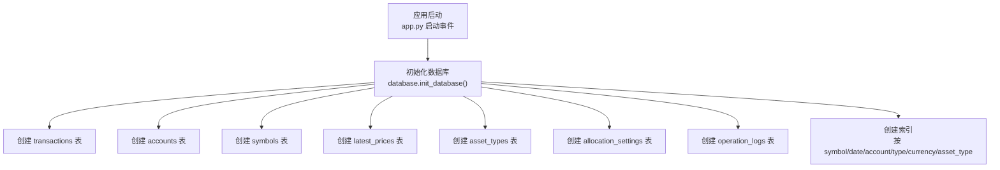
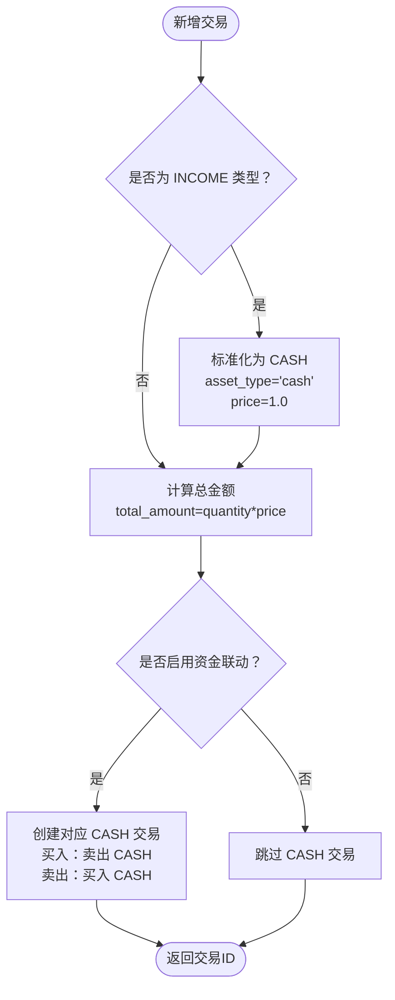
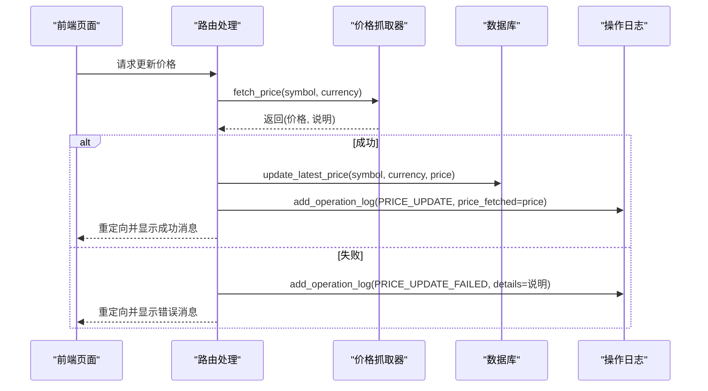
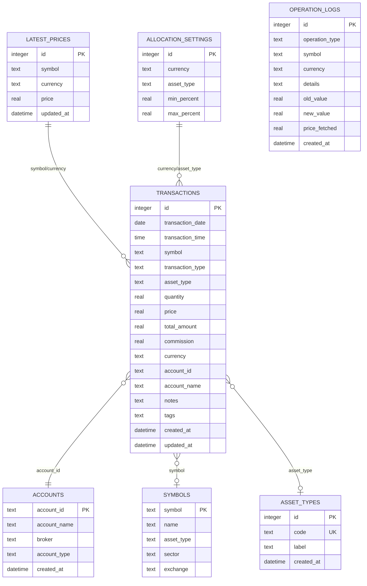

# 数据库表结构

<cite>
**本文引用的文件**
- [database.py](file://database.py)
- [app.py](file://app.py)
- [config.py](file://config.py)
- [price_fetcher.py](file://price_fetcher.py)
- [routers/transactions.py](file://routers/transactions.py)
- [routers/settings.py](file://routers/settings.py)
</cite>

## 目录
1. [简介](#简介)
2. [项目结构与数据库初始化](#项目结构与数据库初始化)
3. [核心表结构总览](#核心表结构总览)
4. [交易表 transactions](#交易表-transactions)
5. [账户表 accounts](#账户表-accounts)
6. [符号表 symbols](#符号表-symbols)
7. [最新价格表 latest_prices](#最新价格表-latest_prices)
8. [资产类型表 asset_types](#资产类型表-asset_types)
9. [分配设置表 allocation_settings](#分配设置表-allocation_settings)
10. [操作日志表 operation_logs](#操作日志表-operation_logs)
11. [表间关系与外键约束](#表间关系与外键约束)
12. [业务规则与约束说明](#业务规则与约束说明)
13. [性能与索引优化](#性能与索引优化)
14. [故障排查与常见问题](#故障排查与常见问题)
15. [结论](#结论)

## 简介
本文件系统性梳理投资日志管理系统的数据库表结构，重点解释交易表 transactions 的完整字段、业务规则与数据完整性保障；同时详述账户表 accounts、符号表 symbols、最新价格表 latest_prices、资产类型表 asset_types、分配设置表 allocation_settings 的设计目的、字段定义、取值范围与约束条件。通过 ER 关系图与流程图，帮助开发者快速理解数据模型与各组件间的协作方式。

## 项目结构与数据库初始化
- 应用启动时会调用数据库初始化函数，创建所有必要表与索引。
- 数据库存储路径默认位于用户 iCloud 目录下的应用专用文件夹，便于跨设备同步与备份。
- 初始化流程包含：创建交易表、账户表、符号表、最新价格表、资产类型表、分配设置表、操作日志表，并建立常用查询索引。

图表来源
- [app.py](file://app.py#L18-L22)
- [database.py](file://database.py#L22-L151)

章节来源
- [app.py](file://app.py#L18-L22)
- [config.py](file://config.py#L10-L24)
- [database.py](file://database.py#L22-L151)

## 核心表结构总览
- 交易表 transactions：记录买入、卖出、分红、拆分、转账、调整、收入等各类交易流水，是系统的核心数据载体。
- 账户表 accounts：维护交易账户信息，用于区分不同账户的资产分布与收益。
- 符号表 symbols：记录股票/ETF等标的的基本信息（名称、资产类型、行业、交易所），可选扩展。
- 最新价格表 latest_prices：缓存各标的在不同货币下的最新价格，支持实时估值与损益计算。
- 资产类型表 asset_types：动态管理资产类型（股票、债券、贵金属、现金），支持国际化标签。
- 分配设置表 allocation_settings：为每种货币与资产类型的组合设定最小/最大配置区间，用于资产配置监控。
- 操作日志表 operation_logs：记录关键操作（如价格更新）的执行结果与详情，便于审计与排障。

章节来源
- [database.py](file://database.py#L27-L151)

## 交易表 transactions
交易表是系统的核心，承载所有投资活动的数据。其字段与约束如下：

- 主键与自增
  - id：整型，自增主键，唯一标识每笔交易。
- 基础日期时间
  - transaction_date：日期，必填，交易发生的日期。
  - transaction_time：时间，可空，精确到秒的交易时间（可选）。
- 标的与数量
  - symbol：文本，必填，交易标的代码（统一大写存储）。
  - quantity：实数，必填，交易数量（份额或股数）。
  - price：实数，必填，成交单价。
  - total_amount：实数，必填，总金额（未扣佣金时为 quantity × price）。
  - commission：实数，默认 0，交易手续费。
- 交易类型与资产类型
  - transaction_type：文本，必填，交易类型枚举：
    - BUY、SELL、DIVIDEND、SPLIT、TRANSFER_IN、TRANSFER_OUT、ADJUST、INCOME
  - asset_type：文本，默认 stock，资产类型枚举：
    - stock、bond、metal、cash
- 货币与账户
  - currency：文本，默认 CNY，货币枚举：
    - CNY、USD、HKD
  - account_id：文本，必填，关联账户 ID。
  - account_name：文本，可空，账户名称快照（便于展示与报表）。
- 元数据
  - notes：文本，可空，备注。
  - tags：文本，可空，标签（逗号分隔）。
  - created_at：日期时间，默认当前时间，记录创建时间。
  - updated_at：日期时间，可空，记录最后更新时间。
- 约束与校验
  - 交易类型与资产类型使用 CHECK 约束限定取值集合。
  - 货币使用 CHECK 约束限定取值集合。
  - quantity、price、total_amount 必须为非负数值（由业务层保证）。
  - commission 默认 0，但可为正数（含正向佣金或反向返还）。

业务规则与逻辑要点
- INCOME 类型交易会强制将 symbol 设为 CASH、asset_type 设为 cash、price 设为 1.0，确保现金流入的标准化。
- link_cash 参数开启时，买入/卖出交易会自动生成一笔与之对应的 CASH 流水（买入时卖出 CASH，卖出时买入 CASH），金额为 total_amount ± commission，实现资金链路闭环。
- 更新交易时，若 quantity 或 price 发生变化，会自动重算 total_amount 并更新 updated_at。
- 查询支持按 symbol、account_id、transaction_type、currency、年份、起止日期过滤，并按日期与 ID 倒序分页。

图表来源
- [database.py](file://database.py#L177-L225)

章节来源
- [database.py](file://database.py#L27-L48)
- [database.py](file://database.py#L158-L225)
- [database.py](file://database.py#L238-L277)
- [database.py](file://database.py#L294-L342)

## 账户表 accounts
- 字段
  - account_id：文本，主键，账户唯一标识。
  - account_name：文本，必填，账户名称。
  - broker：文本，可空，券商名称。
  - account_type：文本，可空，账户类型（如普通、信用、期权等）。
  - created_at：日期时间，默认当前时间，创建时间。
- 约束
  - account_id 唯一且为主键。
- 业务规则
  - 删除账户前需检查是否存在交易记录，若存在则禁止删除。
  - 新增账户时若 account_id 已存在则插入失败（由数据库唯一约束保证）。

章节来源
- [database.py](file://database.py#L56-L65)
- [database.py](file://database.py#L633-L658)

## 符号表 symbols
- 字段
  - symbol：文本，主键，标的代码（统一大写）。
  - name：文本，可空，标的名称。
  - asset_type：文本，可空，资产类型（可选扩展）。
  - sector：文本，可空，所属行业/板块。
  - exchange：文本，可空，交易所。
- 约束
  - symbol 唯一且为主键。
- 用途
  - 可作为标的字典表，辅助展示与统计；系统核心逻辑并不依赖此表进行业务判断。

章节来源
- [database.py](file://database.py#L67-L76)

## 最新价格表 latest_prices
- 字段
  - id：整型，自增主键。
  - symbol：文本，必填，标的代码。
  - currency：文本，必填，货币。
  - price：实数，必填，最新价格。
  - updated_at：日期时间，默认当前时间，更新时间。
- 约束
  - (symbol, currency) 唯一，避免重复覆盖导致数据错乱。
- 操作
  - update_latest_price：插入或更新最新价格，冲突时更新价格与更新时间。
  - get_latest_price：按 symbol+currency 获取最新价格。
  - get_all_latest_prices：返回以 (symbol, currency) 为键的价格映射。
- 与价格抓取器的集成
  - price_fetcher 模块根据标的类型与货币选择合适的数据源抓取价格，成功后通过 update_latest_price 写入数据库，并记录 operation_logs。

图表来源
- [routers/holdings.py](file://routers/holdings.py#L102-L147)
- [price_fetcher.py](file://price_fetcher.py#L325-L401)
- [database.py](file://database.py#L838-L883)

章节来源
- [database.py](file://database.py#L130-L140)
- [database.py](file://database.py#L838-L883)
- [price_fetcher.py](file://price_fetcher.py#L325-L401)
- [routers/holdings.py](file://routers/holdings.py#L102-L147)

## 资产类型表 asset_types
- 字段
  - id：整型，自增主键。
  - code：文本，必填且唯一，资产类型代码（如 stock、bond、metal、cash）。
  - label：文本，必填，资产类型中文标签（如 股票、债券、贵金属、现金）。
  - created_at：日期时间，默认当前时间。
- 初始化
  - 若表为空，自动插入默认资产类型集合。
- 动态管理
  - 支持新增、删除与校验是否被使用（若存在交易记录则禁止删除）。
  - 提供 code->label 映射查询接口，用于展示与报表。

章节来源
- [database.py](file://database.py#L90-L114)
- [database.py](file://database.py#L890-L960)

## 分配设置表 allocation_settings
- 字段
  - id：整型，自增主键。
  - currency：文本，必填，货币（CNY/USD/HKD）。
  - asset_type：文本，必填，资产类型代码。
  - min_percent：实数，默认 0，最小配置百分比。
  - max_percent：实数，默认 100，最大配置百分比。
- 约束
  - (currency, asset_type) 唯一，确保每种货币与资产类型的配置唯一。
  - min_percent ≥ 0，max_percent ≤ 100，且 min_percent ≤ max_percent。
- 业务规则
  - 设置时对参数进行校验，非法输入直接拒绝。
  - 支持批量设置与删除。
  - 在资产配置视图中，按 holdings 的成本加权计算占比并与设置区间对比，生成预警提示。

章节来源
- [database.py](file://database.py#L78-L88)
- [database.py](file://database.py#L674-L730)
- [routers/settings.py](file://routers/settings.py#L63-L86)

## 操作日志表 operation_logs
- 字段
  - id：整型，自增主键。
  - operation_type：文本，必填，操作类型（如 PRICE_UPDATE、PRICE_UPDATE_FAILED）。
  - symbol：文本，可空，涉及的标的。
  - currency：文本，可空，货币。
  - details：文本，可空，操作详情。
  - old_value：实数，可空，旧值（如调整前的价值）。
  - new_value：实数，可空，新值（如调整后的价值）。
  - price_fetched：实数，可空，抓取到的价格（用于价格更新场景）。
  - created_at：日期时间，默认当前时间。
- 用途
  - 记录关键操作的执行结果与上下文，便于审计与问题定位。

章节来源
- [database.py](file://database.py#L115-L128)
- [database.py](file://database.py#L792-L832)

## 表间关系与外键约束
- 实际上，系统未在 SQLite 中显式声明外键约束，而是通过业务层与数据一致性策略保证参照完整性：
  - transactions.account_id → accounts.account_id（逻辑关联）
  - transactions.symbol → symbols.symbol（逻辑关联）
  - transactions.asset_type → asset_types.code（逻辑关联）
  - latest_prices(symbol, currency) 与交易中的 symbol/currency 组合形成逻辑关联
- 由于未使用外键级联删除/更新，删除账户或资产类型前必须先检查是否存在相关记录，否则会破坏数据一致性。

图表来源
- [database.py](file://database.py#L27-L151)

## 业务规则与约束说明
- 交易类型与资产类型
  - 交易类型枚举严格限制，确保业务语义清晰。
  - 资产类型枚举独立于货币，一个类型可与任意货币组合。
- 货币与金额
  - 货币枚举限制为 CNY/USD/HKD。
  - 金额字段（quantity、price、total_amount、commission）均为非负数，业务层负责校验。
- INCOME 特例
  - 所有 INCOME 交易统一映射为 CASH 标的、cash 资产类型、price=1.0，便于统一处理。
- link_cash 自动联动
  - 买入/卖出时自动生成对应的 CASH 交易，金额为 total_amount ± commission，保持资金平衡。
- 价格更新与缓存
  - 价格抓取器优先使用多数据源，失败时记录失败日志并返回错误信息。
  - 成功后写入 latest_prices，并记录 operation_logs。
- 配置区间校验
  - 分配设置的 min_percent 与 max_percent 必须满足 0≤min≤max≤100，且货币与资产类型合法。

章节来源
- [database.py](file://database.py#L34-L40)
- [database.py](file://database.py#L177-L181)
- [database.py](file://database.py#L203-L223)
- [database.py](file://database.py#L697-L700)
- [price_fetcher.py](file://price_fetcher.py#L343-L351)

## 性能与索引优化
- 已创建的索引
  - idx_symbol：按 symbol 查询（高频过滤）
  - idx_date：按日期排序与筛选
  - idx_account：按账户查询
  - idx_type：按交易类型查询
  - idx_currency：按货币查询
  - idx_asset_type：按资产类型查询
- 查询建议
  - 交易列表默认按日期与 ID 倒序分页，适合滚动加载。
  - 过滤条件组合使用时，建议优先使用上述索引列（symbol、account_id、transaction_type、currency、asset_type、transaction_date）。
- 价格查询
  - latest_prices 使用 (symbol, currency) 唯一键，查询效率高；批量获取时可使用字典映射减少多次查询。

章节来源
- [database.py](file://database.py#L142-L148)
- [database.py](file://database.py#L874-L883)

## 故障排查与常见问题
- 无法删除账户
  - 原因：账户仍有交易记录。
  - 处理：先清理相关交易或迁移至其他账户，再尝试删除。
- 无法删除资产类型
  - 原因：该资产类型仍被交易使用。
  - 处理：先修改历史交易的资产类型或迁移至其他类型，再尝试删除。
- 价格更新失败
  - 原因：数据源不可用或解析异常。
  - 处理：查看 operation_logs 中的失败记录，确认具体错误原因；检查网络与数据源可用性。
- 交易金额不一致
  - 原因：手动修改 quantity 或 price 后未重新计算 total_amount。
  - 处理：通过更新接口自动重算，或在业务层确保 total_amount 与 quantity×price 一致。
- 资产配置告警
  - 原因：某货币/资产类型的占比超出设置区间。
  - 处理：调整交易或重新设置分配区间。

章节来源
- [database.py](file://database.py#L633-L658)
- [database.py](file://database.py#L927-L960)
- [database.py](file://database.py#L792-L832)
- [routers/settings.py](file://routers/settings.py#L101-L116)

## 结论
本数据库模型围绕交易表为核心，辅以账户、符号、价格、资产类型与分配设置等表，形成完整的投资流水记录与资产配置管理体系。通过严格的枚举约束、业务层的金额与联动逻辑、以及完善的日志与索引策略，系统在保证数据一致性的同时，提供了良好的可扩展性与可维护性。建议在后续版本中考虑引入外键约束与级联策略，进一步提升数据完整性与运维自动化水平。