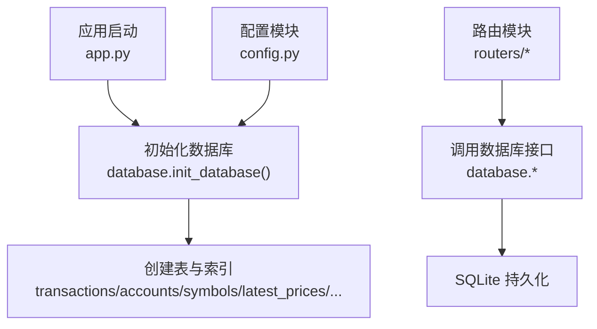
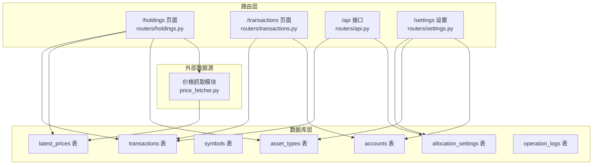
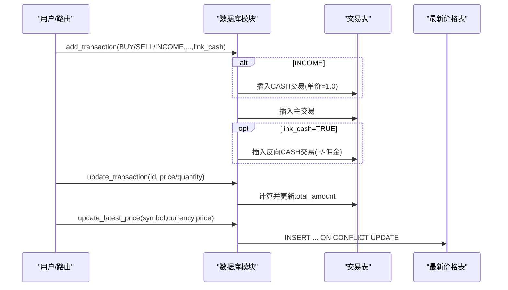
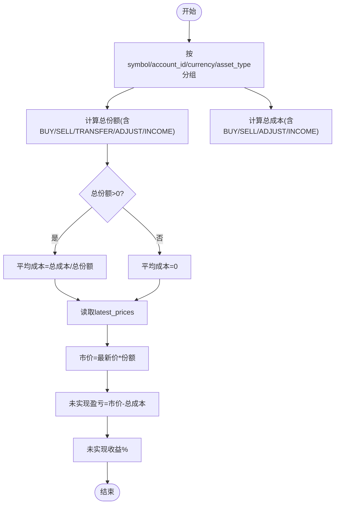
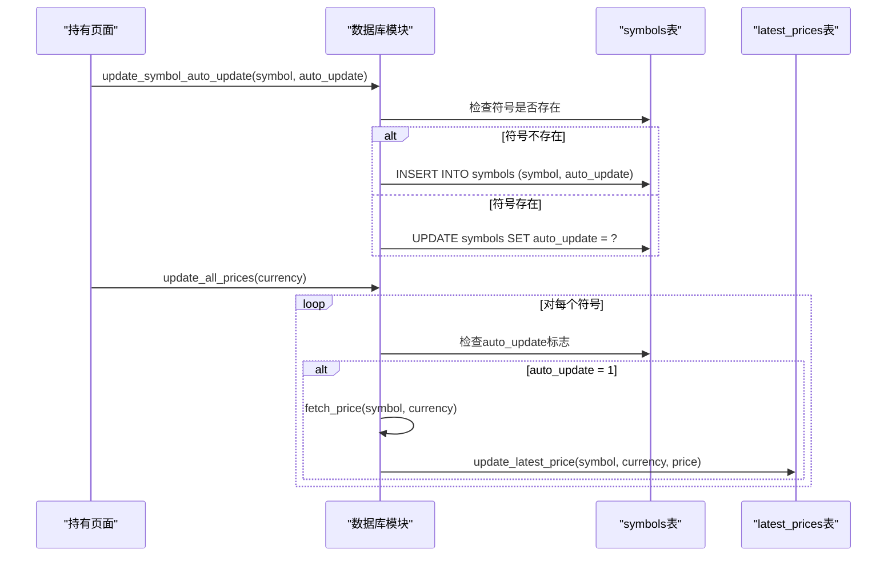
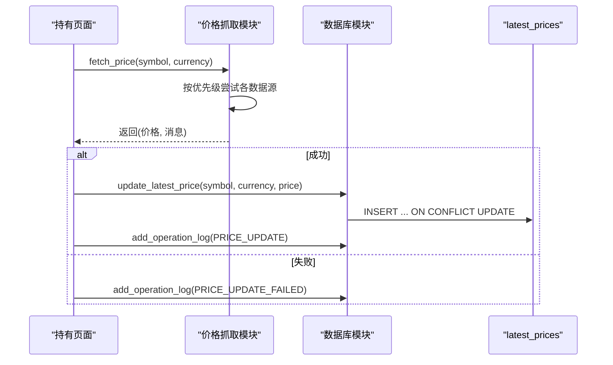
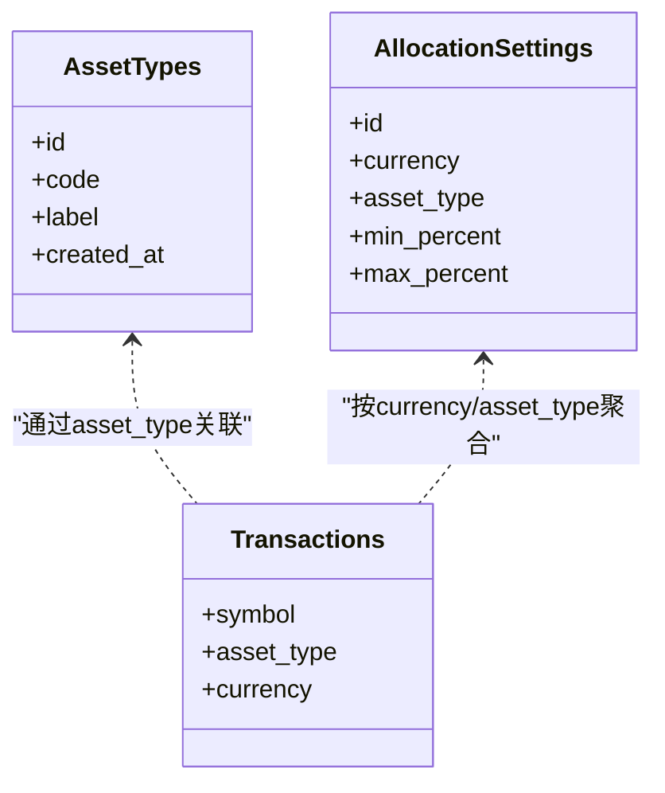
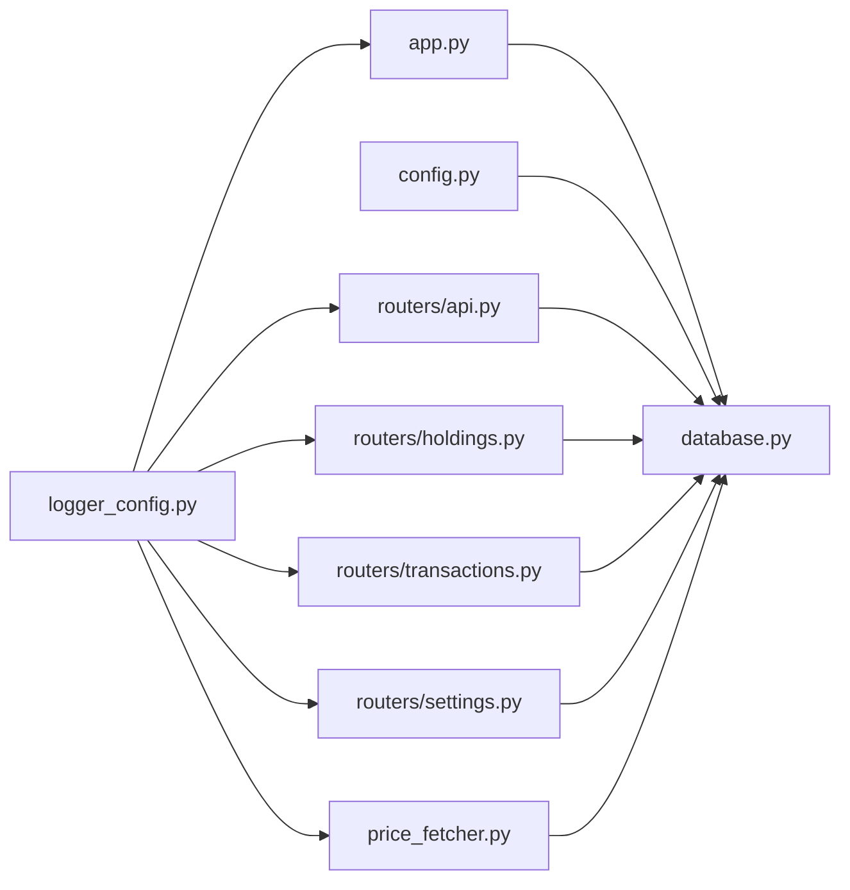

# 数据库设计

<cite>
**本文引用的文件列表**
- [database.py](file://database.py)
- [app.py](file://app.py)
- [config.py](file://config.py)
- [routers/api.py](file://routers/api.py)
- [routers/holdings.py](file://routers/holdings.py)
- [routers/transactions.py](file://routers/transactions.py)
- [routers/settings.py](file://routers/settings.py)
- [price_fetcher.py](file://price_fetcher.py)
- [logger_config.py](file://logger_config.py)
- [requirements.txt](file://requirements.txt)
</cite>

## 目录
1. [简介](#简介)
2. [项目结构与数据库入口](#项目结构与数据库入口)
3. [核心表结构设计](#核心表结构设计)
4. [架构总览](#架构总览)
5. [组件与数据流详解](#组件与数据流详解)
6. [依赖关系与耦合分析](#依赖关系与耦合分析)
7. [性能与查询优化](#性能与查询优化)
8. [迁移与版本演进](#迁移与版本演进)
9. [备份与恢复策略](#备份与恢复策略)
10. [故障排查与日志](#故障排查与日志)
11. [结论](#结论)
12. [附录：常用SQL与操作模式](#附录常用sql与操作模式)

## 简介
本文件面向"投资日志管理系统"的数据库层，系统采用SQLite作为本地存储，结合FastAPI提供Web接口与模板页面。数据库围绕交易记录、账户、资产类别、符号信息以及最新价格等维度进行建模，支持多币种（CNY/USD/HKD）、成本均价计算、持仓状态管理、实时价格缓存与多级查询过滤。系统现已新增符号管理功能、自动更新控制、操作日志表、最新价格表等重要特性，提供更完整的投资管理解决方案。本文从表结构、主外键与索引设计、业务规则实现、数据访问模式、查询优化、缓存机制、迁移与备份、性能监控等方面进行全面阐述，并给出可直接参考的SQL示例路径与操作模式。

## 项目结构与数据库入口
- 应用启动时初始化数据库，创建所需表与索引。
- 配置模块统一管理数据库路径，默认存储在iCloud目录以实现跨设备同步与备份。
- 路由模块通过数据库模块暴露API与页面渲染逻辑。

**图表来源**
- [app.py](file://app.py#L18-L22)
- [config.py](file://config.py#L17-L23)
- [database.py](file://database.py#L22-L195)

**章节来源**
- [app.py](file://app.py#L18-L22)
- [config.py](file://config.py#L17-L23)

## 核心表结构设计
以下为系统中涉及的核心表及其字段、约束与用途概览。字段命名遵循英文，便于跨语言与国际化扩展；业务规则通过CHECK约束、UNIQUE约束与触发逻辑体现。

- **交易表 transactions**
  - 主键：id（自增）
  - 关键字段：日期/时间、符号、交易类型、资产类型、数量、单价、总金额、佣金、币种、账户标识、备注、标签、时间戳
  - 重要约束：
    - 交易类型枚举：BUY/SELL/DIVIDEND/SPLIT/TRANSFER_IN/TRANSFER_OUT/ADJUST/INCOME
    - 资产类型枚举：stock/bond/metal/cash
    - 币种枚举：CNY/USD/HKD
  - 业务要点：
    - INCOME交易强制映射为CASH，单价固定为1.0
    - link_cash参数可联动生成反向CASH交易，用于买入/卖出时自动记录资金流动
    - 更新时若修改quantity或price会自动重算total_amount

- **账户表 accounts**
  - 主键：account_id（唯一）
  - 字段：账户名、券商、账户类型、创建时间
  - 业务要点：删除前检查是否被使用（存在交易）

- **符号表 symbols**
  - 主键：symbol（唯一）
  - 字段：名称、资产类型、行业、交易所、自动更新标志
  - 业务要点：独立于币种，便于跨币种复用；支持自动更新控制

- **最新价格表 latest_prices**
  - 主键：id（自增）
  - 唯一索引：(symbol, currency)
  - 字段：symbol、currency、price、updated_at
  - 业务要点：按符号+币种缓存最新价格，支持ON CONFLICT更新

- **分配设置表 allocation_settings**
  - 主键：id（自增）
  - 唯一索引：(currency, asset_type)
  - 字段：currency、asset_type、min_percent、max_percent
  - 业务要点：用于组合视图中的资产配置区间校验与告警

- **资产类型表 asset_types**
  - 主键：id（自增）
  - 唯一约束：code（小写）
  - 字段：code、label、created_at
  - 业务要点：动态维护资产类型清单，支持删除前检查是否被使用

- **操作日志表 operation_logs**
  - 主键：id（自增）
  - 字段：operation_type、symbol、currency、details、old_value、new_value、price_fetched、created_at
  - 业务要点：记录价格更新、手动更新、失败等操作

**章节来源**
- [database.py](file://database.py#L28-L195)
- [database.py](file://database.py#L991-L1081)
- [database.py](file://database.py#L1027-L1068)

## 架构总览
系统采用"路由层-数据库层-外部数据源"三层结构：
- 路由层负责HTTP请求处理与页面渲染，调用数据库模块执行CRUD与聚合查询
- 数据库层封装SQLite连接、DDL初始化、事务与查询封装
- 外部数据源通过价格抓取模块提供实时价格，再写入latest_prices缓存

**图表来源**
- [routers/holdings.py](file://routers/holdings.py#L13-L30)
- [routers/transactions.py](file://routers/transactions.py#L10-L28)
- [routers/api.py](file://routers/api.py#L8-L31)
- [routers/settings.py](file://routers/settings.py#L12-L64)
- [price_fetcher.py](file://price_fetcher.py#L325-L401)
- [database.py](file://database.py#L28-L195)

## 组件与数据流详解

### 交易生命周期与Cash联动
- 新增交易时，若交易类型为INCOME，则强制符号=CASH、单价=1.0
- 若开启link_cash且交易类型为BUY/SELL，则自动生成一笔反向CASH交易，金额为总金额±佣金，确保资金流水一致
- 更新交易时，若quantity或price变化，会自动重算total_amount并更新updated_at

**图表来源**
- [database.py](file://database.py#L202-L269)
- [database.py](file://database.py#L282-L321)
- [database.py](file://database.py#L991-L1012)

**章节来源**
- [database.py](file://database.py#L202-L269)
- [database.py](file://database.py#L282-L321)
- [database.py](file://database.py#L991-L1012)

### 持仓与成本均价计算
- 按symbol/account_id/currency/asset_type分组统计：
  - 总份额：买入/转入/收入计正，卖出/转出计负，拆分/调整按份额方向处理
  - 总成本：买入/收入计正，卖出计负，调整按金额方向处理
- 当总份额>0时，计算平均成本=总成本/总份额；否则平均成本=0
- 结合latest_prices计算市价、未实现盈亏与百分比

**图表来源**
- [database.py](file://database.py#L388-L434)
- [database.py](file://database.py#L437-L532)
- [database.py](file://database.py#L1071-L1081)

**章节来源**
- [database.py](file://database.py#L388-L434)
- [database.py](file://database.py#L437-L532)

### 符号管理与自动更新控制
- **符号元数据管理**：symbols表存储符号的基本信息和自动更新标志
- **自动更新控制**：通过auto_update字段控制符号是否参与批量价格更新
- **符号验证**：在价格更新前检查符号是否存在，不存在则自动创建

**图表来源**
- [database.py](file://database.py#L1027-L1068)
- [routers/holdings.py](file://routers/holdings.py#L178-L224)

**章节来源**
- [database.py](file://database.py#L1027-L1068)
- [routers/holdings.py](file://routers/holdings.py#L178-L224)

### 价格获取与缓存
- 路由层触发价格抓取，优先使用AKShare，其次Yahoo Finance，再回退至Sina/Tencent
- 成功后写入latest_prices，失败记录operation_logs
- 支持手动更新latest_prices，便于离线或特殊场景

**图表来源**
- [routers/holdings.py](file://routers/holdings.py#L102-L147)
- [price_fetcher.py](file://price_fetcher.py#L325-L401)
- [database.py](file://database.py#L991-L1012)
- [database.py](file://database.py#L945-L967)

**章节来源**
- [routers/holdings.py](file://routers/holdings.py#L102-L147)
- [price_fetcher.py](file://price_fetcher.py#L325-L401)
- [database.py](file://database.py#L991-L1012)
- [database.py](file://database.py#L945-L967)

### 资产类型与分配设置
- 资产类型表支持动态增删，删除前需检查是否存在相关交易
- 分配设置表按(currency, asset_type)唯一，用于组合视图中的配置区间告警

**图表来源**
- [database.py](file://database.py#L134-L157)
- [database.py](file://database.py#L827-L883)
- [database.py](file://database.py#L388-L434)

**章节来源**
- [database.py](file://database.py#L134-L157)
- [database.py](file://database.py#L827-L883)
- [database.py](file://database.py#L388-L434)

### 操作日志记录
- **日志完整性**：所有重要操作都有对应的日志记录
- **失败追踪**：价格更新失败会被记录以便后续排查
- **审计功能**：支持查询操作历史，便于审计和问题定位

**章节来源**
- [database.py](file://database.py#L945-L984)
- [routers/holdings.py](file://routers/holdings.py#L123-L147)

## 依赖关系与耦合分析
- 应用启动时调用数据库初始化，确保表与索引就绪
- 路由模块依赖数据库模块提供的查询与写入接口
- 价格抓取模块与数据库模块解耦，仅通过latest_prices写入
- 日志模块为全局单例，贯穿各模块

**图表来源**
- [app.py](file://app.py#L18-L29)
- [config.py](file://config.py#L17-L23)
- [routers/api.py](file://routers/api.py#L1-L67)
- [routers/holdings.py](file://routers/holdings.py#L1-L255)
- [routers/transactions.py](file://routers/transactions.py#L1-L75)
- [routers/settings.py](file://routers/settings.py#L1-L180)
- [price_fetcher.py](file://price_fetcher.py#L1-L405)
- [logger_config.py](file://logger_config.py#L1-L54)

**章节来源**
- [app.py](file://app.py#L18-L29)
- [routers/api.py](file://routers/api.py#L1-L67)
- [routers/holdings.py](file://routers/holdings.py#L1-L255)
- [routers/transactions.py](file://routers/transactions.py#L1-L75)
- [routers/settings.py](file://routers/settings.py#L1-L180)
- [price_fetcher.py](file://price_fetcher.py#L1-L405)
- [logger_config.py](file://logger_config.py#L1-L54)

## 性能与查询优化
- **索引策略**
  - 在transactions上建立复合索引：symbol、transaction_date、account_id、transaction_type、currency、asset_type，覆盖常见过滤与排序
  - latest_prices按(symbol, currency)唯一索引，保证缓存一致性与去重
- **查询模式**
  - 分页查询：limit+offset，结合COUNT(*)统计总条数
  - 条件拼接：按需追加WHERE子句，避免全表扫描
  - 聚合计算：在数据库层完成SUM/COUNT/HAVING筛选，减少应用层开销
- **缓存机制**
  - latest_prices作为热点缓存，避免频繁外部请求
  - 手动更新与批量刷新策略，降低网络波动影响
- **连接与事务**
  - 使用row_factory返回字典，简化ORM式访问
  - 单次事务内完成插入/更新，减少锁竞争

**章节来源**
- [database.py](file://database.py#L186-L195)
- [database.py](file://database.py#L338-L386)
- [database.py](file://database.py#L1071-L1081)

## 迁移与版本演进
- **初始化流程**
  - 创建核心表与索引
  - 兼容性升级：为旧表添加asset_type列，忽略重复错误
  - 初始化默认资产类型清单
- **版本控制建议**
  - 采用"DDL脚本+版本号"方式管理变更，每次启动检测并执行必要迁移
  - 对新增列采用ALTER TABLE + DEFAULT值，避免破坏既有数据
  - 对新增索引采用"先建索引，再回填数据"的策略，避免长时间锁表

**章节来源**
- [database.py](file://database.py#L22-L195)

## 备份与恢复策略
- **存储位置**
  - 默认存储于iCloud目录，具备自动同步与备份能力
  - 可通过环境变量覆盖DB_PATH，便于本地开发与测试
- **备份建议**
  - 定期复制transactions.db到安全位置
  - 利用iCloud的版本历史进行回滚
- **恢复步骤**
  - 停止服务，替换数据库文件，启动服务
  - 如遇损坏，使用SQLite工具修复或重建索引

**章节来源**
- [config.py](file://config.py#L17-L23)

## 故障排查与日志
- **日志配置**
  - 文件按日轮转，保留7天
  - 控制台与文件双通道输出
- **常见问题定位**
  - 价格抓取失败：查看operation_logs与price_fetcher返回消息
  - 交易异常：检查transactions表约束与link_cash联动逻辑
  - 删除失败：确认账户是否仍有交易记录
  - 符号更新失败：检查symbols表中的auto_update标志

**章节来源**
- [logger_config.py](file://logger_config.py#L14-L54)
- [database.py](file://database.py#L945-L984)
- [price_fetcher.py](file://price_fetcher.py#L325-L401)

## 结论
该数据库设计以交易为核心，围绕多币种、成本均价与持仓状态构建完整闭环，配合latest_prices缓存与丰富索引提升查询效率。通过清晰的约束与校验、完善的日志与错误处理，系统在易用性与可靠性之间取得良好平衡。新增的符号管理功能、自动更新控制、操作日志表和最新价格表等特性，进一步增强了系统的完整性和可维护性。建议后续持续完善迁移脚本、监控指标与自动化备份流程，进一步增强生产可用性。

## 附录：常用SQL与操作模式

- **初始化数据库（创建表与索引）**
  - 参考路径：[database.py](file://database.py#L22-L195)

- **新增交易（含Cash联动）**
  - 参考路径：[database.py](file://database.py#L202-L269)
  - 调用示例（路由）：[routers/transactions.py](file://routers/transactions.py#L45-L75)

- **更新交易（自动重算总额）**
  - 参考路径：[database.py](file://database.py#L282-L321)

- **查询交易（多条件过滤与分页）**
  - 参考路径：[database.py](file://database.py#L338-L386)
  - 调用示例（API）：[routers/api.py](file://routers/api.py#L18-L31)

- **计算持仓与成本均价**
  - 参考路径：[database.py](file://database.py#L388-L434)
  - 组合视图（按币种/资产类型占比与告警）
  - 参考路径：[database.py](file://database.py#L885-L938)

- **获取最新价格与批量缓存**
  - 参考路径：[database.py](file://database.py#L991-L1012)
  - 调用示例（路由）：[routers/holdings.py](file://routers/holdings.py#L102-L147)

- **符号管理与自动更新控制**
  - 参考路径：[database.py](file://database.py#L1027-L1068)
  - 批量更新控制：[routers/holdings.py](file://routers/holdings.py#L178-L224)

- **资产类型与分配设置**
  - 参考路径：[database.py](file://database.py#L1087-L1157)
  - 参考路径：[database.py](file://database.py#L827-L883)

- **操作日志记录**
  - 参考路径：[database.py](file://database.py#L945-L984)
  - 调用示例（路由）：[routers/holdings.py](file://routers/holdings.py#L123-L147)

- **外部价格抓取与回退策略**
  - 参考路径：[price_fetcher.py](file://price_fetcher.py#L325-L401)

- **应用启动与数据库初始化**
  - 参考路径：[app.py](file://app.py#L18-L22)
  - 参考路径：[config.py](file://config.py#L17-L23)