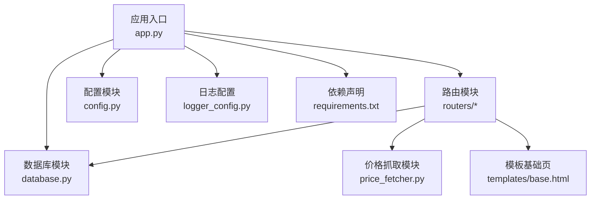
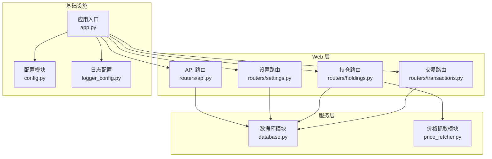
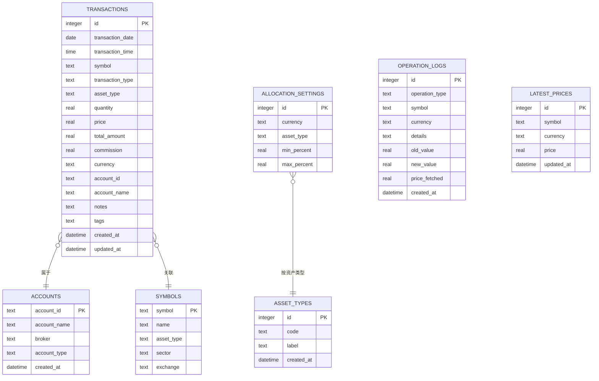
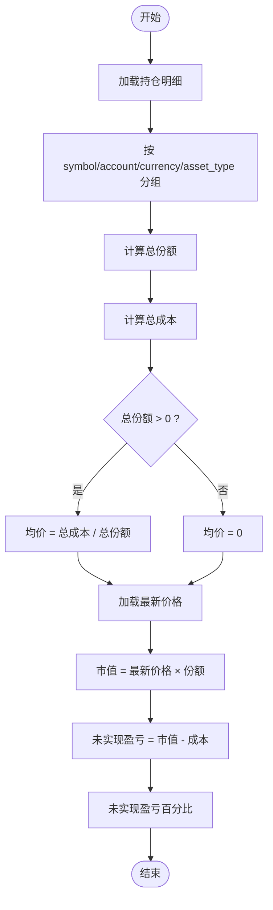
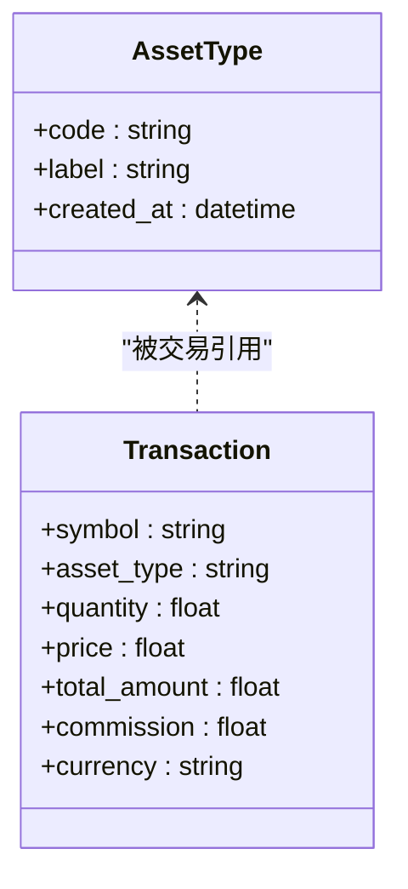
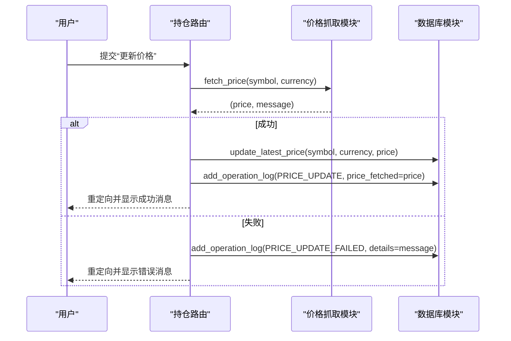
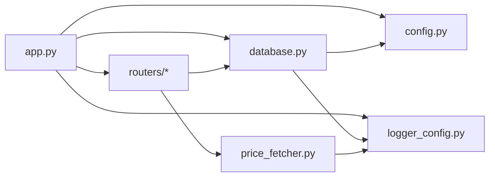
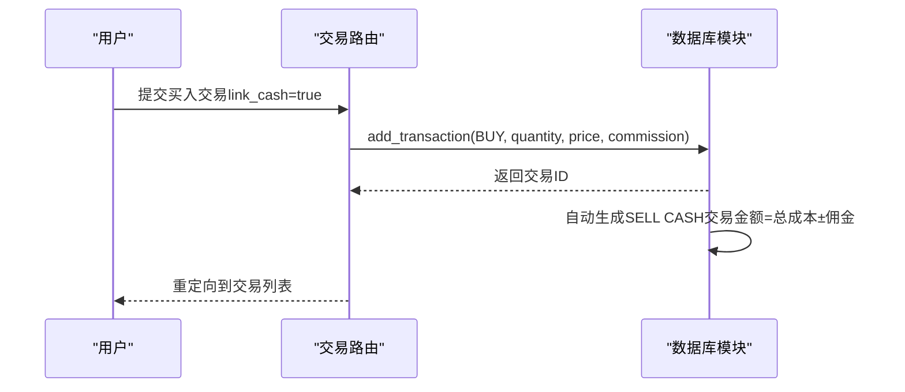

# 数据模型与业务规则

<cite>
**本文引用的文件列表**
- [app.py](file://app.py)
- [config.py](file://config.py)
- [database.py](file://database.py)
- [price_fetcher.py](file://price_fetcher.py)
- [logger_config.py](file://logger_config.py)
- [routers/transactions.py](file://routers/transactions.py)
- [routers/holdings.py](file://routers/holdings.py)
- [routers/settings.py](file://routers/settings.py)
- [routers/api.py](file://routers/api.py)
- [templates/base.html](file://templates/base.html)
- [requirements.txt](file://requirements.txt)
</cite>

## 目录
1. [简介](#简介)
2. [项目结构](#项目结构)
3. [核心组件](#核心组件)
4. [架构总览](#架构总览)
5. [详细组件分析](#详细组件分析)
6. [依赖关系分析](#依赖关系分析)
7. [性能考量](#性能考量)
8. [故障排查指南](#故障排查指南)
9. [结论](#结论)
10. [附录：业务场景与数据流示例](#附录业务场景与数据流示例)

## 简介
本文件面向投资日志管理系统的数据模型与业务规则，重点覆盖：
- 多币种支持机制与汇率转换思路
- 成本均价计算逻辑与持仓状态管理
- 交易类型枚举值的业务含义与会计处理
- 资产类型管理系统（股票、债券、贵金属、现金）的分类规则
- 价格缓存机制与最新价格表设计原理
- 交易金额计算、佣金处理与多币种记账
- 实际业务场景示例与数据流转过程

## 项目结构
系统采用 FastAPI + SQLite 的轻量级架构，前端使用 Jinja2 模板渲染，核心业务集中在数据库层与路由层，价格抓取通过独立模块实现。

图表来源
- [app.py](file://app.py#L1-L34)
- [routers/transactions.py](file://routers/transactions.py#L1-L75)
- [routers/holdings.py](file://routers/holdings.py#L1-L207)
- [routers/settings.py](file://routers/settings.py#L1-L148)
- [routers/api.py](file://routers/api.py#L1-L67)
- [database.py](file://database.py#L1-L151)
- [price_fetcher.py](file://price_fetcher.py#L1-L405)
- [config.py](file://config.py#L1-L24)
- [logger_config.py](file://logger_config.py#L1-L54)
- [templates/base.html](file://templates/base.html#L1-L27)
- [requirements.txt](file://requirements.txt#L1-L6)

章节来源
- [app.py](file://app.py#L1-L34)
- [config.py](file://config.py#L1-L24)
- [requirements.txt](file://requirements.txt#L1-L6)

## 核心组件
- 应用入口与启动：初始化数据库、挂载静态资源、注册路由。
- 数据库层：定义交易、账户、符号、资产类型、分配设置、操作日志、最新价格等表；提供交易增删改查、持仓汇总、收益计算、分配设置等查询与维护能力。
- 价格抓取：按优先级从多个数据源获取价格，支持 A 股、港股、美股、黄金，并记录操作日志。
- 路由层：提供交易录入、持仓详情、设置管理、API 接口等页面与接口。
- 配置与日志：iCloud 同步数据库路径、日志轮转与控制台输出。

章节来源
- [app.py](file://app.py#L13-L29)
- [database.py](file://database.py#L22-L151)
- [price_fetcher.py](file://price_fetcher.py#L325-L402)
- [routers/transactions.py](file://routers/transactions.py#L10-L75)
- [routers/holdings.py](file://routers/holdings.py#L13-L207)
- [routers/settings.py](file://routers/settings.py#L11-L148)
- [routers/api.py](file://routers/api.py#L8-L67)
- [config.py](file://config.py#L10-L24)
- [logger_config.py](file://logger_config.py#L14-L54)

## 架构总览
系统以“路由层-数据库层-价格抓取层”分层组织，数据持久化在 SQLite，iCloud 自动同步数据库文件，便于跨设备备份与恢复。

图表来源
- [app.py](file://app.py#L13-L29)
- [routers/transactions.py](file://routers/transactions.py#L1-L75)
- [routers/holdings.py](file://routers/holdings.py#L1-L207)
- [routers/settings.py](file://routers/settings.py#L1-L148)
- [routers/api.py](file://routers/api.py#L1-L67)
- [database.py](file://database.py#L1-L151)
- [price_fetcher.py](file://price_fetcher.py#L1-L405)
- [config.py](file://config.py#L1-L24)
- [logger_config.py](file://logger_config.py#L1-L54)

## 详细组件分析

### 数据模型与表设计
- 交易表（transactions）：记录每笔交易的日期、时间、标的、类型、数量、单价、总金额、佣金、币种、账户、备注、标签等；包含交易类型与资产类型的约束；支持按多维条件查询。
- 账户表（accounts）：账户标识、名称、券商、账户类型等。
- 符号表（symbols）：标的代码、名称、资产类型、板块、交易所等。
- 分配设置表（allocation_settings）：按币种与资产类型设定最小/最大配置区间。
- 资产类型表（asset_types）：动态资产类型管理，独立于币种。
- 操作日志表（operation_logs）：记录价格更新、手动更新、调整等操作。
- 最新价格表（latest_prices）：按标的+币种存储最新价格与更新时间，唯一索引保证幂等更新。

图表来源
- [database.py](file://database.py#L27-L149)

章节来源
- [database.py](file://database.py#L27-L149)

### 交易类型与会计处理
- 买入（BUY）：增加持有份额；总金额按数量×单价计算；佣金计入成本（购买时加、卖出时减）。
- 卖出（SELL）：减少持有份额；总金额按数量×单价计算；佣金从收入中扣除。
- 分红（DIVIDEND）：按收入入账，资产类型可设为“现金”，便于统一统计。
- 转账（TRANSFER_IN/TRANSFER_OUT）：仅变更持有份额，不改变成本。
- 调整（ADJUST）：对现有头寸进行价值调整，记录差额。
- 分拆（SPLIT）：按比例调整份额与均价，保持总成本不变。
- 收入（INCOME）：内部特殊处理，符号固定为“CASH”，资产类型为“cash”，单价为1.0，便于统一统计。

会计处理要点
- 成本累计：买入/收入累计成本，卖出/调整相应扣减。
- 均价计算：总成本除以剩余份额，零份额时均价为0。
- 佣金处理：买入时加到成本，卖出时从收入中扣减，确保损益准确。

章节来源
- [database.py](file://database.py#L34-L47)
- [database.py](file://database.py#L177-L182)
- [database.py](file://database.py#L344-L390)
- [database.py](file://database.py#L466-L512)

### 多币种支持机制
- 币种枚举：CNY、USD、HKD。
- 记账单位：以币种为维度进行分组统计与展示。
- 价格缓存：latest_prices 表按（symbol, currency）存储最新价格，避免重复抓取。
- 交易金额：总金额 = 数量 × 单价，佣金按币种单独记录，不影响单价。
- 汇率转换：当前实现未内置汇率转换逻辑，建议在扩展时引入汇率表并在计算组合价值时按基准币种折算。

章节来源
- [database.py](file://database.py#L34-L47)
- [database.py](file://database.py#L838-L884)

### 成本均价与持仓状态管理
- 持仓汇总：按 symbol、account_id、currency、asset_type 聚合，计算总份额与总成本。
- 均价计算：总成本 / 总份额；若份额为0，均价为0。
- 未实现盈亏：按最新价格计算市值，未实现盈亏 = 市值 - 成本，百分比 = 未实现盈亏 / 成本 × 100。
- 分配比例：按市场价值计算各资产类型占比，结合分配设置给出预警。

图表来源
- [database.py](file://database.py#L344-L463)

章节来源
- [database.py](file://database.py#L344-L463)

### 资产类型管理系统
- 资产类型枚举：stock（股票）、bond（债券）、metal（贵金属）、cash（现金）。
- 动态管理：支持新增、删除、校验是否被使用（存在交易记录则禁止删除）。
- 标签映射：提供中英文标签映射，用于界面显示与报表。

图表来源
- [database.py](file://database.py#L90-L114)
- [database.py](file://database.py#L34-L47)

章节来源
- [database.py](file://database.py#L90-L114)
- [database.py](file://database.py#L889-L960)

### 价格缓存机制与最新价格表
- 设计原理：latest_prices 表以（symbol, currency）为键，存储 price 与 updated_at；插入时冲突更新，保证幂等。
- 更新流程：路由触发价格抓取，成功后写入最新价格并记录操作日志；支持手动更新。
- 抓取策略：detect_symbol_type 判定标的类型，按优先级调用不同数据源函数，返回价格与消息。

图表来源
- [routers/holdings.py](file://routers/holdings.py#L102-L148)
- [price_fetcher.py](file://price_fetcher.py#L325-L402)
- [database.py](file://database.py#L838-L884)

章节来源
- [routers/holdings.py](file://routers/holdings.py#L102-L177)
- [price_fetcher.py](file://price_fetcher.py#L325-L402)
- [database.py](file://database.py#L838-L884)

### 交易金额计算、佣金处理与多币种记账
- 金额计算：总金额 = 数量 × 单价；当修改 quantity 或 price 时，自动重新计算 total_amount。
- 佣金处理：买入时加到成本，卖出时从收入中扣减；调整交易记录时可选择覆盖总金额。
- 多币种记账：交易以币种为单位记录，查询与汇总按币种分组；未实现损益按最新价格计算，注意需统一币种后再合并。

章节来源
- [database.py](file://database.py#L257-L266)
- [database.py](file://database.py#L177-L182)
- [database.py](file://database.py#L344-L390)

### 路由与页面交互
- 交易页面：分页展示交易列表，支持筛选；新增交易表单提交后重定向到交易列表。
- 持仓页面：按币种与资产类型汇总，显示未实现损益与占比；支持手动更新价格与快速交易。
- 设置页面：配置分配范围、新增/删除资产类型、新增/删除账户。

章节来源
- [routers/transactions.py](file://routers/transactions.py#L10-L75)
- [routers/holdings.py](file://routers/holdings.py#L13-L207)
- [routers/settings.py](file://routers/settings.py#L11-L148)

## 依赖关系分析
- 应用入口依赖数据库初始化与路由注册。
- 路由层依赖数据库模块与价格抓取模块。
- 数据库模块依赖配置模块（DB_PATH）与日志模块。
- 价格抓取模块依赖外部库（如 akshare、yfinance），并记录日志。

图表来源
- [app.py](file://app.py#L7-L29)
- [routers/transactions.py](file://routers/transactions.py#L1-L7)
- [routers/holdings.py](file://routers/holdings.py#L1-L9)
- [routers/settings.py](file://routers/settings.py#L1-L7)
- [routers/api.py](file://routers/api.py#L1-L6)
- [database.py](file://database.py#L12-L12)
- [price_fetcher.py](file://price_fetcher.py#L22-L33)
- [config.py](file://config.py#L17-L23)
- [logger_config.py](file://logger_config.py#L14-L54)

章节来源
- [app.py](file://app.py#L7-L29)
- [requirements.txt](file://requirements.txt#L1-L6)

## 性能考量
- 查询优化：为 symbol、date、account、type、currency、asset_type 建立索引，提升过滤与排序效率。
- 价格抓取：采用多源回退策略，避免单点故障；缓存最新价格，减少重复请求。
- 日志轮转：每日轮转并保留7天日志，避免磁盘占用过大。
- 数据库路径：默认存储于 iCloud，便于跨设备同步，但需注意网络延迟与并发写入风险。

章节来源
- [database.py](file://database.py#L142-L149)
- [logger_config.py](file://logger_config.py#L24-L31)
- [config.py](file://config.py#L10-L24)

## 故障排查指南
- 价格抓取失败：检查外部库是否安装（akshare、yfinance），查看日志中的错误摘要；确认标的类型识别正确。
- 无法删除资产类型或账户：若存在相关交易记录或头寸，系统会阻止删除；先清理相关记录再尝试。
- 交易金额异常：检查 quantity 与 price 是否被修改导致 total_amount 未更新；必要时使用覆盖参数。
- 价格更新无效果：确认 latest_prices 写入成功且操作日志记录；检查 symbol 与 currency 是否一致。

章节来源
- [price_fetcher.py](file://price_fetcher.py#L382-L402)
- [database.py](file://database.py#L927-L960)
- [database.py](file://database.py#L257-L266)
- [database.py](file://database.py#L838-L884)

## 结论
本系统以简洁的数据模型与清晰的业务规则支撑多币种投资记录与持仓管理。通过交易类型约束、成本均价算法与价格缓存机制，实现了较为完善的财务计算基础。建议后续增强：
- 引入汇率表与统一币种折算逻辑，完善多币种组合估值。
- 扩展债券价格获取与到期处理。
- 增强报表与导出能力，满足税务与审计需求。

## 附录：业务场景与数据流示例

### 场景一：买入股票并联动现金交易
- 步骤
  - 新增一笔买入交易（交易类型为 BUY），系统根据数量与单价计算总金额。
  - 若勾选“联动现金”，系统自动生成一笔卖出“CASH”的交易，金额为总成本+佣金，方向相反。
  - 两条交易分别记录在交易表中，持仓按符号与币种聚合。
- 关键点
  - 现金交易的单价固定为1.0，便于统一统计。
  - 佣金在买入时计入成本，在卖出时从收入中扣除。

图表来源
- [routers/transactions.py](file://routers/transactions.py#L45-L75)
- [database.py](file://database.py#L177-L225)

章节来源
- [routers/transactions.py](file://routers/transactions.py#L45-L75)
- [database.py](file://database.py#L177-L225)

### 场景二：手动更新某标的价格并查看未实现损益
- 步骤
  - 在持仓页面提交手动更新价格请求。
  - 价格抓取模块返回价格与消息；成功则写入最新价格并记录操作日志。
  - 页面重新加载，按最新价格计算未实现损益与占比。
- 关键点
  - latest_prices 表唯一键保证幂等更新。
  - 未实现损益为空时，按成本作为市值处理。

章节来源
- [routers/holdings.py](file://routers/holdings.py#L149-L177)
- [database.py](file://database.py#L838-L884)

### 场景三：调整某资产价值并生成调整交易
- 步骤
  - 选择某符号与币种，输入新的目标价值。
  - 系统计算当前价值与新价值差额，创建一条 ADJUST 类型交易，记录差额。
- 关键点
  - 调整交易不改变份额，仅影响成本与未实现损益。

章节来源
- [routers/holdings.py](file://routers/holdings.py#L78-L100)
- [database.py](file://database.py#L466-L512)