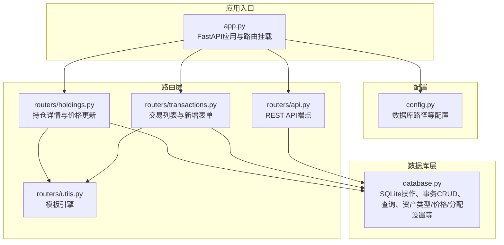
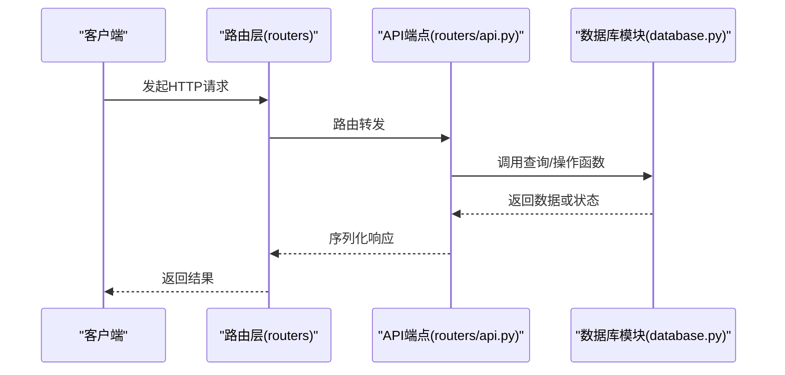
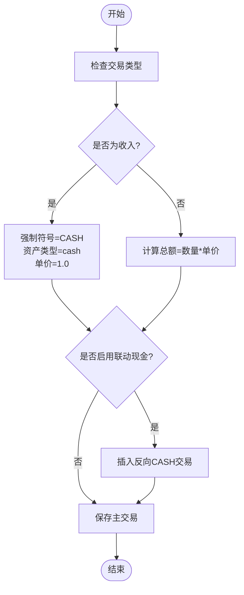
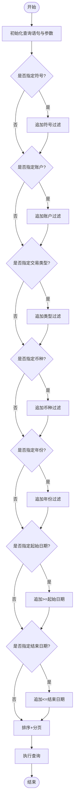
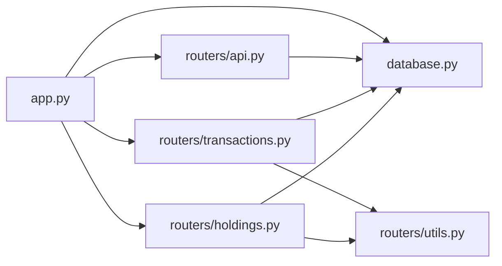

# 查询与操作接口

<cite>
**本文引用的文件**
- [app.py](file://app.py)
- [config.py](file://config.py)
- [database.py](file://database.py)
- [routers/api.py](file://routers/api.py)
- [routers/transactions.py](file://routers/transactions.py)
- [routers/holdings.py](file://routers/holdings.py)
- [routers/utils.py](file://routers/utils.py)
</cite>

## 目录
1. [简介](#简介)
2. [项目结构](#项目结构)
3. [核心组件](#核心组件)
4. [架构总览](#架构总览)
5. [详细组件分析](#详细组件分析)
6. [依赖关系分析](#依赖关系分析)
7. [性能考量](#性能考量)
8. [故障排查指南](#故障排查指南)
9. [结论](#结论)
10. [附录：SQL与调用示例](#附录sql与调用示例)

## 简介
本文件聚焦于“投资日志管理系统”的数据库查询与操作接口，围绕事务CRUD（新增、更新、删除）以及各类查询函数进行深入解析。内容涵盖：
- 事务CRUD接口的实现细节与约束
- 查询函数的参数设计、过滤条件构建与返回值格式
- 分页查询的实现方式与性能优化策略
- 完整的SQL查询思路与Python调用路径说明，便于开发者正确使用接口

## 项目结构
系统采用FastAPI作为Web框架，数据库层集中在单模块中，路由层通过APIRouter组织业务端点。数据库初始化在应用启动时完成，所有查询与操作均通过统一的数据库模块执行。

图表来源
- [app.py](file://app.py#L13-L29)
- [config.py](file://config.py#L17-L24)
- [database.py](file://database.py#L15-L151)
- [routers/api.py](file://routers/api.py#L1-L67)
- [routers/transactions.py](file://routers/transactions.py#L1-L75)
- [routers/holdings.py](file://routers/holdings.py#L1-L207)
- [routers/utils.py](file://routers/utils.py#L1-L4)

章节来源
- [app.py](file://app.py#L13-L29)
- [config.py](file://config.py#L17-L24)

## 核心组件
- 数据库连接与初始化：提供连接工厂、建表与索引初始化、默认资产类型注入
- 事务CRUD：新增、查询、更新、删除交易记录；支持现金联动
- 查询函数：按符号、账户、日期范围、交易类型、币种等多维过滤；分页与计数
- 持仓计算：按符号/币种/资产类型汇总持有份额与成本，结合最新价格计算未实现盈亏
- 资产类型与价格：资产类型管理、最新价格存储与查询、操作日志
- 分配设置：按币种与资产类型设定配置区间并生成预警

章节来源
- [database.py](file://database.py#L15-L151)
- [database.py](file://database.py#L158-L287)
- [database.py](file://database.py#L294-L341)
- [database.py](file://database.py#L344-L390)
- [database.py](file://database.py#L393-L463)
- [database.py](file://database.py#L838-L883)
- [database.py](file://database.py#L674-L730)

## 架构总览
下图展示从HTTP请求到数据库操作的关键流程，以及各模块之间的依赖关系。

图表来源
- [routers/api.py](file://routers/api.py#L1-L67)
- [database.py](file://database.py#L294-L341)

## 详细组件分析

### 事务CRUD接口
- 新增交易（add_transaction）
  - 支持字段：日期、时间、符号、交易类型、资产类型、数量、单价、佣金、币种、账户、备注、标签、是否联动现金等
  - 自动计算总额；当交易类型为“收入”时强制符号为“CASH”，资产类型为“cash”，单价为1.0
  - 当开启“联动现金”且交易类型为“买入/卖出”时，自动插入一笔反向的“CASH”交易以平衡现金流
  - 返回新交易ID
- 查询交易（get_transaction）
  - 按ID查询单条交易
- 更新交易（update_transaction）
  - 允许更新字段白名单；若数量或单价变更则重新计算总额
  - 自动写入更新时间
  - 返回是否影响行数大于0
- 删除交易（delete_transaction）
  - 按ID删除；返回是否影响行数大于0

图表来源
- [database.py](file://database.py#L158-L225)

章节来源
- [database.py](file://database.py#L158-L225)
- [database.py](file://database.py#L228-L235)
- [database.py](file://database.py#L238-L287)

### 查询函数与过滤条件
- get_transactions
  - 参数：符号、账户、交易类型、币种、年份、起止日期、limit、offset
  - 过滤逻辑：动态拼接WHERE子句，支持多条件组合；日期范围使用字符串格式化匹配年份
  - 排序：按日期降序、ID降序
  - 分页：LIMIT + OFFSET
  - 返回：字典列表
- get_transaction_count
  - 功能：统计满足过滤条件的交易总数，用于前端分页计算
- get_holdings
  - 功能：按符号、账户、币种、资产类型聚合，计算总份额与总成本，仅保留份额>0或成本!=0的记录
  - 计算平均成本：总成本/总份额（若份额>0）
- get_holdings_by_symbol
  - 功能：在get_holdings基础上，结合最新价格计算市值、未实现盈亏与百分比
  - 输出：按币种分组，包含每只标的的成本、份额、均价、市价、市值、未实现盈亏、百分比等
- get_holdings_by_currency
  - 功能：按币种与资产类型计算占比，并与分配设置对比生成预警
- get_realized_gains / get_dividends
  - 功能：分别查询卖出与分红交易，支持按符号、账户、日期范围过滤

图表来源
- [database.py](file://database.py#L294-L341)
- [database.py](file://database.py#L962-L996)

章节来源
- [database.py](file://database.py#L294-L341)
- [database.py](file://database.py#L962-L996)
- [database.py](file://database.py#L344-L390)
- [database.py](file://database.py#L393-L463)
- [database.py](file://database.py#L515-L558)
- [database.py](file://database.py#L561-L593)

### 分页查询与性能优化
- 分页实现
  - 后端：get_transactions使用LIMIT + OFFSET；get_operation_logs同样采用LIMIT + OFFSET
  - 前端：交易列表页面根据get_transaction_count计算总页数
- 性能优化
  - 已建立索引：symbol、transaction_date、account_id、transaction_type、currency、asset_type
  - 查询优化建议：对高频过滤字段（如symbol、account_id、transaction_date）尽量使用索引；避免在WHERE中对列进行函数转换（如strftime），当前已使用字符串比较年份
  - 批量读取：API端点默认limit=100，前端页面默认每页100条，减少单次传输数据量

章节来源
- [database.py](file://database.py#L142-L148)
- [routers/transactions.py](file://routers/transactions.py#L10-L28)
- [database.py](file://database.py#L962-L996)
- [database.py](file://database.py#L817-L831)

### 资产类型与价格管理
- 资产类型
  - 默认资产类型：股票、债券、贵金属、现金
  - 提供增删查改与可用性检查
- 最新价格
  - 存储：latest_prices表，唯一键(symbol,currency)
  - 查询：按符号与币种获取最新价格；批量获取作为查找表
  - 更新：支持自动抓取与手动更新，并记录操作日志

章节来源
- [database.py](file://database.py#L890-L960)
- [database.py](file://database.py#L838-L883)
- [database.py](file://database.py#L792-L831)

### 分配设置与预警
- 配置项：币种、资产类型、最小/最大百分比
- 计算：按币种与资产类型汇总成本，计算占比并与配置区间对比，生成预警信息

章节来源
- [database.py](file://database.py#L674-L730)
- [database.py](file://database.py#L732-L785)

## 依赖关系分析
- 应用启动时初始化数据库并挂载路由
- 路由层依赖数据库模块执行查询与操作
- 模板渲染依赖Jinja2Templates

图表来源
- [app.py](file://app.py#L11-L29)
- [routers/utils.py](file://routers/utils.py#L1-L4)

章节来源
- [app.py](file://app.py#L11-L29)
- [routers/utils.py](file://routers/utils.py#L1-L4)

## 性能考量
- 索引覆盖：已为常用过滤字段建立索引，建议在高并发场景下保持这些字段的查询一致性
- 查询模式：优先使用等值/范围查询，避免在WHERE中对列做函数处理
- 分页策略：合理设置limit与offset，避免超大offset导致的扫描开销
- 批量操作：在需要时可考虑批量插入/更新以减少往返次数

## 故障排查指南
- 交易新增失败
  - 检查交易类型是否在允许集合内
  - 确认币种与资产类型是否符合枚举值
  - 若启用联动现金，确认账户与币种一致
- 更新交易报错
  - 确保传入的字段在允许更新白名单内
  - 数量或单价变更会触发总额重算，确保数值有效
- 查询无结果
  - 检查过滤条件是否过于严格
  - 年份过滤使用字符串比较，请确认输入格式
- 删除失败
  - 确认交易ID存在且未被其他外键约束阻止

章节来源
- [database.py](file://database.py#L34-L47)
- [database.py](file://database.py#L284-L288)
- [database.py](file://database.py#L313-L333)
- [database.py](file://database.py#L962-L996)

## 结论
该系统通过集中化的数据库模块实现了清晰的事务CRUD与多样化查询能力，配合索引与分页策略满足日常使用需求。API路由层提供了简洁的REST接口，前端页面通过模板渲染与少量异步交互提升用户体验。建议在生产环境中持续监控查询性能并根据实际数据分布优化索引与查询模式。

## 附录：SQL与调用示例

### 事务CRUD调用路径
- 新增交易
  - 路由：POST /add
  - 调用：routers/transactions.py -> database.py:add_transaction
  - 关键参数：日期、符号、交易类型、资产类型、币种、数量、单价、账户、佣金、备注、是否联动现金
- 查询交易
  - 路由：GET /api/transactions/{id}
  - 调用：routers/api.py -> database.py:get_transaction
- 更新交易
  - 路由：PUT /api/transactions/{id}
  - 调用：routers/api.py -> database.py:update_transaction
- 删除交易
  - 路由：DELETE /api/transactions/{id}
  - 调用：routers/api.py -> database.py:delete_transaction

章节来源
- [routers/transactions.py](file://routers/transactions.py#L45-L74)
- [routers/api.py](file://routers/api.py#L59-L66)

### 查询函数调用路径
- 交易列表（带分页）
  - 路由：GET /transactions
  - 调用：routers/transactions.py -> database.py:get_transaction_count + get_transactions
- 持仓详情
  - 路由：GET /holdings
  - 调用：routers/holdings.py -> database.py:get_holdings_by_symbol
- 符号详情（含历史）
  - 路由：GET /symbol/{symbol}
  - 调用：routers/holdings.py -> database.py:get_transactions + get_holdings
- 实现收益/分红查询
  - 路由：GET /api/realized-gains / GET /api/dividends
  - 调用：routers/api.py -> database.py:get_realized_gains / get_dividends

章节来源
- [routers/transactions.py](file://routers/transactions.py#L10-L28)
- [routers/holdings.py](file://routers/holdings.py#L13-L30)
- [routers/holdings.py](file://routers/holdings.py#L32-L76)
- [routers/api.py](file://routers/api.py#L18-L31)
- [database.py](file://database.py#L515-L558)
- [database.py](file://database.py#L561-L593)

### SQL查询要点（基于源码实现）
- 交易查询（多维过滤 + 分页）
  - 动态WHERE子句：符号、账户、交易类型、币种、年份、起止日期
  - 排序：transaction_date DESC, id DESC
  - 分页：LIMIT ?, OFFSET ?
- 持仓汇总（GROUP BY + HAVING）
  - 按符号、账户、币种、资产类型分组
  - 使用CASE表达式累加买入/卖出/转账/调整等交易类型
  - 仅保留份额>0或成本!=0的记录
- 最新价格查询
  - 单条查询：按符号与币种
  - 批量查询：返回(symbol,currency)->行的映射

章节来源
- [database.py](file://database.py#L309-L336)
- [database.py](file://database.py#L349-L375)
- [database.py](file://database.py#L861-L883)