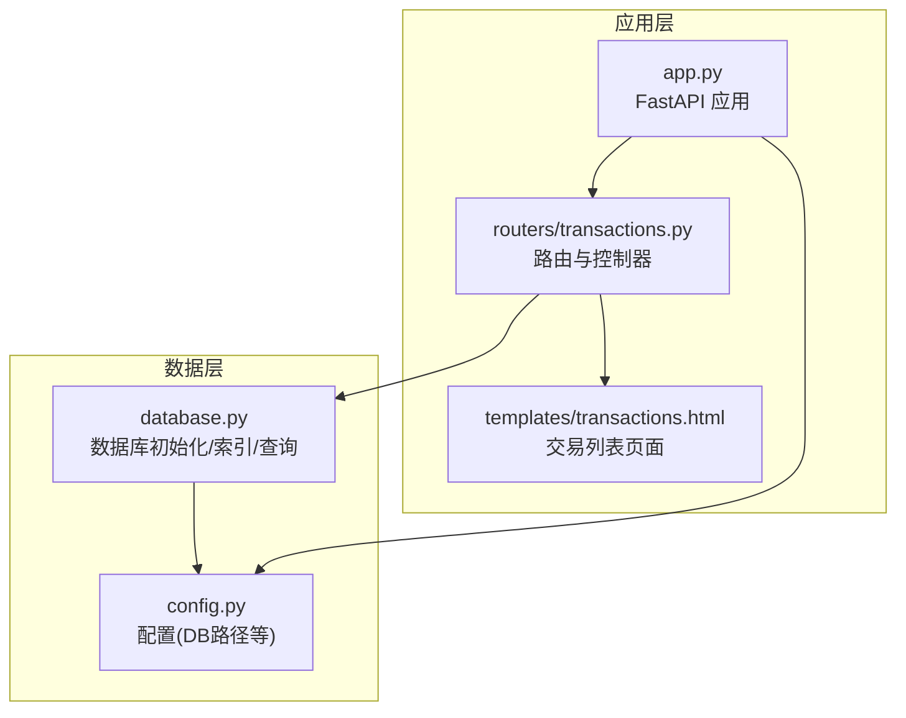
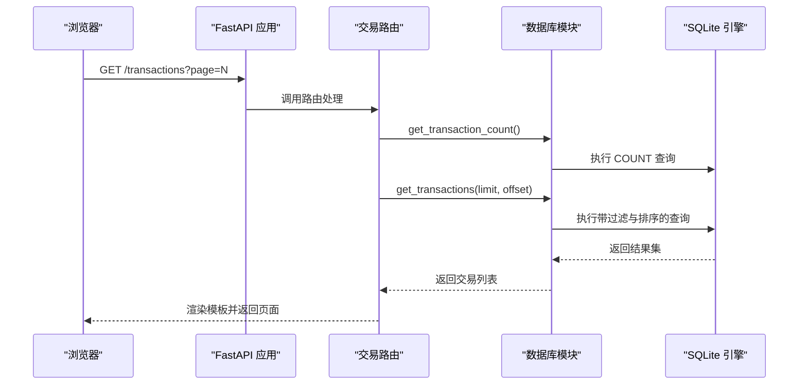
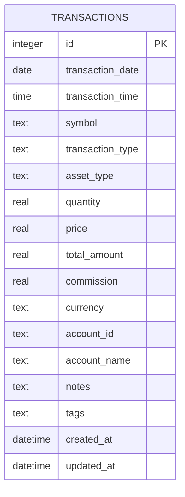
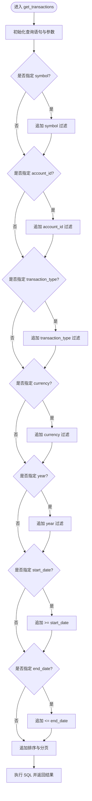
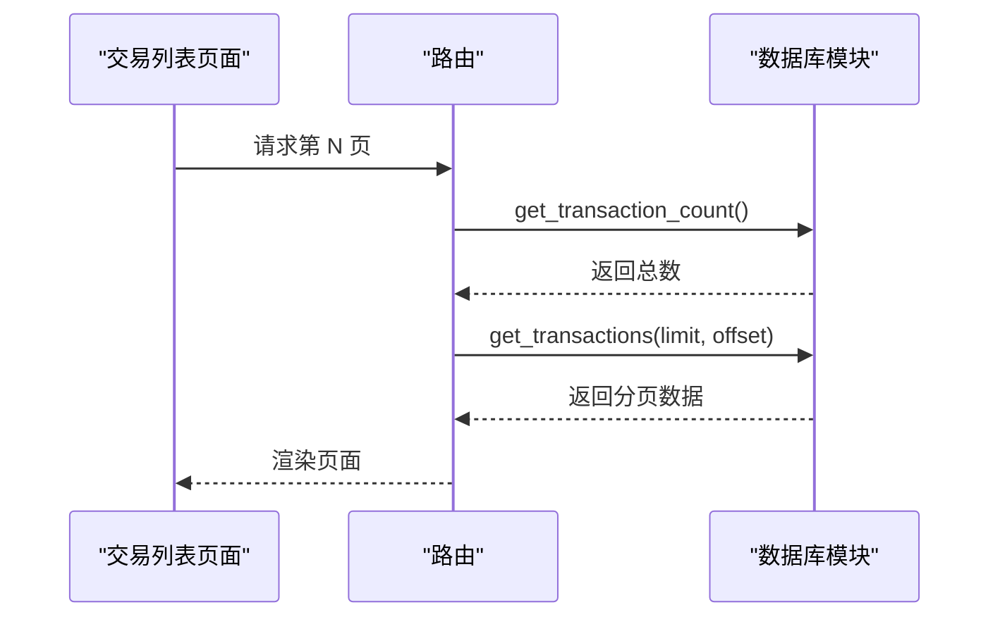
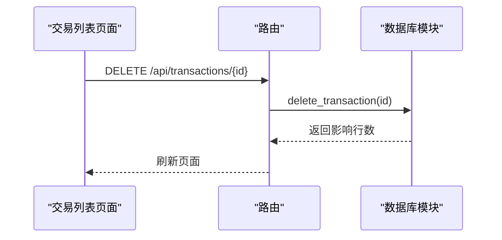
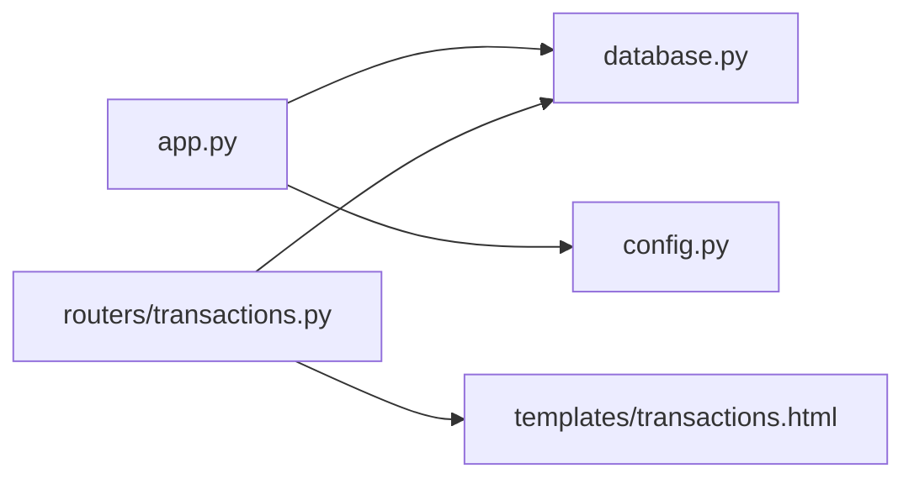

# 索引策略与性能优化

<cite>
**本文引用的文件**
- [database.py](file://database.py)
- [app.py](file://app.py)
- [config.py](file://config.py)
- [routers/transactions.py](file://routers/transactions.py)
- [templates/transactions.html](file://templates/transactions.html)
- [requirements.txt](file://requirements.txt)
</cite>

## 目录
1. [简介](#简介)
2. [项目结构](#项目结构)
3. [核心组件](#核心组件)
4. [架构总览](#架构总览)
5. [详细组件分析](#详细组件分析)
6. [依赖关系分析](#依赖关系分析)
7. [性能考量](#性能考量)
8. [故障排查指南](#故障排查指南)
9. [结论](#结论)
10. [附录](#附录)

## 简介
本文件聚焦于投资日志管理系统的数据库索引策略与性能优化，围绕 transactions 表的现有索引（按 symbol、transaction_date、account_id、transaction_type、currency、asset_type）进行设计原理剖析，并结合系统实际查询模式，给出选择性分析、查询计划解读方法、性能监控技巧以及在大数据量场景下的优化建议与最佳实践。同时提供索引使用评估标准与性能测试方法，帮助在生产环境中持续保障查询效率与稳定性。

## 项目结构
系统采用 FastAPI + SQLite 的轻量级架构：
- 应用入口负责初始化数据库并在启动时创建/迁移表与索引
- 数据库模块集中定义表结构、索引与各类查询函数
- 路由层提供交易列表、新增交易等接口
- 模板层渲染交易列表页面，支持分页与删除交互

图表来源
- [app.py](file://app.py#L13-L22)
- [routers/transactions.py](file://routers/transactions.py#L10-L28)
- [database.py](file://database.py#L22-L188)
- [config.py](file://config.py#L17-L23)
- [templates/transactions.html](file://templates/transactions.html#L1-L91)

章节来源
- [app.py](file://app.py#L13-L22)
- [routers/transactions.py](file://routers/transactions.py#L10-L28)
- [database.py](file://database.py#L22-L188)
- [config.py](file://config.py#L17-L23)
- [templates/transactions.html](file://templates/transactions.html#L1-L91)

## 核心组件
- 数据库初始化与索引创建：在应用启动时调用初始化函数，创建 transactions 表及常用索引，确保高频查询具备索引支撑
- 查询函数族：提供按 symbol、account_id、transaction_type、currency、asset_type、年份、日期范围等条件组合查询，以及分页与排序
- 分页与计数：通过 COUNT(*) 计算总数，再按分页参数返回记录集，避免一次性加载全部数据
- 前端交互：交易列表页面支持分页导航与删除操作，删除请求由后端 API 处理

章节来源
- [database.py](file://database.py#L22-L188)
- [database.py](file://database.py#L331-L378)
- [database.py](file://database.py#L999-L1033)
- [routers/transactions.py](file://routers/transactions.py#L10-L28)
- [templates/transactions.html](file://templates/transactions.html#L14-L80)

## 架构总览
系统以 SQLite 作为本地存储，通过 FastAPI 提供 Web 接口与模板渲染。数据库初始化在应用启动阶段完成，确保表结构与索引就绪；查询层根据业务需求动态拼接 WHERE 条件与排序，前端通过分页减少单次传输压力。

图表来源
- [app.py](file://app.py#L18-L22)
- [routers/transactions.py](file://routers/transactions.py#L10-L28)
- [database.py](file://database.py#L999-L1033)
- [database.py](file://database.py#L331-L378)

## 详细组件分析

### 事务表与索引设计
- 表结构要点：包含交易日期、时间、symbol、类型、资产类别、数量、价格、总额、佣金、币种、账户标识等字段
- 索引创建：为 symbol、transaction_date、account_id、transaction_type、currency、asset_type 建立独立索引，覆盖常见过滤与排序场景
- 设计原则：针对高频过滤字段建立单列索引，便于快速定位匹配行；同时注意索引数量与写入开销的平衡

图表来源
- [database.py](file://database.py#L28-L48)

章节来源
- [database.py](file://database.py#L28-L48)
- [database.py](file://database.py#L179-L188)

### 查询函数与索引利用
- get_transactions：支持 symbol、account_id、transaction_type、currency、year、start_date、end_date 组合过滤，排序基于日期与主键降序，配合 LIMIT/OFFSET 实现分页
- get_transaction_count：与 get_transactions 同步构建 WHERE 条件，仅统计满足条件的记录数
- 选择性分析：按 symbol、account_id、transaction_type、currency、asset_type 的过滤通常具有较高选择性，能有效缩小扫描范围；日期范围过滤在有索引的情况下可显著降低全表扫描概率

图表来源
- [database.py](file://database.py#L331-L378)

章节来源
- [database.py](file://database.py#L331-L378)
- [database.py](file://database.py#L999-L1033)

### 分页与计数
- 分页策略：先通过 COUNT(*) 获取总数，再按 per_page 与 offset 取子集，避免一次性拉取全部数据
- 页面渲染：前端模板根据总数与当前页生成分页控件，支持跳转到首页、上一页、下一页与末页

图表来源
- [routers/transactions.py](file://routers/transactions.py#L10-L28)
- [database.py](file://database.py#L999-L1033)
- [database.py](file://database.py#L331-L378)
- [templates/transactions.html](file://templates/transactions.html#L53-L80)

章节来源
- [routers/transactions.py](file://routers/transactions.py#L10-L28)
- [templates/transactions.html](file://templates/transactions.html#L53-L80)

### 删除交易流程
- 前端触发删除请求，后端执行删除并刷新页面
- 删除操作直接基于主键 id，不涉及复杂过滤

图表来源
- [routers/transactions.py](file://routers/transactions.py#L10-L28)
- [database.py](file://database.py#L316-L324)
- [templates/transactions.html](file://templates/transactions.html#L82-L89)

章节来源
- [routers/transactions.py](file://routers/transactions.py#L10-L28)
- [database.py](file://database.py#L316-L324)
- [templates/transactions.html](file://templates/transactions.html#L82-L89)

## 依赖关系分析
- 应用启动时调用数据库初始化，确保表与索引存在
- 路由层依赖数据库模块提供的查询与计数函数
- 配置模块提供数据库路径，影响索引与数据文件位置

图表来源
- [app.py](file://app.py#L18-L22)
- [routers/transactions.py](file://routers/transactions.py#L10-L28)
- [database.py](file://database.py#L22-L188)
- [config.py](file://config.py#L17-L23)
- [templates/transactions.html](file://templates/transactions.html#L1-L91)

章节来源
- [app.py](file://app.py#L18-L22)
- [routers/transactions.py](file://routers/transactions.py#L10-L28)
- [database.py](file://database.py#L22-L188)
- [config.py](file://config.py#L17-L23)
- [templates/transactions.html](file://templates/transactions.html#L1-L91)

## 性能考量

### 现有索引的选择性与覆盖度
- symbol：高选择性，常用于按股票代码筛选，建议保留
- transaction_date：高选择性，常用于按日期范围筛选，建议保留
- account_id：中高选择性，常用于按账户筛选，建议保留
- transaction_type：中等选择性，常用于按交易类型筛选，建议保留
- currency：中等选择性，常用于按币种筛选，建议保留
- asset_type：中等选择性，常用于按资产类别筛选，建议保留

这些单列索引能够有效支撑 get_transactions 与 get_transaction_count 的常见过滤组合，减少全表扫描的概率。

章节来源
- [database.py](file://database.py#L179-L188)
- [database.py](file://database.py#L331-L378)
- [database.py](file://database.py#L999-L1033)

### 查询计划分析与性能监控
- SQLite 查询计划：可使用 EXPLAIN QUERY PLAN 或 EXPLAIN QUERY PLAN 语法查看执行计划，确认是否命中索引、是否发生全表扫描或临时排序
- 性能监控建议：
  - 使用 EXPLAIN QUERY PLAN 对关键查询进行计划分析
  - 在开发环境模拟大数据量，观察 COUNT 与分页查询的耗时
  - 关注磁盘 I/O 与锁竞争，避免长时间持有连接
  - 定期检查索引碎片与统计信息更新（SQLite 会自动维护）

章节来源
- [database.py](file://database.py#L331-L378)
- [database.py](file://database.py#L999-L1033)

### 大数据量场景优化建议
- 查询重写
  - 将日期范围过滤放在 WHERE 子句靠前位置，利于索引裁剪
  - 避免在过滤列上使用函数或表达式（如 strftime），应保持列值原样比较
  - 对于多条件组合，优先使用选择性更高的列作为过滤条件
- 索引维护
  - 定期运行 VACUUM 与 ANALYZE（SQLite 会自动维护统计信息，但可手动触发）
  - 避免过度索引，写入频繁的表需权衡插入/更新成本与读取收益
- 性能分析
  - 使用 EXPLAIN QUERY PLAN 对热点查询进行计划审查
  - 结合 COUNT 与 LIMIT/OFFSET 的组合，避免一次性扫描大量数据
  - 对于高频报表类查询，考虑物化视图或缓存中间结果（SQLite 无物化视图，可用应用层缓存替代）

章节来源
- [database.py](file://database.py#L331-L378)
- [database.py](file://database.py#L999-L1033)

### 索引使用评估标准
- 命中率：通过 EXPLAIN QUERY PLAN 观察是否命中索引
- 扫描行数：COUNT(*) 与实际返回行数的比例，越接近越好
- 响应时间：在不同数据规模下测量查询耗时，关注分页延迟
- 写入影响：对比插入/更新前后查询性能变化，评估索引成本

章节来源
- [database.py](file://database.py#L331-L378)
- [database.py](file://database.py#L999-L1033)

### 性能测试方法
- 基准测试：准备不同规模的数据集（小、中、大），分别测试 get_transactions 与 get_transaction_count 的耗时
- 压力测试：模拟并发访问，观察锁等待与响应时间
- 回归测试：每次修改查询或索引后，重新跑基准测试，确保性能不退化

章节来源
- [database.py](file://database.py#L331-L378)
- [database.py](file://database.py#L999-L1033)

## 故障排查指南
- 查询慢
  - 使用 EXPLAIN QUERY PLAN 检查是否命中索引
  - 检查 WHERE 条件中是否存在函数或表达式导致索引失效
  - 确认日期范围过滤是否合理，避免跨年或跨月的大范围扫描
- 分页卡顿
  - 确保 COUNT 与分页查询使用相同过滤条件
  - 检查 LIMIT/OFFSET 是否过大，必要时增加 per_page 或优化过滤条件
- 删除失败
  - 确认传入的 id 是否存在
  - 检查是否有外键约束或触发器影响删除

章节来源
- [database.py](file://database.py#L316-L324)
- [database.py](file://database.py#L331-L378)
- [database.py](file://database.py#L999-L1033)

## 结论
本系统在 transactions 表上建立了覆盖高频过滤字段的单列索引，能够有效支撑按 symbol、account_id、transaction_type、currency、asset_type 与日期范围的查询。结合分页与 COUNT 统计，前端可稳定地展示大规模交易数据。建议在生产环境中持续使用 EXPLAIN QUERY PLAN 进行计划审查，定期评估索引命中率与扫描行数，并在写入频繁场景下审慎增减索引，以实现查询性能与写入成本的平衡。

## 附录
- 快速参考
  - 初始化数据库与索引：应用启动时自动执行
  - 常用查询：按 symbol、account_id、transaction_type、currency、asset_type、year、start_date、end_date 组合过滤
  - 分页：每页固定条目，通过 COUNT 与 LIMIT/OFFSET 实现
  - 删除：基于主键 id 的简单删除

章节来源
- [app.py](file://app.py#L18-L22)
- [database.py](file://database.py#L22-L188)
- [database.py](file://database.py#L331-L378)
- [database.py](file://database.py#L999-L1033)
- [routers/transactions.py](file://routers/transactions.py#L10-L28)
- [templates/transactions.html](file://templates/transactions.html#L53-L80)