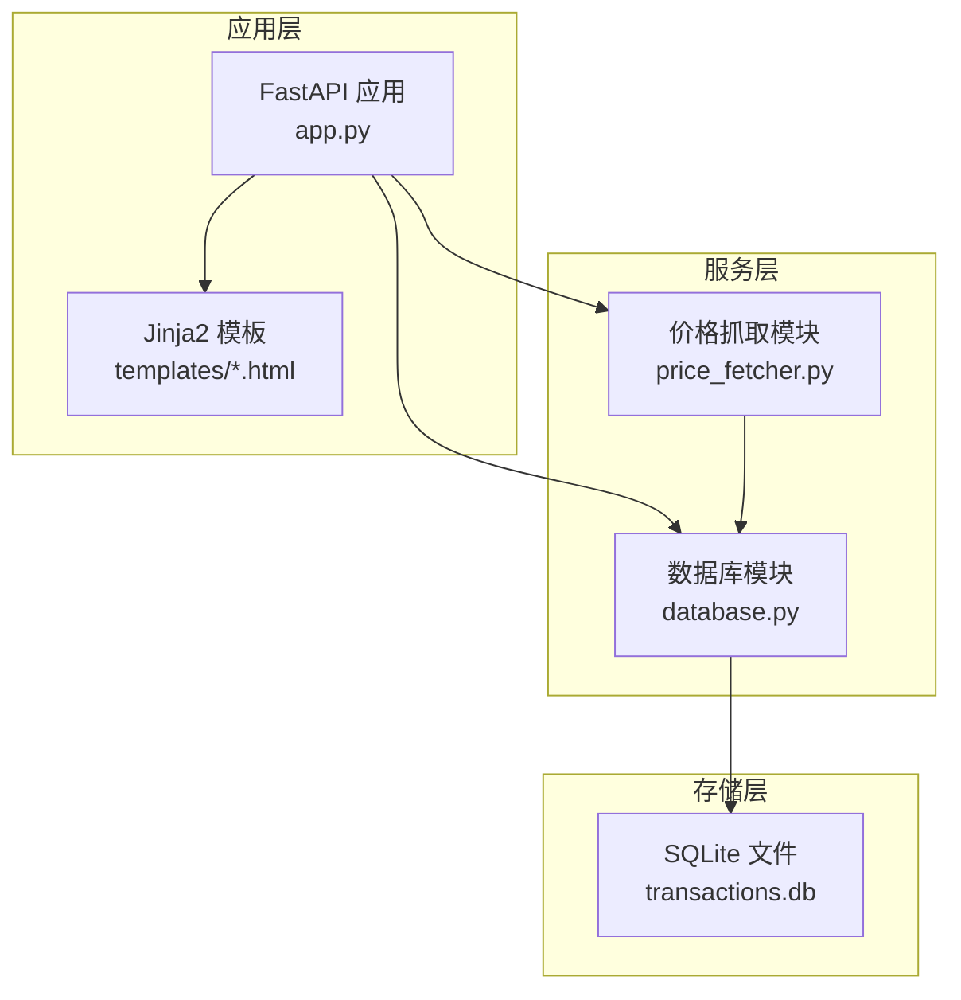
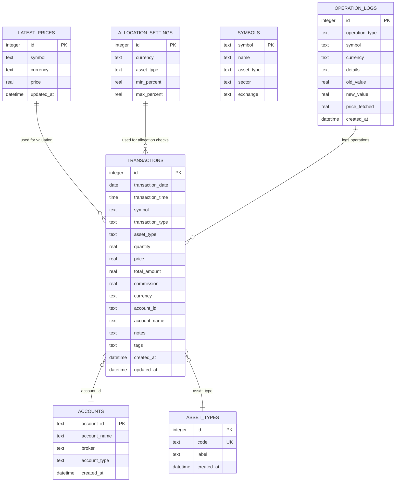
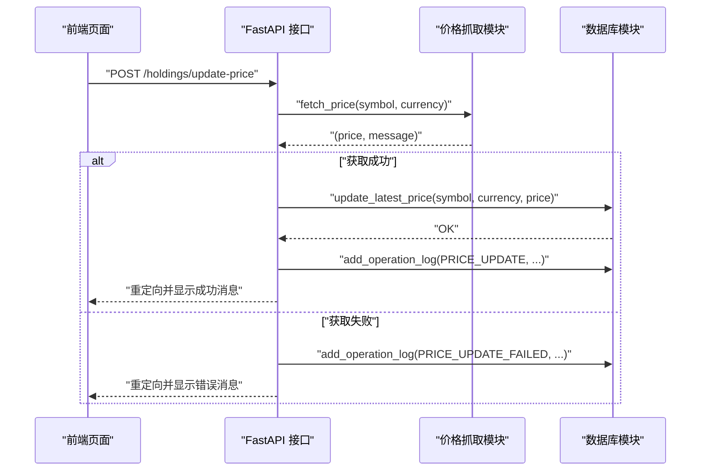
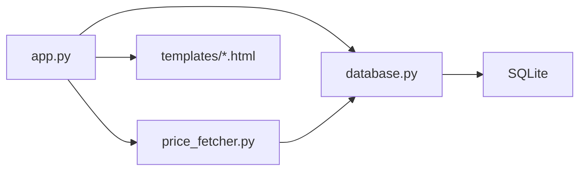

# 数据模型设计

<cite>
**本文引用的文件**
- [app.py](file://app.py)
- [database.py](file://database.py)
- [price_fetcher.py](file://price_fetcher.py)
- [requirements.txt](file://requirements.txt)
- [templates/base.html](file://templates/base.html)
- [templates/index.html](file://templates/index.html)
- [templates/holdings.html](file://templates/holdings.html)
- [templates/transactions.html](file://templates/transactions.html)
- [templates/symbol.html](file://templates/symbol.html)
- [templates/settings.html](file://templates/settings.html)
</cite>

## 目录
1. [简介](#简介)
2. [项目结构](#项目结构)
3. [核心组件](#核心组件)
4. [架构总览](#架构总览)
5. [详细组件分析](#详细组件分析)
6. [依赖关系分析](#依赖关系分析)
7. [性能考量](#性能考量)
8. [故障排查指南](#故障排查指南)
9. [结论](#结论)
10. [附录](#附录)

## 简介
本文件系统性梳理“投资日志”项目的数据库Schema与实体关系，覆盖表结构、字段定义、约束与索引、主外键关系、数据完整性规则、业务规则、数据访问模式、查询优化策略、缓存与性能、数据生命周期与迁移、安全与隐私等。目标是帮助开发者与非技术读者快速理解数据模型的设计思路与使用方式。

## 项目结构
项目采用“FastAPI + SQLite”的轻量级架构：
- 应用入口与路由：app.py
- 数据库层：database.py（SQLite Schema、CRUD、聚合查询）
- 价格抓取：price_fetcher.py（多源价格获取与回退）
- 模板渲染：Jinja2 模板（前端展示与交互）
- 依赖声明：requirements.txt

图表来源
- [app.py](file://app.py#L1-L444)
- [database.py](file://database.py#L1-L944)
- [price_fetcher.py](file://price_fetcher.py#L1-L398)

章节来源
- [app.py](file://app.py#L1-L444)
- [database.py](file://database.py#L1-L150)
- [requirements.txt](file://requirements.txt#L1-L6)

## 核心组件
- 数据库初始化与Schema
  - 初始化函数负责创建核心表、默认资产类型、索引与唯一约束。
- 交易事务表 transactions
  - 记录买入、卖出、分红、拆分、转账、调整等交易类型。
- 账户表 accounts
  - 维护账户标识、名称、券商等信息。
- 资产类型表 asset_types
  - 动态资产类型管理，独立于货币。
- 最新价格表 latest_prices
  - 缓存各标的在各币种的最新价格。
- 配置表 allocation_settings
  - 按币种与资产类型的配置区间。
- 运行日志表 operation_logs
  - 记录价格更新、价值调整等操作日志。
- 符号表 symbols
  - 可选的符号元数据（名称、类型、板块、交易所）。

章节来源
- [database.py](file://database.py#L20-L149)

## 架构总览
下图展示数据模型的实体关系与关键业务流程。

图表来源
- [database.py](file://database.py#L25-L149)

## 详细组件分析

### 交易表 transactions
- 主键：自增整数 id
- 关键字段
  - 标的：symbol（文本，非空）
  - 类型：transaction_type（枚举约束：BUY/SELL/DIVIDEND/SPLIT/TRANSFER_IN/TRANSFER_OUT/ADJUST）
  - 资产类型：asset_type（默认 stock，枚举约束：stock/bond/metal/cash）
  - 数量与价格：quantity/price（实数，非空）
  - 合计金额：total_amount（实数，非空）
  - 手续费：commission（实数，默认 0）
  - 币种：currency（默认 CNY，枚举约束：CNY/USD/HKD）
  - 账户：account_id/account_name（文本，非空）
  - 时间戳：created_at/updated_at（时间）
- 约束与索引
  - CHECK 约束限制交易类型与资产类型合法值
  - 为 symbol、transaction_date、account_id、transaction_type、currency、asset_type 建立索引以提升查询性能
- 业务规则
  - total_amount 由 quantity*price 或显式覆盖计算
  - 更新时若 quantity 或 price 变更，会自动重算 total_amount
  - 支持按年份、日期范围、账户、币种、类型过滤查询
- 查询与聚合
  - 按 symbol、account_id、transaction_type、currency、年份、日期范围过滤
  - 分组统计持有数量与成本，用于生成持仓视图

章节来源
- [database.py](file://database.py#L25-L46)
- [database.py](file://database.py#L156-L193)
- [database.py](file://database.py#L262-L309)
- [database.py](file://database.py#L312-L358)

### 账户表 accounts
- 主键：account_id（文本，非空）
- 字段：account_name、broker、account_type、created_at
- 约束：唯一性约束 account_id
- 业务规则：新增账户时若违反唯一性则返回失败

章节来源
- [database.py](file://database.py#L54-L63)
- [database.py](file://database.py#L568-L589)

### 资产类型表 asset_types
- 主键：id（自增整数）
- 唯一约束：code（文本，非空且唯一）
- 字段：label（标签）、created_at
- 默认初始化：stock/bond/metal/cash 四类
- 业务规则：删除前需检查是否存在使用该类型的交易；可动态添加新类型

章节来源
- [database.py](file://database.py#L88-L97)
- [database.py](file://database.py#L100-L112)
- [database.py](file://database.py#L831-L844)
- [database.py](file://database.py#L847-L866)
- [database.py](file://database.py#L868-L883)
- [database.py](file://database.py#L885-L901)

### 最新价格表 latest_prices
- 主键：id（自增整数）
- 唯一约束：(symbol, currency)
- 字段：symbol、currency、price、updated_at
- 业务规则：插入或更新时按唯一键冲突处理，更新时间戳随更新刷新
- 使用场景：用于计算未实现盈亏、组合占比等

章节来源
- [database.py](file://database.py#L128-L138)
- [database.py](file://database.py#L779-L800)
- [database.py](file://database.py#L802-L824)

### 配置表 allocation_settings
- 主键：id（自增整数）
- 唯一约束：(currency, asset_type)
- 字段：currency、asset_type、min_percent、max_percent
- 业务规则：设置时进行范围校验（0-100），并按币种+资产类型去重更新

章节来源
- [database.py](file://database.py#L76-L86)
- [database.py](file://database.py#L615-L627)
- [database.py](file://database.py#L630-L656)

### 运行日志表 operation_logs
- 主键：id（自增整数）
- 字段：operation_type、symbol、currency、details、old_value、new_value、price_fetched、created_at
- 业务规则：记录价格更新、价值调整等操作的上下文信息

章节来源
- [database.py](file://database.py#L113-L126)
- [database.py](file://database.py#L733-L755)

### 符号表 symbols
- 主键：symbol（文本）
- 字段：name、asset_type、sector、exchange
- 用途：可选的符号元数据，便于展示与筛选

章节来源
- [database.py](file://database.py#L65-L74)

### 价格抓取与缓存流程
- 价格抓取：根据符号与币种识别类型，按优先级尝试多个数据源（AKShare、Yahoo Finance、Sina、Tencent），失败回退。
- 缓存写入：成功后调用更新最新价格接口，写入 latest_prices 并记录操作日志。

图表来源
- [app.py](file://app.py#L216-L262)
- [price_fetcher.py](file://price_fetcher.py#L321-L394)
- [database.py](file://database.py#L779-L800)
- [database.py](file://database.py#L733-L755)

## 依赖关系分析
- 应用层依赖数据库层与价格抓取层
- 数据库层内部通过表间关系支撑聚合与报表
- 模板层依赖数据库层提供的聚合数据

图表来源
- [app.py](file://app.py#L1-L444)
- [database.py](file://database.py#L1-L944)
- [price_fetcher.py](file://price_fetcher.py#L1-L398)

## 性能考量
- 索引设计
  - 为 transactions 的 symbol、transaction_date、account_id、transaction_type、currency、asset_type 建立索引，有利于高频过滤与排序。
- 查询优化
  - 分页查询：transactions 列表采用 limit+offset，避免一次性加载大量数据。
  - 聚合查询：按 symbol/account_id/currency/asset_type 分组统计，减少重复扫描。
- 缓存策略
  - latest_prices 作为热点缓存，避免频繁外部调用，降低延迟与带宽消耗。
- 写入优化
  - 批量写入建议：当前为单条插入，如需批量导入可考虑事务包裹与参数化批量执行（需扩展数据库层）。
- I/O 与连接
  - 每次操作新建连接并在关闭，适合小规模应用；若并发较高，可引入连接池（需扩展数据库层）。

章节来源
- [database.py](file://database.py#L140-L149)
- [database.py](file://database.py#L262-L309)
- [database.py](file://database.py#L312-L358)

## 故障排查指南
- 交易类型/资产类型非法
  - 现象：插入或更新时报错
  - 处理：确保 transaction_type 与 asset_type 在允许集合内
- 唯一键冲突
  - 现象：新增账户或最新价格冲突
  - 处理：检查 account_id 或 (symbol, currency) 是否重复
- 删除资产类型失败
  - 现象：提示存在使用该类型的交易
  - 处理：先清理相关交易，再删除资产类型
- 价格抓取失败
  - 现象：无可用价格或网络异常
  - 处理：检查网络与第三方库可用性；查看 operation_logs 中失败记录

章节来源
- [database.py](file://database.py#L32-L46)
- [database.py](file://database.py#L568-L589)
- [database.py](file://database.py#L779-L800)
- [database.py](file://database.py#L868-L883)
- [app.py](file://app.py#L250-L261)

## 结论
本项目以 SQLite 为核心存储，围绕交易、账户、资产类型、价格与配置构建了清晰的数据模型。通过合理的索引与聚合查询满足日常分析需求；通过 latest_prices 实现价格缓存；通过 operation_logs 提供审计能力。整体设计简洁、可维护性强，适合个人或小团队的投资记录与分析场景。

## 附录

### 表结构与字段定义一览
- transactions
  - id（主键）、transaction_date、transaction_time、symbol、transaction_type、asset_type、quantity、price、total_amount、commission、currency、account_id、account_name、notes、tags、created_at、updated_at
- accounts
  - account_id（主键）、account_name、broker、account_type、created_at
- asset_types
  - id（主键）、code（唯一）、label、created_at
- latest_prices
  - id（主键）、symbol、currency、price、updated_at
- allocation_settings
  - id（主键）、currency、asset_type、min_percent、max_percent
- operation_logs
  - id（主键）、operation_type、symbol、currency、details、old_value、new_value、price_fetched、created_at
- symbols
  - symbol（主键）、name、asset_type、sector、exchange

章节来源
- [database.py](file://database.py#L25-L149)

### 数据完整性与业务规则
- 完整性
  - 主键唯一性：各表主键约束
  - 唯一性：accounts.account_id、latest_prices.(symbol,currency)、allocation_settings.(currency,asset_type)、asset_types.code
  - 枚举约束：transaction_type、asset_type、currency
- 业务规则
  - total_amount 自动计算与更新
  - 价值调整通过 ADJUST 交易类型记录
  - 分配区间校验与告警
  - 资产类型删除前检查使用情况

章节来源
- [database.py](file://database.py#L32-L46)
- [database.py](file://database.py#L630-L656)
- [database.py](file://database.py#L868-L883)

### 数据访问模式与查询示例
- 获取交易列表（支持多维过滤与分页）
- 计算持有情况（按 symbol/account_id/currency/asset_type 分组）
- 获取最新价格与全量价格映射
- 获取分配配置与按币种/资产类型汇总

章节来源
- [database.py](file://database.py#L262-L309)
- [database.py](file://database.py#L312-L358)
- [database.py](file://database.py#L802-L824)
- [database.py](file://database.py#L615-L627)

### 缓存策略与性能建议
- 缓存：latest_prices 作为热点缓存，按 symbol+currency 唯一键更新
- 建议：在高并发场景引入连接池与批量写入；对大表增加复合索引；定期清理 operation_logs 与历史冗余数据

章节来源
- [database.py](file://database.py#L140-L149)
- [database.py](file://database.py#L779-L800)

### 数据生命周期与迁移
- 生命周期
  - 交易数据长期保存；latest_prices 仅保留最近有效价格；operation_logs 可按策略清理
- 迁移
  - 新增列：通过 ALTER TABLE 兼容旧库（已有向后兼容逻辑）
  - 新增表：通过初始化函数统一创建
  - 唯一键变更：谨慎评估影响，必要时提供迁移脚本

章节来源
- [database.py](file://database.py#L48-L53)
- [database.py](file://database.py#L20-L149)

### 安全与隐私
- 当前实现未涉及用户认证与授权，建议在生产环境增加：
  - 用户登录与会话管理
  - 数据访问权限控制（账户隔离）
  - 敏感字段脱敏（如账户名、备注）
  - 日志脱敏与最小暴露原则

[本节为通用建议，不直接分析具体文件]