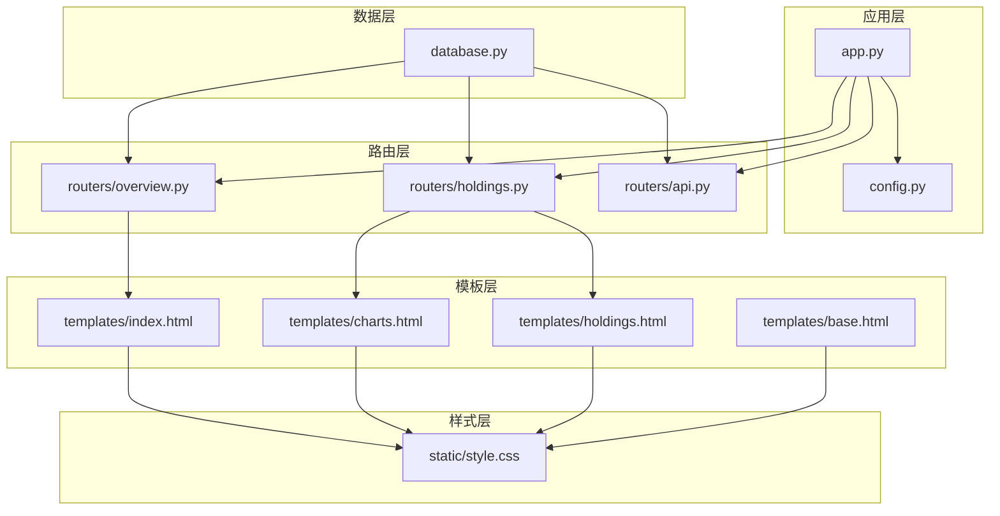
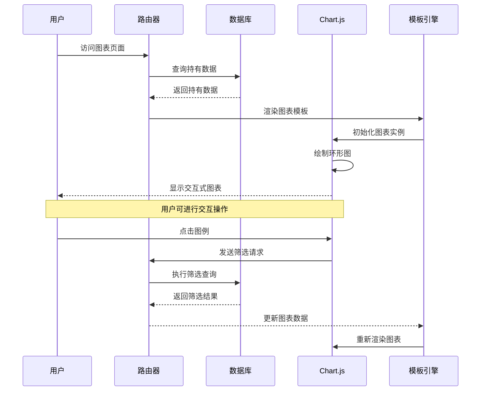
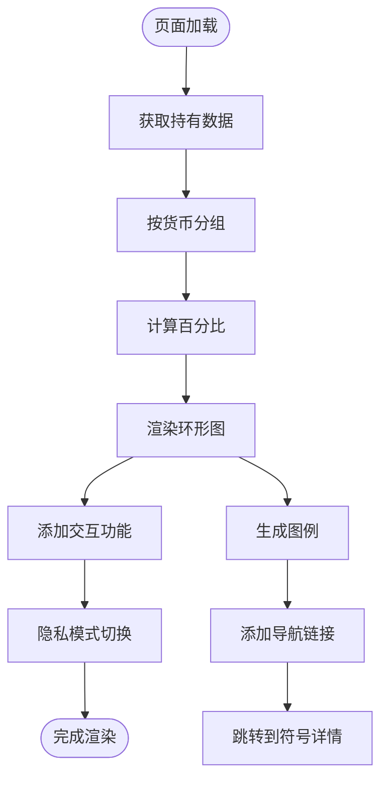
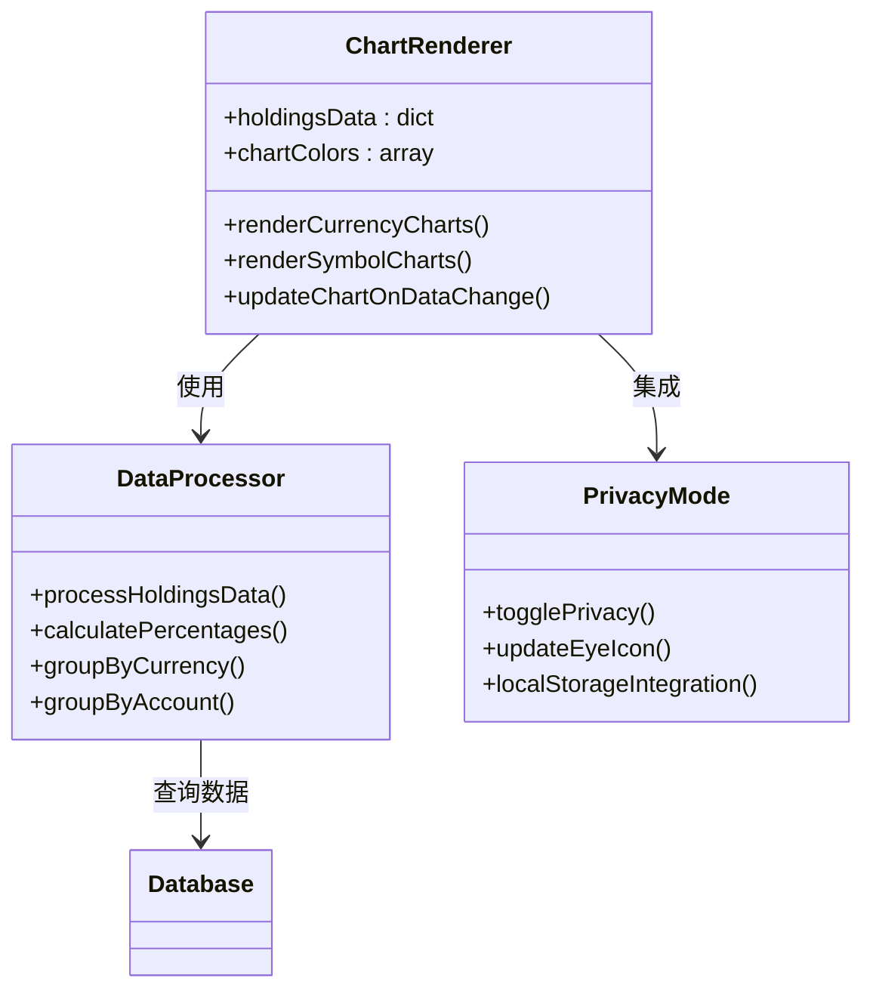
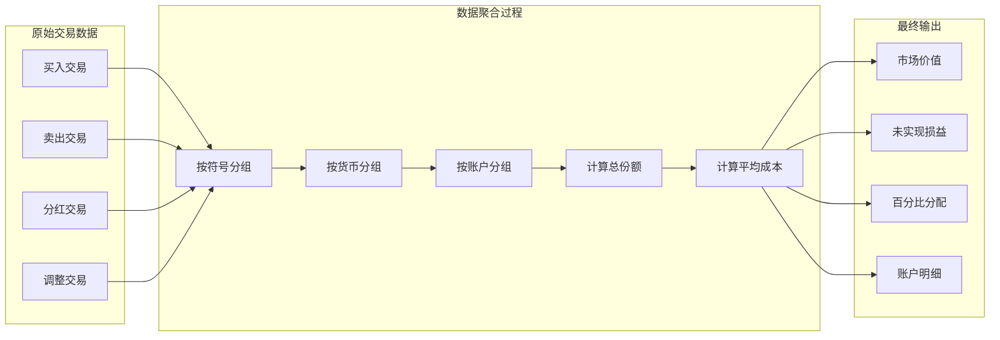
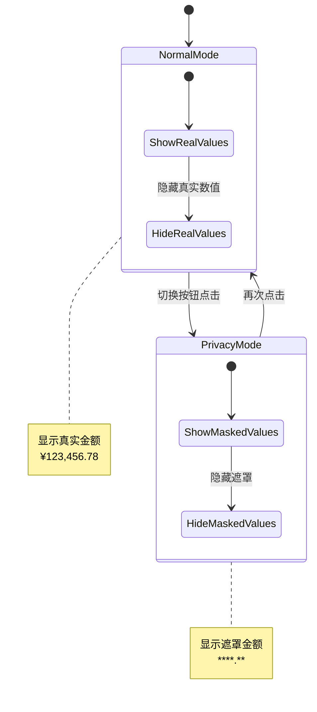
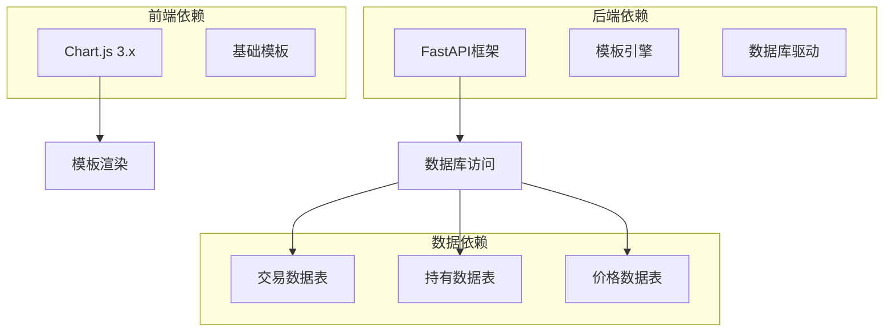
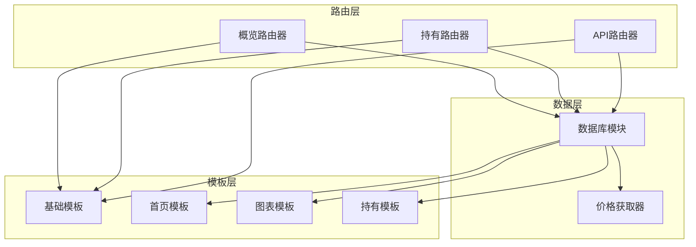

# 交互式图表功能

<cite>
**本文档引用的文件**
- [app.py](file://app.py)
- [config.py](file://config.py)
- [database.py](file://database.py)
- [routers/api.py](file://routers/api.py)
- [routers/overview.py](file://routers/overview.py)
- [routers/holdings.py](file://routers/holdings.py)
- [templates/base.html](file://templates/base.html)
- [templates/index.html](file://templates/index.html)
- [templates/charts.html](file://templates/charts.html)
- [templates/holdings.html](file://templates/holdings.html)
- [static/style.css](file://static/style.css)
</cite>

## 目录
1. [简介](#简介)
2. [项目结构](#项目结构)
3. [核心组件](#核心组件)
4. [架构概览](#架构概览)
5. [详细组件分析](#详细组件分析)
6. [依赖关系分析](#依赖关系分析)
7. [性能考虑](#性能考虑)
8. [故障排除指南](#故障排除指南)
9. [结论](#结论)

## 简介

交互式图表功能是投资日志系统的核心可视化组件，为用户提供直观的投资组合分析界面。该功能基于Chart.js库实现，支持多种图表类型，包括环形图、分配图表和历史趋势图，帮助用户深入了解资产配置、收益表现和投资组合动态变化。

## 项目结构

该项目采用FastAPI框架构建，采用模块化设计，将不同功能按路由组织：

**图表来源**
- [app.py](file://app.py#L1-L34)
- [routers/overview.py](file://routers/overview.py#L1-L28)
- [routers/holdings.py](file://routers/holdings.py#L1-L255)

**章节来源**
- [app.py](file://app.py#L1-L34)
- [config.py](file://config.py#L1-L55)

## 核心组件

### 图表渲染引擎

系统使用Chart.js作为主要的图表渲染引擎，通过JavaScript在客户端动态生成可视化图表。每个图表页面都包含独立的Chart实例，支持响应式布局和交互式操作。

### 数据获取层

通过数据库查询函数获取实时数据，支持多种过滤条件：
- 按货币类型分组
- 按账户分组  
- 按时间范围过滤
- 按资产类型分类

### 用户界面集成

图表功能与现有UI组件无缝集成，包括：
- 隐私模式切换
- 响应式网格布局
- 交互式图例导航
- 实时数据更新

**章节来源**
- [templates/base.html](file://templates/base.html#L1-L27)
- [templates/charts.html](file://templates/charts.html#L1-L182)
- [database.py](file://database.py#L885-L938)

## 架构概览

交互式图表功能采用分层架构设计，确保数据、业务逻辑和表示层的有效分离：

**图表来源**
- [routers/overview.py](file://routers/overview.py#L19-L27)
- [routers/holdings.py](file://routers/holdings.py#L13-L30)
- [database.py](file://database.py#L437-L532)

## 详细组件分析

### 图表页面渲染组件

#### 主页图表组件
主页提供按货币分组的投资组合概览，使用环形图展示各资产类型的配置比例：

**图表来源**
- [templates/index.html](file://templates/index.html#L36-L147)
- [routers/overview.py](file://routers/overview.py#L8-L17)

#### 详细图表组件
专门的图表页面提供更详细的资产配置视图：

**图表来源**
- [templates/charts.html](file://templates/charts.html#L134-L175)
- [database.py](file://database.py#L437-L532)

**章节来源**
- [templates/index.html](file://templates/index.html#L36-L147)
- [templates/charts.html](file://templates/charts.html#L36-L181)

### 数据处理组件

#### 持有数据聚合
系统通过复杂的SQL查询和Python处理实现多维度的数据聚合：

**图表来源**
- [database.py](file://database.py#L388-L434)
- [database.py](file://database.py#L437-L532)

#### 最新价格管理
系统维护最新的市场价格缓存，支持自动和手动更新机制：

**章节来源**
- [database.py](file://database.py#L1071-L1081)
- [routers/holdings.py](file://routers/holdings.py#L102-L176)

### 用户界面组件

#### 隐私模式系统
提供可切换的隐私保护功能，保护敏感财务信息：

**图表来源**
- [templates/charts.html](file://templates/charts.html#L6-L25)
- [templates/charts.html](file://templates/charts.html#L105-L132)

#### 响应式布局系统
采用CSS Grid和Flexbox实现自适应布局：

**章节来源**
- [static/style.css](file://static/style.css#L236-L274)
- [templates/charts.html](file://templates/charts.html#L236-L274)

## 依赖关系分析

### 外部依赖

系统依赖以下关键外部库：

**图表来源**
- [templates/base.html](file://templates/base.html#L8)
- [app.py](file://app.py#L7-L11)

### 内部依赖关系

**图表来源**
- [routers/overview.py](file://routers/overview.py#L1-L28)
- [routers/holdings.py](file://routers/holdings.py#L1-L255)
- [routers/api.py](file://routers/api.py#L1-L67)

**章节来源**
- [app.py](file://app.py#L1-L34)
- [database.py](file://database.py#L1-L1207)

## 性能考虑

### 数据查询优化

系统通过索引和查询优化确保图表数据的快速加载：

- **索引策略**: 在交易表上建立符号、日期、账户、类型等复合索引
- **查询限制**: 默认限制返回记录数量，避免大数据集影响性能
- **缓存机制**: 最新价格数据缓存减少重复查询

### 图表渲染优化

- **延迟加载**: 图表在页面可见时才进行渲染
- **响应式设计**: 自动适配不同屏幕尺寸，减少重绘开销
- **内存管理**: 及时清理不再使用的Chart实例

### 数据更新策略

- **增量更新**: 仅更新发生变化的数据点
- **批量操作**: 支持批量价格更新操作
- **异步处理**: 后台任务处理价格同步，不影响主界面响应

## 故障排除指南

### 常见问题及解决方案

#### 图表无法显示
1. **检查网络连接**: 确保Chart.js库正确加载
2. **验证数据格式**: 检查后端API返回的数据格式
3. **查看浏览器控制台**: 查找JavaScript错误信息

#### 数据不准确
1. **检查数据库连接**: 验证数据库路径配置
2. **确认权限设置**: 确保数据库文件具有读写权限
3. **清理缓存**: 删除过期的价格缓存数据

#### 性能问题
1. **优化查询**: 检查是否有不必要的数据查询
2. **减少图表复杂度**: 简化图表配置选项
3. **启用缓存**: 利用浏览器缓存机制

**章节来源**
- [config.py](file://config.py#L44-L55)
- [database.py](file://database.py#L15-L19)

## 结论

交互式图表功能为投资日志系统提供了强大的可视化能力，通过Chart.js实现了丰富的交互体验。该功能具有以下优势：

1. **用户友好**: 直观的图表界面和交互操作
2. **功能完整**: 支持多种图表类型和筛选功能
3. **性能优化**: 通过索引和缓存机制确保响应速度
4. **扩展性强**: 模块化设计便于功能扩展和维护

未来可以考虑的功能增强包括：添加更多图表类型（如时间序列图）、实现图表导出功能、增加自定义配置选项等。