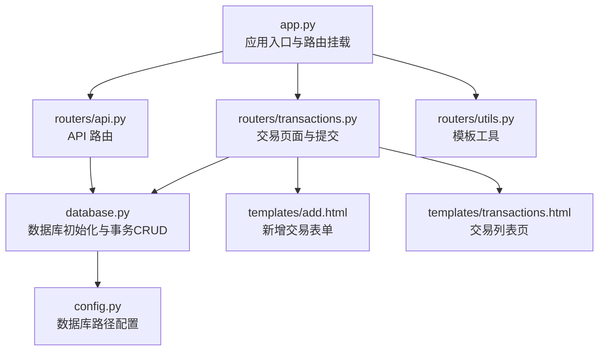
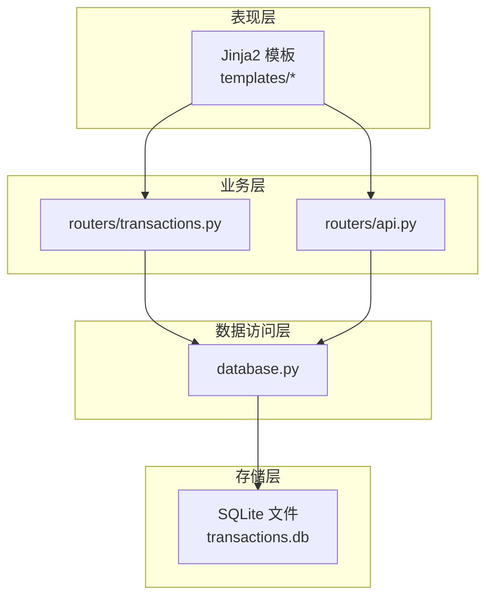
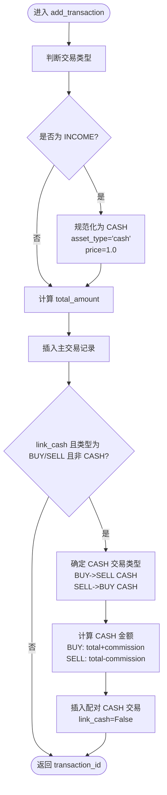
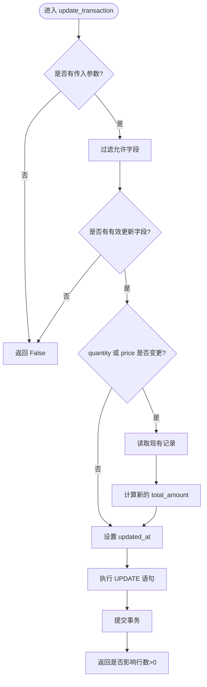
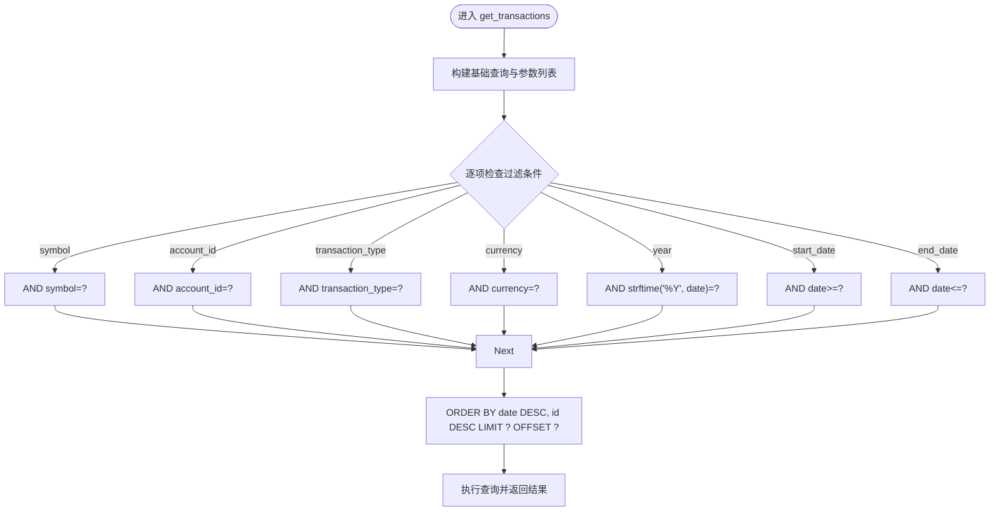
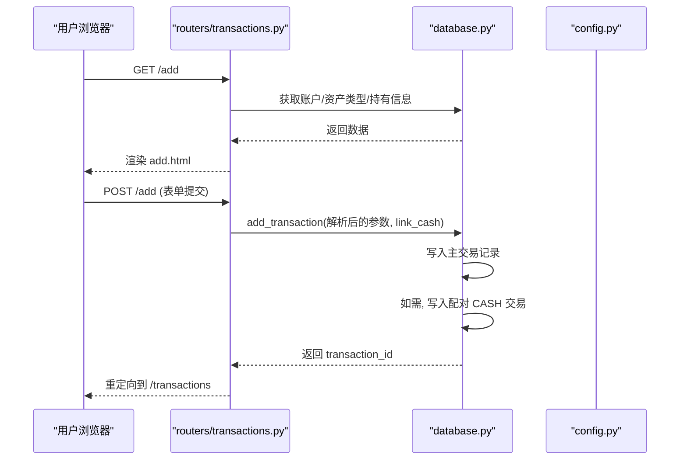
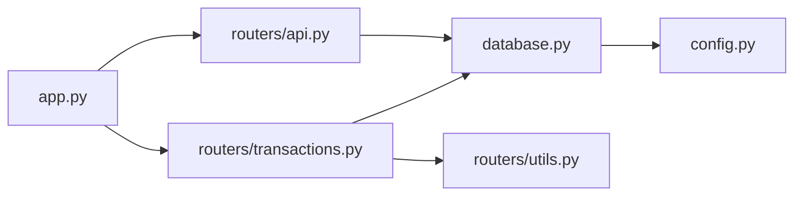

# 交易记录系统

<cite>
**本文引用的文件**
- [app.py](file://app.py)
- [database.py](file://database.py)
- [routers/transactions.py](file://routers/transactions.py)
- [routers/utils.py](file://routers/utils.py)
- [config.py](file://config.py)
- [templates/add.html](file://templates/add.html)
- [templates/transactions.html](file://templates/transactions.html)
- [routers/api.py](file://routers/api.py)
</cite>

## 目录
1. [简介](#简介)
2. [项目结构](#项目结构)
3. [核心组件](#核心组件)
4. [架构总览](#架构总览)
5. [详细组件分析](#详细组件分析)
6. [依赖关系分析](#依赖关系分析)
7. [性能考量](#性能考量)
8. [故障排查指南](#故障排查指南)
9. [结论](#结论)
10. [附录：交易类型与业务逻辑](#附录交易类型与业务逻辑)

## 简介
本系统是一个基于 FastAPI 的投资交易记录应用，提供交易的增删改查、自动现金配对、灵活查询与报表支持。数据库采用 SQLite，表结构在启动时初始化，并通过约束确保数据一致性。前端使用 Jinja2 模板渲染页面，提供交易录入、列表查看与删除等交互。

## 项目结构
- 应用入口与路由挂载：app.py
- 数据库初始化与事务 CRUD：database.py
- 交易页面与提交路由：routers/transactions.py
- 模板工具：routers/utils.py
- 配置（数据库路径等）：config.py
- 前端模板：templates/add.html、templates/transactions.html
- API 路由（含删除接口）：routers/api.py

图表来源
- [app.py](file://app.py#L13-L29)
- [routers/transactions.py](file://routers/transactions.py#L1-L75)
- [routers/api.py](file://routers/api.py#L59-L66)
- [routers/utils.py](file://routers/utils.py#L1-L4)
- [database.py](file://database.py#L22-L151)
- [config.py](file://config.py#L17-L24)
- [templates/add.html](file://templates/add.html#L1-L259)
- [templates/transactions.html](file://templates/transactions.html#L1-L91)

章节来源
- [app.py](file://app.py#L13-L29)
- [config.py](file://config.py#L17-L24)

## 核心组件
- 数据库模块：负责数据库初始化、事务 CRUD、查询与账户/资产类型管理。
- 交易路由模块：提供交易列表页、新增交易表单与提交处理。
- API 路由模块：提供删除交易的 REST 接口。
- 配置模块：集中管理数据库路径等配置。
- 模板：提供用户界面与交互逻辑。

章节来源
- [database.py](file://database.py#L22-L151)
- [routers/transactions.py](file://routers/transactions.py#L1-L75)
- [routers/api.py](file://routers/api.py#L59-L66)
- [config.py](file://config.py#L17-L24)
- [routers/utils.py](file://routers/utils.py#L1-L4)

## 架构总览
系统采用分层架构：
- 表现层：FastAPI 路由与模板渲染
- 业务层：交易路由与 API 路由
- 数据访问层：database.py 提供 CRUD 与查询
- 存储层：SQLite 文件（默认位于 iCloud）

图表来源
- [routers/transactions.py](file://routers/transactions.py#L1-L75)
- [routers/api.py](file://routers/api.py#L59-L66)
- [database.py](file://database.py#L22-L151)
- [config.py](file://config.py#L17-L24)

## 详细组件分析

### 数据库初始化与约束
- 初始化流程：启动时调用初始化函数，创建 transactions、accounts、symbols、allocation_settings、asset_types、operation_logs、latest_prices 等表，并建立索引。
- 关键约束：
  - 交易类型限定为：BUY、SELL、DIVIDEND、SPLIT、TRANSFER_IN、TRANSFER_OUT、ADJUST、INCOME
  - 资产类型限定为：stock、bond、metal、cash
  - 货币限定为：CNY、USD、HKD
- 索引：为 symbol、transaction_date、account_id、transaction_type、currency、asset_type 建立索引以提升查询性能。

章节来源
- [database.py](file://database.py#L22-L151)

### add_transaction() 函数：事务处理与现金关联
- 功能概述：
  - 插入一条交易记录，返回新记录 ID。
  - 支持 INCOME 类型自动规范化为 CASH。
  - 可选的 link_cash 参数用于自动生成配对的 CASH 交易，实现资金流平衡。
- 现金关联机制（link_cash）：
  - 仅在交易类型为 BUY 或 SELL 且符号非 CASH 时触发。
  - BUY 时生成 SELL CASH（支出），金额为 total_amount + commission；SELL 时生成 BUY CASH（收入），金额为 total_amount - commission。
  - 自动生成的 CASH 交易不递归触发 link_cash。
- 计算逻辑：
  - 若未显式传入 total_amount_override，则按 quantity × price 计算。
  - 事务提交后立即执行配对交易插入。

图表来源
- [database.py](file://database.py#L158-L225)

章节来源
- [database.py](file://database.py#L158-L225)

### update_transaction() 函数：安全更新与一致性
- 允许字段：transaction_date、transaction_time、symbol、transaction_type、asset_type、quantity、price、commission、currency、account_id、account_name、notes、tags。
- 安全检查：
  - 忽略不允许的字段。
  - 若 quantity 或 price 发生变更，会先读取现有记录，重新计算 total_amount 并写入更新集。
  - 自动设置 updated_at 为当前时间。
- 返回值：受影响行数大于 0 则视为成功。

图表来源
- [database.py](file://database.py#L238-L276)

章节来源
- [database.py](file://database.py#L238-L276)

### delete_transaction() 函数：删除与一致性
- 删除指定 ID 的交易记录。
- 返回值：受影响行数大于 0 则视为删除成功。
- 注意：该函数不进行级联或回滚校验，删除后可能破坏历史资金平衡（如存在 link_cash 对应的 CASH 交易）。建议配合业务层在删除前做完整性检查。

章节来源
- [database.py](file://database.py#L279-L287)

### get_transactions() 函数：灵活查询与过滤
- 支持过滤条件：
  - symbol：精确匹配（转为大写）
  - account_id：精确匹配
  - transaction_type：精确匹配
  - currency：精确匹配
  - year：按年份过滤（使用日期格式化）
  - start_date/end_date：日期范围
- 分页：limit、offset 控制结果数量与偏移
- 排序：按日期降序、ID 降序

图表来源
- [database.py](file://database.py#L294-L341)

章节来源
- [database.py](file://database.py#L294-L341)

### 交易页面与提交流程
- 新增页面：/add，加载账户、资产类型、持有信息，提供表单输入与“链接到现金账户”选项。
- 提交处理：POST /add 将表单参数转换为日期、数值等类型后调用数据库 add_transaction。
- 列表页面：/transactions，分页显示交易记录，支持删除（通过 API DELETE /api/transactions/{id}）。

图表来源
- [routers/transactions.py](file://routers/transactions.py#L30-L75)
- [database.py](file://database.py#L158-L225)
- [config.py](file://config.py#L17-L24)

章节来源
- [routers/transactions.py](file://routers/transactions.py#L1-L75)
- [templates/add.html](file://templates/add.html#L1-L259)
- [templates/transactions.html](file://templates/transactions.html#L1-L91)

## 依赖关系分析
- app.py 引入 routers 与 database，启动时初始化数据库。
- routers/transactions.py 依赖 database 进行查询与新增。
- routers/api.py 提供删除接口，内部调用 database.delete_transaction。
- database.py 依赖 config.DB_PATH 获取数据库路径。
- 模板依赖 routers/utils.py 提供的模板引擎实例。

图表来源
- [app.py](file://app.py#L11-L29)
- [routers/transactions.py](file://routers/transactions.py#L1-L75)
- [routers/api.py](file://routers/api.py#L59-L66)
- [database.py](file://database.py#L12-L12)
- [config.py](file://config.py#L17-L24)
- [routers/utils.py](file://routers/utils.py#L1-L4)

章节来源
- [app.py](file://app.py#L11-L29)
- [routers/transactions.py](file://routers/transactions.py#L1-L75)
- [routers/api.py](file://routers/api.py#L59-L66)
- [database.py](file://database.py#L12-L12)
- [config.py](file://config.py#L17-L24)
- [routers/utils.py](file://routers/utils.py#L1-L4)

## 性能考量
- 索引优化：为高频过滤字段（symbol、transaction_date、account_id、transaction_type、currency、asset_type）建立索引，有助于 get_transactions 等查询。
- 查询限制：get_transactions 默认 limit=100，结合 offset 实现分页，避免一次性加载过多数据。
- 事务批量：数据库操作均在单连接内完成，减少跨连接开销。
- 建议：对于大规模数据，可考虑增加更多复合索引或分表策略。

章节来源
- [database.py](file://database.py#L142-L148)
- [database.py](file://database.py#L294-L341)

## 故障排查指南
- 无法删除交易：
  - API 返回 404：确认 transaction_id 存在；注意 delete_transaction 不做级联校验。
  - 前端删除失败：检查 fetch 请求是否成功，确认网络与权限。
- 交易金额异常：
  - 检查 quantity 与 price 是否正确；若更新了 quantity 或 price，update_transaction 会自动重算 total_amount。
- 现金配对未生成：
  - 确认 link_cash 已勾选，且交易类型为 BUY/SELL，symbol 非 CASH。
  - INCOME 类型不会生成 CASH 配对。
- 数据库路径问题：
  - 默认存储于 iCloud 应用目录下的 transactions.db；可通过环境变量覆盖路径。

章节来源
- [routers/api.py](file://routers/api.py#L59-L66)
- [database.py](file://database.py#L238-L276)
- [database.py](file://database.py#L158-L225)
- [config.py](file://config.py#L17-L24)

## 结论
本系统通过清晰的分层设计与严格的数据库约束，提供了可靠的交易记录能力。add_transaction 的 link_cash 机制简化了资金流配对；update_transaction 的字段白名单与自动重算保障了数据一致性；get_transactions 的灵活过滤与分页满足日常查询需求。建议在生产环境中配合更完善的审计与回滚机制，以进一步增强数据安全性。

## 附录：交易类型与业务逻辑

### 支持的交易类型与字段含义
- 交易类型：
  - BUY：买入
  - SELL：卖出
  - DIVIDEND：股息
  - SPLIT：拆股
  - TRANSFER_IN：转入
  - TRANSFER_OUT：转出
  - ADJUST：价值调整
  - INCOME：现金收入（系统自动映射为 CASH）
- 字段说明（部分关键字段）：
  - transaction_date：交易日期
  - transaction_time：交易时间（可选）
  - symbol：标的代码（统一大写存储）
  - transaction_type：交易类型
  - asset_type：资产类型（stock/bond/metal/cash）
  - quantity：数量
  - price：单价
  - total_amount：总金额（通常 quantity×price，commission 单独计费）
  - commission：手续费
  - currency：货币（CNY/USD/HKD）
  - account_id/account_name：账户标识与名称
  - notes/tags：备注与标签
  - created_at/updated_at：创建与更新时间

章节来源
- [database.py](file://database.py#L28-L48)
- [database.py](file://database.py#L158-L225)

### 数据验证规则与约束
- 交易类型枚举：严格限定在预设集合中。
- 资产类型枚举：stock、bond、metal、cash。
- 货币枚举：CNY、USD、HKD。
- 数值字段：quantity、price、total_amount、commission 为数值类型，需为非负数。
- 时间字段：transaction_date 与 transaction_time 为日期/时间类型。
- 外键与唯一性：通过业务逻辑保证 account_id、symbol 等外部实体存在性（数据库层面通过应用层约束与查询保障）。

章节来源
- [database.py](file://database.py#L28-L48)

### CRUD 操作最佳实践
- 新增交易：
  - 使用 link_cash 自动配对 CASH 交易，确保资金流平衡。
  - 对于 INCOME，系统自动规范为 CASH，无需手动填写 symbol。
- 更新交易：
  - 仅更新允许字段；若修改 quantity 或 price，系统会自动重算 total_amount。
  - 更新后及时刷新视图，避免缓存导致的数据不一致。
- 删除交易：
  - 建议在删除前检查是否存在 link_cash 对应的 CASH 交易，必要时一并处理。
  - 对于重要历史数据，建议先备份再删除。

章节来源
- [database.py](file://database.py#L158-L225)
- [database.py](file://database.py#L238-L276)
- [database.py](file://database.py#L279-L287)

### 实际代码示例（路径指引）
- 新增交易（含 link_cash）：[routers/transactions.py](file://routers/transactions.py#L45-L75)、[database.py](file://database.py#L158-L225)
- 更新交易（字段白名单与重算）：[database.py](file://database.py#L238-L276)
- 删除交易（REST 接口）：[routers/api.py](file://routers/api.py#L59-L66)、[database.py](file://database.py#L279-L287)
- 查询交易（多条件过滤与分页）：[database.py](file://database.py#L294-L341)
- 页面交互（新增/列表/删除）：[templates/add.html](file://templates/add.html#L1-L259)、[templates/transactions.html](file://templates/transactions.html#L1-L91)