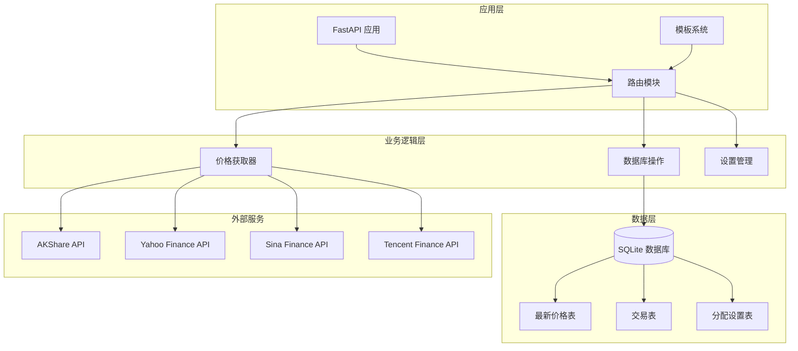
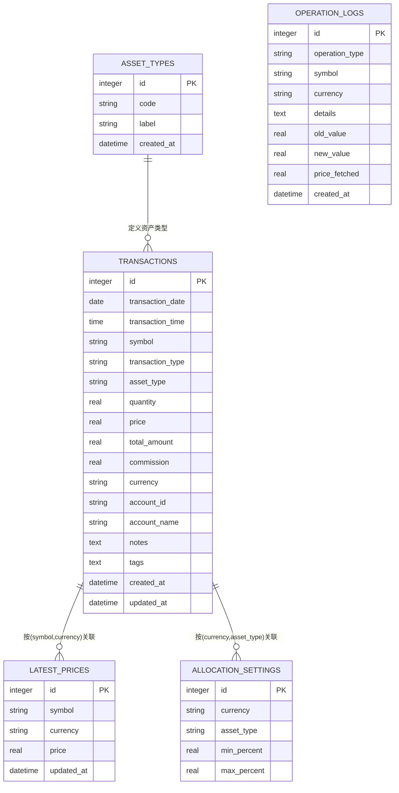
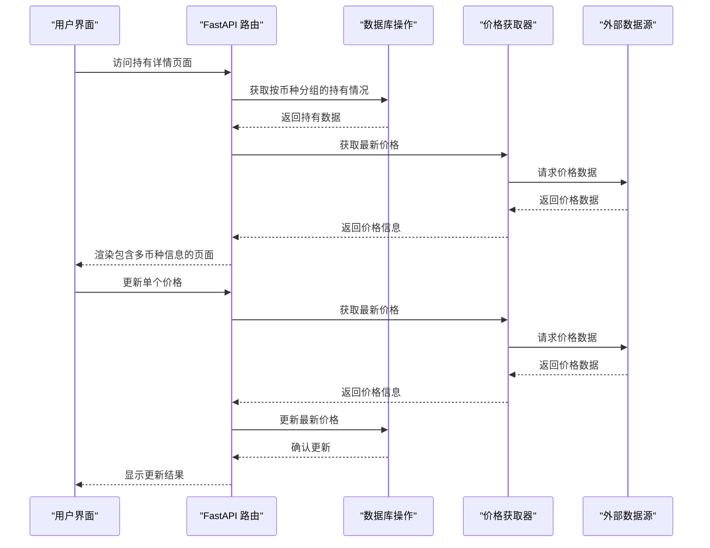
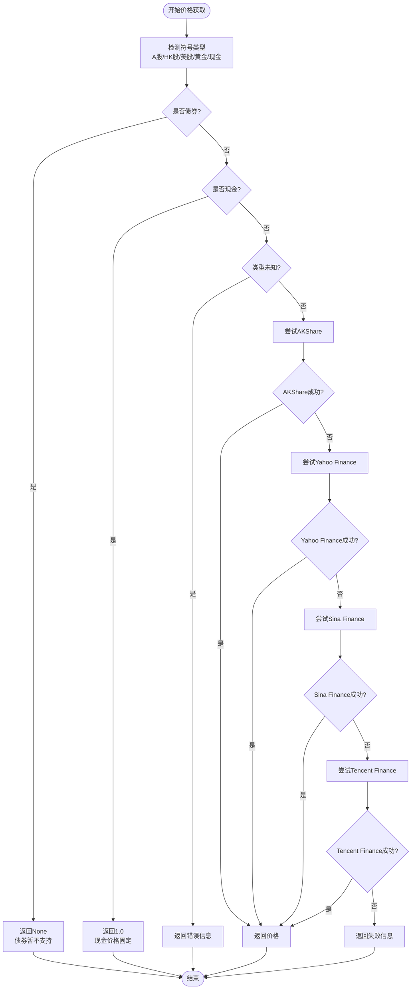
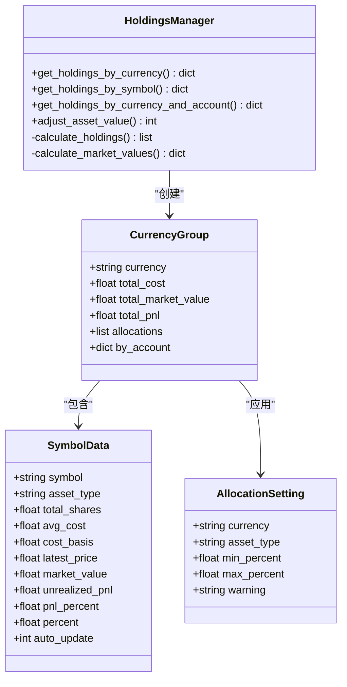
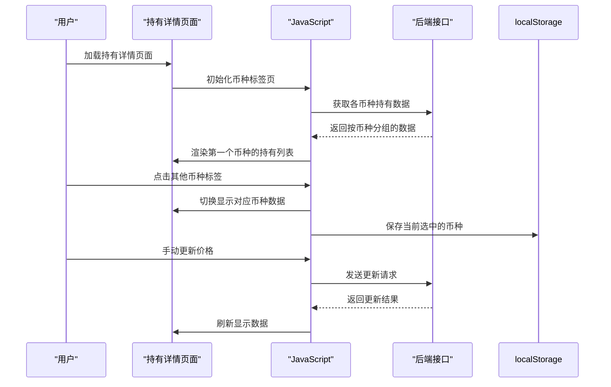
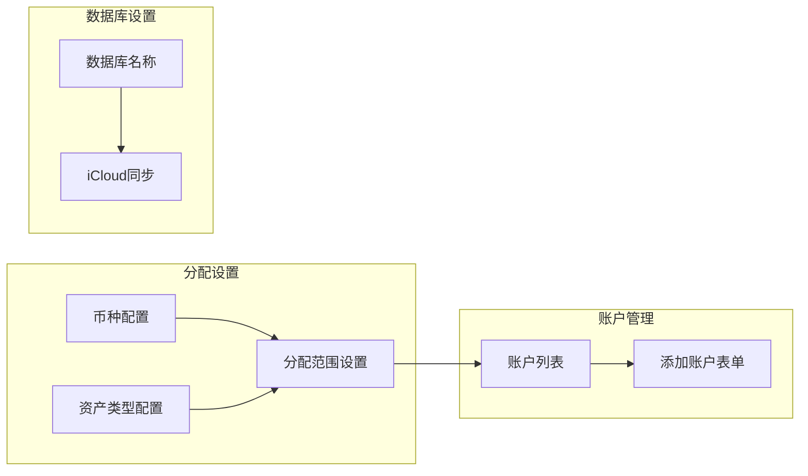
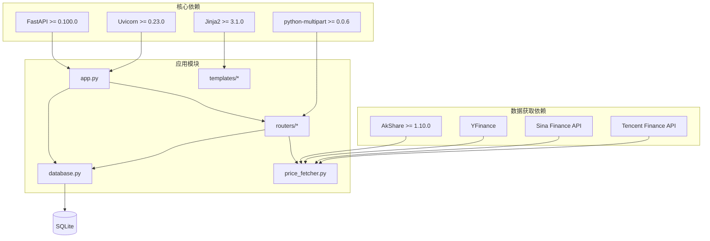

# 多币种支持

<cite>
**本文档引用的文件**
- [app.py](file://app.py)
- [config.py](file://config.py)
- [database.py](file://database.py)
- [price_fetcher.py](file://price_fetcher.py)
- [routers/api.py](file://routers/api.py)
- [routers/holdings.py](file://routers/holdings.py)
- [routers/settings.py](file://routers/settings.py)
- [templates/holdings.html](file://templates/holdings.html)
- [templates/settings.html](file://templates/settings.html)
- [requirements.txt](file://requirements.txt)
</cite>

## 目录
1. [简介](#简介)
2. [项目结构概览](#项目结构概览)
3. [核心组件](#核心组件)
4. [架构总览](#架构总览)
5. [详细组件分析](#详细组件分析)
6. [依赖关系分析](#依赖关系分析)
7. [性能考虑](#性能考虑)
8. [故障排除指南](#故障排除指南)
9. [结论](#结论)

## 简介

Invest Log 是一个基于 FastAPI 的投资交易日志管理系统，专门设计用于支持多币种投资组合管理。该项目的核心功能是帮助用户跟踪和管理不同货币（人民币、美元、港币）的投资交易，包括股票、债券、贵金属等各类资产。

系统通过 SQLite 数据库存储交易数据，并提供实时价格获取、投资组合分析、资产分配监控等功能。多币种支持贯穿整个系统架构，从数据存储到前端展示都实现了完整的多币种处理能力。

## 项目结构概览

**图表来源**
- [app.py](file://app.py#L1-L34)
- [database.py](file://database.py#L1-L1207)
- [price_fetcher.py](file://price_fetcher.py#L1-L405)

**章节来源**
- [app.py](file://app.py#L1-L34)
- [config.py](file://config.py#L1-L55)

## 核心组件

### 数据库架构

系统使用 SQLite 作为主要数据存储，支持多币种投资组合管理的关键表结构如下：

**图表来源**
- [database.py](file://database.py#L27-L195)

### 支持的币种和资产类型

系统默认支持以下币种：
- **CNY**: 人民币 (中国境内)
- **USD**: 美元 (美国市场)
- **HKD**: 港币 (香港市场)

支持的资产类型：
- **stock**: 股票
- **bond**: 债券  
- **metal**: 贵金属
- **cash**: 现金

**章节来源**
- [database.py](file://database.py#L817-L824)

## 架构总览

**图表来源**
- [routers/holdings.py](file://routers/holdings.py#L102-L148)
- [price_fetcher.py](file://price_fetcher.py#L325-L402)

## 详细组件分析

### 价格获取系统

价格获取系统是多币种支持的核心组件，提供了多种数据源和回退机制：

**图表来源**
- [price_fetcher.py](file://price_fetcher.py#L325-L402)

#### 多币种价格获取策略

系统针对不同币种采用不同的价格获取策略：

| 币种 | 适用市场 | 价格获取方式 |
|------|----------|--------------|
| CNY | 中国A股市场 | AKShare为主，Yahoo Finance为辅 |
| USD | 美国股票市场 | Yahoo Finance为主要来源 |
| HKD | 香港股票市场 | AKShare和Yahoo Finance |

**章节来源**
- [price_fetcher.py](file://price_fetcher.py#L36-L66)
- [price_fetcher.py](file://price_fetcher.py#L140-L190)

### 持有情况管理

持有情况管理模块实现了按币种分组的投资组合展示：

**图表来源**
- [database.py](file://database.py#L885-L938)
- [database.py](file://database.py#L437-L532)

#### 币种分组显示逻辑

系统在前端实现了动态币种切换功能：

**图表来源**
- [templates/holdings.html](file://templates/holdings.html#L17-L115)
- [routers/holdings.py](file://routers/holdings.py#L13-L30)

**章节来源**
- [routers/holdings.py](file://routers/holdings.py#L13-L30)
- [templates/holdings.html](file://templates/holdings.html#L17-L115)

### 设置管理

设置管理模块允许用户配置多币种相关的参数：

**图表来源**
- [routers/settings.py](file://routers/settings.py#L12-L64)
- [database.py](file://database.py#L827-L868)

**章节来源**
- [routers/settings.py](file://routers/settings.py#L12-L64)
- [database.py](file://database.py#L827-L868)

## 依赖关系分析

**图表来源**
- [requirements.txt](file://requirements.txt#L1-L6)
- [app.py](file://app.py#L7-L11)

**章节来源**
- [requirements.txt](file://requirements.txt#L1-L6)

## 性能考虑

### 数据库优化

系统采用了多项数据库优化策略来支持多币种数据的高效查询：

1. **索引优化**: 为常用查询字段建立索引
   - `idx_symbol`: 符号查询
   - `idx_date`: 日期范围查询  
   - `idx_account`: 账户过滤
   - `idx_currency`: 币种过滤
   - `idx_asset_type`: 资产类型过滤

2. **查询优化**: 使用分组聚合减少计算复杂度
3. **缓存机制**: 最新价格表提供快速访问

### 价格获取优化

1. **回退机制**: 多级数据源确保高可用性
2. **并发处理**: 支持批量价格更新
3. **错误处理**: 容错机制避免单点故障

## 故障排除指南

### 常见问题及解决方案

#### 1. 价格获取失败

**症状**: 价格更新按钮无响应或显示错误信息

**可能原因**:
- 外部API服务不可用
- 网络连接问题
- 符号格式不正确

**解决步骤**:
1. 检查网络连接状态
2. 验证符号格式是否符合要求
3. 查看操作日志获取详细错误信息
4. 尝试手动输入价格

#### 2. 币种显示异常

**症状**: 币种标签显示不正确或金额格式错误

**可能原因**:
- 数据库中币种字段值不规范
- 前端模板渲染问题

**解决步骤**:
1. 检查数据库中交易记录的币种字段
2. 验证币种常量定义
3. 清除浏览器缓存重新加载页面

#### 3. 投资组合计算错误

**症状**: 持有情况统计与实际不符

**可能原因**:
- 交易类型处理逻辑错误
- 价格数据过期
- 货币汇率转换问题

**解决步骤**:
1. 检查交易记录的交易类型分类
2. 更新最新价格数据
3. 验证计算公式逻辑

**章节来源**
- [database.py](file://database.py#L945-L984)
- [price_fetcher.py](file://price_fetcher.py#L382-L401)

## 结论

Invest Log 的多币种支持系统通过精心设计的架构实现了对人民币、美元、港币三种主要货币的完整支持。系统的核心优势包括：

1. **完整的数据模型**: 从数据库设计到前端展示都支持多币种
2. **可靠的定价系统**: 多级数据源回退确保价格获取的稳定性
3. **灵活的配置管理**: 支持自定义资产类型和分配范围
4. **用户友好的界面**: 动态币种切换和批量操作功能

该系统为需要管理多币种投资组合的用户提供了强大而易用的工具，能够有效支持跨境投资管理和财务规划需求。