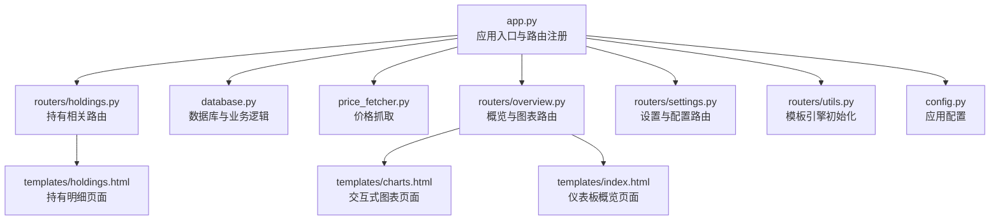
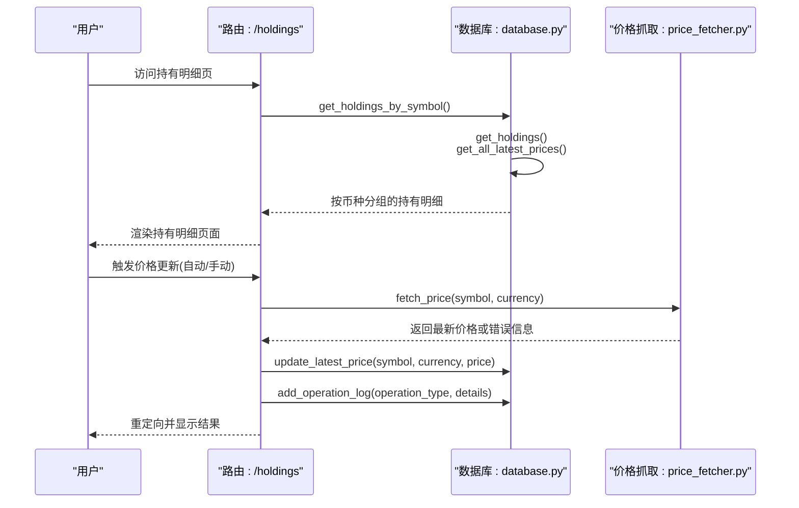
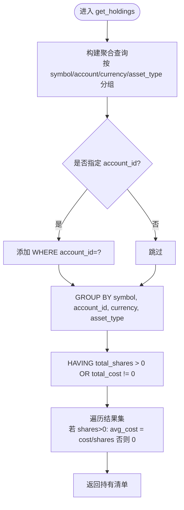
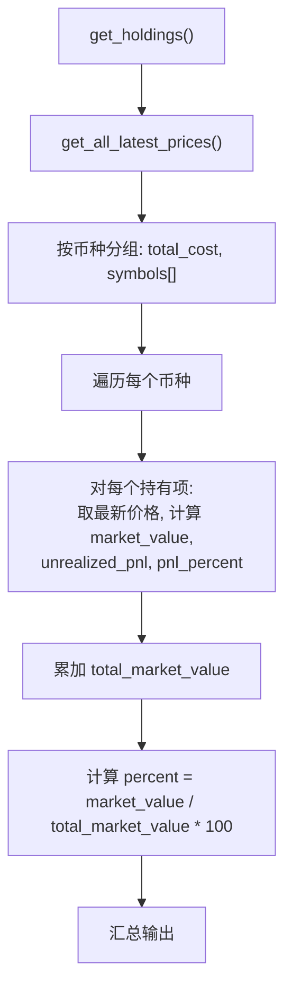
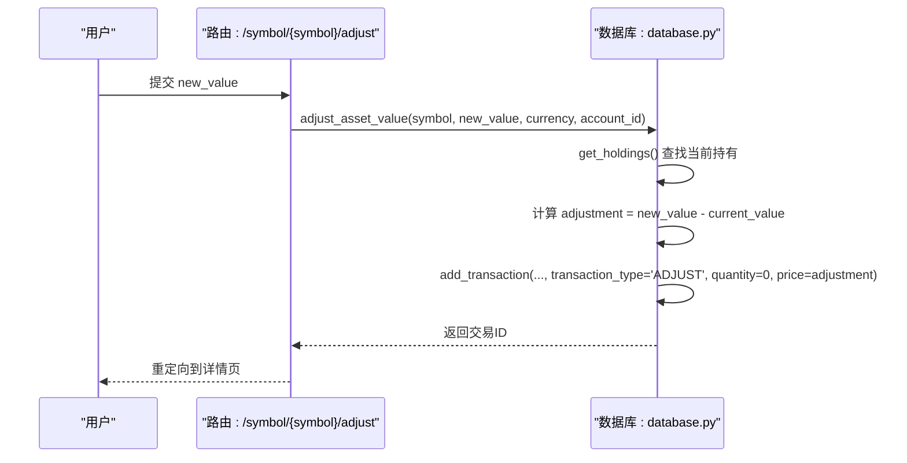
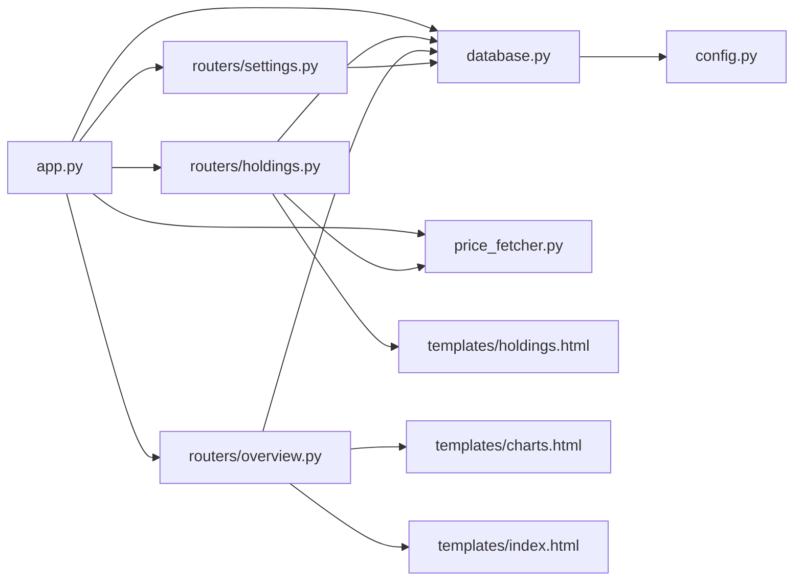

# 投资组合管理

<cite>
**本文引用的文件列表**
- [app.py](file://app.py)
- [config.py](file://config.py)
- [database.py](file://database.py)
- [price_fetcher.py](file://price_fetcher.py)
- [routers/holdings.py](file://routers/holdings.py)
- [routers/overview.py](file://routers/overview.py)
- [routers/settings.py](file://routers/settings.py)
- [routers/utils.py](file://routers/utils.py)
- [templates/holdings.html](file://templates/holdings.html)
- [templates/charts.html](file://templates/charts.html)
- [templates/index.html](file://templates/index.html)
- [templates/base.html](file://templates/base.html)
</cite>

## 更新摘要
**所做更改**
- 新增按账户分组的投资组合视图功能
- 新增交互式图表和隐私模式功能
- 新增多币种支持的完整实现
- 新增资产类型管理和配置设置功能
- 新增自动价格更新和批量更新功能
- 新增快速交易和价值调整功能

## 目录
1. [简介](#简介)
2. [项目结构](#项目结构)
3. [核心组件](#核心组件)
4. [架构总览](#架构总览)
5. [详细组件分析](#详细组件分析)
6. [新增功能详解](#新增功能详解)
7. [依赖关系分析](#依赖关系分析)
8. [性能考量](#性能考量)
9. [故障排查指南](#故障排查指南)
10. [结论](#结论)
11. [附录：使用示例与最佳实践](#附录使用示例与最佳实践)

## 简介
本文件面向"投资组合管理"功能，围绕以下目标展开：
- 深入解释持仓计算逻辑（get_holdings）、多币种支持机制与成本均价计算算法
- 详细说明 get_holdings() 如何聚合不同交易类型的数量变化（BUY/SELL/TRANSFER/ADJUST/INCOME 等）
- 阐述 get_holdings_by_symbol() 和 get_holdings_by_currency() 的分组统计逻辑，解释未实现盈亏、市场价值与配置百分比的计算
- 说明 adjust_asset_value() 的价值调整机制与 INCOME 交易类型的特殊处理
- 新增按账户分组的投资组合视图、交互式图表、隐私模式等增强功能
- 提供查询特定账户持仓与多币种估值的实际示例路径
- 给出最佳实践与常见问题解决方案

## 项目结构
该应用采用 FastAPI + SQLite 的轻量级架构，核心模块如下：
- 应用入口与路由注册：app.py
- 数据库层：database.py（事务、查询、价格、资产类型、配置等）
- 价格抓取：price_fetcher.py（多源回退的价格获取）
- 路由器：routers/holdings.py（持有明细、价格更新、快速交易、价值调整等）
- 路由器：routers/overview.py（概览页面、图表页面）
- 路由器：routers/settings.py（设置页面、配置管理）
- 模板渲染：templates/holdings.html（持有明细页面）
- 模板渲染：templates/charts.html（交互式图表页面）
- 模板渲染：templates/index.html（仪表板概览页面）
- 配置：config.py（数据库路径等）

**图表来源**
- [app.py](file://app.py#L13-L34)
- [routers/holdings.py](file://routers/holdings.py#L1-L30)
- [routers/overview.py](file://routers/overview.py#L1-L28)
- [routers/settings.py](file://routers/settings.py#L1-L180)
- [database.py](file://database.py#L1-L50)
- [price_fetcher.py](file://price_fetcher.py#L1-L30)
- [templates/holdings.html](file://templates/holdings.html#L1-L20)
- [templates/charts.html](file://templates/charts.html#L1-L20)
- [templates/index.html](file://templates/index.html#L1-L20)
- [routers/utils.py](file://routers/utils.py#L1-L4)
- [config.py](file://config.py#L1-L24)

**章节来源**
- [app.py](file://app.py#L13-L34)
- [config.py](file://config.py#L10-L24)

## 核心组件
- 持仓计算与均价：get_holdings()
- 分组统计：get_holdings_by_symbol()、get_holdings_by_currency()
- 价值调整：adjust_asset_value()
- 价格获取与存储：price_fetcher.fetch_price()、database.update_latest_price()/get_all_latest_prices()
- 路由与页面：/holdings、/symbol/{symbol}、/charts、/settings、价格更新、快速交易、价值调整
- 账户管理：按账户分组的投资组合视图
- 图表功能：交互式饼图和隐私模式
- 配置管理：资产类型、账户、数据库设置

**章节来源**
- [database.py](file://database.py#L344-L390)
- [database.py](file://database.py#L393-L463)
- [database.py](file://database.py#L600-L616)
- [database.py](file://database.py#L619-L665)
- [database.py](file://database.py#L732-L785)
- [database.py](file://database.py#L885-L938)
- [database.py](file://database.py#L1071-L1081)
- [routers/holdings.py](file://routers/holdings.py#L13-L30)
- [routers/overview.py](file://routers/overview.py#L8-L27)

## 架构总览
投资组合管理的端到端流程如下：
- 用户在"持有明细"页查看各币种下的资产分布与未实现盈亏
- 页面通过 get_holdings_by_symbol() 获取按币种分组的持有信息
- 价格更新通过 price_fetcher.fetch_price() 自动或手动更新 latest_prices 表
- 快速交易与价值调整通过数据库事务记录，影响后续持仓计算
- 新增的图表页面提供交互式可视化和隐私模式保护

**图表来源**
- [routers/holdings.py](file://routers/holdings.py#L13-L30)
- [routers/holdings.py](file://routers/holdings.py#L102-L177)
- [database.py](file://database.py#L393-L463)
- [database.py](file://database.py#L838-L884)
- [price_fetcher.py](file://price_fetcher.py#L325-L402)

## 详细组件分析

### 持仓计算逻辑：get_holdings()
- 功能：按 symbol/account/currency/asset_type 聚合当前持有数量与总成本，计算平均成本
- 数量变化规则（按交易类型）：
  - 增加：BUY、TRANSFER_IN、INCOME
  - 减少：SELL、TRANSFER_OUT
  - 特殊：SPLIT、ADJUST 不改变数量（仅影响成本或份额）
- 成本计算规则：
  - 增加：BUY、INCOME 记录 total_amount + commission
  - 减少：SELL 记录 -(total_amount - commission)
  - 特殊：ADJUST 记录 total_amount
- 平均价：当 total_shares > 0 时 avg_cost = total_cost / total_shares；否则为 0
- 过滤条件：仅返回 total_shares > 0 或 total_cost != 0 的记录

**图表来源**
- [database.py](file://database.py#L344-L390)

**章节来源**
- [database.py](file://database.py#L344-L390)

### 多币种支持机制
- 支持币种：CNY、USD、HKD
- 交易记录中保存 currency 字段，用于区分不同币种
- 持仓分组：
  - get_holdings_by_symbol()：先按币种分组，再按 symbol 计算市场价值与未实现盈亏
  - get_holdings_by_currency()：按币种分组，再按资产类型计算配置百分比
  - 新增 get_holdings_by_account()：按账户分组，提供更详细的视图
- 价格来源：
  - 通过 price_fetcher.fetch_price() 获取最新价格，写入 latest_prices 表
  - get_all_latest_prices() 提供 (symbol, currency) -> 价格 的查找表

**章节来源**
- [database.py](file://database.py#L600-L616)
- [database.py](file://database.py#L664-L666)
- [database.py](file://database.py#L817-L824)
- [database.py](file://database.py#L885-L938)
- [database.py](file://database.py#L1071-L1081)
- [price_fetcher.py](file://price_fetcher.py#L325-L402)

### 成本均价计算算法
- 平均价 = 总成本 / 持有数量
- 总成本由买入、转入、收入、调整等交易累计，卖出反向抵减
- 若无持有数量，则均价为 0

**章节来源**
- [database.py](file://database.py#L384-L387)

### get_holdings_by_symbol() 分组统计逻辑
- 输入：get_holdings() 的结果 + 最新价格表 + 资产类型标签
- 步骤：
  1) 按币种分组，累加总成本
  2) 对每个币种内的持有项：
     - 取最新价格，计算市场价值 = latest_price × shares
     - 未实现盈亏 = 市场价值 − 成本
     - 未实现盈亏百分比 = 未实现盈亏 / 成本 × 100
     - 百分比 = 市场价值 / 该币种总市场价值 × 100
  3) 输出：每币种的总成本、总市场价值、总未实现盈亏，以及按符号排序的明细

**图表来源**
- [database.py](file://database.py#L393-L463)
- [database.py](file://database.py#L1071-L1081)

**章节来源**
- [database.py](file://database.py#L393-L463)

### get_holdings_by_currency() 分组统计逻辑
- 输入：get_holdings() 的结果 + 配置设置（allocation_settings）
- 步骤：
  1) 按币种分组，累加各资产类型的金额
  2) 计算百分比 = 该资产类型金额 / 该币种总金额 × 100
  3) 与配置范围比较，生成警告提示（低于最小或高于最大）
- 输出：每币种的总金额与各资产类型的金额、百分比及警告

**章节来源**
- [database.py](file://database.py#L885-L938)

### adjust_asset_value() 价值调整机制
- 目的：通过创建 ADJUST 交易记录价值变动，不影响份额但改变成本
- 流程：
  1) 查询当前持有（get_holdings），得到 current_value 与 current_shares
  2) 计算 adjustment = new_value − current_value
  3) 调用 add_transaction 创建 transaction_type=ADJUST 的记录，quantity=0，price=adjustment，total_amount_override=adjustment
- 注意：ADJUST 交易不会改变持有数量，仅影响成本与后续均价

**图表来源**
- [routers/holdings.py](file://routers/holdings.py#L78-L100)
- [database.py](file://database.py#L619-L665)
- [database.py](file://database.py#L158-L225)

**章节来源**
- [routers/holdings.py](file://routers/holdings.py#L78-L100)
- [database.py](file://database.py#L619-L665)

### INCOME 交易类型的特殊处理
- INCOME 交易代表"现金流入"，系统将其标准化为：
  - symbol 固定为 'CASH'
  - asset_type 固定为 'cash'
  - price 固定为 1.0
- 这样 INCOME 交易以"现金份额"的形式参与成本与均价计算，便于统一处理

**章节来源**
- [database.py](file://database.py#L177-L181)
- [database.py](file://database.py#L158-L225)

### 价格更新与前端交互
- 自动更新：调用 price_fetcher.fetch_price() 获取最新价格，成功后写入 latest_prices
- 手动更新：直接提交价格，写入 latest_prices
- 批量更新：支持按币种批量更新所有符号的价格
- 前端页面：templates/holdings.html 展示持有明细、价格、未实现盈亏与百分比，并提供自动/手动更新按钮

**章节来源**
- [routers/holdings.py](file://routers/holdings.py#L102-L177)
- [routers/holdings.py](file://routers/holdings.py#L187-L224)
- [price_fetcher.py](file://price_fetcher.py#L325-L402)
- [database.py](file://database.py#L1014-L1041)
- [templates/holdings.html](file://templates/holdings.html#L1-L347)

## 新增功能详解

### 按账户分组的投资组合视图
- 新增 get_holdings_by_account() 函数，提供按账户维度的详细视图
- 支持每个账户内的符号分组和百分比计算
- 与现有 get_holdings_by_symbol() 形成互补，提供更全面的投资组合分析

**章节来源**
- [database.py](file://database.py#L600-L616)

### 交互式图表功能
- 新增 /charts 路由，提供交互式图表页面
- 使用 Chart.js 实现饼图可视化，展示各币种和账户的资产分布
- 支持按账户分组的详细图表视图
- 图表数据来源于 get_holdings_by_symbol() 的结果

**章节来源**
- [routers/overview.py](file://routers/overview.py#L19-L27)
- [templates/charts.html](file://templates/charts.html#L1-L182)
- [database.py](file://database.py#L393-L463)

### 隐私模式功能
- 新增隐私模式，可隐藏敏感的财务信息
- 通过 CSS 类控制显示/隐藏，支持本地存储状态
- 在仪表板和图表页面均提供隐私模式切换
- 隐私模式下显示掩码字符替代真实数值

**章节来源**
- [templates/index.html](file://templates/index.html#L7-L25)
- [templates/index.html](file://templates/index.html#L78-L105)
- [templates/charts.html](file://templates/charts.html#L7-L25)
- [templates/charts.html](file://templates/charts.html#L105-L132)

### 资产类型管理
- 支持动态资产类型管理，包括股票、债券、贵金属、现金
- 提供资产类型的增删改查功能
- 资产类型独立于货币，可在任何货币下使用
- 通过数据库表 asset_types 实现动态管理

**章节来源**
- [database.py](file://database.py#L134-L157)
- [database.py](file://database.py#L1087-L1156)
- [routers/settings.py](file://routers/settings.py#L120-L147)

### 账户管理功能
- 支持多账户管理，每个账户独立计算投资组合
- 提供账户的增删改查功能
- 账户与交易记录关联，确保数据完整性
- 支持按账户过滤查询

**章节来源**
- [database.py](file://database.py#L93-L121)
- [database.py](file://database.py#L753-L793)
- [routers/settings.py](file://routers/settings.py#L150-L179)

### 自动价格更新机制
- 新增符号级别的自动更新开关
- 支持批量更新所有符号的价格
- 通过 symbols 表维护自动更新状态
- 提供更灵活的价格管理方式

**章节来源**
- [database.py](file://database.py#L1054-L1068)
- [routers/holdings.py](file://routers/holdings.py#L178-L185)
- [routers/holdings.py](file://routers/holdings.py#L187-L224)

### 快速交易功能
- 在持有明细页面提供快速交易入口
- 支持一键购买、卖出、收入、股息等交易类型
- 集成现金账户链接功能
- 提供交易确认和错误处理

**章节来源**
- [routers/holdings.py](file://routers/holdings.py#L226-L254)
- [templates/holdings.html](file://templates/holdings.html#L124-L180)

### 操作日志系统
- 新增 operation_logs 表，记录所有重要操作
- 支持价格更新、手动更新、价值调整等操作的日志记录
- 提供操作历史查询功能
- 便于审计和问题追踪

**章节来源**
- [database.py](file://database.py#L159-L172)
- [database.py](file://database.py#L945-L984)
- [routers/holdings.py](file://routers/holdings.py#L123-L142)

## 依赖关系分析
- app.py 引入 routers 与 database，启动时初始化数据库
- routers/holdings.py 依赖 database 与 price_fetcher，负责持有明细、价格更新、快速交易、价值调整
- routers/overview.py 提供概览和图表页面
- routers/settings.py 管理配置和设置
- database.py 提供交易、查询、价格、资产类型、配置等核心能力
- price_fetcher.py 提供多源价格抓取与回退策略
- templates 依赖后端传入的数据进行渲染，支持隐私模式和交互式图表

**图表来源**
- [app.py](file://app.py#L11-L29)
- [routers/holdings.py](file://routers/holdings.py#L1-L11)
- [routers/overview.py](file://routers/overview.py#L1-L10)
- [routers/settings.py](file://routers/settings.py#L1-L10)
- [database.py](file://database.py#L1-L20)
- [price_fetcher.py](file://price_fetcher.py#L1-L20)
- [config.py](file://config.py#L10-L24)
- [templates/holdings.html](file://templates/holdings.html#L1-L10)
- [templates/charts.html](file://templates/charts.html#L1-L10)
- [templates/index.html](file://templates/index.html#L1-L10)

**章节来源**
- [app.py](file://app.py#L11-L29)
- [routers/holdings.py](file://routers/holdings.py#L1-L11)
- [routers/overview.py](file://routers/overview.py#L1-L10)
- [routers/settings.py](file://routers/settings.py#L1-L10)
- [database.py](file://database.py#L1-L20)

## 性能考量
- 数据库索引：对 symbol、date、account_id、transaction_type、currency、asset_type 建立索引，有助于 get_transactions 与 get_holdings 的查询效率
- 聚合查询：get_holdings 使用 SQL 聚合一次性计算，避免多次往返
- 价格缓存：latest_prices 表减少重复抓取，提高页面渲染速度
- 图表优化：Chart.js 图表按需加载，避免不必要的资源消耗
- 隐私模式：CSS 控制显示，不增加额外的 JavaScript 开销
- 建议：
  - 定期清理历史交易或分页查询，避免单次查询过大
  - 在高并发场景下考虑连接池与事务隔离级别
  - 对频繁访问的币种/符号建立更细粒度的索引
  - 图表数据使用本地缓存，减少重复计算

**章节来源**
- [database.py](file://database.py#L186-L195)
- [database.py](file://database.py#L1071-L1081)
- [templates/charts.html](file://templates/charts.html#L104-L175)

## 故障排查指南
- 价格获取失败
  - 现象：自动更新失败，返回错误信息
  - 排查：检查网络与第三方库可用性，确认 symbol 类型识别正确
  - 参考：price_fetcher.fetch_price() 的回退策略与日志
- 持仓为 0 或均价异常
  - 现象：avg_cost 显示为 0，或 total_shares 为负
  - 排查：检查交易类型是否正确（如 SELL/BUY 是否匹配），确认 commission 是否计入成本
  - 参考：get_holdings() 的数量与成本计算逻辑
- 价值调整无效
  - 现象：调整后未影响成本或均价
  - 排查：确认 adjust_asset_value() 是否创建了 ADJUST 交易且 quantity=0
  - 参考：adjust_asset_value() 与 add_transaction()
- 图表显示异常
  - 现象：图表无法正常显示或数据不正确
  - 排查：检查 Chart.js 是否正确加载，确认数据格式符合要求
  - 参考：templates/charts.html 中的图表初始化代码
- 隐私模式问题
  - 现象：隐私模式切换无效或状态丢失
  - 排查：检查 localStorage 是否可用，确认 CSS 类名是否正确
  - 参考：隐私模式相关的 JavaScript 代码

**章节来源**
- [price_fetcher.py](file://price_fetcher.py#L325-L402)
- [database.py](file://database.py#L344-L390)
- [database.py](file://database.py#L619-L665)
- [database.py](file://database.py#L158-L225)
- [templates/charts.html](file://templates/charts.html#L105-L175)
- [templates/index.html](file://templates/index.html#L78-L105)

## 结论
本系统通过清晰的交易类型定义与 SQL 聚合，实现了准确的多币种投资组合管理。新增的按账户分组视图、交互式图表、隐私模式等功能进一步增强了用户体验和实用性。get_holdings() 提供基础持仓与成本均价，get_holdings_by_symbol() 与 get_holdings_by_currency() 则分别从"符号维度"和"资产类型维度"提供可视化与配置监控。adjust_asset_value() 与 INCOME 交易类型确保了价值调整与现金流入的规范记录。配合多源价格抓取与缓存、自动更新机制、操作日志系统，系统在易用性与准确性之间取得良好平衡。

## 附录：使用示例与最佳实践

### 实际示例：查询特定账户的持仓情况
- 路由：/holdings
- 后端逻辑：routers/holdings.py 调用 database.get_holdings_by_symbol() 获取按币种分组的持有明细
- 前端渲染：templates/holdings.html 展示每个币种的总成本、市场价值、未实现盈亏与百分比
- 新增功能：支持按账户分组的详细视图

**章节来源**
- [routers/holdings.py](file://routers/holdings.py#L13-L30)
- [database.py](file://database.py#L393-L463)
- [database.py](file://database.py#L600-L616)
- [templates/holdings.html](file://templates/holdings.html#L15-L115)

### 实际示例：多币种投资组合的估值计算
- 步骤：
  1) 调用 get_holdings() 获取各币种的持有清单
  2) 调用 get_all_latest_prices() 获取最新价格映射
  3) 对每个持有项：market_value = latest_price × shares；unrealized_pnl = market_value − cost；percent = market_value / total_market_value × 100
- 输出：按币种汇总的总成本、总市场价值、总未实现盈亏与各符号明细

**章节来源**
- [database.py](file://database.py#L393-L463)
- [database.py](file://database.py#L1071-L1081)

### 实际示例：交互式图表展示
- 路由：/charts
- 功能：使用 Chart.js 创建交互式饼图，展示各币种和账户的资产分布
- 隐私模式：支持隐私模式切换，保护敏感财务信息
- 数据来源：get_holdings_by_symbol() 的结果

**章节来源**
- [routers/overview.py](file://routers/overview.py#L19-L27)
- [templates/charts.html](file://templates/charts.html#L140-L175)
- [templates/index.html](file://templates/index.html#L78-L140)

### 最佳实践
- 交易类型一致性：确保 BUY/SELL/TRANSFER/ADJUST/INCOME 的数量与金额方向一致，避免误算
- 成本归集：commission 应计入买入成本，卖出收益应扣减 commission
- 价格更新：优先使用自动更新，必要时手动校正；定期核对最新价格来源
- 配置监控：通过 get_holdings_by_currency() 检查资产配置是否超出设定范围
- 账户隔离：按 account_id 过滤 get_holdings()，避免跨账户混淆
- 隐私保护：在公共场合使用隐私模式，隐藏敏感财务信息
- 图表优化：合理使用图表功能，避免过多复杂图表影响性能
- 日志审计：利用操作日志追踪重要操作，便于问题排查

### 常见问题
- 为什么某些符号没有最新价格？
  - 可能是 symbol 类型识别失败或数据源不可用，建议手动更新或检查 symbol 格式
- 为什么调整价值后均价不变？
  - 确认是否创建了 ADJUST 交易且 quantity=0，且 total_amount_override 已生效
- 为什么某些币种显示为 0？
  - 可能是该币种下无有效持有（total_shares=0），或价格缺失导致市场价值按成本计
- 图表无法显示
  - 检查 Chart.js 是否正确加载，确认浏览器兼容性和网络连接
- 隐私模式失效
  - 确认浏览器支持 localStorage，检查 CSS 类名和 JavaScript 代码
- 自动更新功能异常
  - 检查符号的 auto_update 设置，确认网络连接和数据源可用性