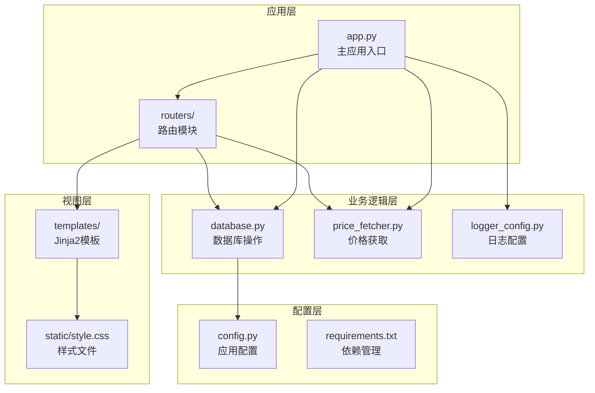
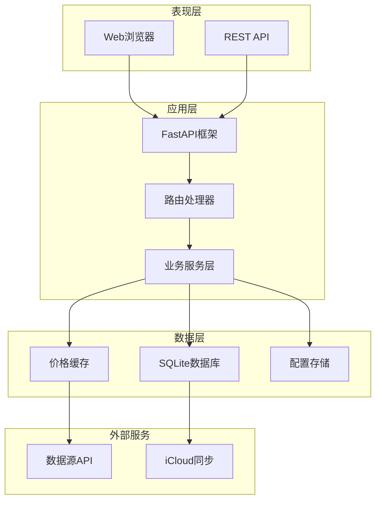
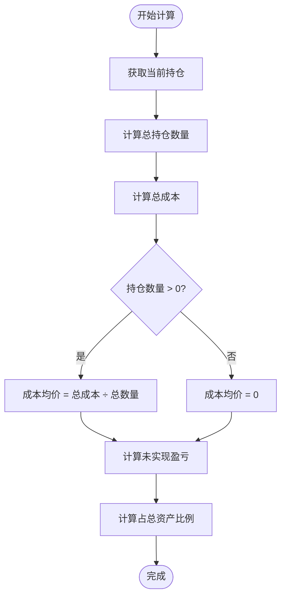
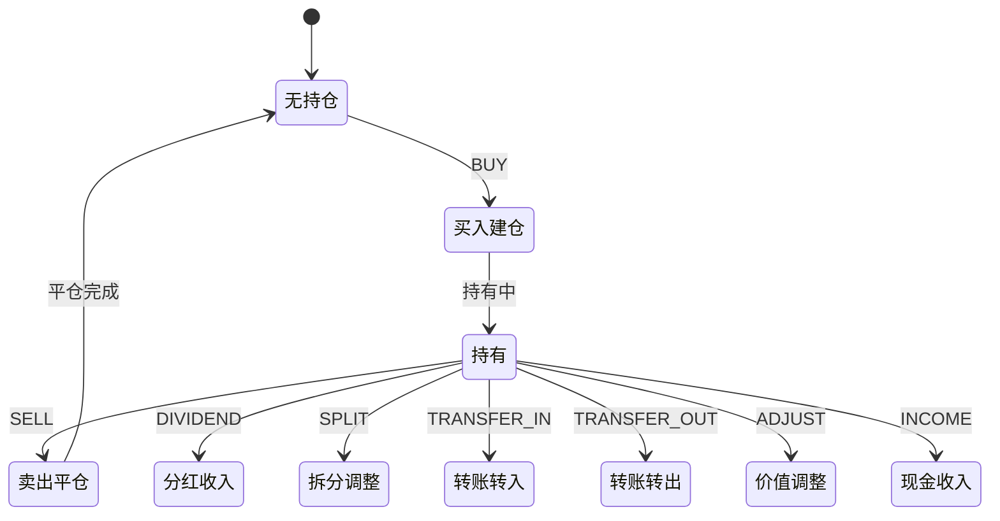
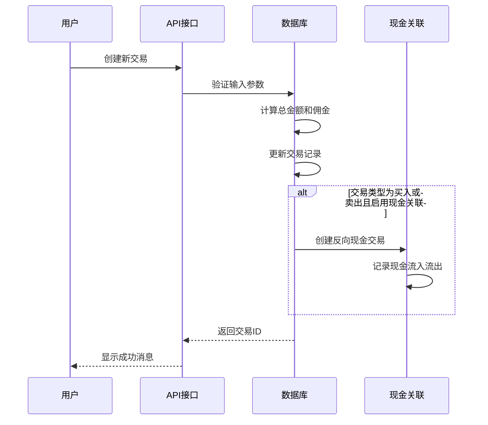
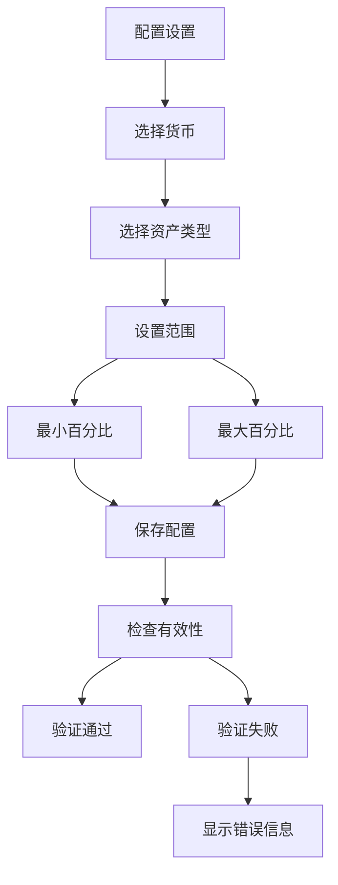
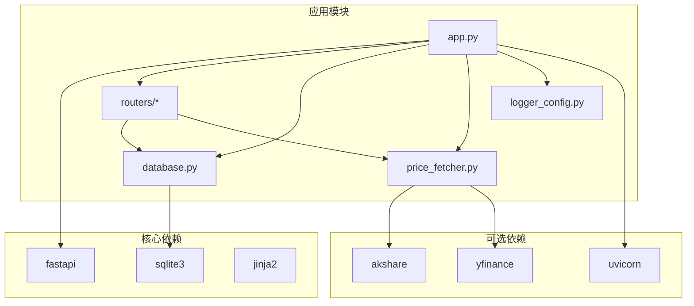

# 核心功能模块

<cite>
**本文档引用的文件**
- [app.py](file://app.py)
- [database.py](file://database.py)
- [config.py](file://config.py)
- [price_fetcher.py](file://price_fetcher.py)
- [logger_config.py](file://logger_config.py)
- [routers/api.py](file://routers/api.py)
- [routers/holdings.py](file://routers/holdings.py)
- [routers/transactions.py](file://routers/transactions.py)
- [routers/overview.py](file://routers/overview.py)
- [routers/settings.py](file://routers/settings.py)
- [templates/index.html](file://templates/index.html)
- [templates/holdings.html](file://templates/holdings.html)
- [requirements.txt](file://requirements.txt)
</cite>

## 目录
1. [简介](#简介)
2. [项目结构](#项目结构)
3. [核心组件](#核心组件)
4. [架构概览](#架构概览)
5. [详细组件分析](#详细组件分析)
6. [依赖关系分析](#依赖关系分析)
7. [性能考虑](#性能考虑)
8. [故障排除指南](#故障排除指南)
9. [结论](#结论)
10. [附录](#附录)

## 简介

投资日志管理系统是一个基于FastAPI的Web应用程序，专为个人投资者设计，提供完整的投资组合管理、交易记录和资产配置分析功能。该系统支持多币种投资管理（人民币、美元、港币），涵盖多种资产类型（股票、债券、贵金属、现金），并提供实时价格获取、成本均价计算和持仓状态管理等核心功能。

系统采用SQLite数据库存储所有交易数据，通过iCloud自动同步确保数据安全性和可访问性。内置多级价格获取机制，支持A股、港股、美股和黄金等多种资产类型的实时价格查询。

## 项目结构

项目采用模块化设计，主要分为以下几个核心层次：

**图表来源**
- [app.py](file://app.py#L1-L34)
- [database.py](file://database.py#L1-L50)
- [config.py](file://config.py#L1-L24)

**章节来源**
- [app.py](file://app.py#L1-L34)
- [config.py](file://config.py#L1-L24)

## 核心组件

### 数据库模块 (database.py)

数据库模块是整个系统的核心，负责处理所有数据持久化操作。主要功能包括：

- **交易记录管理**：支持完整的CRUD操作，包括买入、卖出、分红、拆分、转账等交易类型
- **持仓计算**：自动计算持仓数量、成本均价和当前市场价值
- **资产配置分析**：提供按货币和资产类型分组的投资组合分析
- **价格管理**：维护最新的市场价格数据和历史价格记录

### 路由器模块 (routers/)

路由器模块实现了RESTful API和Web页面的路由处理：

- **概览路由**：提供投资组合概览和图表展示
- **交易路由**：处理交易记录的增删改查操作
- **持仓路由**：管理持仓详情和价格更新
- **设置路由**：配置资产类别、账户信息和分配规则
- **API路由**：提供后端服务接口

### 价格获取模块 (price_fetcher.py)

价格获取模块实现了多数据源的价格查询机制：

- **多源支持**：支持AKShare、Yahoo Finance、新浪、腾讯等多个数据源
- **智能回退**：当主要数据源不可用时自动切换到备用数据源
- **格式适配**：自动处理不同市场的数据格式转换

**章节来源**
- [database.py](file://database.py#L15-L150)
- [routers/api.py](file://routers/api.py#L1-L67)
- [routers/holdings.py](file://routers/holdings.py#L1-L207)

## 架构概览

系统采用分层架构设计，确保各层职责清晰分离：

**图表来源**
- [app.py](file://app.py#L7-L29)
- [database.py](file://database.py#L15-L50)
- [price_fetcher.py](file://price_fetcher.py#L325-L405)

## 详细组件分析

### 投资组合管理模块

投资组合管理是系统的核心功能，主要包含以下特性：

#### 成本均价计算算法

系统采用加权平均法计算持仓成本均价：

**图表来源**
- [database.py](file://database.py#L344-L390)
- [database.py](file://database.py#L414-L463)

#### 多币种支持机制

系统支持三种货币的并行管理：

| 货币代码 | 货币名称 | 符号表示 |
|---------|---------|---------|
| CNY | 人民币 | ¥ |
| USD | 美元 | $ |
| HKD | 港币 | HK$ |

每笔交易都明确标注货币类型，系统在计算时会根据汇率进行统一换算。

#### 持仓状态管理策略

系统通过交易类型区分不同的持仓状态变化：

**图表来源**
- [database.py](file://database.py#L349-L375)

**章节来源**
- [database.py](file://database.py#L344-L463)

### 交易记录系统

交易记录系统提供了完整的交易生命周期管理：

#### 交易类型支持

系统支持以下交易类型：

| 交易类型 | 描述 | 对持仓的影响 |
|---------|------|-------------|
| BUY | 买入 | 增加持仓数量 |
| SELL | 卖出 | 减少持仓数量 |
| DIVIDEND | 分红 | 增加现金收入 |
| SPLIT | 拆分 | 增加持仓数量，降低单价 |
| TRANSFER_IN | 转入 | 增加持仓数量 |
| TRANSFER_OUT | 转出 | 减少持仓数量 |
| ADJUST | 调整 | 仅调整价值，不影响数量 |
| INCOME | 现金收入 | 增加现金 |

#### 交易CRUD操作

**图表来源**
- [database.py](file://database.py#L158-L225)
- [routers/transactions.py](file://routers/transactions.py#L45-L75)

#### 现金关联机制

系统提供智能的现金关联功能，自动创建对应的现金交易：

- **买入交易**：自动生成卖出现金的反向交易
- **卖出交易**：自动生成买入现金的反向交易
- **佣金处理**：自动从现金中扣除相关费用

**章节来源**
- [database.py](file://database.py#L158-L225)
- [routers/transactions.py](file://routers/transactions.py#L45-L75)

### 资产配置分析模块

资产配置分析模块提供了全面的投资组合分析功能：

#### 配置范围设置

系统允许用户为不同货币和资产类型设置配置范围：

**图表来源**
- [database.py](file://database.py#L689-L730)
- [routers/settings.py](file://routers/settings.py#L63-L86)

#### 风险预警机制

系统内置智能风险预警功能：

- **配置超限检测**：当某资产类型占比超出设定范围时发出警告
- **实时监控**：每次价格更新时重新计算配置比例
- **可视化提醒**：在界面上以颜色和图标形式显示警告状态

#### 可视化展示功能

系统提供多种可视化展示方式：

- **饼图展示**：按资产类型展示投资组合构成
- **进度条显示**：显示各资产类型的配置范围
- **动态图表**：实时反映投资组合变化

**章节来源**
- [database.py](file://database.py#L732-L785)
- [templates/index.html](file://templates/index.html#L48-L82)

## 依赖关系分析

系统采用模块化设计，各组件之间的依赖关系清晰明确：

**图表来源**
- [requirements.txt](file://requirements.txt#L1-L6)
- [app.py](file://app.py#L7-L11)

**章节来源**
- [requirements.txt](file://requirements.txt#L1-L6)
- [app.py](file://app.py#L7-L11)

## 性能考虑

### 数据库优化

系统在数据库层面采用了多项优化措施：

- **索引优化**：为常用查询字段建立索引，包括symbol、transaction_date、account_id等
- **查询优化**：使用参数化查询防止SQL注入，优化复杂查询语句
- **连接池**：使用SQLite的连接工厂模式提高连接效率

### 缓存策略

- **价格缓存**：维护最新的市场价格，减少重复查询
- **会话缓存**：在内存中缓存常用的查询结果
- **模板缓存**：利用Jinja2的模板缓存机制

### 网络优化

- **异步处理**：使用FastAPI的异步特性提高并发处理能力
- **请求限制**：对频繁的价格查询进行速率限制
- **错误重试**：对网络请求失败的场景进行智能重试

## 故障排除指南

### 常见问题及解决方案

#### 数据库连接问题

**症状**：应用启动时报数据库连接错误
**原因**：数据库文件损坏或权限不足
**解决方法**：
1. 检查数据库文件是否存在
2. 确认应用程序有读写权限
3. 尝试重新初始化数据库

#### 价格获取失败

**症状**：无法获取资产价格
**原因**：网络连接问题或数据源不可用
**解决方法**：
1. 检查网络连接状态
2. 手动更新价格或使用备用数据源
3. 查看日志文件获取详细错误信息

#### iCloud同步问题

**症状**：数据不同步或丢失
**原因**：iCloud服务异常或存储空间不足
**解决方法**：
1. 检查iCloud登录状态
2. 确认有足够的存储空间
3. 手动备份数据库文件

**章节来源**
- [logger_config.py](file://logger_config.py#L14-L50)
- [config.py](file://config.py#L10-L24)

## 结论

投资日志管理系统是一个功能完整、架构清晰的个人投资管理工具。系统通过模块化设计实现了高内聚、低耦合的代码结构，为用户提供了一站式的投资组合管理解决方案。

系统的主要优势包括：

- **全面的功能覆盖**：从基础的交易记录到高级的资产配置分析
- **灵活的数据支持**：支持多币种、多资产类型的统一管理
- **智能的价格获取**：多数据源回退机制确保价格数据的可靠性
- **友好的用户体验**：直观的界面设计和丰富的可视化功能
- **可靠的数据安全**：基于iCloud的自动同步和备份机制

通过持续的功能扩展和性能优化，该系统能够满足个人投资者日益增长的投资管理需求。

## 附录

### 使用示例

#### 添加新的交易记录

1. 访问 `/add` 页面
2. 填写交易基本信息（日期、代码、类型、数量、价格等）
3. 选择关联账户和货币类型
4. 如需自动关联现金，勾选"Link to Cash Account"
5. 提交表单完成交易记录

#### 设置资产配置范围

1. 访问 `/settings` 页面
2. 切换到"Allocation"标签页
3. 为每种货币和资产类型设置最小和最大百分比
4. 点击"Save Settings"保存配置

#### 查看投资组合分析

1. 访问根目录 `/` 查看概览页面
2. 查看各货币的投资组合构成饼图
3. 关注配置范围警告信息
4. 点击具体资产查看详细信息

### 最佳实践建议

1. **定期备份**：建议每周手动备份数据库文件
2. **及时更新价格**：定期更新重要资产的市场价格
3. **合理设置配置范围**：根据个人风险承受能力设置合理的资产配置
4. **保持数据完整性**：确保所有交易都有准确的记录
5. **利用自动化功能**：充分利用现金关联和价格自动更新功能