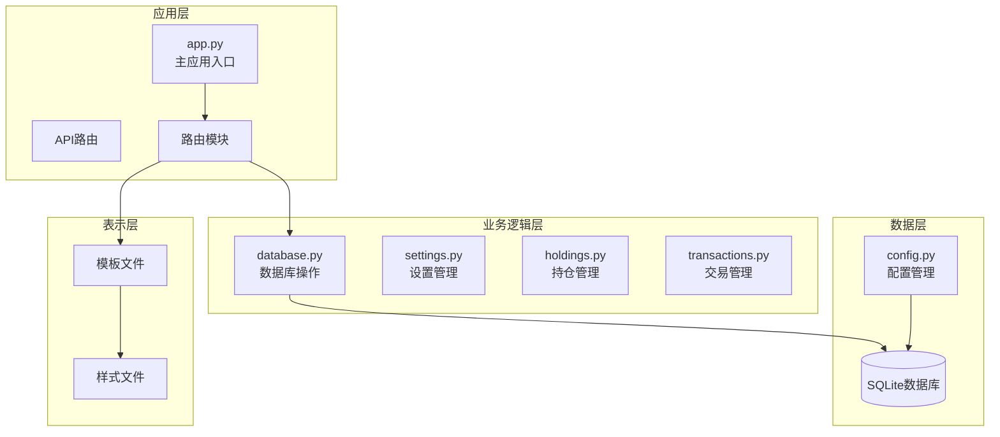
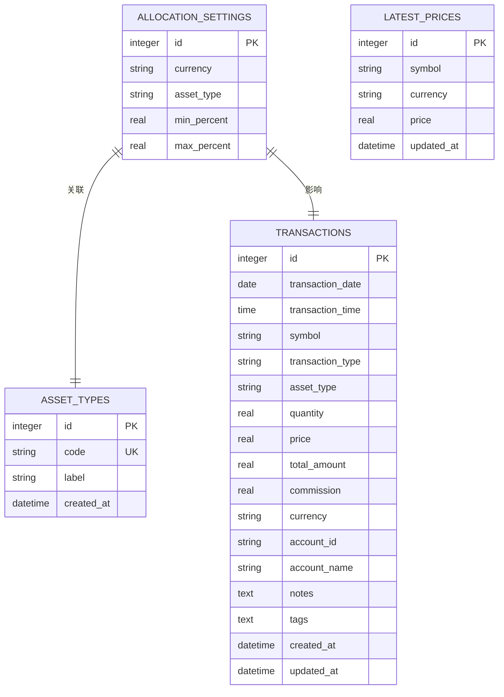
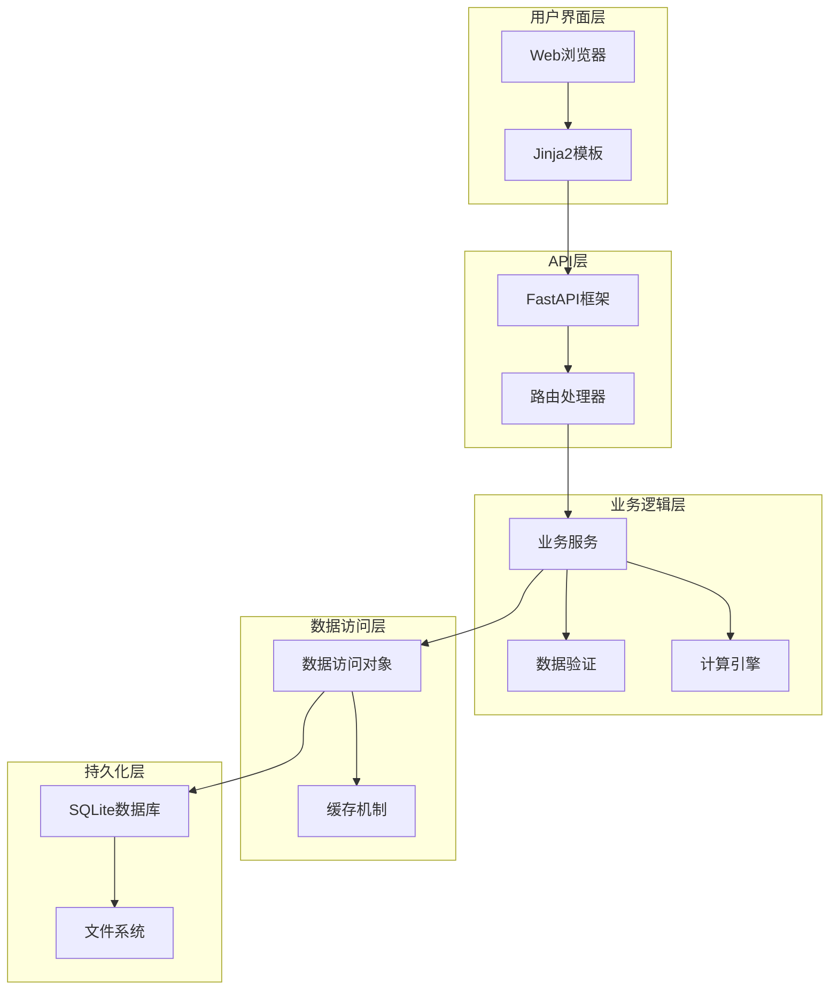
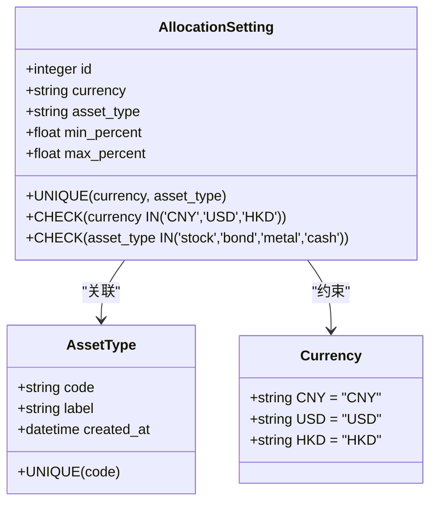
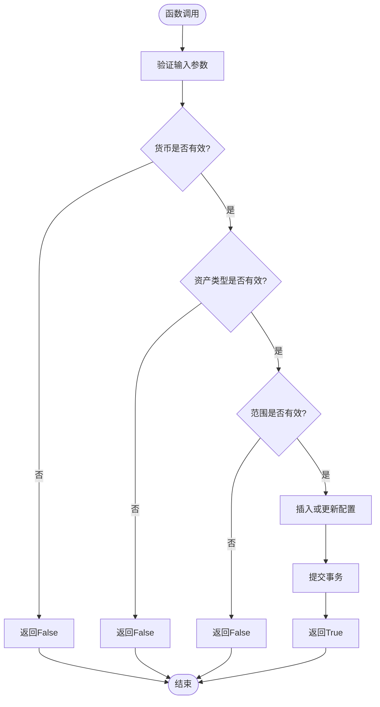
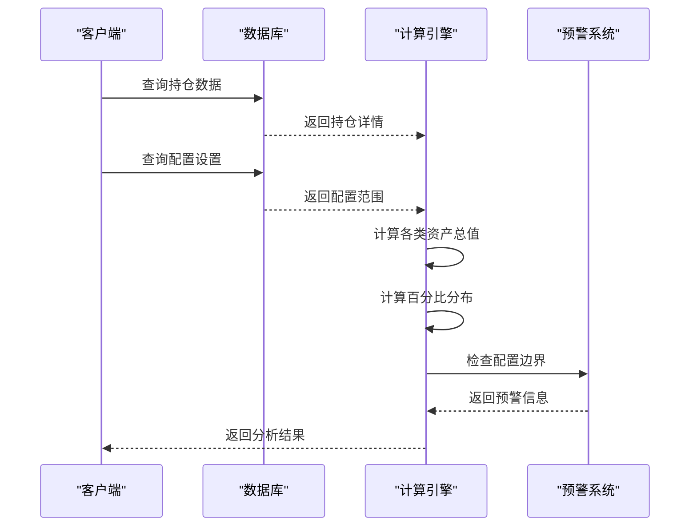
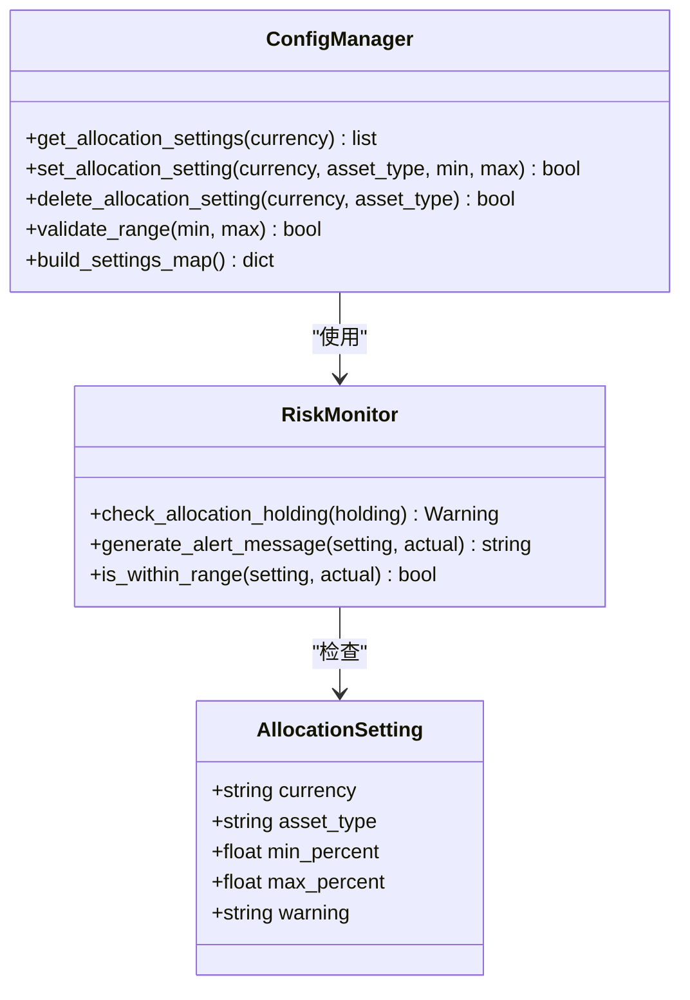
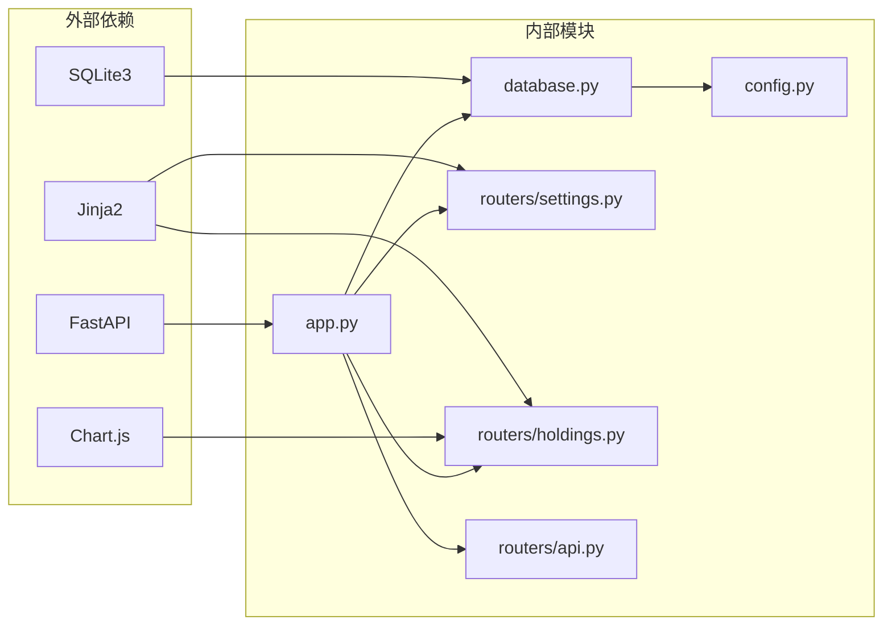

# 资产配置分析

<cite>
**本文档引用的文件**
- [app.py](file://app.py)
- [database.py](file://database.py)
- [routers/settings.py](file://routers/settings.py)
- [routers/holdings.py](file://routers/holdings.py)
- [routers/api.py](file://routers/api.py)
- [config.py](file://config.py)
- [templates/settings.html](file://templates/settings.html)
- [templates/holdings.html](file://templates/holdings.html)
- [templates/base.html](file://templates/base.html)
</cite>

## 目录
1. [简介](#简介)
2. [项目结构](#项目结构)
3. [核心组件](#核心组件)
4. [架构概览](#架构概览)
5. [详细组件分析](#详细组件分析)
6. [依赖关系分析](#依赖关系分析)
7. [性能考虑](#性能考虑)
8. [故障排除指南](#故障排除指南)
9. [结论](#结论)
10. [附录](#附录)

## 简介

Invest Log 是一个基于 FastAPI 的投资组合管理系统，专注于提供全面的资产配置分析功能。该系统支持四种主要资产类型：股票(stock)、债券(bond)、贵金属(metal)和现金(cash)，并通过动态资产管理机制实现灵活的配置管理。

本系统的核心功能包括：
- 实时资产配置分析和可视化
- 动态配置边界设置和风险预警
- 多货币支持和汇率处理
- 完整的投资组合追踪和报告
- 用户友好的Web界面和API接口

## 项目结构

项目采用模块化设计，按照功能层次组织代码结构：

**图表来源**
- [app.py](file://app.py#L1-L34)
- [database.py](file://database.py#L1-L1047)

**章节来源**
- [app.py](file://app.py#L1-L34)
- [config.py](file://config.py#L1-L24)

## 核心组件

### 数据库架构

系统使用SQLite作为数据存储，核心表结构包括：

**图表来源**
- [database.py](file://database.py#L115-L186)

### 资产类型管理系统

系统支持四种核心资产类型，每种都有对应的中文标签：

| 资产类型代码 | 中文标签 | 默认范围 |
|------------|----------|----------|
| stock | 股票 | 0%-100% |
| bond | 债券 | 0%-100% |
| metal | 贵金属 | 0%-100% |
| cash | 现金 | 0%-100% |

**章节来源**
- [database.py](file://database.py#L703-L708)
- [database.py](file://database.py#L141-L150)

## 架构概览

系统采用分层架构设计，确保关注点分离和代码可维护性：

**图表来源**
- [app.py](file://app.py#L7-L29)
- [routers/api.py](file://routers/api.py#L1-L67)

## 详细组件分析

### allocation_settings 表设计

allocation_settings 表是资产配置分析的核心数据结构：

**图表来源**
- [database.py](file://database.py#L115-L125)
- [database.py](file://database.py#L701-L708)

#### 表设计目的

1. **配置管理**: 存储每种资产类型在不同货币下的目标配置范围
2. **风险控制**: 提供自动化的风险预警机制
3. **多货币支持**: 支持CNY、USD、HKD三种货币的独立配置
4. **动态扩展**: 支持通过asset_types表动态添加新的资产类型

**章节来源**
- [database.py](file://database.py#L115-L125)

### set_allocation_setting() 函数配置逻辑

set_allocation_setting() 函数实现了完整的配置设置逻辑：

**图表来源**
- [database.py](file://database.py#L726-L752)

#### 配置验证规则

1. **货币验证**: 必须在['CNY', 'USD', 'HKD']范围内
2. **资产类型验证**: 必须在['stock', 'bond', 'metal', 'cash']范围内
3. **数值范围验证**: min_percent ≥ 0, max_percent ≤ 100, min_percent ≤ max_percent

**章节来源**
- [database.py](file://database.py#L734-L737)

### get_holdings_by_currency() 函数分析

get_holdings_by_currency() 函数实现了核心的资产配置计算和风险预警功能：

**图表来源**
- [database.py](file://database.py#L769-L822)

#### 计算流程详解

1. **数据聚合**: 按货币和资产类型汇总持仓成本
2. **百分比计算**: 基于总资产计算各资产类型的占比
3. **配置检查**: 对比实际配置与设定范围
4. **风险标记**: 为超出范围的配置添加警告标识

**章节来源**
- [database.py](file://database.py#L770-L822)

### 配置范围管理

系统提供了完整的配置范围管理功能：

**图表来源**
- [database.py](file://database.py#L711-L766)
- [database.py](file://database.py#L804-L820)

**章节来源**
- [database.py](file://database.py#L711-L766)

### API 接口设计

系统提供RESTful API接口支持：

| 端点 | 方法 | 描述 | 返回数据 |
|------|------|------|----------|
| `/api/holdings` | GET | 获取当前持仓 | 持仓列表 |
| `/api/holdings-by-currency` | GET | 获取按货币分组的持仓 | 配置分析结果 |
| `/api/transactions` | GET | 获取交易历史 | 交易列表 |
| `/api/portfolio-history` | GET | 获取投资组合历史 | 时间序列数据 |
| `/api/transactions/{id}` | DELETE | 删除交易 | 删除状态 |

**章节来源**
- [routers/api.py](file://routers/api.py#L8-L67)

## 依赖关系分析

系统采用松耦合设计，各模块间依赖关系清晰：

**图表来源**
- [app.py](file://app.py#L7-L11)
- [database.py](file://database.py#L12-L12)

**章节来源**
- [app.py](file://app.py#L7-L11)

## 性能考虑

### 数据库优化策略

1. **索引优化**: 为常用查询字段建立索引
   - `idx_symbol`: 符号查询
   - `idx_date`: 日期范围查询  
   - `idx_account`: 账户过滤
   - `idx_type`: 交易类型过滤
   - `idx_currency`: 货币过滤
   - `idx_asset_type`: 资产类型过滤

2. **查询优化**: 使用参数化查询避免SQL注入
3. **连接池**: 复用数据库连接减少开销
4. **缓存机制**: 最新价格数据缓存

### 内存管理

1. **流式处理**: 大数据集分页处理
2. **延迟加载**: 按需加载数据
3. **垃圾回收**: 及时释放不再使用的对象

## 故障排除指南

### 常见问题及解决方案

#### 配置设置失败

**症状**: 设置资产配置范围时返回False
**原因**: 输入参数无效或范围不合法
**解决**: 
1. 检查货币代码是否在['CNY', 'USD', 'HKD']范围内
2. 确认资产类型在['stock', 'bond', 'metal', 'cash']范围内
3. 验证min_percent ≥ 0, max_percent ≤ 100, min_percent ≤ max_percent

#### 风险预警显示异常

**症状**: 资产配置超出范围但未显示警告
**原因**: 配置数据缺失或计算错误
**解决**:
1. 检查allocation_settings表数据完整性
2. 验证get_holdings_by_currency()函数执行结果
3. 确认ASSET_TYPE_LABELS映射正确

#### 数据库初始化问题

**症状**: 启动时数据库表不存在
**原因**: 首次运行或数据库损坏
**解决**:
1. 调用init_database()重新初始化
2. 检查DB_PATH配置路径
3. 验证文件权限

**章节来源**
- [database.py](file://database.py#L734-L737)
- [database.py](file://database.py#L804-L820)

## 结论

Invest Log 资产配置分析系统通过精心设计的数据架构和业务逻辑，为用户提供了一个功能完整、易于使用的投资组合管理工具。系统的主要优势包括：

1. **灵活性**: 支持多种资产类型和货币，配置范围可动态调整
2. **实时性**: 实时计算资产配置比例，提供即时风险预警
3. **可扩展性**: 基于SQLite的轻量级设计，易于扩展新功能
4. **用户友好**: 提供直观的Web界面和API接口

该系统特别适合个人投资者和小型投资组合管理者，帮助他们更好地理解和管理自己的投资组合配置。

## 附录

### 实际配置示例

#### 建议的资产配置组合

| 投资目标 | 股票(stock) | 债券(bond) | 贵金属(metal) | 现金(cash) |
|----------|-------------|------------|---------------|------------|
| 保守型 | 30%-40% | 40%-50% | 5%-10% | 10%-15% |
| 平衡型 | 40%-50% | 30%-40% | 5%-10% | 5%-15% |
| 成长型 | 50%-70% | 15%-25% | 5%-10% | 5%-15% |
| 激进型 | 60%-80% | 5%-15% | 5%-10% | 5%-15% |

#### 风险监控场景

1. **过度集中风险**: 当单一资产类型占比超过80%时触发警告
2. **流动性风险**: 现金比例过低可能导致紧急情况下的流动性问题
3. **汇率风险**: 多货币投资需要考虑汇率波动影响
4. **市场风险**: 股票类资产波动较大，需要定期调整配置

### 配置管理最佳实践

1. **定期审查**: 至少每季度审查一次资产配置
2. **动态调整**: 根据市场变化和个人情况调整配置范围
3. **分散投资**: 避免过度集中在单一资产类型
4. **风险控制**: 设置合理的上下限，防止极端偏离
5. **记录跟踪**: 保持完整的配置变更记录