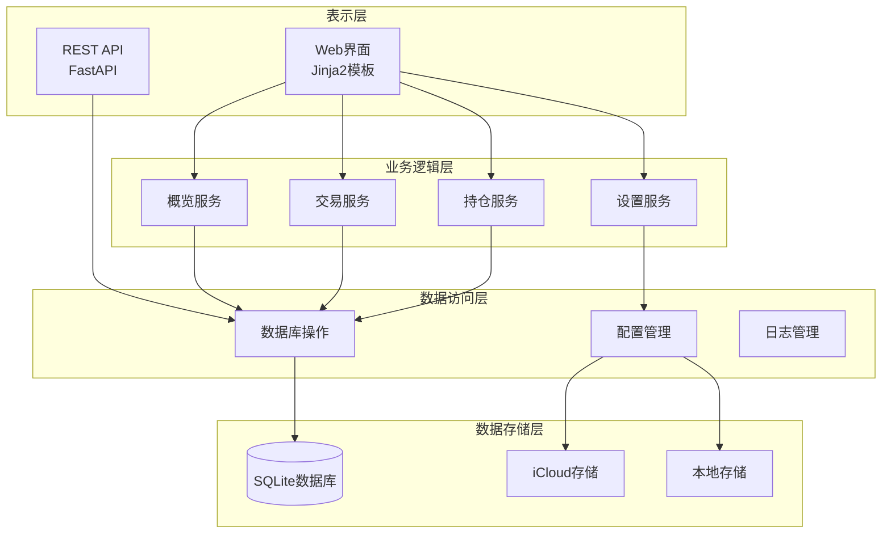
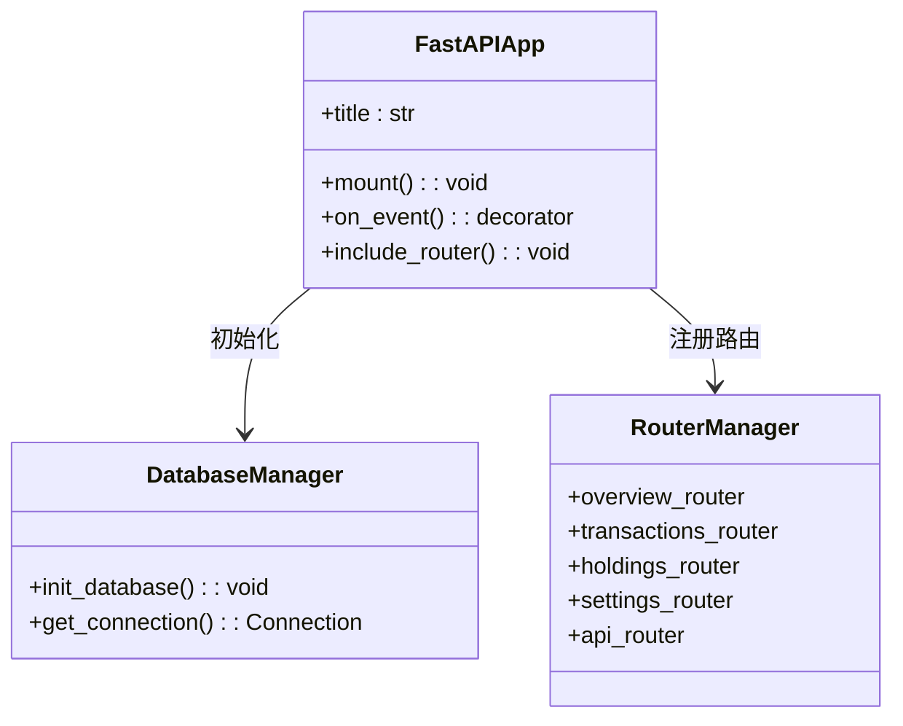
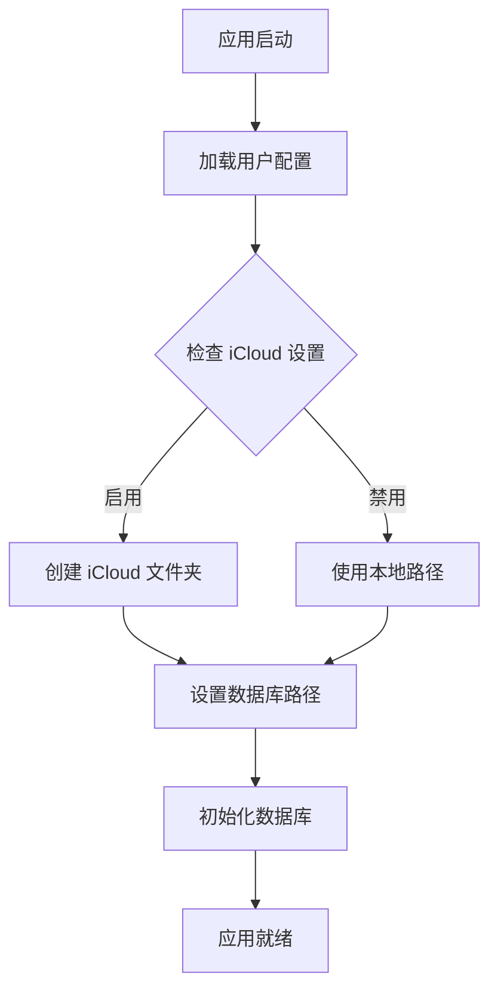
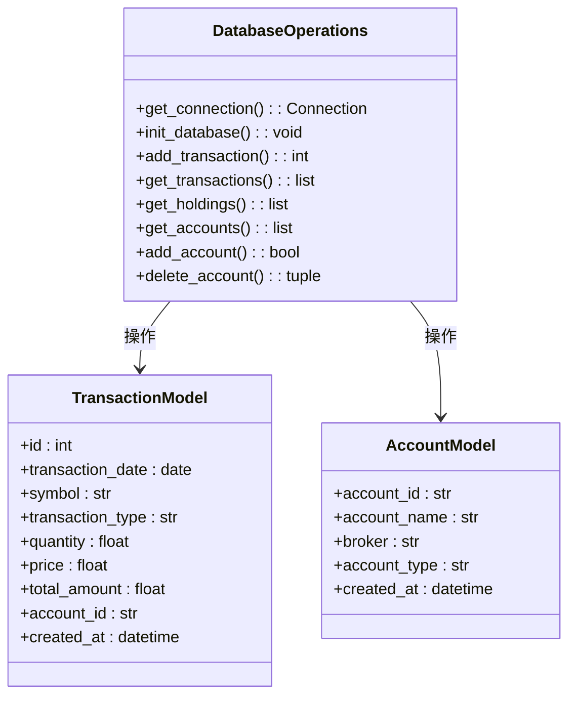
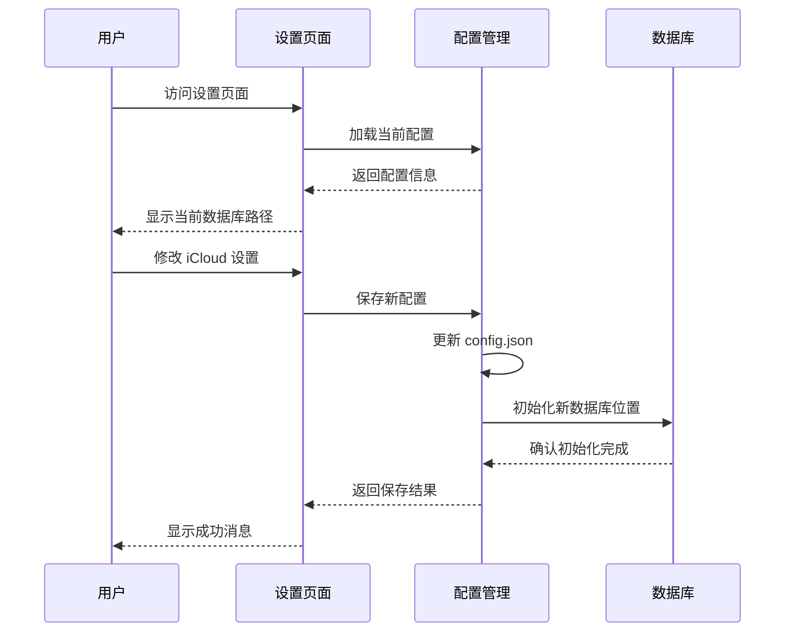
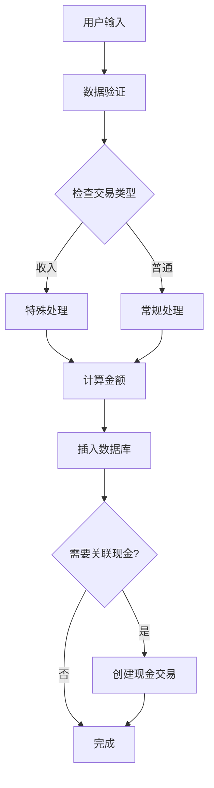
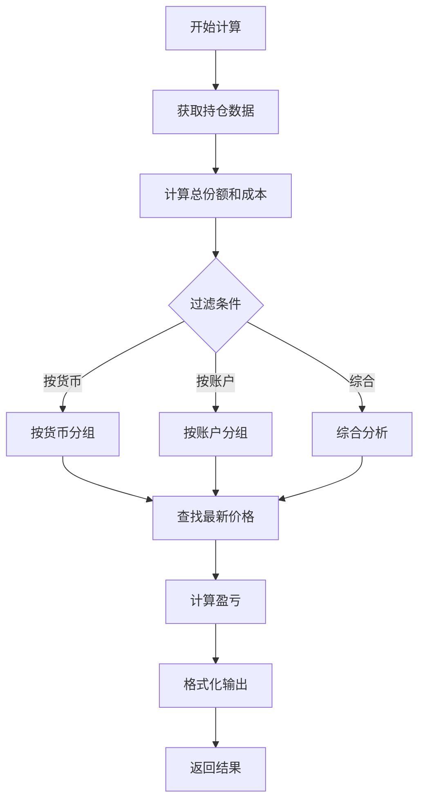

# 隐私模式功能

<cite>
**本文档引用的文件**
- [app.py](file://app.py)
- [config.py](file://config.py)
- [database.py](file://database.py)
- [routers/api.py](file://routers/api.py)
- [routers/settings.py](file://routers/settings.py)
- [routers/utils.py](file://routers/utils.py)
- [templates/settings.html](file://templates/settings.html)
- [templates/base.html](file://templates/base.html)
- [logger_config.py](file://logger_config.py)
- [requirements.txt](file://requirements.txt)
</cite>

## 目录
1. [简介](#简介)
2. [项目结构](#项目结构)
3. [核心组件](#核心组件)
4. [架构概览](#架构概览)
5. [详细组件分析](#详细组件分析)
6. [隐私模式实现](#隐私模式实现)
7. [数据流分析](#数据流分析)
8. [性能考虑](#性能考虑)
9. [故障排除指南](#故障排除指南)
10. [结论](#结论)

## 简介

Invest Log 是一个基于 FastAPI 的投资交易日志管理系统，提供了强大的隐私保护功能。该项目的核心隐私模式功能主要通过 iCloud 同步机制实现，确保用户的投资数据可以在多设备间安全同步，同时保持本地存储的私密性。

该系统支持多种隐私保护措施：
- 数据库文件的本地或云端存储选择
- 多设备同步能力
- 日志记录和审计跟踪
- 配置文件的安全管理

## 项目结构

项目采用模块化设计，按照功能层次组织代码：

```mermaid
graph TB
subgraph "应用层"
APP[app.py<br/>主应用入口]
ROUTERS[routers/<br/>路由模块]
TEMPLATES[templates/<br/>模板文件]
STATIC[static/<br/>静态资源]
end
subgraph "配置层"
CONFIG[config.py<br/>应用配置]
LOGGER[logger_config.py<br/>日志配置]
end
subgraph "数据层"
DATABASE[database.py<br/>数据库操作]
SQLITE[(SQLite)<br/>数据存储]
end
subgraph "业务逻辑层"
API[routers/api.py<br/>API接口]
SETTINGS[routers/settings.py<br/>设置管理]
UTILS[routers/utils.py<br/>工具函数]
end
APP --> ROUTERS
ROUTERS --> DATABASE
CONFIG --> DATABASE
DATABASE --> SQLITE
ROUTERS --> TEMPLATES
ROUTERS --> UTILS
```

**图表来源**
- [app.py](file://app.py#L1-L34)
- [config.py](file://config.py#L1-L55)
- [database.py](file://database.py#L1-L800)

**章节来源**
- [app.py](file://app.py#L1-L34)
- [config.py](file://config.py#L1-L55)

## 核心组件

### 应用入口组件
应用入口负责初始化 FastAPI 应用程序、静态文件服务和数据库连接。

### 配置管理组件
配置管理模块提供集中化的配置管理，包括 iCloud 同步路径、数据库路径等。

### 数据库操作组件
数据库操作模块封装了所有 SQLite 数据库操作，包括事务记录、持仓计算、账户管理等。

### 路由处理组件
路由处理模块包含多个子路由，分别处理不同的业务功能：概览、交易、持仓、设置等。

**章节来源**
- [app.py](file://app.py#L7-L34)
- [config.py](file://config.py#L21-L55)
- [database.py](file://database.py#L15-L196)

## 架构概览

系统采用分层架构设计，确保关注点分离和模块化：



**图表来源**
- [app.py](file://app.py#L13-L29)
- [config.py](file://config.py#L44-L54)
- [database.py](file://database.py#L22-L196)

## 详细组件分析

### 应用入口组件分析

应用入口组件负责应用程序的整体初始化和路由注册：



**图表来源**
- [app.py](file://app.py#L7-L29)
- [database.py](file://database.py#L22-L23)

### 配置管理组件分析

配置管理模块提供了灵活的配置选项，特别是 iCloud 同步功能：



**图表来源**
- [config.py](file://config.py#L21-L54)

### 数据库操作组件分析

数据库操作模块实现了完整的 CRUD 操作和复杂的数据查询：



**图表来源**
- [database.py](file://database.py#L15-L800)

**章节来源**
- [app.py](file://app.py#L19-L22)
- [config.py](file://config.py#L44-L54)
- [database.py](file://database.py#L22-L196)

## 隐私模式实现

### iCloud 同步机制

隐私模式的核心是 iCloud 同步功能，它提供了以下安全特性：

#### 配置管理
- 用户可以通过设置页面启用或禁用 iCloud 同步
- 支持自定义数据库文件名
- 自动创建 iCloud 应用专用文件夹

#### 数据存储策略
- 默认启用 iCloud 同步，确保数据备份和多设备同步
- 支持本地存储作为备选方案
- 环境变量可覆盖默认配置

#### 安全考虑
- iCloud 存储提供自动加密和备份
- 本地存储适合高度敏感数据
- 配置文件独立于数据文件存储

### 设置页面隐私控制

设置页面提供了全面的隐私控制选项：



**图表来源**
- [routers/settings.py](file://routers/settings.py#L91-L118)
- [config.py](file://config.py#L36-L40)

### 日志记录与审计

系统实现了完善的日志记录机制，支持隐私审计：

#### 日志配置
- 每日轮转日志文件
- 保留7天的日志历史
- 控制台和文件双重输出
- 结构化日志格式

#### 审计跟踪
- 所有重要操作都有日志记录
- 包含时间戳、操作类型、用户信息
- 支持问题诊断和安全审计

**章节来源**
- [routers/settings.py](file://routers/settings.py#L91-L118)
- [logger_config.py](file://logger_config.py#L14-L54)

## 数据流分析

### 交易数据流程



**图表来源**
- [database.py](file://database.py#L202-L269)

### 持仓计算流程

系统提供了多种持仓计算方式，满足不同隐私需求：



**图表来源**
- [database.py](file://database.py#L388-L532)

**章节来源**
- [database.py](file://database.py#L202-L269)
- [database.py](file://database.py#L388-L532)

## 性能考虑

### 数据库优化
- 创建多个索引以加速查询
- 使用参数化查询防止 SQL 注入
- 连接池管理减少连接开销
- 批量操作优化

### 内存管理
- 及时关闭数据库连接
- 避免内存泄漏
- 合理的数据结构选择
- 异步操作支持高并发

### 网络优化
- API 响应缓存
- 分页查询避免大数据传输
- 增量更新机制
- 错误重试策略

## 故障排除指南

### 常见问题及解决方案

#### iCloud 同步问题
- **症状**: iCloud 同步失败
- **原因**: 权限不足或网络问题
- **解决**: 检查 iCloud 权限设置，确认网络连接

#### 数据库连接问题
- **症状**: 应用无法启动
- **原因**: 数据库文件损坏或权限问题
- **解决**: 删除损坏的数据库文件重新初始化

#### 配置加载错误
- **症状**: 设置页面显示异常
- **原因**: config.json 格式错误
- **解决**: 恢复默认配置或手动修复 JSON 格式

### 调试技巧
- 查看应用日志文件
- 使用浏览器开发者工具
- 检查数据库完整性
- 验证文件权限设置

**章节来源**
- [logger_config.py](file://logger_config.py#L14-L54)
- [config.py](file://config.py#L21-L34)

## 结论

Invest Log 的隐私模式功能通过多层次的设计实现了数据安全和便利性的平衡。主要特点包括：

### 核心优势
- **灵活的存储策略**: 支持本地和云端存储选择
- **完整的同步机制**: 确保多设备数据一致性
- **完善的审计功能**: 提供详细的操作日志
- **用户友好的界面**: 简单易用的隐私设置管理

### 技术特色
- 基于 FastAPI 的高性能 Web 框架
- SQLite 数据库的轻量级存储
- Jinja2 模板引擎的动态界面
- 模块化的代码结构便于维护

### 应用场景
- 个人投资组合管理
- 多设备数据同步
- 跨平台投资记录
- 专业财务审计

该系统为用户提供了可靠的隐私保护解决方案，既保证了数据的安全性，又保持了良好的用户体验。