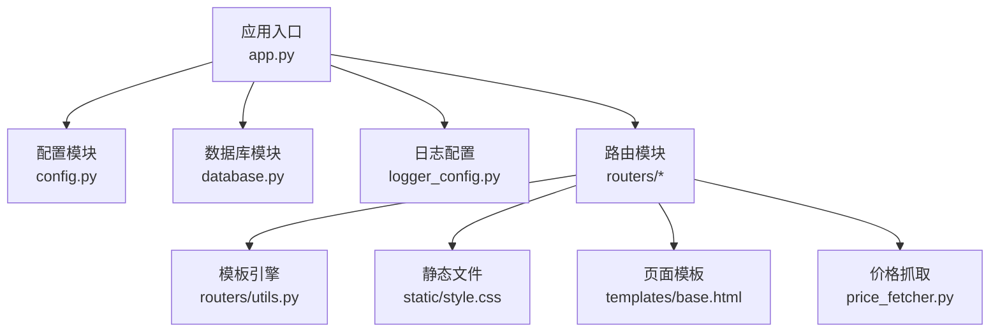
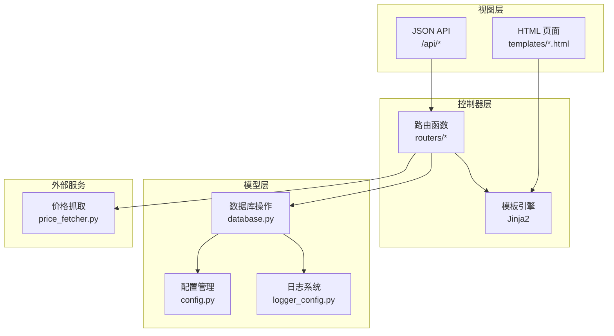
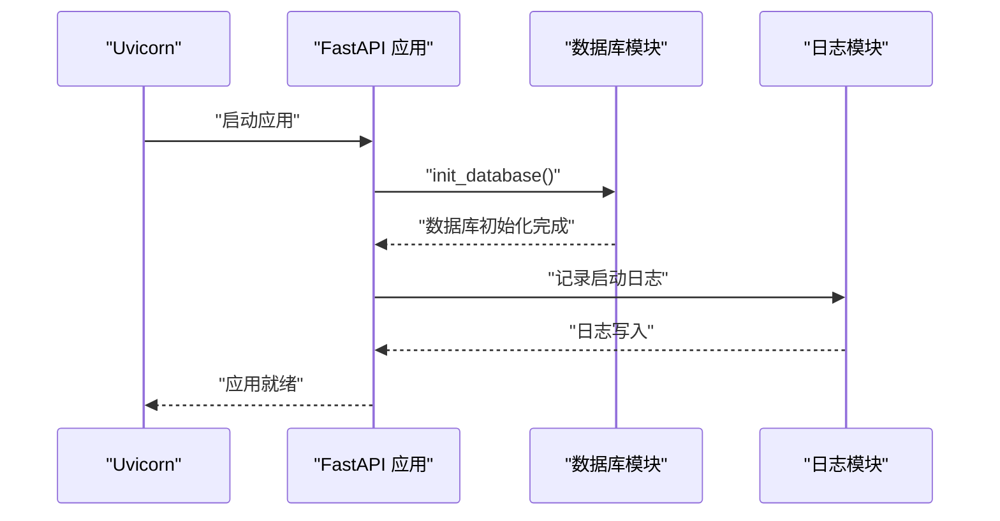
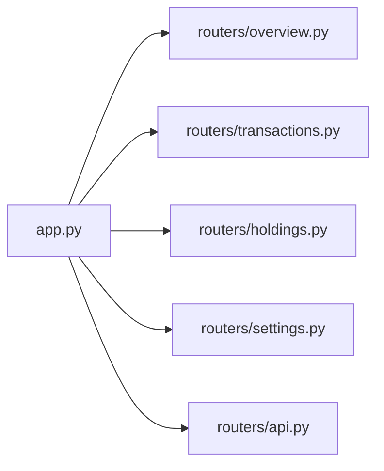
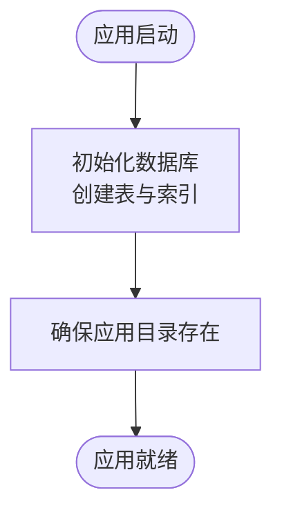
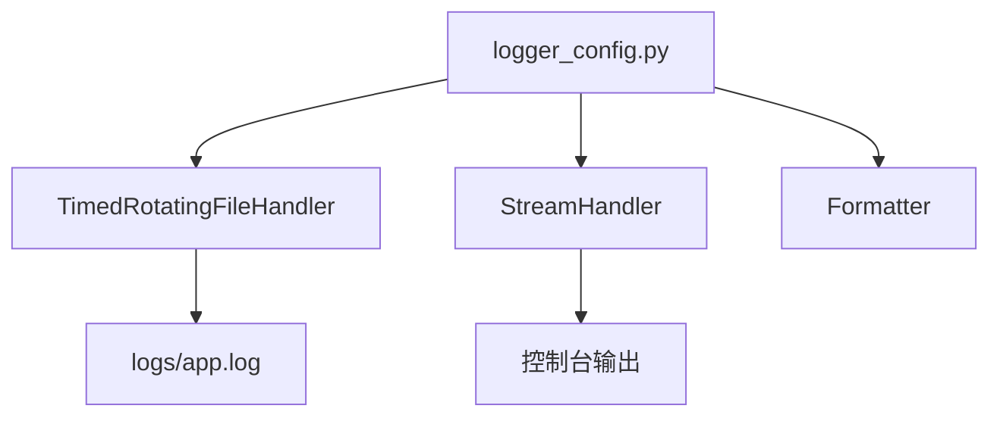
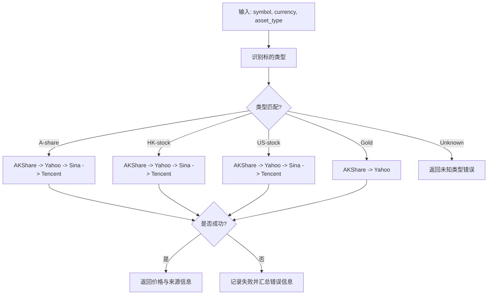
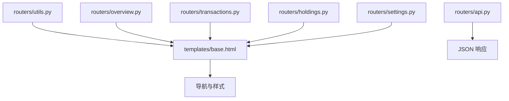
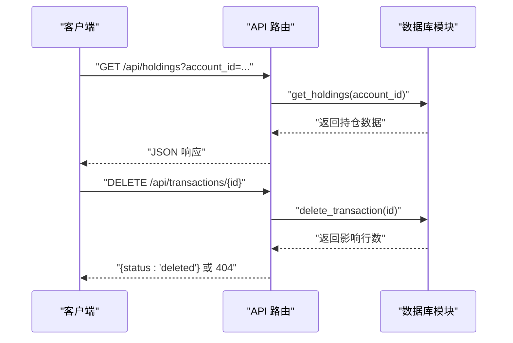
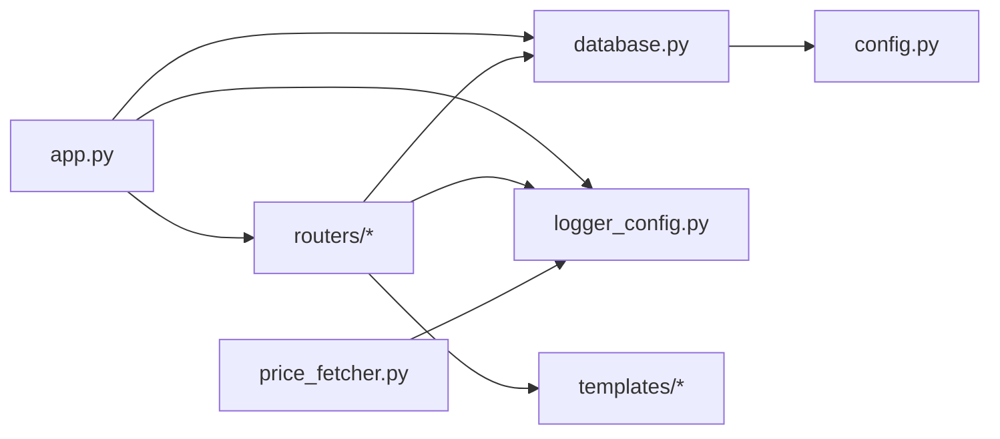

# 应用架构设计

<cite>
**本文档引用的文件**
- [app.py](file://app.py)
- [config.py](file://config.py)
- [database.py](file://database.py)
- [logger_config.py](file://logger_config.py)
- [price_fetcher.py](file://price_fetcher.py)
- [routers/api.py](file://routers/api.py)
- [routers/holdings.py](file://routers/holdings.py)
- [routers/overview.py](file://routers/overview.py)
- [routers/settings.py](file://routers/settings.py)
- [routers/transactions.py](file://routers/transactions.py)
- [routers/utils.py](file://routers/utils.py)
- [requirements.txt](file://requirements.txt)
- [templates/base.html](file://templates/base.html)
</cite>

## 目录
1. [引言](#引言)
2. [项目结构](#项目结构)
3. [核心组件](#核心组件)
4. [架构总览](#架构总览)
5. [详细组件分析](#详细组件分析)
6. [依赖关系分析](#依赖关系分析)
7. [性能考量](#性能考量)
8. [故障排查指南](#故障排查指南)
9. [结论](#结论)
10. [附录](#附录)

## 引言
本文件为“投资日志管理系统”的应用架构设计文档，围绕基于 FastAPI 的 MVC 架构模式展开，系统采用 Python 实现，结合 SQLite 数据库存储、Jinja2 模板渲染与多数据源价格抓取能力，提供交易记录、持仓管理、图表分析与设置维护等核心功能。本文重点阐述：
- 应用实例创建、静态文件挂载与启动事件处理机制
- 路由注册流程、中间件配置与全局异常处理策略
- 应用生命周期管理：启动时数据库初始化与优雅关闭处理
- 日志系统集成、配置管理与错误处理机制
- 可扩展性设计原则、性能优化策略与安全考虑
- 面向开发者的架构决策背景与最佳实践指导

## 项目结构
项目采用按功能模块划分的目录组织方式，核心文件与目录如下：
- 应用入口与配置：app.py、config.py
- 数据层：database.py（SQLite 操作与业务查询）
- 日志：logger_config.py
- 价格抓取：price_fetcher.py
- 路由层：routers/*（overview、transactions、holdings、settings、api）
- 模板与静态资源：templates/*、static/style.css
- 依赖声明：requirements.txt

**图表来源**
- [app.py](file://app.py#L1-L34)
- [config.py](file://config.py#L1-L24)
- [database.py](file://database.py#L1-L151)
- [logger_config.py](file://logger_config.py#L1-L54)
- [routers/utils.py](file://routers/utils.py#L1-L4)

**章节来源**
- [app.py](file://app.py#L1-L34)
- [config.py](file://config.py#L1-L24)
- [requirements.txt](file://requirements.txt#L1-L6)

## 核心组件
- 应用实例与生命周期
  - 应用实例创建：通过 FastAPI 创建应用实例，并设置标题
  - 静态文件挂载：将 static 目录挂载到 /static 路径
  - 启动事件：在应用启动时执行数据库初始化
  - 主机运行：本地开发使用 uvicorn 运行在 127.0.0.1:8000
- 路由注册：统一在 app.py 中 include_router 注册各模块路由
- 模板与静态资源：Jinja2 模板引擎加载 templates 目录，base.html 提供导航与样式链接
- 数据层：database.py 封装 SQLite 连接、表结构初始化、CRUD 与聚合查询
- 日志：logger_config.py 提供每日轮转的日志记录器
- 价格抓取：price_fetcher.py 支持多数据源回退的价格获取逻辑

**章节来源**
- [app.py](file://app.py#L13-L33)
- [routers/utils.py](file://routers/utils.py#L1-L4)
- [templates/base.html](file://templates/base.html#L1-L27)
- [database.py](file://database.py#L22-L151)
- [logger_config.py](file://logger_config.py#L14-L53)
- [price_fetcher.py](file://price_fetcher.py#L325-L402)

## 架构总览
系统采用典型的 MVC 分层架构：
- 视图层：FastAPI 路由返回 HTML（Jinja2 渲染）或 JSON（API 路由）
- 控制器层：路由函数负责参数解析、调用数据库与价格抓取模块、返回响应
- 模型层：database.py 提供数据访问对象与业务查询方法
- 外部服务：price_fetcher.py 提供多数据源价格抓取与回退策略

**图表来源**
- [app.py](file://app.py#L13-L29)
- [routers/overview.py](file://routers/overview.py#L8-L27)
- [routers/transactions.py](file://routers/transactions.py#L10-L74)
- [routers/holdings.py](file://routers/holdings.py#L13-L206)
- [routers/settings.py](file://routers/settings.py#L11-L147)
- [routers/api.py](file://routers/api.py#L8-L66)
- [database.py](file://database.py#L15-L151)
- [config.py](file://config.py#L17-L23)
- [logger_config.py](file://logger_config.py#L14-L53)
- [price_fetcher.py](file://price_fetcher.py#L325-L402)

## 详细组件分析

### 应用实例与生命周期
- 应用实例创建：在 app.py 中创建 FastAPI 实例并设置标题
- 静态文件挂载：将 static 目录挂载到 /static，便于前端样式加载
- 启动事件：on_event("startup") 中调用数据库初始化，确保应用启动时具备可用的数据表结构
- 主机运行：本地开发直接通过 uvicorn 在 127.0.0.1:8000 启动

**图表来源**
- [app.py](file://app.py#L18-L22)
- [database.py](file://database.py#L22-L151)
- [logger_config.py](file://logger_config.py#L52-L53)

**章节来源**
- [app.py](file://app.py#L13-L33)

### 路由注册与中间件
- 路由注册：在 app.py 中 include_router 统一注册 overview、transactions、holdings、settings、api 路由
- 中间件：当前仓库未显式定义自定义中间件；如需全局异常处理可在应用层添加中间件或异常处理器
- 全局异常处理：建议在应用层添加异常处理器，捕获 HTTPException 与通用异常，返回统一格式的错误响应

**图表来源**
- [app.py](file://app.py#L24-L29)
- [routers/overview.py](file://routers/overview.py#L6)
- [routers/transactions.py](file://routers/transactions.py#L8)
- [routers/holdings.py](file://routers/holdings.py#L11)
- [routers/settings.py](file://routers/settings.py#L9)
- [routers/api.py](file://routers/api.py#L6)

**章节来源**
- [app.py](file://app.py#L24-L29)

### 数据库与配置管理
- 数据库初始化：init_database 在首次启动时创建事务、账户、符号、分配设置、资产类型、操作日志、最新价格等表，并建立索引
- 连接管理：get_connection 返回启用 row_factory 的连接，便于字典化查询结果
- 配置管理：config.py 定义 iCloud 基础路径与应用目录，DB_PATH 默认位于 iCloud，可通过环境变量覆盖

**图表来源**
- [database.py](file://database.py#L22-L151)
- [config.py](file://config.py#L10-L23)

**章节来源**
- [database.py](file://database.py#L15-L151)
- [config.py](file://config.py#L17-L23)

### 日志系统集成
- 日志配置：logger_config.py 提供每日轮转的文件处理器与控制台处理器，保留最近 7 天日志
- 使用方式：各模块通过 logger 记录信息、警告与调试信息，便于问题追踪与审计

**图表来源**
- [logger_config.py](file://logger_config.py#L14-L53)

**章节来源**
- [logger_config.py](file://logger_config.py#L14-L53)

### 价格抓取与多数据源回退
- 价格抓取：price_fetcher.py 支持 A 股、港股、美股、黄金等多类型标的，优先使用 AKShare，其次 Yahoo Finance，再回退至新浪/腾讯接口
- 符号识别：detect_symbol_type 根据符号格式与币种判断标的类型
- 错误处理：对每个数据源调用进行异常捕获与日志记录，最终汇总失败原因

**图表来源**
- [price_fetcher.py](file://price_fetcher.py#L325-L402)
- [price_fetcher.py](file://price_fetcher.py#L36-L66)

**章节来源**
- [price_fetcher.py](file://price_fetcher.py#L325-L402)

### 页面与模板渲染
- 模板引擎：routers/utils.py 使用 Jinja2Templates 加载 templates 目录
- 导航与样式：templates/base.html 提供导航栏与静态样式链接
- 页面路由：overview、transactions、holdings、settings、api 各自定义页面与 API 端点

**图表来源**
- [routers/utils.py](file://routers/utils.py#L1-L4)
- [templates/base.html](file://templates/base.html#L1-L27)
- [routers/overview.py](file://routers/overview.py#L8-L27)
- [routers/transactions.py](file://routers/transactions.py#L10-L74)
- [routers/holdings.py](file://routers/holdings.py#L13-L206)
- [routers/settings.py](file://routers/settings.py#L11-L147)
- [routers/api.py](file://routers/api.py#L8-L66)

**章节来源**
- [routers/utils.py](file://routers/utils.py#L1-L4)
- [templates/base.html](file://templates/base.html#L1-L27)

### API 路由与业务流程
- API 路由：/api/holdings、/api/holdings-by-currency、/api/transactions、/api/portfolio-history、/api/transactions/{id}
- 业务流程：API 路由函数调用 database.py 的查询与删除方法，返回 JSON 结果；删除失败时抛出 HTTPException

**图表来源**
- [routers/api.py](file://routers/api.py#L8-L66)
- [database.py](file://database.py#L279-L287)

**章节来源**
- [routers/api.py](file://routers/api.py#L8-L66)

## 依赖关系分析
- 应用层依赖：app.py 依赖 database、logger_config、routers 子模块
- 路由层依赖：各路由模块依赖 database、logger_config、Jinja2 模板
- 数据层依赖：database.py 依赖 config.py（DB_PATH）、sqlite3
- 价格抓取依赖：price_fetcher.py 依赖 logger_config、第三方库（可选）

**图表来源**
- [app.py](file://app.py#L7-L11)
- [routers/holdings.py](file://routers/holdings.py#L6-L8)
- [database.py](file://database.py#L12)
- [logger_config.py](file://logger_config.py#L20)
- [price_fetcher.py](file://price_fetcher.py#L20)

**章节来源**
- [app.py](file://app.py#L7-L11)
- [database.py](file://database.py#L12)
- [logger_config.py](file://logger_config.py#L20)
- [price_fetcher.py](file://price_fetcher.py#L20)

## 性能考量
- 数据库索引：已在 transactions 表上建立 symbol、date、account、type、currency、asset_type 等索引，有助于查询性能
- 查询优化：分页查询（transactions 列表页每页 100 条），避免一次性加载大量数据
- 日志轮转：每日轮转并保留 7 天日志，避免日志文件过大
- 价格抓取：多数据源回退策略减少单点故障风险，但会增加网络请求次数，建议在批量更新时合并请求或引入缓存

[本节为通用性能建议，无需特定文件来源]

## 故障排查指南
- 启动失败：检查数据库初始化是否成功，确认 DB_PATH 是否可写
- 页面空白：检查 templates 目录是否存在，Jinja2 模板是否正确加载
- 价格抓取失败：查看日志中 price_fetcher 的错误信息，确认第三方库是否安装
- 删除交易失败：API 路由会在找不到记录时返回 404，检查 transaction_id 是否正确

**章节来源**
- [database.py](file://database.py#L279-L287)
- [logger_config.py](file://logger_config.py#L52-L53)
- [price_fetcher.py](file://price_fetcher.py#L398-L401)

## 结论
本系统以 FastAPI 为核心，结合 SQLite 数据存储、Jinja2 模板渲染与多数据源价格抓取，构建了清晰的 MVC 架构。通过应用启动事件完成数据库初始化，路由层统一注册各功能模块，日志系统提供运行期可观测性。未来可在中间件层增强全局异常处理、引入缓存与异步任务提升性能，并完善安全策略（如 CSRF、速率限制）以满足生产环境需求。

[本节为总结性内容，无需特定文件来源]

## 附录

### 可扩展性设计原则
- 分层解耦：保持视图、控制器、模型三层职责清晰，新增功能尽量在现有层内扩展
- 配置集中化：DB_PATH 与日志路径集中管理，便于部署切换
- 插件化扩展：价格抓取模块可按需扩展新数据源，不影响主流程

### 安全考虑
- 输入校验：路由层对表单参数进行类型转换与默认值处理，建议进一步增加字段长度与格式校验
- 路由权限：当前未实现认证授权，建议在中间件层增加登录态校验
- SQL 注入防护：使用参数化查询，避免字符串拼接

### 最佳实践
- 错误处理：在应用层统一捕获异常，返回标准化错误响应
- 日志规范：区分 INFO/WARNING/ERROR 级别，避免敏感信息泄露
- 性能监控：引入指标收集与慢查询日志，定期评估数据库索引与查询计划

[本节为通用指导，无需特定文件来源]