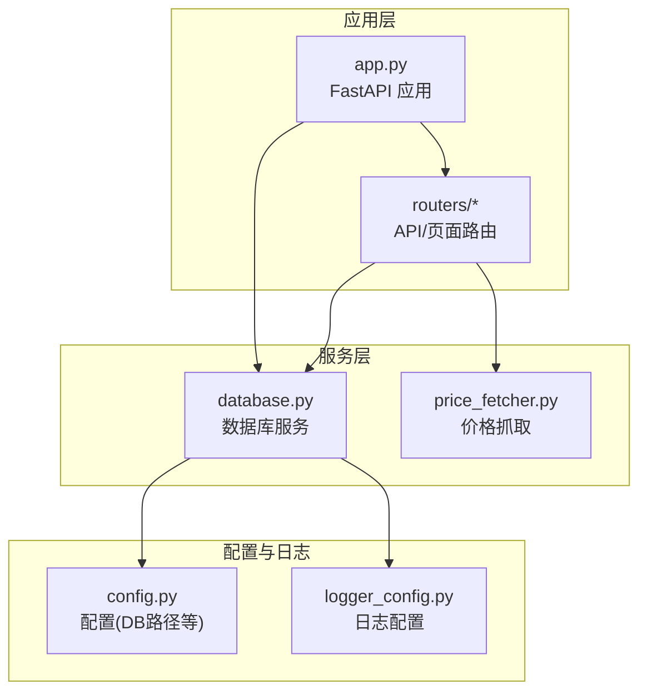
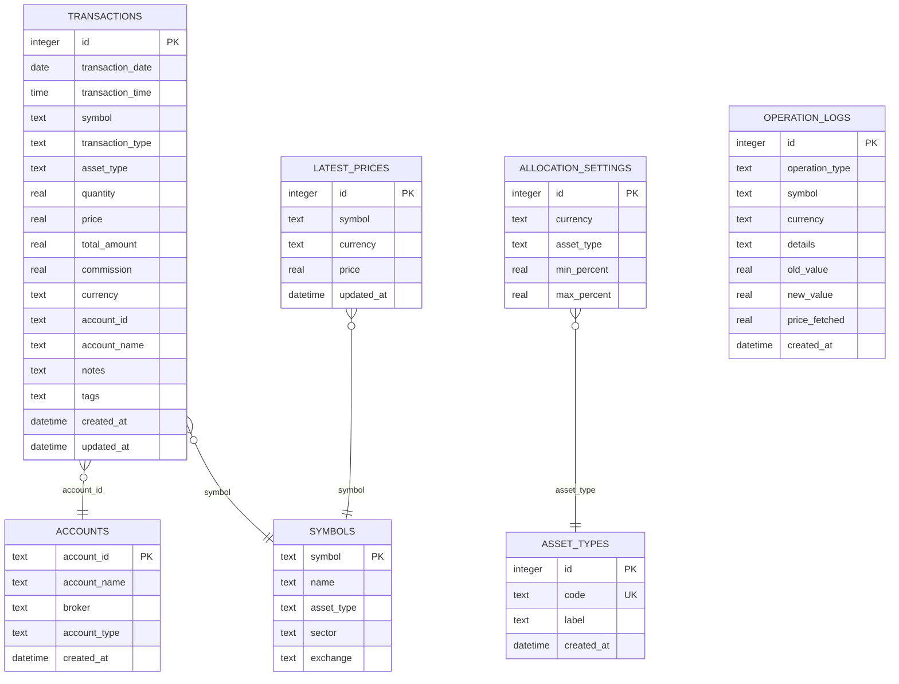
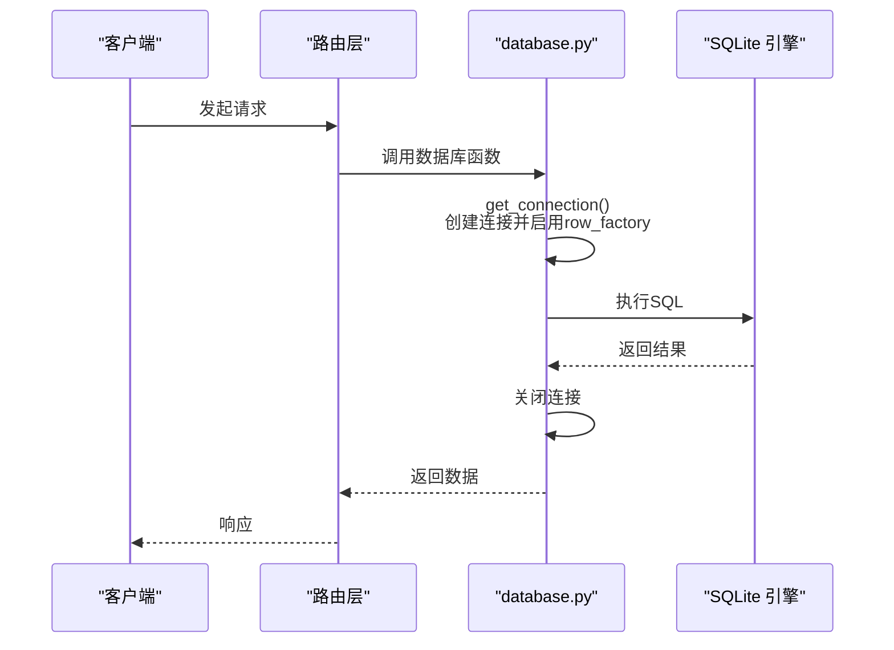
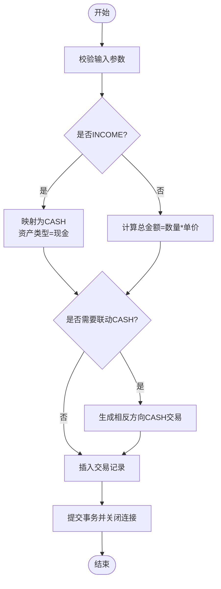
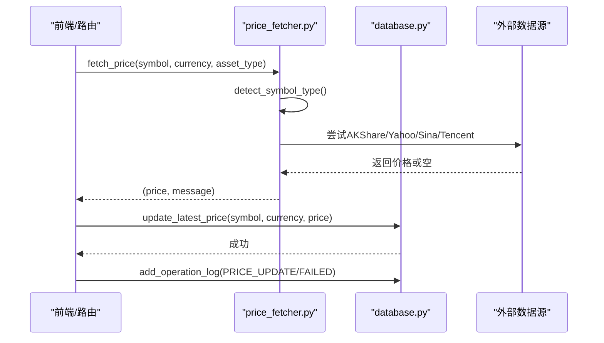
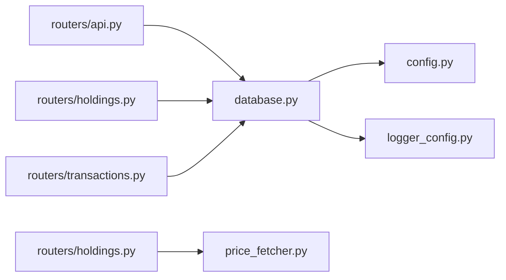
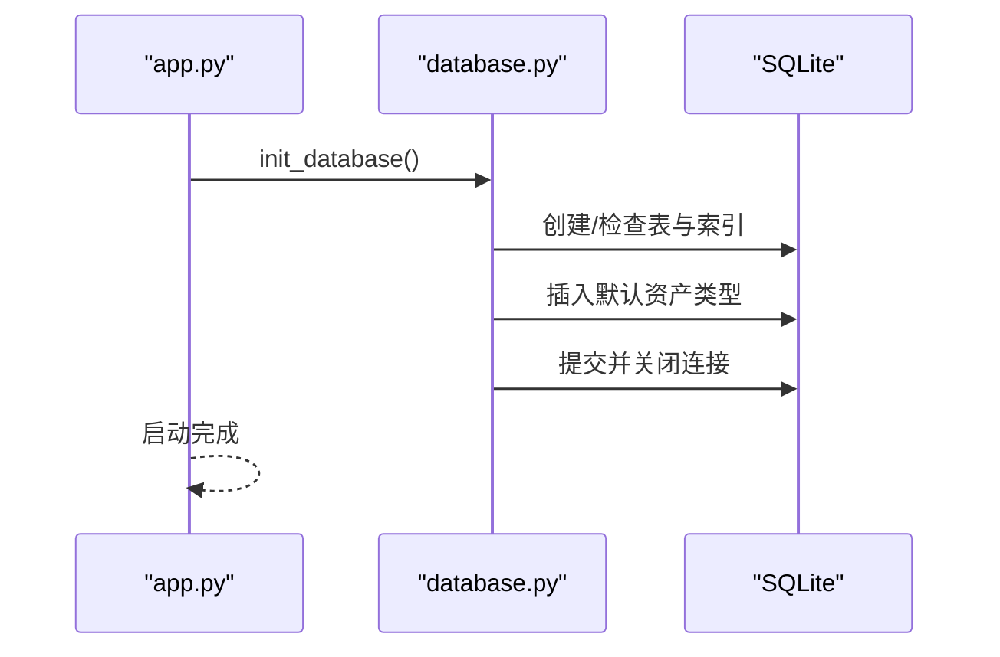
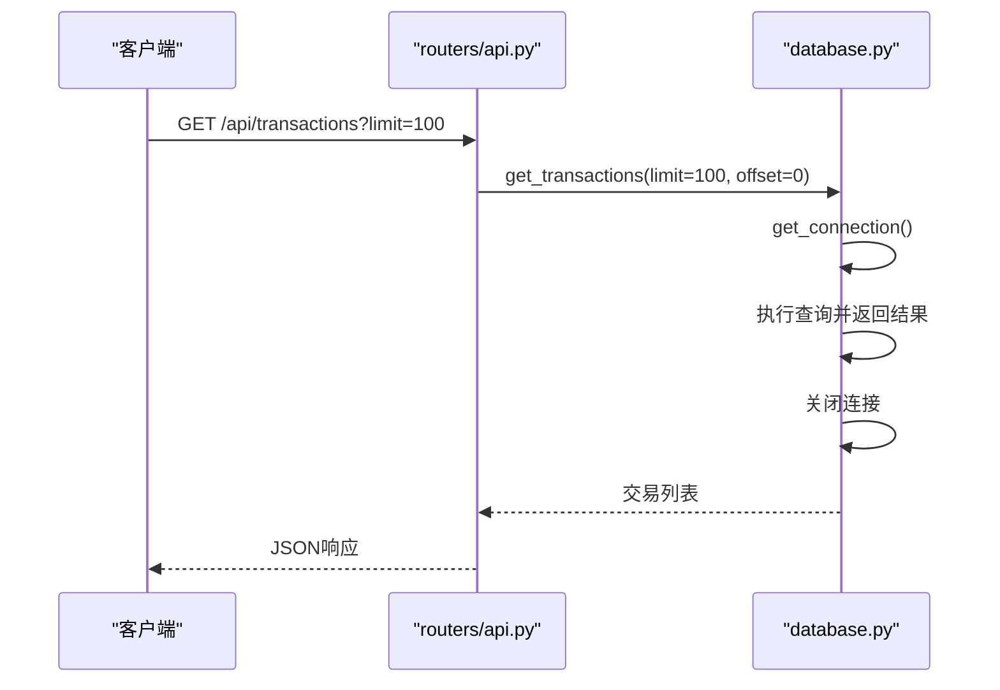

# 数据库层设计

<cite>
**本文引用的文件**
- [database.py](file://database.py)
- [app.py](file://app.py)
- [config.py](file://config.py)
- [routers/api.py](file://routers/api.py)
- [routers/holdings.py](file://routers/holdings.py)
- [routers/transactions.py](file://routers/transactions.py)
- [price_fetcher.py](file://price_fetcher.py)
- [logger_config.py](file://logger_config.py)
</cite>

## 目录
1. [简介](#简介)
2. [项目结构](#项目结构)
3. [核心组件](#核心组件)
4. [架构总览](#架构总览)
5. [详细组件分析](#详细组件分析)
6. [依赖分析](#依赖分析)
7. [性能考量](#性能考量)
8. [故障排查指南](#故障排查指南)
9. [结论](#结论)
10. [附录](#附录)

## 简介
本设计文档聚焦于投资日志管理系统的数据库层，涵盖SQLite连接管理、会话生命周期与事务处理策略；数据模型（交易、账户、符号、最新价格、资产类型、分配设置、操作日志）的设计与约束；数据库初始化流程、表结构创建与索引策略；CRUD与查询实现、查询优化与数据完整性；数据库架构图与实体关系图；数据访问模式、缓存策略与性能考虑；数据迁移机制、版本管理与备份恢复策略；以及面向开发者的数据库设计决策背景与维护指导。

## 项目结构
该系统采用“模块化+路由”组织方式：
- 应用入口负责启动时初始化数据库，并挂载各功能路由。
- 数据库层集中于单一模块，提供连接、初始化、CRUD、查询与统计分析等能力。
- 路由层通过FastAPI接口调用数据库模块，完成业务逻辑。
- 价格抓取模块独立于数据库，但通过数据库写入最新价格与操作日志。

图表来源
- [app.py](file://app.py#L13-L29)
- [database.py](file://database.py#L15-L151)
- [routers/api.py](file://routers/api.py#L1-L67)
- [routers/holdings.py](file://routers/holdings.py#L1-L207)
- [routers/transactions.py](file://routers/transactions.py#L1-L75)
- [price_fetcher.py](file://price_fetcher.py#L1-L405)
- [config.py](file://config.py#L17-L24)
- [logger_config.py](file://logger_config.py#L14-L54)

章节来源
- [app.py](file://app.py#L13-L29)
- [config.py](file://config.py#L17-L24)

## 核心组件
- 连接管理：统一的连接工厂函数返回启用行工厂的SQLite连接，便于字典式访问。
- 初始化器：在应用启动时创建所有表、默认资产类型、索引与唯一约束。
- 交易管理：增删改查、金额计算、现金联动交易生成。
- 查询与统计：按条件过滤、分页、汇总、收益计算、分配比例与预警。
- 账户与资产类型：账户CRUD、资产类型管理与校验。
- 最新价格：多源价格抓取后写入latest_prices表，支持唯一键冲突更新。
- 操作日志：记录价格更新、失败与手动更新等操作，便于审计与排错。
- 配置与日志：数据库路径位于iCloud，便于跨设备同步；日志按天轮转保留7天。

章节来源
- [database.py](file://database.py#L15-L151)
- [database.py](file://database.py#L158-L225)
- [database.py](file://database.py#L294-L341)
- [database.py](file://database.py#L344-L390)
- [database.py](file://database.py#L393-L463)
- [database.py](file://database.py#L838-L883)
- [database.py](file://database.py#L890-L960)
- [config.py](file://config.py#L17-L24)
- [logger_config.py](file://logger_config.py#L14-L54)

## 架构总览
数据库层围绕transactions主表展开，通过外键关联accounts与symbols，同时维护latest_prices用于实时估值，allocation_settings与asset_types支撑资产配置与类型管理。路由层通过API/页面调用数据库模块，价格抓取模块与数据库交互以更新最新价格与操作日志。

图表来源
- [database.py](file://database.py#L28-L140)
- [database.py](file://database.py#L838-L883)
- [database.py](file://database.py#L890-L960)

## 详细组件分析

### 连接管理与会话生命周期
- 连接工厂：每次数据库操作前创建连接，使用row_factory返回字典式结果，便于直接读取列名。
- 生命周期：每个操作在执行后立即关闭连接，避免长连接占用资源。
- 事务策略：当前实现未显式开启事务块，所有写操作在单条语句内提交；对于批量或复杂流程可考虑显式BEGIN/COMMIT以提升一致性与性能。

图表来源
- [database.py](file://database.py#L15-L19)
- [database.py](file://database.py#L183-L200)

章节来源
- [database.py](file://database.py#L15-L19)
- [database.py](file://database.py#L183-L200)

### 数据库初始化与表结构
- 初始化流程：应用启动时调用初始化函数，确保表、索引与默认数据存在。
- 表与约束：
  - transactions：主键自增、字段齐全、CHECK约束限制枚举值、时间戳字段、多字段索引。
  - accounts：主键account_id，唯一性保障。
  - symbols：主键symbol，扩展字段支持名称、类型、板块、交易所。
  - latest_prices：唯一键(symbol,currency)，记录最新价格与更新时间。
  - asset_types：默认内置股票/债券/贵金属/现金四类，支持动态扩展。
  - allocation_settings：唯一键(currency,asset_type)，存储配置区间。
  - operation_logs：记录操作类型、符号、货币、详情与价格抓取结果。
- 兼容性：对旧表新增列时使用异常捕获避免重复添加。

章节来源
- [app.py](file://app.py#L18-L22)
- [database.py](file://database.py#L22-L151)
- [database.py](file://database.py#L101-L113)

### 交易CRUD与业务规则
- 新增交易：自动计算总金额，支持INCOME类型映射为CASH，cash联动逻辑根据买卖方向生成相反方向的CASH交易。
- 更新交易：允许选择性字段更新，若数量或价格变更则重算总金额，统一更新时间戳。
- 删除交易：按ID删除。
- 查询：支持按symbol/account_id/type/currency/year/date范围过滤，分页排序。
- 统计：持有量汇总、按货币与资产类型分组、百分比与未实现损益计算、已实现收益查询、股息查询。

图表来源
- [database.py](file://database.py#L177-L225)
- [database.py](file://database.py#L238-L276)

章节来源
- [database.py](file://database.py#L158-L225)
- [database.py](file://database.py#L238-L287)
- [database.py](file://database.py#L294-L341)
- [database.py](file://database.py#L515-L558)
- [database.py](file://database.py#L561-L593)

### 账户与资产类型管理
- 账户CRUD：新增账户时捕获唯一性错误；删除前检查是否存在交易引用。
- 资产类型：提供查询、标签映射、新增、删除（需无引用）与使用状态检查。
- 分配设置：按货币与资产类型设置上下限，支持更新与删除。

章节来源
- [database.py](file://database.py#L600-L658)
- [database.py](file://database.py#L890-L960)
- [database.py](file://database.py#L674-L730)

### 最新价格与价格抓取
- 价格抓取：多源回退策略，优先AKShare，其次Yahoo Finance，再Sina/Tencent，支持A股/HK/美股/黄金/债券/现金等类型识别。
- 写入策略：latest_prices表使用唯一键冲突更新，保证幂等性与一致性。
- 日志记录：每次价格更新/失败均写入operation_logs，便于审计与问题定位。

图表来源
- [price_fetcher.py](file://price_fetcher.py#L325-L401)
- [database.py](file://database.py#L838-L883)
- [routers/holdings.py](file://routers/holdings.py#L102-L147)

章节来源
- [price_fetcher.py](file://price_fetcher.py#L36-L66)
- [price_fetcher.py](file://price_fetcher.py#L325-L401)
- [database.py](file://database.py#L838-L883)
- [routers/holdings.py](file://routers/holdings.py#L102-L147)

### 查询优化与数据完整性
- 索引策略：为symbol、transaction_date、account_id、transaction_type、currency、asset_type建立索引，覆盖常见过滤与排序场景。
- 完整性约束：CHECK约束限制枚举值，UNIQUE约束保证唯一性，外键关联accounts/symbols。
- 分页与统计：使用COUNT与LIMIT/OFFSET实现分页；聚合查询结合HAVING过滤非零持有。

章节来源
- [database.py](file://database.py#L142-L148)
- [database.py](file://database.py#L28-L48)
- [database.py](file://database.py#L56-L76)
- [database.py](file://database.py#L838-L883)

### 数据访问模式与缓存策略
- 访问模式：路由层通过API/页面调用数据库函数；价格抓取模块独立运行，完成后写入数据库。
- 缓存策略：latest_prices作为轻量级缓存，键为(symbol,currency)，适合高频读取；建议在应用层对热点组合做内存缓存（如按货币/资产类型聚合视图）以减少重复聚合计算。
- 性能建议：对大查询（如历史累计）可在应用层进行增量计算与缓存，避免重复扫描全表。

章节来源
- [routers/api.py](file://routers/api.py#L33-L57)
- [database.py](file://database.py#L874-L883)

### 数据迁移机制、版本管理与备份恢复
- 迁移与兼容：初始化时对旧表新增列使用异常捕获，避免重复添加；默认资产类型在空表时初始化。
- 版本管理：当前未见显式的版本号或迁移脚本；可通过在初始化中增加版本字段与迁移分支来演进。
- 备份与恢复：数据库位于iCloud路径，具备自动同步能力；建议定期导出数据库文件作为离线备份；生产环境可结合定时任务与日志监控实现自动化备份与校验。

章节来源
- [database.py](file://database.py#L50-L54)
- [database.py](file://database.py#L101-L113)
- [config.py](file://config.py#L17-L24)

## 依赖分析
数据库层主要被路由层与价格抓取模块依赖，形成清晰的单向依赖链。

图表来源
- [routers/api.py](file://routers/api.py#L1-L67)
- [routers/holdings.py](file://routers/holdings.py#L1-L207)
- [routers/transactions.py](file://routers/transactions.py#L1-L75)
- [price_fetcher.py](file://price_fetcher.py#L1-L405)
- [database.py](file://database.py#L12-L12)
- [config.py](file://config.py#L17-L24)
- [logger_config.py](file://logger_config.py#L14-L54)

章节来源
- [routers/api.py](file://routers/api.py#L1-L67)
- [routers/holdings.py](file://routers/holdings.py#L1-L207)
- [routers/transactions.py](file://routers/transactions.py#L1-L75)
- [price_fetcher.py](file://price_fetcher.py#L1-L405)
- [database.py](file://database.py#L12-L12)

## 性能考量
- 连接与事务：当前为短连接+单语句提交，简单可靠；批量导入或复杂流程建议显式事务以减少锁竞争与提升吞吐。
- 索引覆盖：现有索引覆盖常用过滤字段；对高基数字段（如symbol）与时间范围查询效果显著。
- 查询优化：分页与LIMIT/OFFSET是基础手段；对复杂聚合（如按货币/资产类型分组）可在应用层缓存中间结果。
- IO与网络：价格抓取依赖外部API，建议引入超时与重试、并发控制与本地缓存；数据库写入latest_prices使用ON CONFLICT，避免重复写入。
- 存储位置：iCloud路径便于同步，注意网络延迟与并发写入冲突；建议在高并发场景下评估本地路径或专用数据库服务器。

[本节为通用性能建议，无需特定文件来源]

## 故障排查指南
- 价格抓取失败：查看operation_logs中PRICE_UPDATE_FAILED记录，确认symbol类型识别与数据源可用性；检查price_fetcher日志。
- 交易金额异常：核对交易更新时是否触发了总金额重算逻辑；检查cash联动生成的CASH交易方向与金额。
- 账户删除失败：检查是否仍有交易引用；使用check_account_in_use辅助诊断。
- 资产类型删除失败：检查是否仍有交易使用该类型；使用can_delete_asset_type与check_asset_type_in_use辅助诊断。
- 日志与审计：通过operation_logs与应用日志定位问题；日志按天轮转，保留7天。

章节来源
- [database.py](file://database.py#L792-L831)
- [database.py](file://database.py#L633-L640)
- [database.py](file://database.py#L927-L941)
- [logger_config.py](file://logger_config.py#L14-L54)

## 结论
数据库层以简洁的连接管理、完善的表结构与约束、清晰的CRUD与查询接口，支撑了交易、持有、价格与配置等核心业务。通过索引与合理查询策略满足日常性能需求；通过latest_prices与operation_logs实现价格缓存与审计追踪。建议在批量场景引入显式事务、在应用层增加聚合缓存，并考虑引入版本化迁移机制以增强长期演进能力。

[本节为总结性内容，无需特定文件来源]

## 附录

### 数据库初始化流程（时序）

图表来源
- [app.py](file://app.py#L18-L22)
- [database.py](file://database.py#L22-L151)
- [database.py](file://database.py#L101-L113)

### API工作流示例（交易列表）

图表来源
- [routers/api.py](file://routers/api.py#L18-L31)
- [database.py](file://database.py#L294-L341)