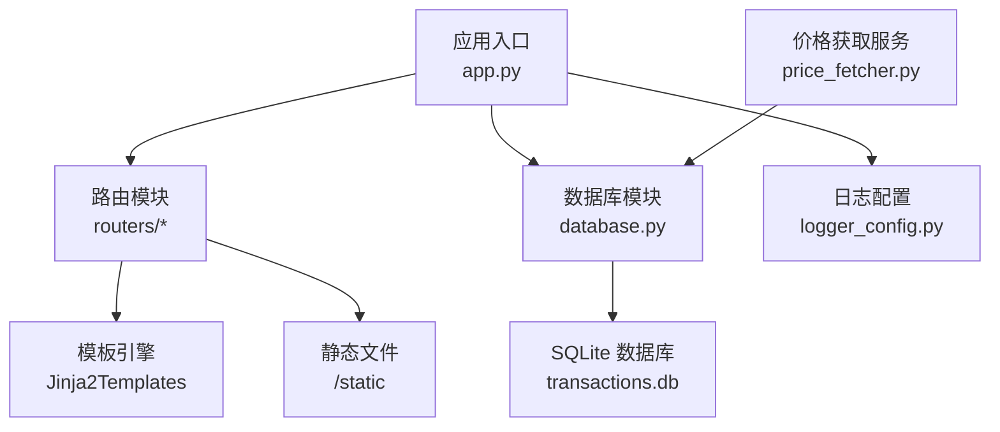
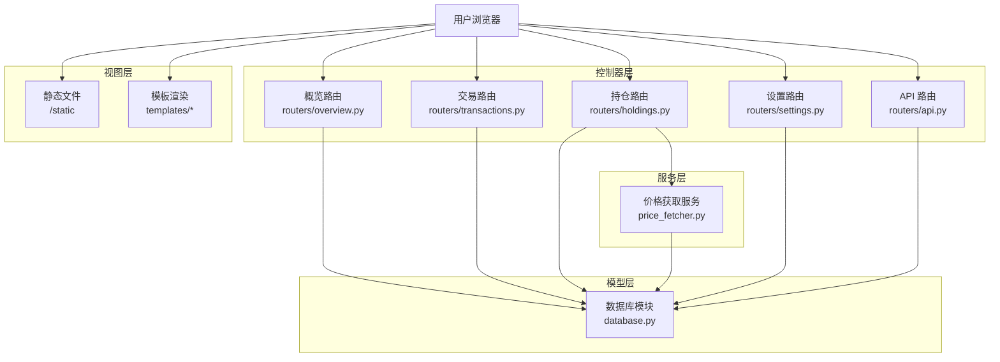
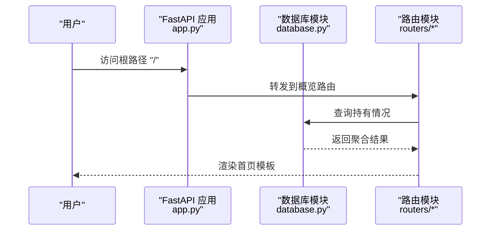
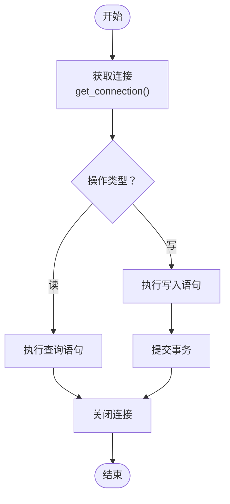
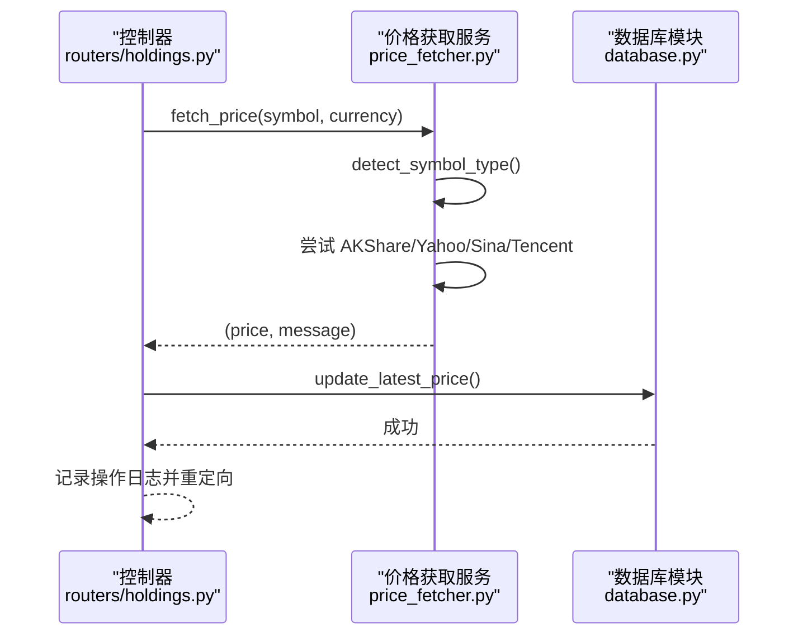
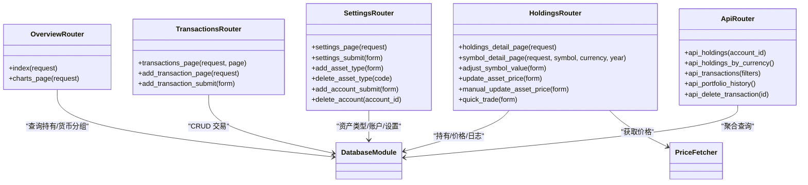
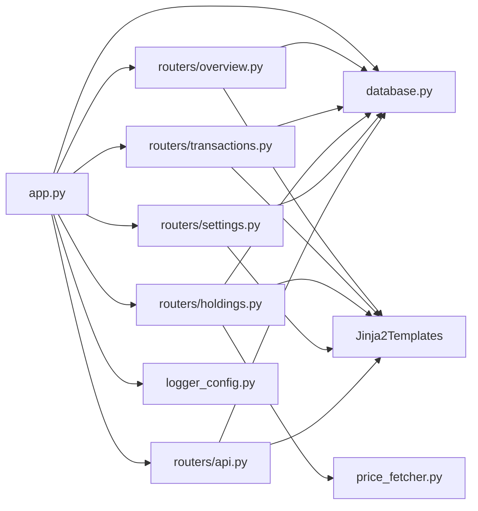
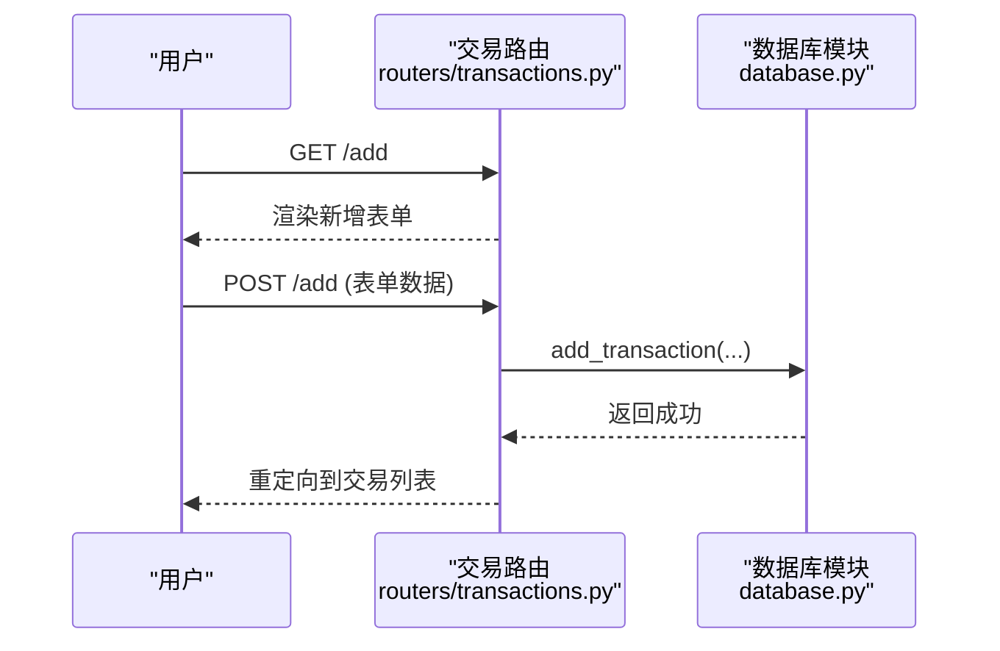
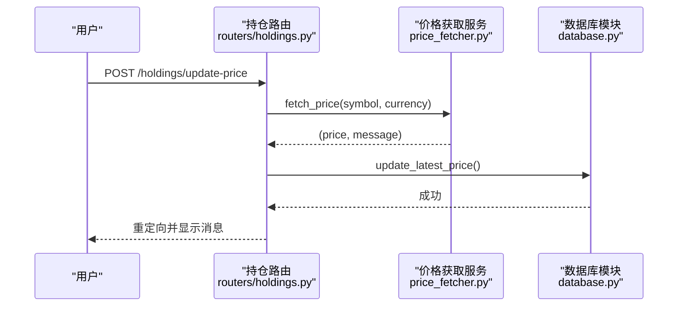

# 核心架构

<cite>
**本文档引用的文件**
- [app.py](file://app.py)
- [config.py](file://config.py)
- [database.py](file://database.py)
- [logger_config.py](file://logger_config.py)
- [price_fetcher.py](file://price_fetcher.py)
- [requirements.txt](file://requirements.txt)
- [routers/api.py](file://routers/api.py)
- [routers/holdings.py](file://routers/holdings.py)
- [routers/overview.py](file://routers/overview.py)
- [routers/settings.py](file://routers/settings.py)
- [routers/transactions.py](file://routers/transactions.py)
- [routers/utils.py](file://routers/utils.py)
- [templates/base.html](file://templates/base.html)
</cite>

## 目录
1. [简介](#简介)
2. [项目结构](#项目结构)
3. [核心组件](#核心组件)
4. [架构总览](#架构总览)
5. [详细组件分析](#详细组件分析)
6. [依赖关系分析](#依赖关系分析)
7. [性能考量](#性能考量)
8. [故障排查指南](#故障排查指南)
9. [结论](#结论)
10. [附录](#附录)

## 简介
本项目是一个基于 FastAPI 的投资日志管理系统，采用 MVC 架构模式：控制器（Routers）负责请求处理与页面渲染；模型（Database）封装数据访问与业务逻辑；服务层（Price Fetcher）提供外部数据获取能力。系统通过路由组织实现清晰的功能边界，结合静态文件服务、Jinja2 模板渲染与 API 响应处理，形成统一的 Web 应用体验。数据库采用 SQLite，配合索引与查询优化，满足中小规模个人投资管理需求。

## 项目结构
项目采用按功能分层的目录组织方式：
- 应用入口与配置：app.py、config.py、logger_config.py
- 数据访问层：database.py（含表结构定义、CRUD、查询聚合、价格与操作日志等）
- 外部服务：price_fetcher.py（多数据源价格获取）
- 路由与控制器：routers/*（按功能模块划分）
- 模板与静态资源：templates/*、static/style.css
- 依赖声明：requirements.txt

图表来源
- [app.py](file://app.py#L13-L29)
- [routers/utils.py](file://routers/utils.py#L1-L4)
- [database.py](file://database.py#L15-L151)
- [price_fetcher.py](file://price_fetcher.py#L1-L12)

章节来源
- [app.py](file://app.py#L1-L34)
- [requirements.txt](file://requirements.txt#L1-L6)

## 核心组件
- 应用入口与启动流程：初始化 FastAPI 实例、挂载静态文件、注册路由、启动时初始化数据库、日志配置。
- 配置中心：集中管理数据库路径（默认 iCloud 同步目录），支持环境变量覆盖。
- 数据访问层：提供交易、账户、符号、资产类型、分配设置、最新价格、操作日志等表的建表、索引与 CRUD 查询；封装持有计算、收益分析、价值调整等业务逻辑。
- 价格获取服务：多数据源（AKShare、Yahoo Finance、新浪、腾讯）回退式价格抓取，支持 A 股、港股、美股、黄金等。
- 路由控制器：按功能拆分（概览、交易、持仓、设置、API），分别处理 HTML 页面渲染与 API 响应。
- 日志系统：每日轮转文件，保留 7 天日志，同时输出控制台信息。

章节来源
- [app.py](file://app.py#L13-L29)
- [config.py](file://config.py#L10-L24)
- [database.py](file://database.py#L15-L151)
- [price_fetcher.py](file://price_fetcher.py#L1-L12)
- [routers/api.py](file://routers/api.py#L1-L67)
- [logger_config.py](file://logger_config.py#L14-L54)

## 架构总览
系统采用典型的 MVC + 分层架构：
- 视图层：Jinja2 模板渲染 HTML 页面，静态文件通过 FastAPI StaticFiles 提供。
- 控制器层：各功能路由模块处理请求参数、调用服务与数据层，并返回 HTML 或 JSON。
- 服务层：价格获取服务封装多数据源策略与回退逻辑。
- 模型层：数据库模块封装 SQL 操作、索引与复杂查询，提供业务聚合函数。
- 中间件：当前代码未显式定义自定义中间件，但可通过 FastAPI 的中间件机制扩展（如 CORS、认证、审计等）。

图表来源
- [routers/overview.py](file://routers/overview.py#L1-L28)
- [routers/transactions.py](file://routers/transactions.py#L1-L75)
- [routers/holdings.py](file://routers/holdings.py#L1-L207)
- [routers/settings.py](file://routers/settings.py#L1-L148)
- [routers/api.py](file://routers/api.py#L1-L67)
- [price_fetcher.py](file://price_fetcher.py#L325-L402)
- [database.py](file://database.py#L15-L151)

## 详细组件分析

### 应用入口与生命周期
- 初始化 FastAPI 应用实例，设置标题。
- 挂载静态文件目录，提供样式与资源。
- 启动事件中初始化数据库（建表、索引、默认资产类型）。
- 注册各功能路由模块。
- 开发运行：直接运行入口文件启动 Uvicorn。

图表来源
- [app.py](file://app.py#L13-L29)
- [routers/overview.py](file://routers/overview.py#L8-L17)
- [database.py](file://database.py#L344-L390)

章节来源
- [app.py](file://app.py#L13-L29)

### 数据库连接管理与会话生命周期
- 连接获取：每次操作通过工厂函数创建连接，启用 row_factory 便于字典化结果。
- 事务策略：每个写操作（增删改）在本地连接内执行，提交后关闭连接；查询同样遵循打开/关闭模式，避免长事务。
- 表结构与索引：初始化阶段创建交易、账户、符号、分配设置、资产类型、操作日志、最新价格等表，并建立常用字段索引。
- 业务聚合：提供持有计算、按货币/资产类型分组、收益分析、价值调整等聚合查询。

图表来源
- [database.py](file://database.py#L15-L19)
- [database.py](file://database.py#L22-L151)
- [database.py](file://database.py#L158-L225)

章节来源
- [database.py](file://database.py#L15-L151)

### 价格获取服务与数据流
- 符号类型检测：根据符号格式与币种判断 A 股、港股、美股、黄金、债券、现金等类型。
- 多数据源回退：优先使用 AKShare，其次 Yahoo Finance，再尝试新浪与腾讯接口，记录每一步尝试与结果。
- 结果存储：成功获取的价格写入最新价格表，同时记录操作日志。

图表来源
- [routers/holdings.py](file://routers/holdings.py#L102-L147)
- [price_fetcher.py](file://price_fetcher.py#L325-L402)
- [database.py](file://database.py#L838-L858)

章节来源
- [price_fetcher.py](file://price_fetcher.py#L36-L66)
- [routers/holdings.py](file://routers/holdings.py#L102-L147)

### 路由组织与控制器职责
- 概览路由：首页仪表盘与图表页面，渲染持有按货币分组的数据。
- 交易路由：交易列表（分页）、新增交易表单与提交处理。
- 持仓路由：详细持有页面、单标详情、快速交易、价格更新与手动更新、资产价值调整。
- 设置路由：分配范围配置、资产类型与账户管理。
- API 路由：提供持有、交易、组合历史等 API 接口，支持删除交易。

图表来源
- [routers/overview.py](file://routers/overview.py#L1-L28)
- [routers/transactions.py](file://routers/transactions.py#L1-L75)
- [routers/holdings.py](file://routers/holdings.py#L1-L207)
- [routers/settings.py](file://routers/settings.py#L1-L148)
- [routers/api.py](file://routers/api.py#L1-L67)

章节来源
- [routers/overview.py](file://routers/overview.py#L1-L28)
- [routers/transactions.py](file://routers/transactions.py#L1-L75)
- [routers/holdings.py](file://routers/holdings.py#L1-L207)
- [routers/settings.py](file://routers/settings.py#L1-L148)
- [routers/api.py](file://routers/api.py#L1-L67)

### 错误处理机制
- API 层：删除交易不存在时抛出 HTTP 异常，返回 404。
- 控制器层：价格更新失败时记录操作日志并重定向带错误消息。
- 数据层：账户删除前检查是否被使用；资产类型删除前检查是否有关联交易。
- 日志层：统一使用日志配置模块，记录 INFO/WARNING/ERROR 级别信息，便于问题追踪。

章节来源
- [routers/api.py](file://routers/api.py#L59-L67)
- [routers/holdings.py](file://routers/holdings.py#L135-L147)
- [database.py](file://database.py#L643-L657)
- [database.py](file://database.py#L927-L941)
- [logger_config.py](file://logger_config.py#L14-L54)

### 静态文件服务与模板渲染
- 静态文件：通过 FastAPI StaticFiles 挂载 static 目录，模板中通过 /static/style.css 引用。
- 模板：Jinja2Templates 统一加载 templates 目录，基础模板 base.html 定义导航与内容区块。
- 页面交互：控制器通过 RedirectResponse 实现表单提交后的页面跳转，携带消息参数。

章节来源
- [app.py](file://app.py#L15-L16)
- [routers/utils.py](file://routers/utils.py#L1-L4)
- [templates/base.html](file://templates/base.html#L1-L27)

## 依赖关系分析
- 应用入口依赖：路由模块、数据库模块、日志配置。
- 路由模块依赖：数据库模块、价格获取服务、模板引擎。
- 数据库模块依赖：配置模块（数据库路径）、标准库（sqlite3、datetime、pathlib）。
- 价格获取服务依赖：第三方库（akshare、yfinance）与标准库（urllib、json、re）。
- 日志配置依赖：标准库（logging、TimedRotatingFileHandler、pathlib）。

图表来源
- [app.py](file://app.py#L11-L29)
- [routers/overview.py](file://routers/overview.py#L1-L4)
- [routers/transactions.py](file://routers/transactions.py#L1-L6)
- [routers/holdings.py](file://routers/holdings.py#L1-L8)
- [routers/settings.py](file://routers/settings.py#L1-L7)
- [routers/api.py](file://routers/api.py#L1-L4)
- [database.py](file://database.py#L12)
- [price_fetcher.py](file://price_fetcher.py#L22-L34)
- [logger_config.py](file://logger_config.py#L7-L12)

章节来源
- [requirements.txt](file://requirements.txt#L1-L6)

## 性能考量
- 数据库层面
  - 已建立常用字段索引（symbol、date、account、type、currency、asset_type），有助于过滤与排序查询。
  - 查询采用参数化 SQL，避免注入风险并提升缓存命中率。
  - 聚合查询（持有计算、货币分组）在 Python 层进行二次处理，建议在大数据量时考虑在 SQL 层完成或引入分页/限制。
- 网络与价格获取
  - 价格获取采用多数据源回退策略，失败时记录日志，避免阻塞主流程。
  - 建议对频繁请求的价格接口增加缓存（内存或 Redis），减少对外部 API 的调用频率。
- Web 层
  - 模板渲染与静态文件服务由 FastAPI 内置支持，适合小中型应用。
  - 对于高并发场景，建议部署在生产服务器（如 Nginx + Uvicorn）并开启异步 worker。

[本节为通用性能建议，不直接分析具体文件]

## 故障排查指南
- 数据库初始化失败
  - 检查数据库路径配置与权限，确认 iCloud 目录可写。
  - 查看日志文件，定位初始化阶段异常。
- 价格获取失败
  - 确认网络连通性与第三方库安装状态。
  - 查看日志中服务尝试与错误摘要，逐个排除数据源。
- 删除失败
  - 账户删除需确保无交易关联；资产类型删除需确保无持有记录。
- API 删除 404
  - 确认交易 ID 存在且未被删除。

章节来源
- [config.py](file://config.py#L17-L24)
- [logger_config.py](file://logger_config.py#L14-L54)
- [price_fetcher.py](file://price_fetcher.py#L382-L401)
- [database.py](file://database.py#L643-L657)
- [database.py](file://database.py#L927-L941)
- [routers/api.py](file://routers/api.py#L59-L67)

## 结论
该系统以 FastAPI 为核心，采用清晰的 MVC 分层与模块化路由，结合 SQLite 数据持久化与多数据源价格服务，构建了轻量级的投资日志管理平台。通过模板渲染与静态文件服务，实现了良好的用户体验；通过日志与错误处理机制，保障了运行稳定性。建议在生产环境中进一步完善中间件、缓存与监控体系，以提升可扩展性与可观测性。

[本节为总结性内容，不直接分析具体文件]

## 附录

### 关键流程时序图：新增交易

图表来源
- [routers/transactions.py](file://routers/transactions.py#L30-L75)
- [database.py](file://database.py#L158-L225)

### 关键流程时序图：价格更新

图表来源
- [routers/holdings.py](file://routers/holdings.py#L102-L147)
- [price_fetcher.py](file://price_fetcher.py#L325-L402)
- [database.py](file://database.py#L838-L858)