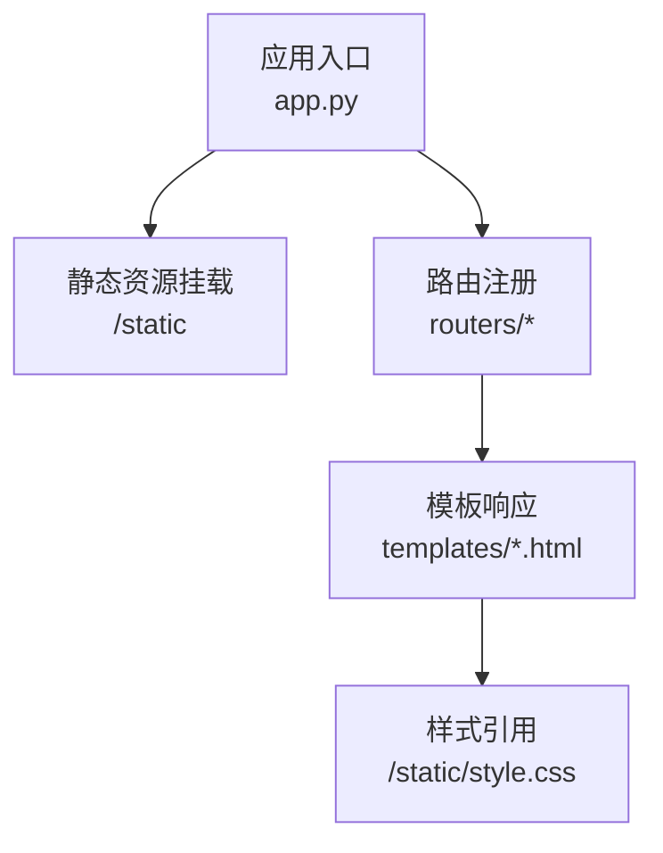
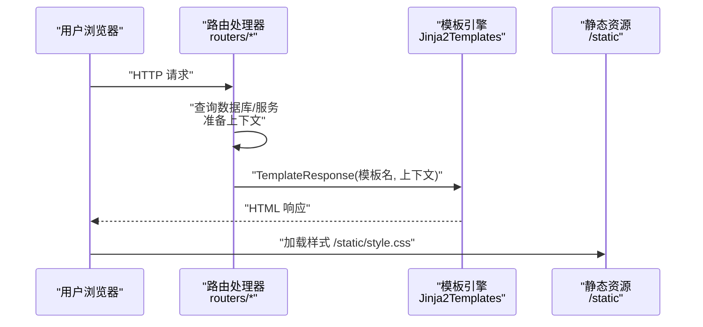
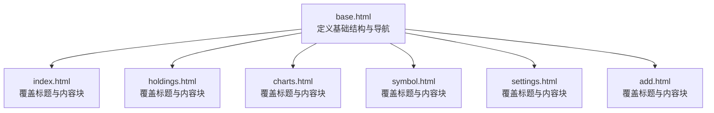
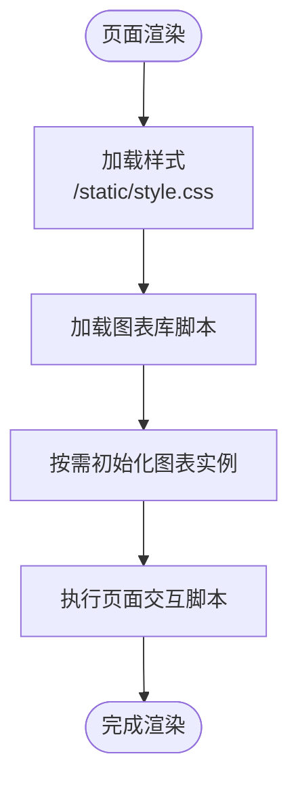
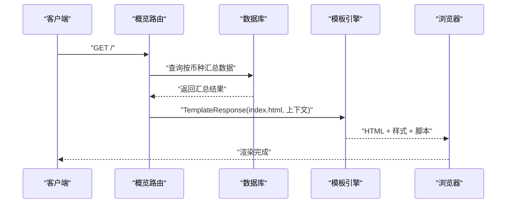
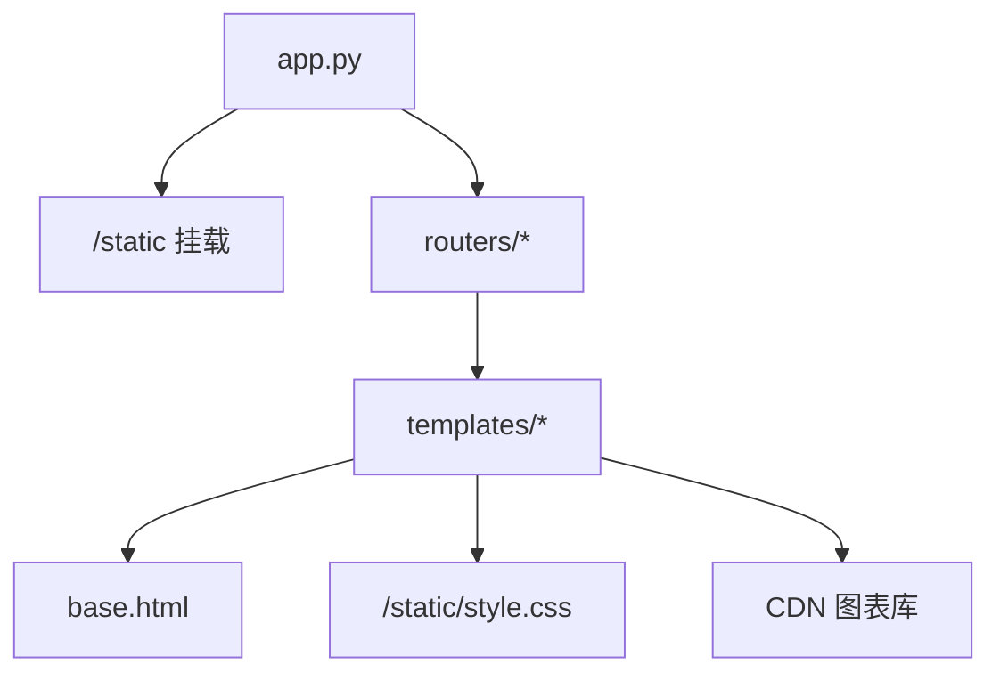

# 模板引擎集成

<cite>
**本文引用的文件**
- [app.py](file://app.py)
- [requirements.txt](file://requirements.txt)
- [config.py](file://config.py)
- [routers/utils.py](file://routers/utils.py)
- [routers/overview.py](file://routers/overview.py)
- [routers/holdings.py](file://routers/holdings.py)
- [routers/settings.py](file://routers/settings.py)
- [templates/base.html](file://templates/base.html)
- [templates/index.html](file://templates/index.html)
- [templates/holdings.html](file://templates/holdings.html)
- [templates/charts.html](file://templates/charts.html)
- [templates/symbol.html](file://templates/symbol.html)
- [templates/settings.html](file://templates/settings.html)
- [templates/add.html](file://templates/add.html)
- [static/style.css](file://static/style.css)
</cite>

## 目录
1. [简介](#简介)
2. [项目结构](#项目结构)
3. [核心组件](#核心组件)
4. [架构总览](#架构总览)
5. [详细组件分析](#详细组件分析)
6. [依赖关系分析](#依赖关系分析)
7. [性能与优化](#性能与优化)
8. [故障排查指南](#故障排查指南)
9. [结论](#结论)
10. [附录](#附录)

## 简介
本文件面向投资日志管理系统中的模板引擎集成，聚焦于 FastAPI 与 Jinja2 的结合使用，系统性阐述模板继承、布局复用、变量传递、条件渲染、循环处理、静态资源引用、样式与脚本嵌入、模板缓存与性能优化、安全注意事项，并提供模板架构图与页面渲染流程图，帮助开发者高效设计与维护模板。

## 项目结构
项目采用“路由 + 模板 + 静态资源”的分层组织方式：
- 应用入口与静态资源挂载：在应用启动时挂载静态目录，供模板通过固定路径引用样式与脚本。
- 路由层：各功能模块（概览、持有明细、图表、符号详情、设置、新增交易）通过独立路由处理请求并返回 HTML 响应。
- 模板层：以 base.html 为基模板，子页面通过 extends 继承并填充块内容；模板内使用内置变量 request、过滤器与内置标签进行数据绑定与逻辑控制。
- 静态资源层：样式文件集中于 static/style.css，模板通过 /static 访问。

**图表来源**
- [app.py](file://app.py#L15-L16)
- [routers/overview.py](file://routers/overview.py#L8-L17)
- [routers/holdings.py](file://routers/holdings.py#L13-L30)
- [routers/settings.py](file://routers/settings.py#L11-L61)
- [templates/base.html](file://templates/base.html#L7-L8)

**章节来源**
- [app.py](file://app.py#L15-L16)
- [requirements.txt](file://requirements.txt#L3-L3)

## 核心组件
- 模板引擎初始化：在路由工具模块中创建 Jinja2Templates 实例，指定模板目录，统一为各路由提供模板渲染能力。
- 路由到模板的映射：各路由函数从数据库或服务获取数据，构建上下文字典，调用模板响应对象返回 HTML。
- 基础模板与继承：base.html 定义通用头部、导航与主内容区，子模板通过 extends 继承并在相应块中注入标题与内容。
- 静态资源：模板通过 /static 引用样式文件；部分页面引入 CDN 图表库脚本。

**章节来源**
- [routers/utils.py](file://routers/utils.py#L1-L4)
- [routers/overview.py](file://routers/overview.py#L8-L17)
- [routers/holdings.py](file://routers/holdings.py#L13-L30)
- [routers/settings.py](file://routers/settings.py#L11-L61)
- [templates/base.html](file://templates/base.html#L1-L27)

## 架构总览
下图展示从请求到页面渲染的关键交互：路由接收请求，准备上下文，调用模板引擎渲染，最终输出 HTML。

**图表来源**
- [routers/overview.py](file://routers/overview.py#L8-L17)
- [routers/holdings.py](file://routers/holdings.py#L13-L30)
- [routers/settings.py](file://routers/settings.py#L11-L61)
- [templates/base.html](file://templates/base.html#L7-L8)

## 详细组件分析

### 模板继承与布局复用
- 基模板 base.html 提供通用结构与导航栏，子模板通过 extends 继承，覆盖 title 与 content 块。
- 导航链接根据当前请求路径动态高亮，体现运行时上下文的使用。

**图表来源**
- [templates/base.html](file://templates/base.html#L1-L27)
- [templates/index.html](file://templates/index.html#L1-L1)
- [templates/holdings.html](file://templates/holdings.html#L1-L1)
- [templates/charts.html](file://templates/charts.html#L1-L1)
- [templates/symbol.html](file://templates/symbol.html#L1-L1)
- [templates/settings.html](file://templates/settings.html#L1-L1)
- [templates/add.html](file://templates/add.html#L1-L1)

**章节来源**
- [templates/base.html](file://templates/base.html#L10-L24)

### 变量传递、条件渲染与循环处理
- 变量传递：路由将 request、业务数据与辅助映射（如资产类型标签、货币列表等）作为上下文传入模板。
- 条件渲染：模板中广泛使用条件判断（如空状态、活动标签、警告提示），依据数据存在性与阈值显示不同内容。
- 循环处理：模板对集合进行迭代（如按币种聚合、按符号分组、年份筛选），并支持嵌套循环与条件过滤。

示例要点（不展示具体代码）：
- 在概览页中，模板对按币种分组的数据进行遍历，生成每个币种的图表与分配信息。
- 在持有明细页中，表格行按符号列表渲染，按钮与模态框通过循环生成。
- 在设置页中，多维表格按币种与资产类型交叉生成输入项。

**章节来源**
- [routers/overview.py](file://routers/overview.py#L11-L17)
- [routers/holdings.py](file://routers/holdings.py#L20-L30)
- [routers/settings.py](file://routers/settings.py#L52-L61)
- [templates/index.html](file://templates/index.html#L8-L46)
- [templates/holdings.html](file://templates/holdings.html#L15-L96)
- [templates/settings.html](file://templates/settings.html#L27-L65)

### 静态文件引用、样式集成与脚本嵌入
- 样式：基础模板直接引用 /static/style.css，确保所有页面共享一致的视觉风格。
- 图表库：基础模板引入 CDN 图表库脚本，子模板在需要时初始化图表实例。
- 内联脚本：部分页面在模板中嵌入 JavaScript，用于交互行为（如模态框、切换标签、计算总额等）。

**图表来源**
- [templates/base.html](file://templates/base.html#L7-L8)
- [static/style.css](file://static/style.css#L1-L12)
- [templates/index.html](file://templates/index.html#L48-L82)
- [templates/charts.html](file://templates/charts.html#L56-L97)

**章节来源**
- [templates/base.html](file://templates/base.html#L7-L8)
- [static/style.css](file://static/style.css#L1-L12)
- [templates/index.html](file://templates/index.html#L48-L82)
- [templates/charts.html](file://templates/charts.html#L56-L97)

### 页面渲染流程（以概览页为例）

**图表来源**
- [routers/overview.py](file://routers/overview.py#L8-L17)
- [templates/index.html](file://templates/index.html#L1-L90)

### 模板变量与过滤器使用
- 内置变量：模板可访问 request 对象，用于导航高亮等场景。
- 过滤器：模板中使用格式化与 JSON 序列化过滤器（如数值格式化、tojson），便于前端脚本消费后端数据。
- 自定义扩展：当前仓库未定义自定义过滤器或宏，若需扩展，可在模板引擎初始化处注册。

**章节来源**
- [templates/index.html](file://templates/index.html#L49-L56)
- [templates/charts.html](file://templates/charts.html#L57-L61)
- [templates/holdings.html](file://templates/holdings.html#L187-L266)
- [templates/settings.html](file://templates/settings.html#L181-L200)

### 模板扩展机制与宏定义
- 扩展机制：通过 extends 实现模板继承，子模板仅需声明差异化的块内容，提升复用性与一致性。
- 宏定义：当前未使用宏（macro），若未来需要复用复杂 UI 片段，可在模板中定义宏并导入复用。

**章节来源**
- [templates/base.html](file://templates/base.html#L1-L27)
- [templates/index.html](file://templates/index.html#L1-L1)
- [templates/holdings.html](file://templates/holdings.html#L1-L1)
- [templates/charts.html](file://templates/charts.html#L1-L1)
- [templates/symbol.html](file://templates/symbol.html#L1-L1)
- [templates/settings.html](file://templates/settings.html#L1-L1)
- [templates/add.html](file://templates/add.html#L1-L1)

## 依赖关系分析
- 应用层依赖：应用入口挂载静态资源并注册路由；路由依赖模板引擎与数据库模块。
- 模板层依赖：子模板依赖基模板；页面依赖样式与脚本；部分页面依赖图表库。
- 外部依赖：Jinja2 与 FastAPI 提供模板渲染与 HTTP 能力。

**图表来源**
- [app.py](file://app.py#L15-L16)
- [routers/utils.py](file://routers/utils.py#L1-L4)
- [templates/base.html](file://templates/base.html#L7-L8)
- [static/style.css](file://static/style.css#L1-L12)

**章节来源**
- [app.py](file://app.py#L15-L16)
- [requirements.txt](file://requirements.txt#L3-L3)

## 性能与优化
- 模板缓存：Jinja2 默认启用模板文件系统缓存，适合开发环境；生产部署建议结合反向代理或缓存策略减少重复编译开销。
- 渲染性能：避免在模板中进行复杂计算，尽量在路由层预处理数据；合理使用过滤器与内置标签，减少模板内循环层级。
- 静态资源：将样式与脚本置于 /static 并启用浏览器缓存；图表库使用 CDN 可降低本地带宽压力。
- 安全考虑：模板中避免直接拼接不可信输入；使用默认转义策略；对用户输入进行严格校验与清洗。

[本节为通用指导，无需特定文件引用]

## 故障排查指南
- 模板未找到：检查模板目录配置与模板文件命名是否正确。
- 静态资源 404：确认静态目录挂载路径与模板中的引用路径一致。
- 导航高亮异常：检查模板中基于 request.url.path 的判断逻辑。
- 图表不显示：确认模板中是否正确传递数据并初始化图表实例。
- 表单提交无响应：检查路由中 RedirectResponse 的目标与消息参数编码。

**章节来源**
- [app.py](file://app.py#L15-L16)
- [templates/base.html](file://templates/base.html#L14-L20)
- [templates/index.html](file://templates/index.html#L48-L82)
- [routers/holdings.py](file://routers/holdings.py#L102-L147)

## 结论
本项目通过简洁的模板继承与统一的模板引擎初始化，实现了清晰的页面结构与高效的渲染流程。配合静态资源与图表库的合理使用，既保证了良好的用户体验，也便于后续扩展与维护。建议在生产环境中进一步完善缓存与安全策略，并在需要时引入自定义过滤器与宏以提升模板复用性。

[本节为总结性内容，无需特定文件引用]

## 附录

### 模板变量与上下文对照
- 概览页：持有按币种汇总数据、货币列表、资产类型标签映射。
- 持有明细页：按符号汇总数据、资产类型标签映射、货币列表、消息与类型。
- 图表页：按符号汇总数据、资产类型标签映射。
- 符号详情页：符号、货币、持有信息、交易历史、年份列表、资产类型标签映射。
- 设置页：货币列表、资产类型列表（含删除状态）、账户列表（含删除状态）、设置映射、消息与类型、活动标签。
- 新增交易页：今日日期、资产类型列表、账户列表、持有数据、消息与类型。

**章节来源**
- [routers/overview.py](file://routers/overview.py#L11-L17)
- [routers/holdings.py](file://routers/holdings.py#L20-L30)
- [routers/settings.py](file://routers/settings.py#L52-L61)
- [templates/index.html](file://templates/index.html#L1-L90)
- [templates/holdings.html](file://templates/holdings.html#L1-L274)
- [templates/charts.html](file://templates/charts.html#L1-L104)
- [templates/symbol.html](file://templates/symbol.html#L1-L105)
- [templates/settings.html](file://templates/settings.html#L1-L202)
- [templates/add.html](file://templates/add.html#L1-L259)