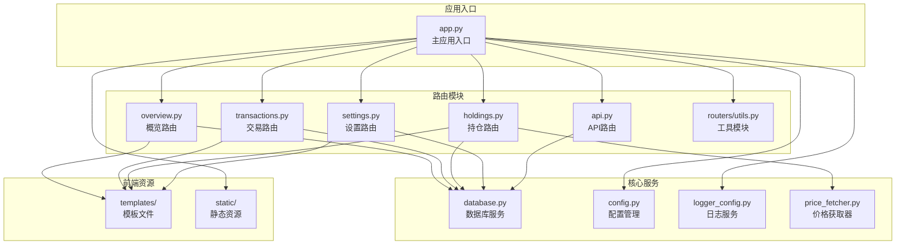
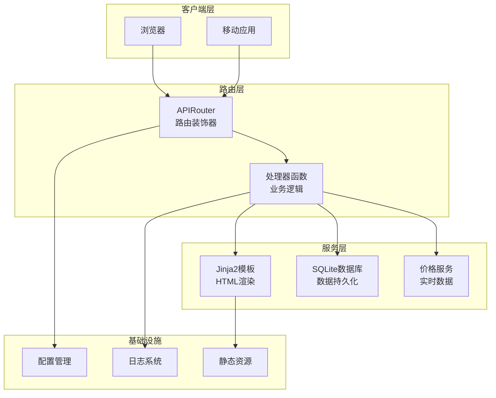
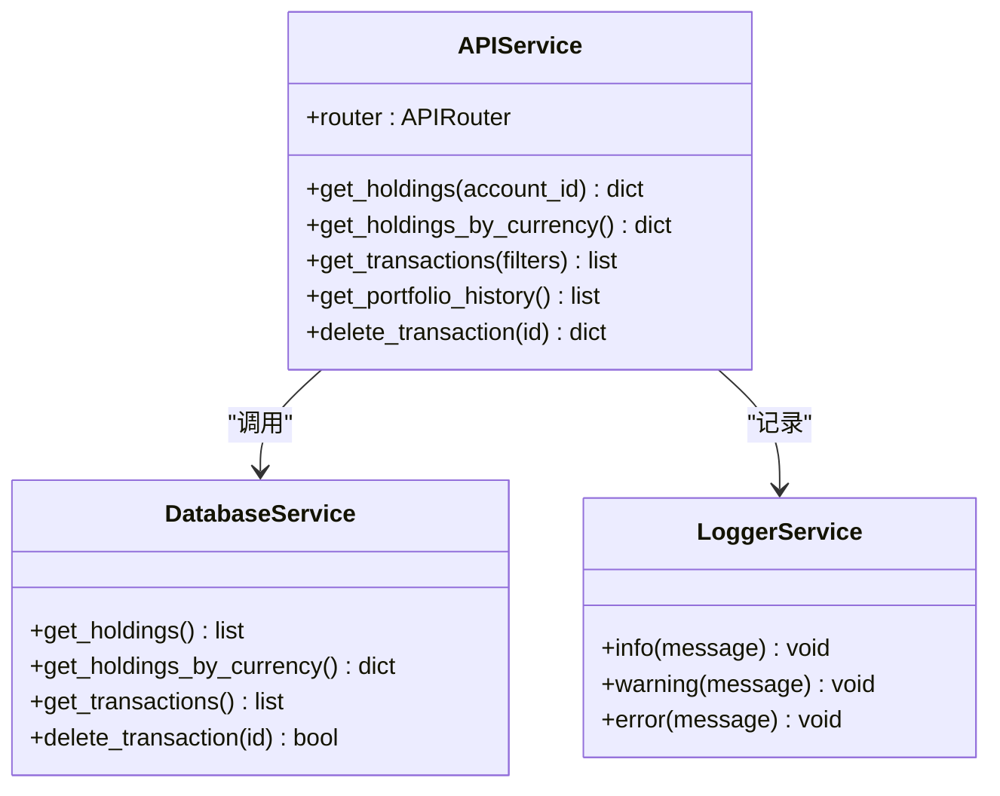
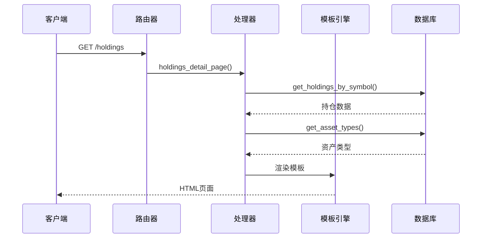
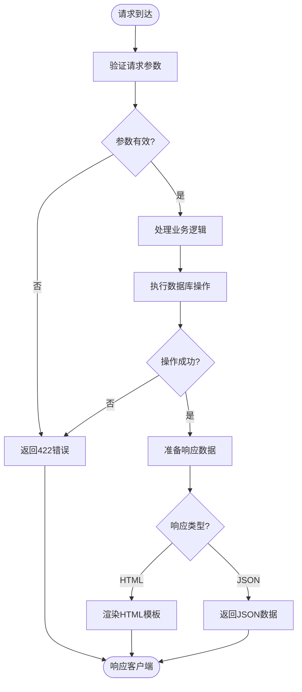
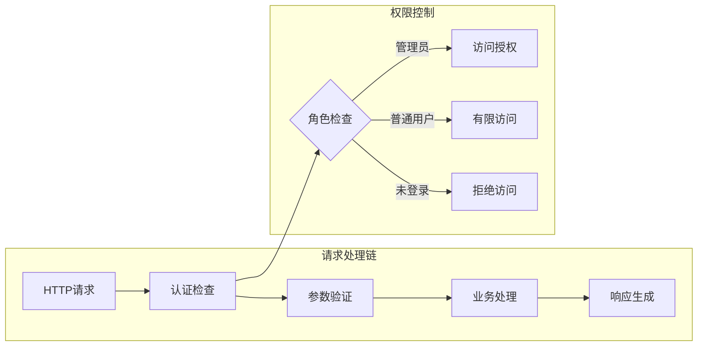
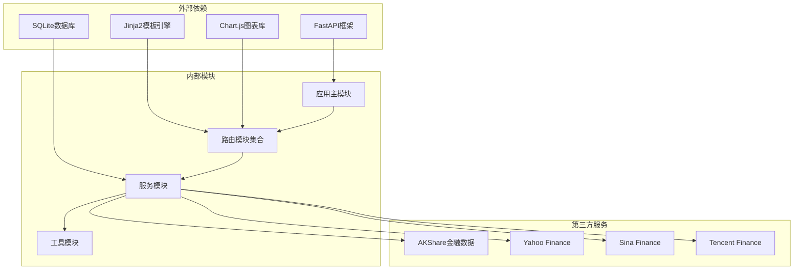
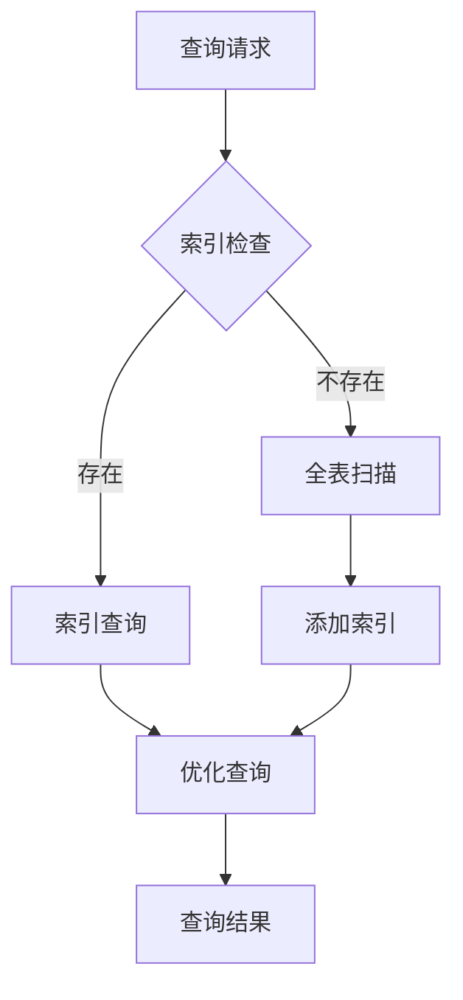
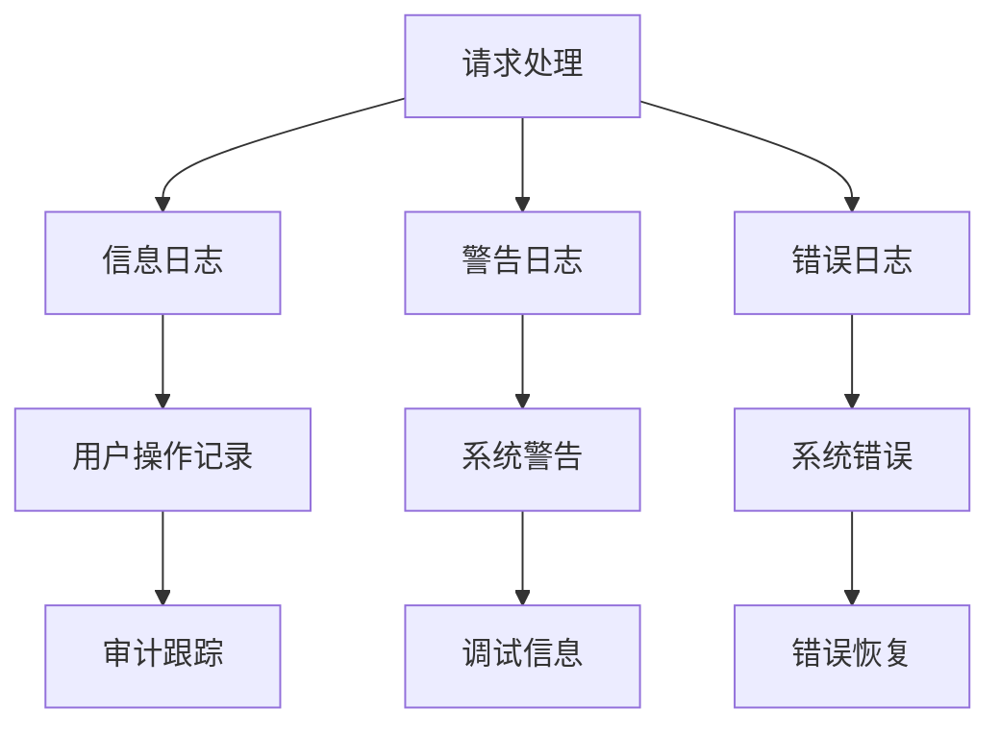

# 路由系统架构

<cite>
**本文档引用的文件**
- [app.py](file://app.py)
- [routers/api.py](file://routers/api.py)
- [routers/holdings.py](file://routers/holdings.py)
- [routers/overview.py](file://routers/overview.py)
- [routers/settings.py](file://routers/settings.py)
- [routers/transactions.py](file://routers/transactions.py)
- [routers/utils.py](file://routers/utils.py)
- [database.py](file://database.py)
- [config.py](file://config.py)
- [logger_config.py](file://logger_config.py)
- [price_fetcher.py](file://price_fetcher.py)
- [templates/base.html](file://templates/base.html)
</cite>

## 目录
1. [简介](#简介)
2. [项目结构](#项目结构)
3. [核心组件](#核心组件)
4. [架构概览](#架构概览)
5. [详细组件分析](#详细组件分析)
6. [依赖关系分析](#依赖关系分析)
7. [性能考虑](#性能考虑)
8. [故障排除指南](#故障排除指南)
9. [结论](#结论)
10. [附录](#附录)

## 简介

投资日志管理系统是一个基于FastAPI构建的Web应用程序，采用前后端分离的路由架构设计。该系统通过APIRouter模块化组织路由，实现了RESTful API接口与HTML模板渲染页面的双重功能。系统支持实时股价获取、投资组合管理、交易记录追踪等功能，为用户提供全面的投资管理解决方案。

## 项目结构

项目采用清晰的模块化组织结构，路由系统作为核心组件分布在不同的功能模块中：

**图表来源**
- [app.py](file://app.py#L13-L29)
- [routers/api.py](file://routers/api.py#L6)
- [routers/holdings.py](file://routers/holdings.py#L11)
- [routers/overview.py](file://routers/overview.py#L6)
- [routers/settings.py](file://routers/settings.py#L9)
- [routers/transactions.py](file://routers/transactions.py#L8)

**章节来源**
- [app.py](file://app.py#L1-L34)
- [routers/api.py](file://routers/api.py#L1-L67)
- [routers/holdings.py](file://routers/holdings.py#L1-L207)
- [routers/overview.py](file://routers/overview.py#L1-L28)
- [routers/settings.py](file://routers/settings.py#L1-L148)
- [routers/transactions.py](file://routers/transactions.py#L1-L75)

## 核心组件

### 应用入口与初始化

主应用入口负责应用的整体配置和路由注册：

- **应用实例创建**：创建FastAPI实例并设置标题
- **静态文件服务**：挂载静态文件目录供CSS样式等资源使用
- **数据库初始化**：应用启动时自动初始化数据库连接
- **路由注册**：按顺序注册所有路由模块

### 路由模块组织

系统采用按功能域划分的路由模块设计：

1. **概览模块** (`overview.py`)：主页仪表板和图表页面
2. **交易模块** (`transactions.py`)：交易记录管理和添加功能
3. **持仓模块** (`holdings.py`)：投资组合详情和价格更新
4. **设置模块** (`settings.py`)：系统配置和管理功能
5. **API模块** (`api.py`)：RESTful API接口服务

**章节来源**
- [app.py](file://app.py#L13-L29)
- [routers/utils.py](file://routers/utils.py#L1-L4)

## 架构概览

系统采用分层架构设计，实现了清晰的关注点分离：

**图表来源**
- [app.py](file://app.py#L15-L29)
- [routers/api.py](file://routers/api.py#L6)
- [routers/holdings.py](file://routers/holdings.py#L9)

### 路由装饰器使用模式

系统统一使用FastAPI的路由装饰器模式：

- **HTTP方法装饰器**：`@router.get()`、`@router.post()`、`@router.delete()`
- **路径参数**：使用花括号语法定义动态路径段
- **查询参数**：通过函数参数定义可选查询参数
- **表单参数**：使用`Form()`装饰器处理POST表单数据
- **响应类型**：区分HTML响应和JSON响应

**章节来源**
- [routers/api.py](file://routers/api.py#L8-L67)
- [routers/holdings.py](file://routers/holdings.py#L13-L207)
- [routers/transactions.py](file://routers/transactions.py#L10-L75)

## 详细组件分析

### API路由模块

API模块提供RESTful接口服务，采用统一的前缀命名空间：

**图表来源**
- [routers/api.py](file://routers/api.py#L6-L67)
- [database.py](file://database.py#L344-L390)

#### API端点设计

| 端点 | 方法 | 功能描述 | 参数 | 返回值 |
|------|------|----------|------|--------|
| `/api/holdings` | GET | 获取当前持仓 | `account_id`(可选) | 持仓列表 |
| `/api/holdings-by-currency` | GET | 按货币分组的持仓 | 无 | 分组数据 |
| `/api/transactions` | GET | 获取交易记录 | `symbol, account_id, transaction_type, limit` | 交易列表 |
| `/api/portfolio-history` | GET | 投资组合历史数据 | 无 | 时间序列数据 |
| `/api/transactions/{transaction_id}` | DELETE | 删除交易记录 | `transaction_id` | 删除状态 |

**章节来源**
- [routers/api.py](file://routers/api.py#L8-L67)

### 页面路由模块

页面路由模块提供HTML模板渲染服务，实现用户界面交互：

**图表来源**
- [routers/holdings.py](file://routers/holdings.py#L13-L30)
- [routers/utils.py](file://routers/utils.py#L1-L4)

#### 页面路由设计

| 路径 | 方法 | 功能描述 | 响应类型 | 特殊处理 |
|------|------|----------|----------|----------|
| `/` | GET | 主页仪表板 | HTMLResponse | 持仓概览 |
| `/holdings` | GET | 详细持仓页面 | HTMLResponse | 按符号分组 |
| `/symbol/{symbol}` | GET | 符号详情页面 | HTMLResponse | 年度筛选 |
| `/transactions` | GET | 交易记录页面 | HTMLResponse | 分页显示 |
| `/add` | GET | 添加交易页面 | HTMLResponse | 表单预填充 |

**章节来源**
- [routers/overview.py](file://routers/overview.py#L8-L28)
- [routers/holdings.py](file://routers/holdings.py#L13-L76)
- [routers/transactions.py](file://routers/transactions.py#L10-L43)

### 数据验证与响应模型

系统采用多种数据验证机制：

**图表来源**
- [routers/holdings.py](file://routers/holdings.py#L78-L100)
- [routers/transactions.py](file://routers/transactions.py#L45-L75)

**章节来源**
- [routers/holdings.py](file://routers/holdings.py#L78-L207)
- [routers/transactions.py](file://routers/transactions.py#L45-L75)

### 中间件与权限控制

系统采用基于装饰器的权限控制机制：

**图表来源**
- [app.py](file://app.py#L19-L22)

**章节来源**
- [app.py](file://app.py#L19-L22)

### 错误处理机制

系统实现了多层次的错误处理：

1. **数据库异常处理**：捕获SQLite操作异常
2. **HTTP异常处理**：使用FastAPI的HTTPException
3. **业务逻辑异常**：自定义业务规则验证
4. **网络异常处理**：价格获取服务的降级策略

**章节来源**
- [routers/api.py](file://routers/api.py#L60-L67)
- [price_fetcher.py](file://price_fetcher.py#L325-L405)

## 依赖关系分析

系统采用松耦合的设计模式，各组件间依赖关系清晰：

**图表来源**
- [app.py](file://app.py#L7-L11)
- [price_fetcher.py](file://price_fetcher.py#L23-L34)

**章节来源**
- [app.py](file://app.py#L7-L11)
- [price_fetcher.py](file://price_fetcher.py#L23-L34)

## 性能考虑

### 缓存策略

系统实现了多级缓存机制：

1. **数据库查询缓存**：对频繁访问的数据进行缓存
2. **模板渲染缓存**：减少重复的模板解析开销
3. **价格数据缓存**：避免频繁的价格查询请求

### 查询优化

**图表来源**
- [database.py](file://database.py#L142-L149)

### 并发处理

系统支持高并发请求处理：

- **异步路由处理**：所有路由函数都支持异步操作
- **数据库连接池**：合理管理数据库连接资源
- **静态文件缓存**：浏览器端缓存静态资源

**章节来源**
- [database.py](file://database.py#L142-L149)

## 故障排除指南

### 常见问题诊断

1. **路由无法访问**
   - 检查路由是否正确注册到应用
   - 验证URL路径格式是否正确
   - 确认HTTP方法匹配

2. **模板渲染错误**
   - 检查模板文件是否存在
   - 验证模板变量是否正确传递
   - 确认Jinja2配置正确

3. **数据库连接问题**
   - 检查数据库文件权限
   - 验证数据库路径配置
   - 确认SQLite驱动安装

### 日志分析

系统提供了详细的日志记录机制：

**图表来源**
- [logger_config.py](file://logger_config.py#L14-L54)

**章节来源**
- [logger_config.py](file://logger_config.py#L14-L54)

## 结论

投资日志管理系统的路由系统架构体现了现代Web应用的最佳实践：

1. **模块化设计**：清晰的功能域划分便于维护和扩展
2. **前后端分离**：API路由与页面路由的明确区分
3. **异步处理**：充分利用FastAPI的异步特性提升性能
4. **错误处理**：完善的异常处理机制确保系统稳定性
5. **可扩展性**：灵活的路由组织为未来功能扩展奠定基础

该架构为类似的投资管理应用提供了优秀的参考模板，既满足了当前的功能需求，又为未来的功能扩展预留了充足的空间。

## 附录

### 路由扩展指南

#### 新增路由模块步骤

1. **创建路由文件**：在`routers/`目录下创建新模块
2. **定义APIRouter实例**：设置适当的前缀和标签
3. **实现路由函数**：遵循现有的装饰器使用模式
4. **集成到应用**：在`app.py`中注册新的路由模块
5. **测试验证**：编写单元测试确保功能正常

#### 命名空间组织原则

- **功能相关性**：将相关功能的路由放在同一模块中
- **URL层次结构**：设计合理的URL层次结构
- **RESTful设计**：遵循RESTful API设计原则
- **版本管理**：为重要API提供版本控制支持

### 最佳实践建议

1. **参数验证**：始终对输入参数进行验证
2. **错误处理**：提供有意义的错误信息
3. **日志记录**：记录关键操作和异常情况
4. **性能监控**：监控路由响应时间和数据库查询
5. **安全考虑**：实施适当的访问控制和数据验证