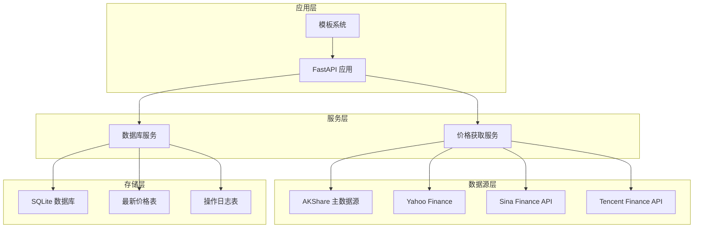
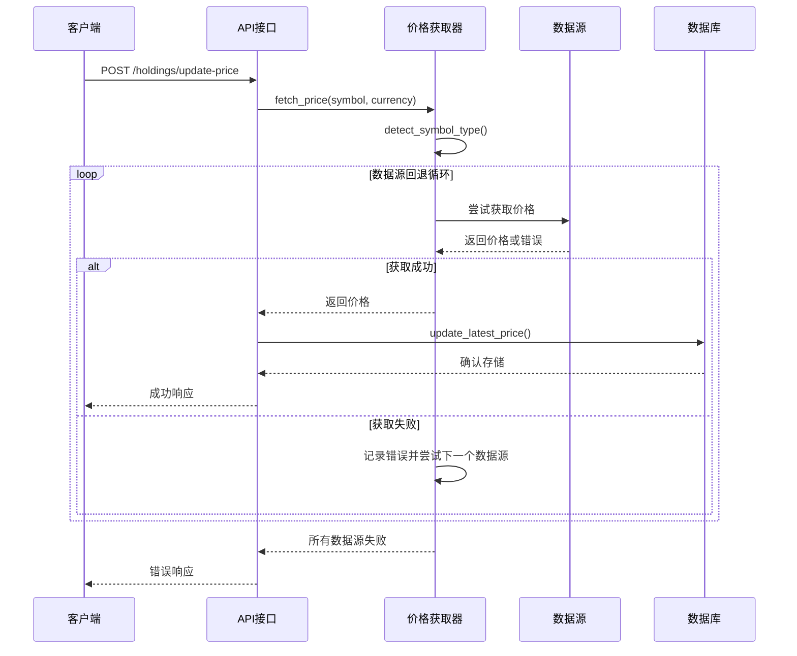
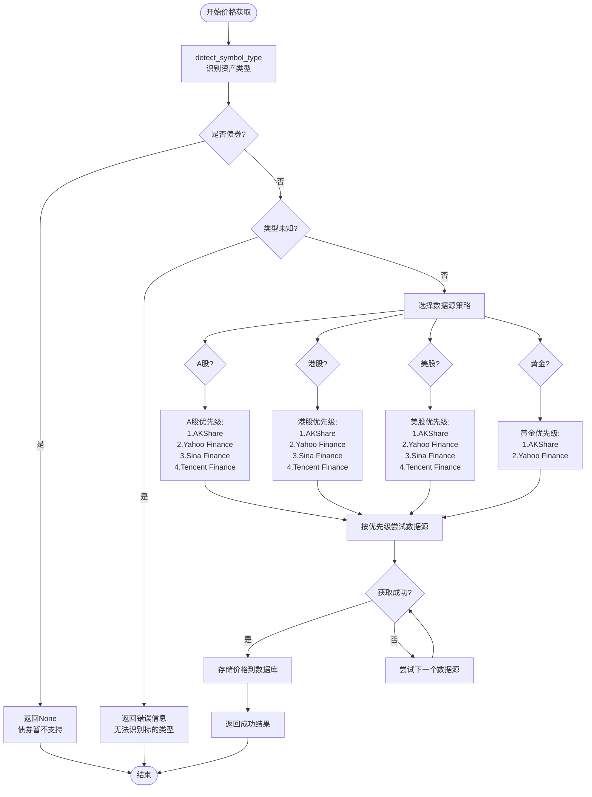
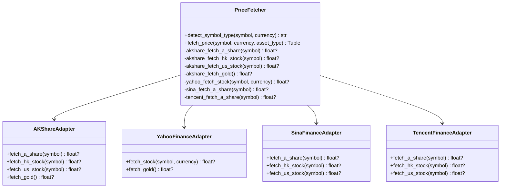
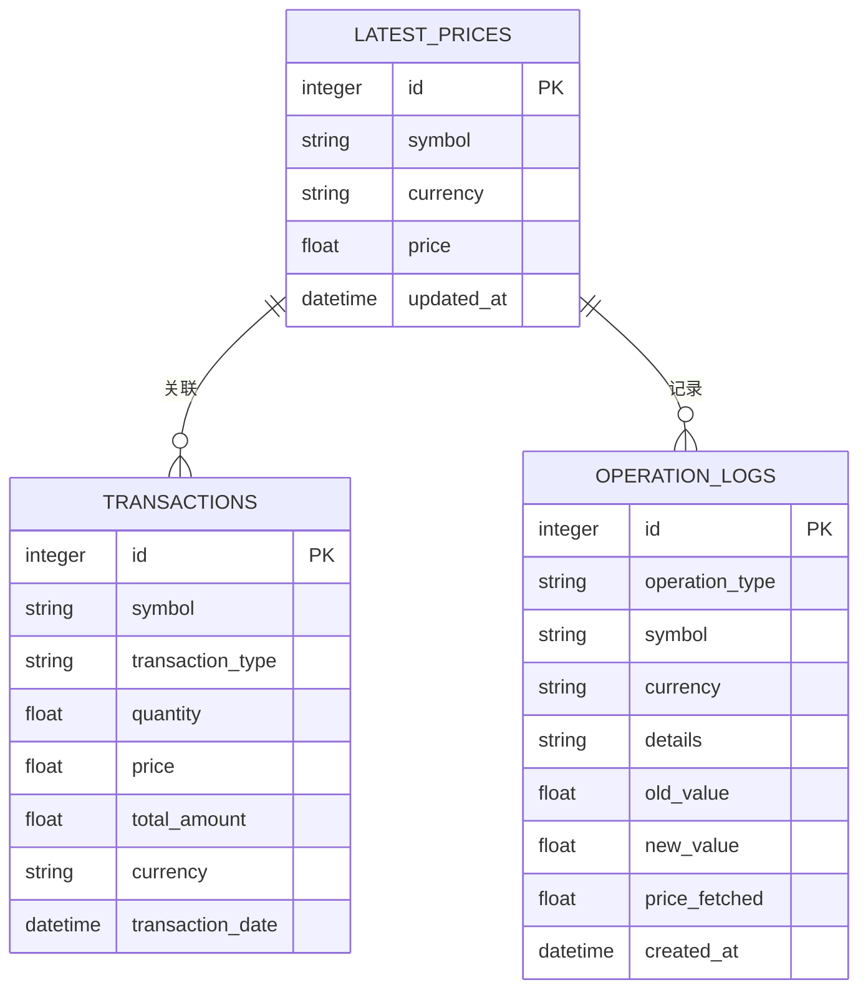
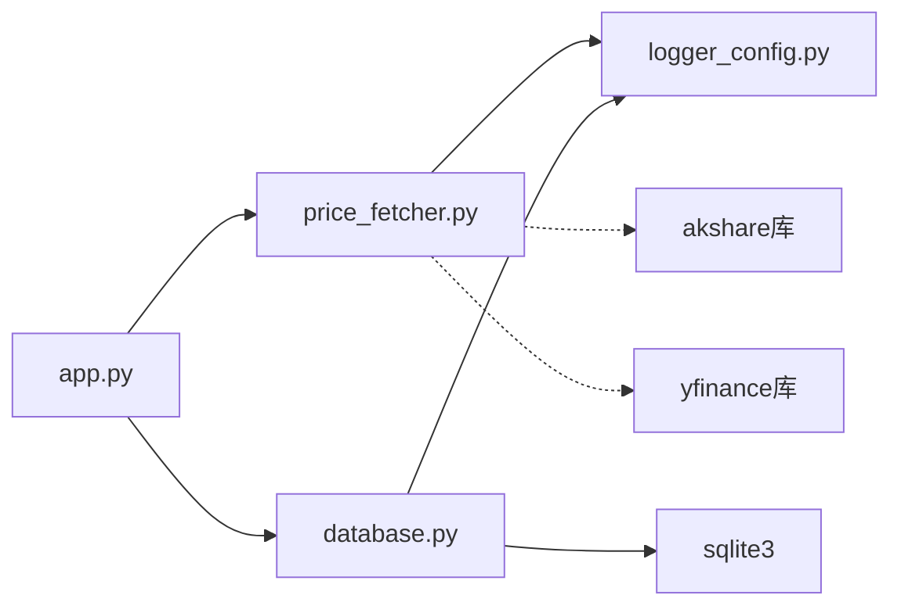
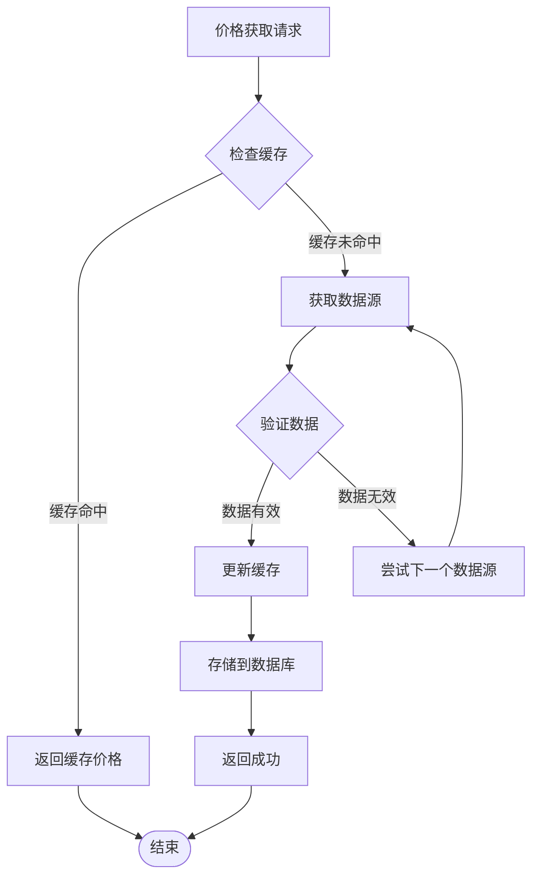

# 价格获取模块

<cite>
**本文档引用的文件**
- [app.py](file://app.py)
- [price_fetcher.py](file://price_fetcher.py)
- [database.py](file://database.py)
- [requirements.txt](file://requirements.txt)
- [logger_config.py](file://logger_config.py)
- [holdings.html](file://templates/holdings.html)
</cite>

## 目录
1. [简介](#简介)
2. [项目结构](#项目结构)
3. [核心组件](#核心组件)
4. [架构概览](#架构概览)
5. [详细组件分析](#详细组件分析)
6. [依赖关系分析](#依赖关系分析)
7. [性能考虑](#性能考虑)
8. [故障排除指南](#故障排除指南)
9. [结论](#结论)

## 简介

投资日志管理系统的价格获取模块是一个多数据源架构的价格服务，专门用于获取股票、债券、贵金属等金融资产的实时价格。该模块集成了四个主要数据源：AKShare（主数据源）、Yahoo Finance、新浪和腾讯，通过智能回退机制确保价格获取的可靠性和准确性。

该模块的核心功能包括：
- 多数据源价格获取与回退机制
- 实时价格缓存与存储
- 数据质量控制与异常检测
- 跨市场资产类型识别
- 性能优化与错误处理

## 项目结构

投资日志管理系统采用模块化架构设计，价格获取模块作为独立的服务层存在：



**图表来源**
- [app.py](file://app.py#L1-L50)
- [price_fetcher.py](file://price_fetcher.py#L1-L50)
- [database.py](file://database.py#L128-L138)

**章节来源**
- [app.py](file://app.py#L1-L50)
- [price_fetcher.py](file://price_fetcher.py#L1-L20)
- [database.py](file://database.py#L1-L50)

## 核心组件

### 价格获取服务 (PriceFetcher)

价格获取服务是整个系统的核心组件，负责协调多个数据源的价格获取工作。它实现了智能的数据源选择策略和回退机制。

### 数据源管理层

系统集成了四种不同类型的数据源，每种都有特定的优势和适用场景：

1. **AKShare (主数据源)**: 支持A股、港股、美股和黄金价格获取
2. **Yahoo Finance**: 提供美股和港股的补充价格数据
3. **Sina Finance API**: 作为A股和港股的备用数据源
4. **Tencent Finance API**: 提供额外的A股和港股价格数据

### 数据库集成层

价格获取模块与SQLite数据库深度集成，提供了完整的价格存储和历史追踪功能。

**章节来源**
- [price_fetcher.py](file://price_fetcher.py#L321-L395)
- [database.py](file://database.py#L779-L825)

## 架构概览

价格获取模块采用了分层架构设计，确保了高内聚低耦合的系统结构：



**图表来源**
- [app.py](file://app.py#L216-L262)
- [price_fetcher.py](file://price_fetcher.py#L321-L395)
- [database.py](file://database.py#L779-L800)

## 详细组件分析

### 数据源优先级策略

价格获取模块实现了严格的多数据源优先级策略：



**图表来源**
- [price_fetcher.py](file://price_fetcher.py#L36-L62)
- [price_fetcher.py](file://price_fetcher.py#L345-L374)

### 实时价格获取实现

#### 符号类型检测机制

系统首先需要识别给定符号的资产类型，以便选择正确的数据源和获取策略：

| 资产类型 | 检测规则 | 示例 |
|---------|---------|------|
| A股 | 以SH/SZ开头或6位数字 | SH600000, SZ000001, 600000 |
| 港股 | HKD货币或5位数字格式 | 00005, 09888 |
| 美股 | USD货币或纯字母 | AAPL, MSFT, KO |
| 黄金 | 包含AU或GOLD | XAU, XAG, GOLD |
| 债券 | 包含BOND | CHINABOND, USGOV |

#### 数据源适配器模式

每个数据源都实现了统一的适配器接口，确保了代码的一致性和可维护性：



**图表来源**
- [price_fetcher.py](file://price_fetcher.py#L36-L62)
- [price_fetcher.py](file://price_fetcher.py#L69-L130)
- [price_fetcher.py](file://price_fetcher.py#L136-L186)

### 缓存机制与数据存储

#### 最新价格缓存表设计

系统使用SQLite数据库的最新价格表来实现价格缓存：



**图表来源**
- [database.py](file://database.py#L129-L138)
- [database.py](file://database.py#L114-L126)

#### 更新策略

当价格获取成功时，系统会执行以下操作序列：

1. **价格获取**: 从首选数据源获取最新价格
2. **数据验证**: 验证价格的有效性和合理性
3. **数据库更新**: 使用ON CONFLICT子句进行原子性更新
4. **日志记录**: 记录操作详情到操作日志表
5. **响应客户端**: 返回成功状态和价格信息

**章节来源**
- [price_fetcher.py](file://price_fetcher.py#L321-L395)
- [database.py](file://database.py#L779-L825)

## 依赖关系分析

### 外部依赖管理

系统对外部库的依赖管理体现了良好的软件工程实践：

```mermaid
graph TB
subgraph "核心依赖"
FASTAPI[fastapi>=0.100.0]
UVICORN[uvicorn[standard]>=0.23.0]
JINJA2[jinja2>=3.1.0]
MULTIPART[python-multipart>=0.0.6]
end
subgraph "数据获取依赖"
AKSHARE[akshare>=1.10.0]
YFINANCE[yfinance]
URLLIB[urllib3]
end
subgraph "应用依赖"
SQLITE[sqlite3内置]
LOGGER[logging模块]
end
FASTAPI --> JINJA2
FASTAPI --> MULTIPART
UVICORN --> FASTAPI
AKSHARE --> SQLITE
YFINANCE --> SQLITE
URLLIB --> SQLITE
LOGGER --> SQLITE
```

**图表来源**
- [requirements.txt](file://requirements.txt#L1-L6)

### 内部模块依赖

价格获取模块的内部依赖关系清晰明确：



**图表来源**
- [app.py](file://app.py#L15-L17)
- [price_fetcher.py](file://price_fetcher.py#L20)
- [database.py](file://database.py#L7-L11)

**章节来源**
- [requirements.txt](file://requirements.txt#L1-L6)
- [app.py](file://app.py#L15-L17)

## 性能考虑

### 并发访问控制

系统在设计上考虑了并发访问的需求，通过以下机制确保数据一致性：

1. **原子性操作**: 使用SQLite的ON CONFLICT子句确保价格更新的原子性
2. **连接池管理**: 每次数据库操作都创建独立的连接，避免连接竞争
3. **超时控制**: 所有网络请求都设置了合理的超时时间（10秒）

### 缓存策略优化



**图表来源**
- [price_fetcher.py](file://price_fetcher.py#L375-L395)
- [database.py](file://database.py#L789-L795)

### 错误处理与重试机制

系统实现了多层次的错误处理机制：

1. **数据源级别错误**: 单个数据源失败不影响整体操作
2. **网络级别错误**: 设置超时和重试机制
3. **数据验证错误**: 对获取的数据进行合理性检查
4. **数据库错误**: 处理并发写入冲突

**章节来源**
- [price_fetcher.py](file://price_fetcher.py#L375-L395)
- [logger_config.py](file://logger_config.py#L14-L54)

## 故障排除指南

### 常见问题诊断

#### 数据源可用性问题

**症状**: 价格获取总是失败
**诊断步骤**:
1. 检查网络连接状态
2. 验证外部库安装情况
3. 查看日志文件中的错误信息

**解决方案**:
- 确保所有必需的Python包已正确安装
- 检查防火墙设置，允许HTTP请求
- 验证数据源API的可用性

#### 数据验证失败

**症状**: 价格获取成功但显示为None
**可能原因**:
- 数据源返回的数据格式不符合预期
- 价格值为负数或零
- 符号匹配失败

**解决方法**:
- 检查数据源返回的数据格式
- 添加数据验证逻辑
- 更新符号映射规则

#### 数据库连接问题

**症状**: 价格更新后无法查询到最新价格
**排查步骤**:
1. 检查数据库文件是否存在
2. 验证表结构是否正确
3. 查看是否有权限问题

**修复方案**:
- 运行数据库初始化脚本
- 检查文件权限设置
- 验证SQLite版本兼容性

### 日志分析技巧

系统使用结构化的日志记录机制，便于问题诊断：

| 日志级别 | 用途 | 关键信息 |
|---------|------|---------|
| INFO | 操作跟踪 | 价格获取请求、成功响应 |
| DEBUG | 详细调试 | 数据源调用详情、中间结果 |
| WARNING | 异常情况 | 数据源失败、数据验证错误 |
| ERROR | 严重错误 | 数据库操作失败、系统异常 |

**章节来源**
- [logger_config.py](file://logger_config.py#L14-L54)
- [price_fetcher.py](file://price_fetcher.py#L82-L83)
- [app.py](file://app.py#L223-L261)

## 结论

投资日志管理系统的价格获取模块展现了优秀的软件架构设计和工程实践。通过多数据源集成、智能回退机制、完善的错误处理和性能优化，该模块能够稳定可靠地为用户提供实时的金融价格数据。

### 主要优势

1. **高可靠性**: 四重数据源回退机制确保价格获取的成功率
2. **跨市场支持**: 支持A股、港股、美股和黄金等多种资产类型
3. **性能优化**: 原子性数据库操作和合理的缓存策略
4. **易于维护**: 清晰的模块划分和标准化的接口设计
5. **可观测性**: 完善的日志记录和错误处理机制

### 技术亮点

- **适配器模式**: 统一不同数据源的访问接口
- **优先级策略**: 基于资产类型的智能数据源选择
- **原子性更新**: 使用SQLite的ON CONFLICT子句确保数据一致性
- **结构化日志**: 详细的日志记录便于问题诊断

该模块为投资日志管理系统提供了坚实的价格数据基础，为用户的投资决策提供了重要的数据支撑。