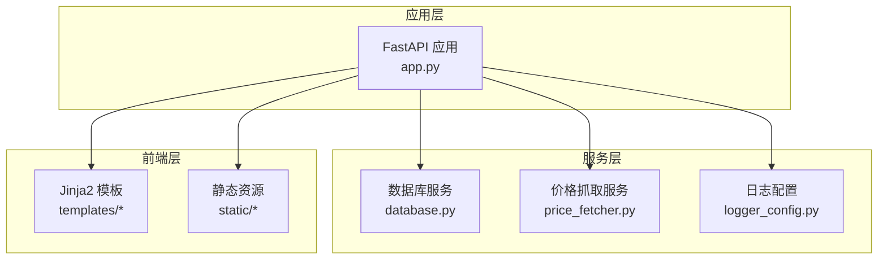
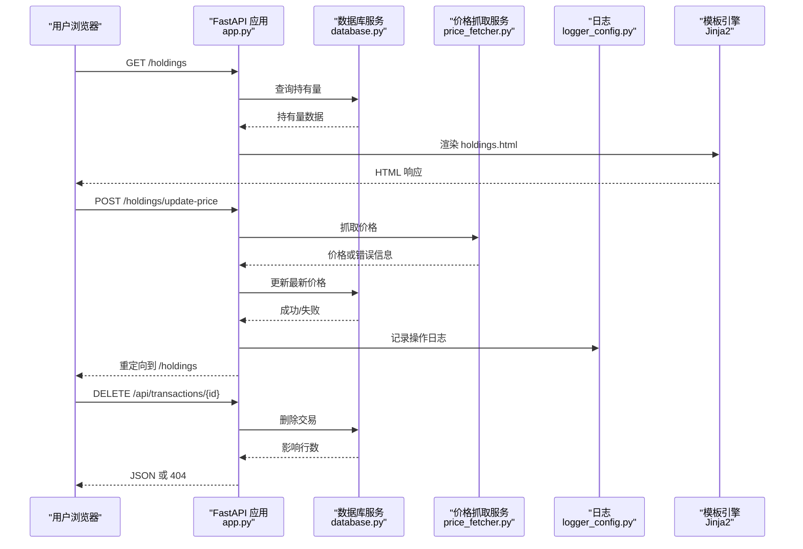
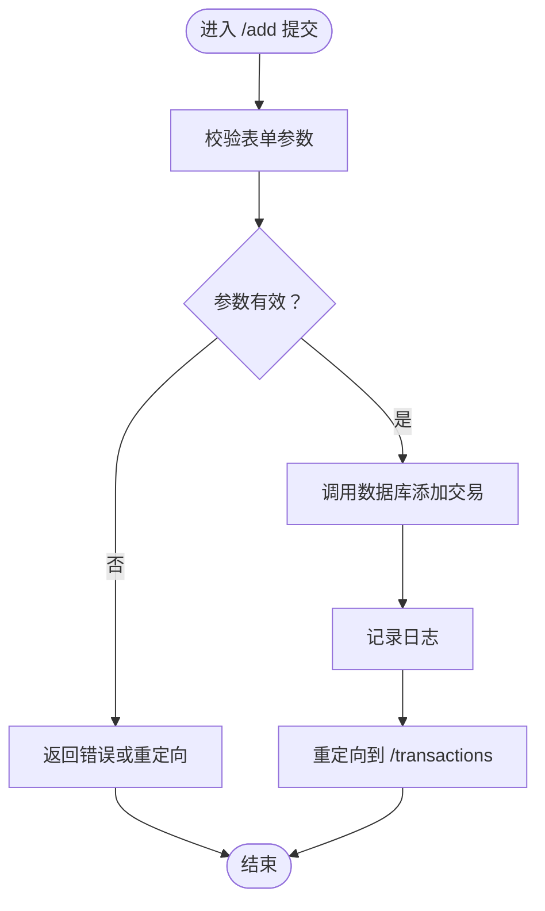
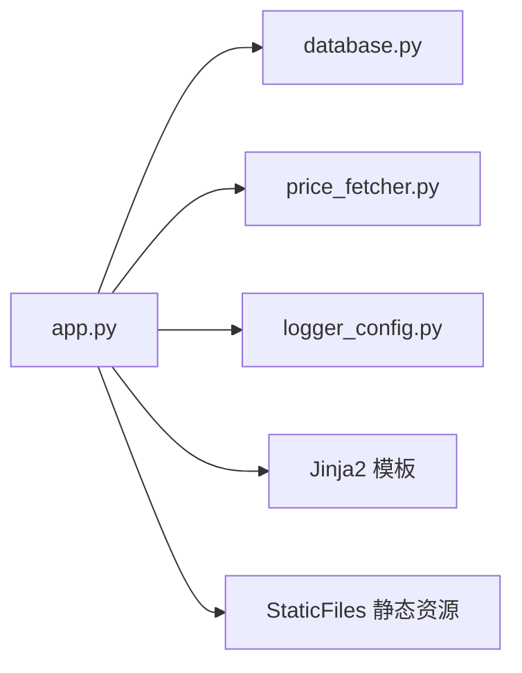
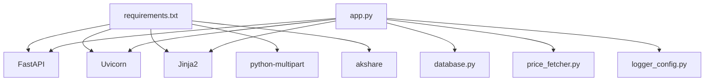

# 应用主模块

<cite>
**本文引用的文件**
- [app.py](file://app.py)
- [database.py](file://database.py)
- [logger_config.py](file://logger_config.py)
- [price_fetcher.py](file://price_fetcher.py)
- [requirements.txt](file://requirements.txt)
- [templates/base.html](file://templates/base.html)
- [templates/index.html](file://templates/index.html)
- [templates/holdings.html](file://templates/holdings.html)
- [templates/transactions.html](file://templates/transactions.html)
- [templates/add.html](file://templates/add.html)
- [templates/symbol.html](file://templates/symbol.html)
- [static/style.css](file://static/style.css)
</cite>

## 目录
1. [简介](#简介)
2. [项目结构](#项目结构)
3. [核心组件](#核心组件)
4. [架构总览](#架构总览)
5. [详细组件分析](#详细组件分析)
6. [依赖关系分析](#依赖关系分析)
7. [性能考量](#性能考量)
8. [故障排查指南](#故障排查指南)
9. [结论](#结论)
10. [附录：扩展开发指南](#附录扩展开发指南)

## 简介
本文件为“投资日志管理系统”的应用主模块架构文档，聚焦于 FastAPI 应用实例的配置与初始化、MVC 架构模式实现、HTTP 路由设计（HTML 页面路由与 RESTful API 路由）、模板渲染机制（Jinja2 集成与静态资源服务）、业务逻辑处理流程（表单提交、数据验证、重定向）、依赖注入与模块协作、错误处理策略、日志记录机制以及性能优化建议，并提供扩展新路由与功能的开发指导。

## 项目结构
该应用采用以“功能-视图”为主的组织方式：
- 应用入口与路由：app.py
- 数据访问层：database.py（SQLite 操作、查询聚合）
- 日志配置：logger_config.py（TimedRotatingFileHandler）
- 价格抓取：price_fetcher.py（多数据源回退）
- 前端模板与静态资源：templates/*、static/*
- 依赖声明：requirements.txt

图表来源
- [app.py](file://app.py#L1-L444)
- [database.py](file://database.py#L1-L944)
- [price_fetcher.py](file://price_fetcher.py#L1-L398)
- [logger_config.py](file://logger_config.py#L1-L54)
- [templates/base.html](file://templates/base.html#L1-L27)
- [static/style.css](file://static/style.css#L1-L934)

章节来源
- [app.py](file://app.py#L1-L444)
- [requirements.txt](file://requirements.txt#L1-L6)

## 核心组件
- FastAPI 应用实例与生命周期
  - 应用实例创建、模板与静态资源挂载、启动事件初始化数据库
- MVC 架构
  - 视图：Jinja2 模板渲染 HTML 页面
  - 控制器：FastAPI 路由处理器
  - 模型：database.py 提供数据访问与聚合
- 路由体系
  - HTML 页面路由：首页、交易列表、新增交易、图表、持仓详情、符号详情、设置等
  - RESTful API 路由：持有量、历史、删除交易等
- 依赖注入与协作
  - app.py 注入 database、price_fetcher、logger_config
- 错误处理与日志
  - 使用 logger 记录关键操作；API 删除失败返回 404 并抛出异常
- 性能与可用性
  - 启动时初始化数据库索引；模板中使用分页与图表；API 返回聚合数据

章节来源
- [app.py](file://app.py#L19-L30)
- [app.py](file://app.py#L36-L371)
- [app.py](file://app.py#L376-L439)
- [database.py](file://database.py#L20-L149)
- [logger_config.py](file://logger_config.py#L14-L54)

## 架构总览
应用采用“控制器-服务-模型-模板”的分层架构：
- 控制器层：FastAPI 路由处理器负责请求解析、参数校验、调用服务、响应生成
- 服务层：database.py 提供事务、持有量、价格、设置等数据服务；price_fetcher.py 提供价格抓取与回退
- 模板层：Jinja2 渲染 HTML，静态资源通过 StaticFiles 提供
- 日志层：logger_config 提供文件与控制台日志

图表来源
- [app.py](file://app.py#L216-L291)
- [app.py](file://app.py#L431-L439)
- [database.py](file://database.py#L779-L800)
- [price_fetcher.py](file://price_fetcher.py#L321-L394)
- [logger_config.py](file://logger_config.py#L14-L54)

## 详细组件分析

### FastAPI 应用实例与初始化
- 应用实例创建与标题设置
- 模板与静态资源挂载
  - Jinja2Templates 指向 templates 目录
  - StaticFiles 挂载 /static 到 static 目录
- 启动事件
  - on_event("startup") 初始化数据库与索引
- 日志初始化
  - logger_config.logger 提供全局日志实例

章节来源
- [app.py](file://app.py#L19-L30)
- [app.py](file://app.py#L21-L23)
- [logger_config.py](file://logger_config.py#L14-L54)

### HTML 页面路由
- 首页仪表盘：按货币汇总持有量与资产类型占比
- 交易列表：分页展示交易记录，支持删除（通过 API）
- 新增交易：表单收集交易信息，提交后重定向至交易列表
- 图表页面：按符号与货币维度展示持有情况
- 持仓详情：按货币与符号汇总，支持批量更新价格与快速交易
- 符号详情：显示某符号在指定货币与年份内的交易历史，支持价值调整
- 设置页面：配置资产类型与各货币下的资产配置区间

章节来源
- [app.py](file://app.py#L36-L188)
- [app.py](file://app.py#L294-L370)

### RESTful API 路由
- 获取持有量：支持按账户过滤
- 按货币汇总持有量：含资产类型占比与配置区间告警
- 获取交易：支持按符号、账户、类型、时间范围过滤
- 组合历史：计算累计投资价值序列
- 删除交易：返回状态或 404

章节来源
- [app.py](file://app.py#L376-L439)

### 模板渲染机制与静态资源
- 模板基模板 base.html 定义导航、样式链接与 Chart.js 引入
- 各页面模板继承 base.html 并填充内容块
- 静态资源通过 /static 提供，如样式文件 style.css
- 模板中使用 Jinja2 过滤器进行格式化与国际化标签映射

章节来源
- [templates/base.html](file://templates/base.html#L1-L27)
- [templates/index.html](file://templates/index.html#L1-L90)
- [templates/holdings.html](file://templates/holdings.html#L1-L177)
- [templates/transactions.html](file://templates/transactions.html#L1-L91)
- [templates/add.html](file://templates/add.html#L1-L111)
- [templates/symbol.html](file://templates/symbol.html#L1-L105)
- [static/style.css](file://static/style.css#L1-L934)

### 业务逻辑处理流程
- 表单提交处理
  - 新增交易：接收表单字段，调用数据库添加交易，记录日志，重定向
  - 快速交易：从持有详情页发起，直接创建交易记录
  - 价格更新：调用价格抓取服务，成功则写入最新价格并记录操作日志，失败记录失败日志
  - 价值调整：基于当前持有成本与目标值差额创建 ADJUST 交易
- 数据验证
  - 路由参数与表单字段使用 FastAPI 的类型注解与 Form(...) 进行基础校验
  - 数据库层对枚举字段进行约束检查
- 重定向机制
  - 多处使用 RedirectResponse 实现“提交即重定向”，避免重复提交与刷新问题

图表来源
- [app.py](file://app.py#L83-L111)
- [database.py](file://database.py#L156-L194)
- [logger_config.py](file://logger_config.py#L14-L54)

### 依赖注入与模块协作
- app.py 作为中心协调者，导入 database、price_fetcher、logger_config
- 路由处理器直接调用 database 与 price_fetcher 的函数
- 模板渲染通过 Jinja2Templates 与 StaticFiles 提供静态资源

图表来源
- [app.py](file://app.py#L15-L17)
- [app.py](file://app.py#L21-L23)

### 错误处理策略
- API 删除交易：若不存在返回 404 并抛出 HTTPException
- 价格抓取失败：记录失败日志并返回错误消息，前端通过查询参数提示用户
- 日志记录：INFO/WARNING/ERROR 分级记录关键操作与异常

章节来源
- [app.py](file://app.py#L431-L439)
- [price_fetcher.py](file://price_fetcher.py#L321-L394)
- [logger_config.py](file://logger_config.py#L14-L54)

### 日志记录机制
- 文件轮转：按天轮换，保留最近 7 天日志
- 输出：同时输出到文件与控制台
- 使用：在交易新增、价格更新、价值调整、删除交易等关键路径记录日志

章节来源
- [logger_config.py](file://logger_config.py#L14-L54)
- [app.py](file://app.py#L109-L110)
- [app.py](file://app.py#L247-L261)
- [app.py](file://app.py#L290-L291)

## 依赖关系分析
- 应用依赖
  - FastAPI、Jinja2、Uvicorn、python-multipart
  - 可选依赖：akshare（价格抓取）
- 模块耦合
  - app.py 与 database.py、price_fetcher.py、logger_config.py 存在直接调用关系
  - 模板与静态资源通过 FastAPI 挂载，无直接代码耦合
- 外部依赖
  - SQLite（本地文件）；网络数据源（价格抓取）

图表来源
- [requirements.txt](file://requirements.txt#L1-L6)
- [app.py](file://app.py#L7-L17)

章节来源
- [requirements.txt](file://requirements.txt#L1-L6)

## 性能考量
- 数据库初始化与索引
  - 启动时创建必要表与索引，减少查询开销
- 查询与聚合
  - 持有量与按货币/资产类型汇总在数据库层完成，返回 JSON，前端渲染
- 分页与限制
  - 交易列表分页，API 默认限制返回条数
- 前端交互
  - Chart.js 在客户端渲染，减少服务器压力
- 日志轮转
  - 避免日志文件无限增长

章节来源
- [database.py](file://database.py#L20-L149)
- [app.py](file://app.py#L48-L66)
- [app.py](file://app.py#L388-L401)

## 故障排查指南
- 无法加载模板或样式
  - 检查 templates 与 static 目录路径是否正确
  - 确认 FastAPI 已挂载 /static 与模板目录
- 交易无法删除
  - 检查 API 返回状态码；确认交易 ID 是否存在
- 价格无法更新
  - 查看日志中价格抓取失败原因；确认网络与可选依赖安装
- 数据库异常
  - 检查数据库初始化是否成功；确认表与索引是否存在

章节来源
- [app.py](file://app.py#L21-L23)
- [app.py](file://app.py#L431-L439)
- [price_fetcher.py](file://price_fetcher.py#L321-L394)
- [database.py](file://database.py#L20-L149)

## 结论
该应用以 FastAPI 为核心，结合 Jinja2 模板与 SQLite 数据库，实现了清晰的 MVC 分层与前后端分离的界面。通过启动事件初始化数据库、模板与静态资源挂载、统一的日志记录与错误处理，系统具备良好的可维护性与扩展性。API 与页面路由设计兼顾用户体验与数据一致性，适合进一步扩展更多资产类型与分析维度。

## 附录：扩展开发指南
- 扩展新页面路由
  - 在 app.py 中新增路由装饰器与处理器，渲染对应模板
  - 如需数据，先在 database.py 添加查询函数，再在路由中调用
- 扩展新 API
  - 在 app.py 中新增 API 路由，返回 JSON 数据
  - 在 database.py 中完善查询与聚合逻辑
- 新增资产类型
  - 在 database.py 中扩展资产类型表与默认值；在模板中更新选择项
- 集成新价格源
  - 在 price_fetcher.py 中新增抓取函数与回退链路
- 前端交互增强
  - 在模板中引入新的 JS 组件或修改现有交互逻辑
- 性能优化建议
  - 对高频查询建立索引；缓存热点数据；分页与限制返回量
  - 将复杂计算迁移至数据库层或异步任务队列

章节来源
- [app.py](file://app.py#L36-L371)
- [app.py](file://app.py#L376-L439)
- [database.py](file://database.py#L88-L112)
- [price_fetcher.py](file://price_fetcher.py#L321-L394)