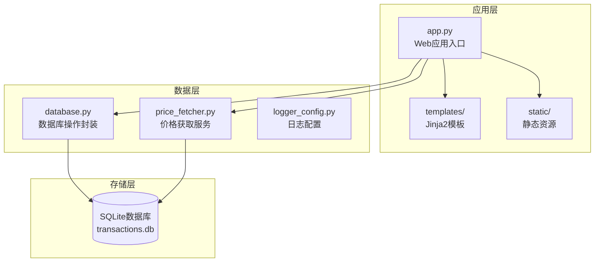
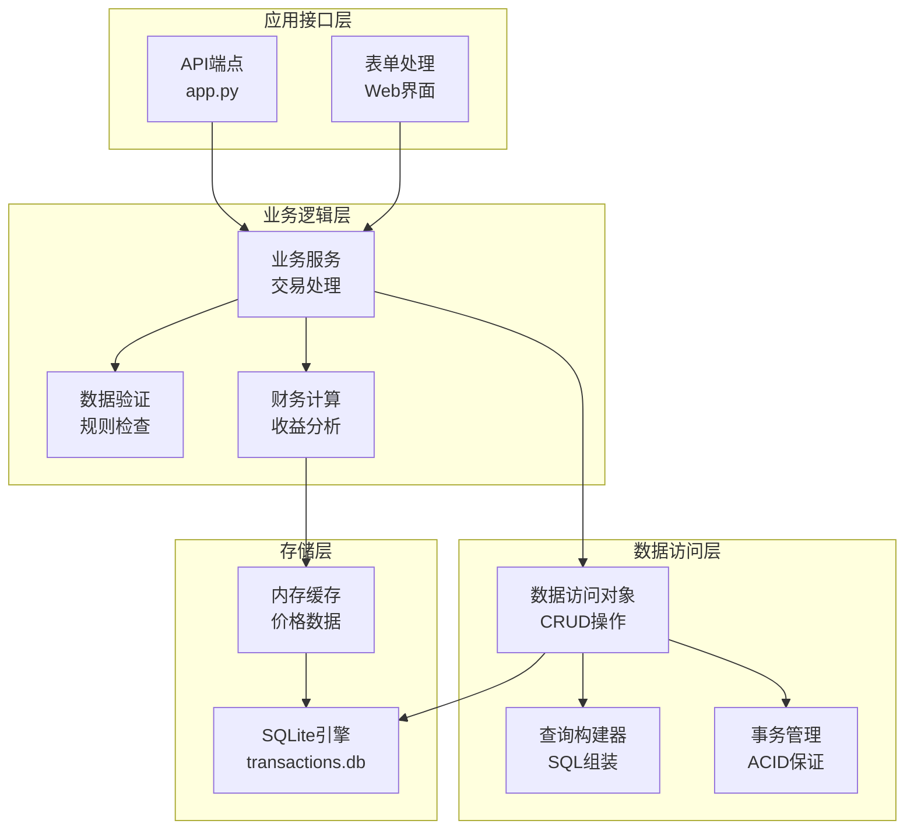
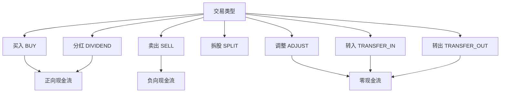
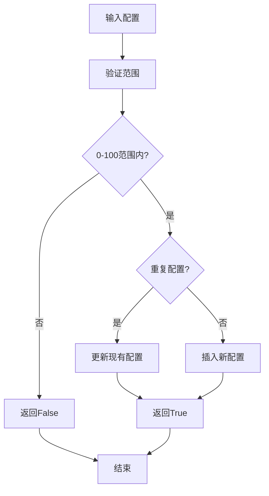
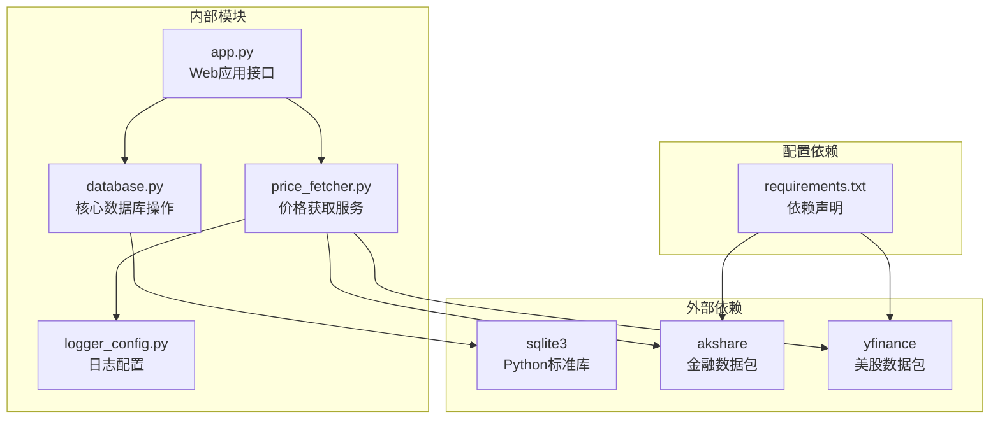
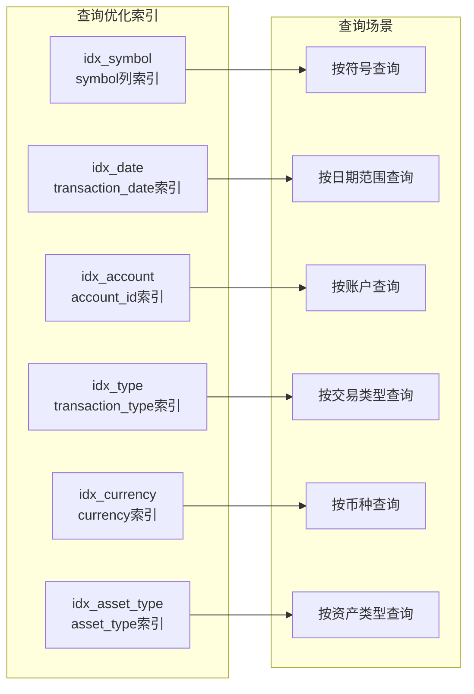
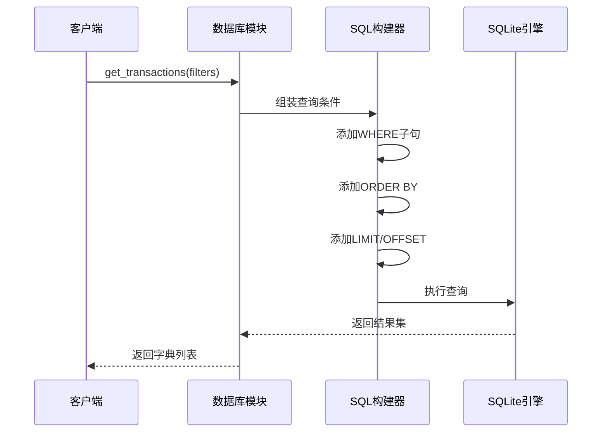
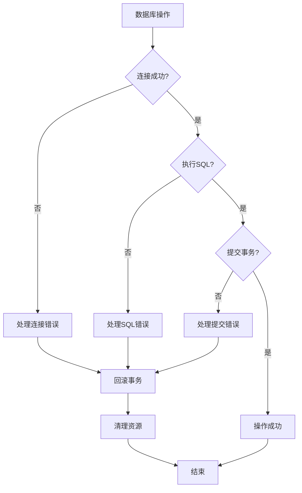
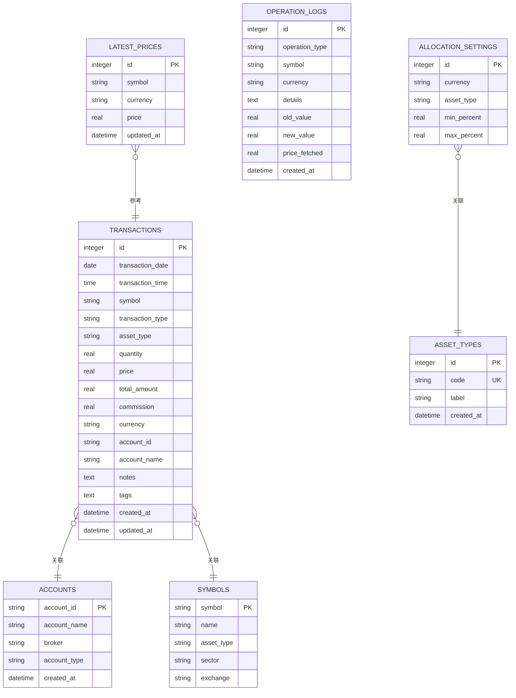

# 数据库模块

<cite>
**本文档引用的文件**
- [database.py](file://database.py)
- [app.py](file://app.py)
- [price_fetcher.py](file://price_fetcher.py)
- [logger_config.py](file://logger_config.py)
- [requirements.txt](file://requirements.txt)
</cite>

## 目录
1. [简介](#简介)
2. [项目结构](#项目结构)
3. [核心组件](#核心组件)
4. [架构概览](#架构概览)
5. [详细组件分析](#详细组件分析)
6. [依赖关系分析](#依赖关系分析)
7. [性能考虑](#性能考虑)
8. [故障排除指南](#故障排除指南)
9. [结论](#结论)
10. [附录](#附录)

## 简介

投资日志管理系统数据库模块是整个应用的核心数据层，基于SQLite实现了完整的投资交易记录管理功能。该模块提供了从基础的CRUD操作到复杂的财务分析计算的全方位数据管理能力，支持多币种、多资产类型的综合投资组合管理。

系统采用Python标准库sqlite3进行数据库操作，通过精心设计的表结构和索引策略，确保在中小型投资组合管理场景下的高效性能。模块化的设计使得数据访问层与业务逻辑层清晰分离，便于维护和扩展。

## 项目结构

数据库模块在整个项目中的位置和作用：



**图表来源**
- [app.py](file://app.py#L1-L50)
- [database.py](file://database.py#L1-L30)
- [price_fetcher.py](file://price_fetcher.py#L1-L30)

**章节来源**
- [app.py](file://app.py#L1-L50)
- [database.py](file://database.py#L1-L30)

## 核心组件

数据库模块的核心功能围绕以下关键组件构建：

### 主要数据表结构

系统包含七个核心数据表，每个表都有明确的职责分工：

1. **transactions**: 交易记录表 - 存储所有投资交易详情
2. **accounts**: 账户表 - 管理投资账户信息
3. **symbols**: 股票代码表 - 维护股票基本信息
4. **allocation_settings**: 配置设置表 - 定义资产配置范围
5. **asset_types**: 资产类型表 - 支持动态资产类型管理
6. **operation_logs**: 操作日志表 - 记录系统操作历史
7. **latest_prices**: 最新价格表 - 缓存实时市场数据

### 数据访问模式

模块采用函数式编程模式，每个数据表对应一组标准的操作函数：
- CRUD操作：添加、查询、更新、删除
- 复合查询：按条件过滤、分页查询、统计分析
- 批量操作：批量插入、批量更新
- 事务管理：自动提交、异常处理

**章节来源**
- [database.py](file://database.py#L20-L150)
- [database.py](file://database.py#L155-L310)

## 架构概览

数据库模块的整体架构设计体现了良好的分层原则和关注点分离：



**图表来源**
- [app.py](file://app.py#L25-L30)
- [database.py](file://database.py#L13-L17)
- [price_fetcher.py](file://price_fetcher.py#L321-L394)

## 详细组件分析

### 交易记录表 (transactions)

交易记录表是系统的核心数据表，设计了完整的投资交易生命周期管理：

#### 字段设计原则

| 字段名 | 类型 | 约束 | 用途 | 设计考量 |
|--------|------|------|------|----------|
| id | INTEGER | PRIMARY KEY, AUTOINCREMENT | 主键标识 | 唯一性标识，自动递增 |
| transaction_date | DATE | NOT NULL | 交易日期 | 时间维度分析 |
| transaction_time | TIME | NULL | 交易时间 | 精确到秒的时间戳 |
| symbol | TEXT | NOT NULL, UPPER | 证券代码 | 统一格式，便于查询 |
| transaction_type | TEXT | NOT NULL, CHECK | 交易类型 | 严格枚举值控制 |
| asset_type | TEXT | DEFAULT 'stock', CHECK | 资产类型 | 支持多资产类别 |
| quantity | REAL | NOT NULL | 数量 | 支持小数份额 |
| price | REAL | NOT NULL | 单价 | 支持精确价格 |
| total_amount | REAL | NOT NULL | 总金额 | 自动计算字段 |
| commission | REAL | DEFAULT 0 | 手续费 | 可选费用项 |
| currency | TEXT | DEFAULT 'CNY', CHECK | 币种 | 多币种支持 |
| account_id | TEXT | NOT NULL | 账户标识 | 关联账户表 |
| account_name | TEXT | NULL | 账户名称 | 显示用名称 |
| notes | TEXT | NULL | 备注 | 用户自定义说明 |
| tags | TEXT | NULL | 标签 | 分类标记 |
| created_at | DATETIME | DEFAULT CURRENT_TIMESTAMP | 创建时间 | 数据审计 |
| updated_at | DATETIME | NULL | 更新时间 | 变更追踪 |

#### 交易类型枚举

系统支持多种交易类型，每种类型都有特定的业务含义：



**图表来源**
- [database.py](file://database.py#L32-L33)

#### 数据完整性约束

- **CHECK约束**: 严格的枚举值验证
- **默认值**: 合理的默认值设置
- **NOT NULL**: 关键字段强制约束
- **UNIQUE**: 复合唯一约束

**章节来源**
- [database.py](file://database.py#L25-L46)

### 账户表 (accounts)

账户表设计简洁而实用，支持多账户投资管理：

#### 字段定义

| 字段名 | 类型 | 约束 | 描述 |
|--------|------|------|------|
| account_id | TEXT | PRIMARY KEY | 账户唯一标识符 |
| account_name | TEXT | NOT NULL | 账户显示名称 |
| broker | TEXT | NULL | 券商信息 |
| account_type | TEXT | NULL | 账户类型分类 |
| created_at | DATETIME | DEFAULT CURRENT_TIMESTAMP | 创建时间戳 |

#### 账户管理策略

- **主键设计**: 使用字符串标识符，便于用户记忆
- **扩展性**: 支持券商信息和账户类型分类
- **审计**: 自动记录创建时间

**章节来源**
- [database.py](file://database.py#L54-L63)

### 最新价格表 (latest_prices)

价格缓存表是系统性能优化的关键组件：

#### 表结构设计

| 字段名 | 类型 | 约束 | 描述 |
|--------|------|------|------|
| id | INTEGER | PRIMARY KEY, AUTOINCREMENT | 主键 |
| symbol | TEXT | NOT NULL | 证券代码 |
| currency | TEXT | NOT NULL | 币种 |
| price | REAL | NOT NULL | 当前价格 |
| updated_at | DATETIME | DEFAULT CURRENT_TIMESTAMP | 更新时间 |

#### 唯一性约束

- **复合唯一索引**: (symbol, currency) 确保每种组合的价格唯一性
- **自动更新**: 使用ON CONFLICT子句实现智能更新

**章节来源**
- [database.py](file://database.py#L128-L138)

### 资产类型表 (asset_types)

动态资产类型管理表支持灵活的资产分类：

#### 设计特点

- **独立于币种**: 资产类型与货币无关
- **代码-标签映射**: 提供国际化支持
- **默认初始化**: 应用启动时自动填充常用类型

#### 默认资产类型

| 代码 | 标签 | 说明 |
|------|------|------|
| stock | 股票 | 股权类投资 |
| bond | 债券 | 固定收益类 |
| metal | 贵金属 | 黄金等贵金属 |
| cash | 现金 | 现金及等价物 |

**章节来源**
- [database.py](file://database.py#L88-L112)

### 配置设置表 (allocation_settings)

资产配置管理表支持投资组合的动态监控：

#### 配置范围设计

- **最小百分比**: 下限阈值
- **最大百分比**: 上限阈值
- **唯一约束**: (currency, asset_type) 组合唯一

#### 验证规则



**图表来源**
- [database.py](file://database.py#L638-L642)

**章节来源**
- [database.py](file://database.py#L76-L86)

### 操作日志表 (operation_logs)

系统审计和调试的重要工具：

#### 日志记录内容

- **操作类型**: 具体执行的操作
- **影响范围**: 涉及的符号或币种
- **详细信息**: 操作结果或错误信息
- **数值变化**: 新旧值对比

#### 日志级别

- **成功操作**: PRICE_UPDATE
- **失败尝试**: PRICE_UPDATE_FAILED
- **手动调整**: ADJUST_VALUE

**章节来源**
- [database.py](file://database.py#L113-L126)

## 依赖关系分析

数据库模块的依赖关系体现了清晰的层次结构：



**图表来源**
- [requirements.txt](file://requirements.txt#L1-L6)
- [app.py](file://app.py#L15-L17)
- [price_fetcher.py](file://price_fetcher.py#L23-L34)

### 外部依赖分析

#### 必需依赖

- **fastapi**: Web框架，提供REST API和模板渲染
- **uvicorn**: ASGI服务器，用于生产部署
- **jinja2**: 模板引擎，支持HTML页面渲染

#### 可选依赖

- **akshare**: 中国金融市场数据获取
- **yfinance**: 美国和香港股市数据获取

**章节来源**
- [requirements.txt](file://requirements.txt#L1-L6)

## 性能考虑

数据库模块在性能方面采用了多项优化策略：

### 索引策略

系统建立了多个复合索引以优化常见查询：



**图表来源**
- [database.py](file://database.py#L140-L147)

### 查询优化技术

#### 动态SQL构建

模块使用动态SQL构建技术，根据查询条件灵活组装WHERE子句：



**图表来源**
- [database.py](file://database.py#L262-L310)

#### 连接池管理

虽然SQLite本身不支持传统意义上的连接池，但模块通过以下方式优化连接管理：

- **延迟连接**: 按需建立数据库连接
- **自动关闭**: 每次操作后自动关闭连接
- **Row Factory**: 使用sqlite3.Row提高查询效率

### 缓存策略

#### 内存缓存

系统实现了多级缓存策略：

1. **价格缓存**: latest_prices表缓存实时价格
2. **配置缓存**: 内存中缓存资产类型和配置信息
3. **查询结果缓存**: 对频繁访问的数据进行缓存

#### 缓存失效机制

- **时间戳驱动**: 基于updated_at字段的缓存更新
- **手动刷新**: 用户可主动触发数据刷新
- **过期策略**: 实现合理的缓存过期时间

**章节来源**
- [database.py](file://database.py#L815-L825)
- [database.py](file://database.py#L140-L147)

## 故障排除指南

### 常见问题诊断

#### 数据库初始化问题

**症状**: 应用启动时报错，提示表不存在

**解决方案**:
1. 检查数据库文件权限
2. 验证init_database()函数执行情况
3. 确认SQLite版本兼容性

#### 连接问题

**症状**: 查询超时或连接失败

**排查步骤**:
1. 检查数据库文件是否被其他进程占用
2. 验证磁盘空间充足
3. 确认路径权限正确

#### 数据一致性问题

**症状**: 交易记录显示异常

**诊断方法**:
1. 检查transaction_type枚举值
2. 验证quantity和price字段
3. 确认total_amount计算逻辑

### 错误处理机制

模块实现了完善的错误处理策略：



**图表来源**
- [database.py](file://database.py#L175-L193)

**章节来源**
- [database.py](file://database.py#L175-L193)

## 结论

投资日志管理系统的数据库模块展现了优秀的工程实践，通过精心设计的表结构、完善的约束机制和高效的查询优化，为投资组合管理提供了坚实的数据基础。

模块的主要优势包括：

1. **设计合理性**: 表结构符合业务需求，字段设计考虑周全
2. **性能优化**: 合理的索引策略和查询优化技术
3. **扩展性**: 支持动态资产类型和配置管理
4. **可靠性**: 完善的错误处理和数据验证机制
5. **易用性**: 清晰的API设计和丰富的查询功能

未来可以考虑的改进方向：
- 实现更高级的查询优化
- 增加数据备份和恢复机制
- 支持更复杂的投资产品类型
- 实现数据同步和多设备支持

## 附录

### 数据模型图



**图表来源**
- [database.py](file://database.py#L25-L138)

### 开发指南

#### 扩展新功能

1. **添加新表**: 在init_database()中定义表结构
2. **实现CRUD操作**: 创建对应的函数封装
3. **添加索引**: 优化常用查询性能
4. **编写测试**: 确保功能正确性

#### 自定义查询

```python
# 示例：实现自定义查询函数
def get_custom_report(filters):
    """实现自定义报表查询"""
    conn = get_connection()
    cursor = conn.cursor()
    
    # 构建复杂查询
    query = """
        SELECT column1, column2, COUNT(*) as count
        FROM table1 t1
        JOIN table2 t2 ON t1.id = t2.table1_id
        WHERE conditions
        GROUP BY column1, column2
        HAVING count > threshold
        ORDER BY column1
    """
    
    cursor.execute(query, params)
    results = cursor.fetchall()
    conn.close()
    
    return [dict(row) for row in results]
```

#### 性能调优建议

1. **定期分析**: 使用EXPLAIN QUERY PLAN分析慢查询
2. **索引优化**: 根据实际查询模式调整索引策略
3. **批量操作**: 对大量数据操作使用批量插入
4. **连接管理**: 控制同时打开的连接数量