# 核心模块架构

<cite>
**本文档引用的文件**
- [app.py](file://app.py)
- [database.py](file://database.py)
- [price_fetcher.py](file://price_fetcher.py)
- [logger_config.py](file://logger_config.py)
- [requirements.txt](file://requirements.txt)
</cite>

## 目录
1. [简介](#简介)
2. [项目结构](#项目结构)
3. [核心组件](#核心组件)
4. [架构概览](#架构概览)
5. [详细组件分析](#详细组件分析)
6. [依赖关系分析](#依赖关系分析)
7. [性能考虑](#性能考虑)
8. [故障排除指南](#故障排除指南)
9. [结论](#结论)

## 简介

投资日志管理系统是一个基于FastAPI构建的Web应用程序，用于跟踪和管理股票、债券、贵金属等各类资产的投资交易记录。该系统采用MVC架构模式，通过三个核心模块协同工作：应用主模块负责Web界面和API路由，数据库模块处理数据持久化和查询，价格获取模块提供多数据源的实时价格服务。

系统的主要功能包括：
- 资产交易记录管理（买入、卖出、分红、拆分等）
- 持仓组合分析和可视化
- 多货币支持（人民币、美元、港币）
- 动态资产类型管理
- 实时价格获取和历史价格追踪
- 投资组合配置监控

## 项目结构

项目采用模块化设计，每个核心功能都封装在独立的Python模块中：

```mermaid
graph TB
subgraph "项目根目录"
A[app.py<br/>应用主模块]
B[database.py<br/>数据库模块]
C[price_fetcher.py<br/>价格获取模块]
D[logger_config.py<br/>日志配置模块]
E[requirements.txt<br/>依赖配置]
end
subgraph "静态资源"
F[static/style.css<br/>样式文件]
end
subgraph "模板文件"
G[templates/base.html<br/>基础模板]
H[templates/index.html<br/>首页模板]
I[templates/transactions.html<br/>交易列表模板]
J[templates/holdings.html<br/>持仓详情模板]
K[templates/symbol.html<br/>个股详情模板]
L[templates/charts.html<br/>图表模板]
M[templates/settings.html<br/>设置模板]
N[templates/add.html<br/>添加交易模板]
end
A --> B
A --> C
A --> D
B --> D
C --> D
```



**图表来源**
- [app.py](file://app.py#L1-L50)
- [database.py](file://database.py#L1-L50)
- [price_fetcher.py](file://price_fetcher.py#L1-L50)

**章节来源**
- [app.py](file://app.py#L1-L50)
- [database.py](file://database.py#L1-L50)
- [price_fetcher.py](file://price_fetcher.py#L1-L50)
- [logger_config.py](file://logger_config.py#L1-L50)

## 核心组件

### 应用主模块 (app.py)

应用主模块是整个系统的入口点，采用FastAPI框架实现RESTful API和Web页面的统一管理。该模块实现了完整的MVC架构：

**设计模式特点：**
- **MVC架构**：视图层使用Jinja2模板引擎，控制器层处理HTTP请求，业务逻辑通过数据库模块提供
- **依赖注入**：通过模块导入实现简单的依赖注入机制
- **中间件模式**：使用FastAPI的事件处理器进行应用启动初始化

**核心功能模块：**
- **路由定义**：定义了12个主要路由，涵盖交易管理、持仓查询、价格更新等功能
- **模板渲染**：集成Jinja2模板引擎，提供动态页面生成
- **表单处理**：支持多种HTTP方法的表单提交和验证
- **API端点**：提供JSON格式的RESTful API接口

**章节来源**
- [app.py](file://app.py#L19-L30)
- [app.py](file://app.py#L36-L121)
- [app.py](file://app.py#L376-L428)

### 数据库模块 (database.py)

数据库模块提供了完整的SQLite数据访问层，实现了数据持久化和复杂查询功能：

**核心特性：**
- **连接管理**：提供统一的数据库连接工厂，启用Row工厂模式便于字典式访问
- **表结构设计**：包含交易表、账户表、资产类型表、分配设置表等多个关联表
- **事务处理**：通过显式的commit和close确保数据一致性
- **索引优化**：为常用查询字段建立索引提升查询性能

**数据模型设计：**
- **交易表**：存储详细的交易记录，支持多种交易类型
- **账户表**：管理投资账户信息
- **资产类型表**：支持动态资产类型管理
- **分配设置表**：配置不同货币下的资产配置范围
- **操作日志表**：记录系统重要操作的历史

**章节来源**
- [database.py](file://database.py#L13-L18)
- [database.py](file://database.py#L20-L149)
- [database.py](file://database.py#L312-L358)
- [database.py](file://database.py#L673-L726)

### 价格获取模块 (price_fetcher.py)

价格获取模块实现了多数据源架构，提供可靠的实时价格服务：

**多数据源架构：**
- **优先级顺序**：AKShare → Yahoo Finance → Sina Finance → Tencent Finance
- **市场覆盖**：支持A股、港股、美股、黄金等多种资产类别
- **回退机制**：当上游数据源失败时自动切换到备用数据源
- **错误处理**：完善的异常捕获和错误日志记录

**数据源特性：**
- **AKShare**：主要数据源，支持中国市场的各种金融产品
- **Yahoo Finance**：国际市场的权威数据源
- **Sina Finance**：国内主流财经网站API
- **Tencent Finance**：腾讯财讯API，提供备用选择

**章节来源**
- [price_fetcher.py](file://price_fetcher.py#L36-L62)
- [price_fetcher.py](file://price_fetcher.py#L321-L394)

## 架构概览

系统采用分层架构设计，三个核心模块通过清晰的边界协作：


**图表来源**
- [app.py](file://app.py#L36-L121)
- [database.py](file://database.py#L13-L18)
- [price_fetcher.py](file://price_fetcher.py#L321-L394)

### MVC架构实现

系统严格遵循MVC架构模式：

**Model层 (database.py)**
- 负责数据模型定义和数据库操作
- 提供数据验证和业务规则实现
- 管理数据库连接和事务

**View层 (app.py + templates/)**
- 使用Jinja2模板引擎生成HTML页面
- 处理用户界面展示逻辑
- 支持响应式设计和静态资源

**Controller层 (app.py)**
- 接收HTTP请求并解析参数
- 协调Model和View的交互
- 实现业务流程控制

**章节来源**
- [app.py](file://app.py#L36-L121)
- [database.py](file://database.py#L13-L18)
- [price_fetcher.py](file://price_fetcher.py#L321-L394)

## 详细组件分析

### 应用主模块详细分析

#### 路由系统设计

应用主模块定义了完整的路由体系，涵盖以下功能域：

```mermaid
graph LR
subgraph "页面路由"
A[/ - 首页]
B[/transactions - 交易列表]
C[/add - 添加交易]
D[/charts - 图表分析]
E[/holdings - 持仓详情]
F[/symbol/{symbol} - 个股详情]
G[/settings - 设置管理]
end
subgraph "API路由"
H[/api/holdings - 持仓查询]
I[/api/transactions - 交易查询]
J[/api/portfolio-history - 组合历史]
K[/api/transactions/{id} - 删除交易]
end
subgraph "操作路由"
L[/symbol/{symbol}/adjust - 价值调整]
M[/holdings/update-price - 更新价格]
N[/holdings/quick-trade - 快速交易]
O[/settings - 设置提交]
end
```

**图表来源**
- [app.py](file://app.py#L36-L121)
- [app.py](file://app.py#L376-L428)

#### 模板渲染机制

系统采用Jinja2模板引擎实现动态页面生成：

**模板继承体系：**
- `base.html`：定义基础布局和通用样式
- 页面模板：继承基础模板，实现特定功能
- 响应式设计：支持移动端和桌面端访问

**数据传递机制：**
- 通过TemplateResponse传递渲染上下文
- 支持复杂的嵌套数据结构
- 实现条件渲染和循环遍历

**章节来源**
- [app.py](file://app.py#L22-L23)
- [app.py](file://app.py#L36-L121)

### 数据库模块详细分析

#### 数据模型设计

数据库模块实现了完整的财务数据建模：


**图表来源**
- [database.py](file://database.py#L26-L74)
- [database.py](file://database.py#L88-L97)

#### 事务管理机制

数据库模块实现了完整的事务处理：

**连接管理：**
- 每次操作创建独立的数据库连接
- 使用Row工厂模式返回字典格式结果
- 自动关闭连接确保资源释放

**数据一致性保证：**
- 显式commit确保操作持久化
- 异常处理防止部分更新
- 原子性操作保证数据完整性

**章节来源**
- [database.py](file://database.py#L13-L18)
- [database.py](file://database.py#L156-L193)
- [database.py](file://database.py#L206-L244)

### 价格获取模块详细分析

#### 多数据源架构设计

价格获取模块实现了智能的数据源选择和回退机制：


**图表来源**
- [price_fetcher.py](file://price_fetcher.py#L321-L394)

#### 符号类型检测机制

系统实现了智能的符号类型识别：

**检测规则：**
- **A股**：以SH/SZ开头或6位数字代码
- **港股**：以HKD货币或5位数字代码
- **美股**：以USD货币或纯字母代码
- **黄金**：包含AU或GOLD标识
- **债券**：包含BOND标识

**章节来源**
- [price_fetcher.py](file://price_fetcher.py#L36-L62)
- [price_fetcher.py](file://price_fetcher.py#L346-L374)

## 依赖关系分析

系统采用模块化依赖设计，三个核心模块之间存在明确的依赖关系：


**图表来源**
- [requirements.txt](file://requirements.txt#L1-L6)
- [app.py](file://app.py#L7-L17)
- [database.py](file://database.py#L7-L10)
- [price_fetcher.py](file://price_fetcher.py#L22-L33)

### 依赖注入机制

系统实现了简单的依赖注入模式：

**模块导入方式：**
- 应用主模块通过导入语句注入数据库和价格获取模块
- 日志配置模块提供统一的日志接口
- 各模块间通过函数调用实现松耦合

**配置管理：**
- 数据库路径通过参数传递，支持灵活配置
- 日志级别和输出目标可配置
- 数据源可用性动态检测

**章节来源**
- [app.py](file://app.py#L15-L17)
- [database.py](file://database.py#L13-L18)
- [logger_config.py](file://logger_config.py#L14-L53)

## 性能考虑

### 数据库性能优化

**索引策略：**
- 在常用查询字段上建立索引（symbol、date、account_id等）
- 使用复合索引优化复杂查询
- 定期维护索引保持查询效率

**查询优化：**
- 使用参数化查询防止SQL注入
- 实现分页查询避免大数据集加载
- 缓存常用查询结果

**事务管理：**
- 短事务原则，减少锁持有时间
- 批量操作合并减少往返次数
- 连接池管理优化资源使用

### 网络性能优化

**价格获取优化：**
- 异步数据源访问减少等待时间
- 结果缓存避免重复请求
- 超时控制防止阻塞

**模板渲染优化：**
- 模板预编译减少运行时开销
- 静态资源缓存提升页面加载速度
- 压缩传输减少带宽占用

### 内存管理

**资源清理：**
- 及时关闭数据库连接和文件句柄
- 使用上下文管理器确保资源释放
- 定期清理临时数据和缓存

**内存优化：**
- 分批处理大数据集
- 使用生成器减少内存占用
- 及时释放不再使用的对象

## 故障排除指南

### 常见问题诊断

**数据库连接问题：**
- 检查数据库文件权限和路径
- 验证SQLite3安装状态
- 查看连接超时设置

**价格获取失败：**
- 确认网络连接状态
- 检查数据源API可用性
- 验证符号格式正确性

**模板渲染错误：**
- 检查模板语法和变量引用
- 验证数据类型匹配
- 查看模板文件编码

### 日志分析

系统提供了全面的日志记录机制：

**日志级别：**
- INFO：正常操作和状态信息
- WARNING：潜在问题和异常情况
- ERROR：严重错误和异常

**日志内容：**
- 操作时间戳和用户信息
- 错误堆栈和调试信息
- 性能指标和统计信息

**章节来源**
- [logger_config.py](file://logger_config.py#L14-L53)
- [app.py](file://app.py#L109-L110)
- [price_fetcher.py](file://price_fetcher.py#L82-L83)

### 调试技巧

**开发环境配置：**
- 启用FastAPI的调试模式
- 配置详细的日志输出
- 使用浏览器开发者工具

**生产环境监控：**
- 设置健康检查端点
- 监控数据库连接池
- 跟踪API响应时间

## 结论

投资日志管理系统通过精心设计的三层架构，实现了功能完整、性能优良的投资管理解决方案。三个核心模块各司其职，通过清晰的接口和依赖关系实现松耦合协作。

**技术优势：**
- **模块化设计**：每个模块职责明确，易于维护和扩展
- **MVC架构**：清晰的层次分离，便于团队协作开发
- **多数据源支持**：提高系统可靠性和数据准确性
- **性能优化**：合理的数据库设计和查询优化

**扩展性考虑：**
- 支持新的资产类型和交易类型
- 可插拔的价格数据源架构
- 灵活的配置管理和用户定制
- 完善的API接口便于第三方集成

**未来发展方向：**
- 引入缓存层提升查询性能
- 实现异步任务处理价格更新
- 增强数据分析和报告功能
- 支持更多国际化需求

该系统为个人投资者提供了一个功能完善、易于使用的投资管理平台，通过持续的优化和扩展，能够满足不断增长的业务需求。