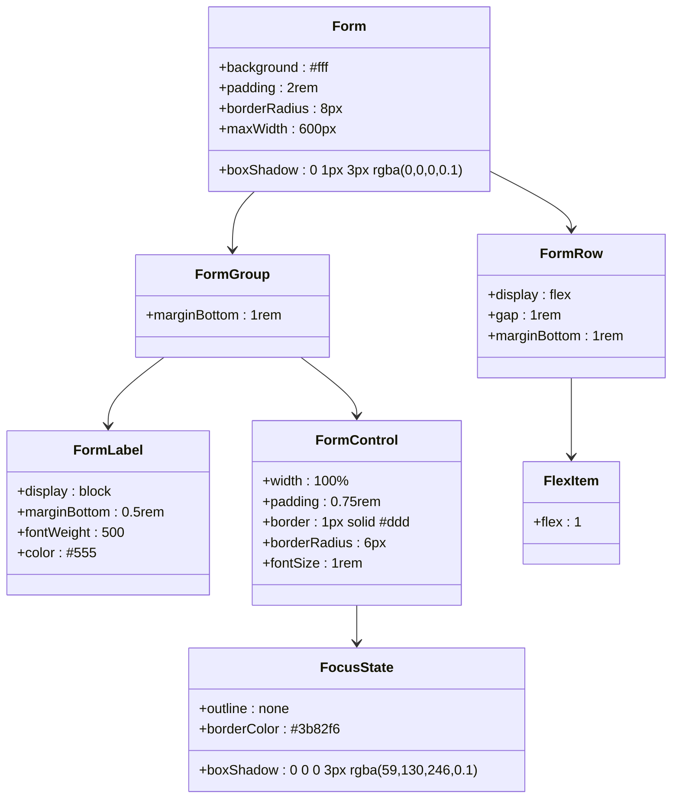

# 样式设计与响应式布局

<cite>
**本文档引用的文件**
- [static/style.css](file://static/style.css)
- [templates/base.html](file://templates/base.html)
- [templates/index.html](file://templates/index.html)
- [templates/charts.html](file://templates/charts.html)
- [templates/holdings.html](file://templates/holdings.html)
- [templates/transactions.html](file://templates/transactions.html)
- [templates/symbol.html](file://templates/symbol.html)
- [templates/settings.html](file://templates/settings.html)
- [app.py](file://app.py)
</cite>

## 目录
1. [简介](#简介)
2. [项目结构](#项目结构)
3. [核心组件](#核心组件)
4. [架构概览](#架构概览)
5. [详细组件分析](#详细组件分析)
6. [依赖关系分析](#依赖关系分析)
7. [性能考虑](#性能考虑)
8. [故障排除指南](#故障排除指南)
9. [结论](#结论)

## 简介

Invest Log 是一个基于 Python FastAPI 的投资交易记录管理系统。该项目采用简洁而现代的样式设计，注重响应式布局和用户体验。本文档深入分析了项目的 CSS 架构组织结构、命名规范、响应式设计策略以及各种 UI 组件的视觉设计。

## 项目结构

项目采用经典的前后端分离架构，静态资源与模板文件清晰分离：


**图表来源**
- [app.py](file://app.py#L1-L446)
- [templates/base.html](file://templates/base.html#L1-L27)

**章节来源**
- [app.py](file://app.py#L1-L446)
- [templates/base.html](file://templates/base.html#L1-L27)

## 核心组件

### 设计系统基础

项目采用了统一的设计语言和组件体系：

#### 色彩方案
- **主色调**: 深蓝色 (#1a1a2e) - 用于导航栏和强调元素
- **辅助色**: 蓝色 (#3b82f6) - 用于按钮和链接
- **状态色**: 
  - 绿色 (#059669) - 正面收益
  - 红色 (#dc2626) - 负面收益
  - 黄色 (#f59e0b) - 警告状态
- **背景色**: 浅灰色 (#f5f5f5) - 页面背景
- **文本色**: 深灰 (#333) - 主要文本

#### 字体系统
- **系统字体栈**: -apple-system, BlinkMacSystemFont, 'Segoe UI', Roboto, sans-serif
- **行高**: 1.6 - 提升可读性
- **字号层次**: 从 0.75rem 到 2rem 的渐进式字号系统

#### 间距系统
- **基础单位**: 0.25rem (4px) - 所有间距基于此单位
- **容器间距**: 1rem 到 2rem 的主要间距
- **组件间距**: 0.5rem 到 1.5rem 的内部间距

**章节来源**
- [static/style.css](file://static/style.css#L1-L12)
- [static/style.css](file://static/style.css#L14-L122)

## 架构概览

项目采用模块化的样式架构，通过 BEM 风格的类名组织和 CSS 自定义属性实现主题化：


**图表来源**
- [static/style.css](file://static/style.css#L1-L934)
- [templates/base.html](file://templates/base.html#L1-L27)

## 详细组件分析

### 导航栏设计

导航栏采用深色主题设计，提供清晰的页面导航：


**图表来源**
- [static/style.css](file://static/style.css#L14-L38)
- [templates/base.html](file://templates/base.html#L11-L21)

导航栏设计特点：
- **深色背景**: 使用 #1a1a2e 提供对比度
- **品牌标识**: 白色字体突出品牌名称
- **链接状态**: 默认浅灰，悬停和激活时变为白色
- **过渡效果**: 0.2秒的颜色过渡提升交互体验

**章节来源**
- [static/style.css](file://static/style.css#L14-L38)
- [templates/base.html](file://templates/base.html#L11-L21)

### 卡片组件系统

项目实现了统一的卡片组件设计，支持多种变体：


**图表来源**
- [static/style.css](file://static/style.css#L63-L934)

卡片组件设计原则：
- **圆角设计**: 8px-12px 圆角提供柔和外观
- **阴影系统**: 1px 阴影提供层次感
- **内边距**: 1.5rem-2rem 内边距确保内容不拥挤
- **渐变背景**: 关键信息卡片使用蓝色渐变增强视觉重点

**章节来源**
- [static/style.css](file://static/style.css#L63-L934)

### 表格样式设计

表格采用现代化设计，注重数据可读性和交互性：


**图表来源**
- [static/style.css](file://static/style.css#L83-L118)

表格设计特点：
- **悬停效果**: 行悬停时背景色变化
- **分隔线**: 底部分隔线提供清晰的行边界
- **标题样式**: 大写标题和细小字号提升可读性
- **空状态**: 友好的空数据提示

**章节来源**
- [static/style.css](file://static/style.css#L83-L118)

### 表单控件系统

表单控件采用一致的设计语言，支持响应式布局：



**图表来源**
- [static/style.css](file://static/style.css#L183-L228)

表单设计原则：
- **一致性**: 所有输入控件使用相同的边框和圆角
- **焦点状态**: 统一的蓝色焦点环增强可用性
- **响应式布局**: 表单行在移动端自动垂直排列
- **标签系统**: 明确的标签和权重提升理解度

**章节来源**
- [static/style.css](file://static/style.css#L183-L228)

### 按钮系统设计

按钮系统采用多态设计，支持不同状态和尺寸：


**图表来源**
- [static/style.css](file://static/style.css#L147-L181)

按钮设计特点：
- **状态管理**: 悬停时自动调整透明度和颜色
- **尺寸变体**: 支持小号、标准、大号按钮
- **语义化**: 删除按钮使用红色强调危险操作
- **过渡效果**: 0.2秒平滑过渡提升交互体验

**章节来源**
- [static/style.css](file://static/style.css#L147-L181)

### 徽章系统设计

徽章系统用于显示交易类型和资产类别状态：


**图表来源**
- [static/style.css](file://static/style.css#L125-L144)

徽章设计原则：
- **颜色编码**: 不同类型使用不同颜色区分
- **语义化**: 颜色直接反映交易性质
- **一致性**: 统一的圆角和字体大小
- **可访问性**: 足够的颜色对比度

**章节来源**
- [static/style.css](file://static/style.css#L125-L144)

### 响应式设计策略

项目采用移动优先的设计理念，通过媒体查询实现自适应布局：

```mermaid
flowchart TD
MobileFirst[移动优先设计] --> BaseLayout[基础布局]
BaseLayout --> DesktopLayout[桌面端增强]
BaseLayout --> MediaQuery768{
@media (max-width: 768px)
}
MediaQuery768 --> MobileGrid[移动端网格]
MediaQuery768 --> MobileForm[移动端表单]
MediaQuery768 --> MobileTable[移动端表格]
MobileGrid --> GridAutoFit[grid-template-columns: 1fr]
MobileForm --> FlexColumn[flex-direction: column]
MobileTable --> CompactPadding[紧凑内边距]
DesktopLayout --> DesktopGrid[桌面端网格]
DesktopGrid --> AutoFitColumns[auto-fit列宽]
DesktopGrid --> ResponsiveGap[响应式间距]
```

**图表来源**
- [static/style.css](file://static/style.css#L256-L274)

响应式断点设置：
- **主要断点**: 768px (iPad 竖屏)
- **移动端优化**: 
  - 网格系统切换为单列
  - 表单行垂直排列
  - 缩小内边距和字体大小
- **桌面端增强**: 
  - 网格系统恢复多列布局
  - 增加内边距和间距
  - 保持视觉层次

**章节来源**
- [static/style.css](file://static/style.css#L256-L274)

### 动画效果与过渡

项目实现了多种动画效果来增强用户体验：


**图表来源**
- [static/style.css](file://static/style.css#L32-L38)
- [static/style.css](file://static/style.css#L157-L162)
- [static/style.css](file://static/style.css#L358-L359)

动画效果实现：
- **颜色过渡**: 导航链接和按钮的颜色变化
- **宽度动画**: 分配条目的宽度变化
- **透明度变化**: 删除按钮的透明度控制
- **阴影效果**: 表单控件的焦点阴影

**章节来源**
- [static/style.css](file://static/style.css#L32-L38)
- [static/style.css](file://static/style.css#L157-L162)
- [static/style.css](file://static/style.css#L358-L359)

### 主题定制系统

项目通过 CSS 自定义属性实现主题定制：


**图表来源**
- [templates/charts.html](file://templates/charts.html#L35-L54)

主题定制方法：
- **CSS变量**: 使用 var(--variable-name) 实现动态主题
- **颜色映射**: 在模板中定义颜色映射表
- **渐变支持**: 卡片使用线性渐变增强视觉效果
- **状态颜色**: 通过不同的颜色表示不同的状态

**章节来源**
- [templates/charts.html](file://templates/charts.html#L35-L54)

## 依赖关系分析

项目样式系统的依赖关系清晰明确：


**图表来源**
- [app.py](file://app.py#L21-L23)
- [templates/base.html](file://templates/base.html#L7-L8)

依赖关系特点：
- **单向依赖**: 模板文件依赖基础样式，但样式不依赖模板
- **运行时加载**: 样式文件通过静态文件服务提供
- **模板继承**: 所有页面都继承基础模板，确保样式一致性
- **组件复用**: 样式类在多个页面中重复使用

**章节来源**
- [app.py](file://app.py#L21-L23)
- [templates/base.html](file://templates/base.html#L7-L8)

## 性能考虑

### 样式优化策略

项目在样式设计中考虑了多项性能优化：

1. **CSS压缩**: 使用单一样式文件减少HTTP请求
2. **选择器优化**: 避免复杂的嵌套选择器
3. **动画性能**: 使用 transform 和 opacity 属性触发硬件加速
4. **响应式优化**: 移动端专用样式减少不必要的计算

### 加载性能


**图表来源**
- [app.py](file://app.py#L22-L23)

性能优化措施：
- **静态文件缓存**: FastAPI 静态文件服务提供缓存支持
- **CDN集成**: Chart.js 通过 CDN 加载减少本地体积
- **条件加载**: 按需加载 JavaScript 功能
- **CSS模块化**: 样式按功能模块组织便于维护

## 故障排除指南

### 常见样式问题

1. **样式不生效**
   - 检查 CSS 文件路径是否正确
   - 确认模板中正确引入样式文件
   - 验证浏览器缓存是否需要清除

2. **响应式问题**
   - 检查 viewport meta 标签设置
   - 验证媒体查询断点是否正确
   - 确认容器宽度设置

3. **组件显示异常**
   - 检查类名拼写和大小写
   - 验证 CSS 优先级冲突
   - 确认模板中的条件渲染逻辑

### 调试技巧

- **浏览器开发者工具**: 使用 Elements 面板检查样式应用
- **CSS 选择器测试**: 在 Console 中测试选择器匹配
- **响应式调试**: 使用设备模拟器测试不同屏幕尺寸
- **性能分析**: 使用 Performance 面板分析渲染性能

**章节来源**
- [templates/base.html](file://templates/base.html#L4-L8)

## 结论

Invest Log 项目展现了优秀的样式设计和响应式布局实践。通过统一的设计系统、模块化的组件架构和精心设计的响应式策略，项目实现了良好的用户体验和代码可维护性。

### 设计优势

1. **一致性**: 统一的色彩、字体和间距系统
2. **响应性**: 移动优先的设计理念
3. **可扩展性**: 模块化的样式架构便于扩展
4. **性能**: 优化的样式加载和渲染策略

### 改进建议

1. **主题系统**: 可以进一步完善 CSS 变量主题系统
2. **动画优化**: 可以添加更丰富的过渡效果
3. **无障碍支持**: 可以增强键盘导航和屏幕阅读器支持
4. **浏览器兼容**: 可以添加更多的浏览器前缀支持

该项目为类似的投资管理应用提供了优秀的样式设计参考，其模块化和响应式的设计理念值得借鉴和学习。