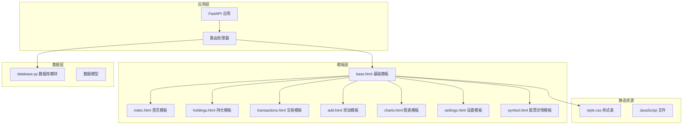
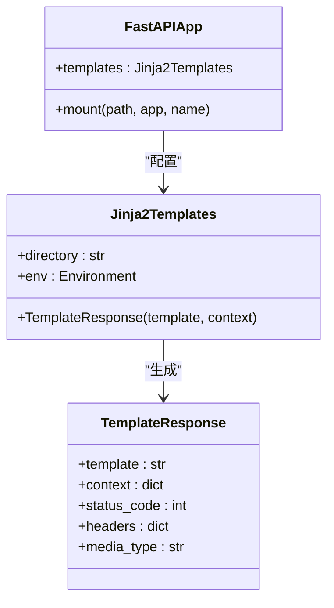
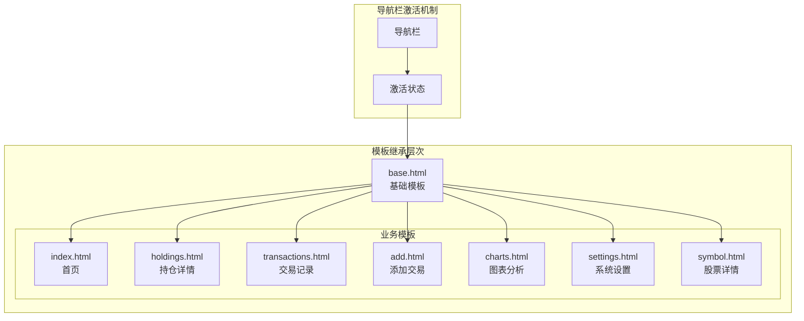
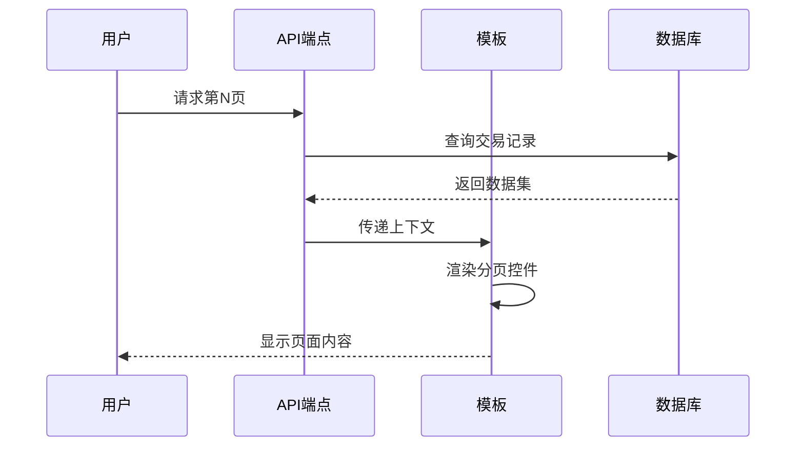
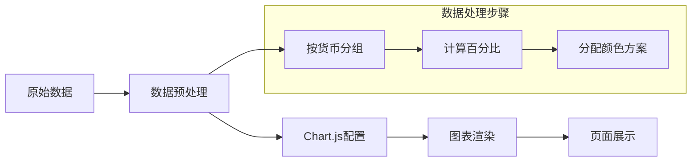
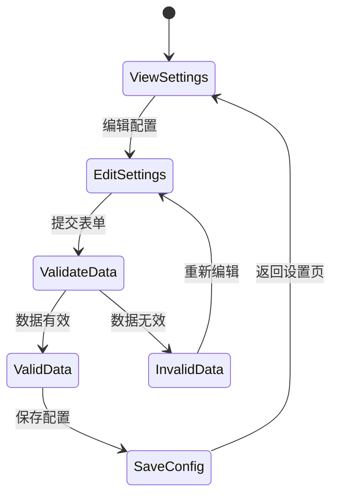
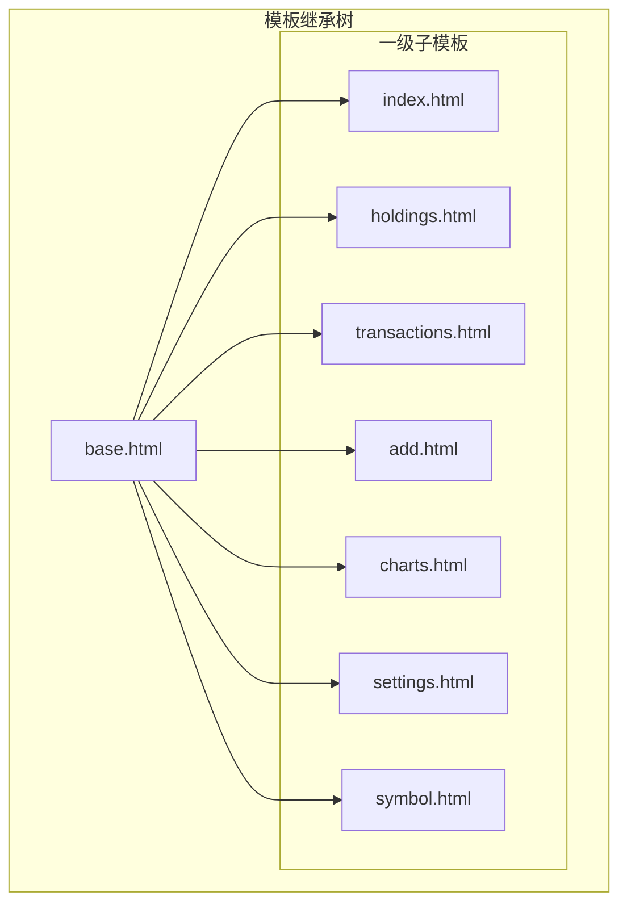
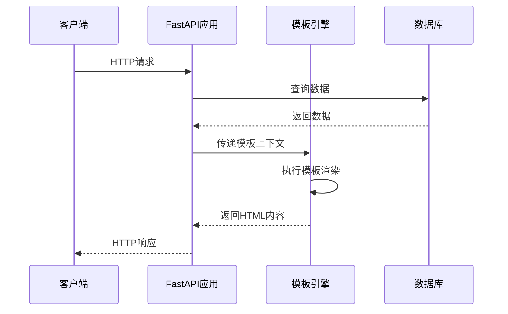

# 模板系统架构

<cite>
**本文档引用的文件**
- [app.py](file://app.py)
- [base.html](file://templates/base.html)
- [index.html](file://templates/index.html)
- [holdings.html](file://templates/holdings.html)
- [transactions.html](file://templates/transactions.html)
- [add.html](file://templates/add.html)
- [charts.html](file://templates/charts.html)
- [settings.html](file://templates/settings.html)
- [symbol.html](file://templates/symbol.html)
- [style.css](file://static/style.css)
- [database.py](file://database.py)
- [requirements.txt](file://requirements.txt)
</cite>

## 目录
1. [简介](#简介)
2. [项目结构](#项目结构)
3. [核心组件](#核心组件)
4. [架构概览](#架构概览)
5. [详细组件分析](#详细组件分析)
6. [依赖关系分析](#依赖关系分析)
7. [性能考虑](#性能考虑)
8. [故障排除指南](#故障排除指南)
9. [结论](#结论)

## 简介

本项目采用Jinja2模板引擎构建Web界面，通过FastAPI提供RESTful API服务。模板系统采用继承机制实现页面复用和统一布局，支持动态导航栏激活状态、模板变量传递、过滤器使用和宏定义等高级功能。

## 项目结构

项目采用清晰的分层架构，模板文件位于`templates/`目录，静态资源位于`static/`目录，核心业务逻辑集中在`app.py`中。



**图表来源**
- [app.py](file://app.py#L19-L23)
- [base.html](file://templates/base.html#L1-L27)
- [style.css](file://static/style.css#L1-L800)

**章节来源**
- [app.py](file://app.py#L1-L444)
- [requirements.txt](file://requirements.txt#L1-L6)

## 核心组件

### 模板引擎配置

应用使用Jinja2模板引擎，通过`Jinja2Templates`类进行配置：



**图表来源**
- [app.py](file://app.py#L21-L23)

### 基础模板设计

基础模板`base.html`采用经典的三段式布局：头部（head）、导航栏（nav）和主体内容（main）。该设计确保了所有子页面的一致性和可维护性。

**章节来源**
- [base.html](file://templates/base.html#L1-L27)

## 架构概览

模板系统采用继承模式，所有页面都继承自基础模板，通过定义特定的块（blocks）来实现个性化内容。



**图表来源**
- [base.html](file://templates/base.html#L11-L21)
- [index.html](file://templates/index.html#L1-L3)

## 详细组件分析

### 基础模板（base.html）

基础模板是整个模板系统的核心，实现了统一的页面结构和导航逻辑。

#### 导航栏动态激活机制

导航栏通过Jinja2条件表达式实现动态激活状态：

```mermaid
flowchart TD
URL[获取当前URL路径] --> Compare[与导航链接路径比较]
Compare --> Match{路径匹配?}
Match --> |是| Active[添加class="active"]
Match --> |否| Inactive[保持默认样式]
Active --> Render[渲染激活链接]
Inactive --> Render
Render --> Complete[完成渲染]
```

**图表来源**
- [base.html](file://templates/base.html#L14-L19)

#### 模块化设计原则

基础模板采用模块化设计，每个导航项都有明确的功能定位：
- Overview: 首页概览
- Holdings: 持仓详情和管理
- Transactions: 交易历史查询
- Add: 新增交易记录
- Charts: 投资组合分析
- Settings: 系统配置管理

**章节来源**
- [base.html](file://templates/base.html#L1-L27)

### 首页模板（index.html）

首页模板展示了投资组合的多币种持有情况，采用响应式网格布局。

#### 数据展示策略

首页模板通过以下方式处理数据：
1. 使用Jinja2循环遍历货币分组
2. 应用格式化过滤器进行数值显示
3. 集成Chart.js实现可视化展示

**章节来源**
- [index.html](file://templates/index.html#L1-L90)

### 持仓详情模板（holdings.html）

持仓详情模板提供了完整的持仓信息展示和交互功能。

#### 动态表格生成

模板使用Jinja2循环生成动态表格：
- 支持按货币分组显示
- 实时计算盈亏百分比
- 提供快速交易功能

**章节来源**
- [holdings.html](file://templates/holdings.html#L1-L177)

### 交易记录模板（transactions.html）

交易记录模板实现了分页功能和数据筛选。

#### 分页机制实现



**图表来源**
- [transactions.html](file://templates/transactions.html#L53-L80)

**章节来源**
- [transactions.html](file://templates/transactions.html#L1-L91)

### 添加交易模板（add.html）

添加交易模板提供了完整的表单验证和实时计算功能。

#### 表单验证机制

模板集成前端JavaScript实现实时验证：
- 数值输入验证
- 货币符号自动显示
- 总金额实时计算

**章节来源**
- [add.html](file://templates/add.html#L1-L111)

### 图表分析模板（charts.html）

图表分析模板使用Chart.js实现投资组合可视化。

#### 可视化数据处理



**图表来源**
- [charts.html](file://templates/charts.html#L56-L96)

**章节来源**
- [charts.html](file://templates/charts.html#L1-L104)

### 系统设置模板（settings.html）

系统设置模板提供了资产类型管理和配置功能。

#### 配置管理流程



**图表来源**
- [settings.html](file://templates/settings.html#L328-L351)

**章节来源**
- [settings.html](file://templates/settings.html#L1-L104)

### 股票详情模板（symbol.html）

股票详情模板展示了特定股票的历史交易记录。

#### 年度筛选功能

模板实现了灵活的年度筛选机制：
- 自动提取可用年份
- 动态年份链接生成
- 当前年份高亮显示

**章节来源**
- [symbol.html](file://templates/symbol.html#L1-L105)

## 依赖关系分析

### 模板继承关系



**图表来源**
- [base.html](file://templates/base.html#L1-L3)
- [index.html](file://templates/index.html#L1-L3)

### 数据流关系



**图表来源**
- [app.py](file://app.py#L36-L45)
- [app.py](file://app.py#L124-L141)

**章节来源**
- [app.py](file://app.py#L1-L444)

## 性能考虑

### 模板渲染优化

1. **延迟加载**: 图表组件仅在需要时加载
2. **缓存策略**: 静态资源通过浏览器缓存提升性能
3. **数据预处理**: 在后端进行数据聚合减少模板计算

### 内存使用优化

- 合理使用Jinja2循环避免大数据集的重复处理
- 适当的过滤器使用减少不必要的字符串操作
- 模板片段复用降低内存占用

## 故障排除指南

### 常见问题及解决方案

#### 模板渲染错误

**问题**: 模板无法正确渲染
**原因**: 变量名不匹配或数据结构错误
**解决**: 检查模板中的变量引用与传递的数据是否一致

#### 导航栏激活状态异常

**问题**: 导航链接无法正确高亮
**原因**: URL路径匹配逻辑错误
**解决**: 验证`request.url.path`的值和比较逻辑

#### 样式显示问题

**问题**: 页面样式显示异常
**原因**: CSS文件未正确加载
**解决**: 检查静态文件挂载配置和CSS文件路径

**章节来源**
- [base.html](file://templates/base.html#L14-L19)
- [style.css](file://static/style.css#L1-L800)

## 结论

本模板系统通过Jinja2的强大功能实现了高度模块化的Web界面设计。基础模板的继承机制确保了代码的复用性和一致性，而动态导航栏激活状态则提升了用户体验。模板系统与FastAPI的无缝集成提供了良好的开发体验，同时通过合理的数据处理和渲染策略保证了系统的性能表现。

系统的关键优势包括：
- 统一的视觉设计和交互体验
- 灵活的模板继承机制
- 强大的数据处理和可视化能力
- 良好的可扩展性和维护性