# 用户界面设计

<cite>
**本文引用的文件**
- [app.py](file://app.py)
- [database.py](file://database.py)
- [price_fetcher.py](file://price_fetcher.py)
- [templates/base.html](file://templates/base.html)
- [templates/index.html](file://templates/index.html)
- [templates/transactions.html](file://templates/transactions.html)
- [templates/holdings.html](file://templates/holdings.html)
- [templates/symbol.html](file://templates/symbol.html)
- [templates/charts.html](file://templates/charts.html)
- [templates/add.html](file://templates/add.html)
- [templates/settings.html](file://templates/settings.html)
- [static/style.css](file://static/style.css)
- [requirements.txt](file://requirements.txt)
</cite>

## 目录
1. [简介](#简介)
2. [项目结构](#项目结构)
3. [核心组件](#核心组件)
4. [架构总览](#架构总览)
5. [详细组件分析](#详细组件分析)
6. [依赖关系分析](#依赖关系分析)
7. [性能考虑](#性能考虑)
8. [故障排查指南](#故障排查指南)
9. [结论](#结论)
10. [附录](#附录)

## 简介
本项目是一个基于 FastAPI 的投资交易记录与可视化应用，采用 Jinja2 模板系统渲染页面，提供仪表板、交易列表、持仓详情、股票详情、图表分析、添加交易、系统设置等功能。前端通过统一的基础模板进行布局，使用单一 CSS 样式文件实现响应式设计与主题化。后端通过数据库模块管理交易、账户、资产类型、分配设置等数据，并提供 API 接口供前端异步交互。

## 项目结构
- 应用入口与路由：app.py
- 数据层：database.py（SQLite 操作、查询聚合）
- 价格服务：price_fetcher.py（多数据源价格获取）
- 模板层：templates/*.html（Jinja2 模板）
- 样式层：static/style.css（全局样式与响应式规则）

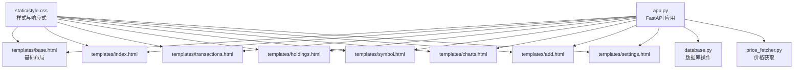

**图示来源**
- [app.py](file://app.py#L19-L444)
- [templates/base.html](file://templates/base.html#L1-L27)
- [static/style.css](file://static/style.css#L1-L934)
- [database.py](file://database.py#L1-L944)
- [price_fetcher.py](file://price_fetcher.py#L1-L398)

**章节来源**
- [app.py](file://app.py#L19-L444)
- [requirements.txt](file://requirements.txt#L1-L6)

## 核心组件
- 基础模板与导航：templates/base.html 提供统一头部导航、活动状态高亮、样式与脚本加载。
- 页面模板：
  - 仪表板：templates/index.html 展示按货币分组的资产配置与警告提示。
  - 交易列表：templates/transactions.html 支持分页与删除操作。
  - 持仓详情：templates/holdings.html 展示各币种下持有明细、P&L、快速交易与价格更新。
  - 股票详情：templates/symbol.html 展示单个股票的历史交易与年份筛选。
  - 图表分析：templates/charts.html 展示按币种的资产分布饼图。
  - 添加交易：templates/add.html 提供交易录入与实时金额预览。
  - 系统设置：templates/settings.html 管理资产类型与分配区间。
- 样式与响应式：static/style.css 定义通用组件、表格、按钮、表单、图表卡片、分页、模态框等样式，并在移动端适配。
- 后端逻辑：app.py 负责路由、模板渲染、API 接口、业务流程（如价格更新、快速交易、设置保存）。
- 数据模型：database.py 定义表结构、查询聚合（按币种/按符号）、分配设置、操作日志、最新价格等。
- 价格服务：price_fetcher.py 提供多数据源的价格获取与回退策略。

**章节来源**
- [templates/base.html](file://templates/base.html#L1-L27)
- [templates/index.html](file://templates/index.html#L1-L90)
- [templates/transactions.html](file://templates/transactions.html#L1-L91)
- [templates/holdings.html](file://templates/holdings.html#L1-L177)
- [templates/symbol.html](file://templates/symbol.html#L1-L105)
- [templates/charts.html](file://templates/charts.html#L1-L104)
- [templates/add.html](file://templates/add.html#L1-L111)
- [templates/settings.html](file://templates/settings.html#L1-L104)
- [static/style.css](file://static/style.css#L1-L934)
- [app.py](file://app.py#L36-L444)
- [database.py](file://database.py#L20-L944)
- [price_fetcher.py](file://price_fetcher.py#L36-L398)

## 架构总览
应用采用“模板渲染 + API 接口”的前后端分离思路：
- 前端：Jinja2 模板负责页面结构与数据展示；静态资源由 FastAPI 静态文件挂载提供。
- 后端：FastAPI 路由处理请求，调用数据库模块进行数据读写，必要时调用价格服务模块获取实时价格。
- 数据流：模板传入上下文数据（如 holdings、transactions、asset_types 等），前端通过内嵌脚本或异步 API 获取动态内容。

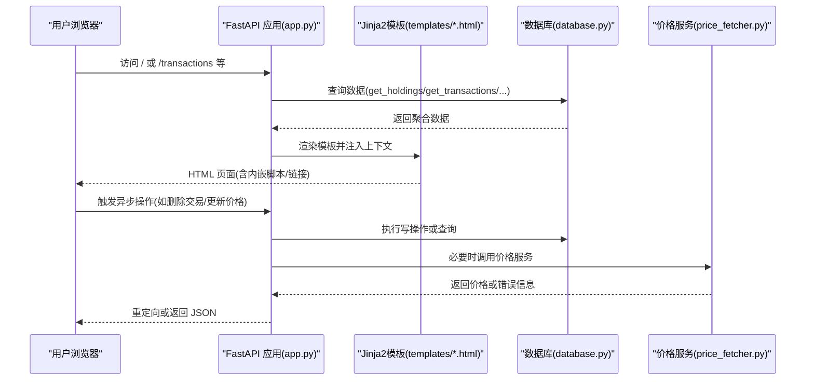

**图示来源**
- [app.py](file://app.py#L36-L444)
- [database.py](file://database.py#L262-L431)
- [price_fetcher.py](file://price_fetcher.py#L321-L398)

## 详细组件分析

### 基础布局与导航（base.html）
- 统一头部导航，根据当前 URL 动态设置活动链接样式。
- 引入全局样式与 Chart.js CDN，为图表功能提供支持。
- 主体区域使用块占位符，子模板继承并填充内容。

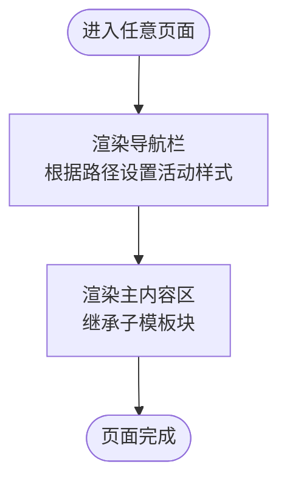

**图示来源**
- [templates/base.html](file://templates/base.html#L10-L24)

**章节来源**
- [templates/base.html](file://templates/base.html#L1-L27)

### 仪表板（index.html）
- 功能：按币种展示资产配置饼图与分配条形图，显示目标范围与告警。
- 数据：从数据库获取按币种分组的资产分布，计算百分比与告警。
- 交互：内嵌脚本将数据转为 JSON 并初始化 Chart.js 饼图。

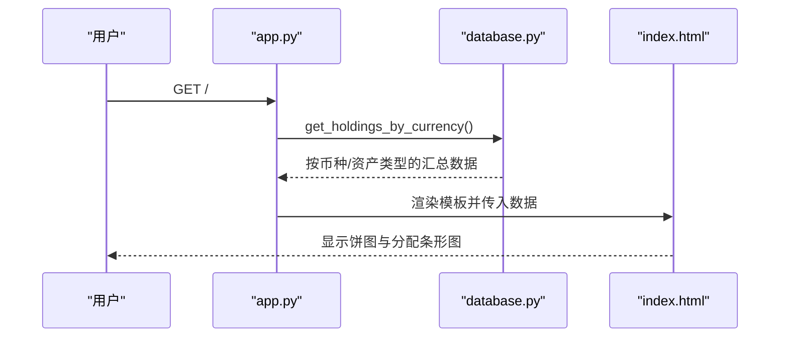

**图示来源**
- [app.py](file://app.py#L36-L45)
- [database.py](file://database.py#L673-L726)
- [templates/index.html](file://templates/index.html#L48-L82)

**章节来源**
- [templates/index.html](file://templates/index.html#L1-L90)
- [database.py](file://database.py#L673-L726)

### 交易列表（transactions.html）
- 功能：分页展示交易记录，支持删除操作（异步删除）。
- 分页：根据总数计算页数，渲染页码控件。
- 交互：JavaScript 发起 DELETE 请求，删除成功后刷新页面。

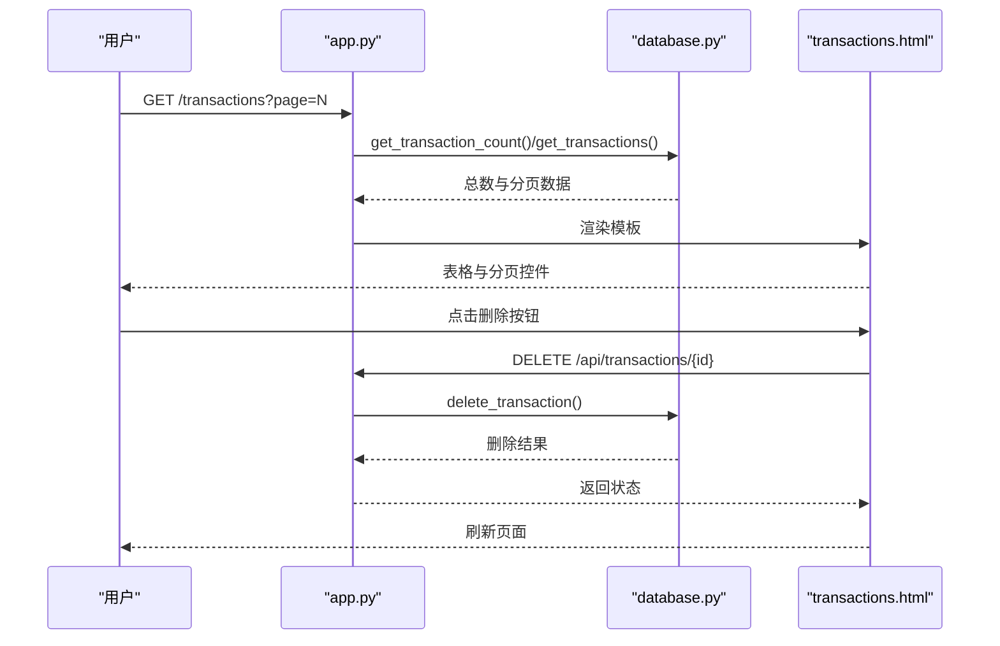

**图示来源**
- [app.py](file://app.py#L48-L66)
- [app.py](file://app.py#L431-L438)
- [database.py](file://database.py#L247-L255)
- [templates/transactions.html](file://templates/transactions.html#L53-L89)

**章节来源**
- [templates/transactions.html](file://templates/transactions.html#L1-L91)
- [app.py](file://app.py#L48-L66)
- [app.py](file://app.py#L431-L438)

### 持仓详情（holdings.html）
- 功能：按币种展示持有明细、成本/市值/P&L、百分比、快速交易与价格更新。
- 交互：模态框用于快速交易；点击“Update”提交表单触发价格更新。
- 导航：支持消息提示（成功/失败）。

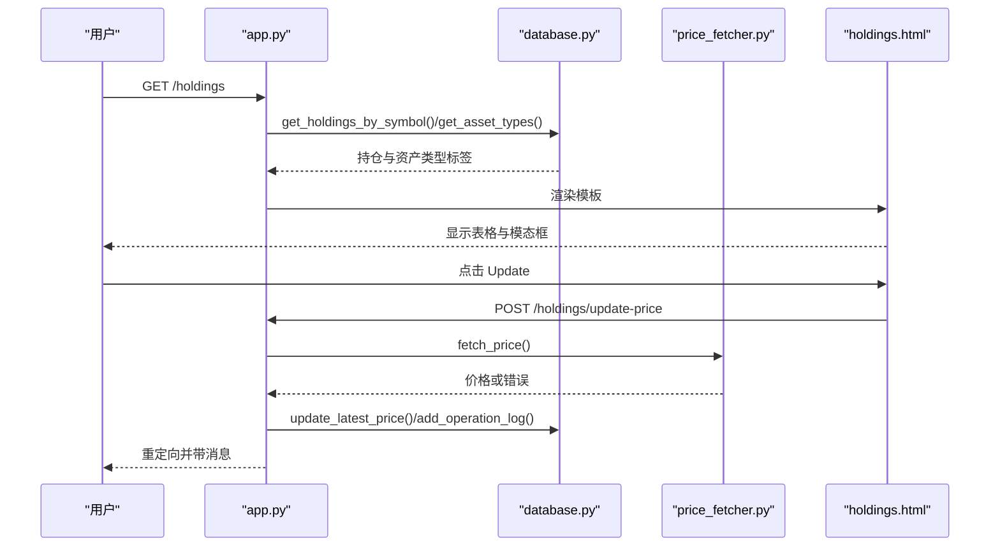

**图示来源**
- [app.py](file://app.py#L124-L141)
- [app.py](file://app.py#L216-L262)
- [database.py](file://database.py#L361-L431)
- [price_fetcher.py](file://price_fetcher.py#L321-L398)
- [templates/holdings.html](file://templates/holdings.html#L142-L169)

**章节来源**
- [templates/holdings.html](file://templates/holdings.html#L1-L177)
- [app.py](file://app.py#L124-L141)
- [app.py](file://app.py#L216-L262)

### 股票详情（symbol.html）
- 功能：展示单个股票的持有摘要、价值调整、历史交易与年份筛选。
- 交互：表单提交调整值；年份切换跳转到对应年份。

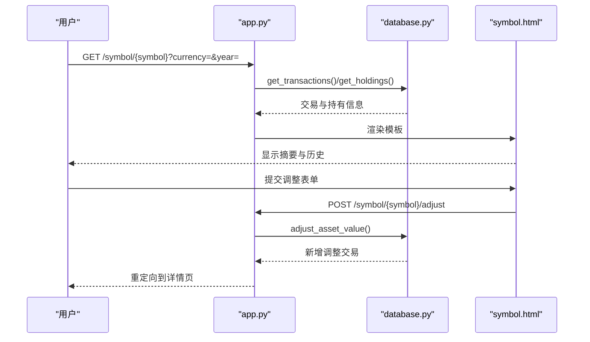

**图示来源**
- [app.py](file://app.py#L144-L188)
- [app.py](file://app.py#L191-L214)
- [database.py](file://database.py#L434-L481)
- [templates/symbol.html](file://templates/symbol.html#L36-L57)

**章节来源**
- [templates/symbol.html](file://templates/symbol.html#L1-L105)
- [app.py](file://app.py#L144-L188)
- [app.py](file://app.py#L191-L214)

### 图表分析（charts.html）
- 功能：按币种展示资产分布饼图，支持悬停显示占比。
- 样式：定义颜色变量，确保不同币种图表颜色一致。

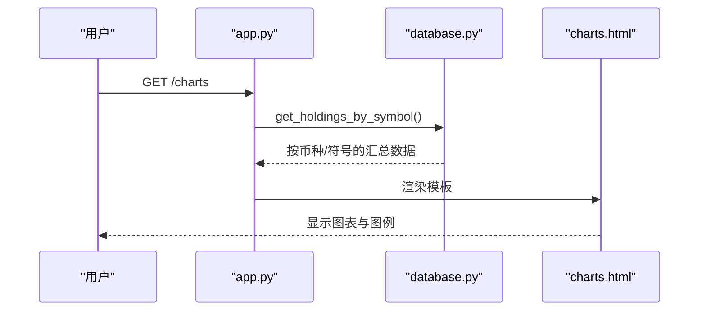

**图示来源**
- [app.py](file://app.py#L113-L121)
- [database.py](file://database.py#L361-L431)
- [templates/charts.html](file://templates/charts.html#L56-L96)

**章节来源**
- [templates/charts.html](file://templates/charts.html#L1-L104)
- [app.py](file://app.py#L113-L121)

### 添加交易（add.html）
- 功能：录入交易信息，实时计算总金额，支持账户下拉选择。
- 交互：输入数量/价格/币种时动态更新总金额预览。

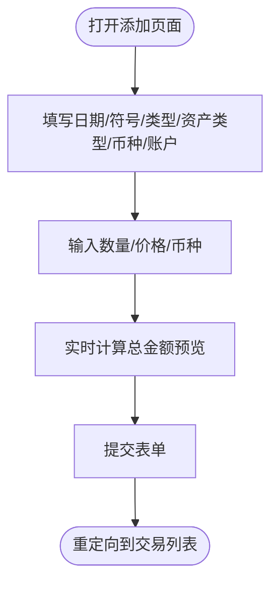

**图示来源**
- [templates/add.html](file://templates/add.html#L92-L109)
- [app.py](file://app.py#L69-L80)
- [app.py](file://app.py#L83-L110)

**章节来源**
- [templates/add.html](file://templates/add.html#L1-L111)
- [app.py](file://app.py#L69-L80)
- [app.py](file://app.py#L83-L110)

### 系统设置（settings.html）
- 功能：管理资产类型与分配区间设置。
- 交互：新增/删除资产类型；保存分配区间设置。

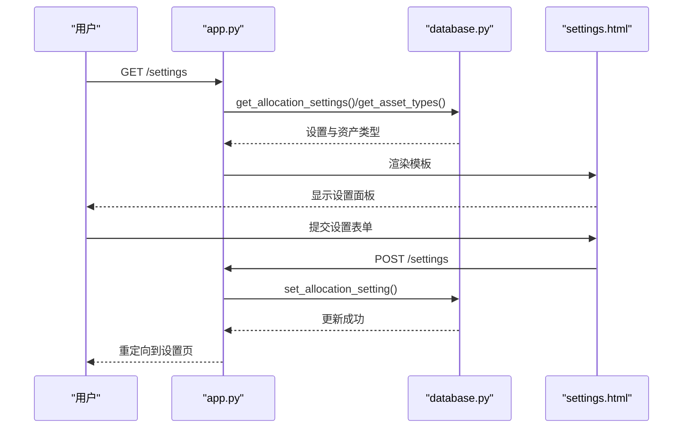

**图示来源**
- [app.py](file://app.py#L294-L325)
- [app.py](file://app.py#L328-L351)
- [database.py](file://database.py#L615-L656)
- [templates/settings.html](file://templates/settings.html#L63-L101)

**章节来源**
- [templates/settings.html](file://templates/settings.html#L1-L104)
- [app.py](file://app.py#L294-L325)
- [app.py](file://app.py#L328-L351)

## 依赖关系分析
- 模板依赖：各页面模板均继承自 base.html，共享导航与样式。
- 路由依赖：app.py 中每个页面路由依赖 database.py 的查询函数；部分路由依赖 price_fetcher.py 的价格获取。
- 样式依赖：所有页面模板共享 static/style.css，样式覆盖了表格、按钮、表单、图表、分页、模态框等组件。
- 外部依赖：requirements.txt 指定 FastAPI、Jinja2、Uvicorn、akshare、yfinance 等。

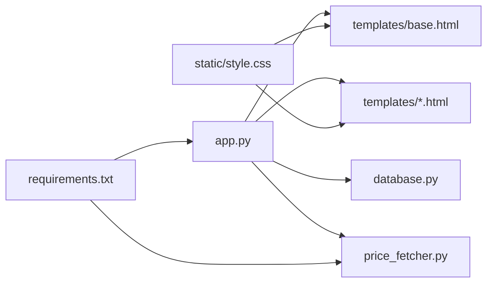

**图示来源**
- [app.py](file://app.py#L19-L23)
- [requirements.txt](file://requirements.txt#L1-L6)

**章节来源**
- [app.py](file://app.py#L19-L23)
- [requirements.txt](file://requirements.txt#L1-L6)

## 性能考虑
- 模板渲染：Jinja2 在服务器端渲染，减少客户端 JavaScript 工作量，适合静态/半静态内容。
- 分页：交易列表采用分页，避免一次性加载大量数据。
- 异步交互：删除交易与价格更新通过 API 异步执行，提升用户体验。
- 样式复用：单一 CSS 文件减少网络往返，配合媒体查询实现响应式布局。
- 数据库索引：对常用查询字段建立索引，提高查询效率。
- 价格获取：多数据源回退策略，降低单点故障风险。

[本节为通用指导，无需特定文件来源]

## 故障排查指南
- 价格获取失败：
  - 检查网络与外部库可用性（akshare/yfinance）。
  - 查看日志中服务尝试顺序与错误信息。
  - 参考：[price_fetcher.py](file://price_fetcher.py#L321-L398)
- 删除交易失败：
  - 确认交易 ID 存在且可删除。
  - 查看 HTTP 404 错误与日志。
  - 参考：[app.py](file://app.py#L431-L438)
- 价格更新无反馈：
  - 确认价格服务返回非空价格并写入数据库。
  - 检查操作日志记录。
  - 参考：[app.py](file://app.py#L216-L262)、[database.py](file://database.py#L779-L800)
- 设置保存无效：
  - 确认表单键名与后端解析一致。
  - 参考：[app.py](file://app.py#L328-L351)、[templates/settings.html](file://templates/settings.html#L63-L101)

**章节来源**
- [price_fetcher.py](file://price_fetcher.py#L321-L398)
- [app.py](file://app.py#L431-L438)
- [app.py](file://app.py#L216-L262)
- [database.py](file://database.py#L779-L800)
- [templates/settings.html](file://templates/settings.html#L63-L101)

## 结论
该系统以 Jinja2 模板为核心，结合 FastAPI 提供清晰的页面与 API 分层，数据库模块承担数据聚合与配置管理，价格服务模块提供多数据源回退能力。样式层通过单一 CSS 实现统一风格与响应式布局。整体架构简洁、职责明确，便于扩展与维护。

[本节为总结，无需特定文件来源]

## 附录

### 页面模板功能一览
- 仪表板：按币种展示资产配置与分配告警
- 交易列表：分页查看与删除交易
- 持仓详情：持有明细、P&L、快速交易、价格更新
- 股票详情：单股票摘要、价值调整、历史交易与年份筛选
- 图表分析：按币种资产分布饼图
- 添加交易：交易录入与实时金额预览
- 系统设置：资产类型与分配区间管理

**章节来源**
- [templates/index.html](file://templates/index.html#L1-L90)
- [templates/transactions.html](file://templates/transactions.html#L1-L91)
- [templates/holdings.html](file://templates/holdings.html#L1-L177)
- [templates/symbol.html](file://templates/symbol.html#L1-L105)
- [templates/charts.html](file://templates/charts.html#L1-L104)
- [templates/add.html](file://templates/add.html#L1-L111)
- [templates/settings.html](file://templates/settings.html#L1-L104)

### CSS 样式组织与响应式实现
- 组件化：按钮、表单、表格、徽章、图表卡片、分页、模态框等均有独立样式类。
- 响应式：在 768px 以下调整表单布局、网格列数与表格字体大小。
- 主题化：通过颜色变量与渐变背景实现统一视觉风格。

**章节来源**
- [static/style.css](file://static/style.css#L1-L934)

### 用户交互流程与页面导航机制
- 导航栏：根据当前路径设置活动链接，跨页面保持一致性。
- 内容区：各页面模板继承基础布局，通过块占位符注入内容。
- 异步交互：删除交易、价格更新、快速交易等通过 API 完成，减少页面刷新。

**章节来源**
- [templates/base.html](file://templates/base.html#L10-L24)
- [templates/transactions.html](file://templates/transactions.html#L82-L89)
- [templates/holdings.html](file://templates/holdings.html#L142-L169)

### 界面定制与主题修改方法
- 修改颜色与主题：通过 CSS 变量与颜色类名进行统一替换。
- 自定义组件样式：在现有类基础上扩展或覆盖，避免破坏响应式布局。
- 增加新页面：新建模板并继承基础布局，注册路由并在导航中添加链接。

**章节来源**
- [static/style.css](file://static/style.css#L1-L934)
- [templates/base.html](file://templates/base.html#L10-L24)

### 前端组件使用指南与最佳实践
- 表单：使用语义化标签与占位符，注意输入类型与步长。
- 表格：保持表头一致，使用徽章区分交易类型与资产类型。
- 模态框：通过隐藏表单与 JavaScript 控制显示/关闭。
- 分页：合理设置每页数量，避免超大数据集一次性渲染。

**章节来源**
- [templates/add.html](file://templates/add.html#L8-L90)
- [templates/holdings.html](file://templates/holdings.html#L91-L140)
- [templates/transactions.html](file://templates/transactions.html#L53-L80)

### 静态资源管理与性能优化策略
- 静态文件挂载：通过 FastAPI 静态文件服务提供样式与脚本。
- 样式合并：单一 CSS 文件减少请求数量。
- 响应式优先：媒体查询在 CSS 内部集中管理，避免重复计算。
- 图表优化：Chart.js 按需初始化，避免不必要的渲染。

**章节来源**
- [app.py](file://app.py#L21-L23)
- [static/style.css](file://static/style.css#L256-L274)
- [templates/index.html](file://templates/index.html#L48-L82)
- [templates/charts.html](file://templates/charts.html#L56-L96)