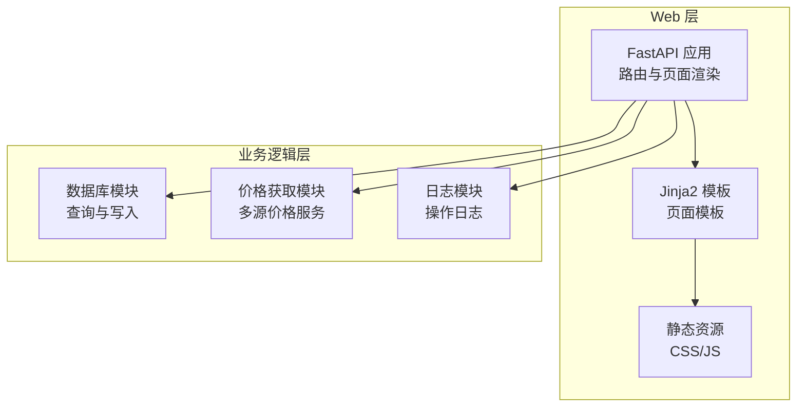
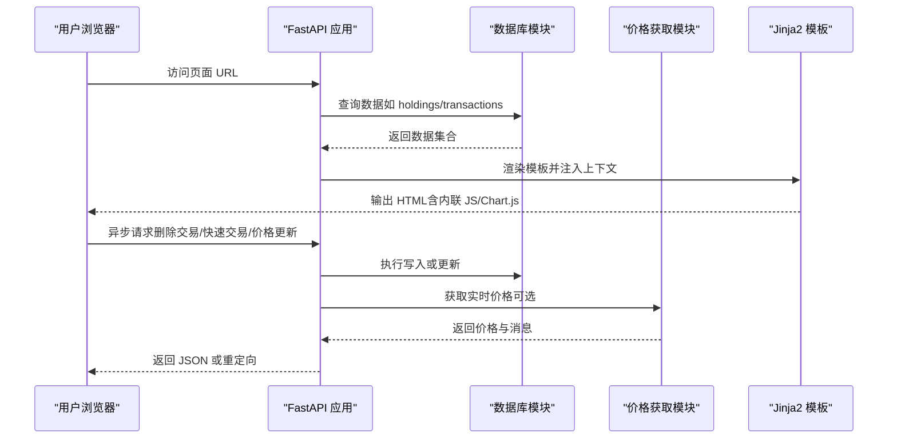
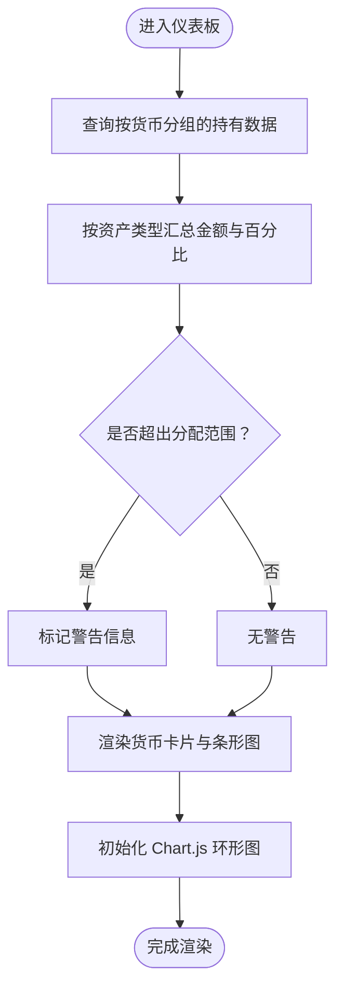
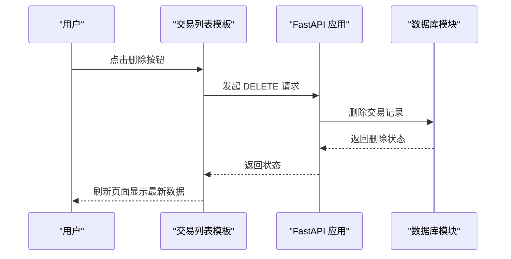
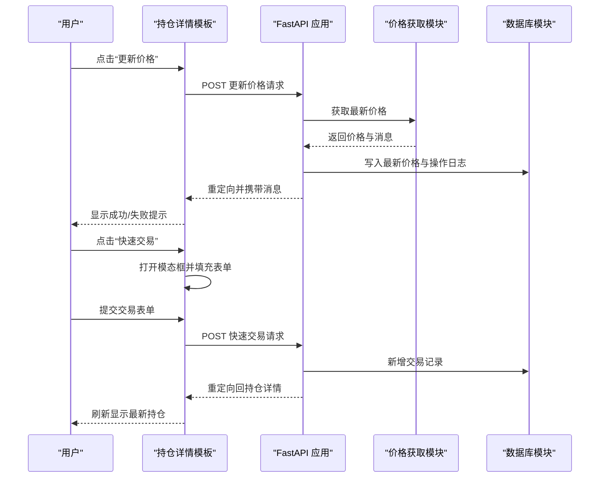
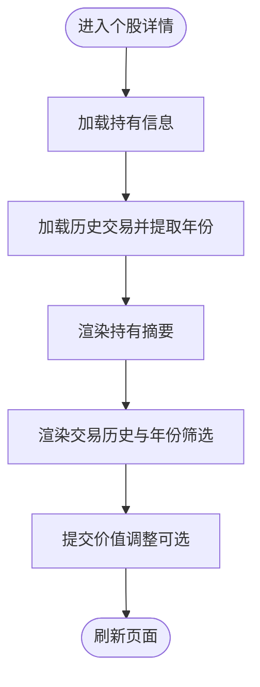
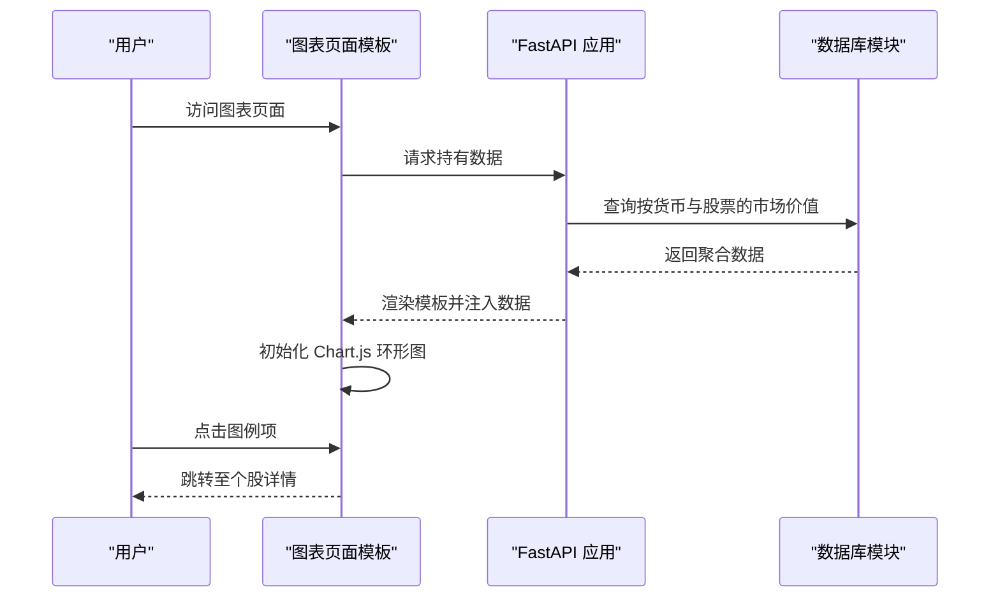
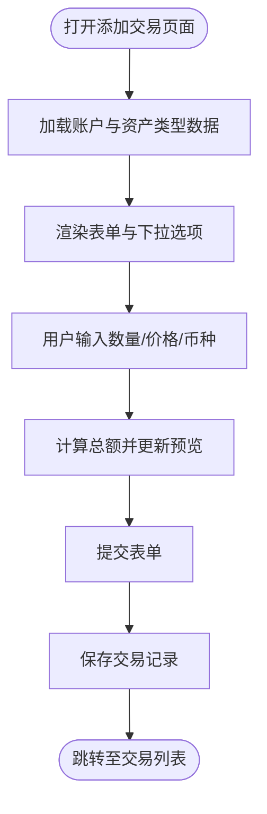
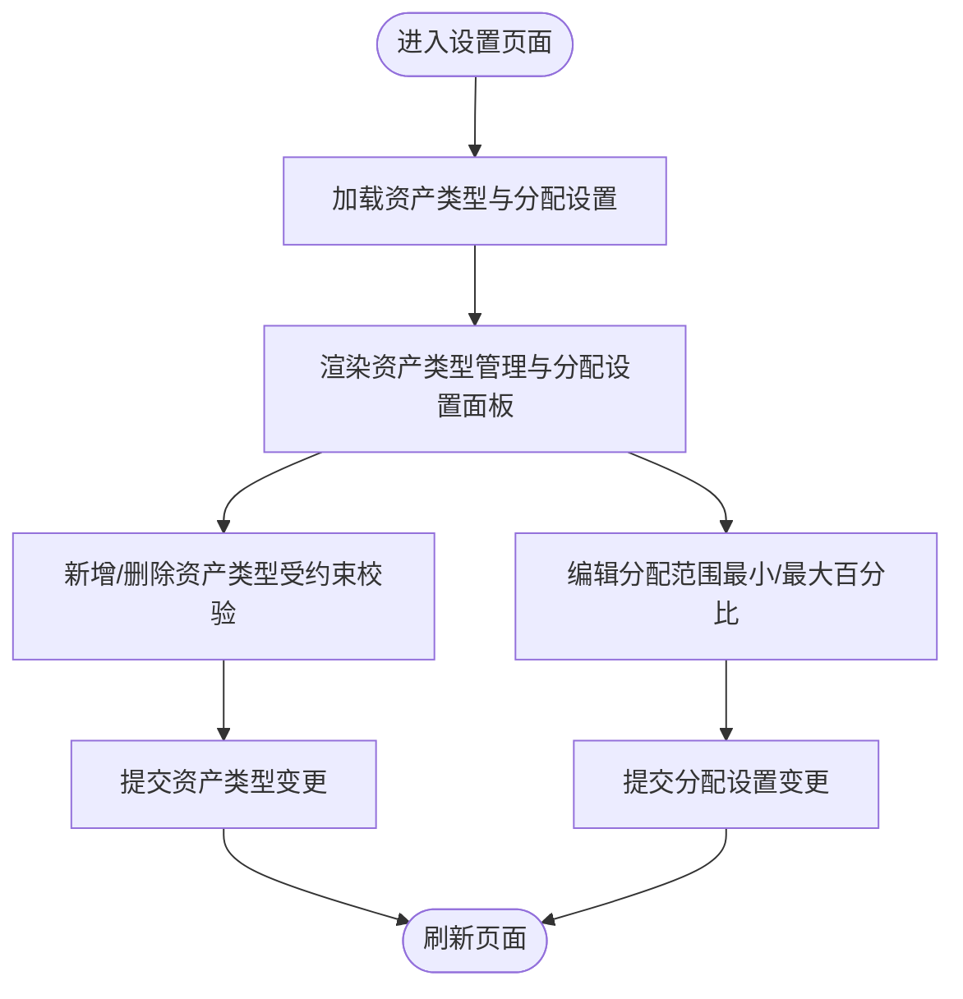
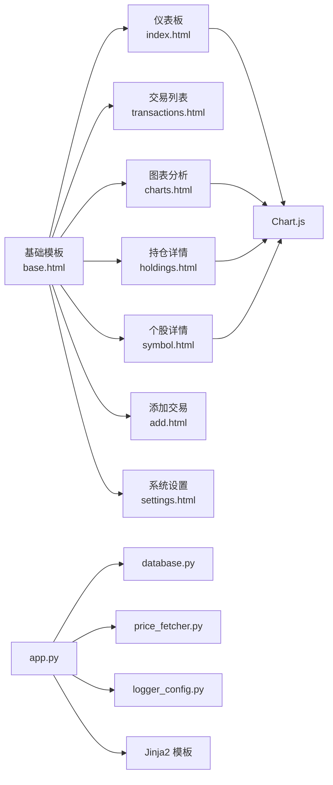

# 页面模板设计

<cite>
**本文档引用的文件**
- [app.py](file://app.py)
- [database.py](file://database.py)
- [price_fetcher.py](file://price_fetcher.py)
- [logger_config.py](file://logger_config.py)
- [templates/base.html](file://templates/base.html)
- [templates/index.html](file://templates/index.html)
- [templates/transactions.html](file://templates/transactions.html)
- [templates/holdings.html](file://templates/holdings.html)
- [templates/symbol.html](file://templates/symbol.html)
- [templates/charts.html](file://templates/charts.html)
- [templates/add.html](file://templates/add.html)
- [templates/settings.html](file://templates/settings.html)
- [static/style.css](file://static/style.css)
- [requirements.txt](file://requirements.txt)
</cite>

## 目录
1. [简介](#简介)
2. [项目结构](#项目结构)
3. [核心组件](#核心组件)
4. [架构总览](#架构总览)
5. [详细组件分析](#详细组件分析)
6. [依赖关系分析](#依赖关系分析)
7. [性能考虑](#性能考虑)
8. [故障排除指南](#故障排除指南)
9. [结论](#结论)

## 简介
本项目是一个基于 FastAPI 的投资交易记录与分析 Web 应用，采用 Jinja2 模板渲染技术，提供多页面模板设计，涵盖仪表板概览、交易列表、持仓详情、个股详情、图表分析、添加交易、系统设置等页面。模板通过数据绑定与动态内容生成机制，结合响应式布局与移动端适配策略，为用户提供直观的投资组合管理体验。

## 项目结构
项目采用“模板驱动 + 数据库查询 + API 接口”的分层架构：
- 路由与页面渲染：FastAPI 路由负责接收请求并调用数据库查询函数，将结果传递给 Jinja2 模板进行渲染。
- 数据层：SQLite 数据库存储交易、账户、资产类型、分配设置、操作日志、最新价格等数据。
- 可视化与交互：模板内嵌 JavaScript 与 Chart.js 实现图表渲染与部分交互（如删除交易、快速交易、价格更新）。
- 样式与响应式：统一的样式表通过媒体查询实现桌面端与移动端的自适应布局。

**图表来源**
- [app.py](file://app.py#L1-L446)
- [database.py](file://database.py#L1-L944)
- [price_fetcher.py](file://price_fetcher.py#L1-L398)
- [logger_config.py](file://logger_config.py#L1-L54)

**章节来源**
- [app.py](file://app.py#L1-L446)
- [requirements.txt](file://requirements.txt#L1-L6)

## 核心组件
- 基础模板 base.html：定义全局导航、标题块占位符、内容块占位符以及通用脚本与样式引入。
- 页面模板：index（仪表板）、transactions（交易列表）、holdings（持仓详情）、symbol（个股详情）、charts（图表分析）、add（添加交易）、settings（系统设置）。
- 数据绑定：每个页面模板通过 Jinja2 上下文变量接收后端传入的数据集合（如 holdings_by_currency、transactions、holdings_by_symbol 等），并在模板中使用循环与条件判断进行动态渲染。
- 动态内容生成：模板内嵌 JavaScript 与 Chart.js，根据上下文数据生成图表；同时通过 fetch API 与后端交互实现异步删除与快速交易等操作。
- 导航关系：基础模板中的导航链接串联各页面，形成清晰的用户流转路径。

**章节来源**
- [templates/base.html](file://templates/base.html#L1-L27)
- [templates/index.html](file://templates/index.html#L1-L90)
- [templates/transactions.html](file://templates/transactions.html#L1-L91)
- [templates/holdings.html](file://templates/holdings.html#L1-L177)
- [templates/symbol.html](file://templates/symbol.html#L1-L105)
- [templates/charts.html](file://templates/charts.html#L1-L104)
- [templates/add.html](file://templates/add.html#L1-L111)
- [templates/settings.html](file://templates/settings.html#L1-L104)

## 架构总览
下图展示了页面模板在整体架构中的位置与交互流程，包括路由、模板渲染、数据查询与 API 调用的关系。

**图表来源**
- [app.py](file://app.py#L36-L121)
- [database.py](file://database.py#L312-L431)
- [price_fetcher.py](file://price_fetcher.py#L321-L394)

## 详细组件分析

### 仪表板页面（index.html）
- 功能定位：以货币维度展示投资组合的资产类别分布与占比，并提供分配范围预警。
- 设计特点：
  - 使用 Chart.js 创建按货币分组的环形图，颜色区分资产类型（股票、债券、贵金属、现金）。
  - 每个货币卡片包含总值、资产类别条形图与范围区间指示器，超出设定范围时显示警告。
- 数据绑定与动态生成：
  - 后端按货币与资产类型聚合持有成本，计算百分比并检查分配设置范围。
  - 模板通过循环渲染每个货币卡片与类别条目，JavaScript 将上下文数据转换为 JSON 并初始化图表。
- 响应式与移动端适配：货币卡片网格在小屏设备上自动换列，图表容器尺寸自适应。

**图表来源**
- [app.py](file://app.py#L36-L45)
- [database.py](file://database.py#L673-L726)
- [templates/index.html](file://templates/index.html#L8-L82)

**章节来源**
- [templates/index.html](file://templates/index.html#L1-L90)
- [database.py](file://database.py#L673-L726)
- [static/style.css](file://static/style.css#L276-L376)

### 交易列表页面（transactions.html）
- 功能定位：以表格形式展示历史交易记录，支持分页与删除操作。
- 设计特点：
  - 表头包含日期、代码、类型、资产类型、数量、价格、总额、币种、账户等字段。
  - 交易类型与资产类型使用徽章样式标识，便于快速识别。
  - 提供分页控件，当前页码高亮显示。
- 数据绑定与动态生成：
  - 后端按分页参数查询交易记录总数与当前页数据。
  - 模板通过循环渲染每条交易记录，JavaScript 通过 fetch API 异步删除指定交易。
- 响应式与移动端适配：表格单元格在小屏设备上缩小内边距，避免横向滚动。

**图表来源**
- [templates/transactions.html](file://templates/transactions.html#L82-L89)
- [app.py](file://app.py#L406-L441)

**章节来源**
- [templates/transactions.html](file://templates/transactions.html#L1-L91)
- [app.py](file://app.py#L48-L66)
- [static/style.css](file://static/style.css#L256-L274)

### 持仓详情页面（holdings.html）
- 功能定位：按货币展示每只股票的持有情况，支持批量更新价格与快速交易。
- 设计特点：
  - 分货币分段展示持有汇总与明细表格，包含成本、市价、未实现盈亏、占比等关键指标。
  - 提供“更新价格”与“快速交易”两个快捷入口，后者弹出模态框进行交易录入。
- 数据绑定与动态生成：
  - 后端计算每只股票的总份额、平均成本、市价、未实现盈亏与占比。
  - 模板通过循环渲染每个货币段落与股票行，JavaScript 控制模态框的打开与关闭。
- 响应式与移动端适配：表格在小屏设备上采用紧凑布局，货币卡片网格自适应。

**图表来源**
- [templates/holdings.html](file://templates/holdings.html#L142-L169)
- [app.py](file://app.py#L216-L291)
- [price_fetcher.py](file://price_fetcher.py#L321-L394)
- [database.py](file://database.py#L779-L800)

**章节来源**
- [templates/holdings.html](file://templates/holdings.html#L1-L177)
- [app.py](file://app.py#L124-L141)
- [static/style.css](file://static/style.css#L692-L762)

### 股票详情页面（symbol.html）
- 功能定位：展示某只股票的持有摘要、价值调整功能与历史交易记录，并支持年份筛选。
- 设计特点：
  - 摘要区域突出总份额、平均成本、总市值与资产类型。
  - 提供“调整价值”表单，用于记录因特殊事件导致的价值变动。
  - 历史交易记录按年份过滤，支持跳转至不同年份查看。
- 数据绑定与动态生成：
  - 后端根据符号与币种查询当前持有信息与历史交易，并收集可用年份。
  - 模板通过循环渲染交易行，JavaScript 控制年份按钮的激活状态。
- 响应式与移动端适配：摘要网格与表单在小屏设备上自动调整列数与间距。

**图表来源**
- [app.py](file://app.py#L144-L188)
- [templates/symbol.html](file://templates/symbol.html#L1-L105)

**章节来源**
- [templates/symbol.html](file://templates/symbol.html#L1-L105)
- [app.py](file://app.py#L144-L188)
- [static/style.css](file://static/style.css#L512-L625)

### 图表分析页面（charts.html）
- 功能定位：按货币展示各股票的市场价值占比，提供交互式环形图与图例。
- 设计特点：
  - 每个货币卡片包含该货币下的总资产值与环形图，图例显示股票代码与占比。
  - 图例项点击可跳转至对应个股详情页面。
- 数据绑定与动态生成：
  - 后端按货币与股票聚合市场价值，计算占比并排序。
  - 模板通过循环渲染货币卡片与股票条目，JavaScript 初始化 Chart.js 并启用工具提示格式化。
- 响应式与移动端适配：图表网格在小屏设备上自动单列显示，图例项在窄屏下保持可读性。

**图表来源**
- [app.py](file://app.py#L113-L121)
- [database.py](file://database.py#L361-L431)
- [templates/charts.html](file://templates/charts.html#L1-L104)

**章节来源**
- [templates/charts.html](file://templates/charts.html#L1-L104)
- [database.py](file://database.py#L361-L431)
- [static/style.css](file://static/style.css#L236-L248)

### 添加交易页面（add.html）
- 功能定位：提供交易录入表单，支持自动计算总额并预览。
- 设计特点：
  - 表单包含日期、代码、交易类型、资产类型、币种、账户、数量、价格、佣金与备注等字段。
  - 数量与价格输入联动计算总额，币种变化时货币符号同步更新。
- 数据绑定与动态生成：
  - 后端提供账户列表与资产类型列表，模板通过循环渲染下拉选项。
  - 模板内嵌 JavaScript 监听输入事件，实时更新总额预览。
- 响应式与移动端适配：表单行在小屏设备上垂直堆叠，输入控件宽度自适应。

**图表来源**
- [app.py](file://app.py#L69-L80)
- [templates/add.html](file://templates/add.html#L1-L111)

**章节来源**
- [templates/add.html](file://templates/add.html#L1-L111)
- [app.py](file://app.py#L69-L80)
- [static/style.css](file://static/style.css#L182-L235)

### 系统设置页面（settings.html）
- 功能定位：管理资产类型与分配设置，支持新增/删除资产类型与设置各货币/资产类型的分配范围。
- 设计特点：
  - 资产类型管理区列出现有类型并提供删除按钮（受约束时禁用）。
  - 分配设置区按货币展示资产类型的目标最小/最大百分比，支持批量保存。
- 数据绑定与动态生成：
  - 后端查询资产类型与分配设置，构建映射以便模板直接访问。
  - 模板通过循环渲染设置表单字段，提交后后端遍历表单键值对写入数据库。
- 响应式与移动端适配：设置面板在小屏设备上自动换列，输入控件紧凑排列。

**图表来源**
- [app.py](file://app.py#L294-L351)
- [database.py](file://database.py#L615-L671)
- [templates/settings.html](file://templates/settings.html#L1-L104)

**章节来源**
- [templates/settings.html](file://templates/settings.html#L1-L104)
- [app.py](file://app.py#L294-L351)
- [database.py](file://database.py#L605-L671)
- [static/style.css](file://static/style.css#L377-L418)

## 依赖关系分析
- 模板依赖：各页面模板继承基础模板，共享导航与样式；部分页面（如 index、charts、holdings、symbol）依赖 Chart.js 进行可视化。
- 后端依赖：路由函数依赖数据库模块进行数据查询与写入；价格更新功能依赖价格获取模块；日志模块用于记录操作与错误。
- 外部依赖：FastAPI、Jinja2、Chart.js、可选的 akshare/yfinance 等第三方库。

**图表来源**
- [templates/base.html](file://templates/base.html#L1-L27)
- [templates/index.html](file://templates/index.html#L1-L90)
- [templates/transactions.html](file://templates/transactions.html#L1-L91)
- [templates/holdings.html](file://templates/holdings.html#L1-L177)
- [templates/symbol.html](file://templates/symbol.html#L1-L105)
- [templates/charts.html](file://templates/charts.html#L1-L104)
- [templates/add.html](file://templates/add.html#L1-L111)
- [templates/settings.html](file://templates/settings.html#L1-L104)
- [app.py](file://app.py#L1-L446)
- [database.py](file://database.py#L1-L944)
- [price_fetcher.py](file://price_fetcher.py#L1-L398)
- [logger_config.py](file://logger_config.py#L1-L54)

**章节来源**
- [app.py](file://app.py#L1-L446)
- [database.py](file://database.py#L1-L944)
- [price_fetcher.py](file://price_fetcher.py#L1-L398)
- [logger_config.py](file://logger_config.py#L1-L54)

## 性能考虑
- 数据查询优化：数据库模块针对常用查询建立索引（如 symbol、date、account_id、type、currency、asset_type），减少排序与过滤开销。
- 分页策略：交易列表采用分页（默认每页 100 条），降低一次性渲染大量数据带来的压力。
- 图表渲染：仅在存在有效数据时初始化 Chart.js，避免空图表占用资源。
- 异步交互：删除交易与快速交易通过 fetch API 异步执行，减少页面刷新等待时间。
- 静态资源：样式与脚本集中管理，减少重复加载。

[本节为通用指导，无需特定文件引用]

## 故障排除指南
- 价格获取失败：当多源价格服务均不可用时，价格更新会返回错误消息并记录日志。建议检查网络连接与第三方库安装状态。
- 删除交易失败：若交易不存在，API 将返回 404 错误。请确认交易 ID 正确且记录仍存在。
- 设置保存异常：分配范围需满足最小值不大于最大值且在 0-100 之间。若提交非法值，设置不会被保存。
- 日志查看：应用使用定时轮转日志，保留最近 7 天的日志文件，便于排查问题。

**章节来源**
- [price_fetcher.py](file://price_fetcher.py#L321-L394)
- [app.py](file://app.py#L433-L441)
- [database.py](file://database.py#L630-L656)
- [logger_config.py](file://logger_config.py#L14-L53)

## 结论
本项目通过精心设计的页面模板与数据绑定机制，实现了从概览到详情、从列表到图表的完整投资组合管理体验。模板继承体系确保了导航与样式的统一，而 Chart.js 与异步交互进一步提升了用户体验。配合完善的数据库查询与日志记录，系统在功能完整性与可维护性方面表现良好。建议后续可扩展更多图表类型与筛选维度，以满足更复杂的分析需求。