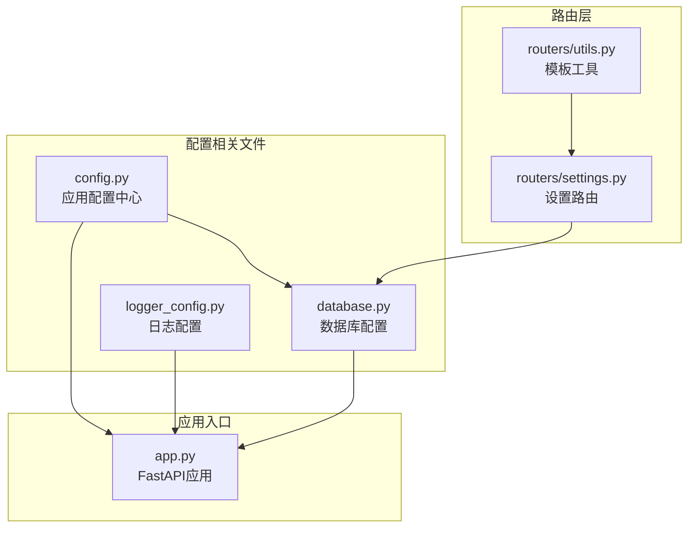
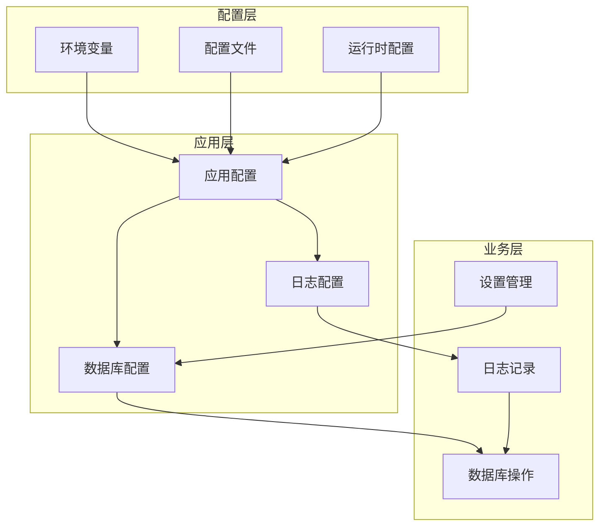
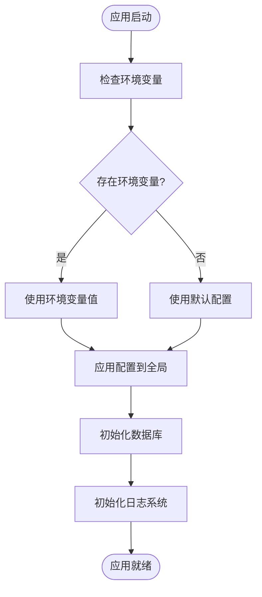
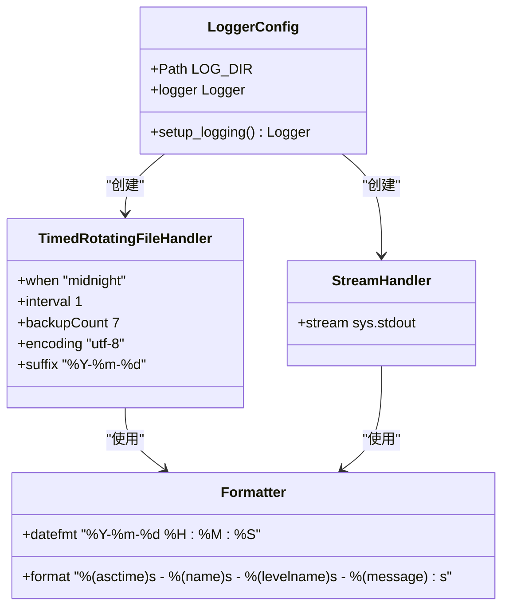
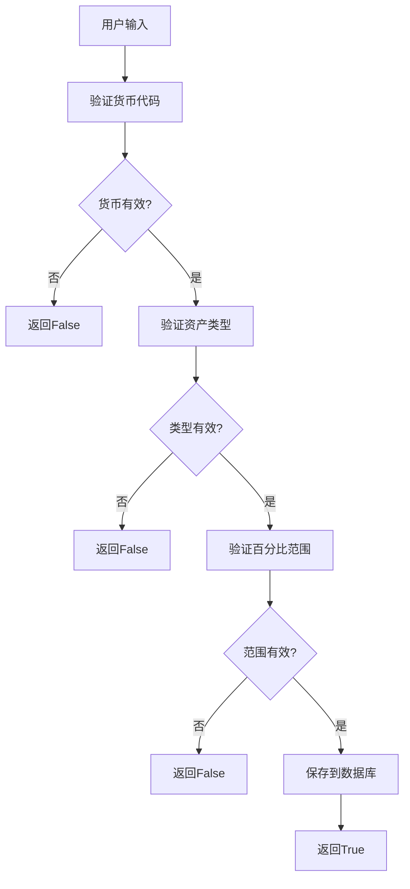
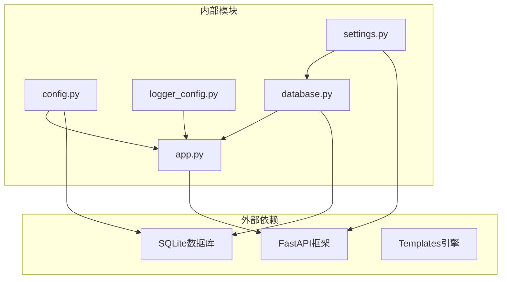

# 系统配置管理

<cite>
**本文档引用的文件**
- [config.py](file://config.py)
- [logger_config.py](file://logger_config.py)
- [app.py](file://app.py)
- [database.py](file://database.py)
- [routers/settings.py](file://routers/settings.py)
- [routers/utils.py](file://routers/utils.py)
- [requirements.txt](file://requirements.txt)
</cite>

## 目录
1. [简介](#简介)
2. [项目结构](#项目结构)
3. [核心组件](#核心组件)
4. [架构概览](#架构概览)
5. [详细组件分析](#详细组件分析)
6. [依赖关系分析](#依赖关系分析)
7. [性能考虑](#性能考虑)
8. [故障排除指南](#故障排除指南)
9. [结论](#结论)
10. [附录](#附录)

## 简介

投资日志管理系统是一个基于FastAPI的Web应用程序，用于跟踪和管理股票、ETF等金融产品的交易记录。本文件专注于系统的配置管理，详细说明配置选项、日志系统、环境变量支持以及部署最佳实践。

## 项目结构

系统采用模块化设计，配置相关的核心文件分布如下：



**图表来源**
- [config.py](file://config.py#L1-L24)
- [logger_config.py](file://logger_config.py#L1-L54)
- [database.py](file://database.py#L1-L151)
- [app.py](file://app.py#L1-L34)

**章节来源**
- [config.py](file://config.py#L1-L24)
- [logger_config.py](file://logger_config.py#L1-L54)
- [database.py](file://database.py#L1-L151)
- [app.py](file://app.py#L1-L34)

## 核心组件

### 配置中心 (config.py)

配置中心负责管理应用的所有配置选项，当前包含以下核心配置：

#### 数据库路径配置
- **默认路径**: iCloud同步目录下的InvestLog应用文件夹
- **路径格式**: `~/Library/Mobile Documents/com~apple~CloudDocs/InvestLog/transactions.db`
- **自动创建**: 启动时自动创建必要的目录结构
- **环境变量覆盖**: 支持通过`INVEST_LOG_DB_PATH`环境变量自定义数据库路径

#### iCloud集成配置
- **基础路径**: macOS iCloud Drive的标准路径
- **应用专用目录**: 在iCloud根目录下创建InvestLog专用文件夹
- **自动同步**: 数据库文件自动参与iCloud同步和备份

**章节来源**
- [config.py](file://config.py#L10-L23)

### 日志系统 (logger_config.py)

日志系统提供了完整的日志记录功能，包括文件轮转和控制台输出：

#### 日志配置特性
- **日志级别**: INFO级别及以上
- **输出目标**: 文件和控制台双重输出
- **文件轮转**: 按天轮转，保留7天历史
- **编码设置**: UTF-8编码确保中文字符正确显示

#### 日志格式
- **时间戳**: 年-月-日 时:分:秒格式
- **日志名称**: invest_log
- **日志级别**: INFO/ERROR/WARNING等
- **消息内容**: 自定义业务日志信息

**章节来源**
- [logger_config.py](file://logger_config.py#L14-L54)

### 应用初始化 (app.py)

应用启动时执行的关键配置流程：

#### 启动流程
1. 创建FastAPI应用实例
2. 挂载静态文件服务
3. 初始化数据库连接
4. 设置日志记录器
5. 注册所有路由

#### 数据库初始化
- 在应用启动事件中调用数据库初始化
- 确保所有必要表结构存在
- 建立索引优化查询性能

**章节来源**
- [app.py](file://app.py#L18-L29)

## 架构概览

系统配置管理的整体架构如下：



**图表来源**
- [config.py](file://config.py#L21-L23)
- [logger_config.py](file://logger_config.py#L14-L54)
- [database.py](file://database.py#L22-L151)

## 详细组件分析

### 配置优先级机制

系统实现了多层配置优先级，确保灵活性和可维护性：



**图表来源**
- [config.py](file://config.py#L21-L23)

#### 配置优先级顺序
1. **环境变量** (最高优先级): `INVEST_LOG_DB_PATH`
2. **配置文件**: config.py中的硬编码默认值
3. **运行时参数**: 函数级别的参数覆盖

**章节来源**
- [config.py](file://config.py#L21-L23)

### 数据库配置分析

数据库配置采用了集中式管理模式：

#### 连接管理
- **连接函数**: `get_connection(db_path: str = DB_PATH)`
- **行工厂**: 启用sqlite3.Row支持字典式访问
- **参数化**: 所有数据库操作都使用参数化查询防止SQL注入

#### 初始化流程
- **表创建**: transactions、accounts、symbols等核心表
- **索引建立**: 多个常用查询字段的索引
- **默认数据**: 初始化资产类型表的默认值

**章节来源**
- [database.py](file://database.py#L15-L151)

### 日志系统深度分析

日志系统采用了标准的Python logging模块实现：

#### 组件构成


**图表来源**
- [logger_config.py](file://logger_config.py#L24-L45)

#### 轮转策略
- **轮转时机**: 每天午夜
- **保留数量**: 最近7天的日志文件
- **文件命名**: 自动添加日期后缀
- **编码处理**: UTF-8确保国际化支持

**章节来源**
- [logger_config.py](file://logger_config.py#L24-L33)

### 设置管理与配置验证

设置管理模块实现了完整的配置验证和持久化机制：

#### 验证规则


**图表来源**
- [database.py](file://database.py#L697-L700)

#### 验证规则详情
- **货币验证**: 必须在预定义的货币列表中
- **类型验证**: 必须在预定义的资产类型列表中
- **范围验证**: 百分比必须在0-100之间且最小值不大于最大值

**章节来源**
- [database.py](file://database.py#L697-L700)

## 依赖关系分析

系统配置相关组件之间的依赖关系：



**图表来源**
- [requirements.txt](file://requirements.txt#L1-L6)
- [app.py](file://app.py#L7-L11)

**章节来源**
- [requirements.txt](file://requirements.txt#L1-L6)

## 性能考虑

### 配置性能优化

1. **延迟初始化**: 数据库连接按需创建，避免启动时的资源占用
2. **缓存策略**: 日志系统避免重复添加处理器
3. **索引优化**: 数据库初始化时建立必要的索引
4. **内存管理**: 配置信息在模块加载时确定，运行时不频繁修改

### 日志性能影响

- **I/O开销**: 文件轮转和磁盘写入对性能有轻微影响
- **内存占用**: 日志缓冲区大小适中，不会造成内存压力
- **并发安全**: 日志系统线程安全，支持多线程环境

## 故障排除指南

### 常见配置问题

#### 数据库连接问题
**症状**: 应用启动时报数据库错误
**排查步骤**:
1. 检查iCloud权限是否正常
2. 验证数据库文件路径是否存在
3. 确认文件权限设置正确
4. 查看日志文件获取详细错误信息

#### 环境变量未生效
**症状**: 环境变量设置后配置未改变
**解决方案**:
1. 确认环境变量名正确: `INVEST_LOG_DB_PATH`
2. 重启应用使新配置生效
3. 验证环境变量值的路径存在且可访问

#### 日志文件问题
**症状**: 日志文件不生成或无法轮转
**排查步骤**:
1. 检查logs目录权限
2. 验证磁盘空间充足
3. 确认UTF-8编码支持
4. 查看应用启动日志确认初始化成功

### 配置验证工具

#### 基础验证命令
```bash
# 检查环境变量
echo $INVEST_LOG_DB_PATH

# 验证数据库文件
ls -la ~/Library/Mobile\ Documents/com~apple~CloudDocs/InvestLog/

# 检查日志目录
ls -la logs/
```

#### 运行时诊断
1. **应用状态**: 访问应用根URL确认服务正常
2. **数据库连接**: 检查设置页面是否能正常加载
3. **日志输出**: 查看控制台输出确认日志系统工作

**章节来源**
- [logger_config.py](file://logger_config.py#L14-L20)

## 结论

投资日志管理系统的配置管理设计体现了以下特点：

1. **集中化管理**: 所有配置集中在config.py中，便于维护和理解
2. **环境友好**: 完善的环境变量支持，适应不同部署场景
3. **安全性**: 内置配置验证机制，防止无效配置
4. **可观测性**: 完整的日志系统，支持故障诊断
5. **可扩展性**: 清晰的架构设计，便于添加新的配置选项

系统通过合理的配置层次和验证机制，为不同环境下的部署提供了灵活的解决方案。

## 附录

### 配置选项参考表

| 配置项 | 类型 | 默认值 | 环境变量 | 描述 |
|--------|------|--------|----------|------|
| DB_PATH | 字符串 | iCloud路径/transactions.db | INVEST_LOG_DB_PATH | 数据库文件路径 |
| LOG_DIR | 路径 | logs/ | 无 | 日志文件存储目录 |

### 部署最佳实践

#### 开发环境
- 使用本地文件系统而非iCloud
- 设置环境变量覆盖默认数据库路径
- 启用详细日志输出

#### 生产环境
- 确保iCloud权限配置正确
- 定期检查数据库文件同步状态
- 监控日志文件大小和轮转情况

#### 安全建议
- 限制数据库文件访问权限
- 定期备份重要配置
- 使用加密存储敏感信息