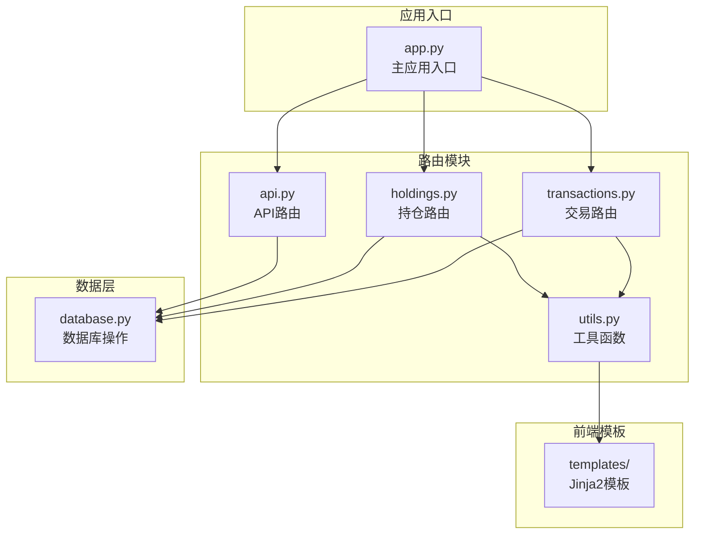
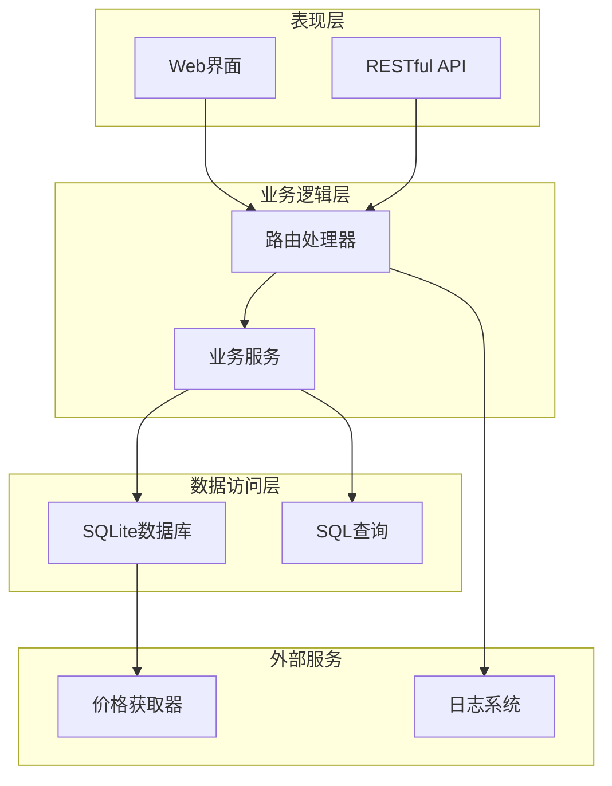
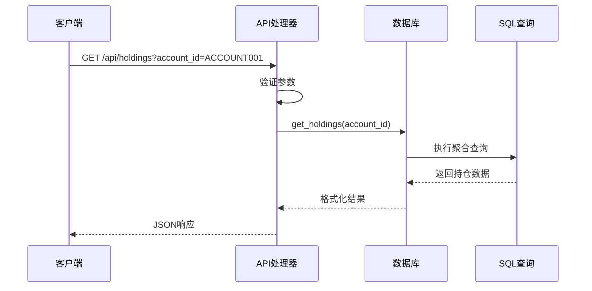
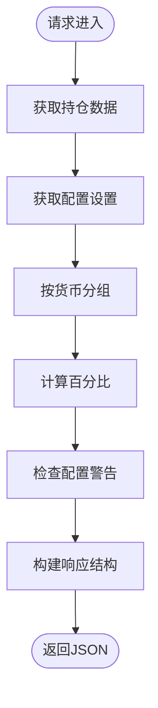
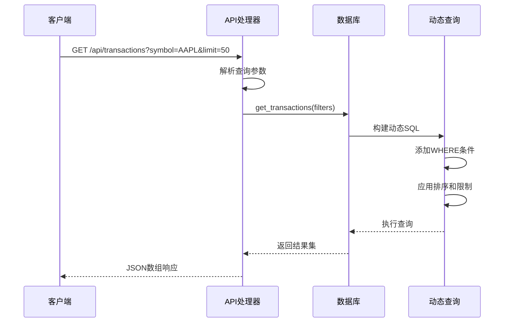
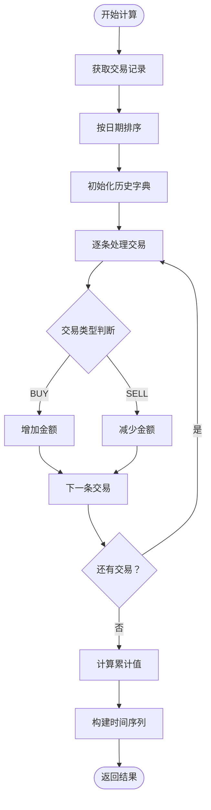
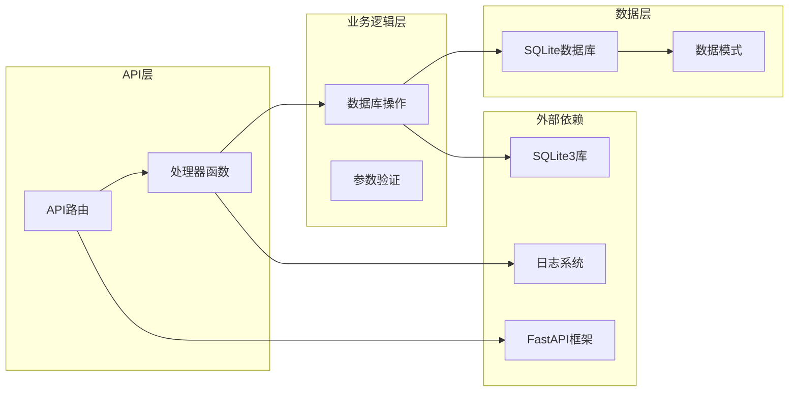

# API路由模块

<cite>
**本文档引用的文件**
- [app.py](file://app.py)
- [routers/api.py](file://routers/api.py)
- [routers/holdings.py](file://routers/holdings.py)
- [routers/transactions.py](file://routers/transactions.py)
- [routers/utils.py](file://routers/utils.py)
- [database.py](file://database.py)
- [templates/holdings.html](file://templates/holdings.html)
- [templates/transactions.html](file://templates/transactions.html)
</cite>

## 目录
1. [简介](#简介)
2. [项目结构](#项目结构)
3. [核心组件](#核心组件)
4. [架构概览](#架构概览)
5. [详细组件分析](#详细组件分析)
6. [依赖关系分析](#依赖关系分析)
7. [性能考虑](#性能考虑)
8. [故障排除指南](#故障排除指南)
9. [结论](#结论)

## 简介

本项目是一个基于FastAPI的投资组合管理系统，提供了完整的RESTful API路由模块。该模块实现了投资组合管理的核心功能，包括持仓查询、交易记录管理、投资组合历史分析等功能。系统采用SQLite作为数据存储，支持多账户、多币种的投资组合管理，并提供了实时价格更新和配置警告功能。

## 项目结构

项目采用模块化设计，主要分为以下几个核心部分：



**图表来源**
- [app.py](file://app.py#L1-L34)
- [routers/api.py](file://routers/api.py#L1-L67)
- [routers/holdings.py](file://routers/holdings.py#L1-L207)
- [routers/transactions.py](file://routers/transactions.py#L1-L75)

**章节来源**
- [app.py](file://app.py#L1-L34)
- [routers/api.py](file://routers/api.py#L1-L67)

## 核心组件

### API路由器配置

API路由模块通过FastAPI的APIRouter类实现，所有API端点都带有统一的前缀"/api"。该模块提供了四个主要的RESTful API端点：

1. **GET /api/holdings** - 获取当前持仓信息
2. **GET /api/holdings-by-currency** - 按货币分组显示持仓并包含配置警告
3. **GET /api/transactions** - 提供带过滤条件的交易查询
4. **GET /api/portfolio-history** - 计算投资组合历史价值
5. **DELETE /api/transactions/{transaction_id}** - 删除指定的交易记录

### 数据库集成

所有API端点都通过统一的数据库模块进行数据访问，确保了数据一致性和事务处理的完整性。数据库模块支持复杂的SQL查询、索引优化和数据验证。

**章节来源**
- [routers/api.py](file://routers/api.py#L6-L67)
- [database.py](file://database.py#L1-L151)

## 架构概览

系统采用分层架构设计，清晰分离了表现层、业务逻辑层和数据访问层：



**图表来源**
- [app.py](file://app.py#L11-L29)
- [routers/api.py](file://routers/api.py#L1-L67)
- [database.py](file://database.py#L15-L151)

## 详细组件分析

### API路由处理器详解

#### GET /api/holdings - 当前持仓查询

该端点提供当前投资组合的持仓信息查询功能，支持可选的账户ID过滤。

**请求参数：**
- `account_id` (可选): 账户ID过滤器

**响应数据结构：**
```json
[
  {
    "symbol": "AAPL",
    "account_id": "ACCOUNT001",
    "currency": "USD",
    "asset_type": "stock",
    "total_shares": 100,
    "total_cost": 15000.00,
    "avg_cost": 150.00
  }
]
```

**处理流程：**


**图表来源**
- [routers/api.py](file://routers/api.py#L8-L11)
- [database.py](file://database.py#L344-L390)

**章节来源**
- [routers/api.py](file://routers/api.py#L8-L11)
- [database.py](file://database.py#L344-L390)

#### GET /api/holdings-by-currency - 按货币分组的持仓分析

此端点提供按货币分组的投资组合分析，包含资产配置警告功能。

**响应数据结构：**
```json
{
  "CNY": {
    "total": 100000.00,
    "allocations": [
      {
        "asset_type": "stock",
        "label": "股票",
        "amount": 60000.00,
        "percent": 60.00,
        "min_percent": 30.00,
        "max_percent": 70.00,
        "warning": null
      },
      {
        "asset_type": "bond",
        "label": "债券",
        "amount": 20000.00,
        "percent": 20.00,
        "min_percent": 10.00,
        "max_percent": 30.00,
        "warning": "低于最小配置 10%"
      }
    ]
  }
}
```

**处理流程：**


**图表来源**
- [routers/api.py](file://routers/api.py#L13-L16)
- [database.py](file://database.py#L732-L785)

**章节来源**
- [routers/api.py](file://routers/api.py#L13-L16)
- [database.py](file://database.py#L732-L785)

#### GET /api/transactions - 交易记录查询

提供灵活的交易记录查询功能，支持多种过滤条件。

**请求参数：**
- `symbol` (可选): 股票代码过滤器
- `account_id` (可选): 账户ID过滤器  
- `transaction_type` (可选): 交易类型过滤器
- `limit` (可选, 默认: 100): 结果数量限制

**支持的交易类型：**
- BUY: 买入
- SELL: 卖出
- DIVIDEND: 分红
- SPLIT: 拆股
- TRANSFER_IN: 转入
- TRANSFER_OUT: 转出
- ADJUST: 调整
- INCOME: 收入

**响应数据结构：**
```json
[
  {
    "id": 1,
    "transaction_date": "2024-01-15",
    "symbol": "AAPL",
    "transaction_type": "BUY",
    "quantity": 100,
    "price": 150.00,
    "total_amount": 15000.00,
    "commission": 0.00,
    "currency": "USD",
    "account_id": "ACCOUNT001"
  }
]
```

**处理流程：**


**图表来源**
- [routers/api.py](file://routers/api.py#L18-L31)
- [database.py](file://database.py#L294-L341)

**章节来源**
- [routers/api.py](file://routers/api.py#L18-L31)
- [database.py](file://database.py#L294-L341)

#### GET /api/portfolio-history - 投资组合历史价值计算

计算投资组合的历史累计价值变化，用于图表展示。

**处理算法：**


**图表来源**
- [routers/api.py](file://routers/api.py#L33-L57)

**响应数据结构：**
```json
[
  {
    "date": "2024-01-01",
    "value": 100000.00
  },
  {
    "date": "2024-01-02", 
    "value": 105000.00
  }
]
```

**处理流程：**
1. 获取最多1000条交易记录
2. 按交易日期排序
3. 对每个交易日期计算净现金流（买入为正，卖出为负）
4. 计算累计净值
5. 返回时间序列数据

**章节来源**
- [routers/api.py](file://routers/api.py#L33-L57)

#### DELETE /api/transactions/{transaction_id} - 交易记录删除

提供安全的交易记录删除功能，包含错误处理和日志记录。

**请求参数：**
- `transaction_id` (路径参数): 要删除的交易记录ID

**响应数据结构：**
```json
{
  "status": "deleted"
}
```

**错误处理：**
- 404 Not Found: 当交易记录不存在时返回HTTP异常

**章节来源**
- [routers/api.py](file://routers/api.py#L59-L67)

### 参数处理机制

系统采用FastAPI的类型注解和默认值机制，确保参数处理的类型安全性和健壮性：

#### 可选参数处理
- 使用 `Optional[str] = None` 定义可选参数
- 自动处理None值和类型转换
- 支持空字符串到None的转换

#### 默认值设置
- 数字参数使用 `int = 100` 设置默认值
- 字符串参数使用 `str = "CNY"` 设置默认值
- 布尔参数使用 `bool = False` 设置默认值

#### 参数验证
- 类型自动验证和转换
- 必填参数强制要求
- 可选参数的可选性保证

### 错误处理策略

系统实现了多层次的错误处理机制：

1. **HTTP异常处理**: 对于不存在的资源返回404状态码
2. **日志记录**: 所有API操作都有详细的日志记录
3. **数据库异常**: 数据库操作失败时返回适当的错误信息
4. **参数验证**: 不合法的参数会触发相应的验证错误

**章节来源**
- [routers/api.py](file://routers/api.py#L60-L66)

## 依赖关系分析

### 组件耦合度分析



**图表来源**
- [routers/api.py](file://routers/api.py#L1-L67)
- [database.py](file://database.py#L1-L151)

### 外部依赖关系

系统的主要外部依赖包括：
- **FastAPI**: Web框架和API路由
- **SQLite3**: 数据库引擎
- **Jinja2**: 模板渲染引擎
- **Uvicorn**: ASGI服务器

**章节来源**
- [app.py](file://app.py#L7-L11)
- [database.py](file://database.py#L7-L12)

## 性能考虑

### 查询优化策略

1. **索引优化**: 数据库表建立了多个索引以加速查询
   - `idx_symbol`: 股票代码查询
   - `idx_date`: 日期范围查询  
   - `idx_account`: 账户过滤查询
   - `idx_type`: 交易类型过滤查询

2. **分页机制**: 交易查询默认限制100条记录，避免大数据量查询

3. **聚合查询**: 持仓计算使用SQL聚合函数，减少Python层面的数据处理

### 缓存策略

1. **最新价格缓存**: 实现了最新的市场价格缓存机制
2. **模板缓存**: Jinja2模板预编译缓存
3. **数据库连接池**: SQLite连接复用

### 并发处理

系统采用异步处理模型，支持高并发请求处理：
- 异步API端点定义
- 非阻塞数据库操作
- 并发安全的日志记录

## 故障排除指南

### 常见问题及解决方案

#### API端点无法访问
**症状**: 404 Not Found错误
**可能原因**:
- 路由器未正确注册
- URL路径拼写错误
- 服务器未启动

**解决方法**:
1. 检查应用启动日志
2. 验证URL路径是否正确
3. 确认路由器已包含在应用中

#### 数据查询结果为空
**症状**: 查询返回空数组或空字典
**可能原因**:
- 数据库中无匹配记录
- 过滤条件过于严格
- 数据库初始化失败

**解决方法**:
1. 检查数据库连接状态
2. 验证过滤参数的有效性
3. 确认测试数据的存在

#### 交易删除失败
**症状**: 删除操作返回404错误
**可能原因**:
- 交易ID不存在
- 数据库连接问题
- 权限不足

**解决方法**:
1. 验证交易ID的有效性
2. 检查数据库状态
3. 查看日志文件获取详细错误信息

### 调试技巧

1. **启用调试模式**: 在开发环境中启用详细日志
2. **使用API测试工具**: 推荐使用Postman或curl进行API测试
3. **检查响应头**: 关注Content-Type和Cache-Control头信息
4. **监控数据库查询**: 使用SQLite的EXPLAIN QUERY PLAN分析慢查询

**章节来源**
- [routers/api.py](file://routers/api.py#L60-L66)

## 结论

本API路由模块提供了完整、健壮且高性能的投资组合管理接口。通过合理的架构设计、完善的错误处理机制和优化的数据库查询，系统能够满足各种投资组合管理场景的需求。

### 主要优势

1. **RESTful设计**: 符合RESTful API设计原则，易于理解和使用
2. **类型安全**: 全面的类型注解确保运行时类型安全
3. **性能优化**: 合理的数据库索引和查询优化策略
4. **错误处理**: 完善的错误处理和日志记录机制
5. **扩展性**: 模块化设计便于功能扩展和维护

### 使用建议

1. **参数验证**: 始终验证输入参数的有效性
2. **错误处理**: 实现适当的错误处理和用户反馈
3. **性能监控**: 监控API响应时间和数据库查询性能
4. **安全考虑**: 在生产环境中启用适当的认证和授权机制

该模块为投资组合管理应用提供了坚实的技术基础，开发者可以在此基础上快速构建功能丰富的投资管理工具。