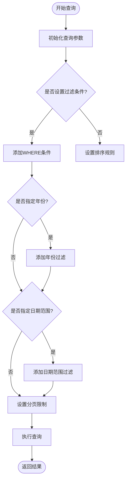

# 交易记录路由

<cite>
**本文档引用的文件**
- [app.py](file://app.py)
- [routers/transactions.py](file://routers/transactions.py)
- [routers/api.py](file://routers/api.py)
- [routers/utils.py](file://routers/utils.py)
- [database.py](file://database.py)
- [templates/transactions.html](file://templates/transactions.html)
- [templates/add.html](file://templates/add.html)
- [config.py](file://config.py)
- [logger_config.py](file://logger_config.py)
- [requirements.txt](file://requirements.txt)
</cite>

## 目录
1. [简介](#简介)
2. [项目结构](#项目结构)
3. [核心组件](#核心组件)
4. [架构概览](#架构概览)
5. [详细组件分析](#详细组件分析)
6. [依赖关系分析](#依赖关系分析)
7. [性能考虑](#性能考虑)
8. [故障排除指南](#故障排除指南)
9. [结论](#结论)
10. [附录](#附录)

## 简介

本项目是一个基于FastAPI的投资交易记录管理系统，专注于提供完整的交易管理功能。该系统实现了交易记录的增删改查操作，支持多种交易类型（买入、卖出、分红、拆分、转账等），并提供了直观的Web界面用于交易数据的管理和分析。

系统采用SQLite作为数据存储，通过Jinja2模板引擎渲染HTML页面，并使用日志记录关键操作。所有数据默认存储在iCloud Drive中，确保跨设备同步和备份。

## 项目结构

项目采用模块化设计，主要分为以下几个核心部分：

**图表来源**
- [app.py](file://app.py#L1-L34)
- [routers/transactions.py](file://routers/transactions.py#L1-L75)
- [routers/api.py](file://routers/api.py#L1-L67)
- [database.py](file://database.py#L1-L1047)

**章节来源**
- [app.py](file://app.py#L1-L34)
- [requirements.txt](file://requirements.txt#L1-L6)

## 核心组件

### 应用入口与初始化

应用入口位于`app.py`，负责：
- 创建FastAPI应用实例
- 配置静态文件服务
- 初始化数据库连接
- 注册所有路由模块

应用启动时会自动初始化数据库，确保所有必要的表和索引都已创建。

### 交易路由模块

交易路由模块（`routers/transactions.py`）提供以下核心功能：
- 交易列表展示（支持分页）
- 交易添加表单页面
- 交易表单提交处理
- 基于Jinja2模板的页面渲染

### 数据库模块

数据库模块（`database.py`）是系统的核心数据访问层，提供：
- 完整的交易CRUD操作
- 高级查询功能（支持多条件过滤）
- 现金关联机制
- 资产类型管理
- 持仓计算功能

### API路由模块

API路由模块（`routers/api.py`）提供RESTful接口：
- 交易查询API
- 交易删除API
- 持仓信息API
- 投资组合历史API

**章节来源**
- [app.py](file://app.py#L13-L34)
- [routers/transactions.py](file://routers/transactions.py#L1-L75)
- [routers/api.py](file://routers/api.py#L1-L67)
- [database.py](file://database.py#L1-L1047)

## 架构概览

系统采用经典的三层架构设计，各层职责清晰分离：

**图表来源**
- [app.py](file://app.py#L13-L34)
- [routers/transactions.py](file://routers/transactions.py#L1-L75)
- [database.py](file://database.py#L15-L188)

## 详细组件分析

### 交易管理功能

#### 交易类型支持

系统支持多种交易类型，每种类型都有特定的业务含义：

**图表来源**
- [database.py](file://database.py#L34-L40)
- [database.py](file://database.py#L70-L76)
- [database.py](file://database.py#L141-L146)

#### 交易CRUD操作实现

##### 创建交易（Create）

交易创建过程包含复杂的业务逻辑：

**图表来源**
- [routers/transactions.py](file://routers/transactions.py#L45-L75)
- [database.py](file://database.py#L195-L262)

##### 查询交易（Read）

系统提供灵活的查询功能：

**图表来源**
- [database.py](file://database.py#L331-L378)

##### 更新交易（Update）

更新操作支持选择性字段更新：

**图表来源**
- [database.py](file://database.py#L275-L313)

##### 删除交易（Delete）

删除操作采用直接删除策略：

**图表来源**
- [database.py](file://database.py#L316-L324)
- [routers/api.py](file://routers/api.py#L59-L66)

#### 现金关联机制

系统提供智能的现金关联功能，确保交易的会计平衡：

**图表来源**
- [database.py](file://database.py#L240-L260)

#### 交易查询过滤功能

系统支持多维度的交易查询过滤：

| 过滤条件 | 参数名称 | 类型 | 描述 |
|---------|---------|------|------|
| 交易符号 | symbol | 字符串 | 股票代码过滤 |
| 账户ID | account_id | 字符串 | 账户过滤 |
| 交易类型 | transaction_type | 字符串 | 交易类型过滤 |
| 货币类型 | currency | 字符串 | 货币过滤 |
| 年份 | year | 整数 | 年度过滤 |
| 开始日期 | start_date | 日期 | 开始时间过滤 |
| 结束日期 | end_date | 日期 | 结束时间过滤 |

**章节来源**
- [routers/transactions.py](file://routers/transactions.py#L10-L28)
- [database.py](file://database.py#L331-L378)
- [routers/api.py](file://routers/api.py#L18-L31)

### 用户界面逻辑

#### 交易列表页面

交易列表页面提供完整的交易记录展示和分页功能：

**图表来源**
- [templates/transactions.html](file://templates/transactions.html#L1-L91)

#### 添加交易表单

添加交易表单具有智能的动态行为：

**图表来源**
- [templates/add.html](file://templates/add.html#L179-L242)

#### 表单提交处理

表单提交采用异步处理机制：

**图表来源**
- [routers/transactions.py](file://routers/transactions.py#L45-L75)

#### 数据验证流程

系统在多个层面进行数据验证：

**图表来源**
- [templates/add.html](file://templates/add.html#L142-L146)
- [database.py](file://database.py#L214-L262)

**章节来源**
- [templates/transactions.html](file://templates/transactions.html#L1-L91)
- [templates/add.html](file://templates/add.html#L1-L259)

### 错误处理机制

#### 删除操作安全机制

系统在删除交易时采用严格的错误处理：

**图表来源**
- [templates/transactions.html](file://templates/transactions.html#L82-L88)
- [routers/api.py](file://routers/api.py#L59-L66)

#### 日志记录系统

系统使用结构化的日志记录：

**图表来源**
- [logger_config.py](file://logger_config.py#L14-L53)
- [routers/transactions.py](file://routers/transactions.py#L73-L74)

**章节来源**
- [routers/api.py](file://routers/api.py#L59-L66)
- [logger_config.py](file://logger_config.py#L1-L54)

## 依赖关系分析

### 外部依赖

系统依赖以下核心库：

**图表来源**
- [requirements.txt](file://requirements.txt#L1-L6)
- [app.py](file://app.py#L7-L11)

### 内部模块依赖

**图表来源**
- [app.py](file://app.py#L11-L29)
- [routers/transactions.py](file://routers/transactions.py#L1-L8)
- [routers/api.py](file://routers/api.py#L1-L6)

**章节来源**
- [requirements.txt](file://requirements.txt#L1-L6)
- [app.py](file://app.py#L11-L29)

## 性能考虑

### 数据库优化

系统采用了多项数据库优化策略：

1. **索引优化**：为常用查询字段创建索引
   - `idx_symbol`: 股票代码查询
   - `idx_date`: 日期范围查询  
   - `idx_account`: 账户过滤
   - `idx_type`: 交易类型过滤
   - `idx_currency`: 货币类型过滤
   - `idx_asset_type`: 资产类型过滤

2. **查询优化**：使用参数化查询防止SQL注入
3. **连接池**：使用Row工厂简化数据访问
4. **分页机制**：默认每页100条记录，支持大数据量场景

### 缓存策略

系统采用多层缓存机制：

1. **内存缓存**：活跃数据驻留内存
2. **磁盘缓存**：iCloud同步确保数据持久化
3. **模板缓存**：Jinja2模板编译缓存

### 性能监控

建议的性能监控指标：
- 数据库查询响应时间
- 页面渲染时间
- API接口响应时间
- 内存使用情况
- 磁盘I/O性能

## 故障排除指南

### 常见问题及解决方案

#### 数据库连接问题

**症状**：应用启动时报数据库连接错误
**原因**：数据库文件权限或路径问题
**解决方案**：
1. 检查iCloud权限设置
2. 验证数据库文件路径
3. 确认文件权限设置

#### 交易添加失败

**症状**：添加交易后无反应或报错
**原因**：表单验证失败或数据库约束冲突
**解决方案**：
1. 检查必填字段是否完整
2. 验证金额计算是否正确
3. 确认账户是否存在

#### 删除操作失败

**症状**：删除交易时报404错误
**原因**：交易ID不存在或已被删除
**解决方案**：
1. 刷新页面确认交易状态
2. 检查交易ID是否正确
3. 查看日志文件获取详细信息

#### 性能问题

**症状**：页面加载缓慢或查询超时
**原因**：数据量过大或缺少索引
**解决方案**：
1. 使用分页功能
2. 添加适当的过滤条件
3. 考虑增加数据库索引

**章节来源**
- [logger_config.py](file://logger_config.py#L14-L53)
- [database.py](file://database.py#L179-L185)

## 结论

本交易记录路由系统提供了完整而强大的投资交易管理功能。通过清晰的模块化设计、完善的错误处理机制和友好的用户界面，系统能够满足个人投资者对交易记录管理的各种需求。

系统的主要优势包括：
- **功能完整性**：支持所有常见交易类型的管理
- **用户体验**：直观的Web界面和智能表单验证
- **数据安全**：严格的删除确认和日志记录
- **扩展性**：模块化设计便于功能扩展
- **可靠性**：完善的错误处理和性能优化

建议的后续改进方向：
1. 添加交易编辑功能
2. 实现批量操作支持
3. 增强报表生成功能
4. 优化移动端适配
5. 添加数据导入导出功能

## 附录

### API端点参考

| 端点 | 方法 | 功能 | 参数 |
|------|------|------|------|
| `/transactions` | GET | 获取交易列表 | page |
| `/add` | GET | 显示添加交易页面 | - |
| `/add` | POST | 提交新交易 | 交易表单字段 |
| `/api/transactions` | GET | 获取交易数据 | 可选过滤参数 |
| `/api/transactions/{id}` | DELETE | 删除交易 | 交易ID |
| `/api/holdings` | GET | 获取持仓信息 | account_id |
| `/api/portfolio-history` | GET | 获取投资组合历史 | - |

### 配置选项

系统支持以下配置选项：
- 数据库路径：默认存储在iCloud Drive
- 日志级别：INFO级别，保留7天日志
- 分页大小：每页100条记录
- 货币支持：CNY、USD、HKD
- 资产类型：stock、bond、metal、cash