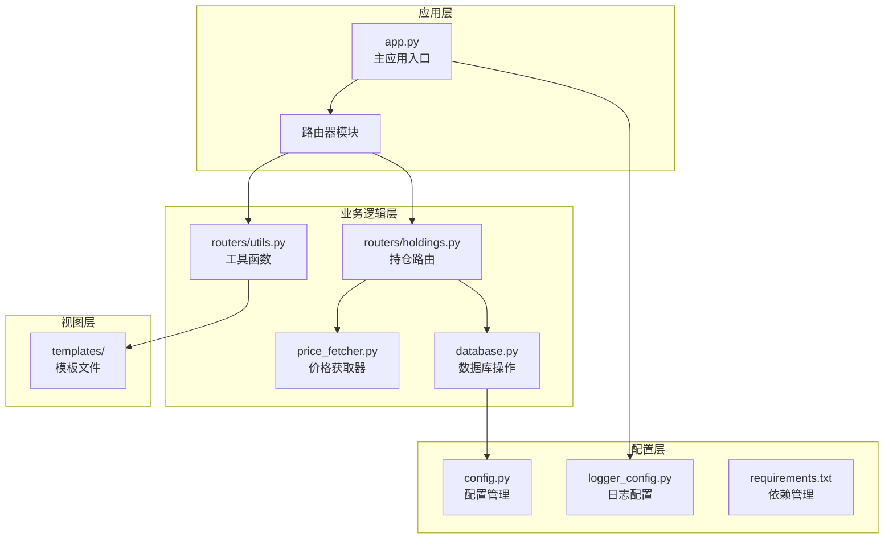
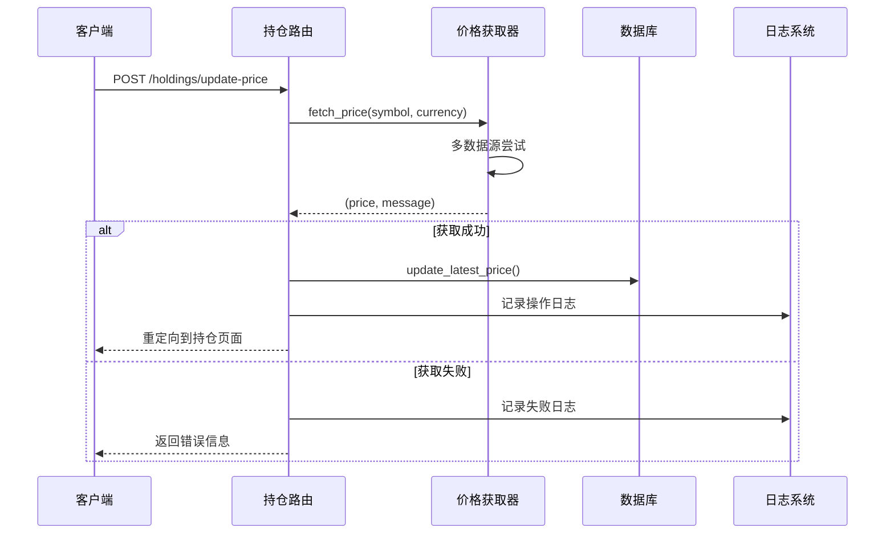
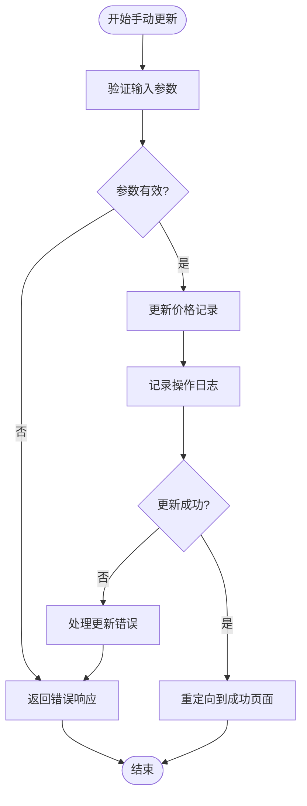
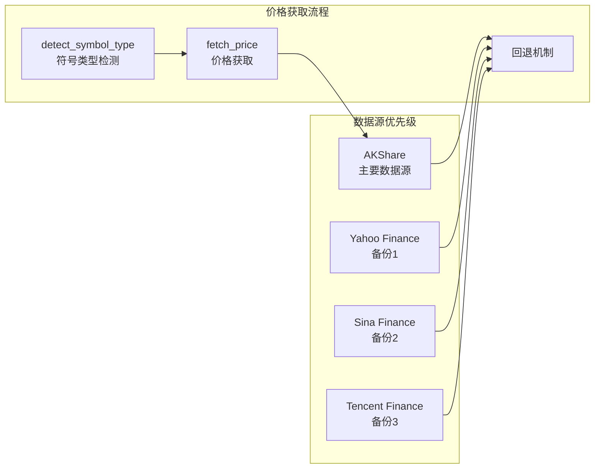
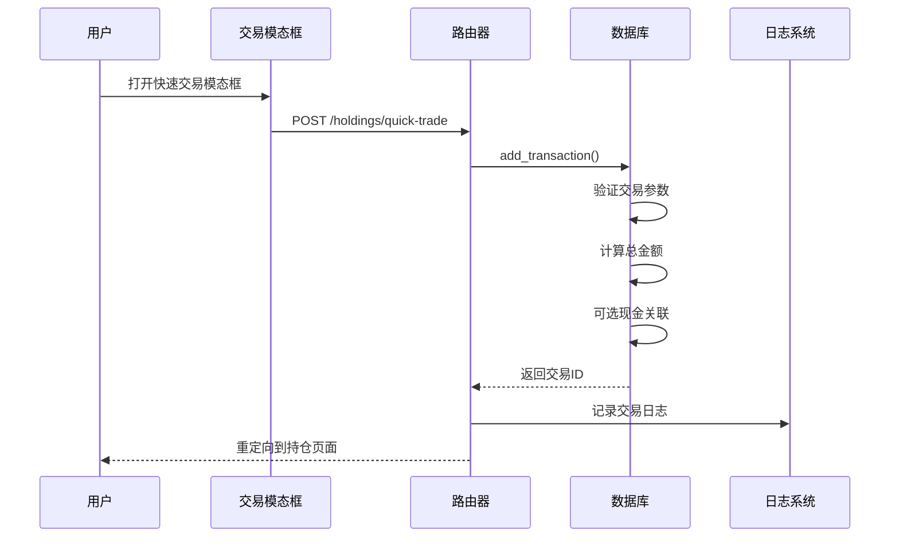
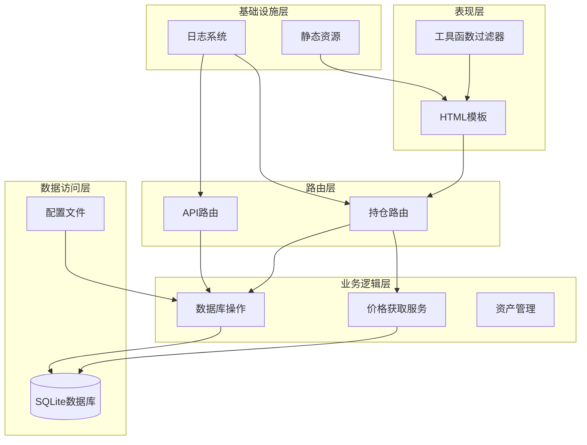
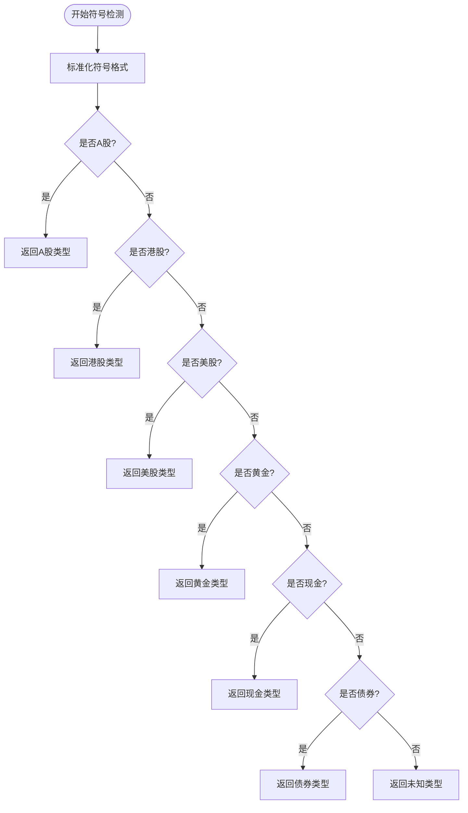
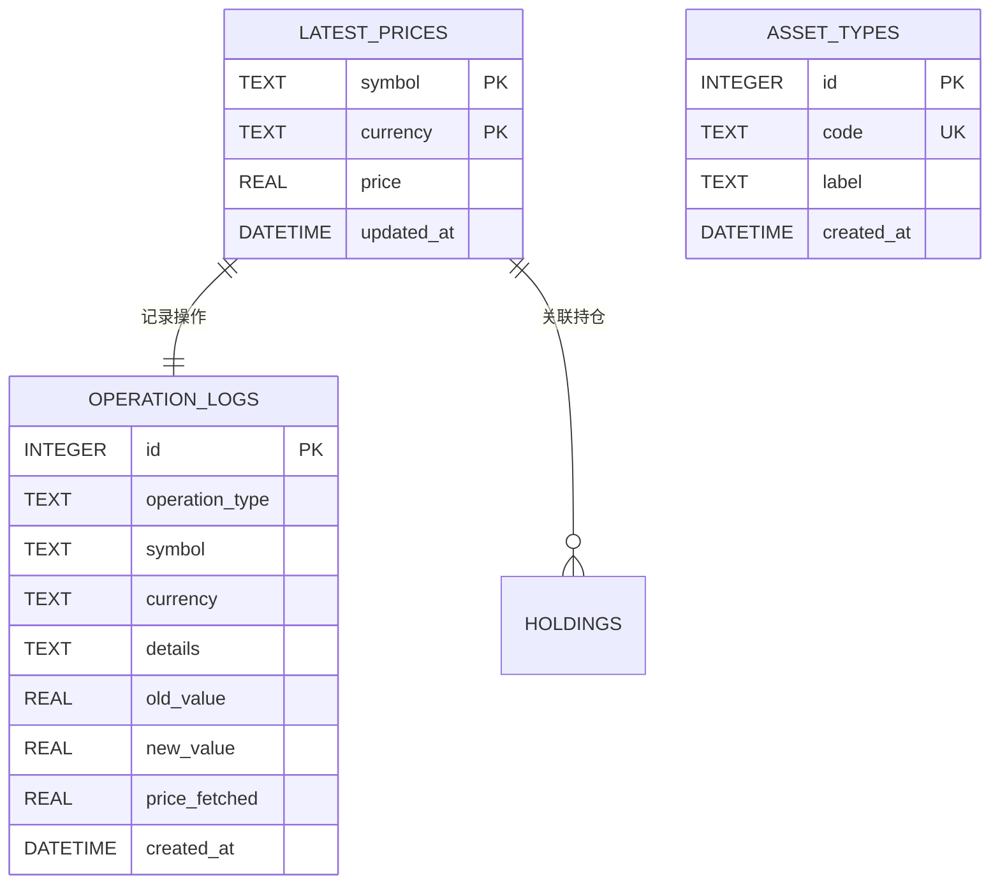
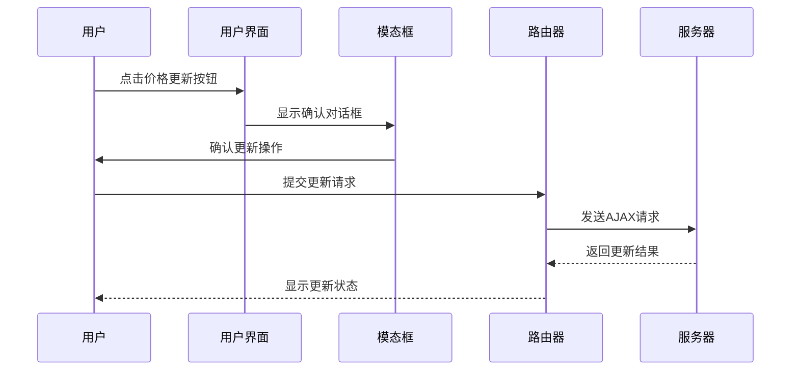
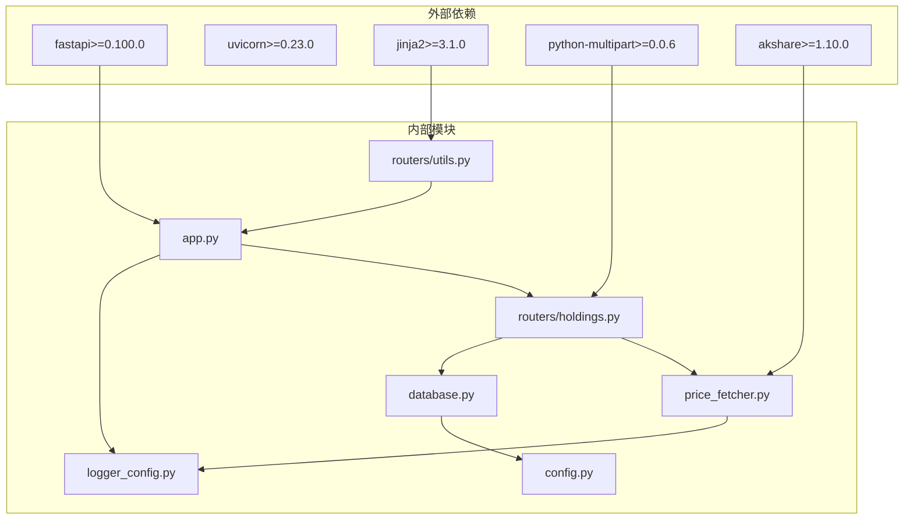

# 工具函数路由

<cite>
**本文档引用的文件**
- [app.py](file://app.py)
- [routers/utils.py](file://routers/utils.py)
- [routers/holdings.py](file://routers/holdings.py)
- [price_fetcher.py](file://price_fetcher.py)
- [database.py](file://database.py)
- [config.py](file://config.py)
- [logger_config.py](file://logger_config.py)
- [requirements.txt](file://requirements.txt)
- [templates/holdings.html](file://templates/holdings.html)
</cite>

## 目录
1. [简介](#简介)
2. [项目结构](#项目结构)
3. [核心组件](#核心组件)
4. [架构概览](#架构概览)
5. [详细组件分析](#详细组件分析)
6. [依赖关系分析](#依赖关系分析)
7. [性能考虑](#性能考虑)
8. [故障排除指南](#故障排除指南)
9. [结论](#结论)
10. [附录](#附录)

## 简介

本文件详细说明投资日志系统中的工具函数路由实现，重点涵盖价格获取触发、数据刷新和批量操作功能。该系统通过FastAPI提供Web接口，结合多数据源价格获取服务，实现资产价格的实时更新和管理。

## 项目结构

项目采用模块化设计，主要包含以下核心模块：

**图表来源**
- [app.py](file://app.py#L1-L34)
- [routers/holdings.py](file://routers/holdings.py#L1-L207)
- [routers/utils.py](file://routers/utils.py#L1-L14)

**章节来源**
- [app.py](file://app.py#L1-L34)
- [config.py](file://config.py#L1-L24)

## 核心组件

### 价格获取路由系统

系统实现了完整的价格获取和更新机制，包含自动获取和手动更新两种方式：

#### 自动价格获取流程

**图表来源**
- [routers/holdings.py](file://routers/holdings.py#L102-L147)
- [price_fetcher.py](file://price_fetcher.py#L325-L401)
- [database.py](file://database.py#L875-L895)

#### 手动价格更新流程

**图表来源**
- [routers/holdings.py](file://routers/holdings.py#L149-L176)
- [database.py](file://database.py#L875-L895)

**章节来源**
- [routers/holdings.py](file://routers/holdings.py#L102-L176)
- [price_fetcher.py](file://price_fetcher.py#L325-L401)

### 数据刷新机制

系统提供了多种数据刷新策略：

#### 多数据源切换机制

**图表来源**
- [price_fetcher.py](file://price_fetcher.py#L36-L66)
- [price_fetcher.py](file://price_fetcher.py#L325-L401)

#### 错误重试策略
系统采用渐进式重试策略，按优先级顺序尝试多个数据源：

**章节来源**
- [price_fetcher.py](file://price_fetcher.py#L325-L401)

### 批量操作功能

系统支持快速交易等批量操作功能：

#### 快速交易流程

**图表来源**
- [routers/holdings.py](file://routers/holdings.py#L178-L206)
- [database.py](file://database.py#L195-L262)

**章节来源**
- [routers/holdings.py](file://routers/holdings.py#L178-L206)
- [database.py](file://database.py#L195-L262)

## 架构概览

系统采用分层架构设计，各层职责明确：

**图表来源**
- [app.py](file://app.py#L24-L29)
- [routers/holdings.py](file://routers/holdings.py#L1-L207)
- [price_fetcher.py](file://price_fetcher.py#L1-L405)
- [database.py](file://database.py#L1-L1047)

## 详细组件分析

### 价格获取器组件

#### 符号类型检测算法

**图表来源**
- [price_fetcher.py](file://price_fetcher.py#L36-L66)

#### 多数据源价格获取策略
系统实现了智能的数据源选择和回退机制：

**章节来源**
- [price_fetcher.py](file://price_fetcher.py#L36-L66)
- [price_fetcher.py](file://price_fetcher.py#L325-L401)

### 数据库操作组件

#### 最新价格管理

**图表来源**
- [database.py](file://database.py#L167-L177)
- [database.py](file://database.py#L152-L165)
- [database.py](file://database.py#L127-L136)

#### 操作日志追踪
系统提供完整的操作日志记录功能，支持价格更新、手动更新、交易等各类操作的追踪。

**章节来源**
- [database.py](file://database.py#L829-L868)
- [database.py](file://database.py#L875-L921)

### 工具函数组件

#### Jinja2模板过滤器
系统提供了专门的货币格式化工具函数：

**章节来源**
- [routers/utils.py](file://routers/utils.py#L1-L14)

### 前端交互组件

#### 价格更新用户界面

**图表来源**
- [templates/holdings.html](file://templates/holdings.html#L187-L228)
- [routers/holdings.py](file://routers/holdings.py#L102-L147)

**章节来源**
- [templates/holdings.html](file://templates/holdings.html#L187-L228)

## 依赖关系分析

系统依赖关系清晰，遵循单一职责原则：

**图表来源**
- [requirements.txt](file://requirements.txt#L1-L6)
- [app.py](file://app.py#L7-L11)

**章节来源**
- [requirements.txt](file://requirements.txt#L1-L6)

## 性能考虑

### 缓存管理策略

系统通过以下机制优化性能：

1. **数据库连接池**: 使用SQLite原生连接管理
2. **索引优化**: 为常用查询字段建立索引
3. **批量查询**: 支持一次性获取所有最新价格
4. **内存优化**: 价格数据以字典形式缓存

### 执行频率控制

系统通过以下方式控制执行频率：

- **防抖机制**: 前端提供确认对话框
- **日志限流**: 合理的日志记录频率
- **数据库事务**: 批量操作使用事务提交

### 内存优化措施

- **延迟加载**: 仅在需要时加载价格数据
- **数据压缩**: 使用紧凑的数据结构存储
- **及时释放**: 操作完成后及时关闭数据库连接

## 故障排除指南

### 常见问题及解决方案

#### 价格获取失败
- **症状**: 价格更新返回失败消息
- **原因**: 数据源不可用或网络连接问题
- **解决**: 检查网络连接，使用手动更新功能

#### 数据库连接错误
- **症状**: 操作超时或连接失败
- **原因**: iCloud同步问题或权限不足
- **解决**: 检查iCloud设置和文件权限

#### 前端交互问题
- **症状**: 模态框无法显示或按钮无响应
- **原因**: JavaScript错误或模板渲染问题
- **解决**: 检查浏览器控制台错误信息

**章节来源**
- [logger_config.py](file://logger_config.py#L1-L54)
- [price_fetcher.py](file://price_fetcher.py#L383-L396)

## 结论

该工具函数路由系统提供了完整的资产价格管理功能，具有以下特点：

1. **多数据源支持**: 实现了可靠的价格获取机制
2. **灵活的操作方式**: 支持自动和手动两种价格更新模式
3. **完善的日志系统**: 提供完整的操作追踪能力
4. **用户友好的界面**: 提供直观的交互体验
5. **可扩展的设计**: 为后续功能扩展预留了空间

系统通过合理的架构设计和性能优化，在保证功能完整性的同时，确保了良好的用户体验和系统稳定性。

## 附录

### 使用场景示例

#### 场景1：日常价格监控
- **触发时机**: 每日收盘后
- **执行频率**: 每日一次
- **操作流程**: 自动获取所有持仓价格

#### 场景2：手动价格调整
- **触发时机**: 市场异常波动时
- **执行频率**: 按需进行
- **操作流程**: 手动输入当前市场价格

#### 场景3：批量交易处理
- **触发时机**: 有新的交易发生时
- **执行频率**: 实时处理
- **操作流程**: 快速录入交易信息

### 参数配置说明

#### 价格获取参数
- `symbol`: 资产代码（必填）
- `currency`: 货币类型（必填）
- `asset_type`: 资产类型（默认：stock）

#### 手动更新参数
- `price`: 手动输入的价格（必填）
- 其他参数同自动更新

### 结果验证方法

1. **前端验证**: 检查页面显示的价格更新状态
2. **数据库验证**: 查询最新价格表确认数据
3. **日志验证**: 查看操作日志确认执行情况
4. **API验证**: 通过API接口验证数据一致性

### 扩展开发指南

#### 新增数据源支持
1. 在`price_fetcher.py`中添加新的数据源函数
2. 更新`detect_symbol_type`函数以识别新类型
3. 在`fetch_price`函数中添加数据源优先级

#### 自定义工具函数
1. 在`routers/utils.py`中添加新的过滤器函数
2. 在模板中使用新的过滤器
3. 添加相应的CSS样式支持

#### 批量操作扩展
1. 在`routers/holdings.py`中添加新的路由处理函数
2. 创建相应的HTML模板
3. 实现数据库批量操作函数