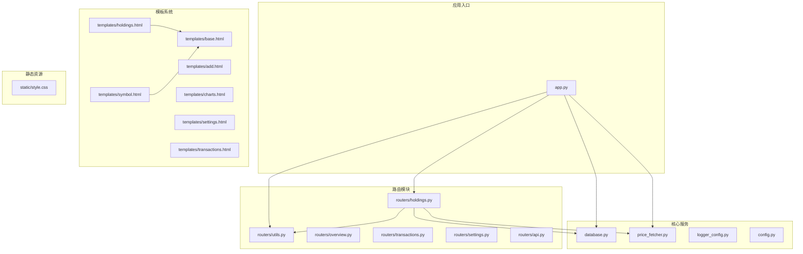
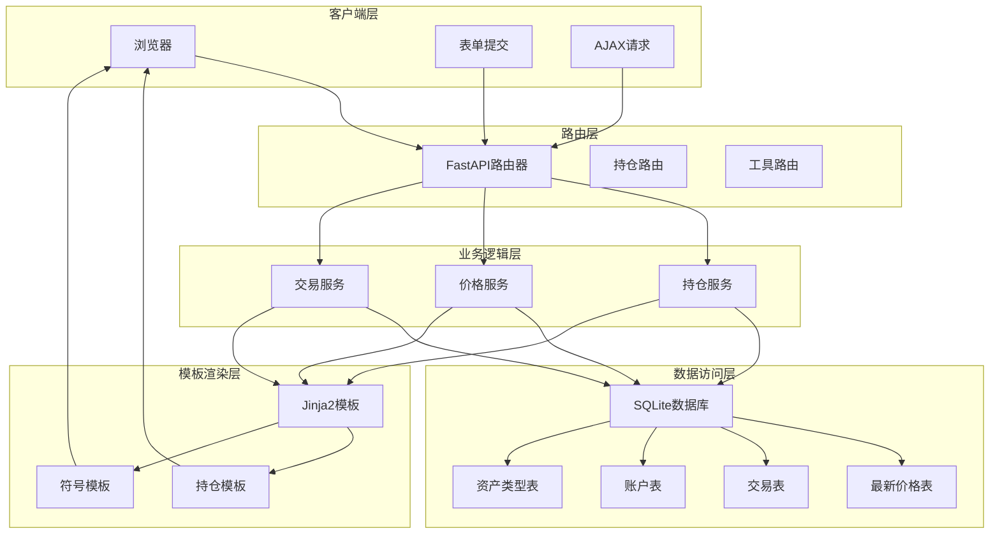
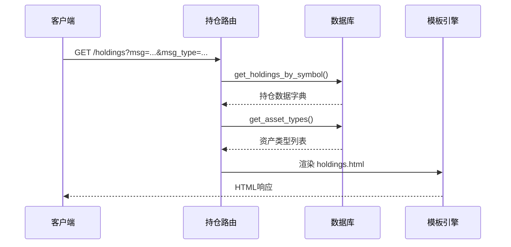
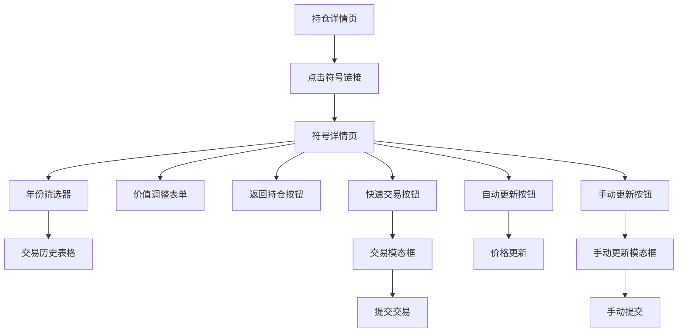
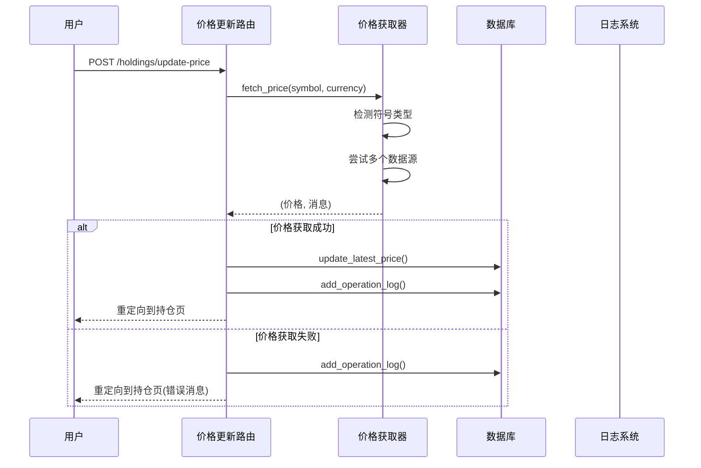
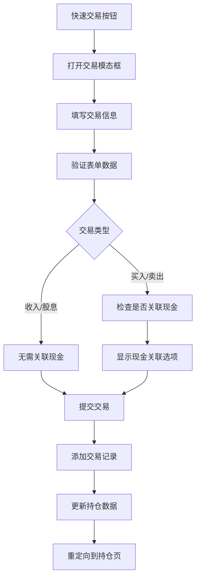
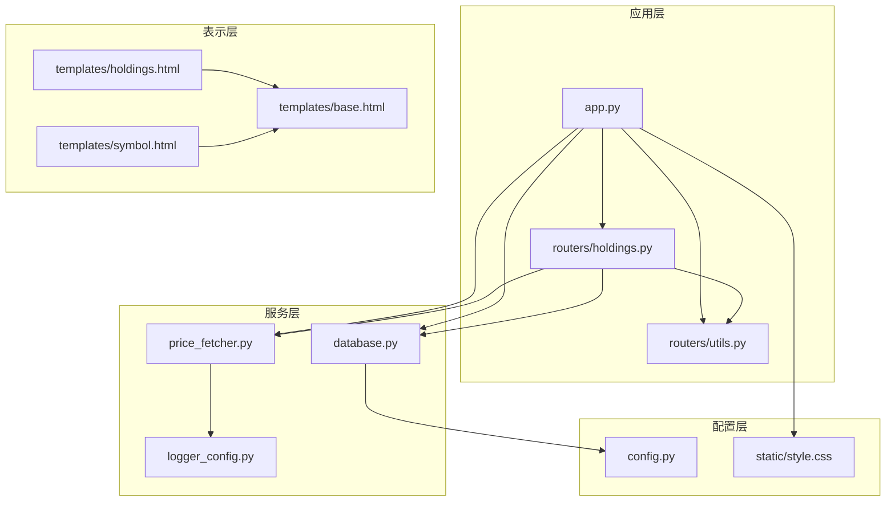

# 持仓管理路由

<cite>
**本文档引用的文件**
- [app.py](file://app.py)
- [routers/holdings.py](file://routers/holdings.py)
- [routers/utils.py](file://routers/utils.py)
- [database.py](file://database.py)
- [price_fetcher.py](file://price_fetcher.py)
- [templates/holdings.html](file://templates/holdings.html)
- [templates/symbol.html](file://templates/symbol.html)
- [templates/base.html](file://templates/base.html)
</cite>

## 目录
1. [简介](#简介)
2. [项目结构](#项目结构)
3. [核心组件](#核心组件)
4. [架构概览](#架构概览)
5. [详细组件分析](#详细组件分析)
6. [依赖关系分析](#依赖关系分析)
7. [性能考虑](#性能考虑)
8. [故障排除指南](#故障排除指南)
9. [结论](#结论)

## 简介

投资日志系统是一个基于FastAPI的Web应用程序，专门用于跟踪和管理个人投资组合。该系统提供了完整的持仓管理功能，包括持仓详情展示、符号查询、价格更新、交易记录管理和资产类型管理等核心功能。

本系统采用模块化设计，通过路由器（Routers）组织不同的功能模块，使用Jinja2模板引擎进行页面渲染，并通过SQLite数据库存储所有交易和持仓数据。系统支持多币种（人民币、美元、港币）和多种资产类型（股票、债券、贵金属、现金），并提供了灵活的价格获取机制。

## 项目结构

项目采用清晰的分层架构，主要包含以下核心目录和文件：



**图表来源**
- [app.py](file://app.py#L1-L34)
- [routers/holdings.py](file://routers/holdings.py#L1-L207)
- [templates/holdings.html](file://templates/holdings.html#L1-L274)

**章节来源**
- [app.py](file://app.py#L1-L34)
- [routers/holdings.py](file://routers/holdings.py#L1-L207)

## 核心组件

### 应用程序入口

应用通过FastAPI框架启动，配置静态文件服务和数据库初始化。主应用文件负责：
- 创建FastAPI实例并设置标题
- 挂载静态文件目录
- 在启动事件中初始化数据库
- 包含所有路由模块

### 路由器模块

持仓管理路由位于`routers/holdings.py`文件中，包含以下核心路由：
- `/holdings` - 持仓详情页面
- `/symbol/{symbol}` - 符号详情页面  
- `/symbol/{symbol}/adjust` - 调整资产价值
- `/holdings/update-price` - 自动更新价格
- `/holdings/manual-update-price` - 手动更新价格
- `/holdings/quick-trade` - 快速交易

### 数据库层

数据库模块提供完整的交易和持仓管理功能：
- 交易记录的增删改查操作
- 持仓计算和汇总
- 最新价格管理和缓存
- 资产类型管理
- 操作日志记录

### 模板系统

系统使用Jinja2模板引擎，提供响应式页面布局：
- 基础模板定义导航和样式
- 持仓页面显示详细的持仓信息
- 符号页面展示交易历史和价值调整
- 支持多币种和资产类型的动态显示

**章节来源**
- [app.py](file://app.py#L1-L34)
- [routers/holdings.py](file://routers/holdings.py#L1-L207)
- [database.py](file://database.py#L1-L1010)

## 架构概览

系统采用经典的MVC架构模式，结合现代Web开发的最佳实践：



**图表来源**
- [routers/holdings.py](file://routers/holdings.py#L1-L207)
- [database.py](file://database.py#L1-L1010)
- [routers/utils.py](file://routers/utils.py#L1-L4)

## 详细组件分析

### 持仓详情页面路由

持仓详情页面是系统的核心功能之一，提供全面的投资组合视图：

#### 路由定义与参数处理



**图表来源**
- [routers/holdings.py](file://routers/holdings.py#L13-L30)
- [database.py](file://database.py#L393-L463)

#### 数据计算逻辑

系统采用SQL聚合查询计算持仓数据，包括：
- 总股数：根据交易类型累加或减去数量
- 总成本：根据交易类型累加或减去金额
- 成本均价：总成本除以总股数
- 市场价值：最新价格乘以股数
- 未实现盈亏：市场价值减去总成本

#### 多币种支持

系统支持三种货币的持仓管理：
- 人民币（CNY）
- 美元（USD）  
- 港币（HKD）

每种货币的持仓独立计算和显示，确保跨币种投资组合的准确性。

#### 资产类型管理

系统支持四种主要资产类型：
- 股票（stock）
- 债券（bond）
- 贵金属（metal）
- 现金（cash）

资产类型通过数据库表管理，支持动态添加和删除。

**章节来源**
- [routers/holdings.py](file://routers/holdings.py#L13-L30)
- [database.py](file://database.py#L344-L463)

### 符号详情页面路由

符号详情页面提供特定投资标的的详细信息和历史记录：

#### 页面导航逻辑



**图表来源**
- [templates/holdings.html](file://templates/holdings.html#L48-L95)
- [templates/symbol.html](file://templates/symbol.html#L64-L103)

#### 交易历史查询

符号详情页面支持按年份筛选交易历史：
- 动态生成年份按钮
- 支持最多500条交易记录
- 显示详细的交易信息（日期、类型、数量、价格、总额、备注）

#### 价值调整功能

系统提供灵活的价值调整机制：
- 基于当前持有量计算的新价值
- 自动生成调整交易记录
- 支持备注说明调整原因

**章节来源**
- [routers/holdings.py](file://routers/holdings.py#L32-L76)
- [templates/symbol.html](file://templates/symbol.html#L1-L105)

### 价格更新功能

系统提供两种价格更新方式，确保持仓数据的实时性：

#### 自动价格获取



**图表来源**
- [routers/holdings.py](file://routers/holdings.py#L102-L147)
- [price_fetcher.py](file://price_fetcher.py#L325-L401)

#### 多数据源支持

系统支持四个主要数据源，按优先级顺序尝试：
1. **AKShare** - 主要数据源，支持A股、港股、美股和黄金
2. **Yahoo Finance** - 备用数据源，主要用于美股和黄金
3. **新浪金融API** - 备用数据源，支持A股和港股
4. **腾讯金融API** - 备用数据源，支持A股、港股和美股

#### 符号类型检测

系统能够智能识别不同类型的金融产品：
- A股：600xxx、000xxx等代码格式
- 港股：5位数字代码
- 美股：纯字母符号
- 黄金：包含AU或GOLD标识
- 现金：CASH标识

**章节来源**
- [routers/holdings.py](file://routers/holdings.py#L102-L176)
- [price_fetcher.py](file://price_fetcher.py#L36-L66)

### 快速交易功能

系统提供便捷的快速交易功能，允许直接从持仓页面进行买卖操作：

#### 交易流程



**图表来源**
- [templates/holdings.html](file://templates/holdings.html#L104-L161)
- [routers/holdings.py](file://routers/holdings.py#L178-L206)

#### 现金关联机制

系统支持自动现金关联功能：
- 买入时自动创建卖出现金交易
- 卖出时自动创建买入现金交易
- 自动计算交易金额（含手续费）
- 保持会计平衡

**章节来源**
- [routers/holdings.py](file://routers/holdings.py#L178-L206)
- [database.py](file://database.py#L202-L225)

## 依赖关系分析

系统采用模块化设计，各组件之间的依赖关系清晰明确：



**图表来源**
- [app.py](file://app.py#L1-L34)
- [routers/holdings.py](file://routers/holdings.py#L1-L11)
- [database.py](file://database.py#L1-L12)

### 组件耦合度分析

系统设计遵循低耦合高内聚的原则：
- **路由层**：仅依赖数据库和价格获取器接口
- **数据库层**：封装所有数据访问逻辑
- **模板层**：专注于数据展示和用户交互
- **服务层**：提供独立的功能服务

### 循环依赖检查

经过分析，系统不存在循环依赖：
- 路由器依赖数据库和服务层
- 数据库不依赖路由器
- 模板不依赖业务逻辑
- 服务层相互独立

**章节来源**
- [app.py](file://app.py#L1-L34)
- [routers/holdings.py](file://routers/holdings.py#L1-L11)
- [database.py](file://database.py#L1-L12)

## 性能考虑

### 数据库优化

系统采用多种策略优化数据库性能：

#### 索引策略
- 为常用查询字段建立索引：symbol、transaction_date、account_id、transaction_type、currency、asset_type
- 使用复合索引减少查询时间
- 定期维护索引以保持最佳性能

#### 查询优化
- 使用聚合查询一次性获取所需数据
- 避免N+1查询问题
- 合理使用LIMIT和OFFSET进行分页

#### 连接池管理
- 使用连接工厂模式管理数据库连接
- 及时关闭数据库连接释放资源
- 避免长时间持有连接

### 缓存策略

系统实现了多层次的缓存机制：

#### 最新价格缓存
- 将最新价格存储在内存字典中
- 减少重复的数据库查询
- 支持批量价格更新

#### 模板缓存
- 使用Jinja2内置缓存机制
- 减少模板解析开销
- 提升页面渲染速度

### 异步处理

系统支持异步操作以提升用户体验：
- 异步价格获取避免阻塞主线程
- 异步数据库操作提升并发性能
- 异步日志记录不影响业务流程

## 故障排除指南

### 常见问题及解决方案

#### 价格获取失败

**问题症状**：价格更新按钮无响应或显示错误消息

**可能原因**：
1. 网络连接问题
2. 数据源API限制
3. 符号格式不正确
4. 第三方服务不可用

**解决步骤**：
1. 检查网络连接状态
2. 验证符号格式是否符合要求
3. 查看操作日志获取详细错误信息
4. 尝试手动更新价格
5. 检查第三方服务可用性

#### 持仓数据显示异常

**问题症状**：持仓总数、成本均价或盈亏显示不正确

**可能原因**：
1. 交易记录缺失或损坏
2. 货币转换问题
3. 资产类型配置错误
4. 数据库索引损坏

**解决步骤**：
1. 检查相关交易记录的完整性
2. 验证货币和汇率设置
3. 确认资产类型配置正确
4. 重新初始化数据库索引
5. 手动触发重新计算

#### 页面加载缓慢

**问题症状**：页面响应时间过长

**可能原因**：
1. 数据库查询过于复杂
2. 模板渲染耗时过长
3. 静态资源加载问题
4. 浏览器缓存问题

**解决步骤**：
1. 分析慢查询并优化SQL语句
2. 简化复杂模板逻辑
3. 检查静态文件路径配置
4. 清除浏览器缓存后重试

### 调试工具和技巧

#### 日志分析

系统提供详细的日志记录功能：
- 记录所有价格获取尝试
- 记录数据库操作日志
- 记录用户操作行为
- 支持错误级别分类

#### 数据库诊断

```sql
-- 检查持仓数据完整性
SELECT symbol, currency, asset_type, 
       SUM(CASE WHEN transaction_type IN ('BUY','INCOME') THEN quantity ELSE -quantity END) as total_shares,
       SUM(CASE WHEN transaction_type IN ('BUY','INCOME') THEN total_amount ELSE -total_amount END) as total_cost
FROM transactions 
GROUP BY symbol, currency, asset_type
HAVING total_shares < 0 OR total_cost < 0;

-- 检查最新价格数据
SELECT symbol, currency, price, updated_at 
FROM latest_prices 
WHERE updated_at < datetime('now', '-1 day');
```

**章节来源**
- [database.py](file://database.py#L792-L831)
- [price_fetcher.py](file://price_fetcher.py#L382-L401)

## 结论

投资日志系统的持仓管理路由设计体现了现代Web应用的最佳实践。通过清晰的模块化架构、完善的错误处理机制和灵活的数据模型，系统能够有效管理复杂的多币种、多资产类型投资组合。

### 主要优势

1. **模块化设计**：路由、服务、数据访问层分离，便于维护和扩展
2. **多数据源支持**：提供可靠的价格获取机制，确保数据准确性
3. **用户友好界面**：响应式设计和直观的操作流程
4. **完整功能覆盖**：从基础持仓查看到高级交易管理一应俱全
5. **可扩展性**：支持新的资产类型和数据源的添加

### 技术亮点

- **智能符号识别**：自动识别不同市场的金融产品
- **灵活的交易处理**：支持多种交易类型和复杂的会计处理
- **实时价格更新**：多种数据源备份确保价格获取的可靠性
- **详尽的日志记录**：完整的操作审计和问题追踪能力

### 发展建议

1. **性能监控**：添加应用性能监控指标
2. **API文档**：为内部API生成自动化文档
3. **测试覆盖**：增加单元测试和集成测试
4. **国际化支持**：添加多语言界面支持
5. **移动端优化**：改进移动设备的用户体验

该系统为个人投资者提供了一个强大而易用的投资组合管理工具，通过持续的优化和扩展，能够满足不断增长的资产管理需求。