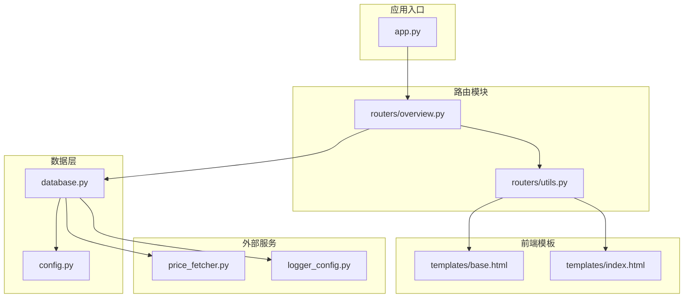
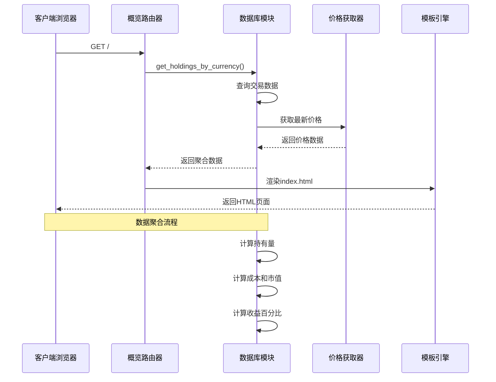
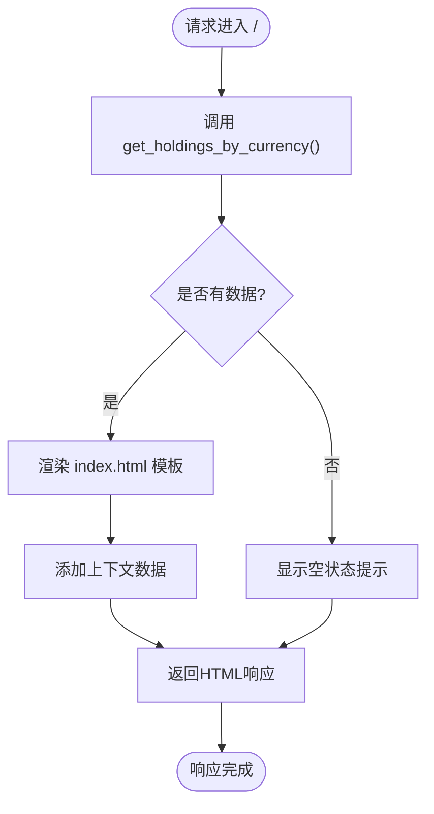
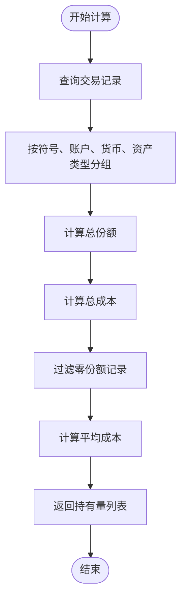
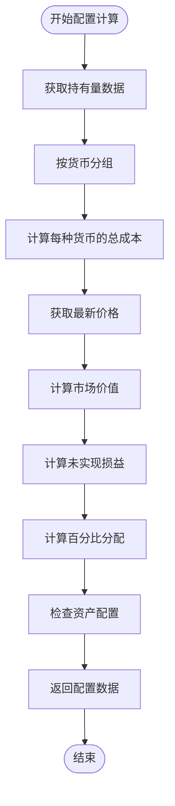
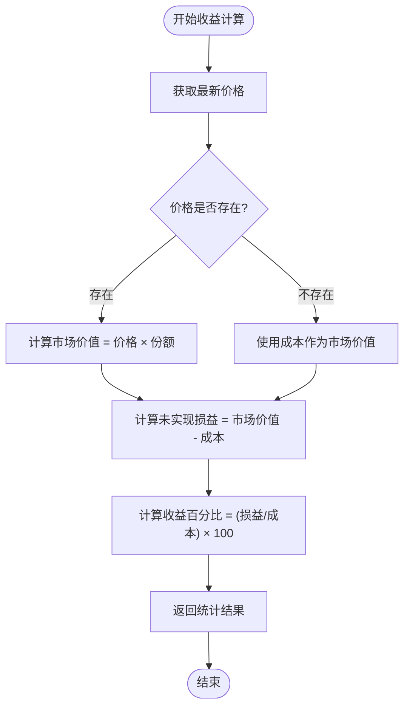
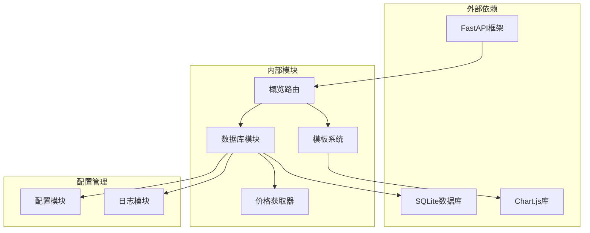

# 概览页面路由

<cite>
**本文档引用的文件**
- [app.py](file://app.py)
- [routers/overview.py](file://routers/overview.py)
- [routers/utils.py](file://routers/utils.py)
- [database.py](file://database.py)
- [price_fetcher.py](file://price_fetcher.py)
- [templates/index.html](file://templates/index.html)
- [templates/base.html](file://templates/base.html)
- [config.py](file://config.py)
- [logger_config.py](file://logger_config.py)
</cite>

## 目录
1. [简介](#简介)
2. [项目结构](#项目结构)
3. [核心组件](#核心组件)
4. [架构概览](#架构概览)
5. [详细组件分析](#详细组件分析)
6. [依赖关系分析](#依赖关系分析)
7. [性能考虑](#性能考虑)
8. [故障排除指南](#故障排除指南)
9. [结论](#结论)

## 简介

概览页面路由是投资记录应用的核心功能模块，负责提供投资组合的实时概览视图。该模块通过整合数据库中的交易数据、实时股价信息和资产配置设置，为用户提供全面的投资组合分析界面。本文档详细解释了概览页面的路由实现、数据聚合逻辑、多币种汇率处理以及收益统计功能。

## 项目结构

投资记录应用采用模块化架构设计，概览页面路由位于专门的路由器目录中，与数据库操作、模板渲染和价格获取等功能模块协同工作。

**图表来源**
- [app.py](file://app.py#L1-L34)
- [routers/overview.py](file://routers/overview.py#L1-L28)
- [database.py](file://database.py#L1-L1047)

**章节来源**
- [app.py](file://app.py#L1-L34)
- [routers/overview.py](file://routers/overview.py#L1-L28)

## 核心组件

概览页面路由系统由多个核心组件构成，每个组件都有明确的职责和功能：

### 路由器组件
- **概览路由**: 处理根路径 `/` 的请求，返回投资组合概览页面
- **图表路由**: 处理 `/charts` 路径的请求，返回详细的图表分析页面
- **工具组件**: 提供Jinja2模板渲染功能

### 数据聚合组件
- **持有量计算**: 基于交易历史计算当前持有的资产数量
- **价格查询**: 从多个数据源获取实时市场价格
- **资产配置**: 计算不同资产类型的配置比例

### 模板渲染组件
- **基础模板**: 提供统一的页面布局和导航
- **概览模板**: 展示投资组合的可视化图表和统计数据

**章节来源**
- [routers/overview.py](file://routers/overview.py#L1-L28)
- [routers/utils.py](file://routers/utils.py#L1-L4)
- [templates/index.html](file://templates/index.html#L1-L90)

## 架构概览

概览页面路由采用分层架构设计，确保了良好的可维护性和扩展性。

**图表来源**
- [routers/overview.py](file://routers/overview.py#L8-L17)
- [database.py](file://database.py#L769-L822)
- [price_fetcher.py](file://price_fetcher.py#L325-L402)

## 详细组件分析

### 概览路由实现

概览路由负责处理主页请求，提供投资组合的概览视图。

**图表来源**
- [routers/overview.py](file://routers/overview.py#L8-L17)

#### 关键功能特性

1. **多币种支持**: 支持CNY、USD、HKD三种货币的投资组合概览
2. **资产类型分类**: 将资产分为股票、债券、贵金属、现金四类
3. **实时数据更新**: 集成价格获取器以确保数据的时效性
4. **配置驱动**: 支持自定义资产配置范围和警告机制

**章节来源**
- [routers/overview.py](file://routers/overview.py#L8-L17)

### 数据聚合逻辑

数据聚合是概览页面的核心功能，涉及复杂的SQL查询和数据处理逻辑。

#### 持有量计算算法

**图表来源**
- [database.py](file://database.py#L381-L427)

#### 资产配置计算流程

资产配置计算涉及多个步骤，包括持有量汇总、价格获取、市场价值计算和百分比分配。

**图表来源**
- [database.py](file://database.py#L769-L822)

**章节来源**
- [database.py](file://database.py#L381-L427)
- [database.py](file://database.py#L769-L822)

### 多币种汇率处理

系统支持三种主要货币（CNY、USD、HKD），并通过以下机制处理汇率转换：

#### 货币标识符映射
- CNY: 人民币，显示符号 ¥
- USD: 美元，显示符号 $
- HKD: 港币，显示符号 HK$

#### 资产类型标签本地化
- stock: 股票
- bond: 债券  
- metal: 贵金属
- cash: 现金

**章节来源**
- [database.py](file://database.py#L701-L708)
- [templates/index.html](file://templates/index.html#L14-L16)

### 收益统计功能

收益统计功能提供了全面的投资表现分析，包括未实现损益和收益百分比计算。

#### 未实现损益计算

**图表来源**
- [database.py](file://database.py#L462-L471)

**章节来源**
- [database.py](file://database.py#L462-L471)

### 实时性保证机制

系统通过多种机制确保概览数据的实时性和准确性：

#### 价格数据管理
- **最新价格表**: 使用SQLite的latest_prices表存储最新的市场价格
- **自动更新**: 通过update_latest_price函数确保价格数据的及时更新
- **冲突处理**: 使用ON CONFLICT子句处理重复数据插入

#### 数据一致性保障
- **事务完整性**: 所有数据库操作都在事务中执行
- **索引优化**: 为常用查询字段建立索引以提高查询性能
- **数据验证**: 在插入数据前进行格式和范围验证

**章节来源**
- [database.py](file://database.py#L875-L895)
- [database.py](file://database.py#L167-L177)

### 缓存策略和性能优化

系统采用了多层次的缓存策略来优化性能：

#### 数据库层面优化
- **索引策略**: 为symbol、transaction_date、account_id等常用查询字段建立索引
- **查询优化**: 使用GROUP BY和HAVING子句减少数据传输量
- **连接池**: 使用row_factory提供更好的数据访问性能

#### 前端渲染优化
- **模板缓存**: Jinja2模板引擎内置缓存机制
- **静态资源**: CSS和JavaScript文件通过StaticFiles提供
- **图表优化**: 使用Chart.js进行高效的客户端渲染

**章节来源**
- [database.py](file://database.py#L179-L185)
- [app.py](file://app.py#L15-L16)

### 布局设计和用户交互

概览页面采用现代化的设计理念，提供直观的用户体验：

#### 页面布局结构
- **导航栏**: 包含Overview、Holdings、Transactions、Add、Charts、Settings六个主要导航项
- **货币卡片**: 每个货币显示独立的概览卡片
- **环形图表**: 使用Chart.js绘制资产配置的环形图
- **配置条**: 可视化显示资产配置范围和当前配置

#### 用户交互元素
- **动态图表**: 根据数据变化自动更新图表
- **颜色编码**: 不同资产类型使用不同的颜色标识
- **警告系统**: 当资产配置超出设定范围时显示警告
- **响应式设计**: 支持不同屏幕尺寸的设备

**章节来源**
- [templates/base.html](file://templates/base.html#L10-L21)
- [templates/index.html](file://templates/index.html#L19-L82)

## 依赖关系分析

概览页面路由系统具有清晰的依赖关系，确保了模块间的松耦合和高内聚。

**图表来源**
- [app.py](file://app.py#L7-L11)
- [routers/overview.py](file://routers/overview.py#L1-L4)

### 关键依赖关系

1. **FastAPI框架**: 提供Web服务和路由功能
2. **SQLite数据库**: 存储交易数据和配置信息
3. **Chart.js库**: 提供客户端图表渲染功能
4. **Jinja2模板引擎**: 处理服务器端模板渲染

**章节来源**
- [app.py](file://app.py#L7-L11)
- [routers/overview.py](file://routers/overview.py#L1-L4)

## 性能考虑

系统在设计时充分考虑了性能优化，采用多种策略确保快速响应和高效的数据处理：

### 查询性能优化
- **索引策略**: 为高频查询字段建立索引，减少查询时间
- **批量操作**: 使用单次查询获取所需的所有数据
- **数据预处理**: 在数据库层面完成大部分数据计算

### 内存使用优化
- **流式处理**: 对于大量数据采用流式处理方式
- **数据分页**: 支持大数据集的分页显示
- **缓存机制**: 合理使用缓存减少重复计算

### 网络性能优化
- **静态资源压缩**: CSS和JavaScript文件自动压缩
- **CDN支持**: 图表库通过CDN加载
- **异步处理**: 支持异步请求处理

## 故障排除指南

### 常见问题及解决方案

#### 数据显示异常
1. **症状**: 投资组合数据显示为空或不完整
2. **原因**: 交易数据缺失或价格获取失败
3. **解决方法**: 检查交易记录是否完整，确认价格数据源可用性

#### 图表渲染错误
1. **症状**: 环形图表无法正常显示
2. **原因**: Chart.js库加载失败或数据格式不正确
3. **解决方法**: 检查网络连接，确认数据格式符合要求

#### 性能问题
1. **症状**: 页面加载缓慢
2. **原因**: 数据库查询效率低或网络延迟
3. **解决方法**: 检查数据库索引，优化查询语句

**章节来源**
- [logger_config.py](file://logger_config.py#L14-L50)

## 结论

概览页面路由系统是一个功能完整、设计合理的投资组合概览解决方案。通过精心设计的架构和优化的性能策略，该系统能够为用户提供准确、实时的投资组合分析信息。

### 主要优势
- **实时性**: 通过多数据源价格获取确保数据的时效性
- **准确性**: 严格的数据库设计和数据验证机制保证数据质量
- **可扩展性**: 模块化设计便于功能扩展和维护
- **用户体验**: 直观的界面设计和丰富的交互元素

### 应用场景
- **日常监控**: 投资者可以定期查看投资组合的表现
- **决策支持**: 提供数据驱动的投资决策依据
- **风险评估**: 通过资产配置分析评估投资风险
- **绩效跟踪**: 跟踪长期投资表现和收益趋势

该系统为投资决策提供了坚实的数据基础，帮助用户更好地理解和管理自己的投资组合。