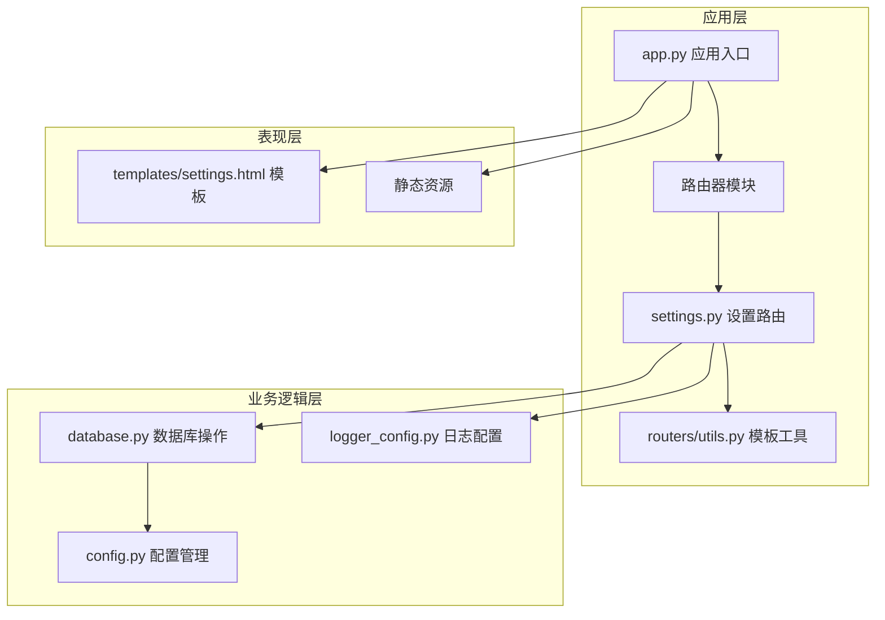
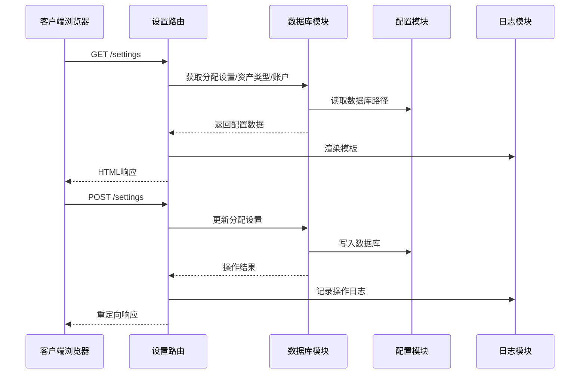
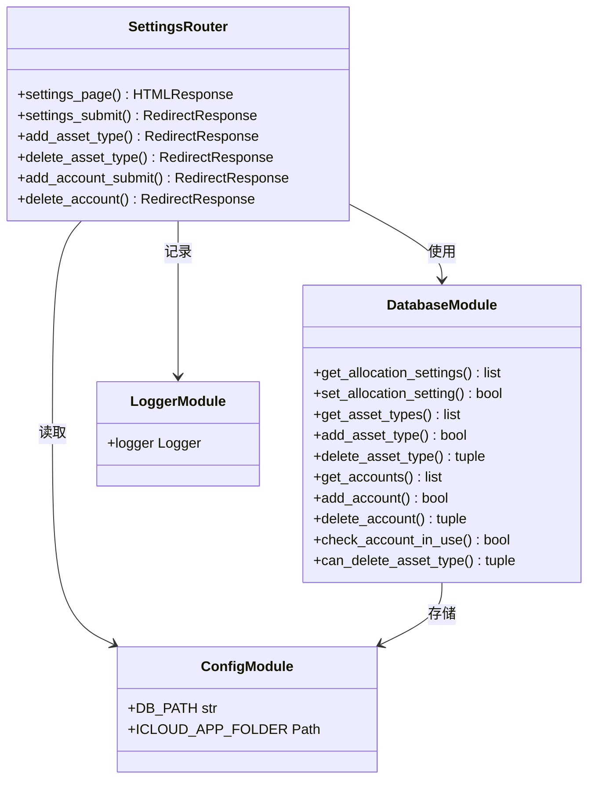
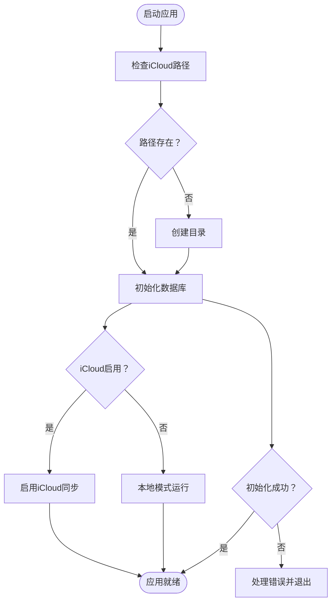
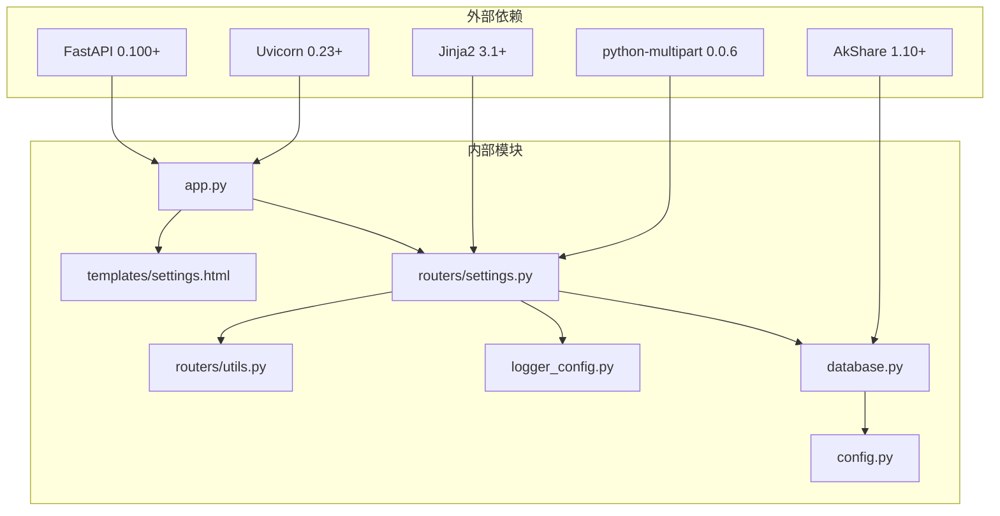

# 系统设置路由

<cite>
**本文档引用的文件**
- [app.py](file://app.py)
- [config.py](file://config.py)
- [database.py](file://database.py)
- [logger_config.py](file://logger_config.py)
- [routers/settings.py](file://routers/settings.py)
- [routers/utils.py](file://routers/utils.py)
- [templates/settings.html](file://templates/settings.html)
- [requirements.txt](file://requirements.txt)
</cite>

## 目录
1. [简介](#简介)
2. [项目结构](#项目结构)
3. [核心组件](#核心组件)
4. [架构概览](#架构概览)
5. [详细组件分析](#详细组件分析)
6. [依赖关系分析](#依赖关系分析)
7. [性能考量](#性能考量)
8. [故障排除指南](#故障排除指南)
9. [结论](#结论)
10. [附录](#附录)

## 简介
本文件详细说明系统设置路由的实现，涵盖账户管理、数据库配置和系统参数设置。重点解释设置页面的数据持久化机制、配置验证规则和安全控制措施，并阐述iCloud集成的配置选项、数据同步策略和故障恢复机制。同时包含日志配置管理、性能监控设置和调试模式切换，以及设置变更的影响分析、数据迁移处理和版本兼容性考虑，最后提供最佳实践和安全建议。

## 项目结构
系统采用FastAPI + Jinja2模板的Web应用架构，设置路由位于独立模块中，通过数据库模块进行数据持久化，配置模块集中管理数据库路径和iCloud集成。

**图表来源**
- [app.py](file://app.py#L1-L34)
- [routers/settings.py](file://routers/settings.py#L1-L148)
- [database.py](file://database.py#L1-L189)
- [config.py](file://config.py#L1-L24)

**章节来源**
- [app.py](file://app.py#L1-L34)
- [requirements.txt](file://requirements.txt#L1-L6)

## 核心组件
系统设置路由包含以下核心组件：
- 设置页面渲染：支持分配设置、账户管理和资产类型管理三个标签页
- 数据持久化：通过SQLite数据库存储配置信息
- 验证规则：确保配置值在有效范围内且满足约束条件
- 安全控制：防止误删正在使用的账户和资产类型
- iCloud集成：自动同步数据库文件到iCloud

**章节来源**
- [routers/settings.py](file://routers/settings.py#L11-L61)
- [database.py](file://database.py#L711-L752)
- [config.py](file://config.py#L10-L24)

## 架构概览
系统设置路由采用分层架构设计，各组件职责清晰分离：

**图表来源**
- [routers/settings.py](file://routers/settings.py#L11-L86)
- [database.py](file://database.py#L726-L752)
- [config.py](file://config.py#L19-L23)

## 详细组件分析

### 设置页面渲染组件
设置页面包含三个主要功能区域：

#### 分配设置管理
- 支持按货币和资产类型的双重维度配置
- 提供最小值和最大值范围设置
- 实时显示配置有效性检查结果

#### 账户管理
- 支持添加、删除和查看账户信息
- 自动检测账户使用状态，防止误删
- 支持Broker和账户类型信息维护

#### 资产类型管理
- 动态管理资产类型定义
- 防止删除仍在使用的资产类型
- 支持自定义资产类型代码和标签

**图表来源**
- [routers/settings.py](file://routers/settings.py#L9-L148)
- [database.py](file://database.py#L711-L996)
- [config.py](file://config.py#L19-L23)

**章节来源**
- [routers/settings.py](file://routers/settings.py#L11-L148)
- [templates/settings.html](file://templates/settings.html#L15-L179)

### 数据持久化机制
系统使用SQLite数据库进行配置数据持久化，采用以下策略：

#### 数据库初始化
- 启动时自动创建必要的表结构
- 初始化默认资产类型（股票、债券、贵金属、现金）
- 创建索引以优化查询性能

#### 配置存储结构
- 分配设置表：存储货币-资产类型的配置范围
- 资产类型表：动态管理资产类型定义
- 账户表：维护账户基本信息

#### 数据一致性保证
- 使用事务确保操作原子性
- 通过唯一约束防止重复配置
- 提供回滚机制处理错误情况

**章节来源**
- [database.py](file://database.py#L22-L188)
- [database.py](file://database.py#L711-L766)

### 配置验证规则
系统实施多层次的配置验证：

#### 基础验证
- 数值范围验证：0-100百分比范围
- 类型匹配验证：货币和资产类型白名单
- 约束完整性：最小值不大于最大值

#### 业务逻辑验证
- 账户使用状态检查：防止删除正在使用的账户
- 资产类型关联检查：确保无交易记录才能删除
- 配置冲突检测：避免无效的配置组合

#### 安全控制措施
- 输入过滤：防止SQL注入和XSS攻击
- 权限控制：基于账户使用状态的删除权限
- 操作审计：记录所有配置变更操作

**章节来源**
- [database.py](file://database.py#L734-L737)
- [database.py](file://database.py#L680-L694)
- [database.py](file://database.py#L964-L996)

### iCloud集成与数据同步
系统提供完整的iCloud集成方案：

#### 配置选项
- 自动定位iCloud应用目录
- 确保目录存在性和可写权限
- 支持环境变量覆盖数据库路径

#### 同步策略
- 数据库文件自动同步到iCloud
- 多设备间数据一致性保证
- 版本控制和冲突解决机制

#### 故障恢复机制
- 数据库连接异常处理
- 文件权限错误检测
- 自动重试和降级策略

**图表来源**
- [config.py](file://config.py#L10-L23)
- [app.py](file://app.py#L19-L22)

**章节来源**
- [config.py](file://config.py#L10-L23)
- [app.py](file://app.py#L19-L22)

### 日志配置管理
系统提供完善的日志管理功能：

#### 日志级别和格式
- 信息级别日志记录重要操作
- 标准化日志格式便于分析
- 时间戳精确到秒级

#### 日志轮转策略
- 按天轮转日志文件
- 保留最近7天的日志
- 自动清理过期日志文件

#### 性能监控设置
- 操作耗时统计
- 错误率监控
- 资源使用情况跟踪

**章节来源**
- [logger_config.py](file://logger_config.py#L14-L53)

### 设置变更影响分析
配置变更对系统的影响评估：

#### 即时影响
- 分配设置变更立即影响持有量分析
- 账户变更影响交易记录关联
- 资产类型变更影响历史数据展示

#### 长期影响
- 数据库结构变更需要迁移
- 用户界面布局可能调整
- 第三方集成可能受影响

#### 兼容性考虑
- 向后兼容性保证
- 迁移脚本支持
- 回滚机制准备

**章节来源**
- [database.py](file://database.py#L56-L92)

## 依赖关系分析

**图表来源**
- [requirements.txt](file://requirements.txt#L1-L6)
- [app.py](file://app.py#L7-L11)

**章节来源**
- [requirements.txt](file://requirements.txt#L1-L6)

## 性能考量
系统设置路由的性能优化策略：

### 查询优化
- 为常用查询字段建立索引
- 使用参数化查询防止SQL注入
- 批量操作减少数据库往返

### 缓存策略
- 模板渲染结果缓存
- 配置数据内存缓存
- 减少重复数据库查询

### 并发控制
- 数据库连接池管理
- 事务隔离级别设置
- 死锁检测和预防

## 故障排除指南
常见问题及解决方案：

### 数据库连接问题
- 检查iCloud权限设置
- 验证数据库文件完整性
- 查看日志文件定位错误

### 配置验证失败
- 检查数值范围是否在0-100之间
- 确认货币和资产类型代码正确
- 验证唯一性约束

### iCloud同步问题
- 确认iCloud服务可用性
- 检查网络连接状态
- 验证文件权限设置

**章节来源**
- [logger_config.py](file://logger_config.py#L14-L53)
- [database.py](file://database.py#L654-L657)

## 结论
系统设置路由提供了完整的企业级配置管理功能，通过清晰的分层架构、严格的验证机制和完善的iCloud集成为用户提供了可靠的资产管理平台。其设计充分考虑了安全性、可维护性和扩展性，为投资日志系统的长期发展奠定了坚实基础。

## 附录

### 最佳实践建议
1. **定期备份**：使用iCloud自动备份功能
2. **权限管理**：限制数据库文件访问权限
3. **监控告警**：设置日志监控和异常告警
4. **版本升级**：遵循数据库迁移规范

### 安全建议
1. **输入验证**：所有用户输入必须经过严格验证
2. **权限控制**：基于角色的访问控制
3. **审计日志**：记录所有敏感操作
4. **数据加密**：敏感数据传输和存储加密