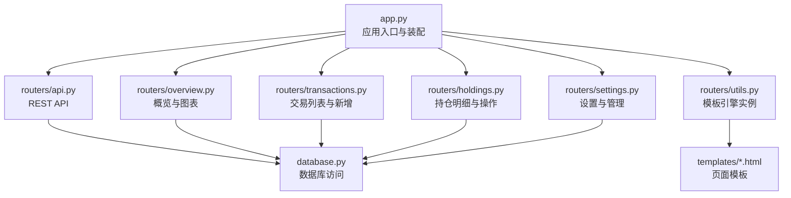
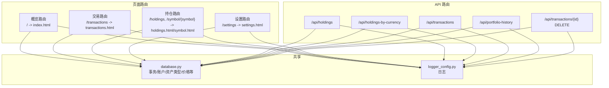
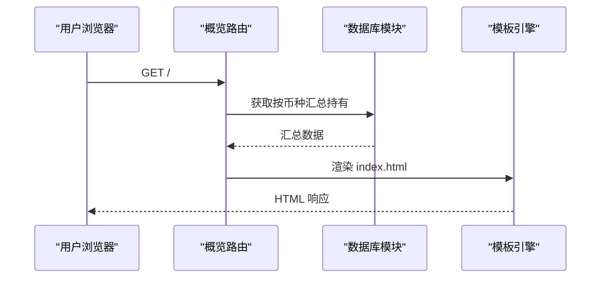
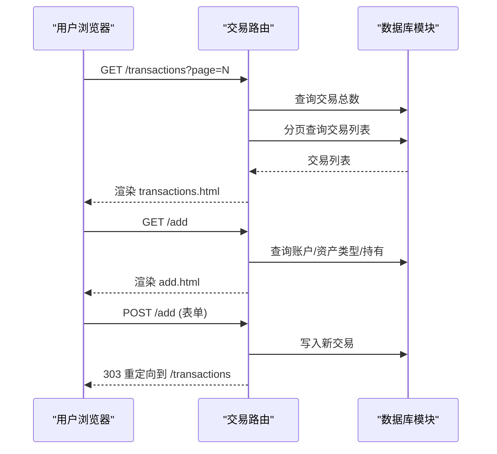
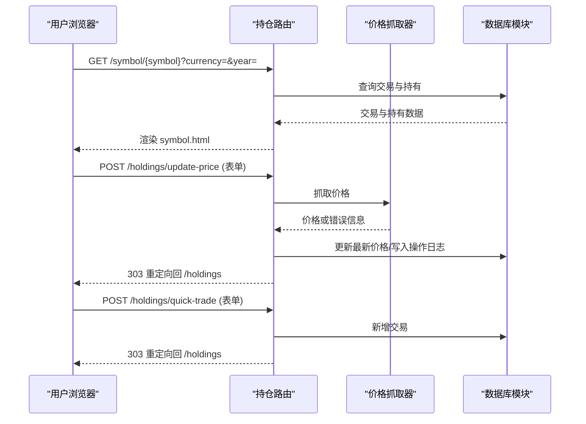
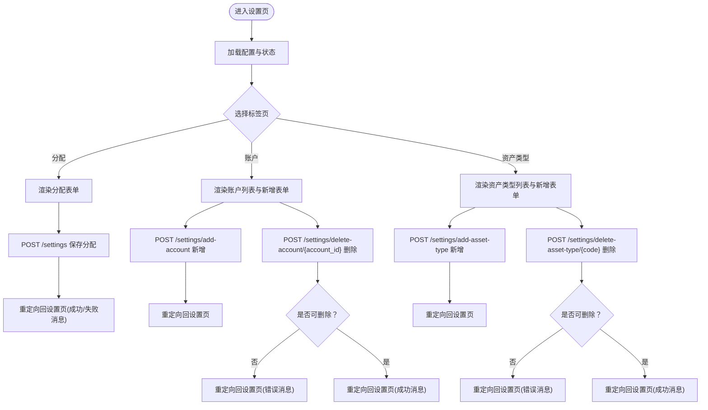
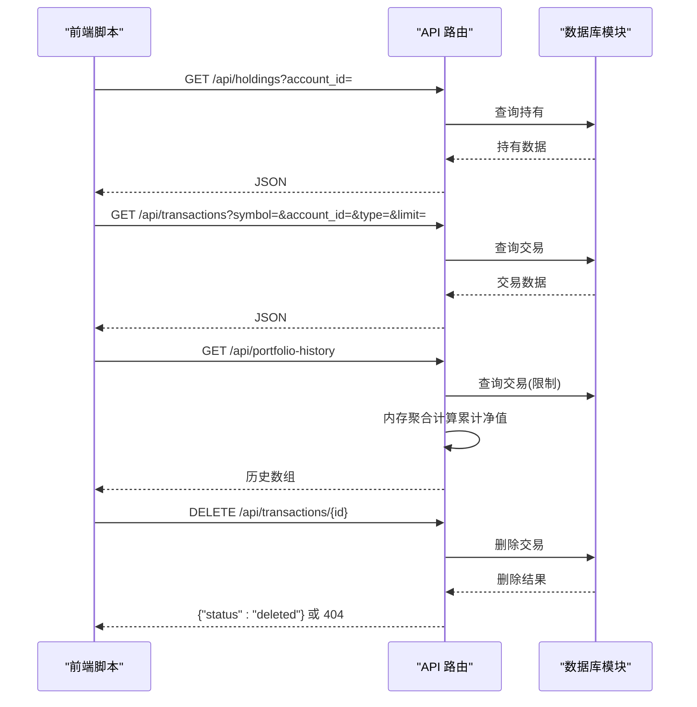
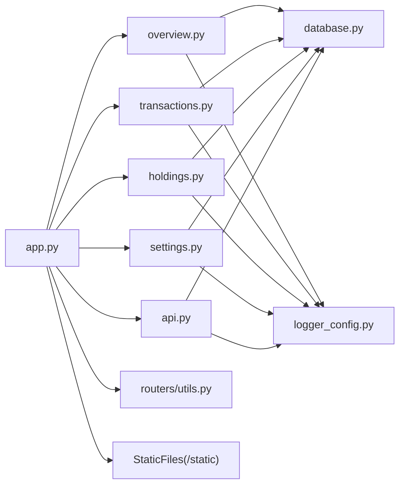

# 路由系统

<cite>
**本文引用的文件**
- [app.py](file://app.py)
- [routers/api.py](file://routers/api.py)
- [routers/holdings.py](file://routers/holdings.py)
- [routers/overview.py](file://routers/overview.py)
- [routers/settings.py](file://routers/settings.py)
- [routers/transactions.py](file://routers/transactions.py)
- [routers/utils.py](file://routers/utils.py)
- [templates/base.html](file://templates/base.html)
- [templates/index.html](file://templates/index.html)
- [templates/holdings.html](file://templates/holdings.html)
- [templates/transactions.html](file://templates/transactions.html)
- [templates/settings.html](file://templates/settings.html)
- [database.py](file://database.py)
- [config.py](file://config.py)
- [logger_config.py](file://logger_config.py)
</cite>

## 目录
1. [简介](#简介)
2. [项目结构](#项目结构)
3. [核心组件](#核心组件)
4. [架构总览](#架构总览)
5. [详细组件分析](#详细组件分析)
6. [依赖关系分析](#依赖关系分析)
7. [性能考虑](#性能考虑)
8. [故障排查指南](#故障排查指南)
9. [结论](#结论)
10. [附录：路由扩展与最佳实践](#附录路由扩展与最佳实践)

## 简介
本文件系统性梳理投资日志管理系统的路由体系，围绕基于 FastAPI 的路由组织结构展开，覆盖各路由器的功能职责、模块划分与交互关系；阐释 RESTful API 设计原则在系统中的落地方式（HTTP 方法、URL 规范、响应格式）；区分 Web 页面路由与 API 路由的边界与协作；详解参数处理、请求校验、响应序列化；并给出中间件、权限控制与错误处理的实现要点与扩展建议。

## 项目结构
系统采用“主应用装配 + 多路由器模块 + 模板渲染”的分层组织方式：
- 应用入口负责装配路由器、挂载静态资源、初始化数据库与日志。
- 各路由器按功能域拆分：概览、交易、持仓、设置、API。
- 模板目录提供页面渲染，配合工具模块统一模板引擎实例。

图示来源
- [app.py](file://app.py#L13-L29)
- [routers/overview.py](file://routers/overview.py#L6-L27)
- [routers/transactions.py](file://routers/transactions.py#L8-L74)
- [routers/holdings.py](file://routers/holdings.py#L11-L206)
- [routers/settings.py](file://routers/settings.py#L9-L147)
- [routers/api.py](file://routers/api.py#L6-L66)
- [routers/utils.py](file://routers/utils.py#L1-L3)
- [templates/base.html](file://templates/base.html#L1-L26)
- [database.py](file://database.py#L15-L151)

章节来源
- [app.py](file://app.py#L13-L29)
- [routers/utils.py](file://routers/utils.py#L1-L3)

## 核心组件
- 应用装配与生命周期
  - 静态资源挂载、数据库初始化、路由器注册。
- 路由器模块
  - 概览与图表：首页仪表盘、图表页。
  - 交易：交易列表、新增交易表单与提交。
  - 持仓：持仓明细、符号详情、价格更新、快速交易、手动调仓。
  - 设置：分配范围、账户、资产类型管理。
  - API：持有量、按币种汇总、交易查询、组合历史、交易删除。
- 模板与渲染
  - 统一模板引擎实例，页面通过模板响应类返回。
- 数据与日志
  - 数据库模块封装 CRUD 与聚合查询；日志模块提供统一日志配置。

章节来源
- [app.py](file://app.py#L13-L29)
- [routers/overview.py](file://routers/overview.py#L6-L27)
- [routers/transactions.py](file://routers/transactions.py#L8-L74)
- [routers/holdings.py](file://routers/holdings.py#L11-L206)
- [routers/settings.py](file://routers/settings.py#L9-L147)
- [routers/api.py](file://routers/api.py#L6-L66)
- [routers/utils.py](file://routers/utils.py#L1-L3)
- [database.py](file://database.py#L15-L151)
- [logger_config.py](file://logger_config.py#L14-L53)

## 架构总览
系统采用“页面路由 + API 路由”双轨并行：
- 页面路由：以 HTMLResponse 返回，模板渲染，用于用户交互与展示。
- API 路由：以 JSON 返回，供前端脚本或外部集成调用。
- 共享数据层：所有路由最终通过数据库模块读写数据。

图示来源
- [routers/overview.py](file://routers/overview.py#L8-L27)
- [routers/transactions.py](file://routers/transactions.py#L10-L74)
- [routers/holdings.py](file://routers/holdings.py#L13-L206)
- [routers/settings.py](file://routers/settings.py#L11-L147)
- [routers/api.py](file://routers/api.py#L8-L66)
- [database.py](file://database.py#L15-L151)
- [logger_config.py](file://logger_config.py#L14-L53)

## 详细组件分析

### 概览与图表路由（overview）
- 职责
  - 首页仪表盘：按币种汇总持有情况，渲染饼图与配置区间。
  - 图表页：按币种与资产类型展示符号级持有分布。
- 关键点
  - 使用模板响应类渲染页面，传入持有聚合数据与标签映射。
  - 前端通过 Chart.js 渲染图表，数据来自后端聚合结果。
- 参数与过滤
  - 无路径参数；查询参数用于筛选（如图表页可扩展）。
- 错误处理
  - 无显式异常抛出；空持有时显示空状态。

图示来源
- [routers/overview.py](file://routers/overview.py#L8-L17)
- [templates/index.html](file://templates/index.html#L1-L89)
- [database.py](file://database.py#L15-L151)

章节来源
- [routers/overview.py](file://routers/overview.py#L6-L27)
- [templates/index.html](file://templates/index.html#L1-L89)

### 交易路由（transactions）
- 职责
  - 列表页：分页展示交易，支持跳转与页码导航。
  - 新增页：渲染表单，提供账户、币种、资产类型、当前日期等上下文。
  - 提交：接收表单参数，持久化为交易记录。
- 关键点
  - 分页逻辑：每页固定条数，计算总页数与偏移。
  - 表单参数：日期字符串解析为日期对象，其他数值字段转换为浮点。
  - 成功后重定向至列表页。
- 参数与过滤
  - 列表页支持页码参数；新增页不涉及查询参数。
- 错误处理
  - 表单提交失败会触发重定向与错误消息（由模板侧处理）。

图示来源
- [routers/transactions.py](file://routers/transactions.py#L10-L74)
- [templates/transactions.html](file://templates/transactions.html#L1-L90)
- [database.py](file://database.py#L158-L200)

章节来源
- [routers/transactions.py](file://routers/transactions.py#L8-L74)
- [templates/transactions.html](file://templates/transactions.html#L1-L90)

### 持仓路由（holdings）
- 职责
  - 持仓明细：按币种与符号汇总，展示成本、市值、盈亏与占比。
  - 符号详情：按年份筛选交易，展示持有信息与可用年份。
  - 价格更新：自动抓取最新价格或手动更新价格。
  - 快速交易：从持仓页直接发起买入/卖出/分红等交易。
  - 调整资产价值：对某币种下的资产进行价值调整。
- 关键点
  - 路径参数：符号、币种、年份等。
  - 表单参数：数量、价格、账户、资产类型、备注等。
  - 重定向：多数写操作完成后返回上一页或详情页。
- 参数与过滤
  - 支持币种、年份、符号等过滤条件。
- 错误处理
  - 价格更新失败时记录日志并重定向带错误消息。

图示来源
- [routers/holdings.py](file://routers/holdings.py#L32-L206)
- [templates/holdings.html](file://templates/holdings.html#L1-L273)
- [database.py](file://database.py#L15-L151)

章节来源
- [routers/holdings.py](file://routers/holdings.py#L11-L206)
- [templates/holdings.html](file://templates/holdings.html#L1-L273)

### 设置路由（settings）
- 职责
  - 设置页：展示分配范围、账户、资产类型，支持切换标签页。
  - 保存分配：批量更新各币种与资产类型的最小/最大百分比。
  - 资产类型管理：新增、删除（含约束检查）、状态提示。
  - 账户管理：新增、删除（含使用状态检查）。
- 关键点
  - 表单键名遵循“币种_资产类型_min/max”，批量写入。
  - 删除前进行依赖检查，失败时返回带错误消息的重定向。
- 参数与过滤
  - 无路径参数；表单参数用于保存与新增。
- 错误处理
  - 删除失败时根据原因返回不同消息。

图示来源
- [routers/settings.py](file://routers/settings.py#L11-L147)
- [templates/settings.html](file://templates/settings.html#L1-L201)
- [database.py](file://database.py#L15-L151)

章节来源
- [routers/settings.py](file://routers/settings.py#L9-L147)
- [templates/settings.html](file://templates/settings.html#L1-L201)

### API 路由（api）
- 职责
  - 持有量查询：可选账户过滤。
  - 按币种汇总：返回各币种持有与预警信息。
  - 交易查询：支持符号、账户、类型、限制条数等过滤。
  - 组合历史：按日期聚合累计净值，用于图表。
  - 交易删除：按 ID 删除交易并返回状态。
- 关键点
  - 所有接口返回 JSON；删除不存在交易时抛出 HTTP 异常。
  - 历史数据通过内存聚合生成，便于前端绘图。
- 参数与过滤
  - 查询参数用于过滤与分页限制。
- 错误处理
  - 删除未找到时返回 404。

图示来源
- [routers/api.py](file://routers/api.py#L8-L66)
- [database.py](file://database.py#L15-L151)

章节来源
- [routers/api.py](file://routers/api.py#L6-L66)

## 依赖关系分析
- 路由器到数据库
  - 所有页面与 API 路由均通过数据库模块执行读写。
- 路由器到模板
  - 页面路由统一使用模板引擎实例渲染 HTML。
- 路由器到日志
  - 多个写操作路径记录操作日志，便于审计与排错。
- 配置与静态资源
  - 应用入口集中挂载静态资源与初始化数据库。

图示来源
- [app.py](file://app.py#L13-L29)
- [routers/overview.py](file://routers/overview.py#L6-L27)
- [routers/transactions.py](file://routers/transactions.py#L8-L74)
- [routers/holdings.py](file://routers/holdings.py#L11-L206)
- [routers/settings.py](file://routers/settings.py#L9-L147)
- [routers/api.py](file://routers/api.py#L6-L66)
- [routers/utils.py](file://routers/utils.py#L1-L3)
- [database.py](file://database.py#L15-L151)
- [logger_config.py](file://logger_config.py#L14-L53)

章节来源
- [app.py](file://app.py#L13-L29)
- [routers/utils.py](file://routers/utils.py#L1-L3)
- [database.py](file://database.py#L15-L151)
- [logger_config.py](file://logger_config.py#L14-L53)

## 性能考虑
- 分页与限制
  - 交易列表默认每页固定条数，避免一次性传输大量数据。
  - API 查询交易默认限制条数，防止大结果集影响性能。
- 内存聚合
  - 组合历史在服务端按日期聚合并计算累计值，减少前端负担。
- 数据索引
  - 数据库已建立常用列索引，有助于查询性能。
- 建议
  - 对高频查询增加缓存策略（如最近一次聚合结果缓存）。
  - 对大列表页启用懒加载或服务端分页优化。

## 故障排查指南
- 日志定位
  - 所有写操作均记录日志，可通过日志快速定位问题。
- 常见问题
  - 价格更新失败：查看日志中失败原因与消息，确认网络与符号有效性。
  - 删除交易失败：确认交易 ID 是否存在，或已被业务规则限制。
  - 设置删除失败：检查是否存在关联数据（账户在用、资产类型被使用）。
- 模板消息
  - 页面重定向携带消息参数，可在模板中显示成功/错误提示。

章节来源
- [logger_config.py](file://logger_config.py#L14-L53)
- [routers/holdings.py](file://routers/holdings.py#L135-L147)
- [routers/settings.py](file://routers/settings.py#L106-L115)
- [templates/holdings.html](file://templates/holdings.html#L8-L13)
- [templates/settings.html](file://templates/settings.html#L8-L13)

## 结论
该路由系统以清晰的功能域划分实现页面与 API 的双轨并行，借助模板引擎与统一的日志/配置模块，形成高内聚、低耦合的结构。RESTful 设计在 API 层得到良好体现，页面路由则专注于用户体验与数据展示。整体具备良好的可维护性与扩展性。

## 附录：路由扩展与最佳实践
- 路由扩展指南
  - 新增页面路由：在对应路由器中定义路径与响应类，渲染相应模板。
  - 新增 API 路由：在 API 路由器中定义路径与参数，返回 JSON。
  - 参数与校验：优先使用 FastAPI 类型注解与默认值，必要时在函数内补充校验。
  - 写操作流程：接收参数 → 校验 → 写入数据库 → 记录日志 → 重定向或返回 JSON。
- 最佳实践
  - URL 设计：使用名词复数形式，路径参数语义明确，查询参数用于过滤与分页。
  - HTTP 方法：GET 仅用于读取，POST/PUT/PATCH/DELETE 明确职责。
  - 响应格式：API 统一返回 JSON；页面统一使用 HTML 响应类。
  - 中间件与权限：可于应用层统一注册中间件，实现认证/授权与跨域等。
  - 错误处理：API 明确错误码与消息；页面通过重定向与消息参数反馈。
  - 日志：关键写操作必须记录日志，便于审计与排错。
  - 配置：数据库路径等集中于配置模块，支持环境变量覆盖。