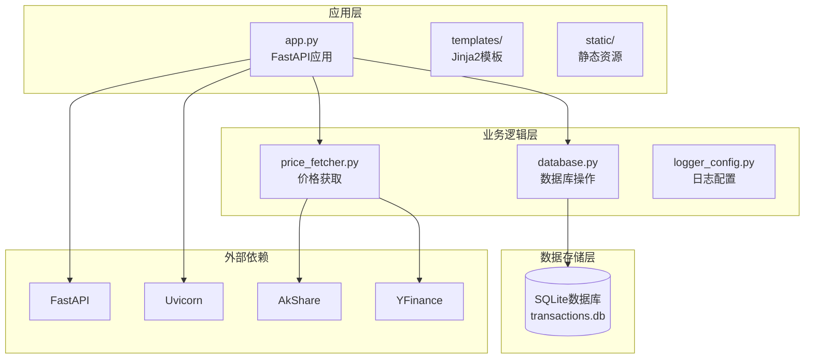
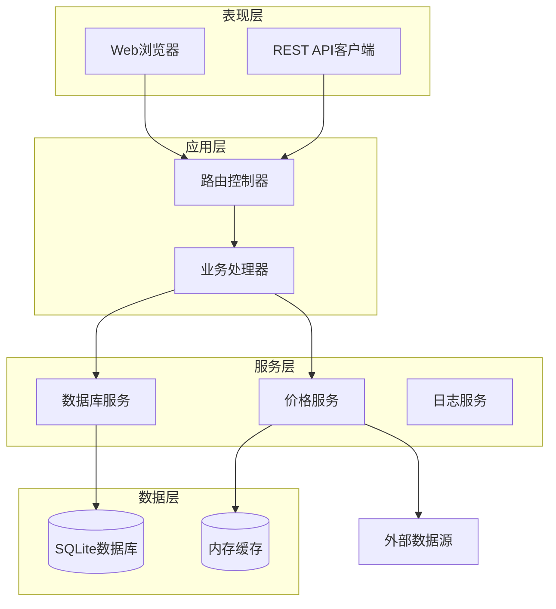
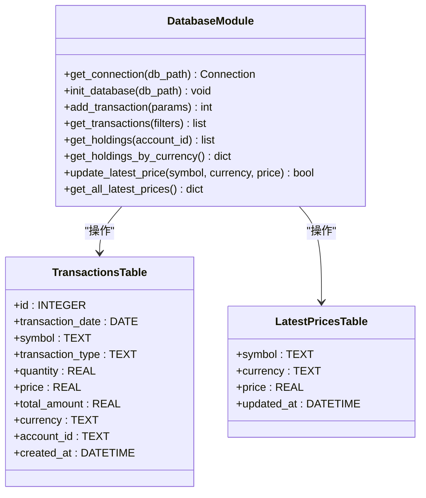
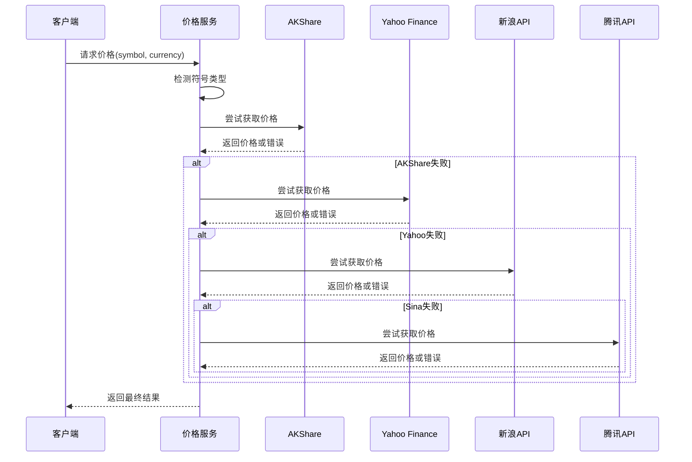
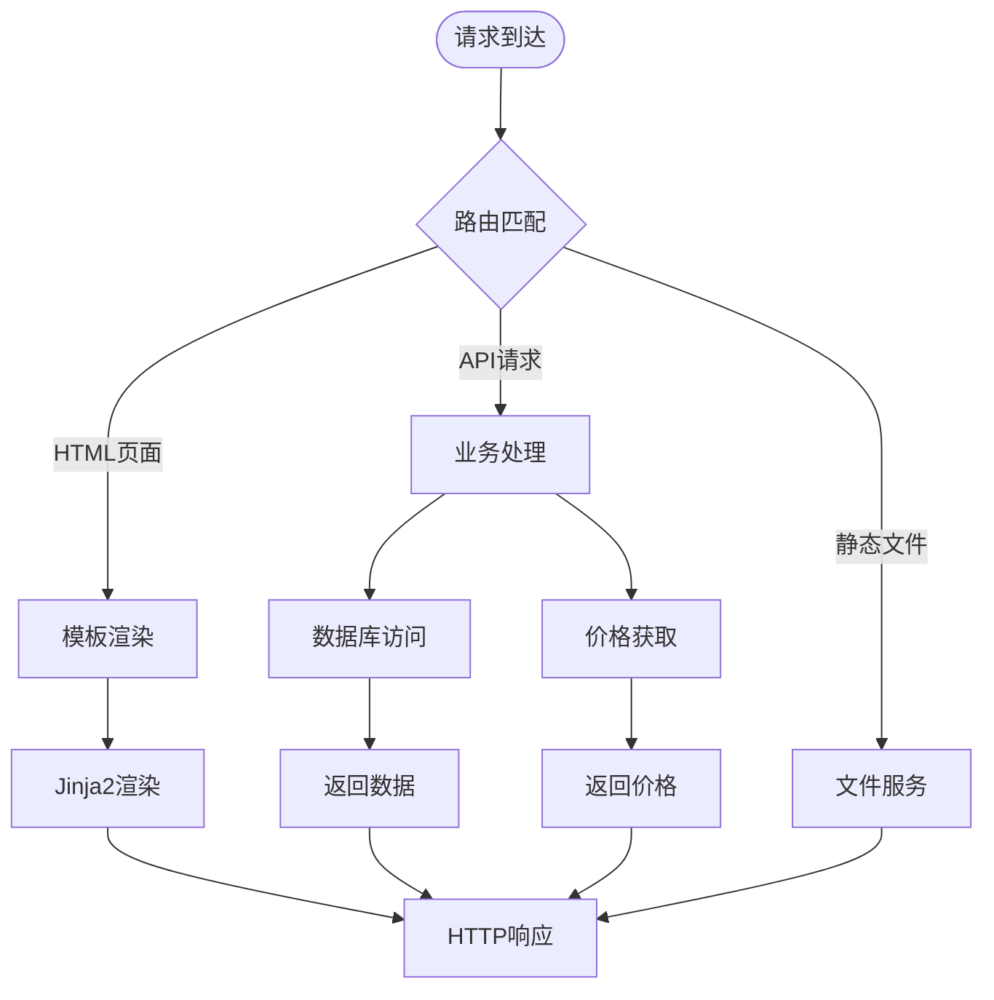
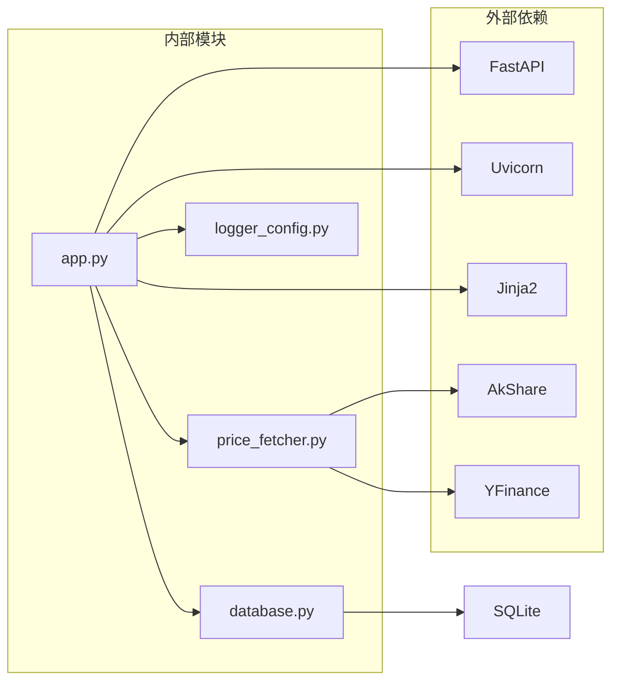

# 性能优化

<cite>
**本文档引用的文件**
- [app.py](file://app.py)
- [database.py](file://database.py)
- [price_fetcher.py](file://price_fetcher.py)
- [logger_config.py](file://logger_config.py)
- [requirements.txt](file://requirements.txt)
</cite>

## 目录
1. [简介](#简介)
2. [项目结构](#项目结构)
3. [核心组件](#核心组件)
4. [架构概览](#架构概览)
5. [详细组件分析](#详细组件分析)
6. [依赖关系分析](#依赖关系分析)
7. [性能优化策略](#性能优化策略)
8. [缓存机制实现](#缓存机制实现)
9. [异步处理优化](#异步处理优化)
10. [价格获取服务优化](#价格获取服务优化)
11. [性能监控与基准测试](#性能监控与基准测试)
12. [内存使用优化](#内存使用优化)
13. [故障排除指南](#故障排除指南)
14. [结论](#结论)

## 简介

本项目是一个基于FastAPI的投资交易记录管理系统，提供了股票、债券、贵金属等资产的交易记录管理功能。系统采用SQLite作为数据存储，通过多数据源价格获取服务实现资产实时价格更新，并提供了完整的Web界面和REST API接口。

本文档旨在为该系统提供全面的性能优化指南，涵盖数据库查询优化、缓存机制、异步处理、价格获取服务优化、性能监控等多个方面，帮助提升系统的整体性能和用户体验。

## 项目结构

项目采用模块化设计，主要包含以下核心模块：



**图表来源**
- [app.py](file://app.py#L1-L50)
- [database.py](file://database.py#L1-L50)
- [price_fetcher.py](file://price_fetcher.py#L1-L30)

**章节来源**
- [app.py](file://app.py#L1-L50)
- [database.py](file://database.py#L1-L50)
- [requirements.txt](file://requirements.txt#L1-L6)

## 核心组件

系统的核心组件包括：

### 应用层组件
- **FastAPI应用实例**：提供Web界面和REST API接口
- **Jinja2模板系统**：用于动态页面渲染
- **静态文件服务**：提供CSS样式和JavaScript资源

### 数据访问层组件
- **SQLite数据库操作**：封装所有数据库访问逻辑
- **事务管理**：支持增删改查操作
- **价格缓存**：存储最新的市场价格信息

### 价格获取层组件
- **多数据源支持**：AKShare、Yahoo Finance、新浪、腾讯
- **智能回退机制**：当主数据源失败时自动切换
- **符号类型检测**：根据符号格式自动识别市场类型

**章节来源**
- [app.py](file://app.py#L1-L150)
- [database.py](file://database.py#L1-L200)
- [price_fetcher.py](file://price_fetcher.py#L1-L150)

## 架构概览

系统采用分层架构设计，各层职责明确：



**图表来源**
- [app.py](file://app.py#L36-L120)
- [database.py](file://database.py#L13-L150)
- [price_fetcher.py](file://price_fetcher.py#L321-L395)

## 详细组件分析

### 数据库模块分析

数据库模块实现了完整的CRUD操作和复杂查询功能：



**图表来源**
- [database.py](file://database.py#L13-L150)
- [database.py](file://database.py#L25-L147)

#### 查询优化要点

1. **索引设计**：
   - `idx_symbol`: 针对symbol字段的查询优化
   - `idx_date`: 针对日期范围查询优化
   - `idx_account`: 针对账户过滤优化
   - `idx_type`: 针对交易类型过滤优化
   - `idx_currency`: 针对货币过滤优化
   - `idx_asset_type`: 针对资产类型过滤优化

2. **查询模式优化**：
   - 使用参数化查询防止SQL注入
   - 实现灵活的条件组合查询
   - 支持分页和排序优化

**章节来源**
- [database.py](file://database.py#L140-L147)
- [database.py](file://database.py#L262-L310)

### 价格获取模块分析

价格获取模块实现了智能的数据源选择和回退机制：



**图表来源**
- [price_fetcher.py](file://price_fetcher.py#L321-L395)

#### 数据源优先级策略

1. **主数据源**：AKShare（支持A股、港股、美股）
2. **备用数据源**：Yahoo Finance（全球市场覆盖）
3. **后备数据源**：新浪API（中国A股）
4. **最后备用**：腾讯API（多市场支持）

**章节来源**
- [price_fetcher.py](file://price_fetcher.py#L36-L63)
- [price_fetcher.py](file://price_fetcher.py#L345-L374)

### 应用层分析

应用层基于FastAPI构建，提供了完整的Web界面和API接口：



**图表来源**
- [app.py](file://app.py#L36-L120)
- [app.py](file://app.py#L378-L431)

**章节来源**
- [app.py](file://app.py#L36-L120)
- [app.py](file://app.py#L378-L431)

## 依赖关系分析

系统依赖关系清晰，模块间耦合度适中：



**图表来源**
- [requirements.txt](file://requirements.txt#L1-L6)
- [app.py](file://app.py#L7-L17)

**章节来源**
- [requirements.txt](file://requirements.txt#L1-L6)
- [app.py](file://app.py#L7-L17)

## 性能优化策略

### 数据库查询优化

#### 索引设计优化

1. **现有索引分析**
   - 当前已建立6个基础索引，覆盖常用查询字段
   - 建议增加复合索引以优化复杂查询

2. **推荐索引策略**
   ```sql
   -- 复合索引优化常见查询模式
   CREATE INDEX IF NOT EXISTS idx_symbol_date ON transactions(symbol, transaction_date);
   CREATE INDEX IF NOT EXISTS idx_account_type ON transactions(account_id, transaction_type);
   CREATE INDEX IF NOT EXISTS idx_currency_asset ON transactions(currency, asset_type);
   ```

3. **查询优化技巧**
   - 使用EXPLAIN QUERY PLAN分析执行计划
   - 避免SELECT *，只选择需要的字段
   - 合理使用LIMIT限制结果集大小

#### 连接池配置

1. **当前连接管理**
   - 每次操作创建新连接，缺乏连接复用
   - 建议实现连接池以减少连接开销

2. **连接池配置建议**
   ```python
   # 连接池配置示例
   import sqlite3.pool
   
   # 创建连接池
   connection_pool = sqlite3.pool.SimpleSQLiteConnectionPool(
       minconn=1,
       maxconn=10,
       database="transactions.db"
   )
   ```

#### 查询优化实践

1. **分页查询优化**
   - 已实现LIMIT和OFFSET分页
   - 建议使用游标分页提高大数据量场景性能

2. **批量操作优化**
   - 批量插入和更新操作
   - 使用事务包装多个操作

**章节来源**
- [database.py](file://database.py#L140-L147)
- [database.py](file://database.py#L262-L310)

### 缓存机制实现

#### 内存缓存策略

1. **现有缓存实现**
   - `latest_prices`表作为价格缓存
   - `get_all_latest_prices()`提供批量缓存访问

2. **缓存优化建议**
   ```python
   # 缓存失效策略
   import time
   
   class PriceCache:
       def __init__(self, ttl=300):  # 5分钟过期
           self.cache = {}
           self.ttl = ttl
       
       def get(self, key):
           if key in self.cache:
               value, timestamp = self.cache[key]
               if time.time() - timestamp < self.ttl:
                   return value
               else:
                   del self.cache[key]
           return None
       
       def set(self, key, value):
           self.cache[key] = (value, time.time())
   ```

#### Redis集成方案

虽然当前未使用Redis，但可按以下方式集成：

1. **Redis连接配置**
   ```python
   import redis
   
   redis_client = redis.Redis(
       host='localhost',
       port=6379,
       db=0,
       decode_responses=True,
       socket_connect_timeout=5,
       socket_timeout=5
   )
   ```

2. **缓存键命名规范**
   ```
   price:{symbol}:{currency}
   holdings:{account_id}
   portfolio:{date}
   ```

**章节来源**
- [database.py](file://database.py#L779-L800)
- [database.py](file://database.py#L815-L825)

### 异步处理优化

#### FastAPI异步特性利用

1. **现有异步实现**
   - 所有路由函数使用async def定义
   - 数据库操作仍为同步阻塞

2. **异步数据库访问**
   ```python
   # 使用异步数据库库
   import aiosqlite
   
   async def get_transactions_async(symbol=None):
       async with aiosqlite.connect("transactions.db") as db:
           cursor = await db.execute(query, params)
           rows = await cursor.fetchall()
           return [dict(row) for row in rows]
   ```

3. **异步任务队列**
   ```python
   from celery import Celery
   
   celery_app = Celery('invest_log', broker='redis://localhost:6379/0')
   
   @celery_app.task
   def update_multiple_prices(symbols):
       # 批量更新价格
       pass
   ```

**章节来源**
- [app.py](file://app.py#L36-L120)

## 价格获取服务优化

### 并发请求限制

#### 现有实现分析

1. **单线程处理**
   - 当前价格获取为同步阻塞调用
   - 单个请求处理时间较长

2. **并发控制策略**
   ```python
   import asyncio
   from concurrent.futures import ThreadPoolExecutor
   
   # 限制并发数量
   semaphore = asyncio.Semaphore(5)
   
   async def fetch_price_concurrent(symbol, currency):
       async with semaphore:
           return await fetch_price(symbol, currency)
   
   # 批量获取价格
   async def batch_fetch_prices(symbols_currencies):
       tasks = [
           fetch_price_concurrent(symbol, currency)
           for symbol, currency in symbols_currencies
       ]
       return await asyncio.gather(*tasks, return_exceptions=True)
   ```

### 数据源选择策略

#### 智能数据源选择

1. **性能优先级**
   - AKShare：速度最快，适合高频查询
   - Yahoo Finance：数据最全，适合重要决策
   - 新浪API：延迟较低，适合实时监控
   - 腾讯API：稳定性好，适合备份

2. **错误恢复机制**
   ```python
   def fetch_price_robust(symbol, currency):
       errors = []
       for service in get_service_priority():
           try:
               price = service.fetch(symbol, currency)
               if price is not None:
                   return price
           except Exception as e:
               errors.append(str(e))
               continue
       return None, errors
   ```

**章节来源**
- [price_fetcher.py](file://price_fetcher.py#L321-L395)

## 性能监控与基准测试

### 日志监控配置

#### 现有日志系统

1. **日志配置**
   - 按天轮转的日志文件
   - 控制台和文件双重输出
   - 保留7天历史日志

2. **性能相关日志**
   ```python
   import time
   
   def timed_operation(operation_name):
       start_time = time.time()
       try:
           result = operation()
           return result
       finally:
           end_time = time.time()
           duration = end_time - start_time
           logger.info(f"{operation_name} took {duration:.2f}s")
   ```

### 基准测试方法

#### 数据库查询基准测试

```python
import time
import sqlite3

def benchmark_query_performance():
    conn = sqlite3.connect("transactions.db")
    
    # 测试不同查询的性能
    queries = [
        ("简单查询", "SELECT * FROM transactions WHERE symbol = ?"),
        ("带索引查询", "SELECT * FROM transactions WHERE symbol = ? AND transaction_date >= ?"),
        ("聚合查询", "SELECT symbol, SUM(quantity) as total FROM transactions GROUP BY symbol")
    ]
    
    for name, query in queries:
        start = time.time()
        for _ in range(1000):
            cursor = conn.execute(query, params)
            cursor.fetchall()
        end = time.time()
        print(f"{name}: {(end-start)*1000:.2f}ms for 1000 iterations")

benchmark_query_performance()
```

#### API性能测试

```python
import requests
import time
from concurrent.futures import ThreadPoolExecutor

def test_api_performance():
    urls = [
        "/api/holdings",
        "/api/holdings-by-currency", 
        "/api/transactions?limit=100"
    ]
    
    def make_request(url):
        start = time.time()
        response = requests.get(f"http://localhost:8000{url}")
        end = time.time()
        return end - start
    
    # 并发测试
    with ThreadPoolExecutor(max_workers=10) as executor:
        durations = list(executor.map(make_request, urls * 100))
    
    print(f"平均响应时间: {sum(durations)/len(durations)*1000:.2f}ms")
    print(f"95%分位数: {sorted(durations)[int(len(durations)*0.95)]*1000:.2f}ms")
```

**章节来源**
- [logger_config.py](file://logger_config.py#L14-L54)

## 内存使用优化

### 内存管理策略

#### 对象生命周期管理

1. **数据库连接管理**
   ```python
   def get_connection_optimized():
       """优化的连接获取"""
       conn = sqlite3.connect(
           db_path,
           check_same_thread=False,
           timeout=20.0
       )
       conn.row_factory = sqlite3.Row
       return conn
   ```

2. **批量数据处理**
   ```python
   def process_large_dataset(batch_size=1000):
       """分批处理大数据集"""
       offset = 0
       while True:
           cursor = conn.execute(query, params + [batch_size, offset])
           rows = cursor.fetchmany(batch_size)
           if not rows:
               break
           
           # 处理当前批次
           for row in rows:
               process_row(row)
           
           offset += batch_size
           # 显式清理内存
           del rows
   ```

#### 垃圾回收策略

1. **手动垃圾回收触发**
   ```python
   import gc
   
   def optimize_memory_usage():
       """定期触发垃圾回收"""
       # 清理循环引用
       gc.collect()
       
       # 触发强制垃圾回收
       if gc.isenabled():
           collected = gc.collect()
           logger.info(f"垃圾回收清理了 {collected} 个对象")
   ```

2. **内存监控**
   ```python
   import psutil
   import os
   
   def monitor_memory_usage():
       """监控内存使用情况"""
       process = psutil.Process(os.getpid())
       memory_info = process.memory_info()
       logger.info(f"RSS内存: {memory_info.rss / 1024 / 1024:.2f} MB")
       logger.info(f"虚拟内存: {memory_info.vms / 1024 / 1024:.2f} MB")
   ```

**章节来源**
- [database.py](file://database.py#L13-L17)
- [app.py](file://app.py#L25-L30)

## 故障排除指南

### 常见性能问题诊断

#### 数据库性能问题

1. **慢查询识别**
   ```python
   def enable_sql_logging():
       """启用SQL语句日志"""
       sqlite3.set_trace_callback(print)
   
   def analyze_query_plan(query, params):
       """分析查询执行计划"""
       conn = get_connection()
       cursor = conn.execute("EXPLAIN QUERY PLAN " + query, params)
       plan = cursor.fetchall()
       return plan
   ```

2. **索引使用检查**
   ```python
   def check_index_usage():
       """检查索引使用情况"""
       conn = get_connection()
       cursor = conn.execute("""
           SELECT 
               name,
               sql,
               CASE WHEN sql LIKE '%CREATE INDEX%' THEN 'Index' ELSE 'Table' END as type
           FROM sqlite_master 
           WHERE type IN ('index', 'table')
           ORDER BY type
       """)
       return cursor.fetchall()
   ```

#### 网络性能问题

1. **价格获取超时处理**
   ```python
   def fetch_price_with_timeout(symbol, currency, timeout=10):
       """带超时的价格获取"""
       try:
           # 设置请求超时
           price = fetch_price(symbol, currency)
           return price
       except Exception as e:
           logger.warning(f"价格获取超时: {symbol} - {str(e)}")
           return None
   ```

2. **重试机制实现**
   ```python
   import time
   import random
   
   def fetch_with_retry(symbol, currency, max_retries=3):
       """带重试的价格获取"""
       for attempt in range(max_retries):
           try:
               price = fetch_price(symbol, currency)
               if price is not None:
                   return price
           except Exception as e:
               logger.warning(f"第{attempt+1}次尝试失败: {str(e)}")
               if attempt < max_retries - 1:
                   # 指数退避
                   time.sleep(2 ** attempt + random.uniform(0, 1))
       return None
   ```

**章节来源**
- [price_fetcher.py](file://price_fetcher.py#L376-L395)
- [logger_config.py](file://logger_config.py#L14-L54)

## 结论

本性能优化指南为投资日志系统提供了全面的优化策略，涵盖了数据库查询优化、缓存机制、异步处理、价格获取服务优化、性能监控等多个方面。通过实施这些优化措施，可以显著提升系统的响应速度、稳定性和可扩展性。

关键优化要点包括：
- 实现连接池和索引优化提升数据库性能
- 集成Redis缓存减少重复计算
- 利用FastAPI异步特性提升并发处理能力
- 优化价格获取服务的并发控制和数据源选择
- 建立完善的性能监控和基准测试体系
- 实施内存管理和垃圾回收策略

建议按照优先级逐步实施这些优化措施，先从数据库查询优化和缓存机制开始，然后逐步引入异步处理和更高级的监控功能。