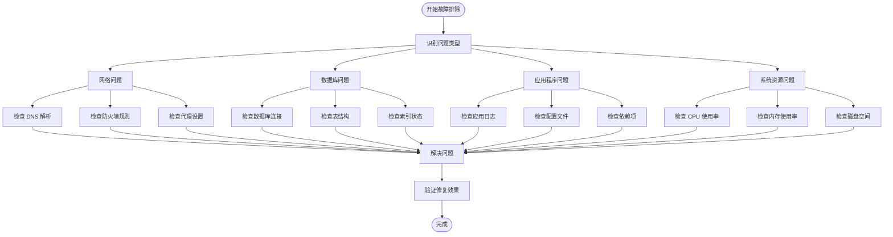

# 故障排除与FAQ

<cite>
**本文档中引用的文件**
- [app.py](file://app.py)
- [database.py](file://database.py)
- [price_fetcher.py](file://price_fetcher.py)
- [logger_config.py](file://logger_config.py)
- [requirements.txt](file://requirements.txt)
- [base.html](file://templates/base.html)
- [index.html](file://templates/index.html)
- [settings.html](file://templates/settings.html)
</cite>

## 目录
1. [简介](#简介)
2. [部署前检查清单](#部署前检查清单)
3. [常见部署问题及解决方案](#常见部署问题及解决方案)
4. [运行时错误诊断](#运行时错误诊断)
5. [性能问题排查](#性能问题排查)
6. [系统崩溃恢复流程](#系统崩溃恢复流程)
7. [数据备份与恢复](#数据备份与恢复)
8. [调试工具使用指南](#调试工具使用指南)
9. [日志分析技巧](#日志分析技巧)
10. [问题反馈与升级流程](#问题反馈与升级流程)
11. [故障排除流程图](#故障排除流程图)

## 简介

Invest Log 是一个基于 Python 的投资交易记录管理系统，采用 FastAPI 框架构建，提供 Web 界面用于记录和管理股票、债券、贵金属等各类投资产品的交易历史。本指南旨在帮助用户快速定位和解决在部署、运行过程中遇到的各种问题。

## 部署前检查清单

### 环境要求
- Python 版本：需要支持 Python 3.x
- 必需依赖：FastAPI、Uvicorn、Jinja2、python-multipart、AkShare
- 数据库：SQLite（自动初始化）
- 网络访问：需要访问外部金融数据源

### 系统依赖检查


**章节来源**
- [requirements.txt](file://requirements.txt#L1-L6)
- [app.py](file://app.py#L443-L446)

## 常见部署问题及解决方案

### 依赖冲突问题

#### 问题症状
- 安装依赖时出现版本冲突错误
- 运行时报导入模块错误
- 启动时提示缺少特定库

#### 解决方案
1. **清理虚拟环境**
   ```bash
   pip uninstall -r requirements.txt
   pip cache purge
   ```

2. **重新安装依赖**
   ```bash
   pip install --upgrade pip
   pip install -r requirements.txt
   ```

3. **检查 AkShare 兼容性**
   - 确保 AkShare 版本 >= 1.10.0
   - 检查是否能正常导入 `akshare` 模块

**章节来源**
- [requirements.txt](file://requirements.txt#L1-L6)
- [price_fetcher.py](file://price_fetcher.py#L22-L34)

### 端口占用问题

#### 问题症状
- 启动时提示端口被占用
- Uvicorn 报告 Address already in use 错误

#### 解决方案
1. **查找占用端口的进程**
   ```bash
   # Linux/Mac
   lsof -i :8000
   
   # Windows
   netstat -ano | findstr :8000
   ```

2. **修改端口号**
   在 `app.py` 中修改默认端口：
   ```python
   uvicorn.run(app, host="127.0.0.1", port=8001)
   ```

3. **强制终止占用进程**
   ```bash
   kill -9 PID
   ```

**章节来源**
- [app.py](file://app.py#L443-L446)

### 权限问题

#### 问题症状
- 数据库文件无法创建或写入
- 日志文件写入失败
- 静态文件访问权限不足

#### 解决方案
1. **检查目录权限**
   ```bash
   # 创建必要的目录
   mkdir -p logs
   mkdir -p static
   
   # 设置适当的权限
   chmod 755 logs
   chmod 755 static
   ```

2. **检查数据库文件权限**
   ```bash
   touch transactions.db
   chmod 666 transactions.db
   ```

3. **验证用户权限**
   ```bash
   whoami
   ls -la
   ```

**章节来源**
- [logger_config.py](file://logger_config.py#L11-L12)
- [database.py](file://database.py#L13-L17)

## 运行时错误诊断

### 数据库连接失败

#### 诊断步骤
1. **检查数据库文件状态**
   ```bash
   ls -la transactions.db
   file transactions.db
   ```

2. **验证数据库连接**
   ```python
   python3 -c "
   import sqlite3
   conn = sqlite3.connect('transactions.db')
   cursor = conn.cursor()
   cursor.execute('PRAGMA table_info(transactions)')
   print('Database connection successful')
   conn.close()
   "
   ```

3. **检查表结构完整性**
   ```sql
   PRAGMA table_info(transactions);
   PRAGMA table_info(accounts);
   PRAGMA table_info(latest_prices);
   ```

#### 常见错误及解决方案
- **数据库锁定**：等待其他进程释放锁或重启应用
- **权限不足**：确保对数据库文件有读写权限
- **磁盘空间不足**：清理磁盘空间或移动数据库文件

**章节来源**
- [database.py](file://database.py#L13-L17)
- [database.py](file://database.py#L20-L149)

### 价格获取异常

#### 诊断流程


#### 常见问题
1. **网络连接问题**
   - 检查防火墙设置
   - 验证 DNS 解析
   - 测试代理配置

2. **数据源不可用**
   - AKShare 库版本过低
   - Yahoo Finance API 限制
   - 外部网站维护

3. **符号格式错误**
   - A 股代码格式不正确
   - 港股代码需要前缀 0
   - 美股代码必须为大写

**章节来源**
- [price_fetcher.py](file://price_fetcher.py#L36-L62)
- [price_fetcher.py](file://price_fetcher.py#L321-L394)

### 模板渲染错误

#### 诊断方法
1. **检查模板文件完整性**
   ```bash
   ls -la templates/
   ```

2. **验证模板语法**
   ```python
   from jinja2 import Environment, FileSystemLoader
   env = Environment(loader=FileSystemLoader('templates'))
   try:
       template = env.get_template('index.html')
       print("Template loaded successfully")
   except Exception as e:
       print(f"Template error: {e}")
   ```

3. **检查静态文件路径**
   ```bash
   ls -la static/
   ```

#### 常见模板错误
- **变量未定义**：检查传入模板的数据结构
- **路径错误**：确认静态文件和模板文件路径
- **编码问题**：确保文件使用 UTF-8 编码

**章节来源**
- [app.py](file://app.py#L21-L23)
- [base.html](file://templates/base.html#L1-L27)

## 性能问题排查

### 慢查询分析

#### 数据库性能优化
1. **检查索引使用情况**
   ```sql
   EXPLAIN QUERY PLAN SELECT * FROM transactions WHERE symbol = 'AAPL';
   ```

2. **分析查询执行计划**
   ```sql
   ANALYZE;
   PRAGMA index_info(idx_symbol);
   ```

3. **监控查询性能**
   ```python
   import time
   start = time.time()
   # 执行查询
   end = time.time()
   print(f"Query took {end - start} seconds")
   ```

#### 优化建议
- **添加缺失索引**：根据常用查询条件创建索引
- **查询重写**：避免 SELECT *，只选择必要列
- **分页处理**：大量数据时使用 LIMIT 和 OFFSET

**章节来源**
- [database.py](file://database.py#L140-L146)
- [database.py](file://database.py#L262-L309)

### 内存泄漏检测

#### 检测方法
1. **监控内存使用**
   ```bash
   # 使用 psutil 监控
   python3 -c "
   import psutil
   import os
   process = psutil.Process(os.getpid())
   print(f'Memory usage: {process.memory_info().rss / 1024 / 1024:.2f} MB')
   "
   ```

2. **检查数据库连接**
   ```python
   import gc
   gc.collect()
   # 检查未关闭的连接
   ```

3. **监控长时间运行的查询**
   ```python
   # 实现查询超时机制
   ```

#### 预防措施
- **及时关闭数据库连接**
- **使用上下文管理器**
- **定期清理临时对象**

### 并发问题诊断

#### 问题识别
1. **检查线程安全**
   ```python
   import threading
   print(f"Current thread: {threading.current_thread().name}")
   ```

2. **数据库事务隔离**
   ```python
   # 确保每个操作在独立事务中执行
   ```

3. **竞态条件检测**
   ```python
   # 使用锁保护共享资源
   ```

**章节来源**
- [database.py](file://database.py#L13-L17)
- [app.py](file://app.py#L25-L29)

## 系统崩溃恢复流程

### 应用启动失败

#### 恢复步骤


#### 恢复策略
1. **立即响应**
   - 检查系统资源使用情况
   - 查看最近的日志条目
   - 确认依赖服务可用性

2. **故障隔离**
   - 临时禁用有问题的功能模块
   - 切换到备用数据源
   - 回滚到上一个稳定版本

3. **系统恢复**
   - 重启应用服务
   - 验证核心功能
   - 监控系统健康状况

### 数据库损坏恢复

#### 恢复流程
1. **备份现有数据库**
   ```bash
   cp transactions.db transactions.db.backup.$(date +%Y%m%d_%H%M%S)
   ```

2. **检查数据库完整性**
   ```sql
   PRAGMA integrity_check;
   PRAGMA foreign_key_check;
   ```

3. **修复数据库**
   ```sql
   VACUUM;
   REINDEX;
   ```

4. **重建表结构**
   ```python
   # 如果需要完全重建
   DROP TABLE transactions;
   # 然后重新初始化
   ```

**章节来源**
- [database.py](file://database.py#L20-L149)

## 数据备份与恢复

### 自动备份策略

#### 备份计划


#### 备份脚本示例
```bash
#!/bin/bash
# 数据库备份脚本
BACKUP_DIR="/path/to/backups"
DATE=$(date +%Y%m%d_%H%M%S)

# 创建备份目录
mkdir -p $BACKUP_DIR/$DATE

# 备份数据库文件
cp transactions.db $BACKUP_DIR/$DATE/

# 备份配置文件
cp requirements.txt $BACKUP_DIR/$DATE/

# 清理旧备份（保留30天）
find $BACKUP_DIR -type d -mtime +30 -exec rm -rf {} +
```

### 恢复操作流程

#### 完整恢复步骤
1. **停止应用服务**
   ```bash
   # 停止 Uvicorn 服务
   pkill -f uvicorn
   ```

2. **验证备份文件**
   ```bash
   # 检查备份文件完整性
   gunzip -t backup_file.gz
   ```

3. **恢复数据库**
   ```bash
   # 停止数据库服务
   # 恢复备份文件
   cp backup_transactions.db transactions.db
   # 启动数据库服务
   ```

4. **重启应用服务**
   ```bash
   uvicorn run app:app --host 127.0.0.1 --port 8000
   ```

5. **验证恢复结果**
   - 检查数据完整性
   - 验证应用功能
   - 监控系统性能

**章节来源**
- [logger_config.py](file://logger_config.py#L24-L31)

## 调试工具使用指南

### 开发环境调试

#### 基础调试技巧
1. **启用详细日志**
   ```python
   # 在 app.py 中添加
   import logging
   logging.basicConfig(level=logging.DEBUG)
   ```

2. **使用调试模式启动**
   ```bash
   uvicorn run app:app --reload --log-level debug
   ```

3. **检查请求响应**
   ```python
   # 在路由函数中添加
   print(f"Request: {request.method} {request.url}")
   print(f"Form data: {await request.form()}")
   ```

#### 数据库调试
1. **SQL 查询调试**
   ```python
   # 添加 SQL 执行跟踪
   def debug_query(query, params):
       print(f"Executing: {query}")
       print(f"Parameters: {params}")
   ```

2. **事务回滚测试**
   ```python
   # 在测试环境中模拟事务失败
   ```

### 生产环境调试

#### 远程调试技巧
1. **日志分析**
   ```bash
   # 实时查看日志
   tail -f logs/app.log
   
   # 搜索特定错误
   grep -i "error" logs/app.log
   ```

2. **性能监控**
   ```bash
   # 监控 CPU 和内存使用
   top
   
   # 监控网络连接
   netstat -an | grep :8000
   ```

3. **数据库性能监控**
   ```sql
   -- 监控慢查询
   PRAGMA profile;
   ```

**章节来源**
- [logger_config.py](file://logger_config.py#L14-L50)
- [app.py](file://app.py#L25-L29)

## 日志分析技巧

### 日志结构理解

#### 日志格式解析


#### 关键日志信息
1. **启动日志**
   ```
   INFO - invest_log - Application started, database initialized
   ```

2. **数据库操作日志**
   ```
   INFO - invest_log - Transaction added: BUY 100 AAPL @ 150.00 CNY
   ```

3. **价格获取日志**
   ```
   INFO - invest_log - Successfully fetched from AKShare: 150.25
   ```

### 日志分析方法

#### 错误模式识别
1. **数据库错误**
   - `sqlite3.OperationalError`
   - `sqlite3.IntegrityError`
   - `Connection refused`

2. **网络错误**
   - `urllib.error.URLError`
   - `ConnectionResetError`
   - `TimeoutError`

3. **模板错误**
   - `jinja2.TemplateNotFound`
   - `KeyError` in template rendering

#### 日志过滤技巧
```bash
# 按级别过滤
grep -E "(ERROR|CRITICAL)" logs/app.log

# 按时间范围过滤
sed -n '/2024-01-15/,/2024-01-16/p' logs/app.log

# 按关键词过滤
grep -i "database\|connection\|timeout" logs/app.log
```

**章节来源**
- [logger_config.py](file://logger_config.py#L40-L45)
- [app.py](file://app.py#L109-L110)
- [price_fetcher.py](file://price_fetcher.py#L82-L83)

## 问题反馈与升级流程

### 问题分类与优先级

#### 问题分类


#### 严重问题特征
- 应用完全无法启动
- 数据丢失或损坏
- 安全漏洞
- 核心功能失效

### 升级流程

#### 版本升级步骤


#### 升级注意事项
1. **兼容性检查**
   - Python 版本兼容性
   - 依赖库版本要求
   - 数据库结构变更

2. **回滚准备**
   - 备份当前版本
   - 准备回滚脚本
   - 测试回滚流程

3. **用户通知**
   - 升级时间安排
   - 功能变更说明
   - 已知问题列表

### 社区支持渠道

#### 获取帮助的途径
1. **官方文档**
   - GitHub Wiki 页面
   - 示例代码库
   - 最佳实践指南

2. **社区论坛**
   - GitHub Issues
   - 论坛讨论区
   - 用户经验分享

3. **技术支持**
   - 邮件支持
   - 即时通讯
   - 电话咨询

**章节来源**
- [requirements.txt](file://requirements.txt#L1-L6)
- [database.py](file://database.py#L940-L944)

## 故障排除流程图

### 综合故障排除流程


### 快速诊断检查表
- [ ] 确认 Python 版本兼容性
- [ ] 检查所有依赖库安装状态
- [ ] 验证数据库文件可访问性
- [ ] 确认端口未被占用
- [ ] 检查网络连接稳定性
- [ ] 验证静态文件路径正确性
- [ ] 确认日志文件写入权限
- [ ] 测试基本功能是否正常

通过遵循本指南中的步骤和建议，用户应该能够有效识别和解决 Invest Log 应用在部署和运行过程中遇到的各种问题。如果问题持续存在，建议参考具体的章节来源进行深入分析。