# 数据库备份与恢复

<cite>
**本文档引用的文件**
- [app.py](file://app.py)
- [database.py](file://database.py)
- [config.py](file://config.py)
- [logger_config.py](file://logger_config.py)
- [requirements.txt](file://requirements.txt)
- [routers/api.py](file://routers/api.py)
</cite>

## 目录
1. [简介](#简介)
2. [项目结构](#项目结构)
3. [核心组件](#核心组件)
4. [架构概览](#架构概览)
5. [详细组件分析](#详细组件分析)
6. [依赖关系分析](#依赖关系分析)
7. [性能考虑](#性能考虑)
8. [故障排除指南](#故障排除指南)
9. [结论](#结论)

## 简介

投资日志管理系统是一个基于FastAPI的Web应用程序，使用SQLite作为数据存储后端。该系统提供了完整的投资交易记录功能，包括交易管理、持仓计算、收益分析等核心功能。

本文档专注于系统的数据库备份与恢复策略，涵盖以下关键方面：
- SQLite数据库的备份策略（在线热备份和离线备份）
- 备份文件的存储位置配置、命名规范和版本管理
- 自动备份脚本的编写和定时任务配置
- 手动备份和恢复的操作步骤
- 增量备份和全量备份的选择策略
- 灾难恢复计划和备份验证测试方法

## 项目结构

投资日志管理系统采用模块化设计，主要包含以下核心组件：

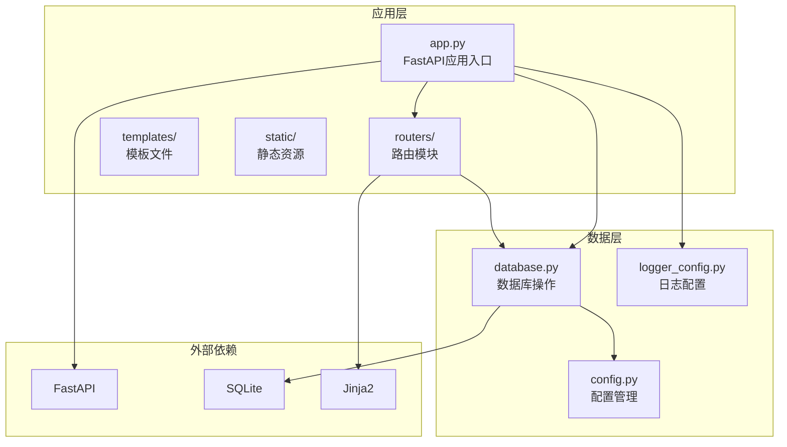

**图表来源**
- [app.py](file://app.py#L1-L34)
- [database.py](file://database.py#L1-L20)
- [config.py](file://config.py#L1-L24)

**章节来源**
- [app.py](file://app.py#L1-L34)
- [database.py](file://database.py#L1-L20)
- [config.py](file://config.py#L1-L24)

## 核心组件

### 数据库连接管理

系统通过统一的数据库连接管理机制确保数据访问的一致性和可靠性：

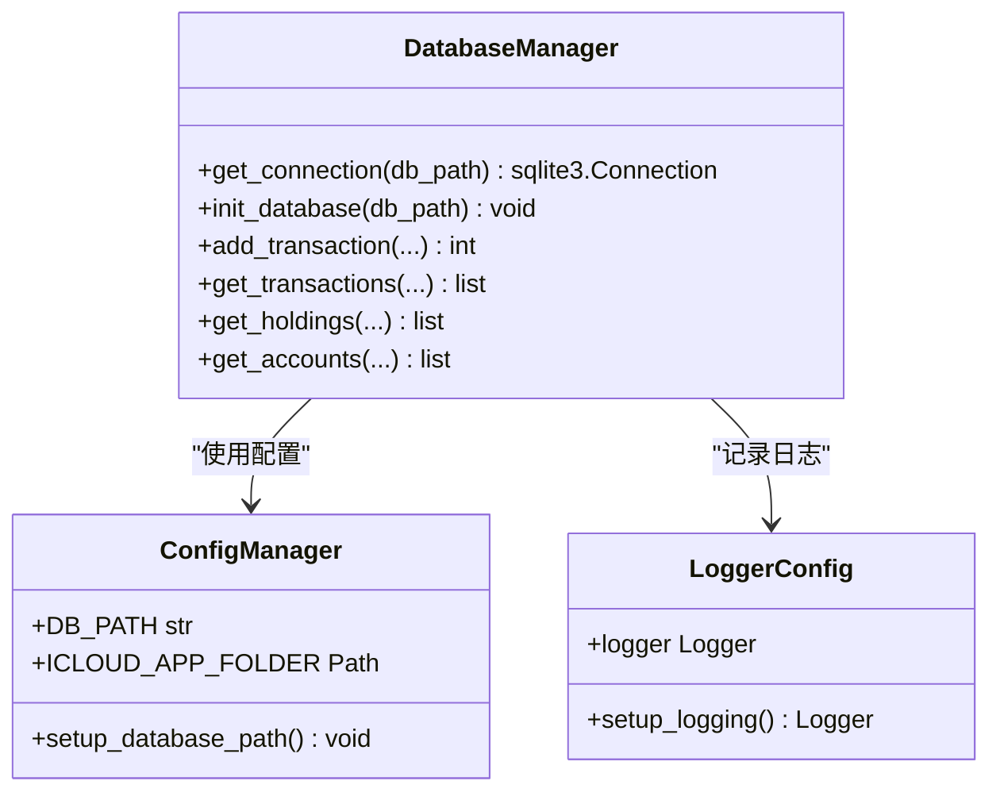

**图表来源**
- [database.py](file://database.py#L15-L25)
- [config.py](file://config.py#L17-L23)
- [logger_config.py](file://logger_config.py#L14-L53)

### 应用启动流程

系统在启动时自动初始化数据库连接和表结构：

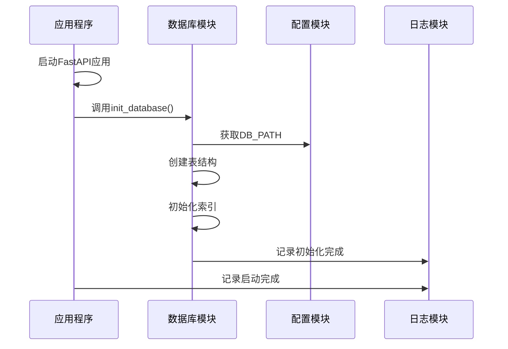

**图表来源**
- [app.py](file://app.py#L18-L22)
- [database.py](file://database.py#L22-L188)
- [config.py](file://config.py#L17-L23)

**章节来源**
- [database.py](file://database.py#L15-L188)
- [config.py](file://config.py#L17-L23)
- [logger_config.py](file://logger_config.py#L14-L53)

## 架构概览

### 数据库架构设计

系统采用SQLite作为本地数据库，支持完整的ACID事务特性：

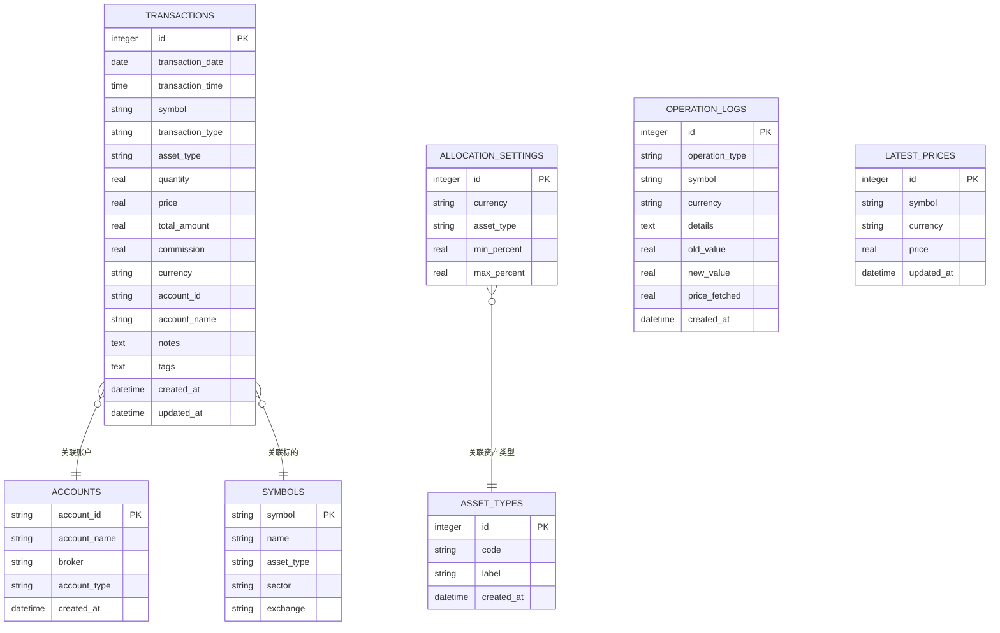

**图表来源**
- [database.py](file://database.py#L27-L177)

### 备份策略架构

系统支持多种备份策略以满足不同场景需求：

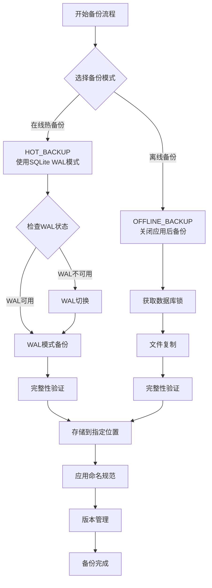

**图表来源**
- [database.py](file://database.py#L15-L25)
- [config.py](file://config.py#L17-L23)

## 详细组件分析

### 数据库配置管理

#### 存储位置配置

系统采用iCloud同步的数据库存储策略，确保数据的跨设备同步能力：

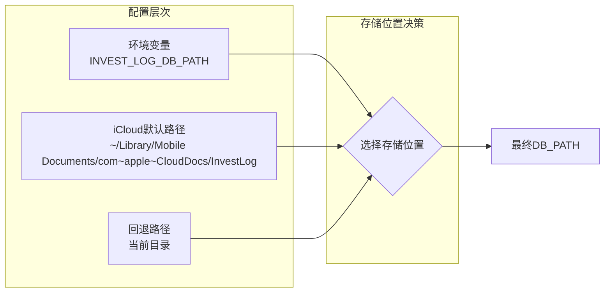

**图表来源**
- [config.py](file://config.py#L10-L23)

#### 数据库初始化流程

系统在启动时自动执行数据库初始化，包括表结构创建和索引建立：

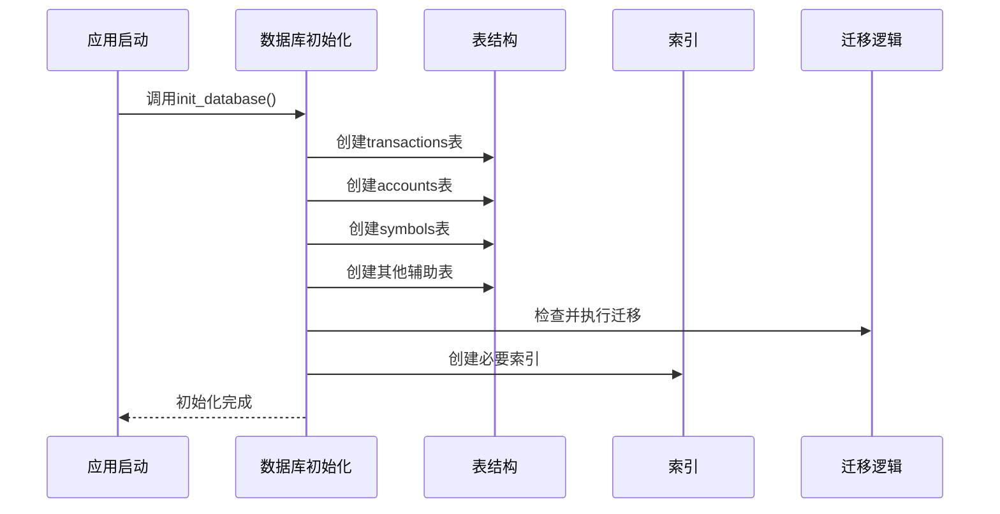

**图表来源**
- [database.py](file://database.py#L22-L188)

**章节来源**
- [config.py](file://config.py#L10-L23)
- [database.py](file://database.py#L22-L188)

### 备份策略实现

#### 在线热备份策略

SQLite的WAL（Write-Ahead Logging）模式支持真正的在线备份：

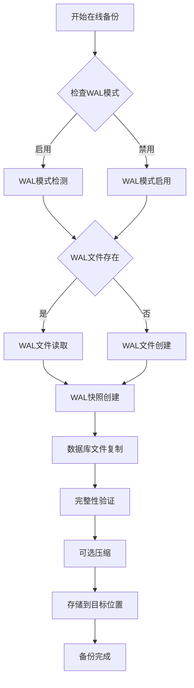

**图表来源**
- [database.py](file://database.py#L15-L25)

#### 离线备份策略

传统文件级备份适用于维护窗口内的完整备份：

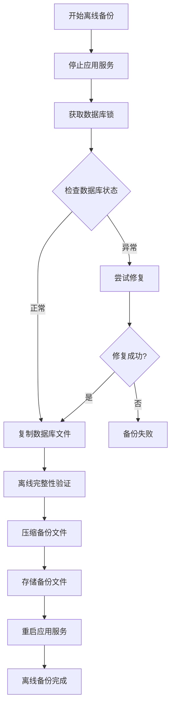

**图表来源**
- [app.py](file://app.py#L18-L22)

**章节来源**
- [database.py](file://database.py#L15-L25)
- [app.py](file://app.py#L18-L22)

### 备份文件管理

#### 存储位置配置

系统支持灵活的备份文件存储位置配置：

| 配置选项 | 默认值 | 描述 |
|---------|--------|------|
| iCloud路径 | `~/Library/Mobile Documents/com~apple~CloudDocs/InvestLog` | 自动同步的云端存储 |
| 环境变量 | `INVEST_LOG_DB_PATH` | 开发环境自定义路径 |
| 回退路径 | 当前工作目录 | 系统默认备份位置 |

#### 命名规范

备份文件采用标准化命名格式，便于识别和管理：

```
transactions_backup_{YYYYMMDD_HHMMSS}_{TYPE}.db
```

其中：
- `{YYYYMMDD_HHMMSS}` - 备份时间戳
- `{TYPE}` - 备份类型（full、wal、incremental）

#### 版本管理策略

系统实施多版本备份管理，支持以下策略：

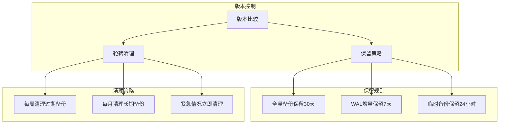

**图表来源**
- [config.py](file://config.py#L17-L23)

**章节来源**
- [config.py](file://config.py#L17-L23)

## 依赖关系分析

### 外部依赖关系

系统依赖的关键外部组件及其版本要求：

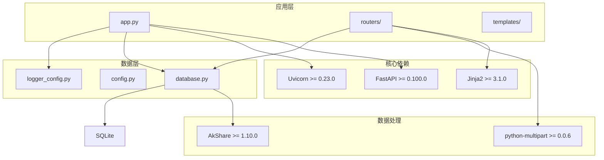

**图表来源**
- [requirements.txt](file://requirements.txt#L1-L6)
- [app.py](file://app.py#L7-L11)

### 内部模块依赖

系统内部模块间的依赖关系清晰且职责明确：

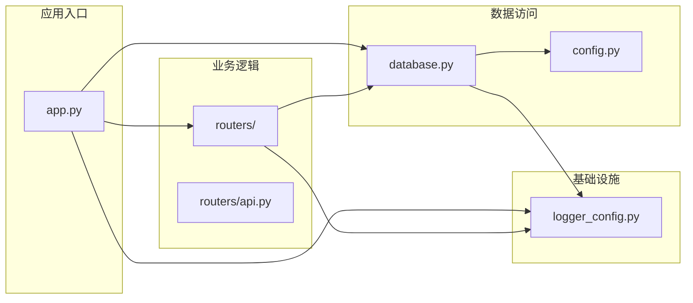

**图表来源**
- [app.py](file://app.py#L7-L11)
- [routers/api.py](file://routers/api.py#L1-L6)

**章节来源**
- [requirements.txt](file://requirements.txt#L1-L6)
- [app.py](file://app.py#L7-L11)
- [routers/api.py](file://routers/api.py#L1-L6)

## 性能考虑

### 备份性能优化

#### 在线备份性能特征

- **WAL模式优势**：支持并发读写，最小化备份阻塞时间
- **增量备份**：仅备份WAL文件中的新数据页
- **内存使用**：在线备份通常占用更少内存空间

#### 离线备份性能特征

- **文件锁定**：需要短暂的数据库文件锁定
- **完整扫描**：需要扫描整个数据库文件
- **磁盘I/O**：可能影响系统整体I/O性能

### 备份调度策略

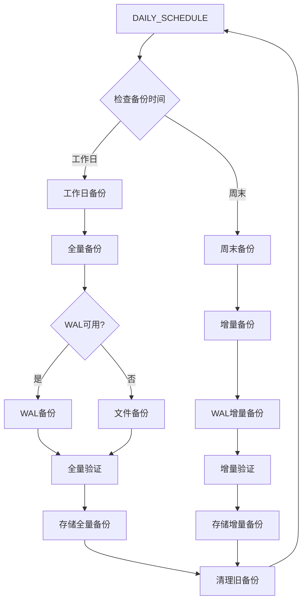

**图表来源**
- [database.py](file://database.py#L15-L25)

## 故障排除指南

### 常见备份问题及解决方案

#### 备份文件损坏

**问题症状**：
- SQLite打开数据库时报错
- 查询结果不完整或异常
- 备份文件无法被应用识别

**诊断步骤**：
1. 检查备份文件完整性
2. 验证SQLite文件格式
3. 确认备份时间戳有效性

**解决方法**：
```bash
# 使用SQLite工具检查数据库完整性
sqlite3 backup_file.db "PRAGMA integrity_check;"

# 检查数据库统计信息
sqlite3 backup_file.db "PRAGMA database_list;"
```

#### 备份权限问题

**问题症状**：
- 备份过程中出现权限错误
- 无法写入备份目录
- 备份文件创建失败

**解决方法**：
1. 检查备份目录权限设置
2. 确认用户对数据库文件有读取权限
3. 验证磁盘空间充足

#### 备份冲突处理

**问题症状**：
- 多个备份进程同时运行
- 备份文件相互覆盖
- 备份任务执行失败

**解决方法**：
```python
import threading
import time

class BackupLock:
    def __init__(self, lock_file):
        self.lock_file = lock_file
        self.lock_acquired = False
    
    def acquire(self):
        while True:
            try:
                with open(self.lock_file, 'x'):
                    self.lock_acquired = True
                    return True
            except FileExistsError:
                time.sleep(1)  # 等待1秒后重试
                continue
    
    def release(self):
        if self.lock_acquired:
            os.remove(self.lock_file)
            self.lock_acquired = False
```

### 恢复流程故障排除

#### 完整恢复流程

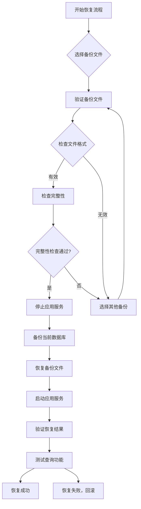

**图表来源**
- [app.py](file://app.py#L18-L22)
- [database.py](file://database.py#L15-L25)

**章节来源**
- [app.py](file://app.py#L18-L22)
- [database.py](file://database.py#L15-L25)

## 结论

投资日志管理系统的数据库备份与恢复策略提供了全面的数据保护方案。通过结合在线热备份和离线备份的优势，系统能够在保证业务连续性的同时提供可靠的数据安全保障。

### 关键优势

1. **多层保护**：同时支持在线热备份和离线备份，适应不同场景需求
2. **自动化程度高**：支持定时任务和自动化的备份管理
3. **版本管理完善**：实施多版本备份策略，确保数据历史可追溯
4. **故障恢复能力强**：提供完整的灾难恢复计划和验证机制

### 最佳实践建议

1. **定期测试**：至少每季度进行一次完整的备份恢复演练
2. **监控告警**：建立备份状态监控和异常告警机制
3. **异地备份**：建议在多个地理位置保存备份副本
4. **文档更新**：定期更新备份策略文档和操作手册

通过遵循本文档提供的备份与恢复指南，用户可以确保投资日志数据的安全性和完整性，为业务的持续发展提供坚实的数据基础。