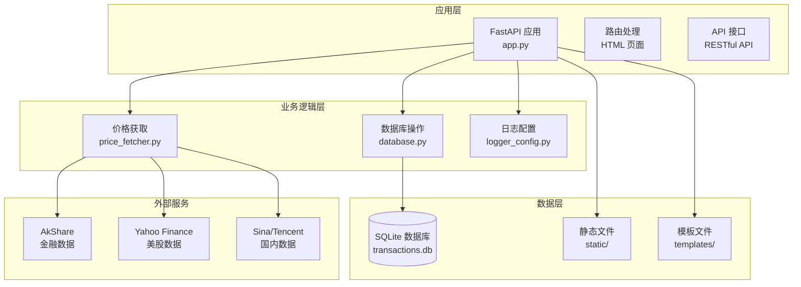
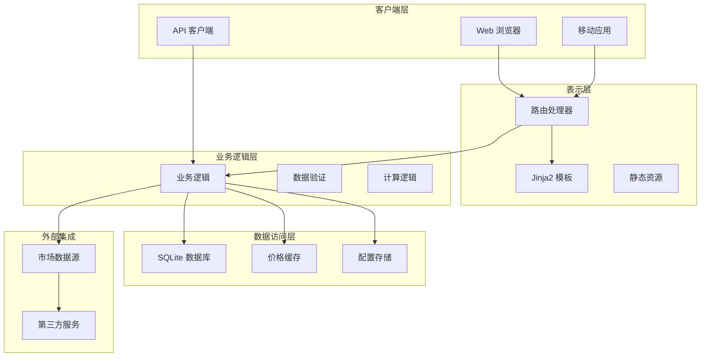
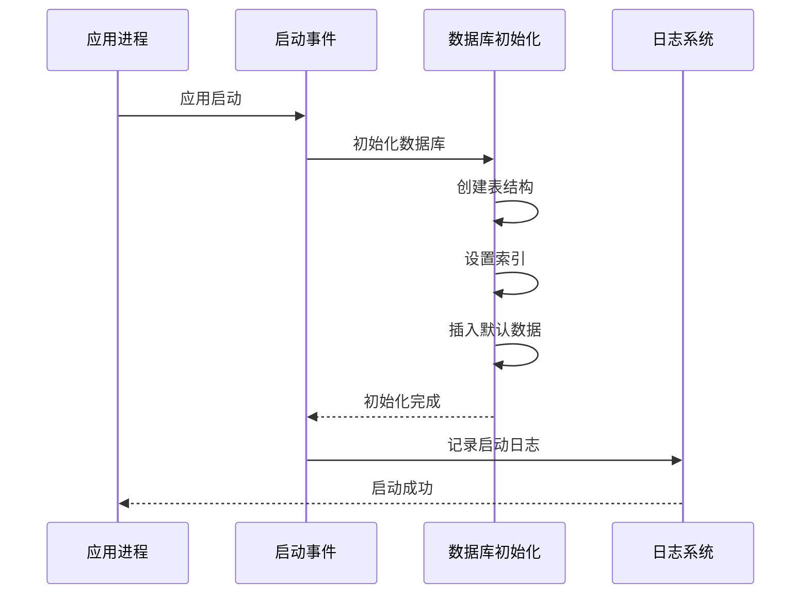
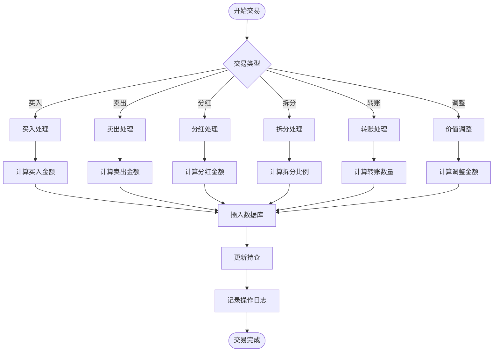
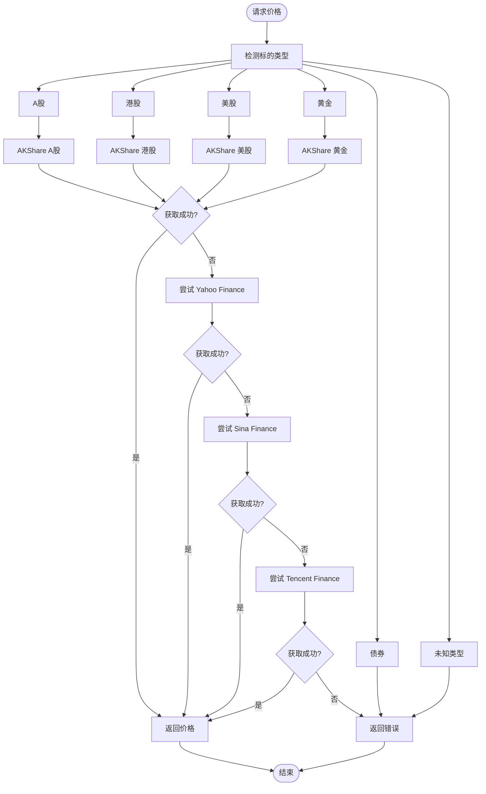
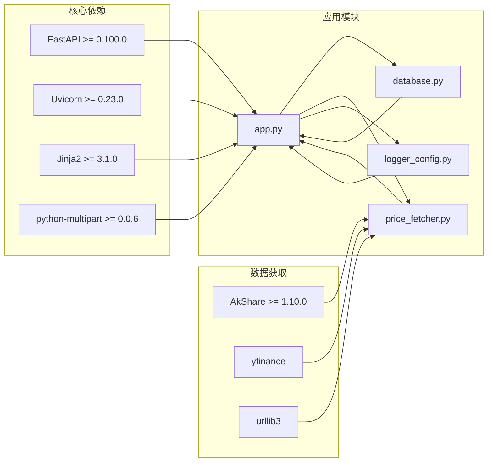

# 环境部署

<cite>
**本文档引用的文件**
- [app.py](file://app.py)
- [requirements.txt](file://requirements.txt)
- [database.py](file://database.py)
- [logger_config.py](file://logger_config.py)
- [price_fetcher.py](file://price_fetcher.py)
- [templates/base.html](file://templates/base.html)
- [static/style.css](file://static/style.css)
</cite>

## 目录
1. [简介](#简介)
2. [项目结构](#项目结构)
3. [核心组件](#核心组件)
4. [架构概览](#架构概览)
5. [详细组件分析](#详细组件分析)
6. [依赖关系分析](#依赖关系分析)
7. [性能考虑](#性能考虑)
8. [故障排除指南](#故障排除指南)
9. [结论](#结论)
10. [附录](#附录)

## 简介

Invest Log 是一个基于 FastAPI 的投资交易记录管理系统。该系统允许用户记录和跟踪股票、债券、贵金属等各类资产的投资交易，提供实时价格查询、投资组合分析和图表展示功能。

本项目采用 Python 3.x 开发，使用 FastAPI 作为 Web 框架，SQLite 作为本地数据库存储，Jinja2 模板引擎进行页面渲染。系统支持多币种（人民币、美元、港币）和多种资产类型（股票、债券、贵金属、现金），并通过 AkShare 等第三方库获取实时市场价格数据。

## 项目结构

Invest Log 项目采用简洁的分层架构设计，主要包含以下核心组件：

**图表来源**
- [app.py](file://app.py#L1-L50)
- [database.py](file://database.py#L1-L50)
- [price_fetcher.py](file://price_fetcher.py#L1-L50)

**章节来源**
- [app.py](file://app.py#L1-L50)
- [database.py](file://database.py#L1-L50)
- [price_fetcher.py](file://price_fetcher.py#L1-L50)

## 核心组件

### FastAPI 应用核心

应用的核心是基于 FastAPI 构建的 Web 服务，提供了完整的投资管理功能：

- **Web 页面路由**：首页仪表板、交易记录、添加交易、图表分析、持仓详情等
- **API 接口**：提供 JSON 格式的 API 接口供前端或其他系统调用
- **模板系统**：使用 Jinja2 模板引擎渲染动态页面内容
- **静态资源**：CSS 样式文件和相关静态资源

### 数据库模块

数据库模块负责所有数据持久化操作，采用 SQLite 作为本地存储：

- **事务表**：存储所有投资交易记录
- **账户表**：管理投资账户信息
- **资产类型表**：支持动态资产类型管理
- **价格表**：缓存最新的市场报价
- **配置表**：投资组合配置和分配范围设置

### 价格获取模块

价格获取模块集成了多个数据源，提供可靠的价格数据：

- **AkShare**：主要的数据源，支持 A 股、港股、美股等
- **Yahoo Finance**：美股数据备份
- **Sina/Tencent**：国内市场的备用数据源
- **多级回退机制**：确保数据获取的可靠性

**章节来源**
- [app.py](file://app.py#L19-L30)
- [database.py](file://database.py#L20-L150)
- [price_fetcher.py](file://price_fetcher.py#L22-L34)

## 架构概览

Invest Log 采用经典的三层架构模式，实现了清晰的关注点分离：

**图表来源**
- [app.py](file://app.py#L36-L122)
- [database.py](file://database.py#L156-L256)
- [price_fetcher.py](file://price_fetcher.py#L321-L394)

## 详细组件分析

### 应用启动流程

应用启动时会执行初始化过程，确保系统正常运行：

**图表来源**
- [app.py](file://app.py#L25-L30)
- [database.py](file://database.py#L20-L150)
- [logger_config.py](file://logger_config.py#L14-L54)

### 交易处理流程

系统支持多种类型的交易操作，每种操作都有相应的处理流程：

**图表来源**
- [app.py](file://app.py#L83-L111)
- [database.py](file://database.py#L156-L194)
- [database.py](file://database.py#L434-L481)

### 价格获取策略

系统采用多数据源回退策略，确保价格数据的可靠性：

**图表来源**
- [price_fetcher.py](file://price_fetcher.py#L36-L63)
- [price_fetcher.py](file://price_fetcher.py#L321-L394)

**章节来源**
- [app.py](file://app.py#L25-L30)
- [database.py](file://database.py#L156-L194)
- [price_fetcher.py](file://price_fetcher.py#L36-L63)

## 依赖关系分析

项目依赖关系清晰明确，各模块职责分工明确：

**图表来源**
- [requirements.txt](file://requirements.txt#L1-L6)
- [app.py](file://app.py#L7-L17)
- [price_fetcher.py](file://price_fetcher.py#L22-L34)

**章节来源**
- [requirements.txt](file://requirements.txt#L1-L6)
- [app.py](file://app.py#L7-L17)

## 性能考虑

### 数据库优化

系统在数据库层面采用了多项优化措施：

- **索引优化**：为常用查询字段建立索引，提高查询性能
- **连接池**：使用 SQLite 的连接复用机制
- **批量操作**：支持批量数据导入和导出
- **缓存策略**：价格数据采用缓存机制减少重复查询

### 内存管理

应用在内存使用方面采取了以下优化策略：

- **流式处理**：大文件下载采用流式处理避免内存溢出
- **分页查询**：列表页面采用分页机制限制单次查询数据量
- **及时释放**：确保数据库连接和文件句柄及时关闭

### 并发处理

系统支持多用户并发访问：

- **异步处理**：利用 FastAPI 的异步特性提升响应速度
- **线程安全**：数据库操作采用线程安全的连接管理
- **锁机制**：关键操作采用适当的锁机制防止数据竞争

## 故障排除指南

### 常见问题诊断

#### 数据库连接问题

**症状**：应用启动时报数据库连接错误

**解决方案**：
1. 检查数据库文件权限
2. 验证数据库文件完整性
3. 确认 SQLite 版本兼容性

#### 价格获取失败

**症状**：价格更新功能无法获取市场数据

**解决方案**：
1. 检查网络连接状态
2. 验证第三方数据源可用性
3. 查看日志文件获取详细错误信息

#### 静态资源加载失败

**症状**：网页样式或图片无法正常显示

**解决方案**：
1. 确认静态文件路径配置正确
2. 检查文件权限设置
3. 验证文件完整性

### 日志分析

系统提供了完善的日志记录机制，有助于问题诊断：

- **应用日志**：记录应用运行状态和错误信息
- **操作日志**：记录用户的重要操作行为
- **价格日志**：记录价格获取的详细过程

**章节来源**
- [logger_config.py](file://logger_config.py#L14-L54)
- [database.py](file://database.py#L733-L773)

## 结论

Invest Log 项目展现了良好的软件工程实践，具有以下特点：

- **架构清晰**：采用分层架构，职责分离明确
- **扩展性强**：模块化设计便于功能扩展
- **可靠性高**：多数据源回退机制确保服务稳定性
- **易维护**：代码结构清晰，文档完善

该项目适合在生产环境中部署，但仍需要根据具体需求进行定制化配置和安全加固。

## 附录

### 环境部署检查清单

#### 基础环境准备
- [ ] Python 3.8+ 环境
- [ ] pip 包管理工具
- [ ] Git 版本控制
- [ ] 基本的 Linux/Unix 系统知识

#### Python 环境配置
- [ ] 创建虚拟环境
- [ ] 安装依赖包
- [ ] 配置环境变量
- [ ] 设置日志目录权限

#### 数据库初始化
- [ ] 创建数据库文件
- [ ] 初始化表结构
- [ ] 插入默认配置
- [ ] 验证数据库连接

#### 服务器配置
- [ ] 配置反向代理
- [ ] 设置防火墙规则
- [ ] 配置 SSL 证书
- [ ] 测试 HTTPS 连接

#### 应用启动测试
- [ ] 启动应用服务
- [ ] 验证基本功能
- [ ] 检查日志输出
- [ ] 测试 API 接口

### 生产环境部署步骤

#### 步骤 1：系统准备
1. 更新系统包管理器
2. 安装必要的系统依赖
3. 创建应用用户和组
4. 设置文件系统权限

#### 步骤 2：Python 环境搭建
1. 安装 Python 3.8+
2. 创建虚拟环境
3. 激活虚拟环境
4. 安装项目依赖

#### 步骤 3：数据库配置
1. 创建数据库文件
2. 初始化数据库结构
3. 配置数据库连接参数
4. 设置数据库备份策略

#### 步骤 4：应用配置
1. 复制配置文件
2. 设置环境变量
3. 配置日志级别
4. 调整性能参数

#### 步骤 5：服务部署
1. 配置 systemd 服务
2. 设置自动启动
3. 配置日志轮转
4. 测试服务状态

#### 步骤 6：反向代理配置
1. 安装 Nginx
2. 配置虚拟主机
3. 设置 SSL 证书
4. 配置反向代理规则

#### 步骤 7：安全加固
1. 配置防火墙
2. 设置访问控制
3. 启用 HTTPS 强制跳转
4. 配置安全头

#### 歩骤 8：监控和维护
1. 设置健康检查
2. 配置告警通知
3. 制定备份计划
4. 建立维护流程

### Docker 容器化部署

#### Dockerfile 编写要点
- 使用官方 Python 基础镜像
- 设置工作目录和环境变量
- 复制依赖文件并安装
- 配置应用入口点
- 设置非 root 用户运行

#### docker-compose 配置
- 定义服务和网络
- 配置卷挂载和环境变量
- 设置端口映射和健康检查
- 配置日志和重启策略

### Uvicorn 部署配置

#### 进程管理
- 配置 workers 数量
- 设置进程池大小
- 配置进程重启策略
- 监控进程状态

#### 端口设置
- 配置监听端口
- 设置绑定地址
- 配置反向代理转发
- 设置健康检查端口

### 环境变量配置

#### 必需环境变量
- `DATABASE_URL`: 数据库连接字符串
- `SECRET_KEY`: 应用密钥
- `DEBUG`: 调试模式开关
- `ALLOWED_HOSTS`: 允许的主机名

#### 安全相关变量
- `SSL_CERT_PATH`: SSL 证书路径
- `SSL_KEY_PATH`: SSL 私钥路径
- `LOG_LEVEL`: 日志级别
- `MAX_FILE_SIZE`: 文件上传大小限制

### Nginx 反向代理配置

#### 基本配置
- 配置上游服务器
- 设置代理转发规则
- 配置静态文件处理
- 设置超时参数

#### 安全配置
- 启用 HTTPS
- 配置 SSL 参数
- 设置安全头
- 配置访问控制

#### 性能优化
- 配置缓存策略
- 设置压缩
- 配置 keep-alive
- 设置限流规则