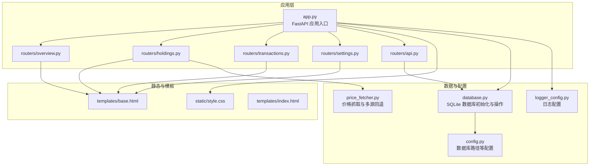
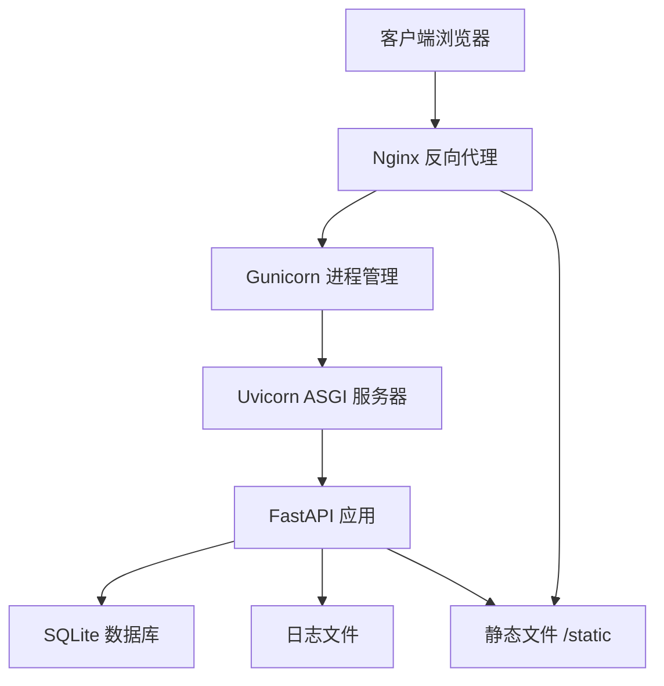
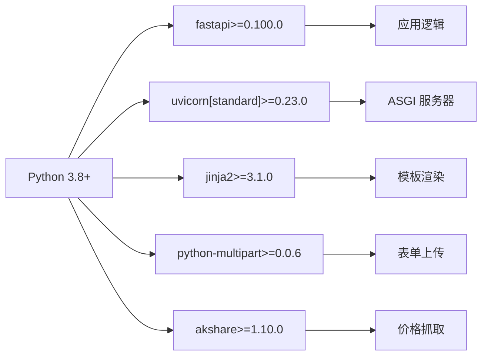

# 生产环境部署

<cite>
**本文引用的文件**
- [app.py](file://app.py)
- [requirements.txt](file://requirements.txt)
- [config.py](file://config.py)
- [database.py](file://database.py)
- [logger_config.py](file://logger_config.py)
- [price_fetcher.py](file://price_fetcher.py)
- [routers/api.py](file://routers/api.py)
- [routers/overview.py](file://routers/overview.py)
- [routers/holdings.py](file://routers/holdings.py)
- [routers/settings.py](file://routers/settings.py)
- [routers/transactions.py](file://routers/transactions.py)
- [templates/base.html](file://templates/base.html)
- [templates/index.html](file://templates/index.html)
</cite>

## 目录
1. [简介](#简介)
2. [项目结构](#项目结构)
3. [核心组件](#核心组件)
4. [架构总览](#架构总览)
5. [详细组件分析](#详细组件分析)
6. [依赖关系分析](#依赖关系分析)
7. [性能与资源规划](#性能与资源规划)
8. [故障排查指南](#故障排查指南)
9. [结论](#结论)
10. [附录](#附录)

## 简介
本指南面向投资日志管理系统在生产环境的部署，涵盖服务器环境准备、依赖安装、Uvicorn ASGI 服务器生产配置、Gunicorn + Uvicorn 工作进程配置、静态文件服务、域名与 SSL 配置、Nginx 反向代理与负载均衡策略，以及 Docker 容器化部署的最佳实践。目标是帮助运维与开发团队以稳定、可扩展的方式上线系统。

## 项目结构
系统采用 FastAPI + Jinja2 模板的单体应用，路由按功能模块拆分，数据库使用 SQLite 并通过配置文件集中管理路径，日志采用每日轮转策略，价格抓取模块支持多数据源回退。

图表来源
- [app.py](file://app.py#L1-L34)
- [config.py](file://config.py#L1-L24)
- [database.py](file://database.py#L1-L151)
- [logger_config.py](file://logger_config.py#L1-L54)
- [price_fetcher.py](file://price_fetcher.py#L1-L405)
- [routers/api.py](file://routers/api.py#L1-L67)
- [routers/overview.py](file://routers/overview.py#L1-L28)
- [routers/holdings.py](file://routers/holdings.py#L1-L207)
- [routers/settings.py](file://routers/settings.py#L1-L148)
- [routers/transactions.py](file://routers/transactions.py#L1-L75)
- [templates/base.html](file://templates/base.html#L1-L27)
- [templates/index.html](file://templates/index.html#L1-L90)

章节来源
- [app.py](file://app.py#L1-L34)
- [requirements.txt](file://requirements.txt#L1-L6)

## 核心组件
- 应用入口与路由：FastAPI 应用在入口文件中注册静态目录、启动时初始化数据库、挂载各功能路由。
- 数据库：SQLite 初始化表结构、索引与默认资产类型；提供交易、账户、符号、分配设置、操作日志、最新价格等 CRUD 与聚合查询。
- 日志：每日轮转，保留 7 天日志，同时输出到控制台。
- 配置：iCloud 路径作为默认数据库位置，支持环境变量覆盖；本地开发可重写路径。
- 价格抓取：多数据源回退（AKShare、Yahoo Finance、Sina、Tencent），支持 A 股、港股、美股、黄金等。
- 前端：Jinja2 模板与静态样式，基础导航与图表渲染。

章节来源
- [app.py](file://app.py#L13-L29)
- [database.py](file://database.py#L22-L151)
- [logger_config.py](file://logger_config.py#L14-L50)
- [config.py](file://config.py#L10-L24)
- [price_fetcher.py](file://price_fetcher.py#L36-L401)
- [templates/base.html](file://templates/base.html#L1-L27)

## 架构总览
生产部署推荐使用 Nginx 作为反向代理，后端由 Gunicorn + Uvicorn 托管，应用通过 ASGI 协议运行。静态文件由 Nginx 直接提供，动态请求转发至后端。

图表来源
- [app.py](file://app.py#L15-L16)
- [app.py](file://app.py#L31-L33)
- [logger_config.py](file://logger_config.py#L11-L12)

## 详细组件分析

### 应用入口与生命周期
- 启动事件：应用启动时调用数据库初始化函数，确保表结构与索引就绪。
- 静态文件：挂载 /static 目录供 Nginx 或应用直接提供。
- 主机与端口：本地运行默认监听 127.0.0.1:8000，生产应通过反向代理暴露。

章节来源
- [app.py](file://app.py#L18-L22)
- [app.py](file://app.py#L15-L16)
- [app.py](file://app.py#L31-L33)

### 数据库与配置
- 数据库路径：默认位于 iCloud 投资日志目录，可通过环境变量覆盖。
- 表结构：交易、账户、符号、分配设置、资产类型、操作日志、最新价格等。
- 索引：针对 symbol、date、account_id、type、currency、asset_type 建立索引，提升查询效率。
- 初始化：首次启动自动创建表与索引，兼容旧数据库（如新增列）。

章节来源
- [config.py](file://config.py#L17-L24)
- [database.py](file://database.py#L22-L151)

### 日志与监控
- 日志目录：logs 目录下按天轮转，保留 7 天。
- 输出：同时输出到文件与控制台，便于生产观察。

章节来源
- [logger_config.py](file://logger_config.py#L14-L50)

### 价格抓取与外部依赖
- 多源回退：优先 AKShare，其次 Yahoo Finance，再 Sina/Tencent。
- 支持标的：A 股、港股、美股、黄金；债券与现金有特殊处理。
- 错误处理：逐源尝试，记录错误摘要，最终返回失败信息。

章节来源
- [price_fetcher.py](file://price_fetcher.py#L36-L401)

### 路由与页面
- 功能路由：概览、持有明细、交易列表、设置、API 接口。
- 页面模板：基于 base.html 继承，提供导航与图表渲染。
- 静态资源：样式文件通过 /static 提供。

章节来源
- [routers/overview.py](file://routers/overview.py#L8-L27)
- [routers/holdings.py](file://routers/holdings.py#L13-L206)
- [routers/transactions.py](file://routers/transactions.py#L10-L74)
- [routers/settings.py](file://routers/settings.py#L11-L147)
- [routers/api.py](file://routers/api.py#L8-L66)
- [templates/base.html](file://templates/base.html#L1-L27)
- [templates/index.html](file://templates/index.html#L1-L90)

## 依赖关系分析
- Python 版本：根据依赖声明，需要 Python 3.8+（FastAPI>=0.100.0）。
- 关键依赖：FastAPI、Uvicorn（标准变体）、Jinja2、python-multipart、akshare。
- 数据库：SQLite（无需额外服务）。
- 网络与价格：若启用 AKShare/Yahoo Finance，需网络访问权限。

图表来源
- [requirements.txt](file://requirements.txt#L1-L6)

章节来源
- [requirements.txt](file://requirements.txt#L1-L6)

## 性能与资源规划

### 服务器环境准备
- 操作系统：Linux（推荐 Ubuntu 20.04+/CentOS 8+），macOS 仅用于开发测试。
- Python：3.8+，建议使用 pyenv 或官方二进制包管理。
- 硬件建议：
  - CPU：至少 2 核，推荐 4 核以上以应对并发与价格抓取。
  - 内存：至少 2GB，推荐 4GB+，用于缓存与并发。
  - 存储：SSD 更佳；数据库位于 iCloud 时注意网络稳定性与带宽。
  - 网络：开放出站 HTTP(S) 访问以支持价格抓取。

章节来源
- [requirements.txt](file://requirements.txt#L1-L6)
- [config.py](file://config.py#L10-L24)

### 依赖安装流程
- 创建虚拟环境并激活。
- 安装依赖：pip install -r requirements.txt。
- 注意事项：
  - 若系统缺少编译工具链，先安装 build-essential（Debian/Ubuntu）或相应包组（RHEL/CentOS）。
  - 如需 AKShare，确保网络可达其数据源；若受限，可离线准备镜像或在内网部署代理。
  - python-multipart 用于表单上传，确保与 FastAPI 兼容。

章节来源
- [requirements.txt](file://requirements.txt#L1-L6)

### Uvicorn ASGI 生产配置
- 进程数量：单实例建议 1 个主进程，配合 Gunicorn 使用。
- 并发连接数：根据 CPU 核心数与内存设定 worker 数量，每核约 1-2 个 worker。
- 内存限制：结合业务峰值与 SQLite 内存占用，合理设置 worker 的内存上限。
- 绑定地址：生产环境不应绑定到 127.0.0.1，应绑定到 0.0.0.0 或容器内部地址，由 Nginx 反代。
- 日志级别：INFO 或 WARNING，避免过多调试日志影响性能。

章节来源
- [app.py](file://app.py#L31-L33)
- [logger_config.py](file://logger_config.py#L22-L38)

### Gunicorn + Uvicorn 工作进程配置示例
- Gunicorn 作为进程管理器，Uvicorn 作为 ASGI 服务器。
- 推荐参数：
  - workers：CPU 核数 × 2 + 1（例如 4 核为 9 个 worker）。
  - worker_class：uvicorn.workers.UvicornWorker。
  - bind：0.0.0.0:8000（或容器内端口）。
  - keepalive：5-10 秒，减少空闲连接消耗。
  - max_requests：1000-5000，定期重启 worker 降低内存泄漏风险。
  - max_requests_jitter：随机抖动，避免同时重启。
- 与 Nginx 配合：Nginx 将请求转发至 Gunicorn 的本地端口。

章节来源
- [app.py](file://app.py#L31-L33)

### 静态文件服务、域名与 SSL
- 静态文件：建议由 Nginx 直接提供 /static，避免进入应用层。
- 域名绑定：在 Nginx 中配置 server_name 与根路径。
- SSL 证书：使用 Let’s Encrypt 自动签发与续期；或企业 CA 证书，确保 HTTPS 强制跳转。

章节来源
- [app.py](file://app.py#L15-L16)
- [templates/base.html](file://templates/base.html#L7-L8)

### Nginx 反向代理与负载均衡
- 反向代理：将 /static 直接映射到静态目录；其他路径转发至 Gunicorn。
- 负载均衡：多实例部署时，使用 Nginx upstream 聚合多个 Gunicorn 实例。
- 健康检查：可结合 Nginx upstream 的健康检查模块（如 stream/upstream_healthcheck）。
- 缓存策略：静态资源可开启长期缓存；动态接口禁用缓存或使用 ETag。

章节来源
- [app.py](file://app.py#L15-L16)

### Docker 容器化部署
- 基础镜像：python:3.11-slim 或 alpine 版本。
- 工作目录：/app，复制 requirements.txt 后执行 pip install。
- 环境变量：INVEST_LOG_DB_PATH（可选，覆盖默认 iCloud 路径）。
- 健康检查：curl -f http://localhost:8000/health 或自定义探针。
- 挂载卷：持久化 logs 与数据库文件（若非 iCloud）。
- 启动命令：gunicorn --bind 0.0.0.0:8000 --workers N --worker-class uvicorn.workers.UvicornWorker app:app。
- Nginx：作为独立容器或宿主机服务，反代至应用容器。

章节来源
- [config.py](file://config.py#L21-L24)
- [logger_config.py](file://logger_config.py#L11-L12)
- [app.py](file://app.py#L31-L33)

## 故障排查指南
- 数据库初始化失败：检查 DB_PATH 权限与磁盘空间；确认 iCloud 同步状态。
- 价格抓取失败：查看 price_fetcher 日志，确认网络连通性与各数据源可用性；必要时切换回退策略。
- 静态文件 404：确认 Nginx 静态目录映射正确；FastAPI 是否仍挂载 /static。
- 日志轮转异常：确认 logs 目录可写，磁盘空间充足。
- Gunicorn 启动失败：检查 Python 版本、依赖安装、端口占用与权限。

章节来源
- [database.py](file://database.py#L22-L151)
- [price_fetcher.py](file://price_fetcher.py#L325-L401)
- [logger_config.py](file://logger_config.py#L11-L12)
- [app.py](file://app.py#L15-L16)

## 结论
通过 Nginx + Gunicorn + Uvicorn 的组合，结合 SQLite 与本地存储方案，可在资源有限的情况下实现稳定、可扩展的投资日志管理服务。生产部署的关键在于：合理的进程与并发配置、完善的日志与监控、静态资源优化、以及安全的域名与 SSL 配置。Docker 化进一步简化了部署与升级流程，建议配合 CI/CD 自动化发布。

## 附录

### 附录 A：生产部署清单
- 系统与 Python 版本满足要求
- 安装并验证依赖
- 配置数据库路径与权限
- 配置 Nginx 反代与静态文件
- 配置 SSL 证书与强制 HTTPS
- 部署 Gunicorn + Uvicorn
- 配置日志轮转与监控
- 进行健康检查与压力测试

### 附录 B：常见问题速查
- 问：为什么价格抓取不稳定？
  - 答：检查网络与各数据源可用性，必要时增加超时与重试。
- 问：如何迁移数据库到本地磁盘？
  - 答：设置 INVEST_LOG_DB_PATH 指向新路径，确保权限与备份策略。
- 问：如何实现灰度发布？
  - 答：使用 Nginx upstream 多实例，逐步切换流量。