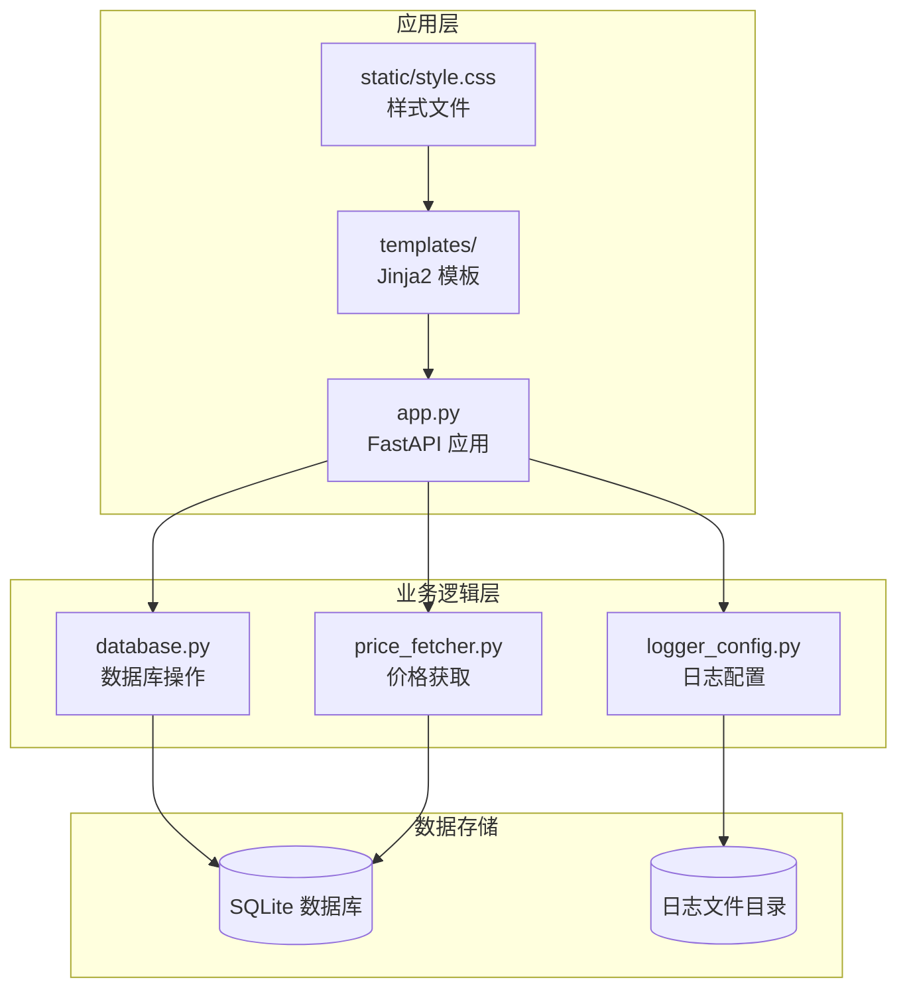
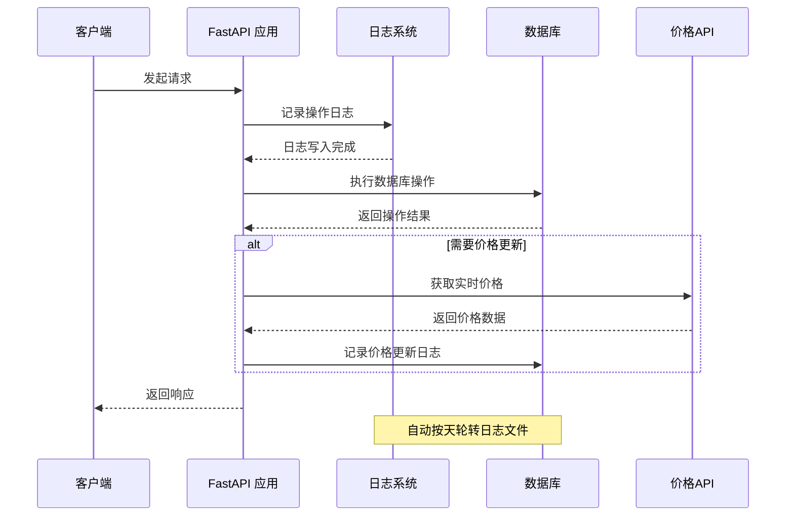
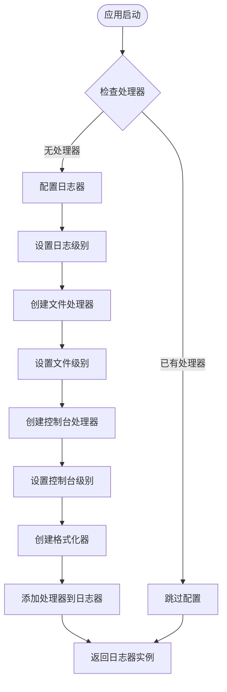
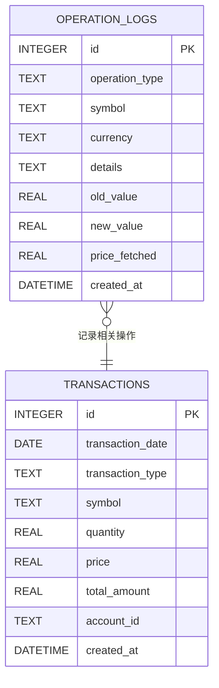
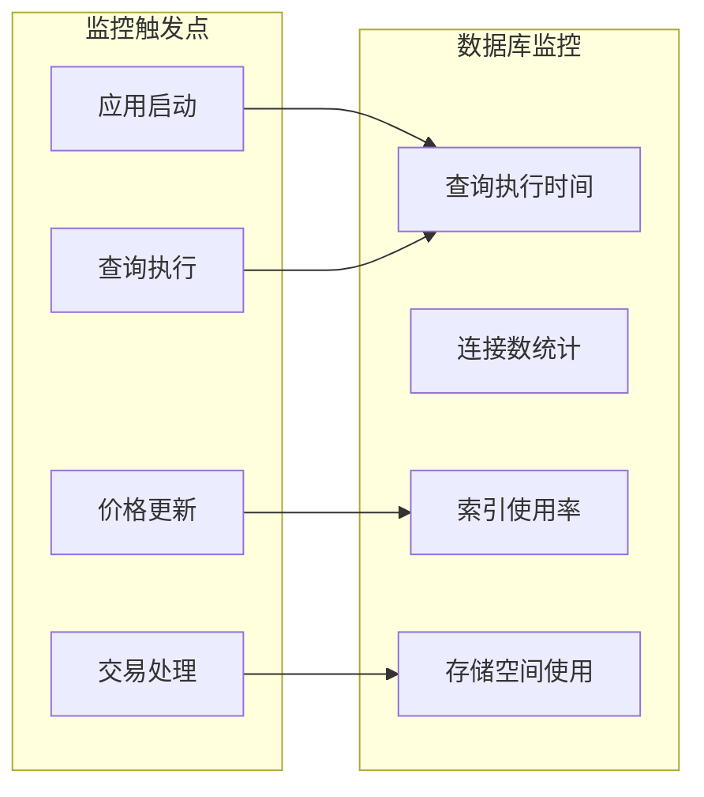
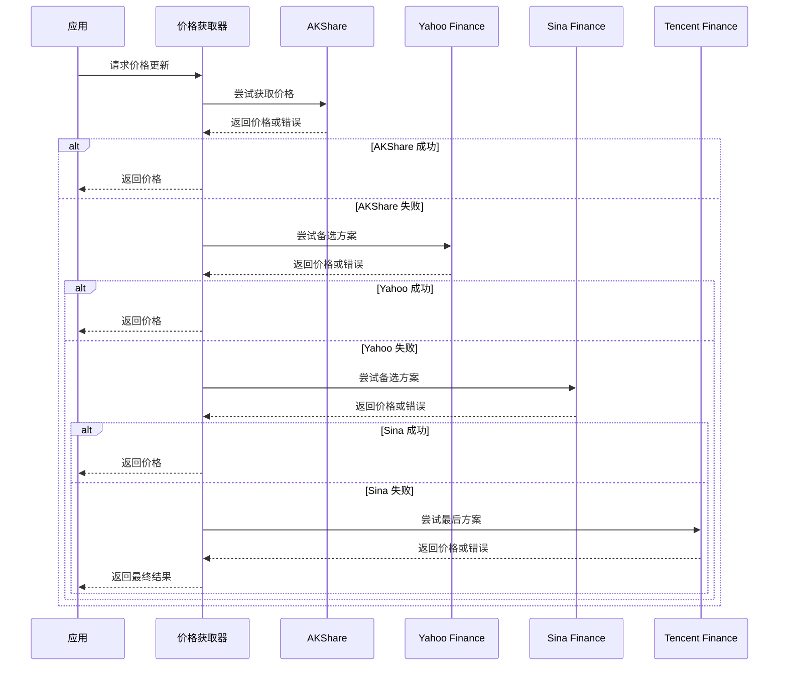
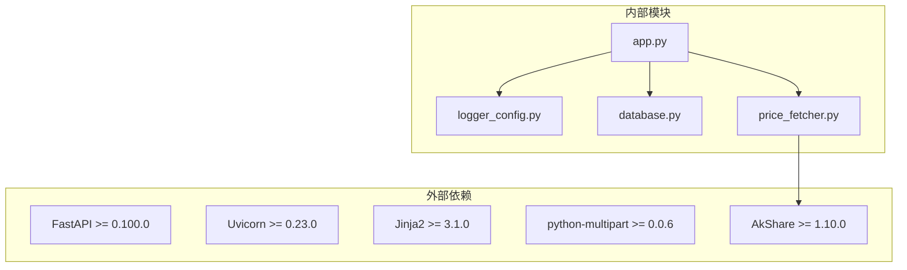

# 监控与日志

<cite>
**本文档引用的文件**
- [app.py](file://app.py)
- [logger_config.py](file://logger_config.py)
- [database.py](file://database.py)
- [price_fetcher.py](file://price_fetcher.py)
- [requirements.txt](file://requirements.txt)
- [templates/base.html](file://templates/base.html)
- [templates/settings.html](file://templates/settings.html)
</cite>

## 目录
1. [简介](#简介)
2. [项目结构](#项目结构)
3. [核心组件](#核心组件)
4. [架构概览](#架构概览)
5. [详细组件分析](#详细组件分析)
6. [依赖关系分析](#依赖关系分析)
7. [性能考虑](#性能考虑)
8. [故障排除指南](#故障排除指南)
9. [结论](#结论)

## 简介

Invest Log 是一个基于 Python FastAPI 的投资交易日志管理系统。该系统提供了完整的交易记录、资产管理和价格追踪功能，同时内置了完善的日志监控体系。本文档专注于系统的监控和日志管理功能，包括日志配置、操作审计、监控指标定义和告警机制。

## 项目结构

Invest Log 采用模块化设计，主要包含以下核心模块：

**图表来源**
- [app.py](file://app.py#L1-L50)
- [database.py](file://database.py#L1-L50)
- [logger_config.py](file://logger_config.py#L1-L30)

**章节来源**
- [app.py](file://app.py#L1-L50)
- [database.py](file://database.py#L1-L50)
- [logger_config.py](file://logger_config.py#L1-L30)

## 核心组件

### 日志管理系统

系统实现了基于时间的轮转日志系统，支持按天自动轮转和7天保留策略：

- **日志级别**: INFO 级别及以上
- **轮转策略**: 每天午夜轮转
- **保留策略**: 最多保留7个历史日志文件
- **输出目标**: 文件和控制台双重输出

### 操作审计系统

系统内置了完整的企业级操作审计功能：

- **审计表**: operation_logs 表记录所有重要操作
- **审计类型**: 交易操作、系统变更、价格更新等
- **审计字段**: 操作类型、符号、货币、详情、数值变化等
- **查询接口**: 支持分页查询和过滤

### 数据库监控

通过 SQLite 内置的性能监控能力，系统可以追踪：

- 查询执行时间
- 数据库连接状态
- 索引使用情况
- 存储空间使用

**章节来源**
- [logger_config.py](file://logger_config.py#L14-L50)
- [database.py](file://database.py#L113-L126)
- [database.py](file://database.py#L733-L772)

## 架构概览

**图表来源**
- [app.py](file://app.py#L236-L261)
- [price_fetcher.py](file://price_fetcher.py#L321-L394)
- [logger_config.py](file://logger_config.py#L24-L32)

## 详细组件分析

### 日志配置组件

#### 日志轮转机制

系统使用 Python 标准库的 `TimedRotatingFileHandler` 实现智能日志轮转：

**图表来源**
- [logger_config.py](file://logger_config.py#L14-L50)

#### 日志格式规范

日志条目包含以下标准字段：
- 时间戳
- 应用名称
- 日志级别
- 详细消息

**章节来源**
- [logger_config.py](file://logger_config.py#L14-L50)

### 操作审计组件

#### 审计表结构

**图表来源**
- [database.py](file://database.py#L113-L126)
- [database.py](file://database.py#L156-L193)

#### 审计操作类型

系统支持的操作审计类型包括：

| 操作类型 | 描述 | 触发场景 |
|---------|------|----------|
| PRICE_UPDATE | 价格更新成功 | 自动或手动更新价格 |
| PRICE_UPDATE_FAILED | 价格更新失败 | 价格获取API调用失败 |
| ASSET_ADJUST | 资产价值调整 | 手动调整资产价值 |
| TRANSACTION_ADD | 交易记录添加 | 新增买入/卖出交易 |
| TRANSACTION_DELETE | 交易记录删除 | 删除现有交易记录 |
| SETTINGS_CHANGE | 设置变更 | 修改配置参数 |

**章节来源**
- [database.py](file://database.py#L733-L772)
- [app.py](file://app.py#L236-L261)

### 数据库监控组件

#### 性能监控指标

系统通过 SQLite 提供的内置功能监控数据库性能：

**图表来源**
- [database.py](file://database.py#L13-L17)
- [database.py](file://database.py#L140-L147)

#### 数据库索引优化

系统为关键查询字段建立了索引：

- symbol 字段索引：加速按符号查询
- transaction_date 字段索引：加速按日期范围查询
- account_id 字段索引：加速按账户查询
- transaction_type 字段索引：加速按交易类型查询
- currency 字段索引：加速按货币查询

**章节来源**
- [database.py](file://database.py#L140-L147)

### 价格获取监控

#### 多源价格获取监控

系统实现了多源价格获取的完整监控机制：

**图表来源**
- [price_fetcher.py](file://price_fetcher.py#L321-L394)

**章节来源**
- [price_fetcher.py](file://price_fetcher.py#L321-L394)

## 依赖关系分析

**图表来源**
- [requirements.txt](file://requirements.txt#L1-L6)
- [app.py](file://app.py#L7-L17)

**章节来源**
- [requirements.txt](file://requirements.txt#L1-L6)

## 性能考虑

### 日志性能优化

1. **异步写入**: 日志写入采用同步阻塞模式，确保数据完整性
2. **轮转策略**: 每天轮转避免单个文件过大
3. **级别过滤**: 只记录INFO级别及以上的日志，减少I/O开销
4. **文件大小**: 限制保留7天日志，控制磁盘使用

### 数据库性能优化

1. **索引策略**: 为高频查询字段建立索引
2. **批量操作**: 事务操作使用批量提交
3. **查询优化**: 使用参数化查询防止SQL注入
4. **连接池**: SQLite连接复用，减少连接开销

### 网络性能优化

1. **超时设置**: API请求设置10秒超时
2. **重试机制**: 多源备选方案提高成功率
3. **缓存策略**: 最新价格缓存减少重复查询

## 故障排除指南

### 日志问题排查

#### 日志文件无法创建

**症状**: 应用启动时报错，无法创建日志文件

**解决方案**:
1. 检查 logs 目录权限
2. 确认磁盘空间充足
3. 验证Python用户对日志目录有写权限

#### 日志轮转异常

**症状**: 日志文件没有按预期轮转

**解决方案**:
1. 检查系统时间是否正确
2. 验证午夜时钟同步
3. 确认文件权限允许重命名操作

### 审计日志问题

#### 审计记录缺失

**症状**: 操作后未看到相应的审计记录

**排查步骤**:
1. 检查数据库连接是否正常
2. 验证 operation_logs 表是否存在
3. 确认审计函数调用链是否完整

#### 审计数据不准确

**症状**: 审计记录中的数值与实际不符

**解决方案**:
1. 检查数据类型转换
2. 验证数值计算逻辑
3. 确认时间戳准确性

### 性能问题诊断

#### 数据库查询缓慢

**症状**: 页面加载缓慢，API响应时间长

**诊断方法**:
1. 检查慢查询日志
2. 分析索引使用情况
3. 监控数据库连接数

**解决方案**:
1. 优化查询语句
2. 添加必要的索引
3. 考虑查询缓存

#### 价格获取失败

**症状**: 价格更新功能异常

**排查步骤**:
1. 检查网络连接
2. 验证API密钥（如需要）
3. 查看备选方案是否可用

**章节来源**
- [logger_config.py](file://logger_config.py#L14-L50)
- [database.py](file://database.py#L733-L772)
- [price_fetcher.py](file://price_fetcher.py#L321-L394)

## 结论

Invest Log 系统提供了完整的监控和日志管理解决方案。通过内置的日志轮转、操作审计和数据库监控功能，系统能够有效支持投资交易管理的运维需求。

### 主要优势

1. **完整的审计跟踪**: 所有重要操作都有详细记录
2. **智能日志管理**: 自动轮转和保留策略
3. **多源价格监控**: 备选方案确保服务可用性
4. **性能监控**: 内置数据库性能监控能力

### 改进建议

1. **扩展监控指标**: 可以添加更多业务指标监控
2. **告警机制**: 可以集成邮件或短信告警
3. **日志分析**: 可以添加日志分析和可视化功能
4. **分布式部署**: 可以支持多实例部署的集中日志收集

该系统为投资交易管理提供了坚实的基础设施，能够满足中小规模应用的监控需求，并为未来的扩展奠定了良好基础。