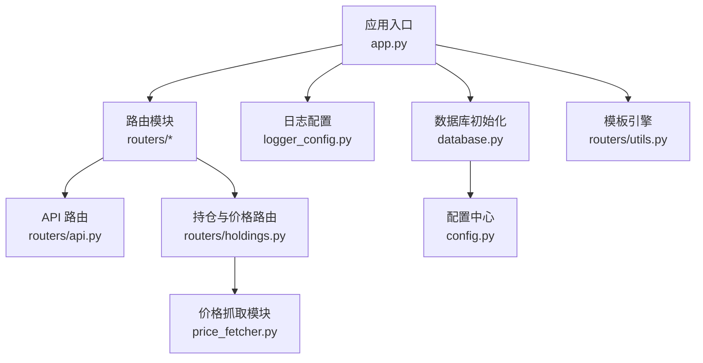
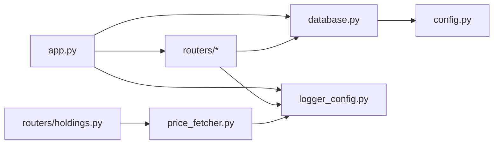

# 监控与日志管理

<cite>
**本文引用的文件列表**
- [app.py](file://app.py)
- [logger_config.py](file://logger_config.py)
- [config.py](file://config.py)
- [database.py](file://database.py)
- [price_fetcher.py](file://price_fetcher.py)
- [routers/api.py](file://routers/api.py)
- [routers/holdings.py](file://routers/holdings.py)
- [routers/utils.py](file://routers/utils.py)
- [requirements.txt](file://requirements.txt)
</cite>

## 目录
1. [简介](#简介)
2. [项目结构](#项目结构)
3. [核心组件](#核心组件)
4. [架构总览](#架构总览)
5. [详细组件分析](#详细组件分析)
6. [依赖关系分析](#依赖关系分析)
7. [性能与监控建议](#性能与监控建议)
8. [故障排查指南](#故障排查指南)
9. [结论](#结论)
10. [附录](#附录)

## 简介
本指南面向“投资日志管理系统”的运维与开发团队，围绕日志配置、日志轮转与保留策略、应用性能监控指标、健康检查与自监控、异常与告警、以及日志分析工具与模式识别方法进行系统化说明。当前代码库已内置基础日志配置与多级日志记录点，但尚未集成外部监控系统（如 Prometheus/Grafana）。本文在不改变现有代码的前提下，提供可落地的扩展方案与最佳实践。

## 项目结构
系统采用 FastAPI + SQLite 的轻量级架构，核心模块包括：
- 应用入口与路由：app.py、routers/* 路由模块
- 日志配置：logger_config.py
- 数据库与配置：config.py、database.py
- 价格抓取：price_fetcher.py
- 模板与静态资源：templates、static



图表来源
- [app.py](file://app.py#L1-L34)
- [routers/api.py](file://routers/api.py#L1-L67)
- [routers/holdings.py](file://routers/holdings.py#L1-L207)
- [logger_config.py](file://logger_config.py#L1-L54)
- [database.py](file://database.py#L1-L151)
- [config.py](file://config.py#L1-L24)
- [routers/utils.py](file://routers/utils.py#L1-L4)

章节来源
- [app.py](file://app.py#L1-L34)
- [routers/api.py](file://routers/api.py#L1-L67)
- [routers/holdings.py](file://routers/holdings.py#L1-L207)
- [logger_config.py](file://logger_config.py#L1-L54)
- [database.py](file://database.py#L1-L151)
- [config.py](file://config.py#L1-L24)
- [routers/utils.py](file://routers/utils.py#L1-L4)

## 核心组件
- 日志系统：基于 Python logging，配置了文件处理器与控制台处理器，按午夜轮转，保留最近 7 天日志。
- 数据库层：SQLite，表结构覆盖交易、账户、资产类型、分配设置、操作日志、最新价格等。
- 价格抓取：多数据源回退策略，支持 A 股、港股、美股、黄金等，记录抓取过程与失败原因。
- API 路由：提供持仓、交易、组合历史等接口，并在关键路径记录日志。
- 配置中心：集中管理数据库路径（iCloud 同步），支持环境变量覆盖。

章节来源
- [logger_config.py](file://logger_config.py#L14-L54)
- [database.py](file://database.py#L22-L151)
- [price_fetcher.py](file://price_fetcher.py#L325-L402)
- [routers/api.py](file://routers/api.py#L8-L67)
- [config.py](file://config.py#L10-L24)

## 架构总览
下图展示从请求到数据库与价格抓取的关键流程，以及日志记录点分布。

```mermaid
sequenceDiagram
participant U as "用户/客户端"
participant API as "API 路由<br/>routers/api.py"
participant DB as "数据库<br/>database.py"
participant PF as "价格抓取<br/>price_fetcher.py"
participant LG as "日志系统<br/>logger_config.py"
U->>API : "GET /api/holdings 或 /api/transactions"
API->>DB : "查询交易/持仓"
DB-->>API : "返回结果"
API-->>U : "JSON 响应"
API->>LG : "记录 INFO/WARNING 等日志"
U->>Hold as "持仓路由<br/>routers/holdings.py"
Hold->>PF : "fetch_price(symbol, currency)"
PF-->>Hold : "价格或错误信息"
Hold->>DB : "写入最新价格/操作日志"
Hold->>LG : "记录 INFO/WARNING/ERROR"
```

图表来源
- [routers/api.py](file://routers/api.py#L8-L67)
- [routers/holdings.py](file://routers/holdings.py#L102-L177)
- [price_fetcher.py](file://price_fetcher.py#L325-L402)
- [database.py](file://database.py#L792-L831)
- [logger_config.py](file://logger_config.py#L14-L54)

## 详细组件分析

### 日志配置与级别使用规范
- 日志目录与轮转
  - 日志目录：logs（相对路径）
  - 轮转策略：按午夜轮转，备份 7 天
  - 编码：UTF-8
  - 格式：包含时间、名称、级别、消息
- 日志级别使用建议
  - DEBUG：调试细节（如价格抓取各服务尝试与异常）
  - INFO：关键业务事件（启动、价格更新、交易删除、快速交易）
  - WARNING：可恢复问题（未找到待删交易、价格更新失败）
  - ERROR：严重问题（所有数据源失败、网络异常等）

章节来源
- [logger_config.py](file://logger_config.py#L14-L54)
- [price_fetcher.py](file://price_fetcher.py#L86-L133)
- [routers/holdings.py](file://routers/holdings.py#L107-L147)
- [routers/api.py](file://routers/api.py#L62-L66)

### 日志轮转策略与存储位置
- 存储位置
  - 文件处理器输出至 logs/app.log
  - 日志文件名带日期后缀（%Y-%m-%d）
- 保留策略
  - 备份天数：7 天
- 控制台输出
  - 同时输出到终端，便于本地开发调试

章节来源
- [logger_config.py](file://logger_config.py#L24-L33)

### 数据库与性能监控
- 表结构与索引
  - 交易表：按 symbol、date、account、type、currency、asset_type 建有索引
  - 最新价格表：唯一键约束（symbol+currency）
  - 操作日志表：记录价格更新、失败、手动更新等
- 查询与性能
  - 查询接口支持多条件过滤与分页
  - 建议在高并发场景下增加连接池与慢查询日志
- 自监控建议
  - 记录慢查询与异常 SQL
  - 统计交易/持仓查询耗时，作为 Prometheus 指标采集来源

章节来源
- [database.py](file://database.py#L28-L151)
- [database.py](file://database.py#L294-L341)
- [database.py](file://database.py#L792-L831)

### 价格抓取与回退策略
- 支持的数据源与优先级
  - AKShare（A 股、港股、美股、黄金）
  - Yahoo Finance（US/HK 股票、黄金）
  - 新浪/腾讯 API（A 股、港股、美股）
- 回退逻辑
  - 按顺序尝试，任一成功即返回；全部失败则汇总错误并记录 ERROR
- 日志记录
  - 成功/失败均有 INFO/WARNING/ERROR 级别日志

章节来源
- [price_fetcher.py](file://price_fetcher.py#L325-L402)

### API 路由与关键日志点
- 持仓与交易查询
  - 返回结果前记录 INFO
- 删除交易
  - 成功记录 INFO，未找到记录 WARNING 并抛出 404
- 组合历史
  - 计算累计值时记录中间状态（可在生产中降级为 DEBUG）

章节来源
- [routers/api.py](file://routers/api.py#L8-L67)

### 应用启动与健康检查
- 启动流程
  - 应用启动时初始化数据库并记录 INFO
- 健康检查建议
  - 可新增 /health 端点，返回数据库连接可用性、日志目录可写、价格抓取依赖可用性等
  - 建议与容器编排健康探针配合

章节来源
- [app.py](file://app.py#L18-L22)

## 依赖关系分析
- 模块耦合
  - app.py 依赖 router、database、logger_config
  - routers/* 依赖 database 与 logger_config
  - price_fetcher 依赖 logger_config
  - database 依赖 config（DB_PATH）
- 外部依赖
  - FastAPI、Uvicorn、Jinja2、akshare（价格抓取）



图表来源
- [app.py](file://app.py#L7-L29)
- [routers/holdings.py](file://routers/holdings.py#L1-L10)
- [price_fetcher.py](file://price_fetcher.py#L20-L20)
- [database.py](file://database.py#L12-L12)
- [config.py](file://config.py#L19-L19)

章节来源
- [requirements.txt](file://requirements.txt#L1-L6)
- [app.py](file://app.py#L7-L29)

## 性能与监控建议

### 应用性能监控指标（建议）
- 请求级指标
  - 请求总数、成功率、平均响应时间、P95/P99 延迟
  - 按路由分组统计（/api/holdings、/api/transactions 等）
- 数据库指标
  - 连接池使用率、慢查询数量与阈值
  - 交易/持仓查询耗时分布
- 价格抓取指标
  - 抓取成功率、失败率、各数据源命中率、平均耗时
- 资源指标
  - CPU 使用率、内存占用、磁盘 IO（日志目录）

### Prometheus 集成（概念性建议）
- 指标采集
  - 在关键函数前后埋点，记录耗时与状态
  - 将数据库查询耗时、价格抓取耗时、HTTP 请求耗时转换为直方图
- 指标命名
  - http_request_duration_seconds{route,method,status}
  - db_query_duration_seconds{sql}
  - price_fetch_duration_seconds{source,status}
- Exporter 选择
  - 使用 Python 客户端（如 prometheus_client）或第三方库（如 aioprometheus）

### Grafana 仪表板（概念性建议）
- 面板建议
  - 请求吞吐与延迟趋势
  - 数据库慢查询 TopN
  - 价格抓取成功率与失败原因分布
  - 日志文件大小与磁盘空间

[本节为通用监控建议，不直接分析具体文件，故无章节来源]

## 故障排查指南

### 常见问题与定位
- 日志未生成或权限不足
  - 检查 logs 目录是否存在且可写
  - 确认轮转是否触发（午夜）
- 数据库连接失败
  - 确认 DB_PATH 是否正确（iCloud 路径或环境变量覆盖）
  - 检查 .db 文件是否被其他进程占用
- 价格抓取失败
  - 查看价格抓取日志中的错误汇总
  - 检查网络与各数据源可用性
- 删除交易返回 404
  - 确认交易 ID 是否存在
  - 查看 WARNING 日志

### 关键日志模式识别
- 启动与初始化
  - 关键词：应用启动、数据库初始化
- 价格抓取
  - 成功：尝试某数据源 -> 成功
  - 失败：所有数据源失败 -> 错误汇总
- 交易操作
  - 删除交易：成功/未找到
  - 快速交易：交易类型、数量、价格
- 持仓与价值调整
  - 价值调整、手动更新、价格更新

章节来源
- [logger_config.py](file://logger_config.py#L14-L54)
- [price_fetcher.py](file://price_fetcher.py#L384-L401)
- [routers/api.py](file://routers/api.py#L62-L66)
- [routers/holdings.py](file://routers/holdings.py#L107-L147)

## 结论
当前系统具备完善的日志配置与多级日志记录点，能够满足基本的可观测性需求。建议在此基础上引入 Prometheus 指标采集与 Grafana 可视化，完善健康检查端点与告警规则，以实现更全面的运行时监控与自动化运维。

## 附录

### 日志级别与使用场景对照
- DEBUG：调试与追踪细节（如价格抓取各服务异常）
- INFO：关键业务事件（启动、价格更新、交易删除、快速交易）
- WARNING：可恢复问题（未找到待删交易、价格更新失败）
- ERROR：严重问题（所有数据源失败、网络异常）

章节来源
- [logger_config.py](file://logger_config.py#L14-L54)
- [price_fetcher.py](file://price_fetcher.py#L384-L401)
- [routers/holdings.py](file://routers/holdings.py#L107-L147)
- [routers/api.py](file://routers/api.py#L62-L66)

### 健康检查端点设计（建议）
- 路径：/health
- 内容：返回数据库连接可用性、日志目录可写、价格抓取依赖可用性
- 建议：与容器编排健康探针结合

[本节为概念性建议，不直接分析具体文件，故无章节来源]

### 异常监控与告警规则（建议）
- 数据库连接失败：持续 N 分钟内连接失败次数超过阈值
- API 调用超时：P95 延迟超过阈值
- 价格抓取失败：连续失败比例超过阈值
- 日志轮转失败：日志目录不可写或磁盘空间不足

[本节为概念性建议，不直接分析具体文件，故无章节来源]

### 日志分析工具与模式识别
- 工具推荐：ELK Stack（Elasticsearch/Filebeat/Logstash/Kibana）、Fluentd、Grafana Loki
- 模式识别：通过正则表达式匹配关键日志模式（如“价格获取失败”、“交易未找到”）

[本节为通用建议，不直接分析具体文件，故无章节来源]